+++
title = "Psychonautics"
description = "Komplexní česká encyklopedie psychoaktivních látek, jejich neurochemie a farmakologie"
insert_anchor_links = "right"
sort_by = "weight"
template = "section.html"
+++

# Psychonautics - Průvodce psychoaktivními látkami

Komplexní česká encyklopedie **psychoaktivních látek**, jejich **biochemie**, **farmakologie** a **neurochemických mechanismů**. Aktuálně **50+ stránek** vědecky podložených informací v akademické kvalitě.

### 📊 Interaktivní databáze

<div class="grid grid-cols-1 md:grid-cols-4 gap-4 mb-6">
    <div class="bg-green-50 dark:bg-green-900/20 border border-green-200 dark:border-green-800 rounded-lg p-4 text-center">
        <div class="text-2xl font-bold text-green-700 dark:text-green-300">8</div>
        <div class="text-sm text-green-600 dark:text-green-400">🧪 Alkaloidy</div>
        <div class="text-xs text-gray-600 dark:text-gray-400 mt-1">Sortable podle typu</div>
    </div>

    <div class="bg-blue-50 dark:bg-blue-900/20 border border-blue-200 dark:border-blue-800 rounded-lg p-4 text-center">
        <div class="text-2xl font-bold text-blue-700 dark:text-blue-300">8</div>
        <div class="text-sm text-blue-600 dark:text-blue-400">🍄 Druhy hub</div>
        <div class="text-xs text-gray-600 dark:text-gray-400 mt-1">Podle potence</div>
    </div>

    <div class="bg-purple-50 dark:bg-purple-900/20 border border-purple-200 dark:border-purple-800 rounded-lg p-4 text-center">
        <div class="text-2xl font-bold text-purple-700 dark:text-purple-300">3+</div>
        <div class="text-sm text-purple-600 dark:text-purple-400">🔗 Receptory</div>
        <div class="text-xs text-gray-600 dark:text-gray-400 mt-1">GPCR/Ionotropní</div>
    </div>

    <div class="bg-orange-50 dark:bg-orange-900/20 border border-orange-200 dark:border-orange-800 rounded-lg p-4 text-center">
        <div class="text-2xl font-bold text-orange-700 dark:text-orange-300">4</div>
        <div class="text-sm text-orange-600 dark:text-orange-400">🧠 Oblasti mozku</div>
        <div class="text-xs text-gray-600 dark:text-gray-400 mt-1">+ psychedelické efekty</div>
    </div>
</div>

**✨ Nové funkce:** Sortable tabulky | Pokročilé vyhledávání | Export dat (CSV/JSON) | Responsive design

---

## Hlavní sekce

### 🧪 [Alkaloidy](@/alkaloids/_index.md) (8 látek)

**Psychoaktivní alkaloidy a jejich struktury** - Interaktivní databáze s pokročilým vyhledáváním a filtrováním podle chemické struktury

<div x-data="advancedTable([
    { alkaloid: '[Psilocybin](@/alkaloids/psilocybin.md)', typ: 'Tryptamin', mechanismus: '[5-HT2A](@/receptors/5-ht2a.md) agonista' },
    { alkaloid: '[Psilocin](@/alkaloids/psilocin.md)', typ: 'Tryptamin', mechanismus: '[5-HT2A](@/receptors/5-ht2a.md) agonista' },
    { alkaloid: '[DMT](@/alkaloids/dmt.md)', typ: 'Tryptamin', mechanismus: '[5-HT2A](@/receptors/5-ht2a.md) agonista' },
    { alkaloid: '[LSD](@/alkaloids/lsd.md)', typ: 'Ergolin', mechanismus: '[5-HT2A](@/receptors/5-ht2a.md)/D2 agonista' },
    { alkaloid: '[Baeocystin](@/alkaloids/baeocystin.md)', typ: 'Tryptamin', mechanismus: '[5-HT2A](@/receptors/5-ht2a.md) agonista' },
    { alkaloid: '[Meskalin](@/alkaloids/mescaline.md)', typ: 'Fenethylamin', mechanismus: '[5-HT2A](@/receptors/5-ht2a.md) agonista' }
], [
    { key: 'alkaloid', label: 'Alkaloid', sortable: true },
    { key: 'typ', label: 'Typ', sortable: true },
    { key: 'mechanismus', label: 'Mechanismus', sortable: true }
])">
    <!-- Search Input -->
    <div class="mb-4">
        <div class="relative">
            <div class="absolute inset-y-0 left-0 flex items-center pl-3 pointer-events-none">
                <svg class="w-4 h-4 text-gray-500 dark:text-gray-400" aria-hidden="true" xmlns="http://www.w3.org/2000/svg" fill="none" viewBox="0 0 20 20">
                    <path stroke="currentColor" stroke-linecap="round" stroke-linejoin="round" stroke-width="2" d="m19 19-4-4m0-7A7 7 0 1 1 1 8a7 7 0 0 1 14 0Z"/>
                </svg>
            </div>
            <input type="text" x-model="searchTerm" @input="search()" class="block w-full p-2 pl-10 text-sm text-gray-900 border border-gray-300 rounded-lg bg-gray-50 focus:ring-blue-500 focus:border-blue-500 dark:bg-gray-700 dark:border-gray-600 dark:placeholder-gray-400 dark:text-white dark:focus:ring-blue-500 dark:focus:border-blue-500" placeholder="Vyhledat alkaloidy...">
        </div>
    </div>

    <!-- Table -->
    <div class="relative overflow-x-auto shadow-md sm:rounded-lg">
        <table class="w-full text-sm text-left rtl:text-right text-gray-500 dark:text-gray-400">
            <thead class="text-xs text-gray-700 uppercase bg-gray-50 dark:bg-gray-700 dark:text-gray-400">
                <tr>
                    <template x-for="column in columns" :key="column.key">
                        <th scope="col" class="px-6 py-3">
                            <div class="flex items-center">
                                <span x-text="column.label"></span>
                                <button x-show="column.sortable" @click="sort(column.key)" class="ml-2">
                                    <svg class="w-3 h-3" aria-hidden="true" xmlns="http://www.w3.org/2000/svg" fill="currentColor" viewBox="0 0 24 24">
                                        <path :d="getSortIcon(column.key)"/>
                                    </svg>
                                </button>
                            </div>
                        </th>
                    </template>
                </tr>
            </thead>
            <tbody>
                <template x-for="item in paginatedData" :key="item.alkaloid">
                    <tr class="odd:bg-white odd:dark:bg-gray-900 even:bg-gray-50 even:dark:bg-gray-800 border-b dark:border-gray-700">
                        <td class="px-6 py-4 font-medium text-gray-900 whitespace-nowrap dark:text-white" x-html="item.alkaloid"></td>
                        <td class="px-6 py-4" x-text="item.typ"></td>
                        <td class="px-6 py-4" x-html="item.mechanismus"></td>
                    </tr>
                </template>
            </tbody>
        </table>
        <div x-show="paginatedData.length === 0" class="px-6 py-4 text-center text-gray-500 dark:text-gray-400">
            Žádné výsledky nenalezeny
        </div>
    </div>
</div>

### 🍄 [Houby](@/shrooms/_index.md) (8 druhů)

**Psychoaktivní houby - Psilocybe, Amanita** - Sortable podle potence psilocybinu s geografickým filtrováním

<div x-data="advancedTable([
    { druh: '[P. azurescens](@/shrooms/psilocybes/azurescens.md)', potence: '**2,51%**', potenceValue: 2.51, region: 'USA' },
    { druh: '[P. semilanceata](@/shrooms/psilocybes/semilanceata.md)', potence: '1,36%', potenceValue: 1.36, region: 'Evropa' },
    { druh: '[P. bohemica](@/shrooms/psilocybes/bohemica.md)', potence: '1,34%', potenceValue: 1.34, region: 'ČR' },
    { druh: '[P. cyanescens](@/shrooms/psilocybes/cyanescens.md)', potence: '0,85%', potenceValue: 0.85, region: 'Svět' },
    { druh: '[P. cubensis](@/shrooms/psilocybes/cubensis.md)', potence: '0,63%', potenceValue: 0.63, region: 'Tropy' },
    { druh: '[P. tampanensis](@/shrooms/psilocybes/tampanensis.md)', potence: '0,41%', potenceValue: 0.41, region: 'Florida' },
    { druh: '[P. mexicana](@/shrooms/psilocybes/mexicana.md)', potence: '0,35%', potenceValue: 0.35, region: 'Mexiko' },
    { druh: '[Amanita muscaria](@/shrooms/amanita-muscaria.md)', potence: 'N/A', potenceValue: 0, region: 'Svět' }
], [
    { key: 'druh', label: 'Druh', sortable: true },
    { key: 'potence', label: 'Potence', sortable: true, sortKey: 'potenceValue' },
    { key: 'region', label: 'Region', sortable: true }
])">
    <!-- Search and Filter Row -->
    <div class="mb-4 grid grid-cols-1 md:grid-cols-2 gap-4">
        <!-- Search Input -->
        <div class="relative">
            <div class="absolute inset-y-0 left-0 flex items-center pl-3 pointer-events-none">
                <svg class="w-4 h-4 text-gray-500 dark:text-gray-400" aria-hidden="true" xmlns="http://www.w3.org/2000/svg" fill="none" viewBox="0 0 20 20">
                    <path stroke="currentColor" stroke-linecap="round" stroke-linejoin="round" stroke-width="2" d="m19 19-4-4m0-7A7 7 0 1 1 1 8a7 7 0 0 1 14 0Z"/>
                </svg>
            </div>
            <input type="text" x-model="searchTerm" @input="search()" class="block w-full p-2 pl-10 text-sm text-gray-900 border border-gray-300 rounded-lg bg-gray-50 focus:ring-blue-500 focus:border-blue-500 dark:bg-gray-700 dark:border-gray-600 dark:placeholder-gray-400 dark:text-white dark:focus:ring-blue-500 dark:focus:border-blue-500" placeholder="Vyhledat houby...">
        </div>

        <!-- Region Filter -->
        <select @change="filterBy('region', $event.target.value)" class="block w-full p-2 text-sm text-gray-900 border border-gray-300 rounded-lg bg-gray-50 focus:ring-blue-500 focus:border-blue-500 dark:bg-gray-700 dark:border-gray-600 dark:placeholder-gray-400 dark:text-white dark:focus:ring-blue-500 dark:focus:border-blue-500">
            <option value="">Všechny regiony</option>
            <template x-for="region in getUniqueValues('region')">
                <option :value="region" x-text="region"></option>
            </template>
        </select>
    </div>

    <!-- Table -->
    <div class="relative overflow-x-auto shadow-md sm:rounded-lg">
        <table class="w-full text-sm text-left rtl:text-right text-gray-500 dark:text-gray-400">
            <thead class="text-xs text-gray-700 uppercase bg-gray-50 dark:bg-gray-700 dark:text-gray-400">
                <tr>
                    <template x-for="column in columns" :key="column.key">
                        <th scope="col" class="px-6 py-3">
                            <div class="flex items-center">
                                <span x-text="column.label"></span>
                                <button x-show="column.sortable" @click="sort(column.sortKey || column.key)" class="ml-2">
                                    <svg class="w-3 h-3" aria-hidden="true" xmlns="http://www.w3.org/2000/svg" fill="currentColor" viewBox="0 0 24 24">
                                        <path :d="getSortIcon(column.sortKey || column.key)"/>
                                    </svg>
                                </button>
                            </div>
                        </th>
                    </template>
                </tr>
            </thead>
            <tbody>
                <template x-for="item in paginatedData" :key="item.druh">
                    <tr class="odd:bg-white odd:dark:bg-gray-900 even:bg-gray-50 even:dark:bg-gray-800 border-b dark:border-gray-700">
                        <td class="px-6 py-4 font-medium text-gray-900 whitespace-nowrap dark:text-white" x-html="item.druh"></td>
                        <td class="px-6 py-4" x-html="item.potence"></td>
                        <td class="px-6 py-4" x-text="item.region"></td>
                    </tr>
                </template>
            </tbody>
        </table>
        <div x-show="paginatedData.length === 0" class="px-6 py-4 text-center text-gray-500 dark:text-gray-400">
            Žádné výsledky nenalezeny
        </div>
    </div>
</div>

### 🔗 [Receptory](@/receptors/_index.md) (NOVÉ)

**Neurotransmiterové receptory a jejich farmakologie** - Interaktivní explorer s filtrováním podle typu (GPCR/Ionotropní)

<div x-data="advancedTable([
    { receptor: '[5-HT2A](@/receptors/5-ht2a.md)', typ: 'GPCR', funkce: 'Halucinace', ligandy: 'Psychedelika' },
    { receptor: '[NMDA](@/receptors/nmda.md)', typ: 'Ionotropní', funkce: 'Plasticita', ligandy: 'Ketamin, [K. ibotenová](@/neurotoxins/ibotenic-acid.md)' }
], [
    { key: 'receptor', label: 'Receptor', sortable: true },
    { key: 'typ', label: 'Typ', sortable: true },
    { key: 'funkce', label: 'Funkce', sortable: true },
    { key: 'ligandy', label: 'Ligandy', sortable: true }
])">
    <!-- Search Input -->
    <div class="mb-4">
        <div class="relative">
            <div class="absolute inset-y-0 left-0 flex items-center pl-3 pointer-events-none">
                <svg class="w-4 h-4 text-gray-500 dark:text-gray-400" aria-hidden="true" xmlns="http://www.w3.org/2000/svg" fill="none" viewBox="0 0 20 20">
                    <path stroke="currentColor" stroke-linecap="round" stroke-linejoin="round" stroke-width="2" d="m19 19-4-4m0-7A7 7 0 1 1 1 8a7 7 0 0 1 14 0Z"/>
                </svg>
            </div>
            <input type="text" x-model="searchTerm" @input="search()" class="block w-full p-2 pl-10 text-sm text-gray-900 border border-gray-300 rounded-lg bg-gray-50 focus:ring-blue-500 focus:border-blue-500 dark:bg-gray-700 dark:border-gray-600 dark:placeholder-gray-400 dark:text-white dark:focus:ring-blue-500 dark:focus:border-blue-500" placeholder="Vyhledat receptory...">
        </div>
    </div>

    <!-- Table -->
    <div class="relative overflow-x-auto shadow-md sm:rounded-lg">
        <table class="w-full text-sm text-left rtl:text-right text-gray-500 dark:text-gray-400">
            <thead class="text-xs text-gray-700 uppercase bg-gray-50 dark:bg-gray-700 dark:text-gray-400">
                <tr>
                    <template x-for="column in columns" :key="column.key">
                        <th scope="col" class="px-6 py-3">
                            <div class="flex items-center">
                                <span x-text="column.label"></span>
                                <button x-show="column.sortable" @click="sort(column.key)" class="ml-2">
                                    <svg class="w-3 h-3" aria-hidden="true" xmlns="http://www.w3.org/2000/svg" fill="currentColor" viewBox="0 0 24 24">
                                        <path :d="getSortIcon(column.key)"/>
                                    </svg>
                                </button>
                            </div>
                        </th>
                    </template>
                </tr>
            </thead>
            <tbody>
                <template x-for="item in paginatedData" :key="item.receptor">
                    <tr class="odd:bg-white odd:dark:bg-gray-900 even:bg-gray-50 even:dark:bg-gray-800 border-b dark:border-gray-700">
                        <td class="px-6 py-4 font-medium text-gray-900 whitespace-nowrap dark:text-white" x-html="item.receptor"></td>
                        <td class="px-6 py-4" x-text="item.typ"></td>
                        <td class="px-6 py-4" x-text="item.funkce"></td>
                        <td class="px-6 py-4" x-html="item.ligandy"></td>
                    </tr>
                </template>
            </tbody>
        </table>
        <div x-show="paginatedData.length === 0" class="px-6 py-4 text-center text-gray-500 dark:text-gray-400">
            Žádné výsledky nenalezeny
        </div>
    </div>
</div>

### 🧠 [Mozek](@/brain/_index.md) (NOVÉ)

**Neuroanatomie a mozkové oblasti** - Interaktivní brain region explorer s popisem psychedelických efektů

<div x-data="advancedTable([
    { oblast: 'Prefrontální kortex', funkce: 'Exekutivní funkce', vliv: 'Změněná kognice' },
    { oblast: 'Vizuální kortex', funkce: 'Zrak', vliv: 'Halucinace' },
    { oblast: 'Claustrum', funkce: 'Integrace vědomí', vliv: 'Ego dissolution' },
    { oblast: 'Default Mode Network', funkce: 'Self-reference', vliv: 'Suprese' }
], [
    { key: 'oblast', label: 'Oblast', sortable: true },
    { key: 'funkce', label: 'Funkce', sortable: true },
    { key: 'vliv', label: 'Vliv psychedelik', sortable: true }
])">
    <!-- Search Input -->
    <div class="mb-4">
        <div class="relative">
            <div class="absolute inset-y-0 left-0 flex items-center pl-3 pointer-events-none">
                <svg class="w-4 h-4 text-gray-500 dark:text-gray-400" aria-hidden="true" xmlns="http://www.w3.org/2000/svg" fill="none" viewBox="0 0 20 20">
                    <path stroke="currentColor" stroke-linecap="round" stroke-linejoin="round" stroke-width="2" d="m19 19-4-4m0-7A7 7 0 1 1 1 8a7 7 0 0 1 14 0Z"/>
                </svg>
            </div>
            <input type="text" x-model="searchTerm" @input="search()" class="block w-full p-2 pl-10 text-sm text-gray-900 border border-gray-300 rounded-lg bg-gray-50 focus:ring-blue-500 focus:border-blue-500 dark:bg-gray-700 dark:border-gray-600 dark:placeholder-gray-400 dark:text-white dark:focus:ring-blue-500 dark:focus:border-blue-500" placeholder="Vyhledat oblasti mozku...">
        </div>
    </div>

    <!-- Table -->
    <div class="relative overflow-x-auto shadow-md sm:rounded-lg">
        <table class="w-full text-sm text-left rtl:text-right text-gray-500 dark:text-gray-400">
            <thead class="text-xs text-gray-700 uppercase bg-gray-50 dark:bg-gray-700 dark:text-gray-400">
                <tr>
                    <template x-for="column in columns" :key="column.key">
                        <th scope="col" class="px-6 py-3">
                            <div class="flex items-center">
                                <span x-text="column.label"></span>
                                <button x-show="column.sortable" @click="sort(column.key)" class="ml-2">
                                    <svg class="w-3 h-3" aria-hidden="true" xmlns="http://www.w3.org/2000/svg" fill="currentColor" viewBox="0 0 24 24">
                                        <path :d="getSortIcon(column.key)"/>
                                    </svg>
                                </button>
                            </div>
                        </th>
                    </template>
                </tr>
            </thead>
            <tbody>
                <template x-for="item in paginatedData" :key="item.oblast">
                    <tr class="odd:bg-white odd:dark:bg-gray-900 even:bg-gray-50 even:dark:bg-gray-800 border-b dark:border-gray-700">
                        <td class="px-6 py-4 font-medium text-gray-900 whitespace-nowrap dark:text-white" x-text="item.oblast"></td>
                        <td class="px-6 py-4" x-text="item.funkce"></td>
                        <td class="px-6 py-4" x-text="item.vliv"></td>
                    </tr>
                </template>
            </tbody>
        </table>
        <div x-show="paginatedData.length === 0" class="px-6 py-4 text-center text-gray-500 dark:text-gray-400">
            Žádné výsledky nenalezeny
        </div>
    </div>
</div>

### [Neurální okruhy](@/circuits/_index.md) (NOVÉ)

Funkční mozkové sítě

<div x-data="advancedTable([
    { okruh: 'DMN', funkce: 'Self-reference, rumináce', efekt: 'Dezintegrace' },
    { okruh: 'Salience Network', funkce: 'Detekce důležitosti', efekt: 'Zvýšená aktivita' },
    { okruh: 'Serotoninergní', funkce: 'Nálada, percepce', efekt: 'Modulace' }
], [
    { key: 'okruh', label: 'Okruh', sortable: true },
    { key: 'funkce', label: 'Funkce', sortable: true },
    { key: 'efekt', label: 'Psychedelický efekt', sortable: true }
])">
    <!-- Search Input -->
    <div class="mb-4">
        <div class="relative">
            <div class="absolute inset-y-0 left-0 flex items-center pl-3 pointer-events-none">
                <svg class="w-4 h-4 text-gray-500 dark:text-gray-400" aria-hidden="true" xmlns="http://www.w3.org/2000/svg" fill="none" viewBox="0 0 20 20">
                    <path stroke="currentColor" stroke-linecap="round" stroke-linejoin="round" stroke-width="2" d="m19 19-4-4m0-7A7 7 0 1 1 1 8a7 7 0 0 1 14 0Z"/>
                </svg>
            </div>
            <input type="text" x-model="searchTerm" @input="search()" class="block w-full p-2 pl-10 text-sm text-gray-900 border border-gray-300 rounded-lg bg-gray-50 focus:ring-blue-500 focus:border-blue-500 dark:bg-gray-700 dark:border-gray-600 dark:placeholder-gray-400 dark:text-white dark:focus:ring-blue-500 dark:focus:border-blue-500" placeholder="Vyhledat neurální okruhy...">
        </div>
    </div>

    <!-- Table -->
    <div class="relative overflow-x-auto shadow-md sm:rounded-lg">
        <table class="w-full text-sm text-left rtl:text-right text-gray-500 dark:text-gray-400">
            <thead class="text-xs text-gray-700 uppercase bg-gray-50 dark:bg-gray-700 dark:text-gray-400">
                <tr>
                    <template x-for="column in columns" :key="column.key">
                        <th scope="col" class="px-6 py-3">
                            <div class="flex items-center">
                                <span x-text="column.label"></span>
                                <button x-show="column.sortable" @click="sort(column.key)" class="ml-2">
                                    <svg class="w-3 h-3" aria-hidden="true" xmlns="http://www.w3.org/2000/svg" fill="currentColor" viewBox="0 0 24 24">
                                        <path :d="getSortIcon(column.key)"/>
                                    </svg>
                                </button>
                            </div>
                        </th>
                    </template>
                </tr>
            </thead>
            <tbody>
                <template x-for="item in paginatedData" :key="item.okruh">
                    <tr class="odd:bg-white odd:dark:bg-gray-900 even:bg-gray-50 even:dark:bg-gray-800 border-b dark:border-gray-700">
                        <td class="px-6 py-4 font-medium text-gray-900 whitespace-nowrap dark:text-white" x-text="item.okruh"></td>
                        <td class="px-6 py-4" x-text="item.funkce"></td>
                        <td class="px-6 py-4" x-text="item.efekt"></td>
                    </tr>
                </template>
            </tbody>
        </table>
        <div x-show="paginatedData.length === 0" class="px-6 py-4 text-center text-gray-500 dark:text-gray-400">
            Žádné výsledky nenalezeny
        </div>
    </div>
</div>

### [Neurotoxiny](@/neurotoxins/_index.md)

- [Kyselina ibotenová](@/neurotoxins/ibotenic-acid.md) - [NMDA](@/receptors/nmda.md) agonista, prekurzor muscimolu

### [Nukleotidy](@/nucleotids/_index.md)

Energetické a signální molekuly: [ATP](@/nucleotids/atp.md), [cAMP](@/nucleotids/camp.md), [GTP](@/nucleotids/gtp.md)...

### [Mechanismy ucinku](@/mechanisms/_index.md) (NOVE)

Molekularni mechanismy ucinku psychoaktivnich latek

<div x-data="advancedTable([
    { sekce: '[Receptorova kinetika](@/mechanisms/receptor-binding.md)', obsah: 'Ki/Kd, vazebna kinetika, SAR', vyznam: 'Davkova optimalizace' },
    { sekce: '[Signalni transdukce](@/mechanisms/signal-transduction.md)', obsah: 'GPCR, ionotropni, beta-arrestin', vyznam: 'Biased agonismus' },
    { sekce: '[Alostericka modulace](@/mechanisms/allosteric-modulation.md)', obsah: 'PAM, NAM, subtypova selektivita', vyznam: 'Novy drug design' },
    { sekce: '[PK-PD vztahy](@/mechanisms/pharmacokinetic-pharmacodynamic.md)', obsah: 'ADME, doza-odpoved, farmakogenetika', vyznam: 'Terapeuticke davkovani' }
], [
    { key: 'sekce', label: 'Sekce', sortable: true },
    { key: 'obsah', label: 'Obsah', sortable: true },
    { key: 'vyznam', label: 'Klinicky vyznam', sortable: true }
])">
    <!-- Search Input -->
    <div class="mb-4">
        <div class="relative">
            <div class="absolute inset-y-0 left-0 flex items-center pl-3 pointer-events-none">
                <svg class="w-4 h-4 text-gray-500 dark:text-gray-400" aria-hidden="true" xmlns="http://www.w3.org/2000/svg" fill="none" viewBox="0 0 20 20">
                    <path stroke="currentColor" stroke-linecap="round" stroke-linejoin="round" stroke-width="2" d="m19 19-4-4m0-7A7 7 0 1 1 1 8a7 7 0 0 1 14 0Z"/>
                </svg>
            </div>
            <input type="text" x-model="searchTerm" @input="search()" class="block w-full p-2 pl-10 text-sm text-gray-900 border border-gray-300 rounded-lg bg-gray-50 focus:ring-blue-500 focus:border-blue-500 dark:bg-gray-700 dark:border-gray-600 dark:placeholder-gray-400 dark:text-white dark:focus:ring-blue-500 dark:focus:border-blue-500" placeholder="Vyhledat mechanismy účinku...">
        </div>
    </div>

    <!-- Table -->
    <div class="relative overflow-x-auto shadow-md sm:rounded-lg">
        <table class="w-full text-sm text-left rtl:text-right text-gray-500 dark:text-gray-400">
            <thead class="text-xs text-gray-700 uppercase bg-gray-50 dark:bg-gray-700 dark:text-gray-400">
                <tr>
                    <template x-for="column in columns" :key="column.key">
                        <th scope="col" class="px-6 py-3">
                            <div class="flex items-center">
                                <span x-text="column.label"></span>
                                <button x-show="column.sortable" @click="sort(column.key)" class="ml-2">
                                    <svg class="w-3 h-3" aria-hidden="true" xmlns="http://www.w3.org/2000/svg" fill="currentColor" viewBox="0 0 24 24">
                                        <path :d="getSortIcon(column.key)"/>
                                    </svg>
                                </button>
                            </div>
                        </th>
                    </template>
                </tr>
            </thead>
            <tbody>
                <template x-for="item in paginatedData" :key="item.sekce">
                    <tr class="odd:bg-white odd:dark:bg-gray-900 even:bg-gray-50 even:dark:bg-gray-800 border-b dark:border-gray-700">
                        <td class="px-6 py-4 font-medium text-gray-900 whitespace-nowrap dark:text-white" x-html="item.sekce"></td>
                        <td class="px-6 py-4" x-text="item.obsah"></td>
                        <td class="px-6 py-4" x-text="item.vyznam"></td>
                    </tr>
                </template>
            </tbody>
        </table>
        <div x-show="paginatedData.length === 0" class="px-6 py-4 text-center text-gray-500 dark:text-gray-400">
            Žádné výsledky nenalezeny
        </div>
    </div>
</div>

### [Glosář](@/glossary/_index.md)

Definice pojmů: [Receptor](@/glossary/receptor.md), [GABA](@/glossary/gaba.md), [Fosfát](@/glossary/fosfat.md)...

---

## 🔬 Srovnání potence (5-HT2A afinita)

**Interaktivní tabulka s řazením podle afinity a konverzí jednotek** - Ki hodnoty seřazené podle vazby na 5-HT2A receptor

<div x-data="advancedTable([
    { latka: '[LSD](@/alkaloids/lsd.md)', ki: '**1-2**', kiValue: 1.5, davka: '50-200 μg', trvani: '8-12 h' },
    { latka: '[Psilocin](@/alkaloids/psilocin.md)', ki: '6-15', kiValue: 10.5, davka: '10-25 mg', trvani: '4-6 h' },
    { latka: '[DMT](@/alkaloids/dmt.md)', ki: '75-130', kiValue: 102.5, davka: '15-60 mg', trvani: '15 min (inh.)' },
    { latka: '[Psilocybin](@/alkaloids/psilocybin.md)', ki: '(prodrug)', kiValue: 999, davka: '15-30 mg', trvani: '4-6 h' },
    { latka: '[Meskalin](@/alkaloids/mescaline.md)', ki: '5000+', kiValue: 5000, davka: '200-400 mg', trvani: '8-12 h' },
], [
    { key: 'latka', label: 'Látka', sortable: true },
    { key: 'ki', label: 'Ki (nM)', sortable: true, sortKey: 'kiValue' },
    { key: 'davka', label: 'Aktivní dávka', sortable: false },
    { key: 'trvani', label: 'Trvání', sortable: false }
])">
    <!-- Search and Filter Row -->
    <div class="mb-4 grid grid-cols-1 md:grid-cols-2 gap-4">
        <!-- Search Input -->
        <div class="relative">
            <div class="absolute inset-y-0 left-0 flex items-center pl-3 pointer-events-none">
                <svg class="w-4 h-4 text-gray-500 dark:text-gray-400" aria-hidden="true" xmlns="http://www.w3.org/2000/svg" fill="none" viewBox="0 0 20 20">
                    <path stroke="currentColor" stroke-linecap="round" stroke-linejoin="round" stroke-width="2" d="m19 19-4-4m0-7A7 7 0 1 1 1 8a7 7 0 0 1 14 0Z"/>
                </svg>
            </div>
            <input type="text" x-model="searchTerm" @input="search()" class="block w-full p-2 pl-10 text-sm text-gray-900 border border-gray-300 rounded-lg bg-gray-50 focus:ring-blue-500 focus:border-blue-500 dark:bg-gray-700 dark:border-gray-600 dark:placeholder-gray-400 dark:text-white dark:focus:ring-blue-500 dark:focus:border-blue-500" placeholder="Vyhledat látky...">
        </div>

        <!-- Export Button -->
        <div class="flex gap-2">
            <button @click="exportToCSV('potence-srovnani.csv')" class="px-4 py-2 text-sm font-medium text-gray-900 bg-white border border-gray-200 rounded-lg hover:bg-gray-100 hover:text-blue-700 focus:z-10 focus:ring-2 focus:ring-blue-700 focus:text-blue-700 dark:bg-gray-700 dark:border-gray-600 dark:text-white dark:hover:text-white dark:hover:bg-gray-600 dark:focus:ring-blue-500 dark:focus:text-white">
                <svg class="w-4 h-4 inline mr-1" fill="none" stroke="currentColor" viewBox="0 0 24 24">
                    <path stroke-linecap="round" stroke-linejoin="round" stroke-width="2" d="M12 10v6m0 0l-3-3m3 3l3-3M3 17V7a2 2 0 012-2h6l2 2h6a2 2 0 012 2v10a2 2 0 01-2 2H5a2 2 0 01-2-2z"></path>
                </svg>
                CSV
            </button>
        </div>
    </div>

    <!-- Table -->
    <div class="relative overflow-x-auto shadow-md sm:rounded-lg">
        <table class="w-full text-sm text-left rtl:text-right text-gray-500 dark:text-gray-400">
            <thead class="text-xs text-gray-700 uppercase bg-gray-50 dark:bg-gray-700 dark:text-gray-400">
                <tr>
                    <template x-for="column in columns" :key="column.key">
                        <th scope="col" class="px-6 py-3">
                            <div class="flex items-center">
                                <span x-text="column.label"></span>
                                <button x-show="column.sortable" @click="sort(column.sortKey || column.key)" class="ml-2">
                                    <svg class="w-3 h-3" aria-hidden="true" xmlns="http://www.w3.org/2000/svg" fill="currentColor" viewBox="0 0 24 24">
                                        <path :d="getSortIcon(column.sortKey || column.key)"/>
                                    </svg>
                                </button>
                            </div>
                        </th>
                    </template>
                </tr>
            </thead>
            <tbody>
                <template x-for="item in paginatedData" :key="item.latka">
                    <tr class="odd:bg-white odd:dark:bg-gray-900 even:bg-gray-50 even:dark:bg-gray-800 border-b dark:border-gray-700">
                        <td class="px-6 py-4 font-medium text-gray-900 whitespace-nowrap dark:text-white" x-html="item.latka"></td>
                        <td class="px-6 py-4" x-html="item.ki"></td>
                        <td class="px-6 py-4" x-text="item.davka"></td>
                        <td class="px-6 py-4" x-text="item.trvani"></td>
                    </tr>
                </template>
            </tbody>
        </table>
        <div x-show="paginatedData.length === 0" class="px-6 py-4 text-center text-gray-500 dark:text-gray-400">
            Žádné výsledky nenalezeny
        </div>
    </div>
</div>

---

## 🏷️ Klasifikace psychoaktivních látek

**Farmakologické kategorie podle mechanismu účinku** - Sortable databáze s filtrováním podle receptorových typů

<div x-data="advancedTable([
    { kategorie: '**Psychedelika**', receptor: '[5-HT2A](@/receptors/5-ht2a.md)', priklady: '[Psilocybin](@/alkaloids/psilocybin.md), [LSD](@/alkaloids/lsd.md), [DMT](@/alkaloids/dmt.md), [Meskalin](@/alkaloids/mescaline.md)' },
    { kategorie: '**Disociativa**', receptor: '[NMDA](@/receptors/nmda.md) antagonismus', priklady: 'Ketamin, PCP' },
    { kategorie: '**Deliriantia**', receptor: 'mAChR antagonismus', priklady: 'Skopolamin, Atropin' },
], [
    { key: 'kategorie', label: 'Kategorie', sortable: true },
    { key: 'receptor', label: 'Receptor', sortable: true },
    { key: 'priklady', label: 'Příklady', sortable: false }
])">
    <!-- Search Input -->
    <div class="mb-4">
        <div class="relative">
            <div class="absolute inset-y-0 left-0 flex items-center pl-3 pointer-events-none">
                <svg class="w-4 h-4 text-gray-500 dark:text-gray-400" aria-hidden="true" xmlns="http://www.w3.org/2000/svg" fill="none" viewBox="0 0 20 20">
                    <path stroke="currentColor" stroke-linecap="round" stroke-linejoin="round" stroke-width="2" d="m19 19-4-4m0-7A7 7 0 1 1 1 8a7 7 0 0 1 14 0Z"/>
                </svg>
            </div>
            <input type="text" x-model="searchTerm" @input="search()" class="block w-full p-2 pl-10 text-sm text-gray-900 border border-gray-300 rounded-lg bg-gray-50 focus:ring-blue-500 focus:border-blue-500 dark:bg-gray-700 dark:border-gray-600 dark:placeholder-gray-400 dark:text-white dark:focus:ring-blue-500 dark:focus:border-blue-500" placeholder="Vyhledat kategorie látek...">
        </div>
    </div>

    <!-- Table -->
    <div class="relative overflow-x-auto shadow-md sm:rounded-lg">
        <table class="w-full text-sm text-left rtl:text-right text-gray-500 dark:text-gray-400">
            <thead class="text-xs text-gray-700 uppercase bg-gray-50 dark:bg-gray-700 dark:text-gray-400">
                <tr>
                    <template x-for="column in columns" :key="column.key">
                        <th scope="col" class="px-6 py-3">
                            <div class="flex items-center">
                                <span x-text="column.label"></span>
                                <button x-show="column.sortable" @click="sort(column.key)" class="ml-2">
                                    <svg class="w-3 h-3" aria-hidden="true" xmlns="http://www.w3.org/2000/svg" fill="currentColor" viewBox="0 0 24 24">
                                        <path :d="getSortIcon(column.key)"/>
                                    </svg>
                                </button>
                            </div>
                        </th>
                    </template>
                </tr>
            </thead>
            <tbody>
                <template x-for="item in paginatedData" :key="item.kategorie">
                    <tr class="odd:bg-white odd:dark:bg-gray-900 even:bg-gray-50 even:dark:bg-gray-800 border-b dark:border-gray-700">
                        <td class="px-6 py-4 font-medium text-gray-900 whitespace-nowrap dark:text-white" x-html="item.kategorie"></td>
                        <td class="px-6 py-4" x-html="item.receptor"></td>
                        <td class="px-6 py-4" x-html="item.priklady"></td>
                    </tr>
                </template>
            </tbody>
        </table>
        <div x-show="paginatedData.length === 0" class="px-6 py-4 text-center text-gray-500 dark:text-gray-400">
            Žádné výsledky nenalezeny
        </div>
    </div>
</div>

---

## Mechanismy ucinku (prehled)

Detailni zpracovani viz [Mechanismy ucinku](@/mechanisms/_index.md) -- receptorova kinetika, signalni transdukce, alostericka modulace, PK-PD vztahy.

### Psychedelika a mozek

```mermaid
flowchart TD
    node_Psychedelikum["Psychedelikum"]
    node_5HT2Areceptorkortex["5-HT2A receptor kortex"]
    node_GqsignalizaceCaPKC["Gq signalizace  Ca²⁺  PKC"]
    node_Zmnnneuronlnaktivita["Změněná neuronální aktivita"]
    node_DMNsupreseegodissolu["DMN suprese ego dissolution"]
    node_Vizulnkortexhalucina["Vizuální kortex  halucinace"]
    node_Entropieflexibilita["Entropie  flexibilita"]
    node_ZMNNSTAVVDOM["ZMĚNĚNÝ STAV VĚDOMÍ"]

    node_Psychedelikum --> node_5HT2Areceptorkortex
    node_5HT2Areceptorkortex --> node_GqsignalizaceCaPKC
    node_GqsignalizaceCaPKC --> node_Zmnnneuronlnaktivita
    node_Zmnnneuronlnaktivita --> node_DMNsupreseegodissolu
    node_DMNsupreseegodissolu --> node_Vizulnkortexhalucina
    node_Vizulnkortexhalucina --> node_Entropieflexibilita
    node_Entropieflexibilita --> node_ZMNNSTAVVDOM

    click node_5HT2Areceptorkortex "/receptors/5-ht2a/" "5-HT2A receptor kortex"
```



<details>
<summary>ASCII verze diagramu</summary>

```
Psychedelikum
      │
      ↓
┌─────────────────────────────────────┐
│  5-HT2A receptor (kortex)           │
│         ↓                           │
│  Gq signalizace → Ca²⁺ → PKC        │
│         ↓                           │
│  Změněná neuronální aktivita        │
│         ↓                           │
│  ┌───────────────────────────────┐  │
│  │ DMN suprese (ego dissolution) │  │
│  │ Vizuální kortex ↑ (halucinace)│  │
│  │ Entropie ↑ (flexibilita)      │  │
│  └───────────────────────────────┘  │
│         ↓                           │
│  ZMĚNĚNÝ STAV VĚDOMÍ                │
└─────────────────────────────────────┘
```

</details>

---

## Bezpečnost a legalita

**Upozornění**: Většina psychoaktivních látek je v České republice zakázána **Nařízením vlády č. 463/2013 Sb.**

### Harm Reduction (4S)

<div x-data="advancedTable([
    { princip: '**Set**', popis: 'Psychický stav uživatele' },
    { princip: '**Setting**', popis: 'Bezpečné prostředí' },
    { princip: '**Substance**', popis: 'Identifikace a správná dávka' },
    { princip: '**Sitter**', popis: 'Střízlivý průvodce' }
], [
    { key: 'princip', label: 'Princip', sortable: true },
    { key: 'popis', label: 'Popis', sortable: true }
])">
    <!-- Search Input -->
    <div class="mb-4">
        <div class="relative">
            <div class="absolute inset-y-0 left-0 flex items-center pl-3 pointer-events-none">
                <svg class="w-4 h-4 text-gray-500 dark:text-gray-400" aria-hidden="true" xmlns="http://www.w3.org/2000/svg" fill="none" viewBox="0 0 20 20">
                    <path stroke="currentColor" stroke-linecap="round" stroke-linejoin="round" stroke-width="2" d="m19 19-4-4m0-7A7 7 0 1 1 1 8a7 7 0 0 1 14 0Z"/>
                </svg>
            </div>
            <input type="text" x-model="searchTerm" @input="search()" class="block w-full p-2 pl-10 text-sm text-gray-900 border border-gray-300 rounded-lg bg-gray-50 focus:ring-blue-500 focus:border-blue-500 dark:bg-gray-700 dark:border-gray-600 dark:placeholder-gray-400 dark:text-white dark:focus:ring-blue-500 dark:focus:border-blue-500" placeholder="Vyhledat principy harm reduction...">
        </div>
    </div>

    <!-- Table -->
    <div class="relative overflow-x-auto shadow-md sm:rounded-lg">
        <table class="w-full text-sm text-left rtl:text-right text-gray-500 dark:text-gray-400">
            <thead class="text-xs text-gray-700 uppercase bg-gray-50 dark:bg-gray-700 dark:text-gray-400">
                <tr>
                    <template x-for="column in columns" :key="column.key">
                        <th scope="col" class="px-6 py-3">
                            <div class="flex items-center">
                                <span x-text="column.label"></span>
                                <button x-show="column.sortable" @click="sort(column.key)" class="ml-2">
                                    <svg class="w-3 h-3" aria-hidden="true" xmlns="http://www.w3.org/2000/svg" fill="currentColor" viewBox="0 0 24 24">
                                        <path :d="getSortIcon(column.key)"/>
                                    </svg>
                                </button>
                            </div>
                        </th>
                    </template>
                </tr>
            </thead>
            <tbody>
                <template x-for="item in paginatedData" :key="item.princip">
                    <tr class="odd:bg-white odd:dark:bg-gray-900 even:bg-gray-50 even:dark:bg-gray-800 border-b dark:border-gray-700">
                        <td class="px-6 py-4 font-medium text-gray-900 whitespace-nowrap dark:text-white" x-html="item.princip"></td>
                        <td class="px-6 py-4" x-text="item.popis"></td>
                    </tr>
                </template>
            </tbody>
        </table>
        <div x-show="paginatedData.length === 0" class="px-6 py-4 text-center text-gray-500 dark:text-gray-400">
            Žádné výsledky nenalezeny
        </div>
    </div>
</div>

---

## O projektu

**Psychonautics** je open-source česká encyklopedie zaměřená na vědecky podložené informace o psychoaktivních látkách.

<div x-data="advancedTable([
    { statistika: 'Stránek', hodnota: '50+' },
    { statistika: 'Alkaloidů', hodnota: '8' },
    { statistika: 'Druhů hub', hodnota: '8' },
    { statistika: 'Receptorů', hodnota: '3+' },
    { statistika: 'Mechanismu', hodnota: '4' },
    { statistika: 'Sekcí', hodnota: '10' }
], [
    { key: 'statistika', label: 'Statistika', sortable: true },
    { key: 'hodnota', label: 'Hodnota', sortable: false }
])">
    <!-- Search Input -->
    <div class="mb-4">
        <div class="relative">
            <div class="absolute inset-y-0 left-0 flex items-center pl-3 pointer-events-none">
                <svg class="w-4 h-4 text-gray-500 dark:text-gray-400" aria-hidden="true" xmlns="http://www.w3.org/2000/svg" fill="none" viewBox="0 0 20 20">
                    <path stroke="currentColor" stroke-linecap="round" stroke-linejoin="round" stroke-width="2" d="m19 19-4-4m0-7A7 7 0 1 1 1 8a7 7 0 0 1 14 0Z"/>
                </svg>
            </div>
            <input type="text" x-model="searchTerm" @input="search()" class="block w-full p-2 pl-10 text-sm text-gray-900 border border-gray-300 rounded-lg bg-gray-50 focus:ring-blue-500 focus:border-blue-500 dark:bg-gray-700 dark:border-gray-600 dark:placeholder-gray-400 dark:text-white dark:focus:ring-blue-500 dark:focus:border-blue-500" placeholder="Vyhledat statistiky...">
        </div>
    </div>

    <!-- Table -->
    <div class="relative overflow-x-auto shadow-md sm:rounded-lg">
        <table class="w-full text-sm text-left rtl:text-right text-gray-500 dark:text-gray-400">
            <thead class="text-xs text-gray-700 uppercase bg-gray-50 dark:bg-gray-700 dark:text-gray-400">
                <tr>
                    <template x-for="column in columns" :key="column.key">
                        <th scope="col" class="px-6 py-3">
                            <div class="flex items-center">
                                <span x-text="column.label"></span>
                                <button x-show="column.sortable" @click="sort(column.key)" class="ml-2">
                                    <svg class="w-3 h-3" aria-hidden="true" xmlns="http://www.w3.org/2000/svg" fill="currentColor" viewBox="0 0 24 24">
                                        <path :d="getSortIcon(column.key)"/>
                                    </svg>
                                </button>
                            </div>
                        </th>
                    </template>
                </tr>
            </thead>
            <tbody>
                <template x-for="item in paginatedData" :key="item.statistika">
                    <tr class="odd:bg-white odd:dark:bg-gray-900 even:bg-gray-50 even:dark:bg-gray-800 border-b dark:border-gray-700">
                        <td class="px-6 py-4 font-medium text-gray-900 whitespace-nowrap dark:text-white" x-text="item.statistika"></td>
                        <td class="px-6 py-4 text-lg font-semibold text-blue-600 dark:text-blue-400" x-text="item.hodnota"></td>
                    </tr>
                </template>
            </tbody>
        </table>
        <div x-show="paginatedData.length === 0" class="px-6 py-4 text-center text-gray-500 dark:text-gray-400">
            Žádné výsledky nenalezeny
        </div>
    </div>
</div>

### Technologie

- **Engine**: [Zola](https://getzola.org) (Rust)
- **UI**: Flowbite + Alpine.js
- **Deploy**: GitHub Pages
- **Zdroj**: [GitHub](https://github.com/korczis/psychonautic)

---

*Vytvořeno s využitím AI-asistované tvorby obsahu* | *Aktualizováno: 2026-01-30*
