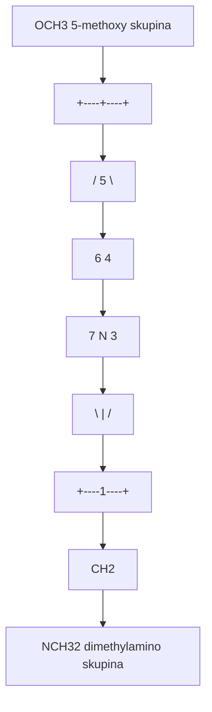
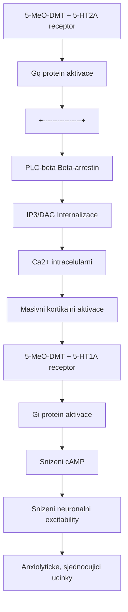
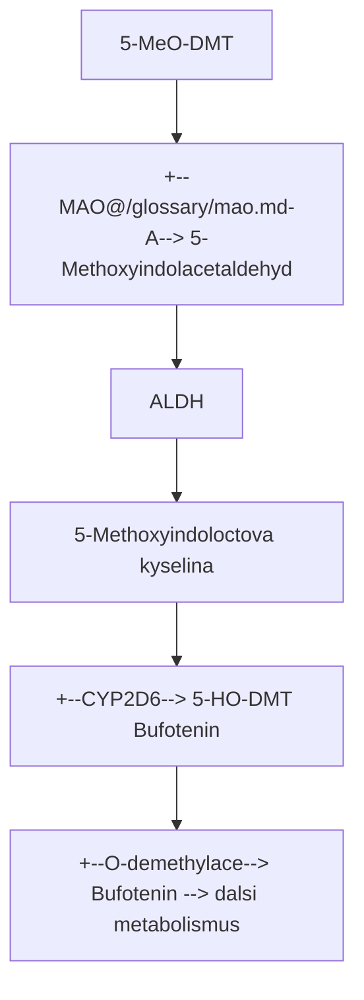

+++
title = "5-MeO-DMT"
description = "5-Methoxy-N,N-dimethyltryptamin - nejsilnejsi prirodni psychedelikum, ropusi jed Bufo alvarius, transcendentni zazitky"
weight = 6
+++

# 5-MeO-DMT - 5-Methoxy-N,N-dimethyltryptamin

**5-MeO-DMT** je extremne potentni [psychedelicky](@/glossary/psychedelikum.md) [tryptamin](@/glossary/tryptamin.md), casto oznacovany jako **"God Molecule"** (Molekula Boha). Na rozdil od [DMT](@/alkaloids/dmt.md), ktere produkuje bohatou vizualni fenomenologii, 5-MeO-DMT indukuje prevazne **nedualistni, transcendentni zazitky** charakterizovane uplnou ego disoluci a pocitem sjednoceni s vesmirem.

---

## Chemicka struktura

### Zakladni parametry

| Vlastnost | Hodnota |
|-----------|---------|
| **Chemicky nazev** | 5-Methoxy-N,N-dimethyltryptamin |
| **Alternativni nazvy** | God Molecule, Toad, 5-MEO, O-DeMethylbufotenin |
| **Molekularni vzorec** | C13H18N2O |
| **Molekularni hmotnost** | 218,30 g/mol |
| **CAS cislo** | 1019-45-0 |
| **IUPAC** | 2-(5-methoxy-1H-indol-3-yl)-N,N-dimethylethanamine |
| **SMILES** | CN(C)CCc1c[nH]c2ccc(OC)cc12 |
| **InChI Key** | MVFPWQJTWLHYCP-UHFFFAOYSA-N |

### Strukturni srovnani

| Sloucenina | Pozice 4 | Pozice 5 | N-substituenty | Relativni potence |
|------------|----------|----------|----------------|-------------------|
| **5-MeO-DMT** | H | OCH3 | N(CH3)2 | **4-6x** |
| [DMT](@/alkaloids/dmt.md) | H | H | N(CH3)2 | 1x (reference) |
| [Psilocin](@/alkaloids/psilocin.md) | OH | H | N(CH3)2 | 0.8x |
| [Bufotenin](@/alkaloids/bufotenin.md) | H | OH | N(CH3)2 | 0.3x |
| **5-MeO-MiPT** | H | OCH3 | N(CH3)(iPr) | 0.5x |

### Strukturni diagram



<details>
<summary>ASCII verze diagramu</summary>

```
        OCH3 (5-methoxy skupina)
         |
    +----+----+
   /     5     \
  6             4
  |             |
  7      N      3
   \     |     /
    +----1----+
         |
         CH2
         |
         CH2
         |
        N(CH3)2 (dimethylamino skupina)
```

</details>

---

## Fyzikalne-chemicke vlastnosti

| Vlastnost | Hodnota |
|-----------|---------|
| **Teplota tani** | 68-70 C (volna baze) |
| **Barva** | Bila az krem (krystaly) |
| **Rozpustnost ve vode** | Spatna (volna baze), dobra (soli) |
| **Rozpustnost v organickych rozpoustedlech** | Dobra |
| **pKa** | 8.7 |
| **Log P** | 2.08 (vyse lipofilie nez DMT) |
| **Vaporizacni teplota** | 160-180 C |
| **Stabilita** | Citlivy na svetlo a oxidaci |

---

## Prirodni zdroje

### Bufo alvarius (Sonorska ropucha)

| Vlastnost | Hodnota |
|-----------|---------|
| **Vedecky nazev** | Incilius alvarius (drive Bufo alvarius) |
| **Cesky nazev** | Coloradska ricni ropucha |
| **Oblast vyskytu** | Sonorska poust (Arizona, Mexiko) |
| **Zdroj sekretu** | Parotidni zlavy |
| **Obsah 5-MeO-DMT** | 10-15% suche hmotnosti |
| **Dalsi alkaloidy** | [Bufotenin](@/alkaloids/bufotenin.md) (5-HO-DMT), bufotoxiny |
| **Ochrana** | Regulovano v Arizona |

#### Slozeni sekretu Bufo alvarius

| Sloucenina | Obsah (%) | Aktivita |
|------------|-----------|----------|
| **5-MeO-DMT** | 10-15 | Psychoaktivni |
| **Bufotenin** | 5-10 | Psychoaktivni (slabsi) |
| **Bufotoxiny** | 30-40 | Kardiotoxicke |
| **Bufodienolidy** | 10-20 | Kardiotoxicke |
| **Epinefrin** | 1-5 | Sympatomimeticke |

**Varovani**: Prsni jed bez zpracovani obsahuje kardiotoxicke slouceniny.

### Rostlinne zdroje

| Rostlina | Cast | 5-MeO-DMT (%) | Region |
|----------|------|---------------|--------|
| **Anadenanthera peregrina** | Semena | 0.1-0.5 | Jizni Amerika |
| **Anadenanthera colubrina** | Semena | 0.2-0.8 | Jizni Amerika |
| **Virola spp.** | Kura | 0.1-0.5 | Amazonie |
| **Phalaris arundinacea** | Trava | 0.01-0.1 | Globalni |
| **Dictyoloma incanescens** | Kura | 0.05-0.3 | Brazilie |

### Houby obsahujici 5-MeO-DMT

| Druh | Obsah (%) | Poznamka |
|------|-----------|----------|
| **Psilocybe subaeruginosa** | Stopy | Australie |
| [**Psilocybe azurescens**](@/shrooms/psilocybes/azurescens.md) | Stopy | USA (PNW) |

---

## Farmakologie

### [Receptorovy](@/glossary/receptor.md) profil

| [Receptor](@/glossary/receptor.md) | Ki (nM) | Ucinek | Vyznam |
|----------|---------|--------|--------|
| [**5-HT2A**](@/receptors/5-ht2a.md) | 3-10 | Plny [agonista](@/glossary/agonista.md) | **Primarni psychoaktivni** |
| [**5-HT1A**](@/receptors/5-ht1a.md) | 5-30 | Plny [agonista](@/glossary/agonista.md) | **Anxiolyticke, sjednocujici** |
| [**5-HT2C**](@/receptors/5-ht2c.md) | 50-200 | [Agonista](@/glossary/agonista.md) | Modulace |
| [**5-HT2B**](@/receptors/5-ht2b.md) | 100-400 | [Agonista](@/glossary/agonista.md) | Kardiovaskularni |
| [**Sigma-1**](@/receptors/sigma-1.md) | 2,000+ | Slaba afinita | Minimalni |
| [**TAAR1**](@/receptors/taar1.md) | 5,000+ | [Agonista](@/glossary/agonista.md) | Modulace |

### Srovnani s DMT

| Parametr | 5-MeO-DMT | [DMT](@/alkaloids/dmt.md) |
|----------|-----------|------------------------|
| **5-HT2A Ki** | 3-10 nM | 75-130 nM |
| **5-HT1A Ki** | 5-30 nM | 1000+ nM |
| **Potence** | 4-6x vyssi | 1x (reference) |
| **Vizualni obsah** | Minimalni | Bohaty |
| **Entity** | Vzacne | Caste (50%+) |
| **Ego disoluce** | Temer jista | Mozna |
| **Telesne ucinky** | Intenzivni | Stredni |
| **Charakter zazitku** | Sjednocujici, "bily plamen" | Vizionarsky, kaleidoskopicky |

### Signalni kaskada



<details>
<summary>ASCII verze diagramu</summary>

```
5-MeO-DMT + 5-HT2A receptor
        |
        v
    Gq protein aktivace
        |
        +----------------+
        |                |
        v                v
    PLC-beta         Beta-arrestin
        |                |
        v                v
    IP3/DAG          Internalizace
        |
        v
    [Ca2+] intracelularni
        |
        v
    Masivni kortikalni aktivace

5-MeO-DMT + 5-HT1A receptor
        |
        v
    Gi protein aktivace
        |
        v
    Snizeni cAMP
        |
        v
    Snizeni neuronalni excitability
        |
        v
    Anxiolyticke, sjednocujici ucinky
```

</details>

### Dual [5-HT2A](@/receptors/5-ht2a.md)/[5-HT1A](@/receptors/5-ht1a.md) aktivace

Unikatni fenomenologie 5-MeO-DMT je zpusobena simultanni aktivaci obou [receptoru](@/glossary/receptor.md):

| Receptor | Ucinek | Fenomenologicky prispevek |
|----------|--------|--------------------------|
| **5-HT2A** | Psychedelicky | Ego disoluce, transcendence |
| **5-HT1A** | Anxiolyticke | Klid, odevzdani, sjednoceni |

---

## [Farmakokinetika](@/glossary/farmakokinetika.md)

### Srovnani cest podani

| Parametr | Inhalace | Insufflace | IM | Oralni + MAOI |
|----------|----------|------------|-----|---------------|
| **Nastup** | 10-30 s | 2-5 min | 3-5 min | 30-45 min |
| **Peak** | 1-5 min | 10-20 min | 15-25 min | 60-90 min |
| **Trvani** | 15-30 min | 30-60 min | 45-75 min | 2-4 h |
| **t1/2** | ~10 min | ~15 min | ~20 min | ~45 min |
| **Biodostupnost** | ~100% | ~80% | ~100% | ~50% |

### Metabolismus



<details>
<summary>ASCII verze diagramu</summary>

```
5-MeO-DMT
    |
    +--[[MAO](@/glossary/mao.md)-A]--> 5-Methoxyindolacetaldehyd
    |                    |
    |                    v [ALDH]
    |             5-Methoxyindoloctova kyselina
    |
    +--[CYP2D6]--> 5-HO-DMT (Bufotenin)
    |
    +--[O-demethylace]--> Bufotenin --> dalsi metabolismus
```

</details>

---

## Davkovani

### Inhalace (vaporizace)

| Uroven | Davka | Zazitek |
|--------|-------|---------|
| **Prah** | 1-3 mg | Mirne zmeny vnimani |
| **Lehka** | 3-6 mg | Telesne pocity, zmeny vedomi |
| **Stredni** | 6-12 mg | Vyrazna ego disoluce |
| **Prulomova** | 12-20 mg | Uplna transcendence |
| **Silna** | 20-30 mg | Intenzivni mysticke zazitky |

**Varovani**: Davky nad 30 mg mohou byt nebezpecne.

### Insufflace (snupani)

| Uroven | Davka | Poznamka |
|--------|-------|----------|
| **Prah** | 3-5 mg | Pomalejsi nastup |
| **Lehka** | 5-10 mg | Postupnejsi |
| **Stredni** | 10-20 mg | Delsi trvani |
| **Silna** | 20-35 mg | Prodlouzeny zazitek |

---

## Fenomenologie zazitku

### Faze zazitku (inhalace)

#### Faze 1: Nastup (0-30 sekund)

| Fenomen | Popis |
|---------|-------|
| **"Rocket launch"** | Prudky nastup pripominajici start rakety |
| **Telesne rozpousteni** | Ztrata hranic tela |
| **Auditory zmeny** | Vysokofrekvencni zvoneni |
| **Vizualni "whiteout"** | Bile svetlo, ne vzory |

#### Faze 2: Peak (30 s - 10 min)

| Fenomen | Popis |
|---------|-------|
| **Ego smrt** | Uplna ztrata identity |
| **Nedualni vedomi** | Ztrata subjekt-objekt rozdeleni |
| **"Void" / "Plenum"** | Paradoxni prazdnota-plnost |
| **Oceanicka bezbranicnost** | Splyuti s vesmorem |
| **Timeless state** | Ztrata vnimani casu |
| **Transcendence** | "Navrat domu", ultimativni realita |

#### Faze 3: Navrat (10-30 min)

| Fenomen | Popis |
|---------|-------|
| **Reintegrace ega** | Postupny navrat identity |
| **Emocionalni vlna** | Casto intenzivni emoce |
| **Telesne ukotveni** | Navrat telesneho vnimani |
| **Afterglow** | Prodlouzeny klid, blahodarne pocity |

### Srovnani fenomenologie

| Aspekt | 5-MeO-DMT | [DMT](@/alkaloids/dmt.md) | [Psilocybin](@/alkaloids/psilocybin.md) |
|--------|-----------|---------|------------|
| **Vizualy** | Minimalni (bily plamen) | Velmi bohaté | Bohaté |
| **Entity** | Vzacne (5-10%) | Caste (50%+) | Stredne caste |
| **Ego disoluce** | Temer zarucena | Mozna | Davkove zavisla |
| **Telesne** | Intenzivni | Stredni | Mirne |
| **Charakter** | Sjednocujici | Vizionarsky | Introspektivni |
| **Popis** | "Bily plamen", "Void" | "Kaleidoskop", "Hyperprostor" | "Houbovy trip" |

### Mysticke zazitky (MEQ skore)

| Dimenze | 5-MeO-DMT | [DMT](@/alkaloids/dmt.md) | [Psilocybin](@/alkaloids/psilocybin.md) |
|---------|-----------|---------|------------|
| **Jednota** | **95%** | 85% | 75% |
| **Transcendence casu** | **95%** | 90% | 70% |
| **Posvstnost** | 85% | 70% | 65% |
| **Noeticky insight** | 90% | 80% | 70% |
| **Nevyslovitelnost** | **98%** | 95% | 85% |

---

## Terapeuticky potencial

### Klinicke studie

| Studie | Indikace | N | Vysledek |
|--------|----------|---|----------|
| **Davis et al. 2020** | [Deprese](@/conditions/depression.md), uzkost | 362 (retrospektivni) | 80% zlepseni |
| **Uthaug et al. 2019** | Wellbeing | 42 | Zvysena spokojenost |
| **Psyche et al. 2023** | TRD | Faze I | Pokracuje |

### Terapeuticke mechanismy

| Mechanismus | Evidence |
|-------------|----------|
| **Ego disoluce** | Narušeni rigidních vzorcu mysleni |
| **Mysticky zazitek** | Koreluje s trvalymi zmenami |
| **5-HT1A aktivace** | Anxiolyticke ucinky |
| **[Neuroplasticita](@/glossary/neuroplasticita.md)** | [BDNF](@/molecules/bdnf.md) elevace |
| **Reconnection** | Zvysena konektivita mozku |

---

## Bezpecnost a rizika

### Fyziologicke ucinky

| Parametr | Typicka zmena | Riziko |
|----------|---------------|--------|
| **Krevni tlak** | +20-40 mmHg | Stredni |
| **Srdecni frekvence** | +20-40 bpm | Stredni |
| **Telesna teplota** | +0.5-1 C | Nizke |
| **Respirace** | Nepravidelna | Pozor! |

### Kontraindikace

#### Absolutni

- Kardiovaskularni onemocneni
- Nerizena hypertenze
- Anamneza psychozy/[schizofrenie](@/conditions/schizophrenia.md)
- Aktualni uzivani MAOI
- Aktualni uzivani SSRI/SNRI ([serotonin](@/glossary/serotonin.md) modulatory)

#### Relativni

- Uzkostne poruchy
- Epilepsie
- Tehotenstvi
- Gravidita

### Nebezpecne interakce

| Latka | Riziko | Mechanismus |
|-------|--------|-------------|
| **MAOI** | Zivot ohrozujici | Mnohanasobna potenciace |
| **SSRI/SNRI** | [Serotonin syndrom](@/conditions/serotonin-syndrome.md) | [5-HT](@/glossary/serotonin.md) toxicita |
| **Tramadol** | [Serotonin syndrom](@/conditions/serotonin-syndrome.md) | SERT inhibice |
| **Lithium** | Zachvaty | Neznamy |
| **Stimulanty** | Kardiovaskularni | Sympatomimeticka sumace |

### Bezpecnostni protokol

| Krok | Popis |
|------|-------|
| **Screening** | Zdravotni a psychiatricka anamneza |
| **Wash-out** | 2+ tydny bez serotonergik |
| **Setting** | Tiché, bezpecne prostredi |
| **Sitter** | Zkuseny facilitator |
| **Poloha** | Lezici (prevence padu) |
| **Monitoring** | Dech, vedomi, bezpecnost |
| **Integrace** | Nasledna podpora |

---

## Pravni status

### Mezinarodni

| Jurisdikce | Status | Poznamka |
|------------|--------|----------|
| **USA** | Schedule I | Analogovy zakon |
| **UK** | Class A | Psychoactive Substances Act |
| **Nemecko** | BtMG Anlage I | Zakazano |
| **Kanada** | Schedule III | Kontrolovano |
| **Mexiko** | Sede zona | Retreaty existuji |

### Ceska republika

| Aspekt | Detail |
|--------|--------|
| **Zakon** | Narizeni vlady c. 463/2013 Sb. |
| **Status** | Zakazano (jako analog DMT) |
| **Ropusi jed** | Pravne nejiste |
| **Rostliny** | Obecne seda zona |

---

## Eticke aspekty

### Konzervace Bufo alvarius

| Problem | Reseni |
|---------|--------|
| **Nadmerny sber** | Synteticka 5-MeO-DMT |
| **Habitat destruction** | Podpora konzervace |
| **Neeticky sber** | Vzdelani, alternativy |

Hamilton Morris a dalsi odbornici doporucuji **syntetickou 5-MeO-DMT** jako etickou a bezpecnejsi alternativu.

---

## Reference

### Primární literatura

1. Shen, H.W. et al. (2010). *Psychedelic 5-methoxy-N,N-dimethyltryptamine: Metabolism, pharmacokinetics, drug interactions*. Current Drug Metabolism, 11(8), 659-666.
2. Ott, J. (2001). *Pharmepena-Psychonautics: Human intranasal, sublingual and oral pharmacology of 5-methoxy-N,N-dimethyl-tryptamine*. Journal of Psychoactive Drugs, 33(4), 403-407.
3. Weil, A.T. & Davis, W. (1994). *Bufo alvarius: a potent hallucinogen of animal origin*. Journal of Ethnopharmacology, 41(1-2), 1-8.

### Klinicke studie

4. Davis, A.K. et al. (2020). *5-methoxy-N,N-dimethyltryptamine (5-MeO-DMT) used in a naturalistic group setting is associated with unintended improvements in depression and anxiety*. American Journal of Drug and Alcohol Abuse, 46(1), 73-84.
5. Uthaug, M.V. et al. (2019). *A single inhalation of vapor from dried toad secretion containing 5-methoxy-N,N-dimethyltryptamine (5-MeO-DMT) in a naturalistic setting*. Psychopharmacology, 236(12), 3653-3659.

### Fenomenologie

6. Barsuglia, J.P. et al. (2018). *Intensity of Mystical Experiences Occasioned by 5-MeO-DMT and Comparison With a Prior Psilocybin Study*. Frontiers in Psychology, 9, 2459.

---

## Krizove odkazy

### Souvisejici alkaloidy
- [DMT](@/alkaloids/dmt.md) - strukturne pribuzny, odlisna fenomenologie
- [Psilocybin](@/alkaloids/psilocybin.md) - houby obsahujici tryptaminy
- [Bufotenin](@/alkaloids/bufotenin.md) - 5-hydroxy-DMT

### Receptory
- [5-HT2A](@/receptors/5-ht2a.md) - primarni psychedelicky cil
- [5-HT1A](@/receptors/5-ht1a.md) - anxiolyticke ucinky
- [Sigma-1](@/receptors/sigma-1.md) - neuroprotektivni funkce

### Souvisejici temata
- [MAOI](@/pharmacology/maoi.md) - inhibitory monoaminoxidazy
- [Harm Reduction](@/harm-reduction/_index.md) - zasady bezpecneho uzivani

---

Zpet na [Alkaloidy](@/alkaloids/_index.md) | [DMT](@/alkaloids/dmt.md) | [Psilocybin](@/alkaloids/psilocybin.md)
