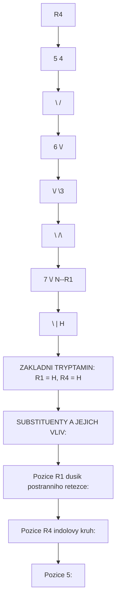
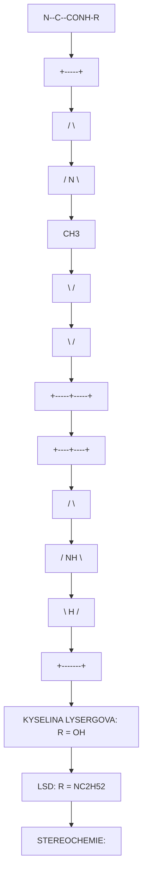
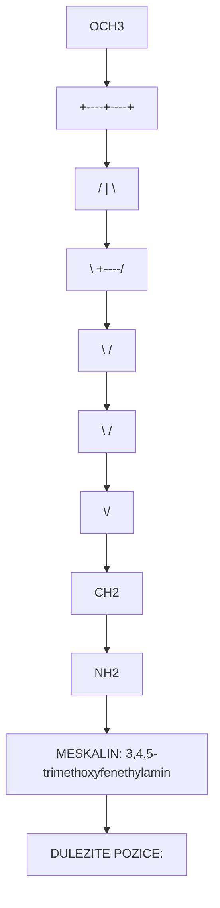
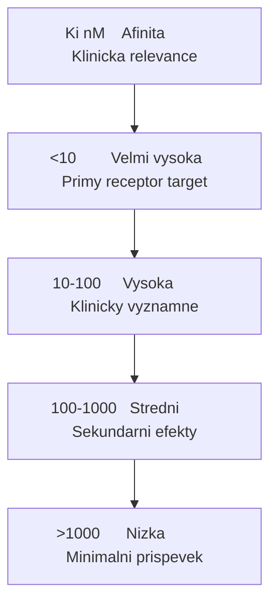
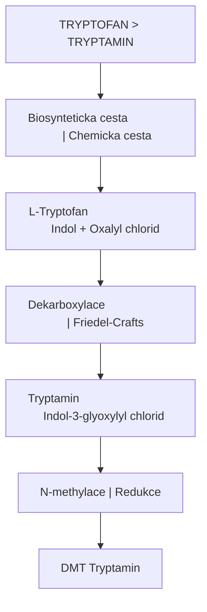

+++
title = "Alkaloidy"
description = "Psychoaktivni alkaloidy - tryptaminy, ergoliny, fenethylaminy, isoxazoly a dalsi"
sort_by = "weight"
weight = 1
insert_anchor_links = "right"
template = "section.html"
+++

# Alkaloidy

Psychoaktivni alkaloidy jsou dusikata organicke slouceniny produkowane rostlinami a houbami. Pusobi na centralni nervovy system vazbou na neurotransmiterove receptory. Tato sekce obsahuje **8 alkaloidu** s kompletni dokumentaci.

---

## Klasifikacni system

Alkaloidy se klasifikuji podle chemicke struktury zakladniho skeletu (scaffold), z nehoz jsou odvozeny. Kazda trida ma charakteristicky mechanismus ucinku a farmakologicky profil.

### Hlavni tridy psychoaktivnich alkaloidu

```mermaid
flowchart TD
    node_ALKALOIDY["ALKALOIDY"]
    node_INDOLOVEALKALOIDYobs["+-- INDOLOVE ALKALOIDY obsahuji indolovy jadro"]
    node_TRYPTAMINYindolethyl["+-- TRYPTAMINY indol + ethylamin"]
    node_Psilocybin4PODMT["-- Psilocybin 4-PO-DMT"]
    node_Psilocin4HODMT["-- Psilocin 4-HO-DMT"]
    node_Baeocystin4PONMT["-- Baeocystin 4-PO-NMT"]
    node_DMTNNDMT["+-- DMT N,N-DMT"]
    node_ERGOLINYtetracyklick["+-- ERGOLINY tetracyklicke"]
    node_LSDlysergamid["+-- LSD lysergamid"]
    node_FENETHYLAMINYfenylet["+-- FENETHYLAMINY fenyl + ethylamin"]
    node_Meskalin345trimethox["+-- Meskalin 3,4,5-trimethoxyfenethylamin"]
    node_ISOXAZOLYheterocykli["+-- ISOXAZOLY heterocyklicke"]
    node_MuscimolGABAanalog["+-- Muscimol GABA analog"]

    node_ALKALOIDY --> node_INDOLOVEALKALOIDYobs
    node_INDOLOVEALKALOIDYobs --> node_TRYPTAMINYindolethyl
    node_TRYPTAMINYindolethyl --> node_Psilocybin4PODMT
    node_Psilocybin4PODMT --> node_Psilocin4HODMT
    node_Psilocin4HODMT --> node_Baeocystin4PONMT
    node_Baeocystin4PONMT --> node_DMTNNDMT
    node_DMTNNDMT --> node_ERGOLINYtetracyklick
    node_ERGOLINYtetracyklick --> node_LSDlysergamid
    node_LSDlysergamid --> node_FENETHYLAMINYfenylet
    node_FENETHYLAMINYfenylet --> node_Meskalin345trimethox
    node_Meskalin345trimethox --> node_ISOXAZOLYheterocykli
    node_ISOXAZOLYheterocykli --> node_MuscimolGABAanalog

    click node_Psilocybin4PODMT "/alkaloids/dmt/" "-- Psilocybin 4-PO-DMT"
    click node_Psilocin4HODMT "/alkaloids/psilocin/" "-- Psilocin 4-HO-DMT"
    click node_Baeocystin4PONMT "/alkaloids/baeocystin/" "-- Baeocystin 4-PO-NMT"
    click node_DMTNNDMT "/alkaloids/dmt/" "+-- DMT N,N-DMT"
    click node_LSDlysergamid "/alkaloids/lsd/" "+-- LSD lysergamid"
    click node_Meskalin345trimethox "/alkaloids/mescaline/" "+-- Meskalin 3,4,5-trimethoxyfenethylamin"
    click node_MuscimolGABAanalog "/alkaloids/muscimol/" "+-- Muscimol GABA analog"
```



<details>
<summary>ASCII verze diagramu</summary>

```
ALKALOIDY
    |
    +-- INDOLOVE ALKALOIDY (obsahuji indolovy jadro)
    |       |
    |       +-- TRYPTAMINY (indol + ethylamin)
    |       |       |-- Psilocybin (4-PO-DMT)
    |       |       |-- Psilocin (4-HO-DMT)
    |       |       |-- Baeocystin (4-PO-NMT)
    |       |       +-- DMT (N,N-DMT)
    |       |
    |       +-- ERGOLINY (tetracyklicke)
    |               +-- LSD (lysergamid)
    |
    +-- FENETHYLAMINY (fenyl + ethylamin)
    |       +-- Meskalin (3,4,5-trimethoxyfenethylamin)
    |
    +-- ISOXAZOLY (heterocyklicke)
            +-- Muscimol (GABA analog)
```

</details>

### Tabulka klasifikace

| Trida | Zakladni struktura | Receptor | Pocet alkaloidu |
|-------|-------------------|----------|-----------------|
| **Tryptaminy** | Indol + ethylamin | 5-HT2A | 4 |
| **Ergoliny** | Tetracyklicky indol | 5-HT2A, D2 | 1 |
| **Fenethylaminy** | Fenyl + ethylamin | 5-HT2A | 1 |
| **Isoxazoly** | Isoxazol (heterocykl) | GABA-A | 2 |

---

## Struktura-aktivita (SAR)

Vztahy mezi chemickou strukturou a biologickou aktivitou umoznuji predikovat ucinky novych sloucenin.

### Tryptaminovy scaffold



<details>
<summary>ASCII verze diagramu</summary>

```
                    R4
                     |
                5    4
                 \  /
              6   \/
               \  ||
                \/  \3
                ||   |
                 \  /\
              7   \/  N--R1
               \  |   |
                \ |   H
                 \|
                  N
                  |
                  H

ZAKLADNI TRYPTAMIN: R1 = H, R4 = H

SUBSTITUENTY A JEJICH VLIV:
-----------------------------
Pozice R1 (dusik postranniho retezce):
  - H      -> Tryptamin (neaktivni)
  - CH3    -> NMT (slabe aktivni)
  - 2x CH3 -> DMT (plne aktivni)

Pozice R4 (indolovy kruh):
  - H          -> DMT
  - OH         -> Psilocin (4-HO-DMT)
  - OPO3H2     -> Psilocybin (4-PO-DMT, prodrug)
  - OCH3       -> 4-MeO-DMT (aktivni)

Pozice 5:
  - OCH3       -> 5-MeO-DMT (velmi potentni)
  - OH         -> Bufotenin (5-HO-DMT)
```

</details>

### Klicove SAR poznatky pro tryptaminy

| Modifikace | Ucinek na aktivitu | Priklad |
|------------|-------------------|---------|
| N,N-dimethylace | Nutna pro plnou aktivitu | DMT vs. tryptamin |
| 4-hydroxylace | Zvysuje potenci, prodluzuje ucinek | Psilocin |
| 4-fosforylace | Prodrug (stabilnejsi) | Psilocybin |
| 5-methoxylace | Vyrazne zvysuje potenci | 5-MeO-DMT |
| 4,5-disubstituce | Kombinovane efekty | Teoreticke |

### Ergolinovy scaffold



<details>
<summary>ASCII verze diagramu</summary>

```
                    H
                    |
                 N--C--CONH-R
                /   |
               /    |
        +-----+     |
       /       \    |
      /    N    \   |
     |     |     |  |
     |     CH3   |  |
      \         /   |
       \       /    |
        +-----+-----+
              |
              |
         +----+----+
        /          \
       /     NH     \
      |      |       |
       \     H      /
        \         /
         +-------+

KYSELINA LYSERGOVA: R = OH
LSD: R = N(C2H5)2

STEREOCHEMIE:
- (6aR,9R) = d-LSD (aktivni)
- (6aS,9S) = l-LSD (neaktivni)
- iso-LSD = epimer (neaktivni)
```

</details>

### SAR ergolinu

| Modifikace | Ucinek | Potence |
|------------|--------|---------|
| Diethylamid (-CONH(Et)2) | Optimalni | 100% (reference) |
| Monoethylamid (-CONHEt) | Snizena | ~40% |
| Amid (-CONH2) | Velmi nizka | ~5% |
| Kyselina (-COOH) | Neaktivni | 0% |
| 1-substituenty (1P-, 1cP-) | Prodrugs | ~100% |

### Fenethylaminovy scaffold



<details>
<summary>ASCII verze diagramu</summary>

```
        OCH3
         |
    +----+----+
   /     |     \
  |   OCH3      |
  |      \      |
   \      +----/
    \    /
     \  /
      \/
       |
       CH2
       |
       CH2
       |
       NH2

MESKALIN: 3,4,5-trimethoxyfenethylamin

DULEZITE POZICE:
- 3,4,5-trimethoxy pattern = nezbytny pro aktivitu
- Alpha-methylace = amfetaminy (DOM, DOB, DOI)
- 2,5-dimethoxy pattern = 2C-x serie
```

</details>

---

## Biosynteticke drahy

Alkaloidy jsou syntetizovany z aminokyselin prostrednictvim specifickych enzymatickych kaskad.

### Psilocybinova biosynteza (Psilocybe spp.)

```
L-TRYPTOFAN
     |
     | [PsiD] Tryptofan dekarboxylaza
     v
TRYPTAMIN
     |
     | [PsiH] Tryptamin 4-hydroxylaza (P450)
     v
4-HYDROXYTRYPTAMIN
     |
     | [PsiK] 4-HT kinaza
     v
NORBAEOCSTIN (4-PO-tryptamin)
     |
     | [PsiM] N-methyltransferaza (SAM)
     v
BAEOCYSTIN (4-PO-NMT)
     |
     | [PsiM] N-methyltransferaza (SAM)
     v
PSILOCYBIN (4-PO-DMT)
     |
     | [Spontanni hydrolyzal / Alkalicka fosfataza]
     v
PSILOCIN (4-HO-DMT)
```

**Enzymy biosyntezni drahy:**

| Enzym | Gen | Funkce | Kofaktor |
|-------|-----|--------|----------|
| **PsiD** | psiD | Dekarboxylace tryptofanu | PLP |
| **PsiH** | psiH | 4-hydroxylace (P450) | O2, NADPH |
| **PsiK** | psiK | Fosforylace | ATP |
| **PsiM** | psiM | N-methylace (2x) | SAM |

### DMT biosynteza (obecna)

```
L-TRYPTOFAN
     |
     | [AADC] Aromaticka L-aminokyselina dekarboxylaza
     v
TRYPTAMIN
     |
     | [INMT] Indolethylamin N-methyltransferaza
     v
N-METHYLTRYPTAMIN (NMT)
     |
     | [INMT]
     v
N,N-DIMETHYLTRYPTAMIN (DMT)
```

### Meskalinova biosynteza (kaktusy)

```
L-TYROSIN
     |
     | [TyrDC] Tyrosin dekarboxylaza
     v
TYRAMIN
     |
     | [CYP] Hydroxylace (3-pozice)
     v
DOPAMIN
     |
     | [OMT] O-methyltransferaza
     v
3-METHOXYTYRAMIN
     |
     | [CYP + OMT] Hydroxylace + methylace
     v
3,4-DIMETHOXYFENETHYLAMIN
     |
     | [CYP + OMT]
     v
MESKALIN (3,4,5-trimethoxyfenethylamin)
```

### Ergolinovoa biosynteza (Claviceps, Aspergillus)

```
L-TRYPTOFAN + DMAPP (dimethylallylpyrofosfat)
     |
     | [DmaW] 4-dimethylallyltryptofan syntaza
     v
4-DIMETHYLALLYLTRYPTOFAN (DMAT)
     |
     | [EasF, EasE, EasC, EasD] Cyklizacni kaskada
     v
CHANOCLAVIN-I
     |
     | [EasA, EasG]
     v
AGROCLAVIN
     |
     | [CloA] P450 oxidoreduktaza
     v
LYSERGOL
     |
     | [Oxidace]
     v
KYSELINA LYSERGOVA
     |
     | [Chemicka synteza - Hofmann 1938]
     v
LSD (diethylamid)
```

---

## Farmakologicke profily

### Receptorova afinita (Ki hodnoty v nM)

| Alkaloid | 5-HT2A | 5-HT2C | 5-HT1A | D2 | GABA-A | Sigma-1 |
|----------|--------|--------|--------|-----|--------|---------|
| [LSD](@/alkaloids/lsd.md) | **1-2** | 5-10 | 2-10 | 10-50 | - | - |
| [Psilocin](@/alkaloids/psilocin.md) | 6-15 | 30-100 | 50-200 | >1000 | - | - |
| [DMT](@/alkaloids/dmt.md) | 75-130 | 360 | >1000 | - | - | 14750 |
| [Psilocybin](@/alkaloids/psilocybin.md) | N/A* | N/A* | N/A* | - | - | - |
| [Baeocystin](@/alkaloids/baeocystin.md) | ~50-100** | - | - | - | - | - |
| [Meskalin](@/alkaloids/mescaline.md) | 5000+ | 2000+ | - | - | - | - |

*Psilocybin je prodrug, defosforyluje se na psilocin
**Odhadnuto, limitovana data

### Interpretace Ki hodnot



<details>
<summary>ASCII verze diagramu</summary>

```
Ki (nM)    Afinita         Klinicka relevance
-------------------------------------------------
<10        Velmi vysoka    Primy receptor target
10-100     Vysoka          Klinicky vyznamne
100-1000   Stredni         Sekundarni efekty
>1000      Nizka           Minimalni prispevek
```

</details>

### Potence a davkovani

| Alkaloid | Prah (mg) | Stredni (mg) | Silna (mg) | Jednotka |
|----------|-----------|--------------|------------|----------|
| [LSD](@/alkaloids/lsd.md) | 0.025 | 0.100 | 0.200 | mg (mikrogramy) |
| [Psilocybin](@/alkaloids/psilocybin.md) | 5 | 20 | 35 | mg |
| [Psilocin](@/alkaloids/psilocin.md) | 4 | 15 | 25 | mg |
| [DMT](@/alkaloids/dmt.md) (inh.) | 10 | 30 | 50 | mg |
| [DMT](@/alkaloids/dmt.md) (oral+MAOI) | 30 | 75 | 150 | mg |
| [Baeocystin](@/alkaloids/baeocystin.md) | 10 | 30 | 50 | mg (odhad) |
| [Meskalin](@/alkaloids/mescaline.md) | 100 | 300 | 500 | mg |

### Relativni potence (LSD = 1)

```
LSD         |============================================| 1.0
Psilocin    |======                                      | 0.015
DMT         |====                                        | 0.010
Psilocybin  |====                                        | 0.010
Baeocystin  |===                                         | 0.007
Meskalin    |=                                           | 0.0005
Muscimol    |====                                        | 0.010*

*Muscimol neni primo srovnatelny (jiny mechanismus)
```

---

## Kompletni srovnavaci tabulka

### Zakladni vlastnosti vsech 8 alkaloidu

| Alkaloid | Vzorec | Mw (g/mol) | Trida | Zdroj |
|----------|--------|------------|-------|-------|
| [Psilocybin](@/alkaloids/psilocybin.md) | C12H17N2O4P | 284.25 | Tryptamin | [Psilocybe](@/shrooms/psilocybes/_index.md) |
| [Psilocin](@/alkaloids/psilocin.md) | C12H16N2O | 204.27 | Tryptamin | [Psilocybe](@/shrooms/psilocybes/_index.md) |
| [Baeocystin](@/alkaloids/baeocystin.md) | C11H15N2O4P | 270.22 | Tryptamin | [Psilocybe](@/shrooms/psilocybes/_index.md) |
| [DMT](@/alkaloids/dmt.md) | C12H16N2 | 188.27 | Tryptamin | Psychotria, Mimosa |
| [LSD](@/alkaloids/lsd.md) | C20H25N3O | 323.43 | Ergolin | Semisynteticke |
| [Meskalin](@/alkaloids/mescaline.md) | C11H17NO3 | 211.26 | Fenethylamin | Peyote, San Pedro |
| Kyselina ibotenova | C5H6N2O4 | 158.11 | Isoxazol | [Amanita muscaria](@/shrooms/amanita-muscaria.md) |

### Farmakokineticke parametry

| Alkaloid | Biodost. (%) | Tmax (h) | T1/2 (h) | Trvani (h) | Metabolismus |
|----------|-------------|----------|----------|------------|--------------|
| [Psilocybin](@/alkaloids/psilocybin.md) | ~50 | 1-1.5 | 2-3 | 4-6 | Defosforylace |
| [Psilocin](@/alkaloids/psilocin.md) | ~50 | 0.5-1 | 2-3 | 4-6 | Glukuronidace |
| [Baeocystin](@/alkaloids/baeocystin.md) | ? | ? | ? | 4-6 | Defosforylace? |
| [DMT](@/alkaloids/dmt.md) (inh.) | ~100 | 0.03 | 0.25 | 0.25-0.5 | MAO-A |
| [DMT](@/alkaloids/dmt.md) (oral+MAOI) | ~50 | 1-2 | 1-2 | 4-6 | Inhibovany |
| [LSD](@/alkaloids/lsd.md) | ~70 | 1.5-2.5 | 3-5 | 8-12 | CYP3A4 |
| [Meskalin](@/alkaloids/mescaline.md) | ~100 | 2-3 | 6 | 8-12 | Hepatalni |

### Bezpecnostni profily

| Alkaloid | Fyziol. toxicita | Psych. riziko | Zavislost | LD50 (mg/kg)* |
|----------|-----------------|---------------|-----------|---------------|
| [Psilocybin](@/alkaloids/psilocybin.md) | Velmi nizka | Stredni | Zadny | 280 (i.v., mys) |
| [Psilocin](@/alkaloids/psilocin.md) | Velmi nizka | Stredni | Zadny | ~280 |
| [Baeocystin](@/alkaloids/baeocystin.md) | Velmi nizka | Nizka | Zadny | ? |
| [DMT](@/alkaloids/dmt.md) | Velmi nizka | Stredni | Velmi nizky | >50 |
| [LSD](@/alkaloids/lsd.md) | Velmi nizka | Stredni | Zadny | 0.3 (i.v., kralik) |
| [Meskalin](@/alkaloids/mescaline.md) | Nizka | Stredni | Zadny | 212 (i.p., mys) |

*LD50 hodnoty jsou z zvirecich studii a nelze je primo extrapolovat na lidi

---

## Historicka chronologie

### Objev a izolace

| Rok | Udalost | Osoba/Instituce |
|-----|---------|-----------------|
| **1897** | Izolace meskalinu z peyote | Arthur Heffter |
| **1919** | Prvni synteza meskalinu | Ernst Spath |
| **1931** | Izolace muscimolu (jako "Amanita toxin") | W. Eugster |
| **1938** | Synteza LSD-25 | Albert Hofmann, Sandoz |
| **1943** | Objev psychoaktivity LSD ("Bicycle Day") | Albert Hofmann |
| **1957** | Izolace psilocybinu a psilocinu | Albert Hofmann |
| **1958** | Publikace struktury psilocybinu | Hofmann et al. |
| **1959** | Identifikace DMT v Anadenanthera | Fish, Johnson, Horning |
| **1959** | Izolace baeocystinu | Leung, Paul |
| **1960s** | Charakterizace muscimolu | Eugster, Muller |
| **1965** | Objev endogenni DMT v lidske moce | Franzen, Gross |
| **2017** | Krystalova struktura LSD-5-HT2A komplexu | Wacker et al. |
| **2019** | Kompletni biosynteza psilocybinu objasena | Fricke et al. |

### Kulturni a vdecky vyznam

| Obdobi | Vyznam |
|--------|--------|
| **Prehistorie** | Ritualni pouziti hub, kaktusu, ayahuascy |
| **1950s-60s** | "Zlata era" psychedelickeho vyzkumu |
| **1966-2000** | Prohibice, zastaveni vyzkumu |
| **2000s-** | Renesance psychedelickeho vyzkumu |
| **2018-** | FDA Breakthrough Therapy pro psilocybin |
| **2020s** | Dekriminalizace, legalizace pro terapii |

### Klicove publikace

| Rok | Publikace | Autor | Vyznam |
|-----|-----------|-------|--------|
| 1958 | Psilocybin, ein psychotroper Wirkstoff... | Hofmann et al. | Prvni popis psilocybinu |
| 1964 | The Psychedelic Experience | Leary, Metzner, Alpert | Popularizace |
| 1980 | LSD: My Problem Child | Hofmann | Osobni svedectvi |
| 1991 | PiHKAL | Shulgin & Shulgin | Fenethylaminy |
| 1997 | TiHKAL | Shulgin & Shulgin | Tryptaminy |
| 2001 | DMT: The Spirit Molecule | Strassman | DMT vyzkum |
| 2016 | Psychedelics | Nichols | Souhrnny prehled |

---

## Synteticke metody

### Prirodni vs. synteticka extrakce

| Metoda | Vyhody | Nevyhody |
|--------|--------|----------|
| **Prirodni extrakce** | Dostupnost surovin, tradicni | Variabilni cistota, nizky vytenek |
| **Totalni synteza** | Vysoka cistota, skalovatelnust | Slozitost, prekurzory |
| **Biosynteza (rekombinantni)** | Udrzitelnost, skalovatelnust | V ranne fazi vyvoje |

### Prekurzory a synteticke cesty

#### Tryptaminy



<details>
<summary>ASCII verze diagramu</summary>

```
TRYPTOFAN ──────────────────────────────> TRYPTAMIN
    |                                        |
    | [Biosynteticka cesta]                  | [Chemicka cesta]
    v                                        v
L-Tryptofan                             Indol + Oxalyl chlorid
    |                                        |
    | [Dekarboxylace]                        | [Friedel-Crafts]
    v                                        v
Tryptamin                               Indol-3-glyoxylyl chlorid
    |                                        |
    | [N-methylace]                          | [Redukce]
    v                                        v
DMT                                     Tryptamin
```

</details>

#### Psilocybin (Hofmannova synteza, 1958)

```
4-Hydroxyindol
    |
    | [Oxalyl chlorid, Friedel-Crafts]
    v
4-Hydroxyindol-3-glyoxylyl chlorid
    |
    | [Dimethylamin, redukce LAH]
    v
4-Hydroxytryptamin
    |
    | [N,N-dimethylace]
    v
4-HO-DMT (Psilocin)
    |
    | [Fosforylace, POCl3]
    v
Psilocybin
```

#### LSD (Hofmann, 1938)

```
ERGOTAMIN (z namelu, Claviceps purpurea)
    |
    | [Alkalicka hydrolyzal]
    v
KYSELINA LYSERGOVA
    |
    | [Aktivace: POCl3 nebo CDI]
    v
Lysergyl chlorid / aktivovany ester
    |
    | [Kondenzace s diethylaminem]
    v
LSD
```

**Poznamka**: Prekurzory pro syntezu LSD jsou prisne kontrolovany.

### Biosynteza v rekombinantich systemech

| Hostitel | Alkaloid | Status | Reference |
|----------|----------|--------|-----------|
| E. coli | Psilocybin | Proof of concept | Fricke et al., 2017 |
| S. cerevisiae | Psilocybin | Optimalizovano | Adams et al., 2019 |
| A. nidulans | Psilocybin | Nativni producent | Blei et al., 2018 |
| E. coli | DMT | Proof of concept | - |

---

## Pravni klasifikace

### Mezinarodni planovani (OSN)

| Alkaloid | Umluva | Schedule | Rok zarazeni |
|----------|--------|----------|--------------|
| [LSD](@/alkaloids/lsd.md) | Psychotropni latky 1971 | I | 1971 |
| [Psilocybin](@/alkaloids/psilocybin.md) | Psychotropni latky 1971 | I | 1971 |
| [Psilocin](@/alkaloids/psilocin.md) | Psychotropni latky 1971 | I | 1971 |
| [DMT](@/alkaloids/dmt.md) | Psychotropni latky 1971 | I | 1971 |
| [Meskalin](@/alkaloids/mescaline.md) | Psychotropni latky 1971 | I | 1971 |
| [Baeocystin](@/alkaloids/baeocystin.md) | Neplanovano* | - | - |

*Muze byt kontrolovano jako analog psilocybinu v nekterych jurisdikcich

### Ceska republika

| Alkaloid | Status | Pravni predpis |
|----------|--------|----------------|
| [LSD](@/alkaloids/lsd.md) | **Zakazano** | NV 463/2013 Sb., Tab. I |
| [Psilocybin](@/alkaloids/psilocybin.md) | **Zakazano** | NV 463/2013 Sb., Tab. I |
| [Psilocin](@/alkaloids/psilocin.md) | **Zakazano** | NV 463/2013 Sb., Tab. I |
| [DMT](@/alkaloids/dmt.md) | **Zakazano** | NV 463/2013 Sb., Tab. I |
| [Meskalin](@/alkaloids/mescaline.md) | **Zakazano** | NV 463/2013 Sb., Tab. I |
| [Baeocystin](@/alkaloids/baeocystin.md) | Sede zona* | - |

*Pravne nejasne, muze spadat pod analogovy zakon

### Tresty v CR

| Cin | Trest odneti svobody |
|-----|---------------------|
| Drzeni (male mnozstvi) | Az 1 rok |
| Drzeni (vetsi mnozstvi) | 1-5 let |
| Vyroba/Distribuce | 2-10 let |
| Vyroba ve velkem | 8-12 let |

### Mezinarodni srovnani

| Zeme | LSD | Psilocybin | DMT | Meskalin | Poznamka |
|------|-----|------------|-----|----------|----------|
| **USA** | Sch. I | Sch. I | Sch. I | Sch. I | Vyjimky: OR, CO (psilocybin) |
| **Nizozemsko** | Zakazano | Truffles legalni | Zakazano | Zakazano | Houby zakazany 2008 |
| **Portugalsko** | Dekriminalizovano | Dekriminalizovano | Dekriminalizovano | Dekriminalizovano | Osobni drzeni |
| **Brazilie** | Zakazano | Zakazano | Ayahuasca legalni | Zakazano | Nabozenska vyjimka |
| **Jamajka** | Zakazano | **Legalni** | Zakazano | Zakazano | Psilocybinove retreaty |
| **Svycarsko** | Zakazano | Vyjimky pro vyzkum | Zakazano | Zakazano | Aktivni terapeuticky vyzkum |

### Analogove zakony

Mnohne jurisdikce maji zakony pokryvajici "podobne" latky:

| Jurisdikce | Zakon | Pokryti |
|------------|-------|---------|
| USA | Federal Analogue Act | Strukturne podobne Schedule I/II |
| UK | Psychoactive Substances Act 2016 | Vsechny psychoaktivni latky |
| DE | NpSG (2016) | Specificke tridy |
| AU | Analog provisions | Strukturne podobne |

---

## Obsah sekce

### Tryptaminy (Indolove alkaloidy)

Odvozeny od aminokyseliny tryptofanu, pusobi primarne na serotoninove receptory 5-HT2A.

| Alkaloid | Popis | Receptor | Potence | Zdroj |
|----------|-------|----------|---------|-------|
| [Psilocybin](@/alkaloids/psilocybin.md) | Fosforylovany prodrug | 5-HT2A | Stredni | [Psilocybe](@/shrooms/psilocybes/_index.md) |
| [Psilocin](@/alkaloids/psilocin.md) | Aktivni metabolit psilocybinu | 5-HT2A | Stredni | [Psilocybe](@/shrooms/psilocybes/_index.md) |
| [Baeocystin](@/alkaloids/baeocystin.md) | Minor alkaloid, demetyl-psilocybin | 5-HT2A | Nizka | [Psilocybe](@/shrooms/psilocybes/_index.md) |
| [DMT](@/alkaloids/dmt.md) | "Spirit Molecule", endogenni | 5-HT2A | Vysoka | Ayahuasca, Psychotria |

### Ergoliny (Namelove alkaloidy)

Komplexni tetracyklicka struktura odvozena od kyseliny lysergove. Nejpotentnejsi psychedelika.

| Alkaloid | Popis | Receptor | Potence |
|----------|-------|----------|---------|
| [LSD](@/alkaloids/lsd.md) | Hofmannovo "problemove dite" | 5-HT2A, D2 | **Nejvyssi** |

### Fenethylaminy

Odvozeny od fenethylaminu, strukturne podobne dopaminu a noradrenalinu.

| Alkaloid | Popis | Receptor | Potence | Zdroj |
|----------|-------|----------|---------|-------|
| [Meskalin](@/alkaloids/mescaline.md) | Klasicke psychedelikum | 5-HT2A | Nizka | Peyote, San Pedro |

### GABAergni alkaloidy (Isoxazoly)

Pusobi na GABA receptory (inhibicni neurotransmise). Odlisny mechanismus od klasickych psychedelik.

| Alkaloid | Popis | Receptor | Zdroj |
|----------|-------|----------|-------|

---

## Klasifikace podle mechanismu

### Serotoninergni (5-HT2A agoniste) - Klasicka psychedelika

Zpusobuji vizualni halucinace, zmeny vnimani, mysticke zazitky.

- [Psilocybin](@/alkaloids/psilocybin.md) + [Psilocin](@/alkaloids/psilocin.md) - Houby
- [DMT](@/alkaloids/dmt.md) - "Spirit Molecule"
- [LSD](@/alkaloids/lsd.md) - Nejpotentnejsi
- [Meskalin](@/alkaloids/mescaline.md) - Kaktusy
- [Baeocystin](@/alkaloids/baeocystin.md) - Minor houbovy alkaloid

### GABAergni - Disociativa/Deliriantia

Zpusobuji sedaci, disociaci, snove stavy. **Odlisna farmakologie od klasickych psychedelik.**


---

## Srovnani potence (5-HT2A afinita)

| Alkaloid | Ki (nM) | Aktivni davka | Trvani |
|----------|---------|---------------|--------|
| [LSD](@/alkaloids/lsd.md) | **1-2** | 50-200 **ug** | 8-12 h |
| [Psilocin](@/alkaloids/psilocin.md) | 6-15 | 10-25 **mg** | 4-6 h |
| [DMT](@/alkaloids/dmt.md) | 75-130 | 15-60 **mg** | 15 min (inh.) |
| [Psilocybin](@/alkaloids/psilocybin.md) | N/A (prodrug) | 15-30 **mg** | 4-6 h |
| [Meskalin](@/alkaloids/mescaline.md) | 5000+ | 200-400 **mg** | 8-12 h |

**Poznamka**: Ki = inhibicni konstanta. Nizsi hodnota = vyssi afinita k receptoru.

---

## Bezpecnostni profil

| Alkaloid | Fyziologicka toxicita | Psychologicke riziko | Zavislostni potencial |
|----------|----------------------|---------------------|----------------------|
| [Psilocybin](@/alkaloids/psilocybin.md) | Extremne nizka | Stredni (bad trip) | Zadny |
| [LSD](@/alkaloids/lsd.md) | Extremne nizka | Stredni (bad trip, HPPD) | Zadny |
| [DMT](@/alkaloids/dmt.md) | Velmi nizka | Nizka | Zadny |
| [Meskalin](@/alkaloids/mescaline.md) | Nizka | Stredni | Zadny |


---

## Krizova tolerance

Sdileni tolerance mezi serotonergnimi psychedeliky:

```
                    LSD
                   / | \
                  /  |  \
                 /   |   \
           Psilocybin|    DMT
                 \   |   /
                  \  |  /
                   \ | /
                  Meskalin

Plna krizova tolerance: LSD <-> Psilocybin <-> Meskalin
Castecna krizova tolerance: DMT (kratka expozice)
Zadna krizova tolerance: Muscimol (jiny mechanismus)
```

| Kombinace | Krizova tolerance | Pricina |
|-----------|------------------|---------|
| LSD - Psilocybin | **Uplna** | Stejny 5-HT2A downregulation |
| LSD - DMT | Castecna | Kratka expozice DMT |
| Psilocybin - Meskalin | **Uplna** | Stejny 5-HT2A mechanismus |
| LSD - Muscimol | **Zadna** | Jine receptory (GABA vs 5-HT) |

**Doporuceni**: Minimalne 1-2 tydny mezi sezenimi pro plnou obnovu citlivosti.

---

## Reference

1. Hofmann, A. et al. (1958). *Psilocybin, ein psychotroper Wirkstoff aus dem mexikanischen Rauschpilz*. Experientia 14: 107-109.
2. Hofmann, A. (1980). *LSD: My Problem Child*. McGraw-Hill.
3. Nichols, D.E. (2016). *Psychedelics*. Pharmacological Reviews 68(2): 264-355.
4. Shulgin, A. & Shulgin, A. (1991). *PiHKAL: A Chemical Love Story*. Transform Press.
5. Shulgin, A. & Shulgin, A. (1997). *TiHKAL: The Continuation*. Transform Press.
6. Strassman, R. (2001). *DMT: The Spirit Molecule*. Park Street Press.
7. Passie, T. et al. (2008). *The pharmacology of lysergic acid diethylamide: a review*. CNS Neuroscience & Therapeutics 14(4): 295-314.
8. Wacker, D. et al. (2017). *Crystal Structure of an LSD-Bound Human Serotonin Receptor*. Cell 168(3): 377-389.
9. Fricke, J. et al. (2017). *Enzymatic Synthesis of Psilocybin*. Angewandte Chemie 56(40): 12352-12355.
10. Carhart-Harris, R.L. et al. (2016). *Neural correlates of the LSD experience revealed by multimodal neuroimaging*. PNAS 113(17): 4853-4858.

---

## Souvisejici sekce

- [Houby](@/shrooms/_index.md) - Prirodni zdroje alkaloidu
- [Psilocybes](@/shrooms/psilocybes/_index.md) - Houby obsahujici psilocybin
- [Amanita muscaria](@/shrooms/amanita-muscaria.md) - Zdroj muscimolu
- [Neurotoxiny](@/neurotoxins/_index.md) - Toxicke latky (kyselina ibotenova)
- [Glosar](@/glossary/_index.md) - Definice pojmu
- [Mechanismy ucinku](@/mechanisms/_index.md) - Molekularni mechanismy vsech alkaloidu
- [Receptorova kinetika](@/mechanisms/receptor-binding.md) - Ki hodnoty, vazebna kinetika, SAR
- [Signalni transdukce](@/mechanisms/signal-transduction.md) - Gq, beta-arrestin, mTOR drahy
- [Alostericka modulace](@/mechanisms/allosteric-modulation.md) - Modulace receptoru
- [PK-PD vztahy](@/mechanisms/pharmacokinetic-pharmacodynamic.md) - ADME, doza-odpoved, farmakogenetika

---

*Posledni aktualizace: 2025*
