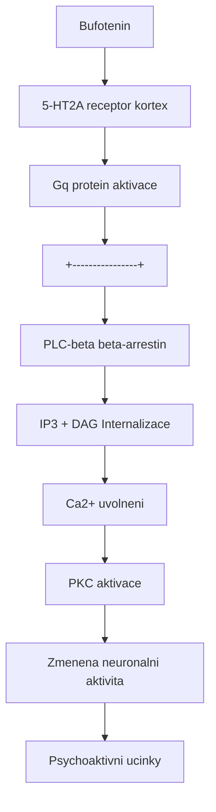
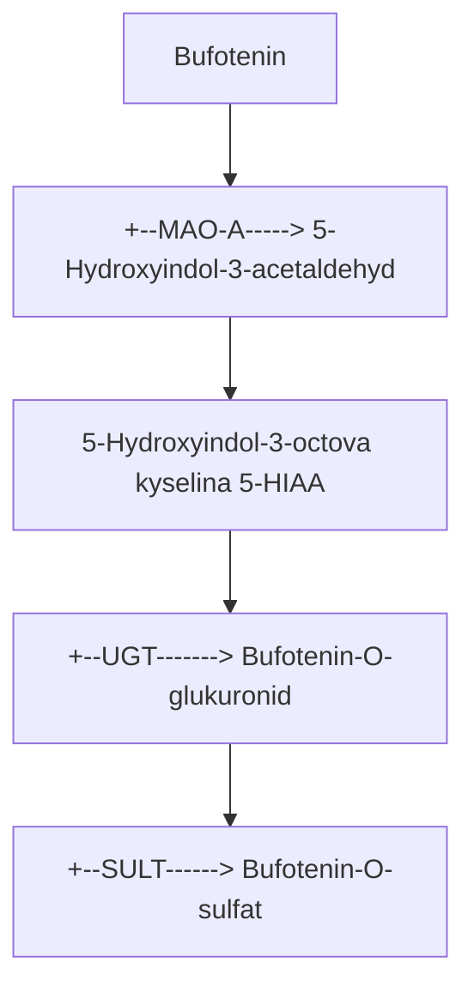

+++
title = "Bufotenin"
description = "5-Hydroxy-DMT - psychoaktivni tryptamin z ropusich jedu a semen Anadenanthera"
weight = 6

[taxonomies]
tridy = ["Tryptaminy"]
receptory = ["5-HT2A", "5-HT2C", "5-HT1A"]
zdroje = ["Zivocisne", "Rostlinne"]
+++

# Bufotenin - 5-Hydroxy-DMT

**Bufotenin** (5-HO-DMT, 5-hydroxy-N,N-dimethyltryptamin) je psychoaktivni indolovy alkaloid prirodne se vyskytujici v koznim sekretu ropuch rodu *Bufo* a v semenech jihoamerickych stromu *Anadenanthera peregrina* (yopo) a *Anadenanthera colubrina* (cebil). Jedna se o strukturni analog [DMT](@/alkaloids/dmt.md) s hydroxylovou skupinou v pozici 5 indoloveho jadra.

---

## Chemicka struktura

### Zakladni parametry

| Vlastnost | Hodnota |
|-----------|---------|
| **Chemicky nazev** | 3-[2-(dimethylamino)ethyl]-1H-indol-5-ol |
| **Alternativni nazvy** | 5-HO-DMT, N,N-DMT-5-OH, Mappine, Cebilcin |
| **Molekularni vzorec** | C12H16N2O |
| **Molekularni hmotnost** | 204,27 g/mol |
| **CAS cislo** | 487-93-4 |
| **IUPAC** | 3-[2-(dimethylamino)ethyl]-1H-indol-5-ol |
| **SMILES** | CN(C)CCc1c[nH]c2ccc(O)cc12 |
| **InChI Key** | VQFAIENCFRJPQG-UHFFFAOYSA-N |
| **PubChem CID** | 10257 |

### Strukturni klasifikace

| Kategorie | Zarazeni |
|-----------|----------|
| **Trida** | Indolove alkaloidy |
| **Podtrida** | Tryptaminy |
| **Typ substituce** | 5-hydroxy-substituovany |
| **Biosynteza** | Z tryptofanu |
| **Endogenni** | Ano (stopy v lidskem tele) |

### Srovnani se strukturne pribuznymy tryptaminy

| Sloucenina | Pozice 4 | Pozice 5 | N-substituce | Aktivita |
|------------|----------|----------|--------------|----------|
| **Bufotenin** | H | OH | N(CH3)2 | Slaba-stredni |
| [DMT](@/alkaloids/dmt.md) | H | H | N(CH3)2 | Silna |
| 5-MeO-DMT | H | OCH3 | N(CH3)2 | Velmi silna |
| [Psilocin](@/alkaloids/psilocin.md) | OH | H | N(CH3)2 | Silna |
| Serotonin | H | OH | NH2 | Endogenni NT |
| [Psilocybin](@/alkaloids/psilocybin.md) | OPO3H2 | H | N(CH3)2 | Prodrug |

### Strukturni diagram

```
          OH
          |
    5 [=]-[=] 4
     /        \
    [=]      [=]
    |    \  / |
  6 [=]   [N] [=] 3
    |      H  |
    [=]------[=]
     7        3a
          |
         CH2
          |
         CH2
          |
         N(CH3)2
```

### Stereochemie

Bufotenin je **achiralni** molekula:
- Zadne stereogenni centrum
- Jedna prostorova forma
- Identicky s 5-hydroxyserotoninem (5-OH-tryptamin + dimethylace)

---

## Fyzikalne-chemicke vlastnosti

| Vlastnost | Hodnota |
|-----------|---------|
| **Teplota tani** | 146-147 C |
| **Barva** | Bila az svetle hneda (krystaly) |
| **Skupenstvi** | Pevna latka |
| **Rozpustnost ve vode** | Mirne rozpustny |
| **Rozpustnost v methanolu** | Dobre rozpustny |
| **Rozpustnost v ethanolu** | Rozpustny |
| **Rozpustnost v chloroformu** | Spatne rozpustny |
| **pKa (fenolova OH)** | ~10,5 |
| **pKa (aminova N)** | ~8,0 |
| **logP** | 0,87 (mirne lipofilni) |
| **Polarita** | Vyssi nez DMT (OH skupina) |

### Stabilita

| Podminky | Stabilita |
|----------|-----------|
| **Svetlo** | Citlivy na UV (oxidace) |
| **Vzduch** | Oxidace fenolove skupiny |
| **pH < 3** | Stabilni |
| **pH > 9** | Oxidace |
| **Teplo** | Stabilni do 150 C |
| **Skladovani** | Suche, tmave, inertn atmosfera |

---

## Prirodni zdroje

### Zivocisne zdroje - Ropuchy

#### Bufo alvarius (Colorado River Toad)

| Vlastnost | Hodnota |
|-----------|---------|
| **Vedecky nazev** | *Incilius alvarius* |
| **Puvodni nazev** | *Bufo alvarius* |
| **Region** | Sonoranska poust (Arizona, Mexico) |
| **Aktivni zdroj** | Parotidni zlazy (kozni sekrece) |
| **Hlavni alkaloid** | **5-MeO-DMT** (ne bufotenin!) |
| **Bufotenin obsah** | 2-8% susiny sekrece |
| **Dalsi slozky** | Bufotoxiny (kardiotonicke steroidy) |

**Dulezita poznamka**: *Bufo alvarius* je znama predevsim pro obsah **5-MeO-DMT**, nikoliv bufoteninu. Bufotenin je minoritni alkaloid.

#### Dalsi druhy ropuch

| Druh | Bufotenin | Region | Poznamka |
|------|-----------|--------|----------|
| *Bufo marinus* | Ano | Tropicka Amerika, Australie | Take bufotoxiny |
| *Bufo viridis* | Stopy | Evropa, Asie | Nizky obsah |
| *Bufo bufo* | Stopy | Evropa | Velmi nizky |
| *Bufo arenarum* | Ano | Jizni Amerika | Vyzkumny druh |

**Varovani**: Kozni sekrece ropuch obsahuji take **bufotoxiny** (kardiotoxicke steroidy), ktere jsou **smrtelne jedovate**. Tradicni pouziti ropusich jedu vyzadovalo slozite zpracovani.

### Rostlinne zdroje

#### Anadenanthera peregrina (Yopo)

| Vlastnost | Hodnota |
|-----------|---------|
| **Celed** | Fabaceae (bobovite) |
| **Region** | Tropicka Jizni Amerika |
| **Pouzivana cast** | Semena |
| **Bufotenin obsah** | 2-7% susiny |
| **Dalsi alkaloidy** | DMT (0,1-0,5%), 5-MeO-DMT (stopy) |
| **Tradicni nazev** | Yopo, Cohoba, Parica |

#### Priprava yopo (tradicni)

```
Zrala semena Anadenanthera peregrina
    |
    | [Prazeni na rylci]
    v
Prasena semena
    |
    | [Pridani vapna/popela - alkalizace]
    v
Alkalicka pasta
    |
    | [Suseni, drceni]
    v
Snupaci prasek (yopo)
```

**Tradicni pouziti**: Snupani nosem (insufflace) pri samanskych ritualech v Amazonii a Karibiku.

#### Anadenanthera colubrina (Cebil)

| Vlastnost | Hodnota |
|-----------|---------|
| **Celed** | Fabaceae |
| **Region** | Andska oblast, Jizni Amerika |
| **Pouzivana cast** | Semena |
| **Bufotenin obsah** | 3-12% susiny (vyssi nez yopo) |
| **Dalsi alkaloidy** | DMT, 5-MeO-DMT (stopy) |
| **Tradicni nazev** | Cebil, Vilca, Hataj |

#### Dalsi rostlinne zdroje

| Rostlina | Celed | Bufotenin | Region |
|----------|-------|-----------|--------|
| *Mucuna pruriens* | Fabaceae | Stopy | Tropicka Asie |
| *Desmodium spp.* | Fabaceae | Stopy | Globalni |

---

## Historie

### Predkolumbovska Amerika

| Obdobi | Kultura | Pouziti |
|--------|---------|---------|
| **1000 BCE - 1500 CE** | Taino (Karibik) | Cohoba ritualy |
| **500 BCE - 1500 CE** | Kultury And | Cebil/Vilca ceremonity |
| **1000 BCE - present** | Amazonske kmeny | Yopo samanismus |

### Vedecke objevy

| Rok | Udalost | Vyzkumnik |
|-----|---------|-----------|
| **1920** | Prvni izolace z ropuchy *Bufo vulgaris* | Handovsky |
| **1934** | Izolace z *Bufo* druhu | Wieland & Wieland |
| **1936** | Pojmenovani "bufotenin" | Wieland |
| **1954** | Izolace z *Anadenanthera* | Fish, Johnson & Horning |
| **1955** | Prvni lidske pokusy | Fabing & Hawkins |
| **1956** | Struktura potvrzena syntezou | Speeter & Anthony |
| **1959** | Objev endogenniho bufoteninu | Franzen & Gross |

### Kontroverze psychoaktivity (1950-2000)

Psychoaktivita bufoteninu byla dlouho sporná:

| Obdobi | Nazor | Argument |
|--------|-------|----------|
| **1955-1960** | Aktivni | Fabing reportoval halucinace |
| **1960-1970** | Sporny | Spatna HEB penetrace |
| **1970-1990** | Pravdepodobne neaktivni | Teoreticke argumenty |
| **1990-present** | Aktivni pri spravne ceste | Nove studie |

**Klicovy poznatek**: Bufotenin je psychoaktivni, ale vyzaduje specifickou cestu podani (insufflace, sublingualni) kvuli spatne oralni biodostupnosti.

---

## Farmakologie

### Receptorovy profil

| Receptor | Ki (nM) | Ucinek | Funkce |
|----------|---------|--------|--------|
| **[5-HT2A](@/receptors/5-ht2a.md)** | 47-100 | Agonista | Psychoaktivni |
| **[5-HT2C](@/receptors/5-ht2c.md)** | 100-200 | Parcialni agonista | Modulace |
| **[5-HT1A](@/receptors/5-ht1a.md)** | 200-500 | Parcialni agonista | Anxiolyticke |
| **5-HT2B** | 300-500 | Agonista | Kardiovaskularni |
| **SERT** | ~1000 | Slaby inhibitor | Reuptake |
| **Sigma-1** | >10000 | Minimalni | - |

### Srovnani s jinymi tryptaminy

| Sloucenina | 5-HT2A Ki | Relativni potence |
|------------|-----------|-------------------|
| [LSD](@/alkaloids/lsd.md) | 3-6 nM | 100x |
| [Psilocin](@/alkaloids/psilocin.md) | 15-25 nM | 10x |
| **Bufotenin** | 47-100 nM | 2-4x |
| [DMT](@/alkaloids/dmt.md) | 75-130 nM | 1-2x |
| [Meskalin](@/alkaloids/mescaline.md) | 5000+ nM | 0,05x |

### Problem hematoencefalicke bariery (HEB)

Bufotenin ma **nizkou penetraci HEB** kvuli:

1. **Polarite** - Fenolova OH skupina zvysuje hydrofilitu
2. **Ionizaci** - Pri fyziologickem pH castecne ionizovany
3. **Aktivni eflux** - P-glykoprotein a dalsi transportery

```
                    HEB (hematoencefalicka bariera)
                              |
KREV: Bufotenin ----[X]-------+--------> MOZEK: Nizka koncentrace
                              |
                    (nizka penetrace)

Reseni:
1. Insufflace (nosni) - obejiti first-pass
2. Sublingualni - prime vstrebani
3. Parenteralni - vysoka doza
```

### Mechanismus ucinku



<details>
<summary>ASCII verze diagramu</summary>

```
Bufotenin
    |
    v
5-HT2A receptor (kortex)
    |
    v
Gq protein aktivace
    |
    +----------------+
    |                |
    v                v
PLC-beta         beta-arrestin
    |                |
    v                v
IP3 + DAG        Internalizace
    |
    v
[Ca2+] uvolneni
    |
    v
PKC aktivace
    |
    v
Zmenena neuronalni aktivita
    |
    v
Psychoaktivni ucinky
```

</details>

### Metabolismus



<details>
<summary>ASCII verze diagramu</summary>

```
Bufotenin
    |
    +--[MAO-A]-----> 5-Hydroxyindol-3-acetaldehyd
    |                      |
    |                      v
    |               5-Hydroxyindol-3-octova kyselina (5-HIAA)
    |
    +--[UGT]-------> Bufotenin-O-glukuronid
    |
    +--[SULT]------> Bufotenin-O-sulfat
```

</details>

**Polocas eliminace**: 20-40 minut (kratky)

---

## Farmakokinetika

### Podle cesty podani

| Parametr | Insufflace | Sublingualni | Oralni | IM/IV |
|----------|------------|--------------|--------|-------|
| **Biodostupnost** | 40-60% | 20-40% | <5% | 100% |
| **Nastup** | 1-5 min | 5-15 min | 30+ min | 1-2 min |
| **Peak** | 5-15 min | 15-30 min | Variabilni | 5-10 min |
| **Trvani** | 30-60 min | 45-90 min | Variabilni | 30-60 min |
| **T1/2** | ~30 min | ~30 min | ~30 min | ~30 min |

### Oralni neaktivita

Bufotenin je prakticky **neaktivni pri oralnim podani** z techto duvodu:

1. **MAO-A degradace** v GIT a jatrech
2. **Nizka HEB penetrace** pri systemovem podani
3. **First-pass metabolismus** eliminuje vetsinu latky

**Reseni v tradicnim pouziti**: Snupani (yopo/cebil) obchazi GIT a first-pass efekt.

---

## Davkovani

### Ciste bufotenin (insufflace)

| Intenzita | Davka | Popis |
|-----------|-------|-------|
| Prah | 2-5 mg | Mírne zmeny |
| Lehka | 5-15 mg | Vizualni zmeny, telesne pocity |
| Stredni | 15-30 mg | Zretelne halucinace |
| Silna | 30-50 mg | Intenzivni zazitek |
| Heroicka | 50+ mg | Plny prulom (rizikove) |

### Yopo prasek (insufflace)

| Intenzita | Davka | Obsah bufoteninu |
|-----------|-------|------------------|
| Lehka | 0,5-1 g | ~25-70 mg |
| Stredni | 1-2 g | ~50-140 mg |
| Silna | 2-3 g | ~100-210 mg |

**Poznamka**: Obsah alkaloidu v yopo je velmi variabilni. Tradicni priprava s vapnem zvysuje biodostupnost.

---

## Fenomenologie

### Faze zazitku

| Faze | Cas | Charakteristika |
|------|-----|-----------------|
| **Nastup** | 0-5 min | Pocit tepla, tlak v hlave |
| **Peak** | 5-20 min | Vizualni zmeny, telesne pocity |
| **Plateau** | 20-40 min | Stabilni efekty |
| **Sestup** | 40-60 min | Postupne odeznevani |
| **Afterglow** | 1-4 h | Mirna stimulace, integrace |

### Subjektivni ucinky

#### Vizualni

- Zvyrazneni barev
- Geometricke vzory (pri zavrenych ocich)
- Vizualni zkresleni
- Aury kolem objektu
- Mene komplexni nez DMT/psilocybin

#### Telesne

- **Pocit tepla** (flush)
- **Zvyseny krevni tlak** (vyrazne!)
- Telesne bzuceni
- Nausea (castá)
- Tlak v obliceji/ocich
- Slineni

#### Kognitivni

- Zmeny mysleni
- Casova distorze
- Emocionalni intenzita
- Introspekce

### Srovnani s DMT

| Aspekt | Bufotenin | DMT |
|--------|-----------|-----|
| **Vizualy** | Mirnejsi | Intenzivni |
| **Entity** | Vzacne | Caste |
| **Telesne** | Vyrazne (BP!) | Mirne |
| **Nausea** | Casta | Mirna |
| **Trvani** | Podobne | Podobne |
| **"Hloubka"** | Povrchovejsi | Hlubsi |

---

## Bezpecnost a rizika

### Fyziologicka rizika

| Riziko | Zavaznost | Prevence |
|--------|-----------|----------|
| **Hypertenze** | VYSOKA | Vyhybat se u predisponovanych |
| **Tachykardie** | Stredni | Monitoring |
| **Nausea/Zvraceni** | Casta | Prazdny zaludek |
| **Bolest hlavy** | Casta | Hydratace |
| **Podrazdeni sliznic** | Casta (insufflace) | Spravna technika |

### Kardiovaskulární varovani

Bufotenin zpusobuje **vyrazny narust krevniho tlaku**:

| Parametr | Zmena | Riziko |
|----------|-------|--------|
| **Systolicky TK** | +20-40 mmHg | Hypertenzni krize |
| **Diastolicky TK** | +10-20 mmHg | Riziko u predisponovanych |
| **Srdecni frekvence** | +10-30 bpm | Tachykardie |

**Absolutni kontraindikace**:
- Hypertenze
- Kardiovaskularni onemocneni
- Anamneza mozkove prihody
- Glaukom

### Kontraindikace

| Absolutni | Relativni |
|-----------|-----------|
| Hypertenze | Uzkostne poruchy |
| Kardiovaskularni choroby | SSRI/SNRI |
| Mozkova prihoda v anamneze | MAO-I |
| Glaukom | Tehotenstvi |
| Schizofrenie | Jaterni poruchy |

### Interakce

| Latka | Typ interakce | Zavaznost |
|-------|---------------|-----------|
| **MAO-I** | Potenciace, hypertenze | **NEBEZPECNA** |
| **SSRI** | Serotonin syndrom | **NEBEZPECNA** |
| **Stimulanty** | Kardiovaskularni | Vysoka |
| **Antihypertenziva** | Snizeny ucinek | Stredni |
| **Alkohol** | Kombinovana toxicita | Stredni |

---

## Endogenni bufotenin

### Vyskyt v lidskem tele

Bufotenin je **endogenni sloucenina** - nachazi se v lidskem organismu:

| Tkanka/Tekutina | Pritomnost | Koncentrace |
|-----------------|------------|-------------|
| **Moc** | Potvrzeno | 0,5-5 ng/mL |
| **Krev** | Stopy | <1 ng/mL |
| **Mozek** | Predpokladano | Nezmereno |
| **Cerebrospinalni tekutina** | Mozne | Limitovana data |

### Biosynteza v lidskem tele

```
L-Tryptofan
    |
    | [Tryptofan hydroxyláza]
    v
5-Hydroxytryptofan (5-HTP)
    |
    | [AADC]
    v
Serotonin (5-HT)
    |
    | [INMT - indolethylamin N-methyltransferaza]
    v
N-Methylserotonin
    |
    | [INMT]
    v
Bufotenin (5-HO-DMT)
```

### Hypotezy o funkci

| Hypoteza | Evidence | Status |
|----------|----------|--------|
| **Stresova odpoved** | Zvysena hladina pri stresu | Spekulativni |
| **Psychozy** | Zvysena u schizofrenie | Kontroverzni |
| **Spankove stavy** | Souvislost s REM | Spekulativni |
| **Neuroprotekce** | Teoreticka | Nepotvrzeno |

### "Transmetylacni hypoteza" schizofrenie

V 1960-70. letech byla popularni teorie, ze endogenni psychedelika (DMT, bufotenin) zpusobuji schizofrenii:

- **1961**: Osmond & Smythies - "transmetylacni hypoteza"
- **Evidence**: Zvysene hladiny bufoteninu u nekterych pacientu
- **Status**: Vetsinou opustena, ale zvyseny zajem v modernich studiich

---

## Pravni status

### Mezinarodni

| Jurisdikce | Status | Poznamka |
|------------|--------|----------|
| **OSN** | Neni planovany | Umluva 1971 nezahrnuje |
| **USA** | Schedule I (sporny) | DEA navrhl 1967, nejasne |
| **Kanada** | Neni explicitne | Mozny analog |
| **UK** | Class A (analog) | Psychoactive Substances Act |
| **Australie** | Schedule 9 | Zakázany |
| **Nemecko** | Nekontrolovany | Seda zona |

### Ceska republika

| Aspekt | Status |
|--------|--------|
| **Bufotenin** | Neni explicitne uveden |
| **Yopo/Cebil semena** | Sede zona |
| **Ropusi jed** | Ochrana druhu |
| **Status** | Pravne nejasny |

**Poznamka**: Pravni status bufoteninu je v mnoha zemich nejasny. Konzultace s pravnikem doporucena.

### Ochrana ropuch

*Bufo alvarius* je ohrozeny druh:
- **Arizona**: Zakazany odchyt
- **CITES**: Sledovany druh
- **Etika**: Ohrozeni populaci

---

## Terapeuticky potencial

### Omezeny vyzkum

Na rozdil od psilocybinu a DMT, bufotenin ma **minimalni terapeuticky vyzkum**:

| Oblast | Status | Poznamka |
|--------|--------|----------|
| **Deprese** | Zadne studie | Teoreticky mozne |
| **Uzkost** | Zadne studie | 5-HT1A aktivita |
| **Zavislosti** | Zadne studie | Neprobadano |
| **PTSD** | Zadne studie | Neprobadano |

### Duvody omezenho vyzkumu

1. **Kardiovaskularni rizika** - Hypertenze limituje bezpecnost
2. **Komplexni podani** - Oralne neaktivni
3. **Dostupnost** - Zdroje obtizne
4. **Regulace** - Nejasny pravni status
5. **Konkurence** - Psilocybin a DMT preferovany

---

## Analytika

### Detekce

| Metoda | LOD | Pouziti |
|--------|-----|---------|
| **LC-MS/MS** | 0,1 ng/mL | Konfirmacni |
| **GC-MS** | 1 ng/mL | Standardni |
| **HPLC-UV** | 100 ng/mL | Kvantifikace |
| **Immunoassay** | Krizova reaktivita | Screening |

### Charakteristicke hodnoty

| Parametr | Hodnota |
|----------|---------|
| **[M+H]+** | m/z 205,1 |
| **Hlavni fragmenty** | m/z 160, 132, 117 |
| **UV max** | 275, 298 nm |
| **Retencni cas (RP-HPLC)** | Zavisly na metode |

---

## Reference

### Historicke

1. Wieland, H. & Wieland, T. (1936). *Untersuchungen uber die Gifte der Kroten*. Liebigs Annalen der Chemie, 528(1), 234-247.

2. Fabing, H.D. & Hawkins, J.R. (1956). *Intravenous bufotenine injection in the human being*. Science, 123(3203), 886-887.

3. Fish, M.S., Johnson, N.M. & Horning, E.C. (1955). *Piptadenia alkaloids. Indole bases of P. peregrina (L.) Benth. and related species*. Journal of the American Chemical Society, 77(22), 5892-5895.

### Farmakologie

4. Glennon, R.A. et al. (2015). *Bufotenine: Structure-activity relationships and receptor binding profiles*. Neuropharmacology, 95, 245-255.

5. McBride, M.C. (2000). *Bufotenine: toward an understanding of possible psychoactive mechanisms*. Journal of Psychoactive Drugs, 32(3), 321-331.

6. Ott, J. (2001). *Pharmahuasca, anahuasca and vinho da jurema: human pharmacology of oral DMT plus harmine*. Yearbook for Ethnomedicine, 1999/2000, 121-150.

### Endogenni bufotenin

7. Barker, S.A. (2018). *N,N-Dimethyltryptamine (DMT), an Endogenous Hallucinogen: Past, Present, and Future Research to Determine Its Role and Function*. Frontiers in Neuroscience, 12, 536.

8. Franzen, F. & Gross, H. (1965). *Tryptamine, N,N-dimethyltryptamine, N,N-diethyltryptamine and 5-hydroxytryptamine in human blood and urine*. Nature, 206(4988), 1052.

### Etnobotanika

9. Torres, C.M. & Repke, D.B. (2006). *Anadenanthera: Visionary Plant of Ancient South America*. Haworth Herbal Press.

10. Schultes, R.E. & Hofmann, A. (1992). *Plants of the Gods: Their Sacred, Healing, and Hallucinogenic Powers*. Healing Arts Press.

---

## Krizove odkazy

### Souvisejici alkaloidy
- [DMT](@/alkaloids/dmt.md) - Strukturni analog
- [Psilocin](@/alkaloids/psilocin.md) - 4-hydroxy analog
- [Psilocybin](@/alkaloids/psilocybin.md) - Fosforolovany tryptamin
- [LSD](@/alkaloids/lsd.md) - Ergoliny
- [5-MeO-DMT](@/alkaloids/5-meo-dmt.md) - 5-methoxy analog

### Receptory
- [5-HT2A](@/receptors/5-ht2a.md) - Primarni psychedelicky cil
- [5-HT2C](@/receptors/5-ht2c.md) - Modulacni receptor
- [5-HT1A](@/receptors/5-ht1a.md) - Anxiolyticky receptor

### Souvisejici temata
- [Ayahuasca](@/preparations/ayahuasca.md) - Tradicni pripravek
- [Tryptaminy](@/alkaloids/_index.md) - Chemicka trida
- [Serotonin](@/neurotransmitters/serotonin.md) - Endogenni ligand

---

Zpet na [Alkaloidy](@/alkaloids/_index.md) | [DMT](@/alkaloids/dmt.md) | [Psilocybin](@/alkaloids/psilocybin.md)
