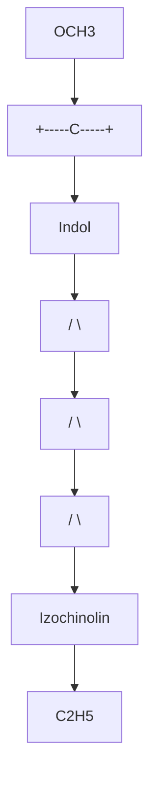
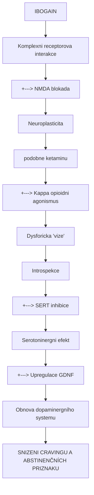

+++
title = "Ibogain"
description = "Psychoaktivni alkaloid z Tabernanthe iboga s unikátnimi anti-zavislostnimi vlastnostmi - prerusovac opioidni zavislosti"
weight = 15

[taxonomies]
tridy = ["Indolove alkaloidy", "Ibogany"]
receptory = ["NMDA", "Opioidni", "Sigma-2", "SERT"]
zdroje = ["Tabernanthe iboga", "Voacanga africana"]
+++

# Ibogain - Alkaloid prerusujici zavislost

**Ibogain** je prirodni psychoaktivni alkaloid ziskavany predevsim z africke rostliny **Tabernanthe iboga**. Vyznacuje se unikatni schopnosti prerusovat zavislost na opioidech, kokainu a dalsich navykovych latkach. Mechanismus ucinku zahrnuje komplexni pusobeni na mnozstvi receptorovych systemu vcetne [NMDA](@/receptors/nmda.md), opioidnich a serotonergních receptoru.

---

## Chemicka struktura

### Zakladni parametry

| Vlastnost | Hodnota |
|-----------|---------|
| **Chemicky nazev** | 12-methoxyibogamin |
| **Alternativni nazvy** | Ibogain, Ibogaine |
| **Molekularni vzorec** | C20H26N2O |
| **Molekularni hmotnost** | 310,44 g/mol |
| **CAS cislo** | 83-74-9 |
| **IUPAC** | (6R,7S,7aS)-6-ethyl-7,7a-dihydro-7-[(1S)-1-methoxyethyl]-6H-indolo[2,3-a]quinolizine |
| **PubChem CID** | 197060 |
| **DrugBank ID** | DB04902 |

### Strukturni klasifikace

| Kategorie | Zarazeni |
|-----------|----------|
| **Trida** | Indolove alkaloidy |
| **Podtrida** | Ibogany (monoterpenoidni indoly) |
| **Stereochemie** | Vice chiralnich center |
| **Puvod** | Prirodni (T. iboga, V. africana) |

### Strukturni diagram



<details>
<summary>ASCII verze diagramu</summary>

```
         OCH3
          |
    +-----C-----+
    |     |     |
    |   [Indol] |
    |     |     |
    |    [N]    |
    |   /   \   |
    |  /     \  |
    | /       \ |
    [Izochinolin]
        |
       C2H5
```

</details>

---

## Fyzikalne-chemicke vlastnosti

| Vlastnost | Hodnota |
|-----------|---------|
| **Teplota tani** | 152-153 C |
| **Barva** | Bila az nazloutla krystalicka |
| **Rozpustnost ve vode** | Mirna (HCl sol rozpustna) |
| **pKa** | 8,1 |
| **logP** | 3,5 (lipofilni) |
| **Biologicky polocas** | 24-48 hodin |
| **Vazba na proteiny** | Vysoka |

---

## Historie

### Tradicni pouziti

| Obdobi | Kontext | Vyznam |
|--------|---------|--------|
| **Prekolonialni** | Bwiti tradice (Gabon, Kamerun) | Iniciace, ritualy |
| **19. stoleti** | Francouzska kolonizace | Prvni zapadni kontakt |
| **1901** | Izolace ibogainu (Dybowski & Landrin) | Farmakognozie |
| **1962** | Objev anti-zavislostniho ucinku (H. Lotsof) | Paradigmaticky zlom |
| **1980s-90s** | Podzemni lecba zavislosti | Sebesvedectvi |
| **2000s** | Klinicke studie, legalni kliniky | Vedecke overovani |

### Howard Lotsof a objev

**Howard Lotsof** (1943-2010), sam zavislý na heroinu, nahodne objevil anti-zavislostni ucinek ibogainu v roce 1962:

> *"Po ibogainovem zazitku jsem si uvedomil, ze nemam abstinenční příznaky a zadnou touhu po heroinu."*

Lotsof stravil zbytek zivota propagaci ibogainu jako lecby zavislosti a ziskal patenty na jeho pouziti.

---

## Farmakologie

### Receptorovy profil

| Receptor | Ki (nM) | Ucinek | Funkce |
|----------|---------|--------|--------|
| **NMDA (PCP site)** | 1,000-3,000 | Antagonista | Anti-zavislostni |
| **Opioidni (kappa)** | 2,000-4,000 | Agonista | Dysforicky |
| **Opioidni (mu)** | 10,000+ | Slaby agonista | Mirna analgezie |
| **Sigma-2** | 200-900 | Agonista | Neuroplasticita |
| **SERT** | 500-2,000 | Inhibitor | Serotoninergni |
| **DAT** | >10,000 | Slaba inhibice | Minimalni |
| **5-HT2A** | >10,000 | Minimalni | Zanedbatelny |
| **nACh (alpha-3-beta-4)** | 20,000 | Antagonista | Nikotinovy? |

### Noribogain - aktivni metabolit

**Noribogain** (12-hydroxyibogamin) je hlavni aktivni metabolit s delsi puldobou eliminace:

| Parametr | Ibogain | Noribogain |
|----------|---------|------------|
| **T1/2** | 4-7 hodin | 24-48 hodin |
| **Kappa opioidni** | Stredni | Vyssi |
| **SERT afinita** | Stredni | Vyssi |
| **Trvani ucinku** | Hodiny | Dny |

### Mechanismus anti-zavislostniho ucinku



<details>
<summary>ASCII verze diagramu</summary>

```
IBOGAIN
    |
    v
Komplexni receptorova interakce
    |
    +---> NMDA blokada
    |         |
    |         v
    |     Neuroplasticita
    |     (podobne ketaminu)
    |
    +---> Kappa opioidni agonismus
    |         |
    |         v
    |     Dysforicka "vize"
    |     Introspekce
    |
    +---> SERT inhibice
    |         |
    |         v
    |     Serotoninergni efekt
    |
    +---> Upregulace GDNF
              |
              v
          Obnova dopaminergního systemu
              |
              v
          SNIZENI CRAVINGU A ABSTINENČNÍCH PRIZNAKU
```

</details>

### Teorie mechanismu

1. **Neuroplasticita**: NMDA antagonismus a GDNF indukce umoznuje "reset" zavislostních okruhu
2. **Vizionarska introspekce**: Intenzivni psychedelicky zazitek s kappa opioidní dysforií vede k psychologickemu insightu
3. **Metabolit efekt**: Noribogain poskytuje prodlouzenou kappa opioidni a serotoninergni aktivitu

---

## Farmakokinetika

### Parametry

| Parametr | Hodnota |
|----------|---------|
| **Biodostupnost** | ~30-40% (oralni) |
| **Tmax** | 2-4 hodiny |
| **T1/2 (ibogain)** | 4-7 hodin |
| **T1/2 (noribogain)** | 24-48 hodin |
| **Metabolismus** | CYP2D6 (hlavni) |
| **Eliminace** | Renalni, hepatalni |

### Metabolismus

```
IBOGAIN
    |
    | [CYP2D6] - O-demethylace
    | (Hlavni cesta)
    v
NORIBOGAIN (aktivni)
    |
    | [Glukuronidace]
    v
Noribogain-glucuronid
    |
    v
Eliminace (moc)
```

### CYP2D6 variabilita

| Fenotyp | Dusledek |
|---------|----------|
| **Poor metabolizer** | Zvysena ibogain toxicita |
| **Extensive metabolizer** | Typicky pruběh |
| **Ultrarapid metabolizer** | Rychly metabolismus |

---

## Fenomenologie

### Faze ibogainoveho zazitku

| Faze | Cas | Charakteristika |
|------|-----|-----------------|
| **Akutni vizionarska** | 4-8 h | Intenzivni vize, "filmove" zazitky |
| **Hodnoticí/reflexivni** | 8-24 h | Introspekce, zpracovani |
| **Rezidualní** | 24-72 h | Unava, integrace |
| **Post-efekt** | Dny-tydny | Snizeny craving, zmeny mysleni |

### Vizionarska zkusenost

| Aspekt | Popis |
|--------|-------|
| **Vizualni** | Panoramaticke, "filmove" sekvence |
| **Obsah** | Autobiograficke vzpominky, rodinne konstelace |
| **Afektivni** | Casto dysforicky (kappa aktivita) |
| **Telesnost** | Vyrazna ataxie, nausea |
| **Zvuk** | Charakteristicky "bzuceni" (buzzing) |
| **Insight** | Pochopeni korenu zavislosti |

### Srovnani s klasickymi psychedeliky

| Aspekt | Ibogain | Psilocybin | DMT |
|--------|---------|------------|-----|
| **Trvani** | 24-36 h | 4-6 h | 15-30 min |
| **Charakter** | Filmovy, dysforicky | Organicky, euforicky | Vizionarsky |
| **Afekt** | Casto neprijemny | Variabilni | Intenzivni |
| **Telesnost** | Vyrazna ataxie | Mirna | Mirna |
| **Insight** | Specificky pro zavislost | Obecny | Variabilni |

---

## Klinicke pouziti

### Lecba opioidni zavislosti

| Aspekt | Hodnota |
|--------|---------|
| **Davka** | 10-25 mg/kg |
| **Podani** | Oralne (tobolky) |
| **Setting** | Medicinsky monitoring |
| **Efektivita** | 50-80% krátkodobe snizeni uzivani |
| **Trvani efektu** | Tydny az mesice |

### Protokol lecby

```mermaid
flowchart TD
    node_PREDLECBOU17dni["PRED LECBOU 1-7 dni"]
    node_53e1b860["+----------------------------------+"]
    node_EKGscreeningQTc450ms["EKG screening QTc &lt; 450 ms"]
    node_Medicinskaevaluace["Medicinska evaluace"]
    node_Detoxifikaceminimaln["Detoxifikace minimalne"]
    node_Psychologickapriprav["Psychologicka priprava"]
    node_IBOGAINOVASESSION243["IBOGAINOVA SESSION 24-36 h"]
    node_Davka1025mgkgoralne["Davka: 10-25 mg/kg oralne"]
    node_Kontinualnimonitorin["Kontinualni monitoring"]
    node_EKGtelemetrie["EKG telemetrie"]
    node_Hydratace["Hydratace"]
    node_Minimalnistimulace["Minimalni stimulace"]
    node_REKONVALESCENCE17dni["REKONVALESCENCE 1-7 dni"]
    node_Monitoringvitalnichf["Monitoring vitalnich funkci"]
    node_Postupnamobilizace["Postupna mobilizace"]
    node_Integracniterapie["Integracni terapie"]
    node_FOLLOWUPtydnymesice["FOLLOW-UP tydny-mesice"]
    node_Psychoterapie["Psychoterapie"]
    node_Podpurneskupiny["Podpurne skupiny"]
    node_Monitoringrelapsu["Monitoring relapsu"]

    node_PREDLECBOU17dni --> node_53e1b860
    node_53e1b860 --> node_EKGscreeningQTc450ms
    node_EKGscreeningQTc450ms --> node_Medicinskaevaluace
    node_Medicinskaevaluace --> node_Detoxifikaceminimaln
    node_Detoxifikaceminimaln --> node_Psychologickapriprav
    node_Psychologickapriprav --> node_IBOGAINOVASESSION243
    node_IBOGAINOVASESSION243 --> node_Davka1025mgkgoralne
    node_Davka1025mgkgoralne --> node_Kontinualnimonitorin
    node_Kontinualnimonitorin --> node_EKGtelemetrie
    node_EKGtelemetrie --> node_Hydratace
    node_Hydratace --> node_Minimalnistimulace
    node_Minimalnistimulace --> node_REKONVALESCENCE17dni
    node_REKONVALESCENCE17dni --> node_Monitoringvitalnichf
    node_Monitoringvitalnichf --> node_Postupnamobilizace
    node_Postupnamobilizace --> node_Integracniterapie
    node_Integracniterapie --> node_FOLLOWUPtydnymesice
    node_FOLLOWUPtydnymesice --> node_Psychoterapie
    node_Psychoterapie --> node_Podpurneskupiny
    node_Podpurneskupiny --> node_Monitoringrelapsu
```



<details>
<summary>ASCII verze diagramu</summary>

```
PRED LECBOU (1-7 dni)
+----------------------------------+
| EKG screening (QTc < 450 ms)     |
| Medicinska evaluace              |
| Detoxifikace (minimalne)         |
| Psychologicka priprava           |
+----------------------------------+
            |
            v
IBOGAINOVA SESSION (24-36 h)
+----------------------------------+
| Davka: 10-25 mg/kg oralne        |
| Kontinualni monitoring           |
| EKG telemetrie                   |
| Hydratace                        |
| Minimalni stimulace              |
+----------------------------------+
            |
            v
REKONVALESCENCE (1-7 dni)
+----------------------------------+
| Monitoring vitalnich funkci      |
| Postupna mobilizace              |
| Integracni terapie               |
+----------------------------------+
            |
            v
FOLLOW-UP (tydny-mesice)
+----------------------------------+
| Psychoterapie                    |
| Podpurne skupiny                 |
| Monitoring relapsu               |
+----------------------------------+
```

</details>

### Klinicka evidence

| Studie | N | Design | Vysledky |
|--------|---|--------|----------|
| **Alper et al. 1999** | 33 | Open-label | 25 z 33 bez opiatu 72h post |
| **Mash et al. 2000** | 27 | Observacni | Signifikantni snizeni withdrawal |
| **Brown & Alper 2018** | 30 | Observacni | Dlouhodobe snizeni uzivani |
| **Davis et al. 2017** | 88 | Survey | 30% abstinence 1 rok |

---

## Bezpecnost

### Hlavni rizika

| Riziko | Mechanismus | Management |
|--------|-------------|------------|
| **QT prolongace** | hERG blokada | EKG screening, monitoring |
| **Bradykardie** | Vagova aktivace | Monitoring, atropin |
| **Nahlá smrt** | Arytmie | Kardialni screening |
| **Ataxie/pady** | CNS deprese | Lezici pozice |

### Mortalita

| Aspekt | Hodnota |
|--------|---------|
| **Odhadovana mortalita** | 1:300 az 1:400 |
| **Hlavni pricina** | Kardialni arytmie |
| **Rizikove faktory** | KV choroby, elektrolytova dysbalance, interakce |

### Kontraindikace

| Absolutni | Relativni |
|-----------|-----------|
| Prodlouzeny QTc (>450ms) | Hepatalni insuficience |
| Kardialni arytmie | Psychiatricka onemocneni |
| Srdecni selhani | Vyssi vek |
| Nekontrolovana hypertenze | Epilepsie |
| Soucasne QT-prodluzujici leky | |

### Interakce

| Latka | Riziko | Dusledek |
|-------|--------|----------|
| **QT-prodluzujici leky** | Kriticke | Torsades de pointes |
| **Opioidy** | Vysoke | Potenciace, arytmie |
| **SSRI/SNRI** | Stredni | Serotoninergni |
| **CYP2D6 inhibitory** | Stredni | Zvysena toxicita |

---

## Pravni status

### Mezinarodni

| Jurisdikce | Status |
|------------|--------|
| **USA** | Schedule I (zakazany) |
| **Kanada** | Prescription drug |
| **Brazilie** | Legalni (medicinske pouziti) |
| **Mexiko** | Neregulovan |
| **Kostarika** | Neregulovan (kliniky) |
| **Jizni Afrika** | Schedule 6 |
| **Novy Zeland** | Legalni s povolenim |

### Ceska republika

| Aspekt | Status |
|--------|--------|
| **Pravni status** | Neschvaleny lecivý pripravek |
| **Drzeni** | Pravne nejasne |
| **Terapeuticke pouziti** | Nepovoleno |

---

## 18-MC a derivaty

### 18-Methoxycoronaridin

Semisynteticky derivat ibogainu s potencialne lepsim bezpecnostnim profilem:

| Aspekt | Ibogain | 18-MC |
|--------|---------|-------|
| **QT prolongace** | Ano | Minimalni |
| **Psychoaktivita** | Silna | Minimalni |
| **Anti-zavislostni** | Ano | Ano (preklinicke) |
| **Status** | Vyzkumny | Klinicke testovani |

---

## Reference

### Klinicke studie

1. Alper, K.R. et al. (1999). *Treatment of acute opioid withdrawal with ibogaine*. American Journal on Addictions.

2. Mash, D.C. et al. (2000). *Ibogaine: Complex pharmacokinetics, concerns for safety, and preliminary efficacy measures*. Annals of the New York Academy of Sciences.

3. Brown, T.K. & Alper, K. (2018). *Treatment of opioid use disorder with ibogaine: detoxification and drug use outcomes*. American Journal of Drug and Alcohol Abuse.

### Farmakologie

4. Baumann, M.H. et al. (2001). *Noribogaine (12-hydroxyibogamine): A biologically active metabolite of the antiaddictive drug ibogaine*. Annals of the New York Academy of Sciences.

5. He, D.Y. et al. (2005). *Glial cell line-derived neurotrophic factor mediates the desirable actions of the anti-addiction drug ibogaine against alcohol consumption*. Journal of Neuroscience.

### Bezpecnost

6. Koenig, X. et al. (2014). *Anti-addiction drug ibogaine inhibits hERG channels*. Pharmacology & Therapeutics.

---

## Krizove odkazy

### Souvisejici latky
- [Ketamin](@/alkaloids/ketamin.md) - Jiny NMDA antagonista s anti-zavislostnim potencialem
- [DMT](@/alkaloids/dmt.md) - Vizionarsky tryptamin
- [Psilocybin](@/alkaloids/psilocybin.md) - Zkousan pro zavislost

### Receptory
- [NMDA receptor](@/receptors/nmda.md) - Cil ibogainu
- [Kappa opioidni receptor](@/receptors/opioid.md) - Dysforicka aktivita
- [Sigma receptor](@/receptors/sigma-1.md) - Neuroprotekce

### Souvisejici temata
- [Zavislost](@/conditions/addiction.md) - Terapeuticka indikace
- [Opioidni abstinenční syndrom](@/glossary/opioid-withdrawal.md) - Cilovy stav
- [Neuroplasticita](@/glossary/neuroplasticita.md) - Mechanismus

---

Zpet na [Alkaloidy](@/alkaloids/_index.md) | [Ketamin](@/alkaloids/ketamin.md) | [NMDA receptor](@/receptors/nmda.md)
