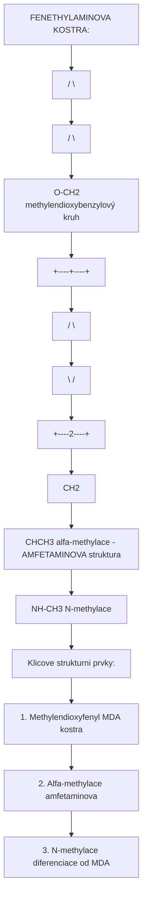
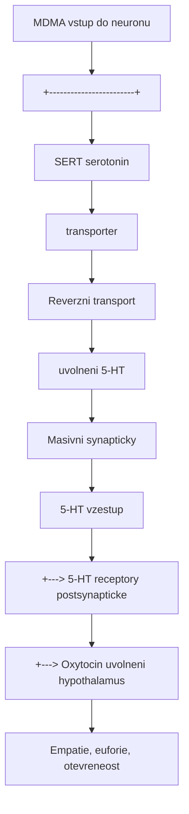
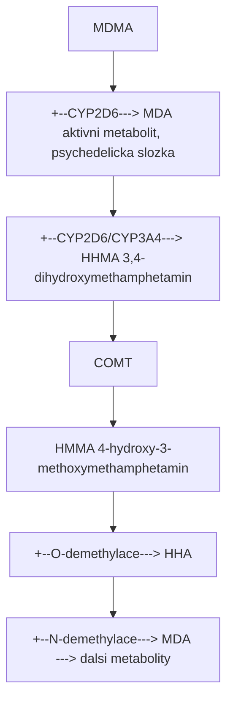

+++
title = "MDMA"
description = "MDMA (Extaze) - entaktogen a empatogen, serotoninove uvolnovani, PTSD-asistovana psychoterapie, neurofarmakologie"
weight = 15
+++

# MDMA - 3,4-Methylendioxymetamfetamin

**MDMA** (3,4-methylendioxymetamfetamin), znamy jako **Extaze** nebo **Molly**, je synteticky **entaktogen** a **empatogen** s unikatnim farmakologickym profilem. Na rozdil od klasickych psychedelik pusobi primarne prostrednictvim **masivniho uvolneni serotoninu** a vytvari stavy zvysene empatie, otevrrenosti a emocionalniho propojeni. V soucasnosti prochazi klinickymi studiemi jako prulomova lecba **PTSD**.

---

## Chemicka struktura

### Zakladni parametry

| Vlastnost | Hodnota |
|-----------|---------|
| **Chemicky nazev** | (RS)-1-(1,3-benzodioxol-5-yl)-N-methylpropan-2-amin |
| **Alternativni nazvy** | Extaze, Ecstasy, Molly, XTC, Adam |
| **Molekularni vzorec** | C11H15NO2 |
| **Molekularni hmotnost** | 193,25 g/mol |
| **CAS cislo** | 42542-10-9 |
| **IUPAC** | 1-(1,3-benzodioxol-5-yl)-N-methylpropan-2-amine |
| **SMILES** | CC(CC1=CC2=C(C=C1)OCO2)NC |
| **InChI Key** | SHXWCVYOXRDMCX-UHFFFAOYSA-N |

### Stereochemie

MDMA existuje jako racemicka smes dvou enantiomeru:

| Enantiomer | Ucinek | Potence |
|------------|--------|---------|
| **(S)-(+)-MDMA** | Vice stimulacni, "amfetaminovy" | 1.5-2x |
| **(R)-(-)-MDMA** | Vice entaktogenni, "empatogenni" | 1x (reference) |
| **(RS)-Racemat** | Kombinovany ucinek | Klinicky pouzivany |

### Strukturni klasifikace



<details>
<summary>ASCII verze diagramu</summary>

```
FENETHYLAMINOVA KOSTRA:
                    O
                   / \
                  /   \
              O-CH2    (methylendioxybenzylový kruh)
               |
          +----+----+
         /           \
        |      1      |
        |             |
         \           /
          +----2----+
               |
              CH2
               |
              CH(CH3) (alfa-methylace - AMFETAMINOVA struktura)
               |
              NH-CH3 (N-methylace)

Klicove strukturni prvky:
1. Methylendioxyfenyl (MDA kostra)
2. Alfa-methylace (amfetaminova)
3. N-methylace (diferenciace od MDA)
```

</details>

### Srovnani s pribuznyni slouceninanmi

| Sloucenina | Alfa-CH3 | N-CH3 | 3,4-methylendioxy | Ucinek |
|------------|----------|-------|-------------------|--------|
| **MDMA** | Ano | Ano | Ano | Entaktogen |
| **MDA** | Ano | Ne | Ano | Psychedelicka + entaktogen |
| **Amfetamin** | Ano | Ne | Ne | Stimulant |
| **Metamfetamin** | Ano | Ano | Ne | Stimulant |
| **Meskalin** | Ne | Ne | 3,4,5-trimethoxy | Psychedelikum |

---

## Fyzikalne-chemicke vlastnosti

| Vlastnost | Hodnota |
|-----------|---------|
| **Teplota tani** | 147-153 C (hydrochlorid) |
| **Barva** | Bila (cista), ruzova/bezova (necistoty) |
| **Rozpustnost ve vode** | Dobra (hydrochlorid) |
| **pKa** | 10.38 |
| **Log P** | 1.81 |
| **Stabilita** | Stabilni pri pokojové teplotě |

---

## Historie

### Chronologie

| Rok | Udalost | Osoba/Organizace |
|-----|---------|------------------|
| **1912** | Prvni synteza (patent) | Anton Kollisch, Merck |
| **1927** | Farmakologicke studie | Merck (nepublikovano) |
| **1953-54** | Armadni vyzkum (MDA) | US Army |
| **1976** | Znovuobjeveni pro psychoterapii | Alexander Shulgin |
| **1978** | Prvni terapeuticke pouziti | Leo Zeff |
| **1984** | Rozsirent rekreacni pouziti | Club scene, USA |
| **1985** | Zarazeni do Schedule I | DEA, USA |
| **2001** | Prvni FDA schvalena studie | MAPS |
| **2017** | Breakthrough Therapy Designation | FDA |
| **2023** | Faze III dokoncena | MAPS |
| **2024** | FDA rozhodnuti | Ocekavano |

### Alexander Shulgin a MDMA

Shulgin syntetizoval MDMA v roce 1965, ale jeho psychoaktivitu prozkoumal az v roce 1976. Popsal jej jako latku s **"snadno kontrolovatelnym zmenenym stavem vedomi s emocionalnimi a smyslsovymi pretvary"**.

V knize **PiHKAL** (1991) charakterizoval MDMA jako:
> *"Otevira srdce bez emocionalni zranitelnosti bezne spojene s takovym otevrinim."*

---

## Farmakologie

### Mechanismus ucinku

MDMA pusobi prostrednictvim **uvolneni monoaminu** (predevsim serotoninu) a **inhibice zpetneho vychytavani**:



<details>
<summary>ASCII verze diagramu</summary>

```
MDMA vstup do neuronu
        |
        v
+------------------------+
| SERT (serotonin        |
| transporter)           |
|   |                    |
|   v                    |
| Reverzni transport     |
| (uvolneni 5-HT)        |
|   |                    |
|   v                    |
| Masivni synapticky     |
| 5-HT vzestup           |
+------------------------+
        |
        +---> 5-HT receptory (postsynapticke)
        |
        +---> Oxytocin uvolneni (hypothalamus)
        |
        v
Empatie, euforie, otevreneost
```

</details>

### Neurotransmiterovy profil

| Neurotransmiter | Ucinek | Relativni sila | Funkcni dusek |
|-----------------|--------|----------------|---------------|
| **Serotonin (5-HT)** | Masivni uvolneni | +++ | Empatie, nalada, vnimani |
| **Dopamin (DA)** | Stredni uvolneni | ++ | Euforie, motivace |
| **Noradrenalin (NE)** | Stredni uvolneni | ++ | Energie, pozornost |
| **Oxytocin** | Zvysene uvolneni | ++ | Duvera, vazba |

### Receptorova afinita

| Cil | Ki/IC50 | Ucinek |
|-----|---------|--------|
| **SERT** | 238 nM | Inhibice + reverzni transport |
| **DAT** | 1,572 nM | Inhibice + reverzni transport |
| **NET** | 514 nM | Inhibice + reverzni transport |
| **5-HT2A** | 5,400 nM | Slaby agonista (MDA silnejsi) |
| **5-HT2B** | 900 nM | Agonista (kardiotoxicita?) |
| **TAAR1** | 750 nM | Agonista |
| **Alpha-2A** | 3,600 nM | Antagonista |

### Srovnani s klasickymi psychedeliky

| Parametr | MDMA | [LSD](@/alkaloids/lsd.md) | [Psilocybin](@/alkaloids/psilocybin.md) |
|----------|------|-----|------------|
| **Primarni mechanismus** | 5-HT uvolneni | 5-HT2A agonismus | 5-HT2A agonismus |
| **Vizualni halucinace** | Mirne/zadne | Silne | Silne |
| **Empatie** | **Velmi silna** | Stredni | Stredni |
| **Ego disoluce** | Vzacna | Casta | Casta |
| **Stimulace** | Silna | Stredni | Nizka |
| **Terapeuticky potencial** | PTSD | Deprese, zavislosti | Deprese, zavislosti |

---

## Farmakokinetika

### Zakladni parametry

| Parametr | Hodnota | Poznamka |
|----------|---------|----------|
| **Biodostupnost (p.o.)** | ~90% | Vysoka |
| **Tmax** | 1.5-2.5 h | Peak plazmaticke koncentrace |
| **T1/2** | 6-9 h | Eliminacni polocas |
| **Vd** | 5-10 L/kg | Velky distribucni objem |
| **Vazba na proteiny** | 34% | Nizka |
| **Trvani ucinku** | 3-6 h | Subjektivni |

### Metabolismus



<details>
<summary>ASCII verze diagramu</summary>

```
MDMA
  |
  +--[CYP2D6]---> MDA (aktivni metabolit, psychedelicka slozka)
  |
  +--[CYP2D6/CYP3A4]---> HHMA (3,4-dihydroxymethamphetamin)
  |                           |
  |                           v [COMT]
  |                      HMMA (4-hydroxy-3-methoxymethamphetamin)
  |
  +--[O-demethylace]---> HHA
  |
  +--[N-demethylace]---> MDA ---> dalsi metabolity
```

</details>

**Dulezite**: CYP2D6 polymorfismy ovlivnuji metabolismus - "poor metabolizers" maji vyssi riziko toxicity.

### Nelinearni farmakokinetika

MDMA vykazuje **autoinhibici CYP2D6**, coz vede k nelineairni kinetice:

| Dávka | Cmax (relativni) | AUC (relativni) |
|-------|------------------|-----------------|
| 75 mg | 1x | 1x |
| 100 mg | 1.5x | 1.7x |
| 125 mg | 2.3x | 3x |
| 150 mg | 3.5x | 5x+ |

**Varovani**: Vyssi davky neproporcionalne zvysuji expozici a riziko toxicity.

---

## Davkovani

### Doporucene davky

| Uroven | Davka | Zazitek | Poznamka |
|--------|-------|---------|----------|
| **Prah** | 30-50 mg | Mirna stimulace, nálada | Subtilni |
| **Lehka** | 50-75 mg | Euforie, otevrrenost | Socialni |
| **Stredni** | 75-125 mg | Plny entaktogenni zazitek | **Terapeuticka** |
| **Silna** | 125-175 mg | Intenzivni, mozne vizualy | Vyssi riziko |
| **Tezka** | 175+ mg | Nadmerna stimulace | **Nedoporuceno** |

### Terapeuticke davkovani (MAPS protokol)

| Sezeni | Davka | Cas | Poznamka |
|--------|-------|-----|----------|
| **Inicialni** | 80-120 mg | T0 | Hlavni davka |
| **Booster** | 40-60 mg | T+1.5-2.5h | Prodlouzeni (volitelne) |

---

## Fenomenologie zazitku

### Typicky pruběh

#### Nastup (30-60 min)

| Fenomen | Popis |
|---------|-------|
| **"Coming up"** | Nervozita, anticipace |
| **Telesne pocity** | Vlny tepla, tingling |
| **Pupily** | Mydriaza |
| **Celisti** | Stiskani (bruxismus) |

#### Peak (1-3 h)

| Fenomen | Popis |
|---------|-------|
| **Empatie** | Intenzivni pocit propojeni s ostatnimi |
| **Euforie** | Hluboka blahoprranost |
| **Otevrrenost** | Snizena emocionalni obrana |
| **Duvera** | Zvysena ochota sdilet |
| **Sensory enhancement** | Zesílene smyslove vnimani |
| **Telesny komfort** | Prijemne telesne pocity |

#### Plateau a sestup (3-6 h)

| Fenomen | Popis |
|---------|-------|
| **Postupne odeznivani** | Mirny pokles intenzity |
| **Integrace** | Zpracovani zazitku |
| **Unavao** | Narustajici fyzicka únava |

#### Aftereffects (6-48 h)

| Fenomen | Popis |
|---------|-------|
| **Afterglow** | Nektere pozitivni ucinky pretrvavaji |
| **"Tuesday blues"** | Mozny pokles nalady (2-4 dny) |
| **Unava** | Vyčerpanost |

---

## Terapeuticky potencial

### MDMA-asistovana psychoterapie pro PTSD

#### MAPS faze III studie

| Parametr | Hodnota |
|----------|---------|
| **Design** | Randomizovana, placebo-kontrolovana |
| **Populace** | Chronicka, treatment-resistant PTSD |
| **Protokol** | 3 MDMA sezeni + psychoterapie |
| **Davkovani** | 80-180 mg (+ volitelny booster) |
| **Primarni endpoint** | CAPS-5 skore |

#### Vysledky MAPP1 (2021)

| Skupina | Zmena CAPS-5 | Remise (CAPS-5 <12) |
|---------|--------------|---------------------|
| **MDMA + terapie** | -24.4 bodu | **67%** |
| **Placebo + terapie** | -13.9 bodu | 32% |
| **p-hodnota** | <0.001 | <0.001 |

#### Vysledky MAPP2 (2023)

| Skupina | Zmena CAPS-5 | Remise |
|---------|--------------|--------|
| **MDMA + terapie** | -23.7 bodu | **71%** |
| **Placebo + terapie** | -14.8 bodu | 48% |

### Mechanismy terapeutickeho ucinku

| Mechanismus | Popis |
|-------------|-------|
| **Snizeni strachu** | Utlum amygdaly |
| **Zvysena duvera** | Oxytocin → terapeuticky vztah |
| **Emocionalni otevrrenost** | Pristup k traumatickym vzpominkam |
| **Neuroplasticita** | BDNF, rekonsolidace pameti |
| **"Window of tolerance"** | Rozsireni kapacity pro emocionaln zátěž |

### Dalsá indikace (výzkum)

| Indikace | Status | Evidence |
|----------|--------|----------|
| **Socialni uzkost u autismu** | Faze II dokoncena | Pozitivni |
| **Alkoholismus** | Faze II | Slibna |
| **Uzkost u terminálních pacientu** | Pilotni studie | Pozitivni |
| **Pary terapie** | Vyzkumna | Anekdotalni |

---

## Bezpecnost a rizika

### Akutni rizika

| Riziko | Mechanismus | Prevence |
|--------|-------------|----------|
| **Hypertermie** | Stimulace + prostredí | Chlazeni, hydratace |
| **Hyponatremie** | Nadmerna hydratace + ADH | Mírna hydratace |
| **Serotonin syndrom** | Kombinace s MAOI/SSRI | **Absolutní kontraindikace** |
| **Kardiovaskularni** | Sympatomimeticke | Monitoring, KI u srdecnich chorob |
| **Hepatotoxicita** | Vzacna, idiosynkraticka | Screening |

### Chronicka rizika

| Riziko | Evidence | Poznamka |
|--------|----------|----------|
| **Serotonergni neurotoxicita** | Zvířecí modely (vysoke davky) | Lidska relevance nejista |
| **Kognitivni deficity** | Asociace u tezkych uzivatelu | Kauzalita nejasna |
| **Deprese/uzkost** | Nekonzistentni data | Confounders |
| **Valvulopatie** | Mozna (5-HT2B) | Dlouhodobe uzivani |

### Kontraindikace

#### Absolutni

- Soucasne MAOI (serotonin syndrom - smrtelne)
- Nekontrolovana hypertenze
- Zavazne kardiovaskularni onemocneni
- Anamneza maligni hypertermie

#### Relativni

- SSRI/SNRI (snizeny ucinek, riziko)
- Psychiatricke poruchy (bipolarni, psychoza)
- Jaterni onemocneni
- Gravidita

### Nebezpecné kombinace

| Latka | Riziko | Zavaznost |
|-------|--------|-----------|
| **MAOI** | Serotonin syndrom | **SMRTELNE** |
| **SSRI/SNRI** | SS, snizeny ucinek | Vysoke |
| **Tramadol** | Serotonin syndrom | Vysoke |
| **DXM** | Serotonin syndrom | Vysoke |
| **Kokain** | Kardiotoxicita | Vysoke |
| **Alkohol** | Dehydratace, hepatotoxicita | Stredni |

---

## Pravni status

### Mezinarodni

| Jurisdikce | Status | Poznamka |
|------------|--------|----------|
| **OSN** | Schedule I (1986) | Umluva o psychotropnich latkach |
| **USA** | Schedule I | Breakthrough Therapy pro PTSD |
| **EU** | Zakazano | Variabilni implementace |
| **Australie** | Schedule 8 (2023) | Schvaleno pro PTSD terapii |
| **Kanada** | Schedule I | Special Access Programme |
| **Svycarsko** | Kontrolovano | Terapeuticke vyjimky |

### Ceska republika

| Aspekt | Detail |
|--------|--------|
| **Zakon** | Narizeni vlady c. 463/2013 Sb. |
| **Kategorie** | Tabulka c. 1 (zakazane latky) |
| **Status** | Zakazano |
| **Terapeuticke pouziti** | Nezákonné (bez vyjimky) |

---

## Harm reduction

### Zasady bezpecnejsiho uzivani

| Zasada | Implementace |
|--------|--------------|
| **Testovani** | Reagencni testy (Marquis, Simon's) |
| **Davkovani** | Max 1.5 mg/kg, neprekracovat |
| **Hydratace** | 250-500 ml/h (ne vice!) |
| **Teplotni management** | Prestávky, chlazeni |
| **Intervaly** | Minimum 4-6 tydnu mezi pouziitim |
| **Set & setting** | Bezpecne prostredi, duveryhodni lide |

### Testovaci soupravy

| Test | Barva pro MDMA | Detekuje |
|------|----------------|----------|
| **Marquis** | Tmave fialova → cerna | MDMA, MDA, amfetaminy |
| **Simon's** | Modra | Sekundarni aminy (MDMA vs MDA) |
| **Mecke** | Modro-zelena | Methylendioxy skupinu |
| **Froehde** | Cerna | Siroky screening |

---

## Reference

### Primární literatura

1. Shulgin, A.T. & Nichols, D.E. (1978). *Characterization of three new psychotomimetics*. In R.C. Stillman & R.E. Willette (Eds.), The Psychopharmacology of Hallucinogens. Pergamon Press.
2. Shulgin, A. & Shulgin, A. (1991). *PiHKAL: A Chemical Love Story*. Transform Press.

### Klinicke studie MAPS

3. Mitchell, J.M. et al. (2021). *MDMA-assisted therapy for severe PTSD: a randomized, double-blind, placebo-controlled phase 3 study*. Nature Medicine, 27, 1025-1033.
4. Mitchell, J.M. et al. (2023). *MDMA-assisted therapy for moderate to severe PTSD: a randomized, placebo-controlled phase 3 trial*. Nature Medicine, 29, 2473-2480.

### Neurofarmakologie

5. Green, A.R. et al. (2003). *The pharmacology and clinical pharmacology of 3,4-methylenedioxymethamphetamine (MDMA, "ecstasy")*. Pharmacological Reviews, 55(3), 463-508.
6. Sessa, B. (2017). *MDMA and PTSD treatment: "PTSD: From novel pathophysiology to innovative therapeutics"*. Neuroscience Letters, 649, 176-180.

---

## Krizove odkazy

### Souvisejici temata
- [Harm Reduction](@/harm-reduction/_index.md) - zasady bezpecneho uzivani
- [MAOI](@/pharmacology/maoi.md) - nebezpecne interakce
- [Serotonin](@/glossary/serotonin.md) - klicovy neurotransmiter

### Receptory
- [5-HT2A](@/receptors/5-ht2a.md) - sekundarni cil
- [5-HT1A](@/receptors/5-ht1a.md) - modulacni receptor

### Srovnani
- [LSD](@/alkaloids/lsd.md) - klasicke psychedelikum
- [Psilocybin](@/alkaloids/psilocybin.md) - tryptaminove psychedelikum
- [Meskalin](@/alkaloids/mescaline.md) - fenethylaminove psychedelikum

---

Zpet na [Alkaloidy](@/alkaloids/_index.md) | [Harm Reduction](@/harm-reduction/_index.md) | [Vyzkum](@/research/_index.md)
