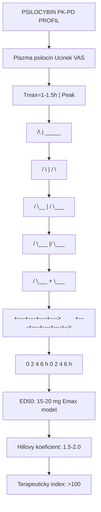

+++
title = "Psilocybin"
description = "O-fosforyl-4-hydroxy-DMT - psychoaktivni alkaloid z hub rodu Psilocybe - kompletni vedecky prehled"
weight = 1
+++

# Psilocybin - O-fosforyl-4-hydroxy-DMT

**Psilocybin** je psychoaktivní [tryptaminový](@/glossary/tryptamin.md) alkaloid nacházející se v [houbách rodu Psilocybe](@/shrooms/psilocybes/_index.md) a dalších rodech. Jedná se o **prodrug** [psilocinu](@/alkaloids/psilocin.md), který po defosforylaci působí jako [serotoninový](@/glossary/serotonin.md) agonista na [5-HT2A receptorech](@/receptors/5-ht2a.md), čímž vyvolává [psychedelické](@/glossary/psychedelikum.md) účinky.

Tato latka predstavuje jednu z nejintenzivneji zkoumanycch psychedelickych sloucenin v modernich klinickych studii, s prukopnickymi vysledky v lecbe rezistentni deprese, PTSD a zavislosti.

---

## Chemicka struktura

### Zakladni parametry

| Vlastnost | Hodnota |
|-----------|---------|
| **Chemicky nazev** | O-fosforyl-4-hydroxy-N,N-dimethyltryptamin |
| **Molekularni vzorec** | C12H17N2O4P |
| **Molekularni hmotnost** | 284,25 g/mol |
| **CAS cislo** | 520-52-5 |
| **IUPAC** | [3-(2-dimethylaminoethyl)-1H-indol-4-yl] dihydrogen phosphate |
| **PubChem CID** | 10624 |
| **ChEMBL ID** | CHEMBL398919 |
| **DrugBank ID** | DB11619 |

### Strukturni klasifikace

- **Skupina**: [Tryptaminy](@/alkaloids/_index.md)
- **Podskupina**: 4-substituovane tryptaminy
- **Biosynteza**: Z tryptofanu pres 4-hydroxytryptofan
- **Strukturni motiv**: Indolovy kruh s fosforylovou skupinou

### Strukturni porovnani s pribuznymy alkalioidy

| Sloucenina | R1 (pozice 4) | R2 (N-alkyl) | Aktivita |
|------------|---------------|--------------|----------|
| **Psilocybin** | OPO3H2 | N(CH3)2 | Prodrug |
| **Psilocin** | OH | N(CH3)2 | Aktivni |
| **Baeocystin** | OPO3H2 | NHCH3 | Mene aktivni |
| **Norbaeocystin** | OPO3H2 | NH2 | Slabe aktivni |
| **DMT** | H | N(CH3)2 | Aktivni (jiny receptor profil) |

---

## Fyzikalne-chemicke vlastnosti

| Vlastnost | Hodnota |
|-----------|---------|
| **Teplota tani** | 220-228 C (rozklad) |
| **Barva** | Bila az svetle bezova (krystalicka) |
| **Rozpustnost ve vode** | 10 mg/mL (20 C) |
| **Rozpustnost v methanolu** | Dobre rozpustny |
| **Rozpustnost v ethanolu** | Mirne rozpustny |
| **Stabilita** | Citlivy na svetlo, teplo, kyslik |
| **pH** | Slabe bazicky (pKa ~ 6,6) |
| **logP** | -0,07 (hydrofilni) |
| **Topicka polarna plocha** | 89,26 A2 |
| **Rotacni vazby** | 4 |

### Stabilita a degradace

Psilocybin podleha degradaci za nasledujicich podminek:

1. **Oxidace**: Modrohnede zbarveni (oxidace psilocinu)
2. **Hydroliza**: Defosforylace na psilocin ve vlhkem prostredi
3. **Fotodegradace**: Rozklad UV zarenim
4. **Termicka degradace**: Nad 180 C dochazi k rozpadu

**Doporucene skladovani**: Suche, tmave, chlazene (-20 C), inertn atmosfera (N2/Ar)

---

## Biosynteza v houbach

### Kompletni biosynteticka draha

Psilocybin je syntetizovan v houbach nasledujici enzymatickou cestou, ktera byla uplne objasnena v roce 2017 (Fricke et al.):

```
L-Tryptofan
    | [PsiD - tryptofan dekarboxylaza]
    | Dekarboxylace
    v
Tryptamin
    | [PsiH - tryptamin 4-hydroxylaza]
    | Hydroxylace na pozici C-4
    v
4-Hydroxytryptamin
    | [PsiK - 4-hydroxytryptamin kinaza]
    | Fosforylace (ATP -> ADP)
    v
4-Fosforyloxytryptamin (Norbaeocystin prekurzor)
    | [PsiM - N-methyltransferaza]
    | 1. methylace (SAM -> SAH)
    v
4-Fosforyloxy-N-methyltryptamin (Baeocystin)
    | [PsiM - N-methyltransferaza]
    | 2. methylace (SAM -> SAH)
    v
Psilocybin (4-Fosforyloxy-N,N-dimethyltryptamin)
```

### Alternativni draha (minoritni)

```
4-Hydroxytryptamin
    | [PsiM - N-methyltransferaza]
    | 2x methylace
    v
Psilocin (4-Hydroxy-N,N-dimethyltryptamin)
    | [PsiK nebo nespecificka kinaza]
    | Fosforylace
    v
Psilocybin
```

### Klicove enzymy biosyntezy

| Enzym | Gen | Funkce | Kofaktor | EC cislo |
|-------|-----|--------|----------|----------|
| **PsiD** | psiD | Aromaticka L-aminokyselina dekarboxylaza | PLP | 4.1.1.28 |
| **PsiH** | psiH | Tryptamin 4-hydroxylaza (P450) | O2, NADPH | 1.14.14.- |
| **PsiK** | psiK | 4-Hydroxytryptamin kinaza | ATP | 2.7.1.- |
| **PsiM** | psiM | S-adenosylmethionin-zavisla N-methyltransferaza | SAM | 2.1.1.- |

### Genetika biosyntezy

Biosynteticky genovy cluster psilocybinu byl identifikovan v Psilocybe cubensis:

- **Velikost clusteru**: ~25 kbp
- **Pocet genu**: 4 klicove (psiD, psiH, psiK, psiM) + 2 regulacni
- **Lokalizace**: Jaderna DNA
- **Evolucni puvod**: Horizontalni genovy prenos mezi houbovymi rody

### Biosynteticka regulace

| Faktor | Vliv na produkci |
|--------|------------------|
| Svetlo | Snizuje (fotoprotektivni funkce) |
| Teplota | Optimum 20-25 C |
| Vlhkost | Vyssi vlhkost zvysuje produkci |
| Nutrienty | Nizsi dostupnost stimuluje |
| Stres | Mechanicky stres zvysuje |
| Fazovost | Maximum v dobe sporulace |

---

## Farmakologie

### Mechanismus ucinku

Psilocybin je **neaktivni prodrug**. Ucinek nastupuje az po metabolicke konverzi:

```
Psilocybin -> [Alkalicka fosfataza] -> Psilocin -> 5-HT2A receptor
```

### Receptorovy profil psilocinu

| Receptor | Ki (nM) | Ucinek | Funkce |
|----------|---------|--------|--------|
| **[5-HT2A](@/receptors/5-ht2a.md)** | 6-20 | Silny agonista | Hlavni psychoaktivni ucinek |
| **5-HT2B** | 4-10 | Agonista | Kardiovaskularni (chronicka expozice) |
| **5-HT2C** | 40-100 | Castecny agonista | Modulace nalady, anxieta |
| **[5-HT1A](@/receptors/5-ht1a.md)** | 190-600 | Castecny agonista | Anxiolyticky efekt |
| **5-HT1B** | >1000 | Slaba afinita | Minimalni |
| **5-HT1D** | >1000 | Slaba afinita | Minimalni |
| **5-HT6** | 57 | Agonista | Kognitivni modulace |
| **5-HT7** | 3-15 | Agonista | Cirkadianni rytmy |
| **D1** | >10000 | Zadna | - |
| **D2** | >10000 | Zadna | - |
| **Sigma-1** | ~1000 | Niska afinita | Neuroprotekce |

### Signaln drahy

1. **Gq/11 draha** (hlavni):
   - 5-HT2A aktivace -> Gq -> PLC -> IP3/DAG -> Ca2+ release
   - Aktivace PKC -> neuronalni excitabilita

2. **Beta-arrestin draha**:
   - 5-HT2A -> beta-arrestin-2 -> internalizace receptoru
   - Aktivace ERK1/2 -> neuroplasticita

3. **mTOR draha**:
   - Aktivace mTORC1 -> synteza proteinu
   - Dendriticka arboryzace, synaptogeneze

### Farmakokinetika

| Parametr | Hodnota | Poznamka |
|----------|---------|----------|
| **Biologicka dostupnost** | 52.7% (p.o.) | Prvni pruchod metabolismus |
| **Tmax psilocybinu** | 30-60 minut | Plazmaticka koncentrace |
| **Tmax psilocinu** | 60-120 minut | Aktivni metabolit |
| **T1/2 psilocybinu** | 15-30 minut | Rychla konverze |
| **T1/2 psilocinu** | 2.5-3.5 hodiny | Eliminacni polocas |
| **Vd** | 277 L | Velky distribucni objem |
| **Clearance** | 3.1 L/min | Hepaticka + renalni |
| **Vazba na proteiny** | ~70% | Albumin |
| **Prostup HEB** | Ano (psilocin) | Aktivni metabolit |

### Doza-odpoved

| Doza (mg) | Uroven | Subjektivni ucinek |
|-----------|--------|---------------------|
| 1-5 | Mikrodoza | Zadny vedomý ucinek, subperceptualni |
| 5-10 | Treshold | Mírne zmeny vnimani, lehka euforie |
| 10-20 | Nizka | Vizuální distorze, zmenena nalada |
| 20-30 | Stredni | Silne vizuální halucinace, emocionalni intenzita |
| 30-40 | Vysoka | Ego disoluce, mysticke zkusenosti |
| 40+ | Heroicka | Kompletní ego smrt, transcendentni stavy |

---

## Metabolismus v organizmu

### Faze I - Hydrolytická defosforylace

```
Psilocybin -> [Alkalicka fosfataza (ALP)] -> Psilocin + Fosfat (Pi)
```

**Enzymy a lokalizace**:

| Enzym | Lokalizace | Relativni prispevek |
|-------|------------|---------------------|
| Intestinalni ALP | Tenke strevo | 40-50% |
| Hepaticka ALP | Játra | 30-40% |
| Renalni ALP | Ledviny | 10-15% |
| Serova ALP | Krev | 5-10% |

### Faze II - Konjugacni reakce

```
Psilocin -> [UGT1A9, UGT1A10] -> Psilocin-4-O-glukuronid
Psilocin -> [UGT1A9] -> Psilocin-N-glukuronid (minoritni)
```

**Hlavni metabolity**:

| Metabolit | Cesta | Aktivita |
|-----------|-------|----------|
| 4-Hydroxyindol-3-acetalahyd | MAO-A oxidace | Neaktivni |
| 4-Hydroxyindol-3-octova kyselina | ALDH oxidace | Neaktivni |
| Psilocin-O-glukuronid | UGT konjugace | Neaktivni |
| 4-Hydroxytryptofol | ADH redukce | Neaktivni |

### Eliminace

| Cesta | Podil | Forma |
|-------|-------|-------|
| Moc | 65% | Konjugovany psilocin (80%), volny psilocin (15%), nezmeneny psilocybin (5%) |
| Stolice | 25% | Biliární exkrece konjugatu |
| Ostatni | 10% | Tkanove zbytky |

**Detekční okno**:
- Moc: 24-72 hodin
- Krev: 6-24 hodin
- Vlasy: Neni detekovatelny (nizka inkorporace)

### Farmakogenetika

| Gen | Polymorfismus | Vliv |
|-----|---------------|------|
| CYP2D6 | PM/EM/UM | Minimalni (neni hlavni cesta) |
| UGT1A9 | *3/*5 | Snizena glukuronidace |
| MAO-A | VNTR | Zmenena rychlost metabolismu |
| 5-HTR2A | rs6313 (T102C) | Zmenena citlivost receptoru |

---

## Neuroplasticita a mechanismy ucinek

### BDNF a neurotropni faktory

Psilocybin/psilocin indukuji expresi neurotrofinů:

| Faktor | Zmena | Casový pruběh | Oblast [mozku](@/brain/_index.md) |
|--------|-------|---------------|-------------------------|
| **BDNF** | +200-400% | 24-72 h | Prefrontalni kortex, hippocampus |
| **NGF** | +50-100% | 12-48 h | Kortex |
| **GDNF** | +30-50% | 24-96 h | Substantia nigra |
| **Arc** | +300-500% | 1-6 h | Globalni |

### Dendriticka plasticita

Studie na zvírecích modelech a lidských neuronech in vitro ukazuji:

1. **Dendriticky rust**:
   - Zvyseni komplexity dendritického stromu o 10-15%
   - Zvyseni poctu dendritickych trnu o 20-30%
   - Efekt pretrvava 30+ dni po jednorázové aplikaci

2. **Synaptogeneze**:
   - Zvyseni synaptickych markeru (PSD-95, synaptofyzin)
   - Nove funkcni synapse behem 24-72 hodin

3. **Neuronalni konektivita**:
   - Zvysena funkcni konektivita mezi oblastmi mozku
   - Snizena aktivita Default Mode Network (DMN)

### Default Mode Network (DMN)

| Efekt | Mechanismus | Klinicky vyznam |
|-------|-------------|-----------------|
| Snizena aktivita DMN | 5-HT2A agonismus v PCC | Snizeni ruminace |
| Zvysena entropie | Dezintegrace normalnich vzorcu | Flexibilita mysleni |
| Nove konektomove vzorce | Tvorba netypickych spojeni | Kreativita, insight |
| Ego disoluce | Narušeni self-referential processing | Mysticke zkusenosti |

### Dlouhodobe neuralni zmeny

| Casovy rahec | Zmena | Evidence |
|--------------|-------|----------|
| Akutni (0-6h) | Receptor down-regulace, altered connectivity | fMRI, PET |
| Subakutni (1-7 dni) | Synaptogeneze, BDNF elevace | Zvíreci modely |
| Strednedoby (1-3 mesice) | Trvale zmeny v konektivite | Longitudinalni fMRI |
| Dlouhodoby (6+ mesicu) | Stabilni zmeny osobnosti (Openness) | Psychometricke studie |

---

## Klinické studie

### COMPASS Pathways (COMP360)

**Studie**: Phase IIb randomizovana, double-blind, multicentric
**Indikace**: Treatment-resistant depression (TRD)
**Design**:

| Rameno | Doza | N | MADRS zmena |
|--------|------|---|-------------|
| Psilocybin 25mg | Jedna dávka | 79 | -12.0 bodu (p<0.001) |
| Psilocybin 10mg | Jedna dávka | 75 | -7.9 bodu |
| Psilocybin 1mg | Kontrola | 79 | -5.4 bodu |

**Vysledky**:
- 29% pacientu v 25mg skupine dosahovalo remise v tyden 3
- Ucinek pretrvával u 20% az do tyden 12
- FDA Breakthrough Therapy Designation (2018)

### Johns Hopkins University

**Studie 1**: Psilocybin u rakoviny s úzkosti/deprese
- N = 51, crossover design
- Doza: 22 mg/70kg vs 1mg/70kg
- Vysledek: 80% signifikantne snizena deprese/úzkost v 6 mesicich

**Studie 2**: Psilocybin pro odvykání od nikotinu
- N = 15, otevrena studie
- 2-3 davky psilocybinu + kognitivne-behavioralni terapie
- Vysledek: 80% abstinence v 6 mesicich (vs 30% standardni lecby)

**Studie 3**: Psilocybin pro alkoholismus
- Phase II, N = 95
- Dve davky psilocybinu + psychoterapie
- Vysledek: 83% redukce tezkeho piti (vs 51% placebo)

### Imperial College London

**Studie**: Psilocybin vs escitalopram pro depresi
- N = 59, randomizovana, double-blind
- Design: Psilocybin (2x25mg) vs escitalopram (6 tydnu)

| Metrika | Psilocybin | Escitalopram | p-hodnota |
|---------|------------|--------------|-----------|
| QIDS-SR16 zmena | -8.0 | -6.0 | 0.17 (NS) |
| HAMD-17 zmena | -14.5 | -10.8 | <0.05 |
| BDI zmena | -17.8 | -13.4 | <0.05 |
| Remise | 57% | 28% | <0.05 |

### Prehled klinických studii (2024)

| Indikace | Faze | Status | Vedouci instituce |
|----------|------|--------|-------------------|
| TRD | Phase III | Pokracuje | COMPASS Pathways |
| MDD | Phase II | Dokoncena | Usona Institute |
| Anorexie | Phase II | Nabor | Imperial College |
| OCD | Phase II | Nabor | Yale University |
| PTSD | Phase II | Pokracuje | MAPS |
| Alkoholismus | Phase II | Dokoncena | NYU |
| Nikotinismus | Phase II/III | Pokracuje | Johns Hopkins |
| Cluster headache | Phase II | Pokracuje | Yale/MAPS |
| Kokainova zavislost | Phase I/II | Pokracuje | University of Alabama |

---

## Terapeuticke aplikace

### Rezistentni deprese (TRD)

**Mechanismus ucinku**:
1. Akutni 5-HT2A agonismus -> zmena neuronalni aktivity
2. Zvysena neuroplasticita -> nove synapse
3. Psychologicky insight -> kognitivni restrukturace
4. Dlouhodobe zmeny v konektivite -> trvale zlepseni

**Protokol lecby**:
- Priprava: 1-2 terapeuticke sezeni
- Davkovani: 25mg p.o., jedna dávka
- Setting: Kontrolovane prostredi, 2 terapeuti
- Integrace: 2-4 terapeuticke sezeni post-session

### PTSD

**Mechanismus**:
- Snizeni amygdalarni hyperaktivity
- Facilitace extinkcniho uceni
- Emocionalni zpracovani traumatickych vzpominek
- Zvysena kognitivni flexibilita

### End-of-life anxiety

**Studie NYU/Johns Hopkins**:
- Pacienti s zivot-ohrozujicim onkologickym onemocnenim
- Jedna dávka psilocybinu (0.3mg/kg)
- 80% zlepseni anxiety a deprese
- Ucinek trvajici 6+ mesicu

### Zavislosti

| Zavislost | Mechanismus | Efektivita |
|-----------|-------------|------------|
| Alkohol | Disruption of habit circuits | 83% redukce |
| Nikotin | Zvyseni self-efficacy | 80% abstinence |
| Kokain | Neuroplasticita, insight | Predbezna data |
| Opiaty | Zmenena odmena | Vyzkum |

---

## Srovnavací farmakologie

### Psilocybin vs ostatni psychedelika

| Parametr | Psilocybin | LSD | DMT | Mescalin |
|----------|------------|-----|-----|----------|
| **Receptor** | 5-HT2A (primarni) | 5-HT2A + D2 | 5-HT2A + Sigma-1 | 5-HT2A/2B/2C |
| **Nastup** | 30-60 min | 30-90 min | 1-5 min (i.v./inh) | 60-120 min |
| **Trvani** | 4-6 hodin | 8-12 hodin | 15-45 min | 8-12 hodin |
| **Doza** | 20-30 mg | 100-200 ug | 30-60 mg (inh) | 200-400 mg |
| **Tolerance** | Rychla (dny) | Rychla (dny) | Zadna | Rychla (dny) |
| **Krizova tolerance** | LSD, mescalin | Psilocybin, mescalin | Minimalni | Psilocybin, LSD |
| **Fyzicka toxicita** | Velmi nizka | Velmi nizka | Nizka | Nizka-stredni |
| **Potencial zavislosti** | Zadny | Zadny | Zadny | Zadny |

### Receptorova selektivita

| Sloucenina | 5-HT2A Ki | 5-HT2C Ki | 5-HT1A Ki | D2 Ki |
|------------|-----------|-----------|-----------|-------|
| Psilocin | 6 nM | 97 nM | 567 nM | >10000 |
| LSD | 2 nM | 23 nM | 1.4 nM | 150 nM |
| DMT | 75 nM | 360 nM | 750 nM | >10000 |
| Mescalin | 5000 nM | 3300 nM | >10000 | >10000 |

---

## Pravni ramec

### Mezinarodni status

| Jurisdikce | Status | Predpis |
|------------|--------|---------|
| **OSN** | Schedule I | Convention on Psychotropic Substances 1971 |
| **USA** | Schedule I | Controlled Substances Act |
| **EU** | Většina zakázáno | Národni legislativa |
| **Nizozemsko** | Cerstve houby legalni | Opium Act vyjimka |
| **Jamaica** | Legalni | Zadna regulace |
| **Brazilie** | Legalni (prirodni forma) | Absence v seznamu |

### Breakthrough Therapy Designation (USA)

| Rok | Indikace | Sponzor |
|-----|----------|---------|
| 2018 | Treatment-resistant depression | COMPASS Pathways |
| 2019 | Major depressive disorder | Usona Institute |
| 2020 | PTSD | MAPS |

### Decriminalizace v USA

| Lokace | Rok | Rozsah |
|--------|-----|--------|
| Denver, CO | 2019 | Osobni uziti, nejnizsi priorita |
| Oakland, CA | 2019 | Vsechny enthogeny |
| Santa Cruz, CA | 2020 | Vsechny enthogeny |
| Washington, DC | 2020 | Vsechny enthogeny |
| Oregon | 2020 | Terapeuticke uziti (M109) |
| Colorado | 2022 | Terapeuticke + osobni |

### Ceska republika

- **Narizen vlady c. 463/2013 Sb.**
- **Seznam**: Tabulka c. 1 (zakazane latky)
- **Trest za drzeni**: Az 1 rok vezení
- **Trest za vyzrobu/prodej**: 2-10 let
- **Vyjimka**: Vedecky vyzkum s povolenim SUKL

---

## Vyskyt v houbach

### Koncentrace podle druhu

| Druh | Psilocybin (% susiny) | Psilocin (% susiny) | Celkovy obsah |
|------|----------------------|---------------------|---------------|
| [P. semilanceata](@/shrooms/psilocybes/semilanceata.md) | 0.98% | 0.02% | 1.00% |
| P. azurescens | 1.78% | 0.38% | 2.16% |
| [P. cubensis](@/shrooms/psilocybes/cubensis.md) | 0.14-0.42% | 0.01-0.02% | 0.15-0.44% |
| P. cyanescens | 0.85% | 0.36% | 1.21% |
| P. baeocystis | 0.85% | 0.59% | 1.44% |
| P. tampanensis | 0.68% | 0.32% | 1.00% |
| P. mexicana | 0.25% | 0.15% | 0.40% |
| P. stuntzii | 0.36% | 0.12% | 0.48% |
| Panaeolus cyanescens | 0.85% | 0.30% | 1.15% |
| Gymnopilus spectabilis | 0.02% | 0.01% | 0.03% |

### Faktory ovlivnujici koncentraci

| Faktor | Vliv |
|--------|------|
| **Genetika** | Zakladni determinant, 10x variace mezi kmeny |
| **Cast plodnice** | Klobouk > tren > bazalni mycelium |
| **Vek** | Mlade plodnice > zrale > prestarle |
| **Suseni** | Snizuje psilocin (oxidace), zachovava psilocybin |
| **Skladovani** | Degradace casem (10-20% rocne pri pokojove teplotě) |
| **Substrat** | Výživnejsi substráty mohou snizovat koncentraci |
| **Svetlo** | Temne podminky zvysuji produkci |

### Distribuce v plodnici

| Cast | Relativni obsah |
|------|-----------------|
| Klobouček (pileus) | 100% (reference) |
| Lamely | 90-110% |
| Tren (stipe) | 50-80% |
| Bazalni mycelium | 20-40% |
| Spory | <1% |

---

## Analyticke metody

### HPLC-MS/MS (Zlatý standard)

| Parametr | Hodnota |
|----------|---------|
| **LOD** | 0.1 ng/mL (plasma) |
| **LOQ** | 0.5 ng/mL |
| **Linearita** | 0.5-500 ng/mL |
| **Mobilni faze A** | 0.1% kyselina mravenci v vode |
| **Mobilni faze B** | 0.1% kyselina mravenci v acetonitrilu |
| **Gradient** | 5-95% B za 15 min |
| **Kolona** | C18 reverse phase, 2.1x100mm, 1.7um |
| **Detekce** | ESI+, MRM |
| **MRM prechody** | 285->58, 285->240 (psilocybin) |

### GC-MS

| Parametr | Hodnota |
|----------|---------|
| **Derivatizace** | BSTFA + 1% TMCS |
| **Kolona** | HP-5MS, 30m x 0.25mm |
| **Teplota** | 100-300°C, 10°C/min |
| **Detekce** | EI, 70 eV |
| **Charakteristicke m/z** | 58, 204, 276 (psilocin-TMS) |

### Imunochemicke metody

| Metoda | LOD | Pouziti |
|--------|-----|---------|
| ELISA | 25 ng/mL | Screening |
| Lateral flow | 100 ng/mL | Terénni testy |
| RIA | 5 ng/mL | Vyzkum |

### Kvalitni kontrola pri vyrobe

| Test | Metoda | Specifikace |
|------|--------|-------------|
| Identita | IR, NMR | Shoda s referencí |
| Cistota | HPLC | >99% |
| Voda | Karl Fischer | <0.5% |
| Tezke kovy | ICP-MS | <10 ppm |
| Mikrobiologie | USP <61> | Neprítomnost patogenu |
| Endotoxiny | LAL | <0.25 EU/mg |

---

## Bezpecnostni profil

### Akutni toxicita

| Parametr | Hodnota | Poznamka |
|----------|---------|----------|
| **LD50 mysi (i.v.)** | 280 mg/kg | Velmi vysoka |
| **LD50 mysi (p.o.)** | >1000 mg/kg | Extrémnì vysoká |
| **LD50 potkani (p.o.)** | 1600 mg/kg | |
| **Terapeuticky index** | >1000 | Bezpečná sloucenina |
| **Smrtelna dávka (clovek)** | >17 g (odhadovano) | Prakticky nemozne |

### Fyziologicke ucinky

| Ucinek | Typicky rozsah | Nebezpecny rozsah |
|--------|----------------|-------------------|
| Srdeční frekvence | +10-30 bpm | Rídce >150 bpm |
| Krevni tlak | +10-20 mmHg | Rídce >180/120 |
| Telesna teplota | +0.5-1°C | Rídce febrilni |
| Zornice | Mydriaza | Konstantni |

### Nezadouci ucinky

| Typ | Incidence | Management |
|-----|-----------|------------|
| **Nausea** | 30-50% | Zazvorovy caj, antiemetika |
| **Uzkost** | 20-40% | Podpůrné prostredi |
| **Bolesti hlavy** | 10-20% | NSAID |
| **Zmateni** | 5-15% | Klidné prostredi |
| **Psychoza** | <1% | Benzodiazepiny (SOS) |
| **HPPD** | <0.1% | Nespecificka lecba |

### Kontraindikace

| Absolutni | Relativni |
|-----------|-----------|
| Schizofrenie | Bipolarni porucha |
| Psychoticka epizoda v anamneze | Úzkostna porucha |
| Lithium | SSRI/SNRI (snizeni ucinku) |
| Tehotenstvi | Kardiovaskulárni choroby |
| Kojeni | Epilepsie |

### Lekove interakce

| Lecivo | Interakce | Doporučení |
|--------|-----------|------------|
| **SSRI** | Snizeny ucinek | Vysadit 2 tydny pred |
| **MAOi** | Zesíleny, prodlouzeny ucinek | Kontraindikováno |
| **Lithium** | Riziko serotonínového syndromu | Absolutne kontraindikováno |
| **Tramadol** | Serotoninovy syndrom | Kontraindikovano |
| **Benzodiazepiny** | Snizeny psychedelický ucinek | Rescue medication |
| **Antipsychotika** | Blokaná ucinek | Kontraindikovano |

---

## Synteticka vyroba

### Laboratorni synteza (historicka)

Hofmann (1958) - prvni totalni synteza:

```
Indol + Oxalylchlorid -> Indol-3-glyoxylchlorid
    | Dimethylamin
    v
Indol-3-glyoxyl-N,N-dimethylamid
    | LiAlH4 redukce
    v
N,N-Dimethyltryptamin
    | 4-Hydroxylace
    v
Psilocin
    | Fosforylace (POCl3)
    v
Psilocybin
```

### Moderna biosynteticka produkce

**Heterologni exprese v E. coli/S. cerevisiae**:
- Exprese psiD, psiH, psiK, psiM
- Vytezeky: 10-100 mg/L kultury
- Vyhody: Skalovatelne, definovana cistota

### GMP vyroba pro klinicke studie

| Parametr | Pozadavek |
|----------|-----------|
| Cistota | >99.5% |
| Enantiopura | N/A (achiralni) |
| Mikrobiologie | Sterilni |
| Endotoxiny | <0.5 EU/mg |
| Stabilita | 24 mesicu (-20°C) |
| Baleni | Tobolky 1, 5, 10, 25 mg |

---

## Reference

### Primární literatura

1. Hofmann A, Heim R, Brack A, Kobel H. (1958). Psilocybin, ein psychotroper Wirkstoff aus dem mexikanischen Rauschpilz *Psilocybe mexicana* Heim. *Experientia* 14(3):107-109.

2. Fricke J, Blei F, Hoffmeister D. (2017). Enzymatic synthesis of psilocybin. *Angewandte Chemie* 56(40):12352-12355.

3. Carhart-Harris RL, et al. (2016). Psilocybin with psychological support for treatment-resistant depression. *Lancet Psychiatry* 3(7):619-627.

4. Griffiths RR, et al. (2016). Psilocybin produces substantial and sustained decreases in depression and anxiety in patients with life-threatening cancer. *Journal of Psychopharmacology* 30(12):1181-1197.

5. Johnson MW, et al. (2014). Pilot study of the 5-HT2AR agonist psilocybin in the treatment of tobacco addiction. *Journal of Psychopharmacology* 28(11):983-992.

6. Bogenschutz MP, et al. (2022). Psilocybin-assisted treatment for alcohol use disorder. *JAMA Psychiatry* 79(10):953-962.

7. Carhart-Harris RL, et al. (2021). Trial of psilocybin versus escitalopram for depression. *New England Journal of Medicine* 384(15):1402-1411.

8. Raison CL, et al. (2023). Single-dose psilocybin for major depressive disorder. *JAMA* 330(9):843-853.

### Review clanky

9. Nichols DE. (2016). Psychedelics. *Pharmacological Reviews* 68(2):264-355.

10. Johnson MW, Griffiths RR. (2017). Potential therapeutic effects of psilocybin. *Neurotherapeutics* 14(3):734-740.

11. Vollenweider FX, Preller KH. (2020). Psychedelic drugs: neurobiology and potential for treatment of psychiatric disorders. *Nature Reviews Neuroscience* 21(11):611-624.

12. Nutt D, et al. (2020). Effects of Schedule I drug laws on neuroscience research and treatment innovation. *Nature Reviews Neuroscience* 14(8):577-585.

### Knihy

13. Stamets P. (1996). *Psilocybin Mushrooms of the World*. Ten Speed Press.

14. Pollan M. (2018). *How to Change Your Mind*. Penguin Press.

15. Hofmann A. (1980). *LSD: My Problem Child*. McGraw-Hill.

---

## Detailni mechanismy ucinku

Pro hlubsi studium molekularnich mechanismu ucinku psilocybinu viz sekce [Mechanismy ucinku](@/mechanisms/_index.md):

### Receptorova kinetika a vazba

Psilocin (aktivni metabolit) se vaze na [5-HT2A receptor](@/receptors/5-ht2a.md) s Ki = 6-20 nM. Kineticke parametry vazby:

| Parametr | Hodnota | Srovnani s LSD |
|----------|---------|----------------|
| **Ki (5-HT2A)** | 6-20 nM | LSD: 1-2 nM |
| **kon** | ~10^6 M^-1 s^-1 | Stredni |
| **koff** | ~10^-2 s^-1 | Rychlejsi nez LSD |
| **Rezidencni cas** | ~100 s | LSD: >1000 s (lid) |
| **Receptor occupancy (30 mg)** | ~60-75% | PET data (Madsen 2019) |

Podrobnosti: [Receptorova kinetika](@/mechanisms/receptor-binding.md)

### Signalni kaskada

```
Psilocin + 5-HT2A
        |
        v
    Gq/11 aktivace (50-200 ms)
        |
        v
    PLCbeta -> IP3 + DAG
        |           |
        v           v
    Ca2+ z ER    PKC -> ERK1/2
        |               |
        v               v
    CaMKII          CREB fosforylace (15-60 min)
        |               |
        v               v
    Genova exprese: BDNF (+200-400%), Arc, c-Fos, EGR1
        |
        v
    mTOR -> Dendriticky rust, synaptogeneze (24-72 h)
```

Bias faktor: Psilocin vykazuje vyvazenou signalizaci Gq vs beta-arrestin (na rozdil od LSD, ktere preferuje Gq).

Podrobnosti: [Signalni transdukce](@/mechanisms/signal-transduction.md)

### Farmakokinetiko-farmakodynamicke vztahy



<details>
<summary>ASCII verze diagramu</summary>

```
PSILOCYBIN PK-PD PROFIL

Plazma (psilocin)              Ucinek (VAS)
    ^                              ^
    |   Tmax=1-1.5h               |    Peak
    |    /\                       |   _____
    |   /  \                      |  /     \
    |  /    \__                   | /       \___
    | /        \___               |/            \___
    |/             \___           +                 \___
    +----+----+----+---->         +----+----+----+----+-->
    0    2    4    6    h         0    2    4    6    h

ED50: 15-20 mg (Emax model)
Hillovy koeficient: 1.5-2.0
Terapeuticky index: >100
```

</details>

Hystereze: Psilocybin vykazuje minimalni PK-PD hysterezi diky rychle konverzi na psilocin (ALP defosforylace, t1/2 konverze = 15-30 min).

Podrobnosti: [PK-PD vztahy](@/mechanisms/pharmacokinetic-pharmacodynamic.md)

---

## Viz také

### Metabolismus a příbuzné alkaloids
- [Psilocin](@/alkaloids/psilocin.md) - **Aktivní metabolit psilocybinu**
- [Baeocystin](@/alkaloids/baeocystin.md) - Méně aktivní analog
- [Norbaeocystin](@/alkaloids/norbaeocystin.md) - Prekurzor biosyntézy
- [DMT](@/alkaloids/dmt.md) - Strukturně příbuzný tryptamin
- [5-MeO-DMT](@/alkaloids/5-meo-dmt.md) - Jiný terapeutický tryptamin

### Zdrojové houby
- [Psilocybe cubensis](@/shrooms/psilocybes/cubensis.md) - Nejběžnější druh
- [Psilocybe semilanceata](@/shrooms/psilocybes/semilanceata.md) - Evropský druh
- [Psilocybe azurescens](@/shrooms/psilocybes/azurescens.md) - Nejsilnější druh
- [Psilocybes](@/shrooms/psilocybes/_index.md) - Kompletní přehled druhů

### Receptory a mechanismy
- [5-HT2A receptor](@/receptors/5-ht2a.md) - **Primární cíl terapeutických efektů**
- [5-HT1A receptor](@/receptors/5-ht1a.md) - Sekundární cíl, anxiolýza
- [5-HT2C receptor](@/receptors/5-ht2c.md) - Modulace nálady
- [Serotonin](@/glossary/serotonin.md) - Endogenní ligand

### Mozkové oblasti a sítě
- [Prefrontální kortex](@/brain/prefrontal-cortex.md) - **Centrum REBUS efektu**
- [Default Mode Network](@/circuits/dmn.md) - **Hlavní cíl terapie deprese**
- [Hippocampus](@/brain/hippocampus.md) - Neuroplasticita, paměť
- [Amygdala](@/brain/amygdala.md) - Emoční regulace
- [Vizuální kortex](@/brain/visual-cortex.md) - Zdroj vizuálních efektů

### Terapeutické indikace
- [Deprese](@/conditions/depression.md) - **FDA Breakthrough designation**
- [Závislosti](@/conditions/addiction.md) - Experimentální léčba
- [PTSD](conditions/ptsd.md) - Kombinace s psychoterapií
- [Existenciální úzkost](conditions/anxiety.md) - Onkologičtí pacienti

### Fenomenologie a praxe
- [Mystické zážitky](@/phenomenology/mystical-experiences.md) - **Prediktor terapeutického výsledku**
- [Set and setting](@/glossary/set-and-setting.md) - Optimalizace efektu
- [Mikrodávkování](@/glossary/mikrodavkovani.md) - Sub-psychedelické dávky

### Srovnávací látky
- [Ketamin](@/alkaloids/ketamin.md) - Jiný rychle působící antidepresivum
- [LSD](@/alkaloids/lsd.md) - Delší trvání, podobné mechanismy
- [MDMA](@/alkaloids/mdma.md) - Terapeutické synergieß
- [LSD](@/alkaloids/lsd.md) - funkcne podobne psychedelikum
- [Mechanismy ucinku](@/mechanisms/_index.md) - molekularni mechanismy
- [Receptorova kinetika](@/mechanisms/receptor-binding.md) - vazebna kinetika
- [Signalni transdukce](@/mechanisms/signal-transduction.md) - signalni kaskady
- [PK-PD vztahy](@/mechanisms/pharmacokinetic-pharmacodynamic.md) - farmakokinetika a farmakodynamika

---

Zpet na [Alkaloidy](@/alkaloids/_index.md) | Dalsi: [Psilocin](@/alkaloids/psilocin.md)
