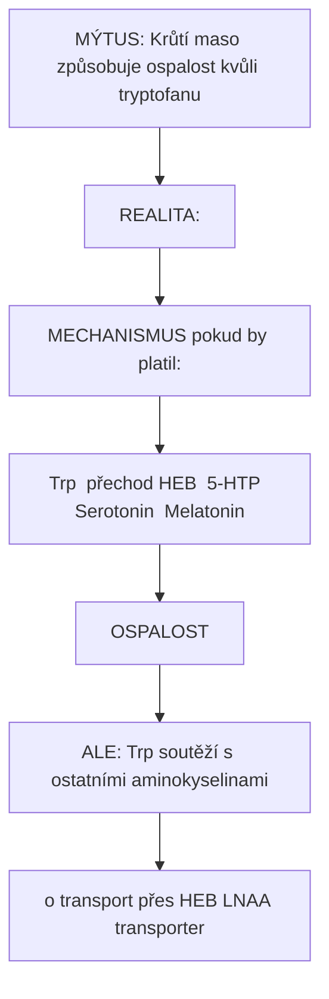
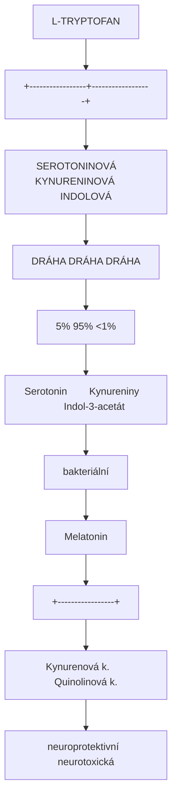
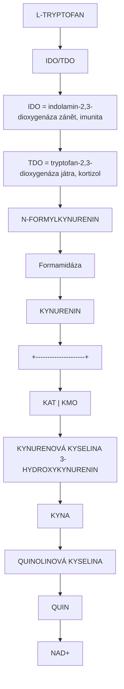
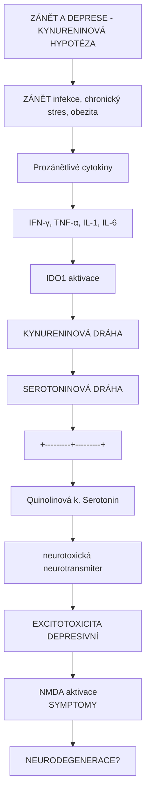
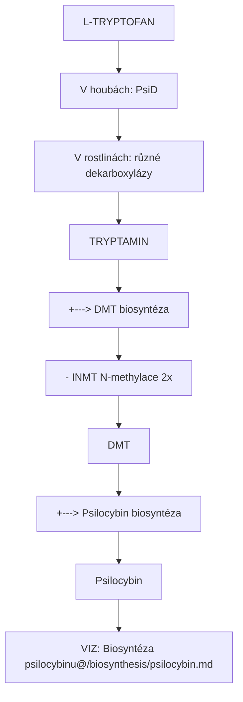
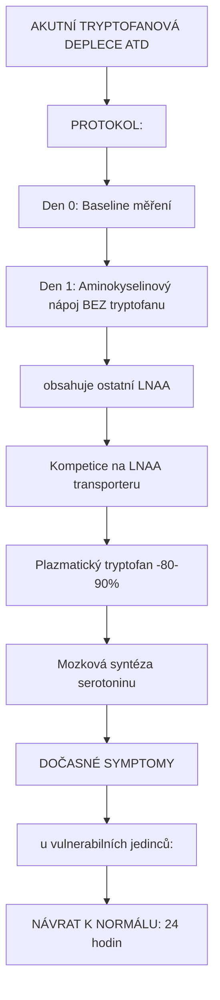
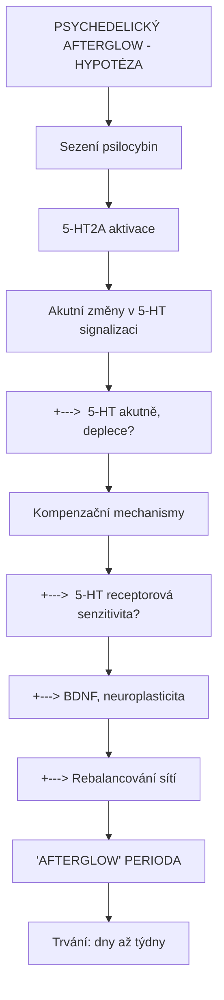

+++
title = "L-Tryptofan"
description = "Esenciální aminokyselina - prekurzor serotoninu a melatoninu s klíčovou rolí v neurochemii"
weight = 1

[taxonomies]
categories = ["aminokyseliny", "prekurzory", "biochemie"]
tags = ["tryptofan", "serotonin", "melatonin", "5-HTP", "esencialni", "biosynteza"]
+++

# L-Tryptofan - Esenciální aminokyselina

**L-Tryptofan** (Trp, W) je jedna z devíti **esenciálních aminokyselin**, která musí být přijímána potravou, protoze lidský organismus ji nedokáže syntetizovat. Je prekurzorem klíčových neuroaktivních molekul: **[serotoninu](@/glossary/serotonin.md)** (5-HT), **melatoninu**, a **kynureninů**. Hraje zásadní roli v neurochemii psychedelik, protože biosyntéza [psilocybinu](@/alkaloids/psilocybin.md), [DMT](@/alkaloids/dmt.md) a dalších tryptaminových alkaloidů vychází z tryptofanu.

---

## Chemická struktura

### Základní parametry

| Vlastnost | Hodnota |
|-----------|---------|
| **Chemický název** | (2S)-2-amino-3-(1H-indol-3-yl)propanová kyselina |
| **Zkratky** | Trp, W |
| **Molekulární vzorec** | C11H12N2O2 |
| **Molekulární hmotnost** | 204,23 g/mol |
| **CAS číslo** | 73-22-3 |
| **IUPAC** | (S)-2-amino-3-(1H-indol-3-yl)propanoic acid |
| **SMILES** | C1=CC=C2C(=C1)C(=CN2)C[C@@H](C(=O)O)N |
| **PubChem CID** | 6305 |
| **Chiralita** | L-enantiomer (biologicky aktivní) |

### Strukturní klasifikace

| Kategorie | Zařazení |
|-----------|----------|
| **Třída** | Alfa-aminokyseliny |
| **Typ** | Esenciální (nelze syntetizovat) |
| **Postranní řetězec** | Aromatická (indolová) |
| **Polarita** | Nepolární (hydrofobní) |
| **Kodon** | UGG (jediný) |

### Strukturní diagram

```
                    COOH
                     |
              H2N---C---H
                     |
                    CH2
                     |
               [INDOLOVÝ KRUH]
               /            \
          [Benzen]      [Pyrol]
              \            /
               C=========C
                    |
                    N
                    |
                    H

Indolový kruh = základ všech tryptaminů
- Serotonin
- Melatonin
- DMT
- Psilocybin/Psilocin
- LSD (ergoliny)
```

### Srovnání s jinými aromatickými aminokyselinami

| Aminokyselina | Postranní řetězec | Prekurzor pro |
|---------------|-------------------|---------------|
| **Tryptofan** | Indol | Serotonin, melatonin, tryptaminy |
| **Fenylalanin** | Fenyl | Tyrosin, dopamin, noradrenalin |
| **Tyrosin** | 4-hydroxyfenyl | Dopamin, noradrenalin, adrenalin |
| **Histidin** | Imidazol | Histamin |

---

## Fyzikálně-chemické vlastnosti

| Vlastnost | Hodnota |
|-----------|---------|
| **Teplota tání** | 289-290°C (rozklad) |
| **Barva** | Bílá krystalická |
| **Rozpustnost ve vodě** | 11,4 g/L (25°C) |
| **pKa (COOH)** | 2,38 |
| **pKa (NH3+)** | 9,39 |
| **Izoelektrický bod** | 5,89 |
| **UV absorpce** | 280 nm (indolový kruh) |
| **Fluorescence** | Ex 280 nm, Em 348 nm |

### Optická aktivita

| Parametr | Hodnota |
|----------|---------|
| **Specifická rotace [α]D** | -31,5° (c=1, H2O) |
| **Biologicky aktivní** | L-forma (S-konfigurace) |
| **D-forma** | Neaktivní pro syntézu proteinů |

---

## Zdroje v potravě

### Obsah v potravinách

| Potravina | Tryptofan (mg/100g) | Poznámka |
|-----------|---------------------|----------|
| **Sýry (tvrdé)** | 400-600 | Parmezán nejvíce |
| **Maso (drůbeží)** | 250-350 | Krůtí, kuřecí |
| **Ryby (losos)** | 250-300 | |
| **Vejce** | 150-200 | Celé vejce |
| **Ořechy** | 150-250 | Vlašské, mandle |
| **Semena** | 300-400 | Dýňová, sezamová |
| **Luštěniny** | 150-250 | Sója, čočka |
| **Tofu** | 200-250 | |
| **Banány** | 15-20 | Nízké |
| **Čokoláda (tmavá)** | 80-150 | |

### Doporučený denní příjem

| Populace | RDA (mg/kg/den) | Příklad (70 kg) |
|----------|-----------------|-----------------|
| **Dospělí** | 4 mg/kg | ~280 mg/den |
| **Těhotné** | 5 mg/kg | ~350 mg/den |
| **Kojící** | 7 mg/kg | ~490 mg/den |
| **Děti** | 4-7 mg/kg | Variabilní |

### "Turkey myth" - krůtí a ospalost



<details>
<summary>ASCII verze diagramu</summary>

```
MÝTUS: Krůtí maso způsobuje ospalost kvůli tryptofanu

REALITA:
- Krůtí obsahuje ~250 mg Trp/100g
- Ostatní maso má PODOBNÉ množství
- Ospalost po jídle = postprandiální somnolence
  - Velké porce
  - Vysoký obsah sacharidů
  - Alkohol
  - Relaxační atmosféra

MECHANISMUS (pokud by platil):
Trp → [přechod HEB] → 5-HTP → Serotonin → Melatonin
                                            ↓
                                         OSPALOST

ALE: Trp soutěží s ostatními aminokyselinami
     o transport přes HEB (LNAA transporter)
```

</details>

---

## Metabolismus tryptofanu

### Tři hlavní metabolické dráhy



<details>
<summary>ASCII verze diagramu</summary>

```
                        L-TRYPTOFAN
                             |
           +-----------------+------------------+
           |                 |                  |
           v                 v                  v
    SEROTONINOVÁ       KYNURENINOVÁ        INDOLOVÁ
        DRÁHA              DRÁHA             DRÁHA
        (5%)               (95%)             (<1%)
           |                 |                  |
           v                 v                  v
      Serotonin        Kynureniny         Indol-3-acetát
           |                 |             (bakteriální)
           v                 |
      Melatonin              |
                             |
           +-----------------+
           |                 |
           v                 v
    Kynurenová k.      Quinolinová k.
    (neuroprotektivní)  (neurotoxická)
```

</details>

### Serotoninová dráha (detailně)

```mermaid
flowchart TD
    node_LTRYPTOFAN["L-TRYPTOFAN"]
    node_TPHtryptofanhydroxyl["TPH - tryptofan hydroxylaza"]
    node_KofaktoryO2BH4tetrah["Kofaktory: O2, BH4 tetrahydrobiopterin, Fe2+"]
    node_LIMITUJCKROK["LIMITUJÍCÍ KROK!"]
    node_5HYDROXYTRYPTOFAN5HT["5-HYDROXYTRYPTOFAN 5-HTP"]
    node_AADCaromatickLaminok["AADC - aromatická L-aminokyselina dekarboxyláza"]
    node_KofaktorPLPvitaminB6["Kofaktor: PLP vitamin B6"]
    node_SEROTONIN5HT["SEROTONIN 5-HT"]
    node_MAOA5HIAAexkrece["+---&gt; MAO-A ---&gt; 5-HIAA exkrece"]
    node_AANATaralkylaminNace["AANAT - aralkylamin N-acetyltransferáza"]
    node_epifzenonregulace["epifýze, noční regulace"]
    node_NACETYLSEROTONIN["N-ACETYLSEROTONIN"]
    node_HIOMThydroxyindolOme["HIOMT - hydroxyindol-O-methyltransferáza"]
    node_MELATONIN["MELATONIN"]

    node_LTRYPTOFAN --> node_TPHtryptofanhydroxyl
    node_TPHtryptofanhydroxyl --> node_KofaktoryO2BH4tetrah
    node_KofaktoryO2BH4tetrah --> node_LIMITUJCKROK
    node_LIMITUJCKROK --> node_5HYDROXYTRYPTOFAN5HT
    node_5HYDROXYTRYPTOFAN5HT --> node_AADCaromatickLaminok
    node_AADCaromatickLaminok --> node_KofaktorPLPvitaminB6
    node_KofaktorPLPvitaminB6 --> node_SEROTONIN5HT
    node_SEROTONIN5HT --> node_MAOA5HIAAexkrece
    node_MAOA5HIAAexkrece --> node_AANATaralkylaminNace
    node_AANATaralkylaminNace --> node_epifzenonregulace
    node_epifzenonregulace --> node_NACETYLSEROTONIN
    node_NACETYLSEROTONIN --> node_HIOMThydroxyindolOme
    node_HIOMThydroxyindolOme --> node_MELATONIN

    click node_5HYDROXYTRYPTOFAN5HT "/supplements/5-htp/" "5-HYDROXYTRYPTOFAN 5-HTP"
    click node_SEROTONIN5HT "/glossary/serotonin/" "SEROTONIN 5-HT"
    click node_NACETYLSEROTONIN "/glossary/serotonin/" "N-ACETYLSEROTONIN"
    click node_MELATONIN "/molecules/melatonin/" "MELATONIN"
```



<details>
<summary>ASCII verze diagramu</summary>

```
L-TRYPTOFAN
     |
     | [TPH - tryptofan hydroxylaza]
     | Kofaktory: O2, BH4 (tetrahydrobiopterin), Fe2+
     | LIMITUJÍCÍ KROK!
     |
     v
5-HYDROXYTRYPTOFAN (5-HTP)
     |
     | [AADC - aromatická L-aminokyselina dekarboxyláza]
     | Kofaktor: PLP (vitamin B6)
     |
     v
SEROTONIN (5-HT)
     |
     +---> [MAO-A] ---> 5-HIAA (exkrece)
     |
     | [AANAT - aralkylamin N-acetyltransferáza]
     | (v epifýze, noční regulace)
     |
     v
N-ACETYLSEROTONIN
     |
     | [HIOMT - hydroxyindol-O-methyltransferáza]
     |
     v
MELATONIN
```

</details>

### Kynureninová dráha (95% tryptofanu)



<details>
<summary>ASCII verze diagramu</summary>

```
L-TRYPTOFAN
     |
     | [IDO/TDO]
     | IDO = indolamin-2,3-dioxygenáza (zánět, imunita)
     | TDO = tryptofan-2,3-dioxygenáza (játra, kortizol)
     |
     v
N-FORMYLKYNURENIN
     |
     | [Formamidáza]
     |
     v
KYNURENIN
     |
     +---------------------+
     |                     |
     | [KAT]               | [KMO]
     v                     v
KYNURENOVÁ KYSELINA    3-HYDROXYKYNURENIN
(KYNA)                      |
- NMDA antagonista          | [KYNU]
- nACh antagonista          v
- neuroprotektivní     3-HYDROXYANTHRANILOVÁ K.
                            |
                            v
                     QUINOLINOVÁ KYSELINA
                     (QUIN)
                     - NMDA agonista
                     - NEUROTOXICKÁ
                            |
                            v
                        NAD+
```

</details>

### Klíčové enzymy

| Enzym | Gen | Funkce | Regulace |
|-------|-----|--------|----------|
| **TPH1** | TPH1 | 5-HTP syntéza (periferie) | Ca2+, cAMP |
| **TPH2** | TPH2 | 5-HTP syntéza (CNS) | Stres, cirkadián |
| **IDO1** | IDO1 | Kynurenin (imunitní) | IFN-γ (ZÁNĚT!) |
| **TDO** | TDO2 | Kynurenin (játra) | Kortizol |
| **AADC** | DDC | Dekarboxylace | Konstitutivní |

---

## Kynureniny a neuropsychiatrie

### Kynurenin/tryptofan poměr



<details>
<summary>ASCII verze diagramu</summary>

```
ZÁNĚT A DEPRESE - KYNURENINOVÁ HYPOTÉZA

ZÁNĚT (infekce, chronický stres, obezita)
              |
              v
       ↑ Prozánětlivé cytokiny
       (IFN-γ, TNF-α, IL-1, IL-6)
              |
              v
       ↑ IDO1 aktivace
              |
              v
    ↑ KYNURENINOVÁ DRÁHA
    ↓ SEROTONINOVÁ DRÁHA
              |
    +---------+---------+
    |                   |
    v                   v
↑ Quinolinová k.   ↓ Serotonin
(neurotoxická)     (neurotransmiter)
    |                   |
    v                   v
EXCITOTOXICITA     DEPRESIVNÍ
(NMDA aktivace)    SYMPTOMY
    |
    v
NEURODEGENERACE?
```

</details>

### Klinické asociace

| Stav | Kynureninový profil |
|------|---------------------|
| **Deprese** | ↑ Kyn/Trp, ↑ QUIN |
| **Schizofrenie** | ↑ KYNA |
| **Huntington** | ↑ QUIN |
| **Alzheimer** | ↑ QUIN, ↓ KYNA |
| **MS** | ↑ QUIN |
| **Sepse** | ↑↑ Kyn/Trp |

---

## Tryptofan a psychedelika

### Tryptofan jako prekurzor tryptaminů



<details>
<summary>ASCII verze diagramu</summary>

```
L-TRYPTOFAN
     |
     | [V houbách: PsiD]
     | [V rostlinách: různé dekarboxylázy]
     |
     v
TRYPTAMIN
     |
     +---> [DMT biosyntéza]
     |     - INMT (N-methylace 2x)
     |     → DMT
     |
     +---> [Psilocybin biosyntéza]
           - PsiH (4-hydroxylace)
           - PsiK (fosforylace)
           - PsiM (N-methylace)
           → Psilocybin

VIZ: [Biosyntéza psilocybinu](@/biosynthesis/psilocybin.md)
```

</details>

### Strukturní vztahy

| Sloučenina | Modifikace tryptaminu |
|------------|----------------------|
| **Tryptamin** | Dekarboxylovaný Trp |
| **Serotonin** | 5-hydroxy-tryptamin |
| **DMT** | N,N-dimethyltryptamin |
| **Psilocin** | 4-hydroxy-N,N-dimethyltryptamin |
| **Psilocybin** | 4-fosforyloxy-N,N-dimethyltryptamin |
| **5-MeO-DMT** | 5-methoxy-N,N-dimethyltryptamin |
| **Bufotenin** | 5-hydroxy-N,N-dimethyltryptamin |

### TRYPTOFAN DEPLETION TEST

Výzkumná metoda pro studium serotoninu:



<details>
<summary>ASCII verze diagramu</summary>

```
AKUTNÍ TRYPTOFANOVÁ DEPLECE (ATD)

PROTOKOL:
Den 0: Baseline měření
Den 1: Aminokyselinový nápoj BEZ tryptofanu
       (obsahuje ostatní LNAA)
       |
       v
Kompetice na LNAA transporteru
       |
       v
↓↓ Plazmatický tryptofan (-80-90%)
       |
       v
↓↓ Mozková syntéza serotoninu
       |
       v
DOČASNÉ SYMPTOMY
(u vulnerabilních jedinců):
- Depresivní nálada
- ↓ Pozitivní afekt
- ↑ Impulzivita
- Kognitivní změny

NÁVRAT K NORMÁLU: 24 hodin
```

</details>

---

## Tryptofan jako doplněk stravy

### Suplementace

| Forma | Dávka | Indikace |
|-------|-------|----------|
| **L-Tryptofan** | 500-2000 mg/den | Spánek, nálada |
| **5-HTP** | 50-300 mg/den | Deprese, úzkost, spánek |

### 5-HTP vs L-Tryptofan

| Aspekt | L-Tryptofan | 5-HTP |
|--------|-------------|-------|
| **Vstup do mozku** | Kompetice s LNAA | Lepší prostup |
| **Enzym limitující** | TPH (pomalý) | AADC (rychlý) |
| **Periferní konverze** | Minimální | Možná (serotonin periferně) |
| **Kynureninová dráha** | Ano (95% odchází) | Ne |
| **Dávkování** | Vyšší (500-2000 mg) | Nižší (50-300 mg) |
| **Vedlejší účinky** | Méně | Více GIT (periferní 5-HT) |

### Bezpečnost a interakce

| Riziko | Mechanismus | Doporučení |
|--------|-------------|------------|
| **Serotonin syndrom** | S SSRI, MAOI | KONTRAINDIKOVÁNO |
| **EMS (eozinofilní myalgie)** | Kontaminace (historicky 1989) | Kvalitní zdroj |
| **GIT potíže (5-HTP)** | Periferní serotonin | Začít nízkou dávkou |

### EMS epidemie 1989

```
EOZINOFILNÍ MYALGIE SYNDROM (1989)

Příčina: Kontaminovaný L-tryptofan
         z jednoho japonského výrobce (Showa Denko)

Kontaminant: "Peak E" - derivát tryptofanu

Příznaky:
- Těžká myalgie
- Eosinofilie (↑↑↑)
- Periferní neuropatie
- Sklerodermie-like změny

Následky:
- >1500 případů
- ~37 úmrtí
- Zákaz prodeje L-Trp v USA (1990-2005)

Současnost:
- L-Trp opět povolen
- Kvalitní výrobci bez kontaminace
- Bezpečný při správném užívání
```

---

## Tryptofan v kontextu psychedelické terapie

### "Serotonergní toning"

Některé protokoly doporučují:

```
PŘED PSYCHEDELICKÝM SEZENÍM

Cíl: Optimalizace serotonergního systému

Doporučení:
1. Dostatečný příjem Trp v potravě
2. Vitamin B6 (pro AADC)
3. Vitamin D (modulace IDO)
4. Omega-3 (protizánětlivé)

BĚHEM:
- Potraviny bohaté na Trp mohou teoreticky
  podpořit obnovení 5-HT po akutní depleci

PO:
- "Integration diet" - vyváženášená strava
- Podpora neuroplasticity (BDNF)
```

### Tryptofan a "afterglow"



<details>
<summary>ASCII verze diagramu</summary>

```
PSYCHEDELICKÝ AFTERGLOW - HYPOTÉZA

Sezení (psilocybin)
        |
        v
5-HT2A aktivace
        |
        v
Akutní změny v 5-HT signalizaci
        |
        +---> ↓ 5-HT (akutně, deplece?)
        |
        v
Kompenzační mechanismy
        |
        +---> ↑ 5-HT receptorová senzitivita?
        +---> ↑ BDNF, neuroplasticita
        +---> Rebalancování sítí
        |
        v
"AFTERGLOW" PERIODA
- Zlepšená nálada
- Otevřenost
- Snížená úzkost
        |
        v
Trvání: dny až týdny
```

</details>

---

## Reference

### Základní biochemie

1. Palego, L. et al. (2016). *Tryptophan biochemistry: Structural, nutritional, metabolic, and medical aspects in humans*. Journal of Amino Acids.

2. Richard, D.M. et al. (2009). *L-Tryptophan: Basic metabolic functions, behavioral research and therapeutic indications*. International Journal of Tryptophan Research.

3. Badawy, A.A. (2017). *Kynurenine pathway of tryptophan metabolism: Regulatory and functional aspects*. International Journal of Tryptophan Research.

### Kynureniny a psychiatrie

4. Savitz, J. (2020). *The kynurenine pathway: A finger in every pie*. Molecular Psychiatry.

5. Schwarcz, R. et al. (2012). *Kynurenines in the mammalian brain: When physiology meets pathology*. Nature Reviews Neuroscience.

### Tryptofan a serotonin

6. Young, S.N. (2007). *How to increase serotonin in the human brain without drugs*. Journal of Psychiatry & Neuroscience.

7. Jenkins, T.A. et al. (2016). *Influence of tryptophan and serotonin on mood and cognition*. Nutrients.

---

## Křížové odkazy

### Souvisejici molekuly
- [Serotonin](@/glossary/serotonin.md) - Produkt serotoninové dráhy
- [Melatonin](@/molecules/melatonin.md) - Produkt z serotoninu
- [5-HTP](@/supplements/5-htp.md) - Mezistupeň biosyntézy

### Souvisejici alkaloidy
- [Psilocybin](@/alkaloids/psilocybin.md) - Derivát tryptofanu
- [DMT](@/alkaloids/dmt.md) - N,N-dimethyltryptamin
- [Tryptamin](@/glossary/tryptamin.md) - Dekarboxylovaný tryptofan

### Biosyntézy
- [Biosyntéza psilocybinu](@/biosynthesis/psilocybin.md) - Enzymatická dráha
- [Biosyntéza serotoninu](@/biosynthesis/serotonin.md) - Serotoninová dráha

### Receptory
- [5-HT2A receptor](@/receptors/5-ht2a.md) - Cíl tryptaminů
- [5-HT1A receptor](@/receptors/5-ht1a.md) - Anxiolytický receptor

---

<- Zpět na [Aminokyseliny](@/amino-acids/_index.md) | [Serotonin](@/glossary/serotonin.md) ->
