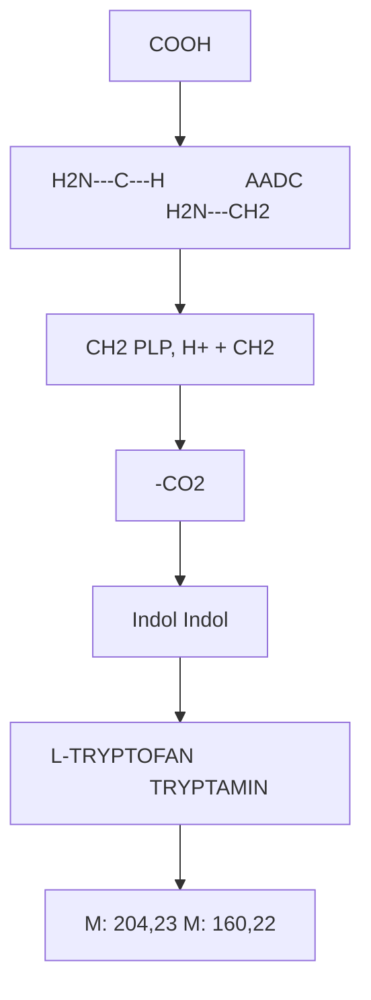
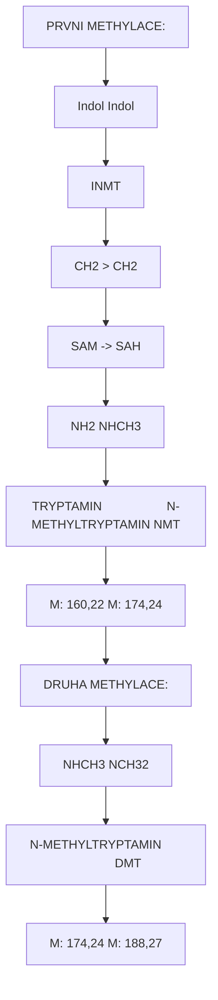
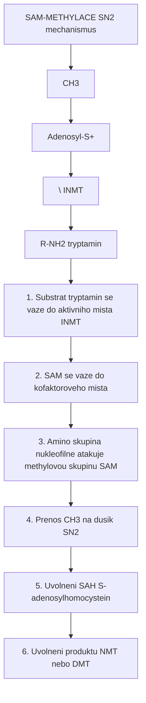
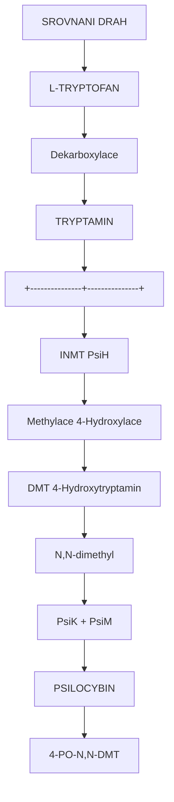
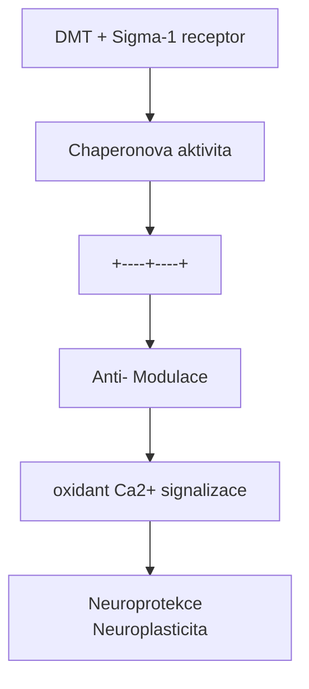

+++
title = "Biosynteza DMT"
description = "Enzymaticka draha syntézy N,N-dimethyltryptaminu - role INMT enzymu a endogenni produkce v lidskem tele"
weight = 2

[taxonomies]
categories = ["biosynteza", "enzymy", "neurochemie"]
tags = ["DMT", "INMT", "tryptamin", "endogenni", "biosynteza", "AADC"]
+++

# Biosynteza DMT - Endogenni produkce "Spirit Molecule"

**N,N-Dimethyltryptamin (DMT)** je tryptaminovy alkaloid syntetizovany prostrednictvim jednoduche enzymaticke drahy z aminokyseliny [L-tryptofanu](@/amino-acids/tryptophan.md). Unikatni je skutecnost, ze DMT je **endogenni sloucenina** - je produkovan v lidskem tele, vcetne mozku. Klicovym enzymem je **INMT (indolethylamin-N-methyltransferaza)**.

---

## Prehled biosynteticke drahy

### Schema kompletni drahy

```
L-TRYPTOFAN
     |
     | [AADC - Aromaticka L-aminokyselina dekarboxylaza]
     | Dekarboxylace (odstraneni COOH)
     | Kofaktor: PLP (pyridoxal-5'-fosfat, vitamin B6)
     |
     v
TRYPTAMIN
     |
     | [INMT - Indolethylamin-N-methyltransferaza]
     | Prvni N-methylace
     | Kofaktor: SAM (S-adenosylmethionin)
     |
     v
N-METHYLTRYPTAMIN (NMT)
     |
     | [INMT - Indolethylamin-N-methyltransferaza]
     | Druha N-methylace
     | Kofaktor: SAM -> SAH
     |
     v
N,N-DIMETHYLTRYPTAMIN (DMT)
```

### Klicove charakteristiky

| Aspekt | Hodnota |
|--------|---------|
| **Prekurzor** | L-Tryptofan |
| **Produkt** | DMT |
| **Pocet kroku** | 3 enzymaticke reakce |
| **Klicove enzymy** | AADC, INMT |
| **Kofaktory** | PLP (B6), SAM |
| **Endogenni produkce** | Ano (mozek, plice, jatra) |

---

## Jednotlive enzymy

### 1. AADC - Aromaticka L-aminokyselina dekarboxylaza

#### Charakteristika

| Vlastnost | Hodnota |
|-----------|---------|
| **EC cislo** | EC 4.1.1.28 |
| **Alternativni nazvy** | DOPA dekarboxylaza, DDC |
| **Gen** | DDC (chromozom 7) |
| **Kofaktor** | PLP (pyridoxal-5'-fosfat, vitamin B6) |
| **Substráty** | L-Tryptofan, L-DOPA, 5-HTP |
| **Lokalizace** | Serotoninergni a dopaminergni neurony, periferie |

#### Reakce



<details>
<summary>ASCII verze diagramu</summary>

```
        COOH
         |
  H2N---C---H              [AADC]              H2N---CH2
         |            ────────────────>              |
        CH2           PLP, H+            +          CH2
         |            -CO2                           |
    [Indol]                                    [Indol]

L-TRYPTOFAN                              TRYPTAMIN
 (M: 204,23)                             (M: 160,22)
```

</details>

#### Substrátova specificita

AADC je **nespicificka** - katalyzuje dekarboxylaci mnoha aromatickych aminokyselin:

| Substrát | Produkt | Vyznam |
|----------|---------|--------|
| **L-Tryptofan** | Tryptamin | DMT prekurzor |
| **5-Hydroxytryptofan** | Serotonin | Neurotransmiter |
| **L-DOPA** | Dopamin | Neurotransmiter |
| **L-Tyrosin** | Tyramin | Stopova amina |
| **L-Histidin** | Histamin | Histaminergni |

### 2. INMT - Indolethylamin-N-methyltransferaza

#### Charakteristika

| Vlastnost | Hodnota |
|-----------|---------|
| **EC cislo** | EC 2.1.1.49 |
| **Gen** | INMT (chromozom 7) |
| **Kofaktor** | S-adenosylmethionin (SAM) |
| **Produkt** | S-adenosylhomocystein (SAH) |
| **Substráty** | Tryptamin, NMT, serotonin |
| **Lokalizace** | Plice, mozek (vysoka), jatra, srdce |

#### Reakce (dve methylace)



<details>
<summary>ASCII verze diagramu</summary>

```
PRVNI METHYLACE:

   [Indol]                      [Indol]
       |          [INMT]             |
      CH2      ──────────>          CH2
       |       SAM -> SAH            |
      NH2                          NHCH3

TRYPTAMIN                   N-METHYLTRYPTAMIN (NMT)
(M: 160,22)                     (M: 174,24)


DRUHA METHYLACE:

   [Indol]                      [Indol]
       |          [INMT]             |
      CH2      ──────────>          CH2
       |       SAM -> SAH            |
     NHCH3                        N(CH3)2

N-METHYLTRYPTAMIN                   DMT
   (M: 174,24)                  (M: 188,27)
```

</details>

#### Mechanismus SAM-dependentni methylace



<details>
<summary>ASCII verze diagramu</summary>

```
SAM-METHYLACE (SN2 mechanismus)

              CH3
               |
    Adenosyl-S+
               \      [INMT]
                ────────────>
               /
           R-NH2 (tryptamin)

1. Substrat (tryptamin) se vaze do aktivniho mista INMT
2. SAM se vaze do kofaktoroveho mista
3. Amino skupina nukleofilne atakuje methylovou skupinu SAM
4. Prenos CH3 na dusik (SN2)
5. Uvolneni SAH (S-adenosylhomocystein)
6. Uvolneni produktu (NMT nebo DMT)
```

</details>

#### INMT kinetika

| Reakce | Km (uM) | Vmax (relativni) |
|--------|---------|------------------|
| **Tryptamin -> NMT** | 15-50 | 1,0 |
| **NMT -> DMT** | 50-100 | 0,7-0,8 |
| **Serotonin -> NMS** | 100-200 | 0,3-0,5 |

**Poznamka**: Tryptamin je preferovany substrat oproti serotoninu, coz vysvetluje, proc DMT prevazuje nad bufoteninem v endogenni produkci.

---

## Endogenni produkce DMT

### Evidence endogenni syntézy

#### Historicky prehled

| Rok | Objev | Vyznam |
|-----|-------|--------|
| **1965** | DMT detekovan v lidske moci | Franzen & Gross |
| **1972** | DMT v lidske krvi | Angrist et al. |
| **1976** | INMT aktivita v lidskem mozku | Saavedra & Axelrod |
| **2013** | DMT v mozku zivy potkanu | Barker et al. |
| **2019** | INMT exprese v lidske mozkove kure | Dean et al. |

#### Tkanova distribuce INMT

| Tkan | INMT exprese | Relativni |
|------|--------------|-----------|
| **Plice** | Velmi vysoka | +++++ |
| **Mozek** | Vysoka | +++ |
| **Jatra** | Stredni | ++ |
| **Srdce** | Nizsi | + |
| **Ledviny** | Nizsi | + |

### Mozkova produkce DMT

```
ENDOGENNI DMT V MOZKU

Tkane s INMT expresi:
- Mozkova kura (prefrontalni, temporalni)
- Hippocampus
- Choroidni plexus
- Pinealní žlaza (kontroverzni)

Merene koncentrace:
- Mozkova tkan: 10-50 pg/g
- CSF: Detekovatelne, nizke
- Krev: 0.1-1.0 ng/mL

Fyziologicka role: NEJASNA
Hypotezy:
1. Neuromodulátor
2. Role ve snění
3. Near-death experience mediátor
4. Sigma-1 receptor endogenní ligand
```

### Hypoteza pinealní produkce

Rick Strassman popularizoval teorii, ze DMT je produkovano pinealní žlazou:

| Aspekt | Evidence | Status |
|--------|----------|--------|
| **INMT v pinealni** | Slaba evidence | Kontroverzni |
| **DMT v pinealni** | Nezměřeno primoce | Nekonfirmovano |
| **Melatonin prekurzory** | Ano (5-MT -> 5-MeO-DMT?) | Teoreticke |

**Soucasny konsenzus**: DMT je pravdepodobne syntetizovan difuzne v mnoha tkanich, pinealní role je spekulativni.

---

## Regulace biosyntézy

### Faktory ovlivnujici DMT produkci

| Faktor | Vliv | Mechanismus |
|--------|------|-------------|
| **Dostupnost tryptofanu** | Primarni | Substratova limitace |
| **SAM hladiny** | Sekundarni | Methylacni kapacita |
| **Vitamin B6** | Nezbytny | AADC kofaktor |
| **INMT exprese** | Regulacni | Transkripční kontrola |
| **MAO aktivita** | Degradační | Metabolismus DMT |

### MAO a DMT degradace

```
DMT METABOLISMUS

DMT
 |
 | [MAO-A] - Oxidativni deaminace
 | (Hlavni degradacni cesta)
 v
Indol-3-acetalaldehyd (IAld)
 |
 | [ALDH]
 v
Indol-3-octova kyselina (IAA)
 |
 v
Eliminace

T1/2 DMT (endogenni): ~5-15 minut
```

### Proc je oralni DMT neaktivni

```
ORALNI PODANI DMT (bez MAOi)

DMT (pozity)
     |
     v
Absorpce ve streve
     |
     v
First-pass metabolismus (jatra)
     |
     | [MAO-A v jatrech]
     | Rychla degradace
     v
IAA (neaktivni)
     |
     v
ZADNY PSYCHOAKTIVNI UCINEK

RESENI: Ayahuasca
- MAO inhibitory (harmin, harmalin)
- Blokaduji hepatalni MAO
- Umoznuji DMT dosazeni mozku
```

---

## Srovnani s psilocybinovou biosyntezou

### Houbova vs. savci draha

| Aspekt | DMT (savci/rostliny) | Psilocybin (houby) |
|--------|---------------------|-------------------|
| **Prekurzor** | L-Tryptofan | L-Tryptofan |
| **Dekarboxylaza** | AADC | PsiD |
| **Hydroxylaza** | Zadna (pro DMT) | PsiH (4-hydroxylace) |
| **Kinaza** | Zadna | PsiK (fosforylace) |
| **Methyltransferaza** | INMT | PsiM |
| **Produkt** | DMT | Psilocybin |
| **Endogenni v lidech** | Ano | Ne |

### Klicove rozdily



<details>
<summary>ASCII verze diagramu</summary>

```
SROVNANI DRAH

L-TRYPTOFAN
      |
      | [Dekarboxylace]
      v
TRYPTAMIN
      |
      +---------------+---------------+
      |                               |
      v                               v
  [INMT]                          [PsiH]
  Methylace                       4-Hydroxylace
      |                               |
      v                               v
    DMT                     4-Hydroxytryptamin
(N,N-dimethyl)                        |
                                      | [PsiK + PsiM]
                                      v
                                  PSILOCYBIN
                              (4-PO-N,N-DMT)
```

</details>

---

## Endogenni DMT a psychofyziologie

### Hypotézy o funkci

| Hypoteza | Navrh | Evidence |
|----------|-------|----------|
| **Neuromodulator** | Sigma-1 receptor ligand | Stredni |
| **Dream mediator** | REM induktor | Slaba |
| **Stresova odpoved** | Cardiac arrest, hypoxie | Spekulativni |
| **NDE mediator** | Near-death psychedelie | Spekulativni |
| **Neuroprotekce** | Sigma-1 → anti-oxidant | Preklinicka |

### Sigma-1 receptor interakce

DMT je endogenni ligand sigma-1 receptoru:



<details>
<summary>ASCII verze diagramu</summary>

```
DMT + Sigma-1 receptor
         |
         v
Chaperonova aktivita
         |
    +----+----+
    |         |
    v         v
Anti-         Modulace
oxidant       Ca2+ signalizace
    |         |
    v         v
Neuroprotekce  Neuroplasticita
```

</details>

---

## Exogenni zdroje DMT

### Prirodni zdroje

| Zdroj | Cast | DMT obsah |
|-------|------|-----------|
| **Psychotria viridis** | Listy | 0,1-0,6% |
| **Mimosa hostilis** | Koren | 0,3-1,0% |
| **Acacia confusa** | Koren | 0,2-1,5% |
| **Anadenanthera** | Semena | DMT + 5-MeO-DMT |
| **Virola** | Pryskyrice | DMT + 5-MeO-DMT |

### Ayahuasca biosynteza

```
AYAHUASCA = DMT + MAOi

Komponent 1: Psychotria viridis (Chacruna)
- DMT producent
- Biosynteza: Tryptofan -> Tryptamin -> DMT

Komponent 2: Banisteriopsis caapi (Ayahuasca vine)
- MAO inhibitory: Harmin, Harmalin, THH
- Biosynteza: Tryptofan -> Harmalan pathway

KOMBINACE:
- MAOi blokuji intestinalni/hepatalni MAO
- DMT preziva first-pass
- Systemicka distribuce do mozku
- Psychedelicky ucinek
```

---

## Reference

### Historicke studie

1. Franzen, F. & Gross, H. (1965). *Tryptamine, N,N-dimethyltryptamine, N,N-diethyltryptamine and 5-hydroxytryptamine in human blood and urine*. Nature.

2. Saavedra, J.M. & Axelrod, J. (1972). *Psychotomimetic N-methylated tryptamines: formation in brain in vivo and in vitro*. Science.

### Soucasny vyzkum

3. Barker, S.A. et al. (2013). *LC/MS/MS analysis of the endogenous dimethyltryptamine hallucinogens, their precursors, and major metabolites in rat pineal gland microdialysate*. Biomedical Chromatography.

4. Dean, J.G. et al. (2019). *Biosynthesis and extracellular concentrations of N,N-dimethyltryptamine (DMT) in mammalian brain*. Scientific Reports.

5. Fontanilla, D. et al. (2009). *The hallucinogen N,N-dimethyltryptamine (DMT) is an endogenous sigma-1 receptor regulator*. Science.

### Enzymatika

6. Thompson, M.A. & Weinshilboum, R.M. (1998). *Rabbit lung indolethylamine N-methyltransferase*. Journal of Biological Chemistry.

---

## Krizove odkazy

### Produkty drahy
- [DMT](@/alkaloids/dmt.md) - Finalni produkt
- [Tryptamin](@/glossary/tryptamin.md) - Intermediat

### Prekurzory
- [L-Tryptofan](@/amino-acids/tryptophan.md) - Vychozi aminokyselina

### Souvisejici drahy
- [Biosynteza psilocybinu](@/biosynthesis/psilocybin.md) - Houbova draha
- [Biosynteza serotoninu](@/biosynthesis/serotonin.md) - Sdilene enzymy

### Receptory
- [5-HT2A receptor](@/receptors/5-ht2a.md) - Psychedelicky cil
- [Sigma-1 receptor](@/receptors/sigma-1.md) - Endogenni cil

---

<- Zpet na [Biosyntézy](@/biosynthesis/_index.md) | [DMT](@/alkaloids/dmt.md) ->
