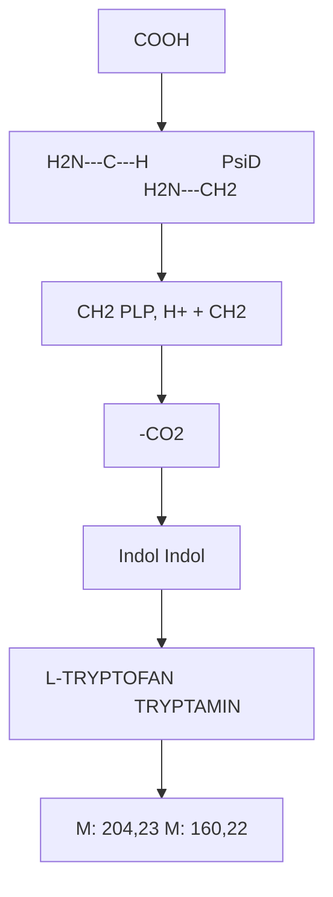
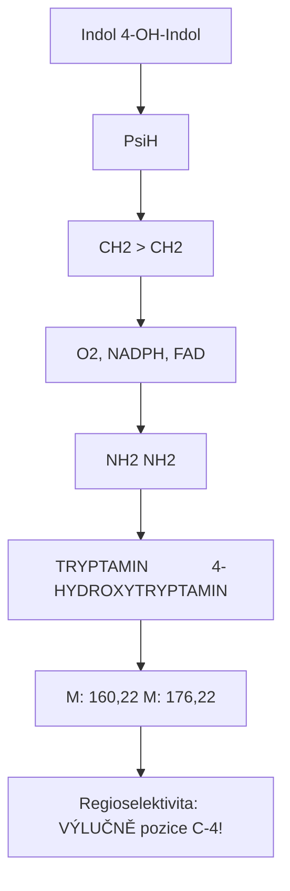
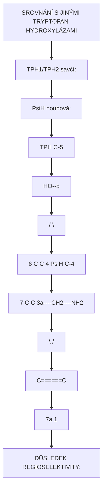
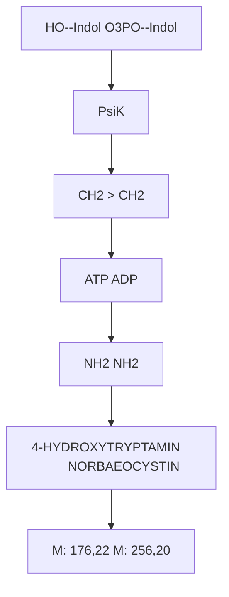
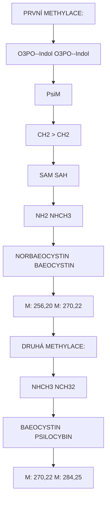
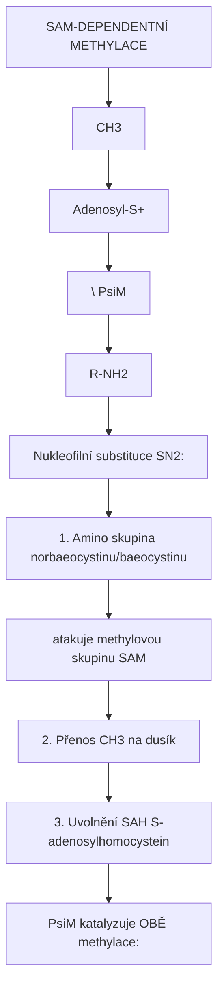
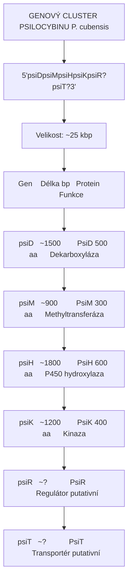
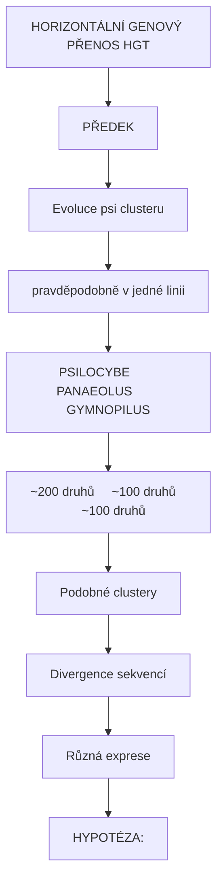
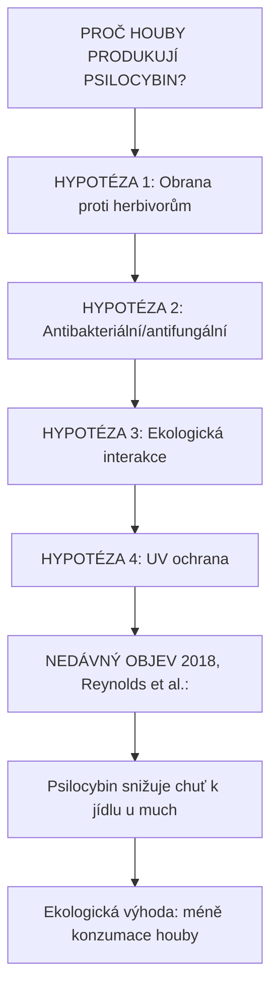
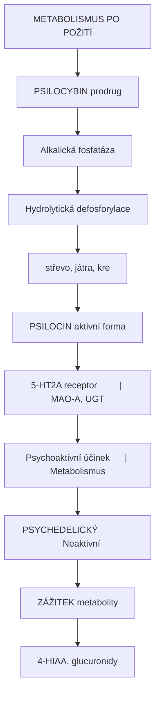

+++
title = "Biosyntéza psilocybinu"
description = "Enzymatická dráha syntézy psilocybinu v houbách - PsiD, PsiH, PsiK, PsiM enzymy"
weight = 1

[taxonomies]
categories = ["biosynteza", "enzymy", "houby"]
tags = ["psilocybin", "PsiD", "PsiH", "PsiK", "PsiM", "tryptofan", "biosynteticka-draha"]
+++

# Biosyntéza psilocybinu - Od tryptofanu k psychedeliku

**Biosyntéza psilocybinu** je enzymatická dráha, kterou houby rodu *Psilocybe* a příbuzných rodů syntetizují psychoaktivní alkaloid [psilocybin](@/alkaloids/psilocybin.md). Dráha byla plně objasněna v roce 2017 týmem Janis Fricke a Dirk Hoffmeister (Friedrich Schiller University Jena) a zahrnuje čtyři klíčové enzymy: **PsiD**, **PsiH**, **PsiK** a **PsiM**.

---

## Přehled biosyntetické dráhy

### Schéma kompletní dráhy

```
L-TRYPTOFAN
     |
     | [PsiD - Tryptofan dekarboxyláza]
     | Dekarboxylace (odstranění COOH)
     | Kofaktor: PLP (pyridoxal-5'-fosfát)
     |
     v
TRYPTAMIN
     |
     | [PsiH - Tryptamin 4-hydroxylaza]
     | Hydroxylace na pozici C-4
     | Kofaktory: O2, NADPH, FAD
     | Typ: Cytochrom P450 monooxygenáza
     |
     v
4-HYDROXYTRYPTAMIN
     |
     | [PsiK - 4-Hydroxytryptamin kinaza]
     | Fosforylace 4-OH skupiny
     | Kofaktor: ATP → ADP
     |
     v
NORBAEOCYSTIN
(4-Fosforyloxytryptamin)
     |
     | [PsiM - SAM-dependentní N-methyltransferáza]
     | První N-methylace
     | Kofaktor: SAM → SAH
     |
     v
BAEOCYSTIN
(4-Fosforyloxy-N-methyltryptamin)
     |
     | [PsiM - SAM-dependentní N-methyltransferáza]
     | Druhá N-methylace
     | Kofaktor: SAM → SAH
     |
     v
PSILOCYBIN
(4-Fosforyloxy-N,N-dimethyltryptamin)
```

### Klíčové charakteristiky

| Aspekt | Hodnota |
|--------|---------|
| **Prekurzor** | L-Tryptofan |
| **Produkt** | Psilocybin |
| **Počet kroků** | 4 enzymatické reakce |
| **Počet enzymů** | 4 (PsiD, PsiH, PsiK, PsiM) |
| **Genový cluster** | psiD, psiH, psiK, psiM |
| **Organismus** | *Psilocybe*, *Panaeolus*, *Gymnopilus* aj. |

---

## Jednotlivé enzymy

### 1. PsiD - Tryptofan dekarboxyláza

#### Charakteristika

| Vlastnost | Hodnota |
|-----------|---------|
| **EC číslo** | EC 4.1.1.28 |
| **Typ** | Aromatická L-aminokyselina dekarboxyláza |
| **Kofaktor** | PLP (pyridoxal-5'-fosfát, vitamin B6) |
| **Substrát** | L-Tryptofan |
| **Produkt** | Tryptamin + CO2 |

#### Reakce



<details>
<summary>ASCII verze diagramu</summary>

```
           COOH
            |
     H2N---C---H              [PsiD]              H2N---CH2
            |            ────────────────>              |
           CH2           PLP, H+            +           CH2
            |            -CO2                           |
       [Indol]                                    [Indol]

   L-TRYPTOFAN                              TRYPTAMIN
   (M: 204,23)                              (M: 160,22)
```

</details>

#### Mechanismus

```
DEKARBOXYLAČNÍ MECHANISMUS (PLP-dependentní)

1. Tvorba Schiffovy báze
   Trp + PLP-enzym → Trp-PLP iminový intermediát

2. Delokalizace elektronu
   α-karboxylová skupina je aktivována

3. Dekarboxylace
   Uvolnění CO2, tvorba chinoidu

4. Protonace
   Tvorba tryptaminu

5. Uvolnění produktu
   Regenerace PLP-enzymu
```

#### Specificita PsiD

| Substrát | Relativní aktivita |
|----------|-------------------|
| **L-Tryptofan** | 100% |
| **5-Hydroxy-L-tryptofan** | ~50-70% |
| **L-Fenylalanin** | <5% |
| **L-Tyrosin** | <10% |

### 2. PsiH - Tryptamin 4-hydroxylaza

#### Charakteristika

| Vlastnost | Hodnota |
|-----------|---------|
| **EC číslo** | EC 1.14.14.- |
| **Typ** | Cytochrom P450 monooxygenáza |
| **Kofaktory** | O2, NADPH, FAD, cytochrom P450 reduktáza |
| **Substrát** | Tryptamin |
| **Produkt** | 4-Hydroxytryptamin |

#### Reakce



<details>
<summary>ASCII verze diagramu</summary>

```
    [Indol]                    [4-OH-Indol]
        |           [PsiH]          |
       CH2     ─────────────>      CH2
        |      O2, NADPH, FAD       |
       NH2                         NH2

  TRYPTAMIN              4-HYDROXYTRYPTAMIN
  (M: 160,22)               (M: 176,22)

Regioselektivita: VÝLUČNĚ pozice C-4!
```

</details>

#### Mechanismus P450

```
CYTOCHROM P450 HYDROXYLACE

1. Substrát se váže do aktivního místa
   (nad Fe hemem)

2. Redukce Fe3+ → Fe2+
   (NADPH → FAD → P450)

3. Vazba O2
   Fe2+-O2 komplex

4. Druhá redukce
   Fe2+-O2 + e- → Fe3+-O-O2-

5. Protonace, štěpení O-O vazby
   "Compound I" (Fe4+=O) - reaktivní intermediát

6. Hydroxylace substrátu
   Vložení kyslíku na C-4 tryptaminu

7. Uvolnění produktu
   4-hydroxytryptamin
```

#### Unikátní regioselektivita PsiH



<details>
<summary>ASCII verze diagramu</summary>

```
SROVNÁNÍ S JINÝMI TRYPTOFAN HYDROXYLÁZAMI

TPH1/TPH2 (savčí):
- Hydroxylace na pozici C-5
- Produkt: 5-hydroxytryptofan → Serotonin

PsiH (houbová):
- Hydroxylace na pozici C-4
- Produkt: 4-hydroxytryptamin → Psilocybin

           TPH (C-5)
              ↓
        HO--[5]
       /        \
  [6] C          C [4] ← PsiH (C-4)
      |          |
  [7] C          C [3a]----CH2----NH2
       \        /
        C======C
       [7a]   [1]
              N
              H

DŮSLEDEK REGIOSELEKTIVITY:
- Serotonin (5-HT): fyziologický neurotransmiter
- Psilocin (4-HO-DMT): psychedelikum!
```

</details>

### 3. PsiK - 4-Hydroxytryptamin kinaza

#### Charakteristika

| Vlastnost | Hodnota |
|-----------|---------|
| **EC číslo** | EC 2.7.1.- |
| **Typ** | ATP-dependentní kinaza |
| **Kofaktor** | ATP → ADP |
| **Substrát** | 4-Hydroxytryptamin |
| **Produkt** | Norbaeocystin (4-fosforyloxytryptamin) |

#### Reakce



<details>
<summary>ASCII verze diagramu</summary>

```
    HO--[Indol]              O3PO--[Indol]
         |        [PsiK]          |
        CH2    ──────────>       CH2
         |      ATP → ADP         |
        NH2                      NH2

4-HYDROXYTRYPTAMIN          NORBAEOCYSTIN
   (M: 176,22)              (M: 256,20)
```

</details>

#### Mechanismus

```
KINÁZOVÁ REAKCE

4-OH-Tryptamin + ATP → Norbaeocystin + ADP

1. ATP se váže do aktivního místa
2. 4-OH-tryptamin se váže
3. Nukleofilní atak 4-OH na γ-fosfát ATP
4. Přenos fosfátové skupiny
5. Uvolnění ADP
6. Uvolnění norbaeocystinu

Mg2+ stabilizuje ATP vazbu (typické pro kinázy)
```

#### Význam fosforylace

| Aspekt | Bez fosfátu (psilocin) | S fosfátem (psilocybin) |
|--------|----------------------|-------------------------|
| **Stabilita** | Oxiduje (modré zbarvení) | Stabilní |
| **Náboj** | Neutrální | Záporný |
| **Transport** | Lipofilní | Hydrofilní |
| **Biologická role** | Aktivní forma | Zásobní forma (prodrug) |

### 4. PsiM - N-Methyltransferáza

#### Charakteristika

| Vlastnost | Hodnota |
|-----------|---------|
| **EC číslo** | EC 2.1.1.- |
| **Typ** | SAM-dependentní N-methyltransferáza |
| **Kofaktor** | S-adenosylmethionin (SAM) → S-adenosylhomocystein (SAH) |
| **Substráty** | Norbaeocystin, Baeocystin |
| **Produkty** | Baeocystin, Psilocybin |

#### Reakce (dvě methylace)



<details>
<summary>ASCII verze diagramu</summary>

```
PRVNÍ METHYLACE:

O3PO--[Indol]             O3PO--[Indol]
      |        [PsiM]           |
     CH2    ──────────>        CH2
      |      SAM → SAH          |
     NH2                       NHCH3

NORBAEOCYSTIN              BAEOCYSTIN
 (M: 256,20)                (M: 270,22)


DRUHÁ METHYLACE:

O3PO--[Indol]             O3PO--[Indol]
      |        [PsiM]           |
     CH2    ──────────>        CH2
      |      SAM → SAH          |
    NHCH3                     N(CH3)2

  BAEOCYSTIN               PSILOCYBIN
  (M: 270,22)               (M: 284,25)
```

</details>

#### Mechanismus methylace



<details>
<summary>ASCII verze diagramu</summary>

```
SAM-DEPENDENTNÍ METHYLACE

              CH3
               |
    Adenosyl-S+
               \      [PsiM]
                ────────────>
               /
           R-NH2

Nukleofilní substituce SN2:
1. Amino skupina norbaeocystinu/baeocystinu
   atakuje methylovou skupinu SAM
2. Přenos CH3 na dusík
3. Uvolnění SAH (S-adenosylhomocystein)

PsiM katalyzuje OBĚ methylace:
- Norbaeocystin → Baeocystin (1. methylace)
- Baeocystin → Psilocybin (2. methylace)
```

</details>

#### Kinetika PsiM

| Reakce | Km (mM) | kcat (min-1) |
|--------|---------|--------------|
| **Norbaeocystin → Baeocystin** | ~0,5 | ~2 |
| **Baeocystin → Psilocybin** | ~0,3 | ~1,5 |

---

## Genový cluster

### Organizace psi genů



<details>
<summary>ASCII verze diagramu</summary>

```
GENOVÝ CLUSTER PSILOCYBINU (P. cubensis)

5'───[psiD]──[psiM]──[psiH]──[psiK]──[psiR?]──[psiT?]───3'

Velikost: ~25 kbp

Gen    Délka (bp)   Protein            Funkce
────────────────────────────────────────────────────────
psiD   ~1500        PsiD (500 aa)      Dekarboxyláza
psiM   ~900         PsiM (300 aa)      Methyltransferáza
psiH   ~1800        PsiH (600 aa)      P450 hydroxylaza
psiK   ~1200        PsiK (400 aa)      Kinaza
psiR   ~?           PsiR               Regulátor (putativní)
psiT   ~?           PsiT               Transportér (putativní)
```

</details>

### Evoluce clusteru



<details>
<summary>ASCII verze diagramu</summary>

```
HORIZONTÁLNÍ GENOVÝ PŘENOS (HGT)

PŘEDEK
  │
  │ Evoluce psi clusteru
  │ (pravděpodobně v jedné linii)
  │
  ├──────────────────┬──────────────────┐
  │                  │                  │
  v                  v                  v
PSILOCYBE        PANAEOLUS        GYMNOPILUS
(~200 druhů)     (~100 druhů)      (~100 druhů)
  │                  │                  │
  │                  │                  │
  └──────────────────┴──────────────────┘
                     │
              Podobné clustery
              Divergence sekvencí
              Různá exprese

HYPOTÉZA:
- Cluster vznikl v jedné houbové linii
- Rozšířen HGT mezi vzdálenými rody
- Vysoká sekvenční homologie (70-90%)
- Nezávislá evoluce by vedla k větší divergenci
```

</details>

### Příbuzenství genů

| Rod | PsiD homologie | PsiH homologie | PsiK homologie | PsiM homologie |
|-----|----------------|----------------|----------------|----------------|
| **Psilocybe cubensis** | Reference | Reference | Reference | Reference |
| **P. cyanescens** | 85% | 88% | 90% | 87% |
| **Panaeolus cyanescens** | 78% | 82% | 85% | 80% |
| **Gymnopilus dilepis** | 72% | 75% | 78% | 73% |

---

## Regulace biosyntézy

### Faktory ovlivňující produkci

| Faktor | Vliv na biosyntézu | Mechanismus |
|--------|-------------------|-------------|
| **Světlo** | ↓ Snížení | Regulace transkripce? |
| **Teplota** | Optimum 20-25°C | Enzymová aktivita |
| **Vlhkost** | ↑ Vyšší vlhkost = ↑ produkce | Transport, metabolismus |
| **Nutrienty** | ↓ Nízká dostupnost = ↑ produkce | Sekundární metabolismus |
| **Vývojová fáze** | Maximum při sporulaci | Ochranná funkce? |
| **Mechanický stres** | ↑ Zvýšení | Obranná reakce |

### Hypotéza biologické funkce



<details>
<summary>ASCII verze diagramu</summary>

```
PROČ HOUBY PRODUKUJÍ PSILOCYBIN?

HYPOTÉZA 1: Obrana proti herbivorům
- Neurotoxicita pro hmyz?
- Averzní účinek

HYPOTÉZA 2: Antibakteriální/antifungální
- Některé tryptaminy mají antimikrobiální účinky

HYPOTÉZA 3: Ekologická interakce
- Modulace chování hmyzu
- "Mind control" mycetofilních much?

HYPOTÉZA 4: UV ochrana
- Indolový kruh absorbuje UV
- Ochrana DNA

NEDÁVNÝ OBJEV (2018, Reynolds et al.):
Psilocybin snižuje chuť k jídlu u much
→ Ekologická výhoda: méně konzumace houby
```

</details>

---

## Heterologní exprese

### Produkce psilocybinu v laboratoři

```
HETEROLOGNÍ EXPRESE V E. COLI

1. Klonování psi genů
   psiD, psiM, psiH, psiK → expresní vektory

2. Transformace E. coli
   Kmen: BL21(DE3) nebo podobný

3. Indukce exprese
   IPTG, optimální teplota (25-30°C)

4. Suplementace prekurzorů
   L-tryptofan, SAM (nebo methionin)

5. Produkce
   Typický výtěžek: 10-100 mg/L

VÝHODY:
- Kontrolovaná produkce
- Definovaná čistota
- Škálovatelnost
- Nezávislost na houbách

VÝZVY:
- PsiH (P450) vyžaduje partnerský protein (reduktázu)
- Optimalizace kodonů
- Metabolická zátěž hostitele
```

### Alternativní hostitelé

| Organismus | Výtěžek | Výhody | Nevýhody |
|------------|---------|--------|----------|
| **E. coli** | ~100 mg/L | Rychlý růst, genetické nástroje | P450 expression challenging |
| **S. cerevisiae** | ~50 mg/L | Nativní P450 systém | Pomalejší růst |
| **A. nidulans** | ~200 mg/L | Příbuzný houbám | Méně nástrojů |
| **P. cubensis** | Nativní | Přirozený producent | Pomalý, variabilní |

---

## Alternativní dráhy

### Minoritní cesta přes psilocin

```
ALTERNATIVNÍ BIOSYNTETICKÁ CESTA

L-Tryptofan
     |
     | [PsiD]
     v
Tryptamin
     |
     | [PsiM] (první methylace)
     v
N-Methyltryptamin (NMT)
     |
     | [PsiM] (druhá methylace)
     v
N,N-Dimethyltryptamin (DMT)
     |
     | [PsiH?] (4-hydroxylace)
     v
Psilocin (4-HO-DMT)
     |
     | [PsiK?] (fosforylace)
     v
Psilocybin

POZNÁMKA:
- Tato cesta je MINORITNÍ
- Hlavní cesta: hydroxylace PŘED methylací
- Psilocin může být meziproduktem
- Fosforylace stabilizuje produkt
```

### Rozdíly mezi druhy

| Druh | Hlavní alkaloid | Psilocybin:Psilocin | Baeocystin |
|------|-----------------|---------------------|------------|
| **P. cubensis** | Psilocybin | 10:1 - 20:1 | Nízký |
| **P. azurescens** | Psilocybin | 5:1 | Vysoký |
| **P. semilanceata** | Psilocybin | 50:1 | Střední |
| **P. cyanescens** | Psilocybin | 3:1 | Střední |

---

## Metabolismus v lidském těle

### Od psilocybinu k psilocinu



<details>
<summary>ASCII verze diagramu</summary>

```
METABOLISMUS PO POŽITÍ

PSILOCYBIN (prodrug)
     |
     | [Alkalická fosfatáza]
     | Hydrolytická defosforylace
     | (střevo, játra, krev)
     |
     v
PSILOCIN (aktivní forma)
     |
     +───────────────────────────┐
     |                           |
     | [5-HT2A receptor]         | [MAO-A, UGT]
     | Psychoaktivní účinek      | Metabolismus
     |                           |
     v                           v
PSYCHEDELICKÝ                 Neaktivní
ZÁŽITEK                       metabolity
                              (4-HIAA, glucuronidy)
```

</details>

---

## Aplikace a budoucnost

### Farmaceutická výroba

| Metoda | Status | Škálovatelnost |
|--------|--------|----------------|
| **Extrakce z hub** | Tradiční | Omezená |
| **Chemická syntéza** | Etablovaná | Vysoká |
| **Biosyntéza (E. coli)** | Vývoj | Potenciálně vysoká |
| **Biosyntéza (kvasnice)** | Vývoj | Střední |

### GMP produkce pro klinické studie

```
POŽADAVKY NA GMP PSILOCYBIN

Čistota: >99,5%
Kontaminanty: <0,1% jednotlivě
Mikrobiologie: Sterilní
Endotoxiny: <0,5 EU/mg
Stabilita: 24 měsíců (-20°C)
Balení: Tobolky 1, 5, 10, 25 mg

Současní výrobci:
- COMPASS Pathways
- Usona Institute
- Johnson & Johnson (pro esketamin analogie)
```

---

## Reference

### Originální objev

1. Fricke, J., Blei, F., & Hoffmeister, D. (2017). *Enzymatic synthesis of psilocybin*. Angewandte Chemie International Edition, 56(40), 12352-12355.

### Následné studie

2. Reynolds, H.T. et al. (2018). *Horizontal gene transfer enabled the biosynthesis of psilocybin in mushrooms*. Evolution Letters, 2(2), 88-101.

3. Milne, N. et al. (2020). *Metabolic engineering of psilocybin biosynthesis in Aspergillus nidulans*. Metabolic Engineering, 60, 172-180.

4. Adams, A.M. et al. (2019). *In vivo production of psilocybin in E. coli*. Metabolic Engineering, 56, 111-119.

### Evoluce a biologie

5. Awan, A.R. et al. (2018). *Biosynthesis of the psychedelic compound psilocybin in the mushroom Psilocybe cubensis*. Journal of Natural Products.

6. Lenz, C. et al. (2020). *Imaging of psilocin and psilocybin in the fruiting body of Psilocybe cubensis*. Journal of Natural Products.

---

## Křížové odkazy

### Produkty dráhy
- [Psilocybin](@/alkaloids/psilocybin.md) - Finální produkt
- [Psilocin](@/alkaloids/psilocin.md) - Aktivní metabolit
- [Baeocystin](@/alkaloids/baeocystin.md) - Intermediát
- [Norbaeocystin](@/alkaloids/norbaeocystin.md) - Intermediát

### Prekurzory
- [L-Tryptofan](@/amino-acids/tryptophan.md) - Výchozí aminokyselina
- [Tryptamin](@/glossary/tryptamin.md) - Dekarboxylovaný prekurzor

### Producenti
- [Psilocybe cubensis](@/shrooms/psilocybes/cubensis.md) - Modelový organismus
- [Psilocybe semilanceata](@/shrooms/psilocybes/semilanceata.md) - Evropský druh
- [Psilocyby](@/shrooms/psilocybes/_index.md) - Přehled rodu

### Související dráhy
- [Biosyntéza serotoninu](@/biosynthesis/serotonin.md) - Savčí dráha
- [Biosyntéza DMT](@/biosynthesis/dmt.md) - Alternativní tryptamin

---

<- Zpět na [Biosyntézy](@/biosynthesis/_index.md) | [Psilocybin](@/alkaloids/psilocybin.md) ->
