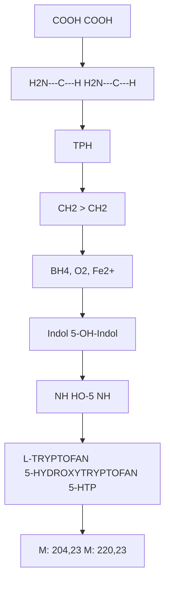
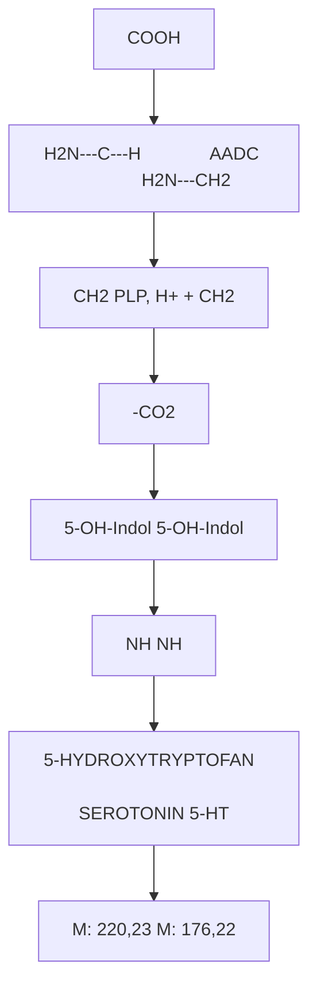
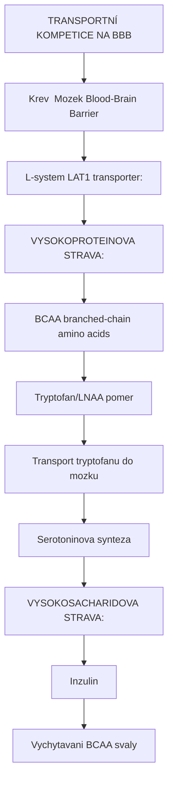
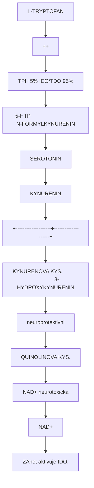

+++
title = "Biosynteza serotoninu"
description = "Enzymaticka draha syntézy serotoninu z tryptofanu - TPH a AADC enzymy, regulace a klinicke implikace"
weight = 3

[taxonomies]
categories = ["biosynteza", "enzymy", "neurochemie"]
tags = ["serotonin", "TPH", "AADC", "tryptofan", "5-HTP", "5-HT", "neurotransmiter"]
+++

# Biosynteza serotoninu - Od tryptofanu k neurotransmiteru

**Serotonin** (5-hydroxytryptamin, 5-HT) je jeden z nejdulezitejsich neurotransmiteru v lidskem tele. Jeho biosynteza z esencialni aminokyseliny [L-tryptofanu](@/amino-acids/tryptophan.md) zahrnuje dva klicove enzymaticke kroky: hydroxylaci (TPH) a dekarboxylaci (AADC). Tato draha je farmakologicky velmi dulezita - je cilem antidepresiv a je modulovana psychedeliky.

---

## Prehled biosynteticke drahy

### Schema kompletni drahy

```
L-TRYPTOFAN (esencialni aminokyselina)
     |
     | [TPH - Tryptofan hydroxylaza]
     | Hydroxylace na pozici C-5
     | Kofaktory: BH4, O2, Fe2+
     | RATE-LIMITING STEP
     |
     v
5-HYDROXYTRYPTOFAN (5-HTP)
     |
     | [AADC - Aromaticka L-aminokyselina dekarboxylaza]
     | Dekarboxylace (odstraneni COOH)
     | Kofaktor: PLP (vitamin B6)
     |
     v
SEROTONIN (5-HT, 5-hydroxytryptamin)
```

### Klicove charakteristiky

| Aspekt | Hodnota |
|--------|---------|
| **Prekurzor** | L-Tryptofan (esencialni) |
| **Intermediat** | 5-HTP |
| **Produkt** | Serotonin (5-HT) |
| **Pocet kroku** | 2 enzymaticke reakce |
| **Rate-limiting** | TPH (1. krok) |
| **Kofaktory** | BH4, O2, PLP |

---

## Jednotlive enzymy

### 1. TPH - Tryptofan hydroxylaza

#### Charakteristika

| Vlastnost | Hodnota |
|-----------|---------|
| **EC cislo** | EC 1.14.16.4 |
| **Typ** | Aromaticka aminokyselina hydroxylaza |
| **Kofaktory** | BH4 (tetrahydrobiopterin), O2, Fe2+ |
| **Gen** | TPH1 (periferie), TPH2 (CNS) |
| **Lokalizace** | Serotoninergni neurony, enterochromafini bunky |

#### Dve izoformy TPH

| Izoforma | Gen | Lokalizace | Funkce |
|----------|-----|------------|--------|
| **TPH1** | 11p15.1 | Periferie (strevo, trombocyty) | Periferní serotonin |
| **TPH2** | 12q21.1 | CNS (raphe nuclei) | Mozkový serotonin |

```
DISTRIBUCE SEROTONINU V TELE

PERIFERIE (TPH1): ~95% celkoveho serotoninu
- Enterochromafini bunky streva
- Trombocyty
- Mastocyty

CNS (TPH2): ~5% celkoveho serotoninu
- Raphe nuclei (mozkovy kmen)
- Projekce do celeho mozku
- Neurotransmise
```

#### Reakce



<details>
<summary>ASCII verze diagramu</summary>

```
        COOH                              COOH
         |                                 |
  H2N---C---H                       H2N---C---H
         |           [TPH]                 |
        CH2        ──────────>            CH2
         |         BH4, O2, Fe2+           |
    [Indol]                           [5-OH-Indol]
         |                                 |
        NH                              HO-5  NH

L-TRYPTOFAN                    5-HYDROXYTRYPTOFAN (5-HTP)
  (M: 204,23)                       (M: 220,23)
```

</details>

#### Mechanismus hydroxylace

```
TPH KATALYTICKY CYKLUS

1. Vazba substrátu (tryptofan)
2. Vazba BH4 (tetrahydrobiopterin)
3. Aktivace kysliku
   Fe2+ + O2 + BH4 → Fe4+=O + BH2 + H2O
4. Hydroxylace substrátu
   Fe4+=O + tryptofan → Fe2+ + 5-HTP
5. Uvolneni produktu
6. Regenerace BH4 (DHFR)

CELKOVA REAKCE:
L-Tryptofan + O2 + BH4 → 5-HTP + H2O + BH2
```

#### Regulace TPH

| Faktor | Vliv | Mechanismus |
|--------|------|-------------|
| **Dostupnost tryptofanu** | Primy | Substratova limitace |
| **BH4 dostupnost** | Primy | Kofaktorova limitace |
| **Fosforylace (PKA, CaMKII)** | Aktivace | Post-translacni |
| **Stres** | Zmeny | Kortikosteroidy |
| **Svetlo** | Cirkadianni | Transkripce |

### 2. AADC - Aromaticka L-aminokyselina dekarboxylaza

#### Charakteristika

| Vlastnost | Hodnota |
|-----------|---------|
| **EC cislo** | EC 4.1.1.28 |
| **Alternativni nazvy** | DOPA dekarboxylaza, DDC |
| **Gen** | DDC (chromozom 7) |
| **Kofaktor** | PLP (pyridoxal-5'-fosfat, vitamin B6) |
| **Specifita** | Nespecificka (5-HTP, L-DOPA, etc.) |

#### Reakce



<details>
<summary>ASCII verze diagramu</summary>

```
        COOH
         |
  H2N---C---H              [AADC]              H2N---CH2
         |            ────────────────>              |
        CH2           PLP, H+            +          CH2
         |            -CO2                           |
   [5-OH-Indol]                              [5-OH-Indol]
         |                                           |
        NH                                          NH

5-HYDROXYTRYPTOFAN                         SEROTONIN (5-HT)
    (M: 220,23)                             (M: 176,22)
```

</details>

#### Substrátova specificita AADC

AADC je **nespecificky enzym** - katalyzuje dekarboxylaci mnoha aromatickych aminokyselin:

| Substrát | Produkt | Draha |
|----------|---------|-------|
| **5-HTP** | Serotonin | Serotoninergni |
| **L-DOPA** | Dopamin | Dopaminergni |
| **L-Tryptofan** | Tryptamin | [DMT biosynteza](@/biosynthesis/dmt.md) |
| **L-Tyrosin** | Tyramin | Stopove aminy |
| **L-Histidin** | Histamin | Histaminergni |

---

## Regulace biosyntézy

### Faktory ovlivnujici syntézu serotoninu

| Faktor | Vliv | Mechanismus |
|--------|------|-------------|
| **Dietarni tryptofan** | Primy | Substratova dostupnost |
| **Tryptofan/LNAA pomer** | Transportni | Kompetice na BBB |
| **Vitamin B6** | Nezbytny | AADC kofaktor |
| **BH4 hladiny** | Nezbytny | TPH kofaktor |
| **Stres** | Variabilni | Kortizol, zanet |
| **Svetlo** | Zvysuje | Cirkadianní regulace TPH |
| **Zanet** | Snizuje | IDO drena tryptofanu |

### Limitace dostupnosti tryptofanu



<details>
<summary>ASCII verze diagramu</summary>

```
TRANSPORTNÍ KOMPETICE NA BBB

Krev → Mozek (Blood-Brain Barrier)

L-system (LAT1) transporter:
- Prenasi velke neutralni aminokyseliny (LNAA)
- Tryptofan soutezi s:
  - Tyrosin
  - Fenylalanin
  - Leucin
  - Isoleucin
  - Valin

VYSOKOPROTEINOVA STRAVA:
↑ BCAA (branched-chain amino acids)
↓ Tryptofan/LNAA pomer
↓ Transport tryptofanu do mozku
↓ Serotoninova synteza

VYSOKOSACHARIDOVA STRAVA:
↑ Inzulin
↑ Vychytavani BCAA svaly
↑ Tryptofan/LNAA pomer
↑ Transport tryptofanu do mozku
↑ Serotoninova synteza
```

</details>

### Kynureninova draha - kompetice o tryptofan



<details>
<summary>ASCII verze diagramu</summary>

```
L-TRYPTOFAN
      |
      +──────────────────────────────────────+
      |                                      |
      v                                      v
[TPH] (5%)                            [IDO/TDO] (95%)
      |                                      |
      v                                      v
5-HTP                               N-FORMYLKYNURENIN
      |                                      |
      v                                      |
SEROTONIN                                    v
                                      KYNURENIN
                                             |
                        +--------------------+--------------------+
                        |                                         |
                        v                                         v
                KYNURENOVA KYS.                          3-HYDROXYKYNURENIN
                (neuroprotektivni)                              |
                        |                                       v
                        v                                QUINOLINOVA KYS.
                   NAD+                                  (neurotoxicka)
                                                               |
                                                               v
                                                            NAD+

ZAnet aktivuje IDO:
- Zvyseny katabolismus tryptofanu
- Snizena dostupnost pro serotonin
- Zvysena quinolinova kyselina (NMDA agonista)
- "Inflammatory depression" hypoteza
```

</details>

---

## Metabolismus serotoninu

### Degradacni draha

```
SEROTONIN (5-HT)
      |
      | [MAO-A] - Monoamin oxidaza A
      | Oxidativni deaminace
      | Lokalizace: Mitochondrie
      v
5-HYDROXYINDOL-3-ACETALDEHYD
      |
      | [ALDH] - Aldehyd dehydrogenaza
      v
5-HYDROXYINDOLOCTOVA KYSELINA (5-HIAA)
      |
      v
Eliminace (moc)

Alternativni cesta:
5-HYDROXYINDOL-3-ACETALDEHYD
      |
      | [ADH] - Alkohol dehydrogenaza
      v
5-HYDROXYTRYPTOFOL
```

### Melatoninova draha

```
SEROTONIN
      |
      | [AANAT] - Arylalkylamin N-acetyltransferaza
      | Lokalizace: Pinealní zlaza
      | Cirkadiánní regulace (noc)
      v
N-ACETYLSEROTONIN
      |
      | [ASMT/HIOMT] - Hydroxyindol-O-methyltransferaza
      v
MELATONIN

Viz: [Melatonin](@/molecules/melatonin.md)
```

---

## Farmakologicke implikace

### Intervence v biosyntetické drahe

| Uroven | Intervence | Priklad |
|--------|------------|---------|
| **Tryptofan** | Suplementace | L-Tryptofan |
| **5-HTP** | Suplementace | [5-HTP](@/supplements/5-htp.md) |
| **Serotonin** | Nelze podat (BBB) | - |
| **Degradace** | MAOi | Fenelzin |
| **Reuptake** | SSRI | Fluoxetin |

### 5-HTP suplementace

```
SUPLEMENTACE 5-HTP

Vyhoda oproti tryptofanu:
- Obchazi rate-limiting krok (TPH)
- Lepsi konverze na serotonin
- Nezávisí na BH4

Rizika:
- Obchazi regulacní mechanismy
- Potencial pro serotonin syndrom s jinymi serotonergiky
- Periferní produkce serotoninu (kardiovaskulární?)

Viz: [5-HTP](@/supplements/5-htp.md)
```

### Psychedelika a serotoninova synteza

Psychedelika primarne **nepusobi na syntézu** serotoninu, ale na serotoninove receptory:

| Latka | Mechanismus | Vliv na syntézu |
|-------|-------------|-----------------|
| **[Psilocybin](@/alkaloids/psilocybin.md)** | 5-HT2A agonismus | Neprimy (downregulace) |
| **[LSD](@/alkaloids/lsd.md)** | 5-HT2A agonismus | Neprimy |
| **MDMA** | SERT reversal, uvolneni 5-HT | Deplece, pak zvysena |
| **Ayahuasca** | MAOi + DMT | Snizena degradace |

---

## Klinicke stavy

### Deficit serotoninu

| Stav | Mechanismus | Symptomy |
|------|-------------|----------|
| **Deprese** | Snizena synteza/funkce | Smutna nalada, anhedonie |
| **Uzkost** | Dysregulace | Nadmerna obava |
| **OCD** | Serotoninergni dysfunkce | Obsese, kompulze |
| **Migréna** | Fluktuace 5-HT | Bolest hlavy |

### Nadbytek serotoninu

| Stav | Pricina | Symptomy |
|------|---------|----------|
| **[Serotoninovy syndrom](@/conditions/serotonin-syndrome.md)** | Kombinace serotonergik | Hyperthermie, agitace |
| **Karcinoidní syndrom** | 5-HT produkujici tumor | Flush, prujem |

### Tryptofanová deplece

Experimentalni metoda pro studium serotoninove funkce:

```
TRYPTOFAN DEPLECE PROTOCOL

Podani aminokyselin BEZ tryptofanu
            |
            v
Competice o LAT1 transporter
            |
            v
Snizeny tryptofan v mozku (~80%)
            |
            v
Snizena synteza serotoninu
            |
            v
Transientni depresivni symptomy
(u vulnerabilnich jedincu)
```

---

## Reference

### Zakladni biochemie

1. Walther, D.J. et al. (2003). *Synthesis of serotonin by a second tryptophan hydroxylase isoform*. Science.

2. Zhang, X. et al. (2004). *Tryptophan hydroxylase-2 controls brain serotonin synthesis*. Science.

### Klinicke implikace

3. Cowen, P.J. & Browning, M. (2015). *What has serotonin to do with depression?* World Psychiatry.

4. Dantzer, R. et al. (2008). *From inflammation to sickness and depression: when the immune system subjugates the brain*. Nature Reviews Neuroscience.

### Nutrice a serotonin

5. Fernstrom, J.D. (2013). *Large neutral amino acids: dietary effects on brain neurochemistry and function*. Amino Acids.

---

## Krizove odkazy

### Produkty drahy
- [Serotonin](@/glossary/serotonin.md) - Neurotransmiter
- [Melatonin](@/molecules/melatonin.md) - Derivat serotoninu

### Prekurzory a suplementy
- [L-Tryptofan](@/amino-acids/tryptophan.md) - Vychozi aminokyselina
- [5-HTP](@/supplements/5-htp.md) - Intermediat, suplement

### Souvisejici drahy
- [Biosynteza DMT](@/biosynthesis/dmt.md) - Alternativni tryptaminova draha
- [Biosynteza psilocybinu](@/biosynthesis/psilocybin.md) - Houbova draha

### Receptory
- [5-HT2A receptor](@/receptors/5-ht2a.md) - Psychedelicky cil
- [5-HT1A receptor](@/receptors/5-ht1a.md) - Anxiolyticky

### Patologie
- [Deprese](@/conditions/depression.md) - Serotoninergni dysfunkce
- [Serotoninovy syndrom](@/conditions/serotonin-syndrome.md) - Toxicita

---

<- Zpet na [Biosyntézy](@/biosynthesis/_index.md) | [Serotonin](@/glossary/serotonin.md) ->
