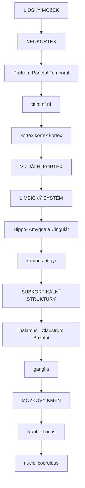
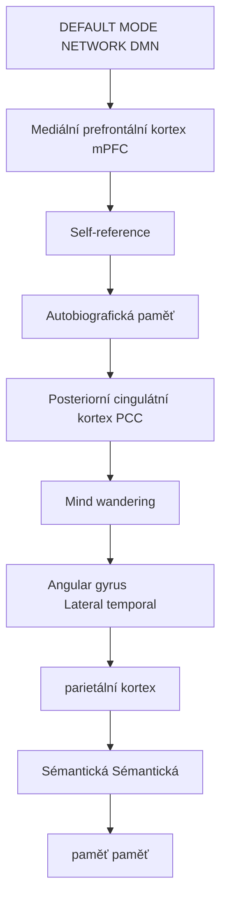
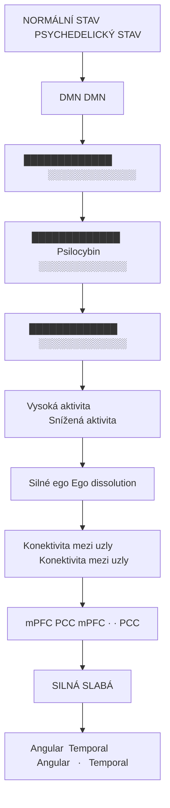
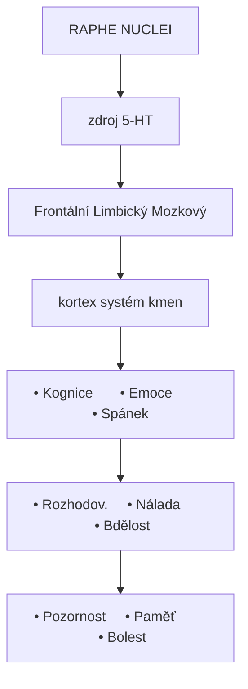
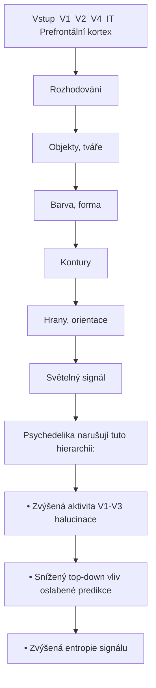
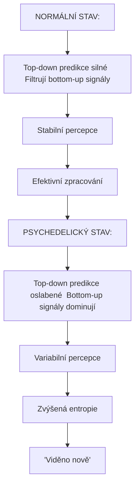

+++
title = "Mozek"
description = "Anatomie a funkce mozkových oblastí relevantních pro psychoaktivní látky"
weight = 6
sort_by = "weight"
insert_anchor_links = "right"
+++

# Neuroanatomie psychedelického zážitku

Psychoaktivní látky ovlivňují specifické **mozkové oblasti** a jejich **vzájemné propojení**. Pochopení neuroanatomie je klíčové pro porozumění mechanismům účinku a terapeutickému potenciálu těchto látek.

---

## Přehled klíčových oblastí

### Makrostruktura mozku



<details>
<summary>ASCII verze diagramu</summary>

```
┌─────────────────────────────────────────────────────────────┐
│                    LIDSKÝ MOZEK                              │
│                                                              │
│   ┌─────────────────────────────────────────────────┐       │
│   │              NEOKORTEX                           │       │
│   │  ┌─────────┐  ┌─────────┐  ┌─────────┐          │       │
│   │  │Prefron- │  │Parietal │  │Temporal │          │       │
│   │  │tální    │  │ní       │  │ní       │          │       │
│   │  │kortex   │  │kortex   │  │kortex   │          │       │
│   │  └─────────┘  └─────────┘  └─────────┘          │       │
│   │        ┌─────────────────────────┐              │       │
│   │        │    VIZUÁLNÍ KORTEX      │              │       │
│   │        └─────────────────────────┘              │       │
│   └─────────────────────────────────────────────────┘       │
│                                                              │
│   ┌───────────────────────────────────────────────────┐     │
│   │              LIMBICKÝ SYSTÉM                       │     │
│   │  ┌─────────┐  ┌─────────┐  ┌─────────┐            │     │
│   │  │Hippo-   │  │Amygdala │  │Cingulát │            │     │
│   │  │kampus   │  │         │  │ní gyr   │            │     │
│   │  └─────────┘  └─────────┘  └─────────┘            │     │
│   └───────────────────────────────────────────────────┘     │
│                                                              │
│   ┌───────────────────────────────────────────────────┐     │
│   │           SUBKORTIKÁLNÍ STRUKTURY                  │     │
│   │  ┌─────────┐  ┌─────────┐  ┌─────────┐            │     │
│   │  │Thalamus │  │Claustrum│  │Bazální  │            │     │
│   │  │         │  │         │  │ganglia  │            │     │
│   │  └─────────┘  └─────────┘  └─────────┘            │     │
│   └───────────────────────────────────────────────────┘     │
│                                                              │
│   ┌───────────────────────────────────────────────────┐     │
│   │             MOZKOVÝ KMEN                           │     │
│   │  ┌─────────┐  ┌─────────┐                         │     │
│   │  │Raphe    │  │Locus    │                         │     │
│   │  │nuclei   │  │coeruleus│                         │     │
│   │  └─────────┘  └─────────┘                         │     │
│   └───────────────────────────────────────────────────┘     │
└─────────────────────────────────────────────────────────────┘
```

</details>

---

## Klíčové oblasti pro psychedelika

### Tabulka oblastí

| Oblast | Funkce | Vliv psychedelik | Receptor |
|--------|--------|------------------|----------|
| [**Prefrontální kortex**](@/brain/prefrontal-cortex.md) | Exekutivní funkce, rozhodování | Změněná kognice | [5-HT2A](@/receptors/5-ht2a.md) |
| [**Vizuální kortex**](@/brain/visual-cortex.md) | Zrakové zpracování | Halucinace | [5-HT2A](@/receptors/5-ht2a.md) |
| [**Claustrum**](@/brain/claustrum.md) | Integrace vědomí | "Reset" vědomí | [5-HT2A](@/receptors/5-ht2a.md) |
| [**Hippocampus**](@/brain/hippocampus.md) | Paměť, navigace | Změněná paměť | [5-HT2A](@/receptors/5-ht2a.md), NMDA |
| [**Amygdala**](@/brain/amygdala.md) | Emoce, strach | Snížená reaktivita | [5-HT2A](@/receptors/5-ht2a.md) |
| [**Thalamus**](@/brain/thalamus.md) | Senzorický relay | Filtrování vjemů | [5-HT2A](@/receptors/5-ht2a.md) |
| [**Raphe nuclei**](@/brain/raphe-nuclei.md) | Produkce serotoninu | Autoreceptorová inhibice | 5-HT1A |
| [**Locus coeruleus**](@/brain/locus-coeruleus.md) | Produkce noradrenalinu | Arousal | α2, 5-HT2A |

---

## Klíčové oblasti pro GABAergní látky

### Tabulka oblastí relevantních pro muscimol/sedativa

| Oblast | Funkce | Vliv GABAergních látek | GABA-A exprese |
|--------|--------|------------------------|----------------|
| [**Thalamus (TRN)**](@/brain/thalamus.md) | Brána vědomí | Zavření gate, sedace | Velmi vysoká |
| [**Cerebellum**](@/brain/cerebellum.md) | Koordinace | Ataxie | Velmi vysoká |

---

## Default Mode Network (DMN)

### Komponenty DMN



<details>
<summary>ASCII verze diagramu</summary>

```
┌─────────────────────────────────────────────────────────────┐
│               DEFAULT MODE NETWORK (DMN)                     │
│                                                              │
│   ┌─────────────────────────────────────────────────────┐   │
│   │              Mediální prefrontální kortex (mPFC)     │   │
│   │                   Self-reference                     │   │
│   │                   Autobiografická paměť              │   │
│   └─────────────────────┬───────────────────────────────┘   │
│                         │                                    │
│                    ←────┼────→                              │
│                         │                                    │
│   ┌─────────────────────┴───────────────────────────────┐   │
│   │           Posteriorní cingulátní kortex (PCC)        │   │
│   │                   Autobiografická paměť              │   │
│   │                   Mind wandering                     │   │
│   └─────────────────────────────────────────────────────┘   │
│                         │                                    │
│          ┌──────────────┴──────────────┐                    │
│          ↓                             ↓                     │
│   ┌─────────────────┐         ┌─────────────────┐           │
│   │ Angular gyrus   │         │ Lateral temporal │           │
│   │ (parietální)    │←───────→│ kortex          │           │
│   │ Sémantická      │         │ Sémantická      │           │
│   │ paměť           │         │ paměť           │           │
│   └─────────────────┘         └─────────────────┘           │
│                                                              │
└─────────────────────────────────────────────────────────────┘
```

</details>

### Funkce DMN

| Funkce | Aktivní při | Deaktivace |
|--------|-------------|------------|
| **Self-reference** | Přemýšlení o sobě | Fokusovaný task |
| **Autobiografická paměť** | Vzpomínání | Senzorický input |
| **Mind wandering** | Denní snění | Meditace |
| **Theory of Mind** | Sociální kognice | - |
| **Budoucí plánování** | Anticipace | - |

### Psychedelika a DMN



<details>
<summary>ASCII verze diagramu</summary>

```
NORMÁLNÍ STAV                    PSYCHEDELICKÝ STAV

DMN                              DMN
┌─────────────────┐              ┌─────────────────┐
│ █████████████   │              │ ░░░░░░░░░░░░░   │
│ █████████████   │  Psilocybin  │ ░░░░░░░░░░░░░   │
│ █████████████   │ ──────────→  │ ░░░░░░░░░░░░░   │
│ █████████████   │              │ ░░░░░░░░░░░░░   │
└─────────────────┘              └─────────────────┘
Vysoká aktivita                  Snížená aktivita
Silné ego                        Ego dissolution

Konektivita mezi uzly            Konektivita mezi uzly
mPFC ←────────→ PCC              mPFC ←  ·  ·  → PCC
     ↑         ↑                      ↑         ↑
     │  SILNÁ  │                      │  SLABÁ  │
     ↓         ↓                      ↓         ↓
Angular ←────→ Temporal          Angular ←  ·  → Temporal
```

</details>

### Klinický význam

| Stav | DMN aktivita | Konektivita |
|------|--------------|-------------|
| **Deprese** | Zvýšená | Hyperkonektivita (rumináce) |
| **Úzkost** | Zvýšená | Abnormální |
| **Psychedelický stav** | Snížená | Desintegrace |
| **Meditace** | Snížená | Modifikovaná |
| **Flow state** | Snížená | Fokusovaná |

---

## Serotoninergní systém

### Raphe nuclei a projekce



<details>
<summary>ASCII verze diagramu</summary>

```
                    RAPHE NUCLEI
                    (zdroj 5-HT)
                         │
        ┌────────────────┼────────────────┐
        │                │                │
        ↓                ↓                ↓
┌───────────────┐ ┌───────────────┐ ┌───────────────┐
│  Frontální    │ │   Limbický    │ │   Mozkový     │
│  kortex       │ │   systém      │ │   kmen        │
│               │ │               │ │               │
│  • Kognice    │ │  • Emoce      │ │  • Spánek     │
│  • Rozhodov.  │ │  • Nálada     │ │  • Bdělost    │
│  • Pozornost  │ │  • Paměť      │ │  • Bolest     │
└───────────────┘ └───────────────┘ └───────────────┘
```

</details>

### 5-HT receptorová distribuce

| Oblast | Hlavní 5-HT receptor | Funkce |
|--------|---------------------|--------|
| Prefrontální kortex | [5-HT2A](@/receptors/5-ht2a.md) | Kognice |
| Vizuální kortex | [5-HT2A](@/receptors/5-ht2a.md) | Percepce |
| Amygdala | 5-HT2A, 5-HT1A | Emoce |
| Hippocampus | 5-HT1A, 5-HT2A | Paměť |
| Raphe nuclei | 5-HT1A (autoreceptor) | Regulace |

---

## Neurotransmiterové systémy

### Přehled projekcí

| Systém | Zdroj | Neurotransmiter | Funkce |
|--------|-------|-----------------|--------|
| **Serotoninergní** | Raphe nuclei | Serotonin (5-HT) | Nálada, percepce |
| **Dopaminergní** | VTA, SNc | Dopamin | Odměna, motivace |
| **Noradrenergní** | Locus coeruleus | Noradrenalin | Arousal, pozornost |
| **Cholinergní** | Nucleus basalis | Acetylcholin | Paměť, pozornost |
| **Glutamátový** | Kortex | Glutamát | Excitace |
| **GABAergní** | Interneurony | [GABA](@/glossary/gaba.md) | Inhibice |

---

## Hierarchické zpracování

### Vizuální hierarchie



<details>
<summary>ASCII verze diagramu</summary>

```
Vstup → V1 → V2 → V4 → IT → Prefrontální kortex
  │      │     │     │    │          │
  │      │     │     │    │          └── Rozhodování
  │      │     │     │    └───────────── Objekty, tváře
  │      │     │     └────────────────── Barva, forma
  │      │     └──────────────────────── Kontury
  │      └────────────────────────────── Hrany, orientace
  └───────────────────────────────────── Světelný signál

Psychedelika narušují tuto hierarchii:
• Zvýšená aktivita V1-V3 (halucinace)
• Snížený top-down vliv (oslabené predikce)
• Zvýšená entropie signálu
```

</details>

### Prediktivní kódování



<details>
<summary>ASCII verze diagramu</summary>

```
NORMÁLNÍ STAV:
Top-down predikce (silné) → Filtrují bottom-up signály
                          → Stabilní percepce
                          → Efektivní zpracování

PSYCHEDELICKÝ STAV:
Top-down predikce (oslabené) → Bottom-up signály dominují
                             → Variabilní percepce
                             → Zvýšená entropie
                             → "Viděno nově"
```

</details>

---

## Reference

1. Carhart-Harris, R.L. et al. (2012). *Neural correlates of the psychedelic state*. PNAS.
2. Müller, F. et al. (2018). *Neuroimaging of psychedelics*. Curr. Opin. Neurobiology.
3. Ly, C. et al. (2018). *Psychedelics promote structural and functional neural plasticity*. Cell Reports.
4. Raichle, M.E. (2015). *The brain's default mode network*. Annual Review of Neuroscience.

---

## Jednotlivé oblasti

### Kortikální struktury
- [Prefrontální kortex](@/brain/prefrontal-cortex.md) - Exekutivní funkce
- [Vizuální kortex](@/brain/visual-cortex.md) - Zrakové zpracování

### Limbický systém
- [Hippocampus](@/brain/hippocampus.md) - Paměť
- [Amygdala](@/brain/amygdala.md) - Emoce

### Subkortikální struktury
- [Thalamus](@/brain/thalamus.md) - Senzorický relay, brána vědomí, GABAergní modulace
- [Claustrum](@/brain/claustrum.md) - Integrace vědomí

### Mozkový kmen
- [Raphe nuclei](@/brain/raphe-nuclei.md) - Zdroj serotoninu
- [Locus coeruleus](@/brain/locus-coeruleus.md) - Noradrenergní systém

### Ostatní struktury
- [Cerebellum](@/brain/cerebellum.md) - Motorická koordinace

Viz take:
- [Receptory](@/receptors/_index.md) - Molekularni cile
- [Okruhy](@/circuits/_index.md) - Neuralni site
- [5-HT2A receptor](@/receptors/5-ht2a.md) - Primarni cil psychedelik
- [Mechanismy ucinku](@/mechanisms/_index.md) - Signalni kaskady, neuroplasticita
- [Signalni transdukce](@/mechanisms/signal-transduction.md) - GPCR a ionotropni signalizace v mozkovych oblastech
- [PK-PD vztahy](@/mechanisms/pharmacokinetic-pharmacodynamic.md) - Vztah distribuce latek a mozkovych oblasti

<- Zpet na [Hlavni stranku](@/_index.md)
