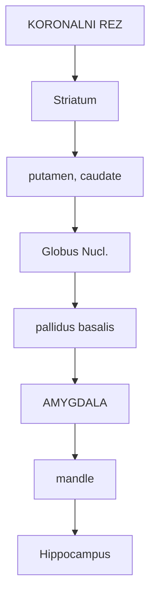
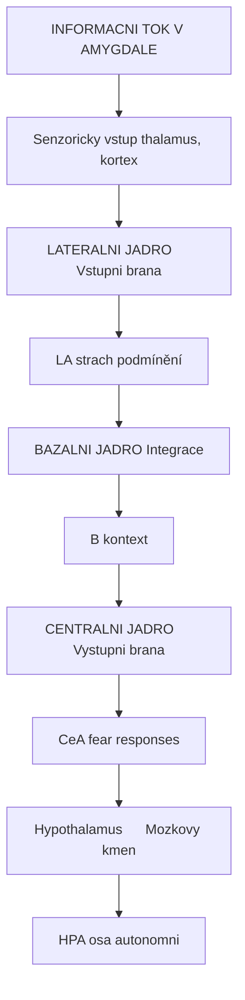
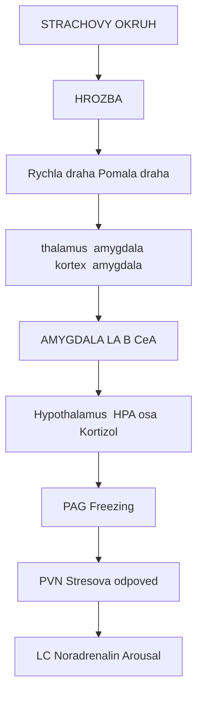
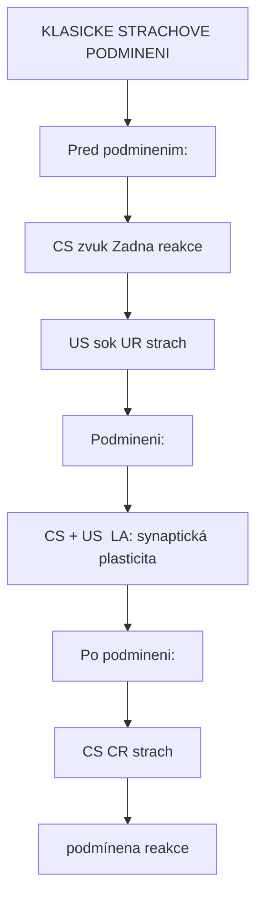
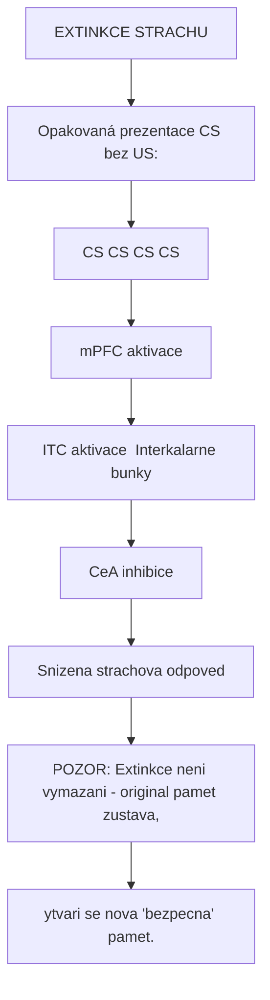
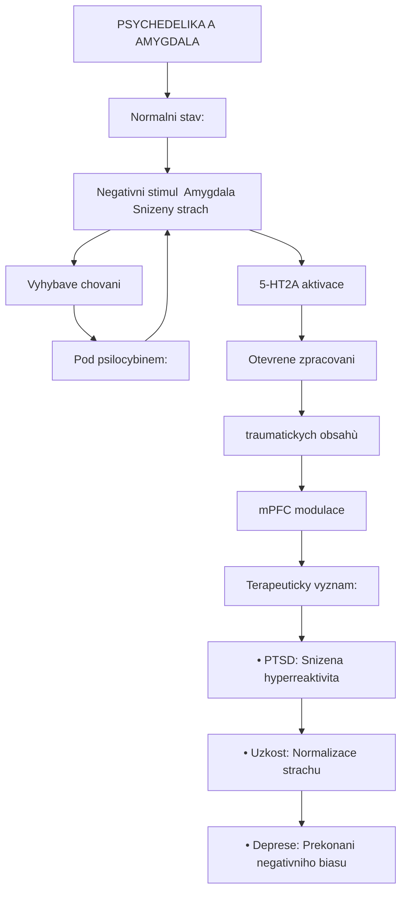
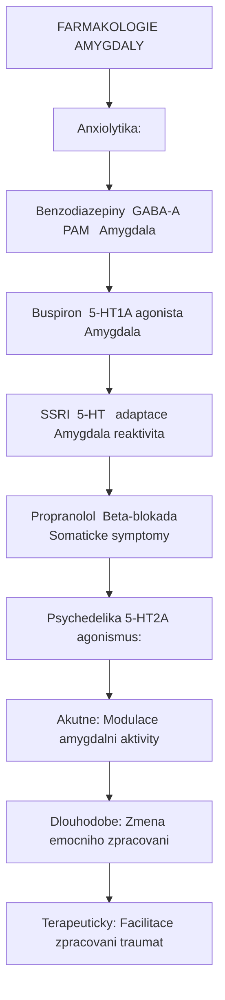
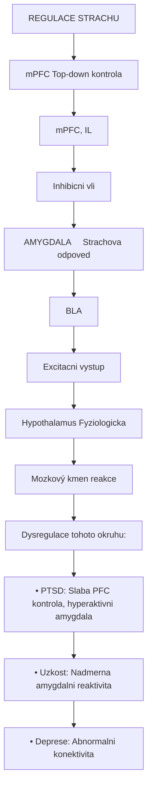
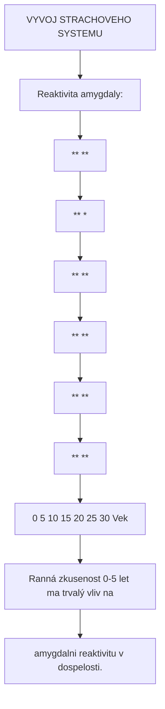

+++
title = "Amygdala"
description = "Amygdala - centrum emoci, strachu a uzkosti v mozku"
weight = 5
insert_anchor_links = "right"

[taxonomies]
tags = ["amygdala", "emoce", "strach", "uzkost", "limbicky-system", "mozek"]
categories = ["neuroanatomie", "neuroveda", "psychedelika"]
+++

# Amygdala - Centrum emoci a strachu

**Amygdala** (z latinskeho "amygdalum" - mandle) je parova subkortikalni struktura limbickeho systemu, ktera hraje klicovou roli ve **zpracovani emoci**, zejmena **strachu a uzkosti**, a v **emocnim uceni**. Je take dulezita pro rozpoznavani emocnich vyrazu a socialni kognici.

Psychedelika vyrazne ovlivnuji amygdalu, casto snizuji jeji reaktivitu na negativni podnety, coz muze prispivat k jejich terapeutickemu potencialu u uzkostnych poruch a PTSD.

---

## Anatomicka lokalizace

### Pozice v mozku

| Vlastnost | Hodnota |
|-----------|---------|
| **Lokalizace** | Medialni temporalni lalok |
| **Pozice** | Anteriorni k hippocampu |
| **Strana** | Parova (leva a prava) |
| **Tvar** | Mandlovity |
| **Objem** | 1.0-1.5 cm3 (kazda strana) |
| **Souradnice MNI** | x: ±24, y: -4, z: -18 |

### Anatomicke vztahy



<details>
<summary>ASCII verze diagramu</summary>

```
                KORONALNI REZ

           ┌───────────────────────┐
           │    Striatum           │
           │    (putamen, caudate) │
           └───────────┬───────────┘
                       │
        ┌──────────────┴──────────────┐
        │                             │
   ┌────┴────┐                   ┌────┴────┐
   │ Globus  │                   │  Nucl.  │
   │ pallidus│                   │ basalis │
   └─────────┘                   └─────────┘
                       │
              ┌────────┴────────┐
              │                 │
              │    AMYGDALA     │
              │    (mandle)     │
              │                 │
              └────────┬────────┘
                       │
              ┌────────┴────────┐
              │   Hippocampus   │
              └─────────────────┘
```

</details>

---

## Vnitrni struktura

### Jadra amygdaly

Amygdala se sklada z nekolika jadrovych skupin:

| Skupina | Jadra | Hlavni funkce |
|---------|-------|---------------|
| **Bazolateralni komplex** | Lateralni (LA), Bazalni (B), Akcesorni bazalni (AB) | Vstup, uceni |
| **Centralni jadro** | Medialni (CeM), Lateralni (CeL) | Vystup (strach) |
| **Kortikalni jadra** | Kortikalni, anteriorni | Cichove informace |
| **Medialni jadro** | Medialni | Reprodukcni chovani |

### Schematicka organizace



<details>
<summary>ASCII verze diagramu</summary>

```
INFORMACNI TOK V AMYGDALE

Senzoricky vstup (thalamus, kortex)
              │
              ↓
    ┌─────────────────────┐
    │   LATERALNI JADRO   │ ← Vstupni brana
    │        (LA)         │   (strach podmínění)
    └──────────┬──────────┘
               │
               ↓
    ┌─────────────────────┐
    │   BAZALNI JADRO     │ ← Integrace
    │        (B)          │   (kontext)
    └──────────┬──────────┘
               │
               ↓
    ┌─────────────────────┐
    │   CENTRALNI JADRO   │ ← Vystupni brana
    │       (CeA)         │   (fear responses)
    └──────────┬──────────┘
               │
      ┌────────┴────────┐
      ↓                 ↓
Hypothalamus      Mozkovy kmen
(HPA osa)         (autonomni)
```

</details>

### Bunecne typy

| Typ bunky | Lokalizace | Neurotransmiter | Podil |
|-----------|------------|-----------------|-------|
| **Pyramidove/Projekcni** | BLA | Glutamat | 80% |
| **Interneurony (PV+)** | BLA, CeA | GABA | 10-15% |
| **Interneurony (SOM+)** | BLA | GABA | 5% |
| **PKC-delta+ neurony** | CeL | GABA | - |
| **Interkalarne bunky** | ITC | GABA | - |

---

## Funkce amygdaly

### Zpracovani strachu

Amygdala je klicova pro **detekci hrozby** a **strachovou odpoved**:



<details>
<summary>ASCII verze diagramu</summary>

```
STRACHOVY OKRUH

              HROZBA
                 │
    ┌────────────┴────────────┐
    │                         │
    ↓                         ↓
Rychla draha             Pomala draha
(thalamus → amygdala)    (kortex → amygdala)
                              │
    ┌─────────────────────────┘
    │
    ↓
AMYGDALA (LA → B → CeA)
    │
    ├──→ Hypothalamus → HPA osa → Kortizol
    │
    ├──→ PAG → Freezing
    │
    ├──→ PVN → Stresova odpoved
    │
    └──→ LC → Noradrenalin → Arousal
```

</details>

### Emocni pamet

| Typ pameti | Role amygdaly | Oblast |
|------------|---------------|--------|
| **Strachove podmineni** | Formace asociace | LA |
| **Emocni posileni** | Modulace hipokampalni pameti | BLA |
| **Extinkce strachu** | Inhibice strachove odpovedi | CeL, ITC |
| **Reconsolidace** | Aktualizace pameti | BLA |

### Sociální kognice

| Funkce | Nalez |
|--------|-------|
| **Rozpoznavani emoci** | Deficit u lezi amygdaly |
| **Theory of Mind** | Aktivace pri mentalizing |
| **Sociální hodnoceni** | Duveryyhodnost tvari |
| **Gaze processing** | Reaktivita na pohled |

---

## Strachove podmineni

### Pavlovovske podmineni



<details>
<summary>ASCII verze diagramu</summary>

```
KLASICKE STRACHOVE PODMINENI

Pred podminenim:
CS (zvuk) ───────→ Zadna reakce
US (sok)  ───────→ UR (strach)

Podmineni:
CS + US ─────────→ [LA: synaptická plasticita]
                        │
                        ↓
Po podmineni:
CS ─────────────→ CR (strach)
                  (podmínena reakce)
```

</details>

### Synaptická plasticita

| Mechanismus | Oblast | Funkce |
|-------------|--------|--------|
| **LTP** | LA (thalamo-amygdala) | Akvizice strachu |
| **LTP** | LA (kortiko-amygdala) | Kontextove uceni |
| **LTD** | ITC | Extinkce |
| **Metaplasticita** | BLA | Modulace prahů |

### Extinkce strachu



<details>
<summary>ASCII verze diagramu</summary>

```
EXTINKCE STRACHU

Opakovaná prezentace CS bez US:
CS ─────→ CS ─────→ CS ─────→ CS
          │         │
          ↓         ↓
     [mPFC aktivace]
          │
          ↓
     [ITC aktivace] ← Interkalarne bunky
          │
          ↓
     [CeA inhibice]
          │
          ↓
     Snizena strachova odpoved

POZOR: Extinkce neni vymazani - original pamet zustava,
       vytvari se nova "bezpecna" pamet.
```

</details>

---

## Amygdala a psychedelika

### Efekty psychedelik na amygdalu

Psychedelika ([psilocybin](@/alkaloids/psilocybin.md), [LSD](@/alkaloids/lsd.md), [DMT](@/alkaloids/dmt.md)) meni aktivitu amygdaly:

| Efekt | Nalez | Studie |
|-------|-------|--------|
| **Snizena reaktivita** | Mensi aktivace na negativni tváře | Kraehenmann (2015) |
| **Zmena konektivity** | Oslabena amygdala-PFC komunikace | Carhart-Harris (2012) |
| **Pozitivní bias** | Zvysena odpoved na pozitivni stimuly | Mueller (2017) |
| **Emocni zpracovani** | Facilitace emocniho uvolneni | Roseman (2018) |

### Mechanismus



<details>
<summary>ASCII verze diagramu</summary>

```
PSYCHEDELIKA A AMYGDALA

Normalni stav:
Negativni stimul → Amygdala (↑↑↑) → Strach/uzkost
                                      │
                                      ↓
                               Vyhybave chovani

Pod psilocybinem:
Negativni stimul → Amygdala (↓) → Snizeny strach
         │                              │
         │    5-HT2A aktivace           ↓
         │         │              Otevrene zpracovani
         │         ↓              traumatickych obsahù
         └───→ mPFC modulace

Terapeuticky vyznam:
• PTSD: Snizena hyperreaktivita
• Uzkost: Normalizace strachu
• Deprese: Prekonani negativniho biasu
```

</details>

### Neurozobrazovaciní studie

| Studie | Látka | Nalez |
|--------|-------|-------|
| Kraehenmann (2015) | Psilocybin | Snizena amygdala reakce na straslive tvare |
| Carhart-Harris (2012) | Psilocybin | Snizena konektivita amygdala-PFC |
| Mueller (2017) | LSD | Zmena zpracovani emocnich tvari |
| Roseman (2019) | Psilocybin | Zvyseny emoční prùlom u deprese |

### Terapeuticke implikace

| Porucha | Amygdalni dysfunkce | Psychedelicky ucinek |
|---------|---------------------|----------------------|
| **PTSD** | Hyperreaktivita, defektní extinkce | Facilitace extinkce, snizena reaktivita |
| **Socialni fobie** | Nadmerna reakce na tvare | Snizeni socialni anxiety |
| **Deprese** | Negativni bias | Posun k pozitivnimu zpracovani |
| **Anxieta** | Generalizovany strach | Normalizace strachove odpovedi |

---

## Receptorova exprese

### Serotoninove receptory

| Receptor | Exprese | Lokalizace | Funkce |
|----------|---------|------------|--------|
| [**5-HT2A**](@/receptors/5-ht2a.md) | Stredni | BLA, CeA | Psychedelicky ucinek |
| **5-HT1A** | Vysoka | BLA | Anxiolyticky efekt |
| **5-HT2C** | Stredni | CeA | Modulace uzkosti |

### Dalsi receptory

| Receptor | Funkce v amygdale |
|----------|-------------------|
| [**GABA-A**](@/receptors/gaba-a.md) | Inhibice, anxiolytický ucinek BZD |
| **Glutamat (NMDA)** | LTP, strachove uceni |
| **CB1** | Extinkce, stresová odpoved |
| **CRF-R1** | Stresova reakce |
| **Oxytocin** | Socialni bezpecnost |
| **Opioidni** | Modulace strachu |

### Farmakologie uzkosti



<details>
<summary>ASCII verze diagramu</summary>

```
FARMAKOLOGIE AMYGDALY

Anxiolytika:
┌─────────────────────────────────────────────────┐
│ Benzodiazepiny → GABA-A PAM → ↓ Amygdala       │
│ Buspiron → 5-HT1A agonista → ↓ Amygdala        │
│ SSRI → 5-HT ↑ → adaptace → ↓ Amygdala reaktivita│
│ Propranolol → Beta-blokada → ↓ Somaticke symptomy│
└─────────────────────────────────────────────────┘

Psychedelika (5-HT2A agonismus):
┌─────────────────────────────────────────────────┐
│ Akutne: Modulace amygdalni aktivity             │
│ Dlouhodobe: Zmena emocniho zpracovani           │
│ Terapeuticky: Facilitace zpracovani traumat     │
└─────────────────────────────────────────────────┘
```

</details>

---

## Konektivita

### Aferentni spoje

| Zdroj | Typ informace |
|-------|---------------|
| **Senzoricke thalamusy** | Rychla, hrubaá senzorická |
| **Senzorické kortexy** | Zpracovaná, detailni |
| **[Hippocampus](@/brain/hippocampus.md)** | Kontextuální informace |
| **[mPFC](@/brain/prefrontal-cortex.md)** | Top-down regulace |
| **Insula** | Interocepce |
| **PAG** | Bolest, obrana |

### Eferentni spoje

| Cíl | Funkce |
|-----|--------|
| **Hypothalamus** | HPA osa, autonomní |
| **PAG** | Freezing, obrana |
| **[Locus coeruleus](@/brain/locus-coeruleus.md)** | Noradrenergni arousal |
| **Nucleus basalis** | Cholinergni modulace |
| **Striatum** | Motivované chovani |
| **Kortex** | Emocni informace |

### Amygdalo-prefrontální okruh



<details>
<summary>ASCII verze diagramu</summary>

```
REGULACE STRACHU

            ┌─────────────┐
            │    mPFC     │  Top-down kontrola
            │ (vmPFC, IL) │
            └──────┬──────┘
                   │
          Inhibicni vliv
                   │
                   ↓
            ┌─────────────┐
            │  AMYGDALA   │  Strachova odpoved
            │   (BLA)     │
            └──────┬──────┘
                   │
         Excitacni vystup
                   │
                   ↓
            ┌─────────────┐
            │Hypothalamus │  Fyziologicka
            │ Mozkový kmen│  reakce
            └─────────────┘

Dysregulace tohoto okruhu:
• PTSD: Slaba PFC kontrola, hyperaktivni amygdala
• Uzkost: Nadmerna amygdalni reaktivita
• Deprese: Abnormalni konektivita
```

</details>

---

## Patologie amygdaly

### PTSD

| Nalez | Popis |
|-------|-------|
| **Hyperaktivita** | Prehnana reakce na hrozby |
| **Snizena regulace** | Defektni PFC → amygdala inhibice |
| **Narušená extinkce** | Pretrvavajici strachove odpovedi |
| **Generalizace** | Strach se prenasi na neutralni podnety |

### Uzkostne poruchy

| Porucha | Amygdalni nalez |
|---------|-----------------|
| **Socialni fobie** | Hyperreaktivita na tvare |
| **Specificka fobie** | Zvysena aktivace na fobicky stimul |
| **GAD** | Persistentní hyperaktivita |
| **Panicka porucha** | Hypersenzitivita na telesne signaly |

### Deprese

| Nalez | Interpretace |
|-------|--------------|
| **Zvysena reaktivita** | Negativni emocni bias |
| **Zmena konektivity** | Abnormalni PFC-amygdala |
| **Objem** | Variabilni nalezy (zvetseni/zmenseni) |

### Klüver-Bucy syndrom

Bilateralni leze amygdaly (vzacny):
- Hyperoralita
- Hypermetamorfoza (nadmerna explorace)
- Placidita (ztrata strachu)
- Vizualni agnozie
- Hypersexualita

---

## Vyvoj amygdaly

### Ontogeneze

| Obdobi | Vyvojova udalost |
|--------|------------------|
| **GW 6-8** | Primordium amygdaly |
| **GW 12-16** | Diferenciace jader |
| **GW 20-30** | Synaptogeneze |
| **Novorozenec** | Funkcni, hyperreaktivni |
| **Detství** | Postupna maturace |
| **Adolescence** | Peak reaktivity |
| **Dospelost** | Stabilizace, zlepšená regulace |

### Kriticka perioda



<details>
<summary>ASCII verze diagramu</summary>

```
VYVOJ STRACHOVEHO SYSTEMU

Reaktivita amygdaly:
        ^
        │              *
        │            ** **
        │          **     *
        │        **        **
        │      **            **
        │    **                **
        │  **                    **
        └───────────────────────────→
          0  5  10  15  20  25  30   Vek

Ranná zkusenost (0-5 let) ma trvalý vliv na
amygdalni reaktivitu v dospelosti.
```

</details>

---

## Klinicky vyznam

### Farmakoterapie

| Latka | Mechanismus | Ucinek na amygdalu |
|-------|-------------|-------------------|
| **Benzodiazepiny** | GABA-A PAM | Snizena aktivita |
| **SSRI** | 5-HT reuptake | Adaptivní zmeny |
| **Propranolol** | Beta-blokator | Oslabeni rekonsolidace |
| **D-cykloserin** | NMDA ko-agonista | Posileni extinkce |
| **Psychedelika** | [5-HT2A](@/receptors/5-ht2a.md) | Modulace reaktivity |

### Psychoterapie

| Metoda | Mechanismus |
|--------|-------------|
| **Expozicní terapie** | Extinkce strachu |
| **EMDR** | Reprocessing traumat |
| **Mindfulness** | Top-down regulace |
| **Psychedeliky-asistovaná** | Emoční průlom, integrace |

---

## Reference

### Klicova literatura

1. LeDoux, J.E. (2000). *Emotion circuits in the brain*. Annual Review of Neuroscience, 23, 155-184.

2. Phelps, E.A. & LeDoux, J.E. (2005). *Contributions of the amygdala to emotion processing*. Trends in Cognitive Sciences, 9(5), 197-202.

3. Kraehenmann, R. et al. (2015). *Psilocybin-Induced Decrease in Amygdala Reactivity Correlates with Enhanced Positive Mood in Healthy Volunteers*. Biological Psychiatry, 78(8), 572-581.

4. Carhart-Harris, R.L. et al. (2012). *Neural correlates of the psychedelic state*. PNAS, 109(6), 2138-2143.

5. Ressler, K.J. & Mayberg, H.S. (2007). *Targeting abnormal neural circuits in mood and anxiety disorders*. Nature Neuroscience, 10(9), 1116-1124.

### Psychedelika a emocni zpracovani

6. Roseman, L. et al. (2019). *Emotional breakthrough and psychedelics: Validation of the Emotional Breakthrough Inventory*. Journal of Psychopharmacology, 33(9), 1076-1087.

7. Mueller, F. et al. (2017). *Acute effects of LSD on amygdala activity during processing of fearful stimuli*. Neuropsychopharmacology, 42(7), 1470-1479.

---

## Viz také

### Anxiolytické a emoční terapie
- [Úzkostné stavy](conditions/anxiety.md) - **Hlavní cíl anxiolytické terapie**
- [PTSD](conditions/ptsd.md) - **Narušené zpracování traumatu**
- [Deprese](@/conditions/depression.md) - Emoční dysregulace
- [Schizofrenie](@/conditions/schizophrenia.md) - Paranoidní symptomy

### Anxiolytické látky cílící amygdalu
- [Psilocybin](@/alkaloids/psilocybin.md) - **Snížená amygdala reaktivita, 5-HT2A**
- [MDMA](@/alkaloids/mdma.md) - Emoční zpracování, terapie PTSD
- [LSD](@/alkaloids/lsd.md) - Redukce negativního biasu
- [Ketamin](@/alkaloids/ketamin.md) - Rychlé anxiolytické efekty

### Receptory v amygdale
- [GABA-A receptor](@/receptors/gaba-a.md) - **Primární anxiolytický systém (α2/3 subtypy)**
- [5-HT2A receptor](@/receptors/5-ht2a.md) - **Psychedelický cíl emoční modulace**
- [5-HT1A receptor](@/receptors/5-ht1a.md) - Anxiolytické efekty SSRI
- [NMDA receptor](@/receptors/nmda.md) - Extinction learning, PTSD

### Limbické propojení
- [Hippocampus](@/brain/hippocampus.md) - **Kontextuální paměť vs strach**
- [Prefrontální kortex](@/brain/prefrontal-cortex.md) - **Top-down emoční regulace**
- [Thalamus](@/brain/thalamus.md) - Rychlá "low road" k amygdale
- [Locus coeruleus](@/brain/locus-coeruleus.md) - Noradrenalinová aktivace
- [Raphe nuclei](@/brain/raphe-nuclei.md) - Serotoninová modulace

### Molecules a mechanismy
- [GABA](@/glossary/gaba.md) - **Hlavní inhibiční neurotransmiter**
- [Serotonin](@/glossary/serotonin.md) - Emoční regulace
- [Dopamin](@/glossary/dopamin.md) - Motivační salience
- [BDNF](@/molecules/bdnf.md) - Neuroplasticita, extinction learning

### Farmakologie a terapie
- [Set and setting](@/glossary/set-and-setting.md) - Kritické pro amygdala modulaci
- [Tolerance](@/glossary/tolerance.md) - GABA-A tolerance problematika

### Psychoaktivní látky
- [Psilocybin](@/alkaloids/psilocybin.md) - Snizuje amygdalární reaktivitu
- [LSD](@/alkaloids/lsd.md) - Modulace strachu
- [DMT](@/alkaloids/dmt.md) - Emoční zpracování

---

<- Zpet na [Mozek](@/brain/_index.md) | [Hippocampus](@/brain/hippocampus.md) ->
