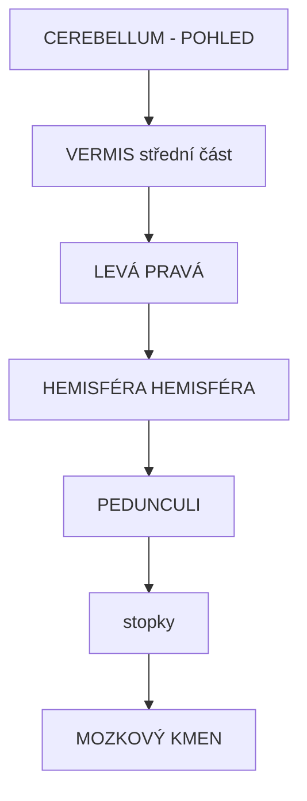
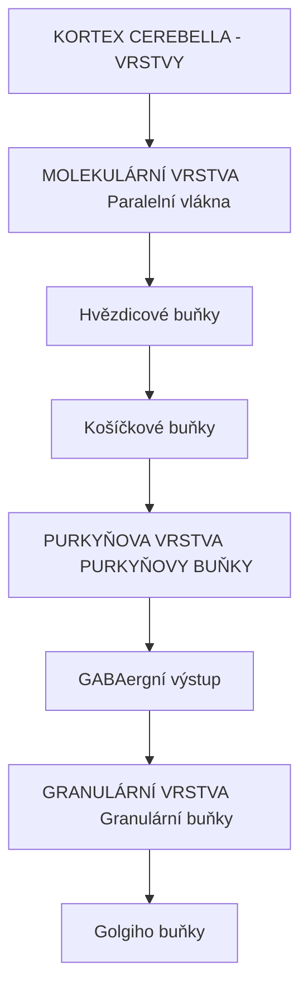
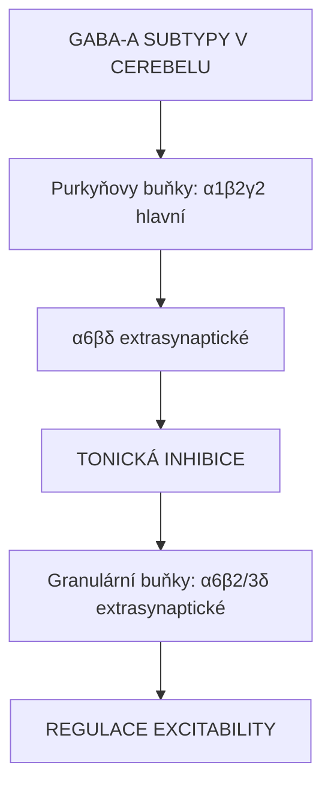
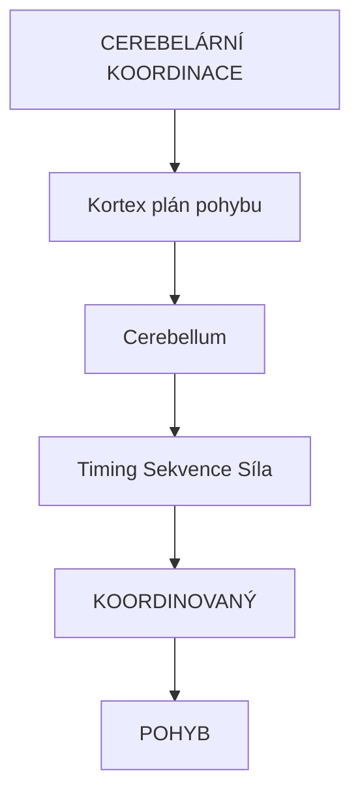
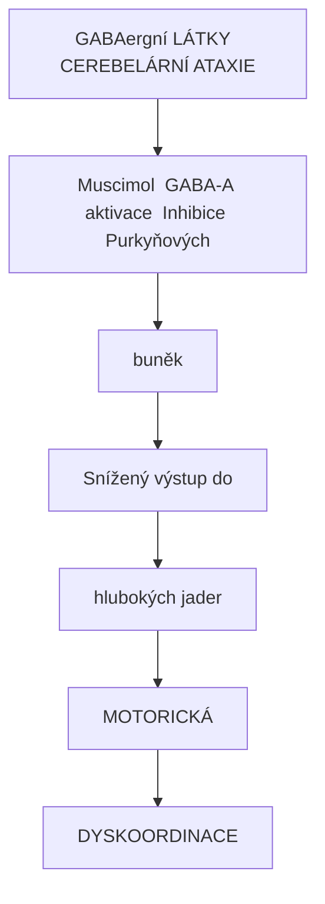
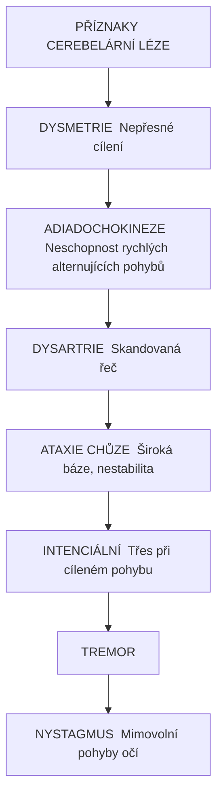

+++
title = "Cerebellum (Mozeček)"
description = "Cerebellum - mozeček, centrum motorické koordinace, rovnováhy a motorického učení, role v ataxii způsobené psychoaktivními látkami"
weight = 5
insert_anchor_links = "right"

[taxonomies]
categories = ["neuroanatomie", "motorika", "cerebellum"]
tags = ["cerebellum", "mozeček", "koordinace", "ataxie", "GABA", "Purkyňovy buňky", "motorické učení"]
+++

# Cerebellum (Mozeček)

**Cerebellum** (latinsky "malý mozek") je struktura zadního mozku zodpovědná za **motorickou koordinaci**, **rovnováhu**, **motorické učení** a jemné doladění pohybů. Obsahuje více než 50% všech neuronů mozku.

---

## Anatomie

### Makroskopická anatomie



<details>
<summary>ASCII verze diagramu</summary>

```
CEREBELLUM - POHLED

          VERMIS (střední část)
              ┌───┐
         ┌────┤   ├────┐
         │    │   │    │
    LEVÁ │    │   │    │ PRAVÁ
HEMISFÉRA│    └───┘    │HEMISFÉRA
         │             │
         │             │
         └─────────────┘
              │
         PEDUNCULI
         (stopky)
              │
       MOZKOVÝ KMEN
```

</details>

### Dělení

| Část | Funkce | Afference |
|------|--------|-----------|
| **Vestibulocerebellum** | Rovnováha, oční pohyby | Vestibulární aparát |
| **Spinocerebellum** | Postura, lokomoce | Mícha (propriocepce) |
| **Cerebrocerebellum** | Plánování pohybů, kognice | Kortex (přes pons) |

### Buněčné typy



<details>
<summary>ASCII verze diagramu</summary>

```
KORTEX CEREBELLA - VRSTVY

┌─────────────────────────────────┐
│     MOLEKULÁRNÍ VRSTVA          │ ← Paralelní vlákna
│         │                       │   Hvězdicové buňky
│         ↓                       │   Košíčkové buňky
├─────────────────────────────────┤
│     PURKYŇOVA VRSTVA            │ ← PURKYŇOVY BUŇKY
│         │                       │   (GABAergní výstup)
│         ↓                       │
├─────────────────────────────────┤
│     GRANULÁRNÍ VRSTVA           │ ← Granulární buňky
│                                 │   Golgiho buňky
└─────────────────────────────────┘
```

</details>

| Buněčný typ | Neurotransmiter | Funkce |
|-------------|-----------------|--------|
| **Purkyňovy buňky** | **GABA** | Jediný výstup z kortexu, inhibiční |
| **Granulární buňky** | Glutamát | Excitační vstup |
| **Hvězdicové, košíčkové** | GABA | Lokální inhibice |
| **Golgiho buňky** | GABA | Feedback inhibice |

---

## Receptorové vybavení

### GABA-A receptory v cerebelu



<details>
<summary>ASCII verze diagramu</summary>

```
GABA-A SUBTYPY V CEREBELU

Purkyňovy buňky: α1β2γ2 (hlavní)
                 α6βδ  (extrasynaptické)
                    ↓
           TONICKÁ INHIBICE

Granulární buňky: α6β2/3δ (extrasynaptické)
                     ↓
            TONICKÁ INHIBICE
                     ↓
          REGULACE EXCITABILITY
```

</details>

| Subtyp | Lokalizace | Funkce |
|--------|------------|--------|
| **α1** | Purkyňovy buňky | Synaptická inhibice |
| **α6** | Granulární buňky | **Tonická inhibice, cíl muscimolu** |
| **δ** | Extrasynaptické | Tonická inhibice |

### Glutamátové receptory

| Typ | Funkce |
|-----|--------|
| **AMPA** | Rychlá excitace |
| **NMDA** | Plasticita, LTD |
| **mGluR1** | Modulace, LTD |

---

## Funkce

### Motorická koordinace



<details>
<summary>ASCII verze diagramu</summary>

```
CEREBELÁRNÍ KOORDINACE

         Kortex (plán pohybu)
              ↓
         Cerebellum
              │
    ┌─────────┼─────────┐
    ↓         ↓         ↓
  Timing   Sekvence   Síla
    │         │         │
    └─────────┼─────────┘
              ↓
       KOORDINOVANÝ
          POHYB
```

</details>

### Motorické učení

| Typ | Popis | Mechanismus |
|-----|-------|-------------|
| **Vestibulo-okulární reflex** | Adaptace VOR | LTD na paralelních vláknech |
| **Klasické podmiňování** | Eyeblink conditioning | Asociativní LTD |
| **Motorické dovednosti** | Jízda na kole, hra na nástroj | Synaptická plasticita |

### Kognitivní funkce

| Funkce | Oblast cerebella |
|--------|------------------|
| **Řeč** | Pravá hemisféra |
| **Pracovní paměť** | Laterální cerebellum |
| **Časové odhady** | Vermis, hemisféry |
| **Emoční regulace** | Vermis |

---

## Cerebellum a psychoaktivní látky

### GABAergika a ataxie



<details>
<summary>ASCII verze diagramu</summary>

```
GABAergní LÁTKY → CEREBELÁRNÍ ATAXIE

[Muscimol] ──→ GABA-A aktivace ──→ Inhibice Purkyňových
                                   buněk
                                       ↓
                              Snížený výstup do
                              hlubokých jader
                                       ↓
                              MOTORICKÁ
                              DYSKOORDINACE
```

</details>

| Látka | Mechanismus v cerebelu | Stupeň ataxie |
|-------|------------------------|---------------|
| **Alkohol** | GABA-A PAM, NMDA antagonista | Silná |
| **Benzodiazepiny** | GABA-A PAM (α1) | Střední |
| **Barbituráty** | GABA-A agonista | Silná |
| **GHB** | GABA-B, GHB-R | Střední |

### NMDA antagonisté

| Látka | Efekt v cerebelu |
|-------|------------------|
| **[Ketamin](@/alkaloids/ketamin.md)** | NMDA blokáda → ataxie |
| **Alkohol** | Kombinovaný GABA + NMDA |
| **PCP** | Silná ataxie |

### Psychedelika

| Látka | Cerebelární efekt |
|-------|-------------------|
| **[Psilocybin](@/alkaloids/psilocybin.md)** | Minimální přímý efekt |
| **[LSD](@/alkaloids/lsd.md)** | Časování, rytmus |
| **Salvia** | κ-opioid → ataxie |

---

## Klinické syndromy

### Cerebelární ataxie



<details>
<summary>ASCII verze diagramu</summary>

```
PŘÍZNAKY CEREBELÁRNÍ LÉZE

DYSMETRIE ────── Nepřesné cílení
    │
ADIADOCHOKINEZE ─ Neschopnost rychlých alternujících pohybů
    │
DYSARTRIE ────── Skandovaná řeč
    │
ATAXIE CHŮZE ─── Široká báze, nestabilita
    │
INTENCIÁLNÍ ─── Třes při cíleném pohybu
TREMOR
    │
NYSTAGMUS ───── Mimovolní pohyby očí
```

</details>

### Hodnocení

| Test | Co testuje |
|------|------------|
| **Prst-nos** | Dysmetrie HK |
| **Pata-koleno** | Dysmetrie DK |
| **Diadochokineze** | Alternující pohyby |
| **Romberg** | Senzorická vs cerebelární |
| **Tandem chůze** | Koordinace trupu |

---

## Vývojové aspekty

### Vývoj cerebella

| Období | Vývojový milestone |
|--------|-------------------|
| **Prenatální** | Formace základní struktury |
| **0-2 roky** | Rychlý růst, synaptogeneze |
| **Dětství** | Myelinizace, motorické učení |
| **Adolescence** | Synaptický pruning |

### Cerebelární vulnerabilita

| Faktor | Efekt |
|--------|-------|
| **Alkohol prenatálně** | FAS - cerebelární hypoplázie |
| **Malnutrice** | Snížený počet Purkyňových buněk |
| **Neurodegenerace** | SCA, MSA |

---

## Viz také

### Mozkové oblasti
- [Prefrontální kortex](@/brain/prefrontal-cortex.md) - Plánování pohybů
- [Thalamus](@/brain/thalamus.md) - Cerebelothalamické dráhy
- [Hippocampus](@/brain/hippocampus.md) - Paměťová konsolidace

### Receptory
- [GABA-A receptor](@/receptors/gaba-a.md) - **α6 subtyp v granulárních buňkách**
- [NMDA receptor](@/receptors/nmda.md) - Cerebelární plasticita

### Látky
- [Účinky muscimolu](@/phenomenology/muscimol-effects.md) - Detailní fenomenologie
- [Ketamin](@/alkaloids/ketamin.md) - NMDA blokáda

### Symptomy
- [Ataxie](@/glossary/ataxie.md) - Porucha koordinace

---

## Reference

1. Ito, M. (2006). *Cerebellar circuitry as a neuronal machine*. Progress in Neurobiology, 78(3-5), 272-303.

2. Schmahmann, J.D. (2019). *The cerebellum and cognition*. Neuroscience Letters, 688, 62-75.

3. Bhattacharyya, S. et al. (2014). *Cerebellar function and dysfunction: From molecules to behavior*. Current Molecular Pharmacology, 7(2), 95-107.

4. Hanchar, H.J. et al. (2005). *Alcohol-induced motor impairment caused by increased extrasynaptic GABA A receptor activity*. Nature Neuroscience, 8(3), 339-345.

---

← Zpět na [Mozek](@/brain/_index.md) | [Ataxie](@/glossary/ataxie.md) →
