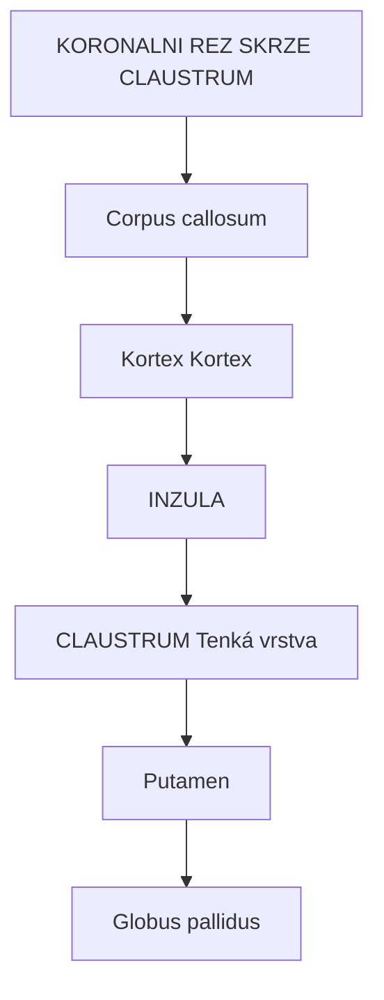
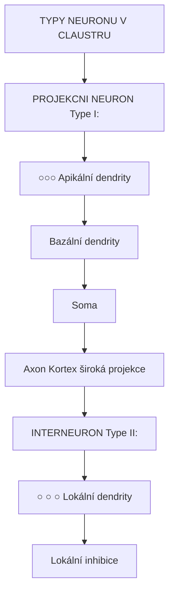
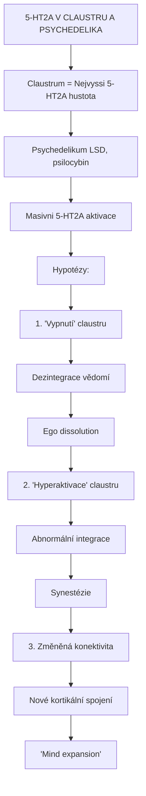
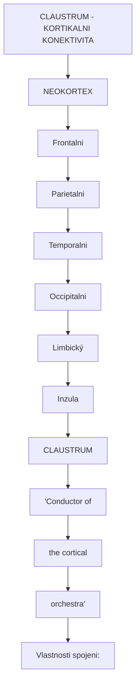
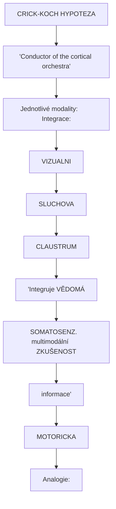
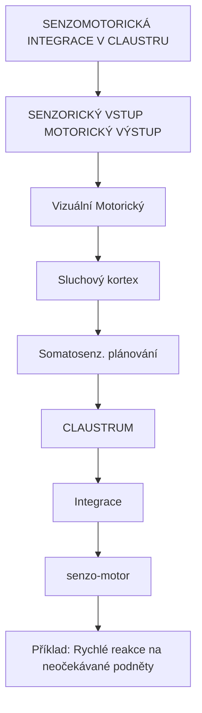
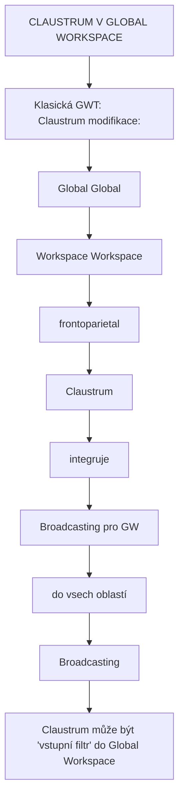

+++
title = "Claustrum"
description = "Claustrum - enigmaticka struktura mozku spojovana s integraci vedomi"
weight = 3
insert_anchor_links = "right"

[taxonomies]
tags = ["claustrum", "vedomi", "integrace", "kortex", "mozek"]
categories = ["neuroanatomie", "neuroveda", "psychedelika"]
+++

# Claustrum - Integrator vedomi?

**Claustrum** (z latiny "zavreny prostor") je tenkka, vrstvovita struktura sedi hmoty umistena hluboko pod neokortexem, mezi inzulou a putamenem. Navzdory sve male velikosti ma rozsahle reciprocni spojeni s prakticky vsemi oblastmi mozkove kury.

Claustrum je casto oznacovano jako potencialni "sede vedomi" nebo integrator kortikalni aktivity. V kontextu psychedelik je zvlaste zajimava, protoze vykazuje jednu z nejvyssich hustot [5-HT2A receptoru](@/receptors/5-ht2a.md) v mozku.

---

## Anatomicka lokalizace

### Pozice v mozku

| Vlastnost | Hodnota |
|-----------|---------|
| **Lokalizace** | Telencefalon (bazalni cast) |
| **Pozice** | Mezi inzulou a putamenem |
| **Tvar** | Tenka, zakrivena vrstva |
| **Tloustka** | 1-2 mm |
| **Delka** | ~50 mm (anteroposteriorni) |
| **Objem** | ~0.8-1 cm3 (kazda strana) |

### Anatomicke vztahy



<details>
<summary>ASCII verze diagramu</summary>

```
KORONALNI REZ SKRZE CLAUSTRUM

              Corpus callosum
                    │
         ┌─────────┴─────────┐
         │                   │
    ┌────┴────┐         ┌────┴────┐
    │  Kortex │         │  Kortex │
    └────┬────┘         └────┬────┘
         │                   │
    ┌────┴────────────────────┴────┐
    │          INZULA              │
    └────────────┬─────────────────┘
                 │
    ┌────────────┼────────────────┐
    │            │                │
    │      ╔═════╧═════╗          │
    │      ║ CLAUSTRUM ║          │ ← Tenká vrstva
    │      ╚═════╤═════╝          │
    │            │                │
    │      ┌─────┴─────┐          │
    │      │  Putamen  │          │
    │      └───────────┘          │
    │                             │
    │    Globus pallidus          │
    └─────────────────────────────┘
```

</details>

### Hranice

| Hranice | Struktura | Oddeleni |
|---------|-----------|----------|
| **Medialni** | Putamen | Externi kapsula |
| **Lateralni** | Inzula | Extremni kapsula |
| **Anteriorni** | Nucleus accumbens | Postupny prechod |
| **Posteriorni** | Amygdala | Difuzní |

---

## Bunecna charakteristika

### Typy neuronu

| Typ | Podil | Neurotransmiter | Projekce |
|-----|-------|-----------------|----------|
| **Projekcni (Type I)** | ~85% | Glutamát | Kortex |
| **Interneurony (Type II)** | ~15% | GABA | Lokalni |

### Morfologie



<details>
<summary>ASCII verze diagramu</summary>

```
TYPY NEURONU V CLAUSTRU

PROJEKCNI NEURON (Type I):
        ┌─────┐
        │ ○○○ │ ← Apikální dendrity
        │  │  │
        │  │  │
        └──┼──┘
           │
    ┌──────┼──────┐ ← Bazální dendrity
    │      │      │
    │   ┌──┴──┐   │
    │   │Soma │   │
    │   └──┬──┘   │
    │      │      │
    └──────┼──────┘
           │
           ↓ Axon → Kortex (široká projekce)

INTERNEURON (Type II):
       ┌───────┐
       │ ○ ○ ○ │ ← Lokální dendrity
       │   │   │
       │┌──┴──┐│
       ││Soma ││
       │└──┬──┘│
       │   │   │
       └───┼───┘
           │
           ↓ Lokální inhibice
```

</details>

### Neurotransmiterova exprese

| Marker | Exprese | Funkce |
|--------|---------|--------|
| **Glutamát** | Projekcni neurony | Excitace kortexu |
| **GABA** | Interneurony | Lokalni inhibice |
| **Parvalbumin** | Subpopulace | Rychla inhibice |

---

## 5-HT2A exprese v claustru

### Vysoka hustota receptoru

Claustrum ma **jednu z nejvyssich hustot [5-HT2A receptoru](@/receptors/5-ht2a.md)** v celem mozku:

| Oblast | Relativni hustota 5-HT2A |
|--------|-------------------------|
| **Claustrum** | Velmi vysoka (+++++) |
| **Prefrontalni kortex** | Vysoka (++++) |
| **Vizualni kortex** | Vysoka (++++) |
| **Inzula** | Stredni (+++) |
| **Hippocampus** | Stredni (+++) |

### Implikace pro psychedelika



<details>
<summary>ASCII verze diagramu</summary>

```
5-HT2A V CLAUSTRU A PSYCHEDELIKA

Claustrum = Nejvyssi 5-HT2A hustota
        │
        │ Psychedelikum (LSD, psilocybin)
        │       │
        │       ↓
        │ Masivni 5-HT2A aktivace
        │       │
        │       ↓
        │ ┌─────────────────────────────────┐
        │ │ Hypotézy:                       │
        │ │                                 │
        │ │ 1. "Vypnutí" claustru           │
        │ │    → Dezintegrace vědomí        │
        │ │    → Ego dissolution            │
        │ │                                 │
        │ │ 2. "Hyperaktivace" claustru     │
        │ │    → Abnormální integrace       │
        │ │    → Synestézie                 │
        │ │                                 │
        │ │ 3. Změněná konektivita          │
        │ │    → Nové kortikální spojení   │
        │ │    → "Mind expansion"           │
        │ └─────────────────────────────────┘
```

</details>

---

## Konektivita

### Kortikalni spojeni

Claustrum ma reciprocni spojeni s **prakticky vsemi oblastmi kortexu**:



<details>
<summary>ASCII verze diagramu</summary>

```
CLAUSTRUM - KORTIKALNI KONEKTIVITA

                    ┌──────────────────────────────┐
                    │        NEOKORTEX             │
                    │                              │
                    │   Frontalni  ←────────┐      │
                    │   Parietalni ←────────┤      │
                    │   Temporalni ←────────┤      │
                    │   Occipitalni ←───────┤      │
                    │   Limbický   ←────────┤      │
                    │   Inzula     ←────────┤      │
                    │                       │      │
                    └───────────────────────┼──────┘
                                            │
                                    ┌───────┴───────┐
                                    │               │
                                    │   CLAUSTRUM   │
                                    │               │
                                    │ "Conductor of │
                                    │  the cortical │
                                    │   orchestra"  │
                                    │               │
                                    └───────────────┘

Vlastnosti spojeni:
- Reciprocni (obousmerná)
- Topograficky organizovana
- Jedna z nejhustejsi konektivit v mozku
```

</details>

### Specificka spojeni

| Oblast | Funkce spojeni |
|--------|----------------|
| **[Prefrontalni kortex](@/brain/prefrontal-cortex.md)** | Exekutivni, rozhodovani |
| **Inzula** | Interoceptivni, emocni |
| **[Vizualni kortex](@/brain/visual-cortex.md)** | Zrakova integrace |
| **Senzomotoricky kortex** | Senzomotorická integrace |
| **Cingularni kortex** | Pozornost, konflikt |
| **[Amygdala](@/brain/amygdala.md)** | Emocni vstup |
| **[Hippocampus](@/brain/hippocampus.md)** | Pamefovy kontext |

### Subkortikalni spojeni

| Struktura | Typ spojeni |
|-----------|-------------|
| **Striatum** | Reciprocni |
| **[Thalamus](@/brain/thalamus.md)** | Reciprocni (MD, pulvinar) |
| **[Amygdala](@/brain/amygdala.md)** | Reciprocni |
| **Claustrum kontralat.** | Komisurální |

---

## Funkcni teorie

### Crick-Koch hypoteza

Francis Crick a Christof Koch (2005) navrhli, ze claustrum muze byt klicove pro **integraci vedomi**:



<details>
<summary>ASCII verze diagramu</summary>

```
CRICK-KOCH HYPOTEZA

"Conductor of the cortical orchestra"

Jednotlivé modality:        Integrace:
┌─────────────┐
│  VIZUALNI   │──────┐
└─────────────┘      │
                     │
┌─────────────┐      │      ┌─────────────────┐
│  SLUCHOVA   │──────┼─────→│                 │
└─────────────┘      │      │    CLAUSTRUM    │
                     │      │                 │
┌─────────────┐      │      │  "Integruje     │──→ VĚDOMÁ
│ SOMATOSENZ. │──────┼─────→│  multimodální   │    ZKUŠENOST
└─────────────┘      │      │  informace"     │
                     │      │                 │
┌─────────────┐      │      └─────────────────┘
│  MOTORICKA  │──────┘
└─────────────┘

Analogie:
- Kortikální oblasti = nástroje orchestru
- Claustrum = dirigent koordinující hru
- Vědomí = hudba (integrovaný výstup)
```

</details>

### Salience a pozornost

| Funkce | Mechanismus |
|--------|-------------|
| **Selekce salience** | Filtruje relevantni informace |
| **Kognitivni kontrola** | Koordinuje kortikalni zpracovani |
| **Prepinani mezi sitemi** | DMN ↔ Task-positive |

### Senzomotorická integrace



<details>
<summary>ASCII verze diagramu</summary>

```
SENZOMOTORICKÁ INTEGRACE V CLAUSTRU

        SENZORICKÝ VSTUP           MOTORICKÝ VÝSTUP
              │                           │
    ┌─────────┼─────────┐       ┌────────┼────────┐
    │  Vizuální         │       │  Motorický      │
    │  Sluchový         │       │  kortex         │
    │  Somatosenz.      │       │  (plánování)    │
    └─────────┬─────────┘       └────────┬────────┘
              │                          │
              └──────────┬───────────────┘
                         │
                         ↓
                  ┌─────────────┐
                  │  CLAUSTRUM  │
                  │             │
                  │ Integrace   │
                  │ senzo-motor │
                  └─────────────┘

Příklad: Rychlé reakce na neočekávané podněty
```

</details>

---

## Claustrum a psychedelika

### Neurozobrazovaci studie

| Studie | Nalez |
|--------|-------|
| Preller (2018) | Snizena claustrum konektivita pod LSD |
| Barrett (2020) | Zmeny claustrum aktivity pod psilocybinem |
| Doss (2021) | Claustrum "vypnuti" koreluje s ego dissolution |

### Mechanismus

```mermaid
flowchart TD
    node_PSYCHEDELIKAACLAUSTR["PSYCHEDELIKA A CLAUSTRUM"]
    node_NORMLNSTAV["NORMÁLNÍ STAV:"]
    node_Claustrumaktivninteg["Claustrum aktivně integruje kortikální informace"]
    node_5HT2Aaktivacepsyched["5-HT2A aktivace psychedelikum"]
    node_PSYCHEDELICKSTAV["PSYCHEDELICKÝ STAV:"]
    node_Monost1Desintegrace["Možnost 1: 'Desintegrace'"]
    node_Claustrumoffline["- Claustrum 'offline'"]
    node_Kortiklnoblastinekoo["- Kortikální oblasti nekoordiované"]
    node_Egodissolution["- Ego dissolution"]
    node_Monost2Hyperintegrac["Možnost 2: 'Hyperintegrace'"]
    node_Abnormlncrossmodalsp["- Abnormální cross-modal spojení"]
    node_Synestzie["- Synestézie"]
    node_Oceanicboundlessness["- 'Oceanic boundlessness'"]
    node_Monost3Reorganizace["Možnost 3: 'Reorganizace'"]
    node_Novkonektivityvzory["- Nové konektivity vzory"]
    node_Breakdownhierarchie["- Breakdown hierarchie"]
    node_Entropickmozkovhypot["- Entropická mozková hypotéza"]

    node_PSYCHEDELIKAACLAUSTR --> node_NORMLNSTAV
    node_NORMLNSTAV --> node_Claustrumaktivninteg
    node_Claustrumaktivninteg --> node_5HT2Aaktivacepsyched
    node_5HT2Aaktivacepsyched --> node_PSYCHEDELICKSTAV
    node_PSYCHEDELICKSTAV --> node_Monost1Desintegrace
    node_Monost1Desintegrace --> node_Claustrumoffline
    node_Claustrumoffline --> node_Kortiklnoblastinekoo
    node_Kortiklnoblastinekoo --> node_Egodissolution
    node_Egodissolution --> node_Monost2Hyperintegrac
    node_Monost2Hyperintegrac --> node_Abnormlncrossmodalsp
    node_Abnormlncrossmodalsp --> node_Synestzie
    node_Synestzie --> node_Oceanicboundlessness
    node_Oceanicboundlessness --> node_Monost3Reorganizace
    node_Monost3Reorganizace --> node_Novkonektivityvzory
    node_Novkonektivityvzory --> node_Breakdownhierarchie
    node_Breakdownhierarchie --> node_Entropickmozkovhypot
```



<details>
<summary>ASCII verze diagramu</summary>

```
PSYCHEDELIKA A CLAUSTRUM

NORMÁLNÍ STAV:
Claustrum aktivně integruje kortikální informace
        │
        │ 5-HT2A aktivace (psychedelikum)
        │
        ↓
PSYCHEDELICKÝ STAV:
┌────────────────────────────────────────────────┐
│                                                │
│  Možnost 1: "Desintegrace"                     │
│  - Claustrum "offline"                         │
│  - Kortikální oblasti nekoordiované           │
│  - Ego dissolution                             │
│                                                │
│  Možnost 2: "Hyperintegrace"                   │
│  - Abnormální cross-modal spojení             │
│  - Synestézie                                  │
│  - "Oceanic boundlessness"                     │
│                                                │
│  Možnost 3: "Reorganizace"                     │
│  - Nové konektivity vzory                     │
│  - Breakdown hierarchie                        │
│  - Entropická mozková hypotéza               │
│                                                │
└────────────────────────────────────────────────┘
```

</details>

### Korelace s subjektivnimi efekty

| Efekt | Claustrum zmena |
|-------|-----------------|
| **Ego dissolution** | Snizena konektivita |
| **Synestézie** | Abnormální cross-modal |
| **Mystické zkušenosti** | Zmenena integrace |
| **Visual distortions** | Vizuo-claustrum zmeny |

---

## Claustrum a vedomi

### Global Workspace Theory



<details>
<summary>ASCII verze diagramu</summary>

```
CLAUSTRUM V GLOBAL WORKSPACE

Klasická GWT:               Claustrum modifikace:
┌─────────────────┐        ┌─────────────────┐
│  Global         │        │  Global         │
│  Workspace      │        │  Workspace      │
│  (frontoparietal)│       │                 │
│       │         │        │  ┌───────────┐  │
│       │         │        │  │ Claustrum │  │
│       ↓         │        │  │ (integruje│  │
│  Broadcasting   │        │  │ pro GW)   │  │
│  do vsech oblastí│       │  └─────┬─────┘  │
└─────────────────┘        │        │        │
                           │        ↓        │
                           │  Broadcasting   │
                           └─────────────────┘

Claustrum může být "vstupní filtr" do Global Workspace
```

</details>

### Prediktivni kodovani

| Role | Mechanismus |
|------|-------------|
| **Error integration** | Sbirani prediction errors z kortexu |
| **Model update** | Broadcasting aktualizaci |
| **Multimodal binding** | Spojeni modality pro jednotny model |

---

## Experimentalni pristupy

### Lezove studie

Leze claustru jsou vzacne a obvykle zasahuji i okolni struktury:

| Studie | Nalez |
|--------|-------|
| Koubeissi (2014) | Elektricka stimulace → "vypnuti vedomi" |
| Chau (2015) | Leze → poruchy pozornosti |

### Optogenetika (zvire)

| Studie | Nalez |
|--------|-------|
| Narikiyo (2020) | Inhibice claustru → zmenene kortikalni oscilace |
| White (2020) | Claustrum moduluje slow-wave aktivitu |

### Limitace

- Male rozmery, obtizna izolace
- Blizko dalsich struktur (insula, putamen)
- Individualni variabilita

---

## Receptorova exprese

### Serotoninove receptory

| Receptor | Exprese | Poznamka |
|----------|---------|----------|
| [**5-HT2A**](@/receptors/5-ht2a.md) | Velmi vysoka | **Nejvyssi v mozku** |
| **5-HT2C** | Stredni | Modulace |
| **5-HT1A** | Nizka | - |

### Dalsi receptory

| Receptor | Funkce |
|----------|--------|
| **GABA-A** | Inhibice, oscilace |
| **NMDA** | Plasticita |
| **Kainat** | Excitace |
| **Muskarinove** | Cholinergni modulace |
| **Dopamin D1** | Modulace |

---

## Patologie claustru

### Epilepsie

| Nalez | Popis |
|-------|-------|
| **Claustral seizures** | Specificky typ |
| **Propagace** | Siri do kortexu |
| **Aury** | Multimodalni |

### Schizofrenie

| Nalez | Interpretace |
|-------|--------------|
| **Zmeneny objem** | Variabilni |
| **Abnormalni konektivita** | Dezintegrace |

### Alzheimer

| Nalez | Stadium |
|-------|---------|
| **Tau akumulace** | Relativne casna |
| **Atrofie** | Pozdni |

### Autismus

| Nalez | Hypoteza |
|-------|----------|
| **Abnormální vývoj** | Senzorická integrace |
| **Změněná konektivita** | Multimodální binding |

---

## Reference

### Klicova literatura

1. Crick, F.C. & Koch, C. (2005). *What is the function of the claustrum?* Philosophical Transactions of the Royal Society B, 360(1458), 1271-1279.

2. Mathur, B.N. (2014). *The claustrum in review*. Frontiers in Systems Neuroscience, 8, 48.

3. Koubeissi, M.Z. et al. (2014). *Electrical stimulation of a small brain area reversibly disrupts consciousness*. Epilepsy & Behavior, 37, 32-35.

4. Barrett, F.S. et al. (2020). *Claustrum functional connectivity and acute psilocybin effects*. Biological Psychiatry, 87(9), S127.

5. Smythies, J., Edelstein, L. & Ramachandran, V. (2012). *Hypotheses relating to the function of the claustrum*. Frontiers in Integrative Neuroscience, 6, 53.

### Psychedelika a claustrum

6. Preller, K.H. et al. (2018). *Changes in global and thalamic brain connectivity in LSD-induced altered states of consciousness*. PNAS, 115(5), 1032-1037.

7. Doss, M.K. et al. (2021). *The acute effects of the atypical dissociative salvinorin A on functional connectivity in the human brain*. Scientific Reports, 11, 7541.

---

## Viz take

### Mozkové oblasti
- [Prefrontalni kortex](@/brain/prefrontal-cortex.md) - Exekutivni spojeni
- [Vizualni kortex](@/brain/visual-cortex.md) - Vizualni integrace
- [Thalamus](@/brain/thalamus.md) - Senzoricky relay
- [Amygdala](@/brain/amygdala.md) - Emocni vstup
- [Hippocampus](@/brain/hippocampus.md) - Pamef

### Receptory
- [5-HT2A receptor](@/receptors/5-ht2a.md) - Nejvyssi hustota v claustru

### Neurotransmitery
- [Serotonin](@/glossary/serotonin.md) - 5-HT2A ligand
- [Glutamát](@/glossary/glutamat.md) - Projekcni neurony
- [GABA](@/glossary/gaba.md) - Interneurony

### Psychoaktivní látky
- [Psilocybin](@/alkaloids/psilocybin.md) - Ego dissolution
- [LSD](@/alkaloids/lsd.md) - Zmenena integrace
- [DMT](@/alkaloids/dmt.md) - Intenzivni dezintegrace

---

<- Zpet na [Mozek](@/brain/_index.md) | [Thalamus](@/brain/thalamus.md) ->
