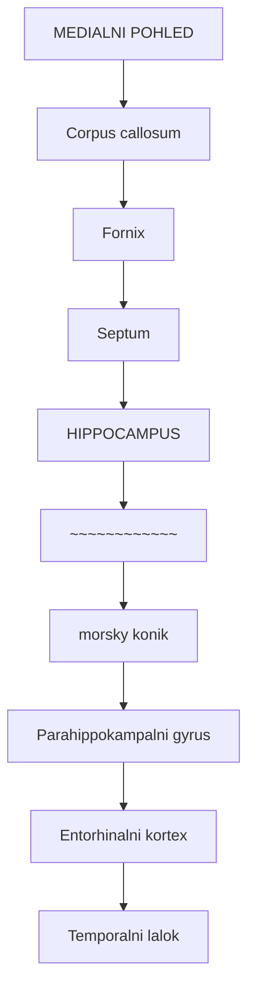
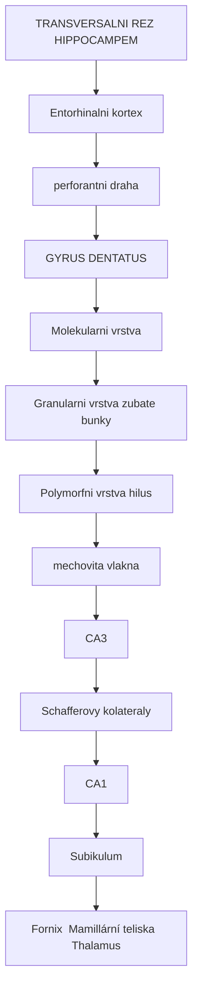
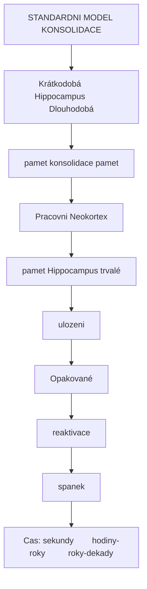
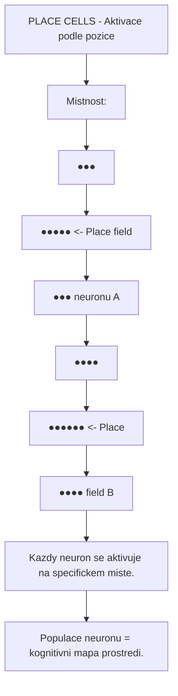
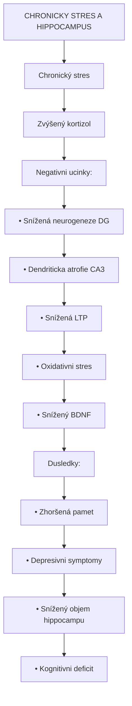
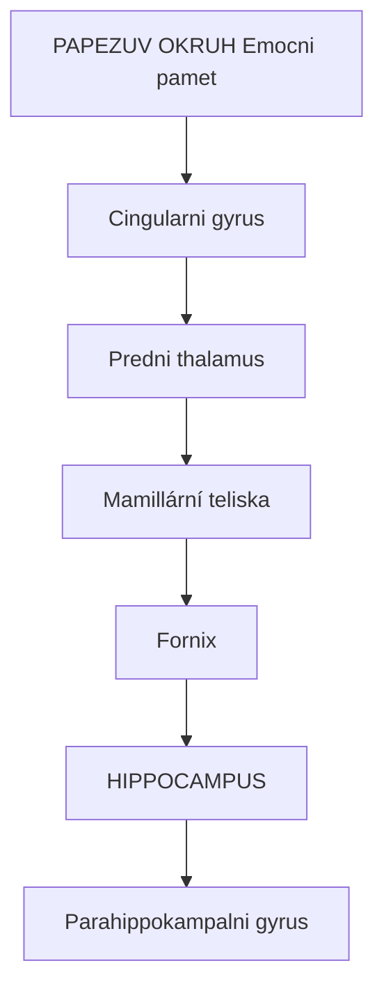

+++
title = "Hippocampus"
description = "Hippocampus - klicova mozková struktura pro pamet, prostorovou navigaci a neurogenezi"
weight = 4
insert_anchor_links = "right"

[taxonomies]
tags = ["hippocampus", "pamet", "navigace", "neurogeneze", "limbicky-system", "mozek"]
categories = ["neuroanatomie", "neuroveda", "psychedelika"]
+++

# Hippocampus - Centrum pameti a prostorove navigace

**Hippocampus** (z reckeho "hippokampos" - morsky konik) je parova struktura limbickeho systemu, ktera hraje klicovou roli v **konsolidaci pameti**, **prostorove navigaci** a **emocni regulaci**. Je jednou z mala mozkovych oblasti, kde probiha **dospela neurogeneze** - tvorba novych neuronu v dospelosti.

Hippocampus je take dulezitym cilem psychedelickych latek, ktere zde moduluji pamefove procesy, prostorove vnimani a emocionalni zpracovani vzpominek.

---

## Anatomicka lokalizace

### Pozice v mozku

| Vlastnost | Hodnota |
|-----------|---------|
| **Lokalizace** | Medialni temporalni lalok |
| **Strana** | Parovy (levy a pravy) |
| **Delka** | 4-4.5 cm |
| **Objem** | 3-3.5 cm3 (kazda strana) |
| **Souradnice MNI** | x: ±28, y: -20, z: -12 |

### Anatomicke vztahy



<details>
<summary>ASCII verze diagramu</summary>

```
                    MEDIALNI POHLED

         Corpus callosum
              |
              v
    ┌─────────────────────────────────┐
    │        Fornix                    │
    │          ↓                       │
    │    ┌───────────┐                │
    │    │ Septum    │                │
    │    └─────┬─────┘                │
    │          ↓                       │
    │    ┌───────────────────────┐    │
    │    │    HIPPOCAMPUS        │    │
    │    │    ~~~~~~~~~~~~       │    │
    │    │    (morsky konik)     │    │
    │    └───────────────────────┘    │
    │          ↓                       │
    │    Parahippokampalni gyrus      │
    │          ↓                       │
    │    Entorhinalni kortex          │
    └─────────────────────────────────┘
              |
              v
        Temporalni lalok
```

</details>

---

## Vnitrni struktura

### Hippokampalni formace

Hippocampus je soucasti sirsi hippokampalni formace, ktera zahrnuje:

| Struktura | Zkratka | Hlavni funkce |
|-----------|---------|---------------|
| **Gyrus dentatus** | DG | Vstupni brána, pattern separation |
| **Cornu Ammonis 1** | CA1 | Vystupni oblast, pamet |
| **Cornu Ammonis 2** | CA2 | Socialni pamet |
| **Cornu Ammonis 3** | CA3 | Pattern completion, autoasociace |
| **Subikulum** | Sub | Vystup k dalsim strukturam |
| **Entorhinalni kortex** | EC | Hlavni vstup/vystup |

### Vrstvy hippocampu



<details>
<summary>ASCII verze diagramu</summary>

```
TRANSVERSALNI REZ HIPPOCAMPEM

Entorhinalni kortex
        |
        v (perforantni draha)
┌───────────────────────────────────────────┐
│              GYRUS DENTATUS               │
│  ┌─────────────────────────────────────┐  │
│  │ Molekularni vrstva                  │  │
│  │ Granularni vrstva (zubate bunky)    │  │
│  │ Polymorfni vrstva (hilus)           │  │
│  └─────────────────────────────────────┘  │
│                    |                       │
│                    v (mechovita vlakna)   │
│              ┌───────────┐                │
│              │    CA3    │                │
│              └─────┬─────┘                │
│                    | (Schafferovy kolateraly)
│                    v                       │
│              ┌───────────┐                │
│              │    CA1    │                │
│              └─────┬─────┘                │
│                    |                       │
│                    v                       │
│              ┌───────────┐                │
│              │ Subikulum │                │
│              └───────────┘                │
└───────────────────────────────────────────┘
        |
        v
   Fornix → Mamillární teliska → Thalamus
```

</details>

### Bunecne typy

| Typ bunky | Lokalizace | Funkce | Neurotransmiter |
|-----------|------------|--------|-----------------|
| **Granularni bunky** | DG | Vstupni zpracovani | Glutamat |
| **Pyramidove bunky** | CA1-CA3 | Hlavni projekcni | Glutamat |
| **Mistnobunky (Place cells)** | CA1, CA3 | Prostorove kodovani | Glutamat |
| **Gridove bunky** | EC | Metricka navigace | Glutamat |
| **Interneurony** | Vsechny vrstvy | Inhibice | [GABA](@/glossary/gaba.md) |

---

## Funkce hippocampu

### Deklarativni pamet

Hippocampus je esencialni pro tvorbu novych **deklarativnich (explicitnich) vzpominek**:

| Typ pameti | Hippokampalni role | Priklad |
|------------|-------------------|---------|
| **Epizodická** | Kritická | Vzpominka na vcereji vecer |
| **Semanticka** | Casne zpracovani | Fakta o svete |
| **Autobiograficka** | Konsolidace | Osobni historie |
| **Prospektivni** | Planovani | Budouci udalosti |

### Konsolidace pameti



<details>
<summary>ASCII verze diagramu</summary>

```
STANDARDNI MODEL KONSOLIDACE

Krátkodobá          Hippocampus          Dlouhodobá
pamet               (konsolidace)        pamet

Pracovni    →→→→→→  ┌─────────────┐  →→→→→→  Neokortex
pamet               │ Hippocampus │          (trvalé
                    │             │          ulozeni)
                    │ Opakované   │
                    │ reaktivace  │
                    │ (spanek)    │
                    └─────────────┘

Cas: sekundy        hodiny-roky          roky-dekady
```

</details>

### Prostorova navigace

Hippocampus obsahuje specialni neurony pro prostorovou orientaci:

| Typ bunky | Objeven | Oblast | Funkce |
|-----------|---------|--------|--------|
| **Place cells** | O'Keefe (1971) | CA1, CA3 | Kodovani pozice |
| **Grid cells** | Moser & Moser (2005) | EC | Metricka mapa |
| **Head direction cells** | Ranck (1984) | Subikulum | Orientace |
| **Border cells** | Solstad (2008) | EC | Hranice prostoru |



<details>
<summary>ASCII verze diagramu</summary>

```
PLACE CELLS - Aktivace podle pozice

Mistnost:
┌─────────────────────────────────┐
│                                 │
│    ●●●                          │
│   ●●●●●   <- Place field        │
│    ●●●        neuronu A         │
│                                 │
│              ●●●●               │
│             ●●●●●● <- Place     │
│              ●●●●     field B   │
│                                 │
└─────────────────────────────────┘

Kazdy neuron se aktivuje na specifickem miste.
Populace neuronu = kognitivni mapa prostredi.
```

</details>

### Neurogeneze

Hippocampus (konkretne gyrus dentatus) je jednou z mala oblasti dospeleho mozku, kde vznikaji nove neurony:

| Faze | Proces | Trvani |
|------|--------|--------|
| **Proliferace** | Deleni neuralnich kmenovych bunek | 1-2 dny |
| **Diferenciace** | Premena v neuroblasty | 1 tyden |
| **Migrace** | Presun do granularni vrstvy | 2-3 tydny |
| **Maturace** | Tvorba spojeni, dendrity | 4-8 tydnu |
| **Integrace** | Funkcni zapojeni do okruhu | 2-3 mesice |

**Faktory podporujici neurogenezi**:
- Fyzicka aktivita (beh)
- Uceni a kognitivni stimulace
- Psychedelika ([psilocybin](@/alkaloids/psilocybin.md), [LSD](@/alkaloids/lsd.md))
- BDNF (brain-derived neurotrophic factor)
- Socialní interakce

**Faktory inhibujici neurogenezi**:
- Chronicky stres (kortizol)
- Deprese
- Starnuti
- Alkohol
- Zanet

---

## Receptorova exprese

### Serotoninove receptory

| Receptor | Exprese | Lokalizace | Funkce |
|----------|---------|------------|--------|
| [**5-HT2A**](@/receptors/5-ht2a.md) | Stredni | CA1, CA3 | Plasticita, psychedelicky ucinek |
| **5-HT1A** | Vysoka | CA1, DG | Inhibice, anxiolyticky efekt |
| **5-HT4** | Stredni | CA1 | Kognitivni funkce |
| **5-HT7** | Nizka | CA3 | Cirkadianní regulace |

### Glutamatove receptory

| Receptor | Funkce v hippocampu |
|----------|---------------------|
| [**NMDA**](@/receptors/nmda.md) | Dlouhodoba potenciace (LTP), pamet |
| **AMPA** | Rychla excitacni transmise |
| **mGluR1/5** | Modulace plasticity |
| **mGluR2/3** | Presynapticka inhibice |

### Dalsi receptory

| Receptor | Funkce |
|----------|--------|
| **GABA-A** | Inhibice, theta rytmus |
| **Muskarinove (M1)** | Acetylcholinova modulace |
| **Dopamin D1/D5** | Odmenove uceni |
| **Kanabinoidni CB1** | Retrogradui signalizace |

---

## Hippocampus a psychedelika

### Efekty psychedelik

Klasicka psychedelika ([psilocybin](@/alkaloids/psilocybin.md), [LSD](@/alkaloids/lsd.md), [DMT](@/alkaloids/dmt.md)) ovlivnuji hippocampus prostrednictvim [5-HT2A receptoru](@/receptors/5-ht2a.md):

| Efekt | Mechanismus | Dusledek |
|-------|-------------|----------|
| **Zvysena neuroplasticita** | BDNF, mTOR aktivace | Nove synapse, dendrity |
| **Zmenene vnimani casu** | Narusena casova integrace | Dilatace/kontrakce casu |
| **Emocionalni zpracovani** | Reaktivace vzpominek | Terapeuticky insight |
| **Prostorove distorze** | Modulace place cells | Zmenena percepce prostoru |
| **Zvysena neurogeneze** | Stimulace progenitoru | Nove neurony |

### Neuroplasticke ucinky

```mermaid
flowchart TD
    node_PSYCHEDELIKAAHIPPOKA["PSYCHEDELIKA A HIPPOKAMPALNI PLASTICITA"]
    node_PsilocybinLSD["Psilocybin/LSD"]
    node_5HT2AreceptorCA1DG["5-HT2A receptor CA1, DG"]
    node_Intracelularnisignal["Intracelularni signalizace:"]
    node_GqPLCIP3DAG["Gq  PLCβ  IP3 + DAG"]
    node_Ca2PKC["Ca2+      PKC"]
    node_CaMKIIERK12["CaMKII   ERK1/2"]
    node_00c04819["↘   ↙"]
    node_CREB["CREB"]
    node_Genovexprese["Genová exprese"]
    node_BDNFArccFos["BDNF, Arc, c-Fos"]
    node_Strukturalnizmeny["Strukturalni zmeny:"]
    node_Zvysenidendritickeko["• Zvyseni dendriticke komplexity"]
    node_Novedendriticketrny["• Nove dendriticke trny"]
    node_Synaptogeneze["• Synaptogeneze"]
    node_ZvysenaneurogenezeDG["• Zvysena neurogeneze DG"]

    node_PSYCHEDELIKAAHIPPOKA --> node_PsilocybinLSD
    node_PsilocybinLSD --> node_5HT2AreceptorCA1DG
    node_5HT2AreceptorCA1DG --> node_Intracelularnisignal
    node_Intracelularnisignal --> node_GqPLCIP3DAG
    node_GqPLCIP3DAG --> node_Ca2PKC
    node_Ca2PKC --> node_CaMKIIERK12
    node_CaMKIIERK12 --> node_00c04819
    node_00c04819 --> node_CREB
    node_CREB --> node_Genovexprese
    node_Genovexprese --> node_BDNFArccFos
    node_BDNFArccFos --> node_Strukturalnizmeny
    node_Strukturalnizmeny --> node_Zvysenidendritickeko
    node_Zvysenidendritickeko --> node_Novedendriticketrny
    node_Novedendriticketrny --> node_Synaptogeneze
    node_Synaptogeneze --> node_ZvysenaneurogenezeDG

    click node_PsilocybinLSD "/alkaloids/psilocybin/" "Psilocybin/LSD"
    click node_5HT2AreceptorCA1DG "/receptors/5-ht2a/" "5-HT2A receptor CA1, DG"
    click node_BDNFArccFos "/molecules/bdnf/" "BDNF, Arc, c-Fos"
```



<details>
<summary>ASCII verze diagramu</summary>

```
PSYCHEDELIKA A HIPPOKAMPALNI PLASTICITA

Psilocybin/LSD
       |
       v
  5-HT2A receptor (CA1, DG)
       |
       v
┌──────────────────────────────────────┐
│ Intracelularni signalizace:          │
│                                      │
│  Gq → PLCβ → IP3 + DAG              │
│           ↓        ↓                │
│        Ca2+      PKC                │
│           ↓        ↓                │
│        CaMKII   ERK1/2              │
│              ↘   ↙                  │
│               CREB                   │
│                ↓                     │
│         Genová exprese               │
│         (BDNF, Arc, c-Fos)           │
└──────────────────────────────────────┘
       |
       v
┌──────────────────────────────────────┐
│ Strukturalni zmeny:                  │
│                                      │
│ • Zvyseni dendriticke komplexity    │
│ • Nove dendriticke trny             │
│ • Synaptogeneze                      │
│ • Zvysena neurogeneze (DG)          │
└──────────────────────────────────────┘
```

</details>

### Terapeuticke implikace

| Porucha | Hippokampalni patologie | Psychedelicky ucinek |
|---------|-------------------------|----------------------|
| **Deprese** | Atrofie, snizena neurogeneze | Obnoveni objemu, neurogeneze |
| **PTSD** | Nadmerna reaktivace traumat | Rekonsolidace vzpominek |
| **Zavislost** | Habitualni vzorce | Narušení paměťových stop |
| **Uzkost** | Hyperaktivita | Modulace emocni pameti |

### Studie u lidi

| Studie | Nalez | Reference |
|--------|-------|-----------|
| Carhart-Harris (2012) | Snizena hippokampalni aktivita pod psilocybinem | PNAS |
| Lebedev (2015) | Zmenena konektivita hippocampus-kortex | Human Brain Mapping |
| Barrett (2020) | Zvysena neuroplasticita markery | Neuropharmacology |

---

## Patologie hippocampu

### Alzheimerova choroba

| Faze | Hippokampalni zmeny |
|------|---------------------|
| **Preklínicka** | Tau akumulace v EC |
| **MCI** | Atrofie hippocampu (-15-25%) |
| **Casna AD** | Vyrazna atrofie, paměťový deficit |
| **Pokrocila AD** | Tezke poskozeni, amnézie |

### Epilepsie

**Mesialní temporální skleróza (MTS)**:
- Ztrata neuronu v CA1 a CA3
- Glioza
- Reorganizace mechových vláken
- Caste ohnisko záchvatů

### Stres a deprese



<details>
<summary>ASCII verze diagramu</summary>

```
CHRONICKY STRES A HIPPOCAMPUS

Chronický stres
      |
      v
Zvýšený kortizol
      |
      v
┌────────────────────────────────┐
│ Negativni ucinky:              │
│                                │
│ • Snížená neurogeneze (DG)    │
│ • Dendriticka atrofie (CA3)   │
│ • Snížená LTP                 │
│ • Oxidativni stres            │
│ • Snížený BDNF                │
└────────────────────────────────┘
      |
      v
┌────────────────────────────────┐
│ Dusledky:                      │
│                                │
│ • Zhoršená pamet              │
│ • Depresivni symptomy         │
│ • Snížený objem hippocampu    │
│ • Kognitivni deficit          │
└────────────────────────────────┘
```

</details>

---

## Neurozobrazovaci metody

### MRI hippocampu

| Metoda | Mereni | Vyuziti |
|--------|--------|---------|
| **Volumetrie** | Objem hippocampu | AD diagnostika |
| **Shape analysis** | Tvarove zmeny | Subfield atrofie |
| **fMRI** | BOLD signal | Aktivace pri úkolech |
| **DWI/DTI** | Integrita bile hmoty | Konektivita |

### PET a SPECT

| Radioligand | Cil | Aplikace |
|-------------|-----|----------|
| [11C]WAY-100635 | 5-HT1A | Deprese, uzkost |
| [11C]MDL 100907 | [5-HT2A](@/receptors/5-ht2a.md) | Psychedelicky vyzkum |
| [18F]FDG | Metabolismus | AD, epilepsie |
| [11C]Pittsburgh B | Amyloid | AD |

---

## Elektrofyziologie

### Theta rytmus

Hippokampalni **theta rytmus** (4-8 Hz) je charakteristicky pro:
- Exploraci prostoru
- REM spanek
- Uceni a pamet

```
THETA OSCILACE

Theta (4-8 Hz) - hippocampus
___/\___/\___/\___/\___/\___

Funkce:
• Casova koordinace neuronu
• Fázový precession (place cells)
• Komunikace s neokortexem
• Konsolidace behem spanku
```

### Sharp-wave ripples

**Sharp-wave ripples** (SWR, 150-250 Hz) jsou klicove pro:
- Konsolidaci pameti
- Reaktivaci zkusenosti
- Transfer do neokortexu

---

## Konektivita

### Hlavni vstupni drahy

| Draha | Zdroj | Cil | Funkce |
|-------|-------|-----|--------|
| **Perforantni** | EC | DG, CA3, CA1 | Hlavni kortikalni vstup |
| **Schaffer kolateraly** | CA3 | CA1 | Intra-hippokampalni |
| **Mechovita vlakna** | DG | CA3 | Pattern separation |
| **Fimbria/fornix** | Septum | Hippocampus | Cholinergni modulace |

### Hlavni vystupni drahy

| Draha | Zdroj | Cil | Funkce |
|-------|-------|-----|--------|
| **Fornix** | Subikulum | Mamillární teliska | Papezův okruh |
| **EC projekce** | CA1, Sub | Neokortex | Paměťova konsolidace |
| **Amygdala** | CA1, Sub | [Amygdala](@/brain/amygdala.md) | Emoční pamet |

### Papezuv okruh



<details>
<summary>ASCII verze diagramu</summary>

```
PAPEZUV OKRUH (Emocni pamet)

       Cingularni gyrus
            ↑
            │
    Predni thalamus
            ↑
            │
    Mamillární teliska
            ↑
            │
         Fornix
            ↑
            │
      HIPPOCAMPUS
            ↑
            │
    Parahippokampalni gyrus
```

</details>

---

## Vyvojove aspekty

### Prenatalni vyvoj

| Gestacni tyden | Vyvojova udalost |
|----------------|------------------|
| 6-8 | Vznik hippokampalni anlage |
| 10-12 | Diferenciace CA poli |
| 14-16 | Tvorba gyrus dentatus |
| 20-24 | Synaptogeneze |
| 24-40 | Myelinizace, maturace |

### Postnatalni vyvoj

| Vek | Zmeny |
|-----|-------|
| 0-2 roky | Rychly rust, synaptogeneze |
| 2-6 let | Peak dendriticke komplexity |
| 6-12 let | Pruning, optimalizace |
| Adolescence | Dokonceni maturace |
| Dospelost | Stabilni, neurogeneze pokracuje |
| Stari | Postupna atrofie (~1-2% rocne) |

---

## Farmakologicke cile

### Prokognitivni latky

| Latka | Mechanismus | Ucinek |
|-------|-------------|--------|
| **Donepezil** | AChE inhibitor | Zlepsena pamet (AD) |
| **Memantine** | [NMDA](@/receptors/nmda.md) antagonista | Neuroprotekce |
| **Piracetam** | AMPA modulace | Kontroverzni |
| **Psychedelika** | 5-HT2A, neuroplasticita | Vyzkum |

### Anxiolytika ovlivnujici hippocampus

| Latka | Receptor | Efekt |
|-------|----------|-------|
| **Buspiron** | 5-HT1A agonista | Anxiolyticky |
| **Benzodiazepiny** | [GABA-A](@/receptors/gaba-a.md) PAM | Anxiolyticky, amnezie |

---

## Reference

## Křížové odkazy

### Neurotransmitery a receptory
- [Serotonin](@/glossary/serotonin.md) - hlavní modulátor hippokampální funkce
- [5-HT1A receptor](@/receptors/5-ht1a.md) - anxiolytické účinky, neurogeneze
- [GABA](@/glossary/gaba.md) - inhibiční neurotransmiter, interneurony
- [Glutamát](@/glossary/glutamate.md) - hlavní excitační neurotransmiter pyramidálních neuronů
- [NMDA receptor](@/receptors/nmda.md) - klíčový pro LTP a učení
- [AMPA receptor](@/receptors/ampa.md) - rychlá glutamátergní transmise

### Psychedelika ovlivňující hippocampus
- [LSD](@/alkaloids/lsd.md) - 5-HT1A a 5-HT2A agonista
- [Psilocybin](@/alkaloids/psilocybin.md) - modulace paměťových procesů
- [DMT](@/alkaloids/dmt.md) - alterace prostorového vnímání
- [Ketamin](@/alkaloids/ketamin.md) - NMDA antagonista, antidepresivní účinky

### Příbuzné mozkové struktury
- [Prefrontální kortex](@/brain/prefrontal-cortex.md) - executive funkce, pracovní paměť
- [Amygdala](@/brain/amygdala.md) - emoce, strach, paměť na trauma
- [Default Mode Network](@/circuits/dmn.md) - síť ovlivněná psychedeliky

### Neuroplasticita a učení
- [Neuroplasticita](@/glossary/neuroplasticita.md) - synaptic plasticity, LTP/LTD
- [BDNF](@/molecules/bdnf.md) - růstový faktor podporující neurogenezi
- [Učení a paměť](@/glossary/uceni.md) - mechanismy učení

### Klinické souvislosti
- [Deprese](@/conditions/depression.md) - snížený objem hippocampu, neurogeneze
- **PTSD** - dysregulace hippocampu, paměť na trauma
- [Závislosti](@/conditions/addiction.md) - modulace reward systému

### Klicova literatura

1. O'Keefe, J. & Nadel, L. (1978). *The Hippocampus as a Cognitive Map*. Oxford University Press.

2. Squire, L.R. (1992). *Memory and the hippocampus: A synthesis from findings with rats, monkeys, and humans*. Psychological Review, 99(2), 195-231.

3. Moser, E.I., Moser, M.B. & McNaughton, B.L. (2017). *Spatial representation in the hippocampal formation: A history*. Nature Neuroscience, 20(11), 1448-1464.

4. Carhart-Harris, R.L. et al. (2012). *Neural correlates of the psychedelic state as determined by fMRI studies with psilocybin*. PNAS, 109(6), 2138-2143.

5. Kempermann, G. et al. (2018). *Human Adult Neurogenesis: Evidence and Remaining Questions*. Cell Stem Cell, 23(1), 25-30.

### Neurogeneze a psychedelika

6. Catlow, B.J. et al. (2013). *Effects of psilocybin on hippocampal neurogenesis and extinction of trace fear conditioning*. Experimental Brain Research, 228(4), 481-491.

7. Ly, C. et al. (2018). *Psychedelics Promote Structural and Functional Neural Plasticity*. Cell Reports, 23(11), 3170-3182.

### Patologie

8. Jack, C.R. et al. (2018). *NIA-AA Research Framework: Toward a biological definition of Alzheimer's disease*. Alzheimer's & Dementia, 14(4), 535-562.

---

## Mechanismy neuroplasticity v hippocampu

Hippocampus je klicovym mistem pro pochopeni neuroplastickych mechanismu psychoaktivnich latek -- viz [Mechanismy ucinku](@/mechanisms/_index.md):

### Konvergence signalnich drah v hippocampu

```mermaid
flowchart TD
    node_NEUROPLASTICITAVHIPP["NEUROPLASTICITA V HIPPOCAMPU"]
    node_PSYCHEDELIKA5HT2AKET["PSYCHEDELIKA 5-HT2A:           KETAMIN NMDA blokada:"]
    node_PsilocinLSDDMTKetami["Psilocin, LSD, DMT               Ketamin, PCP"]
    node_5HT2AGqPLCbetaNMDAbl["5-HT2A -&gt; Gq -&gt; PLCbeta          NMDA blok -&gt; Glu burst"]
    node_Ca2PKCERK12AMPABDNFu["Ca2+/PKC -&gt; ERK1/2               AMPA -&gt; BDNF uvolneni"]
    node_KONVERGENCE["+-------&gt; KONVERGENCE &lt;---------+"]
    node_BDNFTrkB["BDNF -&gt; TrkB"]
    node_mTORC1aktivace["mTORC1 aktivace"]
    node_3c51c5b4["+------------+------------+"]
    node_PSD95GluA1Synaptofyz["PSD-95        GluA1       Synaptofyzin"]
    node_postsynaptAMPApresyn["postsynapt. AMPA     presynapt."]
    node_SYNAPTOGENEZELTPFACI["SYNAPTOGENEZE + LTP FACILITACE"]
    node_NEUROGENEZEDGsubgran["NEUROGENEZE DG subgranularni zona"]
    node_neurogenezivdentateg["neurogenezi v dentate gyrus"]

    node_NEUROPLASTICITAVHIPP --> node_PSYCHEDELIKA5HT2AKET
    node_PSYCHEDELIKA5HT2AKET --> node_PsilocinLSDDMTKetami
    node_PsilocinLSDDMTKetami --> node_5HT2AGqPLCbetaNMDAbl
    node_5HT2AGqPLCbetaNMDAbl --> node_Ca2PKCERK12AMPABDNFu
    node_Ca2PKCERK12AMPABDNFu --> node_KONVERGENCE
    node_KONVERGENCE --> node_BDNFTrkB
    node_BDNFTrkB --> node_mTORC1aktivace
    node_mTORC1aktivace --> node_3c51c5b4
    node_3c51c5b4 --> node_PSD95GluA1Synaptofyz
    node_PSD95GluA1Synaptofyz --> node_postsynaptAMPApresyn
    node_postsynaptAMPApresyn --> node_SYNAPTOGENEZELTPFACI
    node_SYNAPTOGENEZELTPFACI --> node_NEUROGENEZEDGsubgran
    node_NEUROGENEZEDGsubgran --> node_neurogenezivdentateg

    click node_NEUROPLASTICITAVHIPP "/glossary/neuroplasticita/" "NEUROPLASTICITA V HIPPOCAMPU"
    click node_PSYCHEDELIKA5HT2AKET "/receptors/5-ht2a/" "PSYCHEDELIKA 5-HT2A:           KETAMIN NMDA blokada:"
    click node_PsilocinLSDDMTKetami "/alkaloids/lsd/" "Psilocin, LSD, DMT               Ketamin, PCP"
    click node_5HT2AGqPLCbetaNMDAbl "/receptors/5-ht2a/" "5-HT2A -> Gq -> PLCbeta          NMDA blok -> Glu burst"
    click node_Ca2PKCERK12AMPABDNFu "/molecules/bdnf/" "Ca2+/PKC -> ERK1/2               AMPA -> BDNF uvolneni"
    click node_BDNFTrkB "/molecules/bdnf/" "BDNF -> TrkB"
```



<details>
<summary>ASCII verze diagramu</summary>

```
NEUROPLASTICITA V HIPPOCAMPU

PSYCHEDELIKA (5-HT2A):           KETAMIN (NMDA blokada):
Psilocin, LSD, DMT               Ketamin, PCP
        |                               |
        v                               v
5-HT2A -> Gq -> PLCbeta          NMDA blok -> Glu burst
        |                               |
        v                               v
Ca2+/PKC -> ERK1/2               AMPA -> BDNF uvolneni
        |                               |
        +-------> KONVERGENCE <---------+
                       |
                       v
               BDNF -> TrkB
                       |
                       v
               mTORC1 aktivace
                       |
          +------------+------------+
          |            |            |
          v            v            v
     PSD-95        GluA1       Synaptofyzin
     (postsynapt.) (AMPA)     (presynapt.)
          |            |            |
          v            v            v
    SYNAPTOGENEZE + LTP FACILITACE
          |
          v
    NEUROGENEZE (DG subgranularni zona)
    - Catlow et al. 2013: Psilocybin zvysuje
      neurogenezi v dentate gyrus
```

</details>

### Terapeuticky vyznam hippocampalnich mechanismu

| Mechanismus | Latka | Hippocampalni efekt | Klinicky korelat |
|-------------|-------|---------------------|------------------|
| 5-HT2A -> BDNF | [Psilocybin](@/alkaloids/psilocybin.md) | Neurogeneze v DG | Antidepresivni, pro-kognitivni |
| NMDA blok -> synaptogeneze | Ketamin | CA1 synaptogeneze | Rychly antidepresivni ucinek |
| 5-HT2A -> extinkcni uceni | [Psilocybin](@/alkaloids/psilocybin.md) | Facilitace fear extinction | PTSD terapie |

Podrobnosti: [Signalni transdukce](@/mechanisms/signal-transduction.md) -- BDNF-TrkB, mTOR konvergence
Podrobnosti: [Alostericka modulace](@/mechanisms/allosteric-modulation.md) -- NMDA modulace v hippocampu

---

## Viz také

### Terapeutické cílení hippocampu
- [Deprese](@/conditions/depression.md) - **Atrofie hippocampu, cíl neuroplastické terapie**
- [PTSD](conditions/ptsd.md) - Narušená konsolidace traumatických vzpomínek
- [Alzheimer](conditions/alzheimer.md) - Primární lokalizace patologie
- [Schizofrenie](@/conditions/schizophrenia.md) - Deficity paměti

### Neuroplasticita a molekuly
- [BDNF](@/molecules/bdnf.md) - **Klíčový růstový faktor neurogeneze**
- [Neuroplasticita](@/glossary/neuroplasticita.md) - Synaptická a strukturální plasticita
- [Učení](@/glossary/uceni.md) - Paměťové konsolidace

### Psychoaktivní látky cílící hippocampus
- [Psilocybin](@/alkaloids/psilocybin.md) - **Indukce BDNF, neuroplasticita**
- [Ketamin](@/alkaloids/ketamin.md) - Rychlá spinogeneze, antidepresivní efekty
- [LSD](@/alkaloids/lsd.md) - Prostorové vnímání, paměťové modulace
- [DMT](@/alkaloids/dmt.md) - Neurogeneze, mystické vzpomínky

### Receptory v hippocampu
- [5-HT2A receptor](@/receptors/5-ht2a.md) - **Psychedelický cíl neuroplasticity**
- [NMDA receptor](@/receptors/nmda.md) - **Plasticita, LTP, cíl ketaminu**
- [GABA-A receptor](@/receptors/gaba-a.md) - α5 subtyp, paměťové efekty
- [5-HT1A receptor](@/receptors/5-ht1a.md) - Anxiolýza, neurogeneze

### Limbické propojení
- [Amygdala](@/brain/amygdala.md) - **Emoční zpracování vzpomínek**
- [Prefrontální kortex](@/brain/prefrontal-cortex.md) - Pracovní paměť, exekutivní funkce
- [Thalamus](@/brain/thalamus.md) - Senzorický relay k hippocampu
- [Claustrum](@/brain/claustrum.md) - Integrace vědomí a paměti
- [Raphe nuclei](@/brain/raphe-nuclei.md) - Serotoninová modulace neurogeneze

### Okruhy a sítě
- [Default Mode Network](@/circuits/dmn.md) - **Hippocampus jako DMN hub**
- [GABA-A receptor](@/receptors/gaba-a.md) - Inhibice

### Neurotransmitery
- [Serotonin](@/glossary/serotonin.md) - Modulace nalady
- [GABA](@/glossary/gaba.md) - Inhibicni neurotransmiter
- [Glutamat](@/glossary/glutamat.md) - Excitacni transmise

### Psychoaktivni latky
- [Psilocybin](@/alkaloids/psilocybin.md) - Neuroplasticita, neurogeneze
- [LSD](@/alkaloids/lsd.md) - Kognitivni efekty
- [DMT](@/alkaloids/dmt.md) - Endogenni psychedelikum

### Mechanismy ucinku
- [Mechanismy ucinku](@/mechanisms/_index.md) - kompletni prehled
- [Signalni transdukce](@/mechanisms/signal-transduction.md) - BDNF-TrkB, mTOR
- [Alostericka modulace](@/mechanisms/allosteric-modulation.md) - NMDA modulace
- [PK-PD vztahy](@/mechanisms/pharmacokinetic-pharmacodynamic.md) - terapeuticke davkovani

---

<- Zpet na [Mozek](@/brain/_index.md) | [Amygdala](@/brain/amygdala.md) ->
