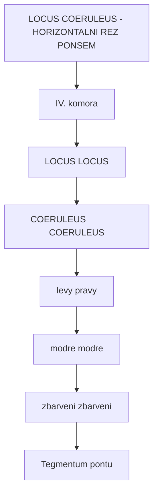
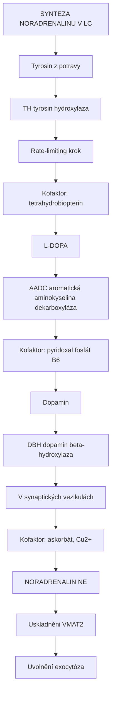
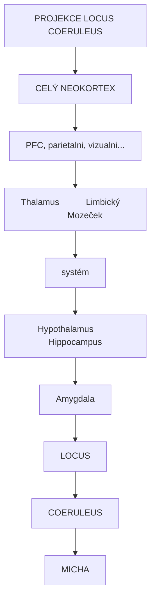
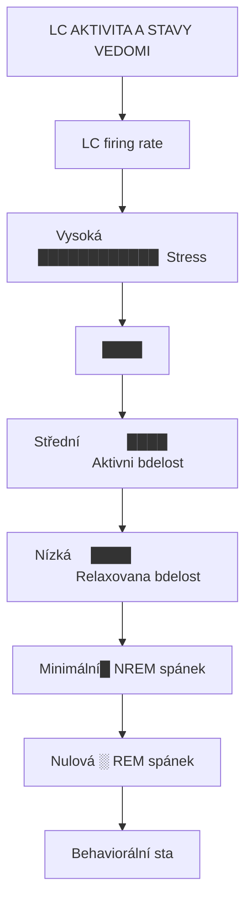
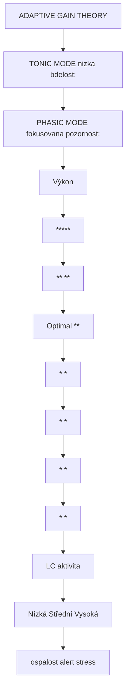
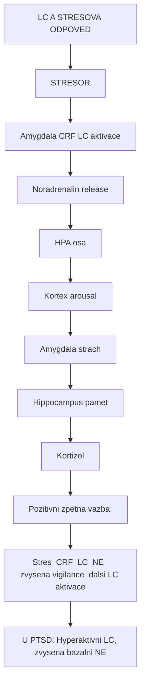
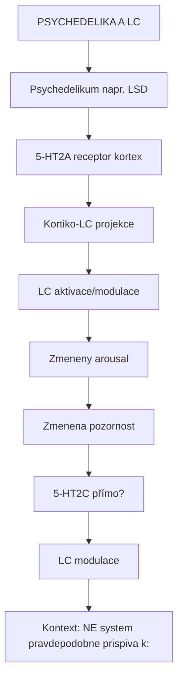
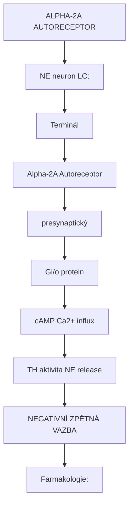

+++
title = "Locus coeruleus"
description = "Locus coeruleus - hlavni zdroj noradrenalinu v mozku, centrum bdělosti a pozornosti"
weight = 8
insert_anchor_links = "right"

[taxonomies]
tags = ["locus-coeruleus", "noradrenalin", "arousal", "pozornost", "stres", "mozek"]
categories = ["neuroanatomie", "neuroveda", "psychedelika"]
+++

# Locus coeruleus - Centrum bdelosti

**Locus coeruleus** (LC, z latiny "modré místo") je male jadro v dorzalnim pontu, ktere predstavuje hlavni zdroj **noradrenalinu (norepinefrinu)** v centralnim nervovem systemu. Navzdory sve malé velikosti (pouze ~15,000-30,000 neuronu u cloveka) ma difuzni projekce do prakticky vsech oblasti mozku a misehy.

LC je klicovy pro regulaci **bdelosti**, **pozornosti**, **stresove odpovedi** a **kognitivni flexibility**. V kontextu psychedelik moduluje arousal a muze prispivat k nekterym aspektum zmeneneho stavu vedomi.

---

## Anatomicka lokalizace

### Pozice v mozku

| Vlastnost | Hodnota |
|-----------|---------|
| **Lokalizace** | Dorzalni pons (tegmentum) |
| **Pozice** | Lateralne od IV. komory |
| **Strana** | Parovy |
| **Pocet neuronu** | ~15,000-30,000 u cloveka |
| **Barva** | Modra (neuromelanin) |

### Anatomicke vztahy



<details>
<summary>ASCII verze diagramu</summary>

```
LOCUS COERULEUS - HORIZONTALNI REZ PONSEM

                    IV. komora
                        │
           ┌────────────┴────────────┐
           │                         │
    ┌──────┴──────┐           ┌──────┴──────┐
    │             │           │             │
    │  LOCUS      │           │    LOCUS    │
    │  COERULEUS  │           │  COERULEUS  │
    │   (levy)    │           │   (pravy)   │
    │             │           │             │
    │  (modre     │           │  (modre     │
    │   zbarveni) │           │   zbarveni) │
    │             │           │             │
    └─────────────┘           └─────────────┘
           │                         │
           └────────────┬────────────┘
                        │
              Tegmentum pontu
```

</details>

### Neuromelanin

LC ma charakteristickou **modrou barvu** diky neuromelaninu:

| Vlastnost | Hodnota |
|-----------|---------|
| **Pigment** | Neuromelanin |
| **Puvod** | Oxidace noradrenalinu |
| **Funkce** | Vazba toxinu, zeleza |
| **Vek** | Narustat s vekem |
| **Patologie** | Ztrata u Parkinsona, Alzheimera |

---

## Bunecna charakteristika

### LC neurony

| Vlastnost | Hodnota |
|-----------|---------|
| **Neurotransmiter** | Noradrenalin (NE) |
| **Ko-transmiter** | Galanin, NPY |
| **Morfologie** | Velke, multipolární |
| **Axony** | Extenzivne vetvene |
| **Cílove oblasti** | Prakticky cely CNS |

### Synteza noradrenalinu



<details>
<summary>ASCII verze diagramu</summary>

```
SYNTEZA NORADRENALINU V LC

Tyrosin (z potravy)
    │
    │ TH (tyrosin hydroxylaza)
    │ Rate-limiting krok
    │ Kofaktor: tetrahydrobiopterin
    ↓
L-DOPA
    │
    │ AADC (aromatická aminokyselina dekarboxyláza)
    │ Kofaktor: pyridoxal fosfát (B6)
    ↓
Dopamin
    │
    │ DBH (dopamin beta-hydroxylaza)
    │ V synaptických vezikulách
    │ Kofaktor: askorbát, Cu2+
    ↓
NORADRENALIN (NE)
    │
    └─→ Uskladněni (VMAT2)
        │
        └─→ Uvolnění (exocytóza)
```

</details>

### Klicove enzymy

| Enzym | Gen | Funkce | Regulace |
|-------|-----|--------|----------|
| **TH** | TH | Rate-limiting, L-DOPA | PKA, stress |
| **DBH** | DBH | Dopamin → NE | Ve vezikulách |
| **MAO-A** | MAOA | Degradace NE | Geneticke varianty |
| **COMT** | COMT | Degradace NE | Val158Met |

---

## Projekce LC

### Vzestupné projekce

LC inervuje prakticky cely mozek:



<details>
<summary>ASCII verze diagramu</summary>

```
PROJEKCE LOCUS COERULEUS

                    ┌─────────────────────────────────┐
                    │                                 │
                    │     CELÝ NEOKORTEX              │
                    │     (PFC, parietalni, vizualni...) │
                    └────────────────┬────────────────┘
                                     │
              ┌──────────────────────┼──────────────────────┐
              │                      │                      │
              ↓                      ↓                      ↓
       ┌─────────────┐       ┌─────────────┐       ┌─────────────┐
       │  Thalamus   │       │ Limbický    │       │ Mozeček     │
       │             │       │  systém     │       │             │
       └─────────────┘       └─────────────┘       └─────────────┘
              │                      │                      │
              │                      │                      │
       ┌──────┴──────┐       ┌──────┴──────┐
       │ Hypothalamus│       │ Hippocampus │
       │             │       │ Amygdala    │
       └─────────────┘       └─────────────┘
                                     │
                             ┌───────┴───────┐
                             │               │
                             │ LOCUS         │
                             │ COERULEUS     │
                             │               │
                             └───────┬───────┘
                                     │
                                     ↓
                             ┌─────────────┐
                             │   MICHA     │
                             │             │
                             └─────────────┘
```

</details>

### Specificke projekce

| Cil | Funkce | Adrenoreceptor |
|-----|--------|----------------|
| **[Prefrontalni kortex](@/brain/prefrontal-cortex.md)** | Pracovni pamet, pozornost | Alpha-2A, Alpha-1 |
| **[Hippocampus](@/brain/hippocampus.md)** | Pamet, LTP modulace | Beta, Alpha-1 |
| **[Amygdala](@/brain/amygdala.md)** | Emocni pamet, strach | Beta |
| **[Thalamus](@/brain/thalamus.md)** | Arousal, senzoricky relay | Alpha-1 |
| **Mozeček** | Motoricka koordinace | Beta |
| **Micha** | Bolest, autonomni | Alpha-2 |

---

## Funkcni role

### Arousal a bdelost

LC je klicovy pro regulaci stavu bdelosti:



<details>
<summary>ASCII verze diagramu</summary>

```
LC AKTIVITA A STAVY VEDOMI

       LC firing rate
            ^
            │
Vysoká  ────┤                    ████████████  Stress
            │                 ████
            │              ████
Střední ────┤           ████                   Aktivni bdelost
            │        ████
            │     ████
Nízká   ────┤  ████                            Relaxovana bdelost
            │
Minimální───┤█                                 NREM spánek
            │
Nulová  ────┤░                                 REM spánek
            │
            └────────────────────────────────→ Behaviorální stav
```

</details>

### Adaptive Gain Theory

LC moduluje "gain" kortikalni odpovedi:



<details>
<summary>ASCII verze diagramu</summary>

```
ADAPTIVE GAIN THEORY

TONIC MODE (nizka bdelost):
- Nizka, stabilni LC aktivita
- Široky "spotlight" pozornosti
- Explorace prostredi
- Flexibilita

PHASIC MODE (fokusovana pozornost):
- Vysoky phasic LC burst
- Úzký "spotlight"
- Exploitace (vyuziti znameho)
- Selektivita

                    Výkon
                      ^
                      │        *****
                      │      **     **
Optimal ──────────────│────*─────────*────────
                      │   *           *
                      │  *             *
                      │ *               *
                      │*                 *
                      └───────────────────────→ LC aktivita
                      Nízká   Střední   Vysoká
                      (ospalost) (alert) (stress)

= Obrácená U-křivka (Yerkes-Dodson)
```

</details>

### Pozornost a kognice

| Funkce | Mechanismus | Receptor |
|--------|-------------|----------|
| **Sustained attention** | Tonic LC modulace | Alpha-2A |
| **Selective attention** | Phasic bursts | Alpha-2A |
| **Cognitive flexibility** | Reset networks | Alpha-1, Beta |
| **Working memory** | PFC NE | Alpha-2A (optimum) |
| **Memory consolidation** | Hippocampal NE | Beta |

### Stresova odpoved



<details>
<summary>ASCII verze diagramu</summary>

```
LC A STRESOVA ODPOVED

STRESOR
    │
    ↓
Amygdala (CRF) ──────→ LC aktivace
    │                       │
    │                       ↓
    ↓               Noradrenalin release
HPA osa                     │
    │                       ├─→ Kortex (arousal)
    │                       ├─→ Amygdala (strach)
    ↓                       └─→ Hippocampus (pamet)
Kortizol

Pozitivni zpetna vazba:
Stres → CRF → LC → NE → zvysena vigilance → dalsi LC aktivace

U PTSD: Hyperaktivni LC, zvysena bazalni NE
```

</details>

---

## LC a psychedelika

### Efekty psychedelik na LC

| Efekt | Mechanismus |
|-------|-------------|
| **Zvysena aktivita** | 5-HT2A aktivace (neprime) |
| **Modulace arousalu** | Zmena tonic/phasic |
| **Interakce s raphe** | Vzajemna regulace |

### Mechanismus



<details>
<summary>ASCII verze diagramu</summary>

```
PSYCHEDELIKA A LC

Psychedelikum (napr. LSD)
        │
        ├─→ 5-HT2A receptor (kortex)
        │         │
        │         ↓
        │   Kortiko-LC projekce
        │         │
        │         ↓
        │   LC aktivace/modulace
        │         │
        │         └─→ Zmeneny arousal
        │         └─→ Zmenena pozornost
        │
        └─→ 5-HT2C (přímo?)
                  │
                  ↓
            LC modulace

Kontext: NE system pravdepodobne prispiva k:
- Zvysene bdelosti pod psychedeliky
- Emocni intenzite
- Hypervigilanci
```

</details>

### Psychedelika a noradrenergni system

| Latka | Efekt na LC | Reference |
|-------|-------------|-----------|
| **[LSD](@/alkaloids/lsd.md)** | Zvysena aktivita | Aghajanian 1968 |
| **[Psilocybin](@/alkaloids/psilocybin.md)** | Modulace | - |
| **MDMA** | Silna NE release | Green 2003 |

---

## Receptorova exprese

### Adrenoreceptory v LC

| Receptor | Exprese | Funkce |
|----------|---------|--------|
| **Alpha-2A** | Vysoka | Autoreceptor (inhibice) |
| **Alpha-1** | Stredni | Excitace (od PFC) |

### Dalsi receptory

| Receptor | Ligand | Efekt na LC |
|----------|--------|-------------|
| **5-HT2A** | [Serotonin](@/glossary/serotonin.md) | Excitace |
| **CRF-R1** | CRF | Silna excitace |
| **Orexin** | Orexin A/B | Excitace (arousal) |
| **GABA-A** | [GABA](@/glossary/gaba.md) | Inhibice |
| **Opioidni (mu)** | Endorfiny | Inhibice |

### Alpha-2 autoreceptor



<details>
<summary>ASCII verze diagramu</summary>

```
ALPHA-2A AUTORECEPTOR

NE neuron (LC):
┌─────────────────────────────────────────────────┐
│                                                 │
│   Terminál                                      │
│       │                                         │
│       │ ┌─────────────────┐                    │
│       └─┤ Alpha-2A        │ ← Autoreceptor     │
│         │ (presynaptický) │                    │
│         └────────┬────────┘                    │
│                  │                              │
│                  ↓                              │
│         Gi/o protein                            │
│                  │                              │
│         ┌───────┴───────┐                      │
│         ↓               ↓                      │
│    ↓ cAMP          ↓ Ca2+ influx              │
│         │               │                      │
│         ↓               ↓                      │
│    ↓ TH aktivita   ↓ NE release               │
│                                                 │
│   NEGATIVNÍ ZPĚTNÁ VAZBA                       │
└─────────────────────────────────────────────────┘

Farmakologie:
- Agonista (clonidin, dexmedetomidin): sedace, analgezie
- Antagonista (yohimbin): arousal, anxieta
```

</details>

---

## Konektivita

### Aferentni spoje

| Zdroj | Neurotransmiter | Efekt |
|-------|-----------------|-------|
| **[Amygdala](@/brain/amygdala.md) (CeA)** | CRF | Silna excitace |
| **Hypothalamus (LH)** | Orexin | Arousal |
| **PAG** | Glutamát | Obrana, bolest |
| **[Prefrontální kortex](@/brain/prefrontal-cortex.md)** | Glutamát | Modulace |
| **Nucleus paragigantocell.** | GABA | Inhibice (REM) |

### Eferentni spoje

| Cil | Receptor | Funkce |
|-----|----------|--------|
| **Neokortex** | Alpha-1, Alpha-2, Beta | Arousal, kognice |
| **Hippocampus** | Beta, Alpha-1 | LTP, pamet |
| **Amygdala** | Beta | Emocni pamet |
| **Thalamus** | Alpha-1 | Senzoricky gate |
| **Raphe nuclei** | Alpha-1 | Vzajemna regulace |
| **Micha** | Alpha-2 | Analgezie |

---

## Patologie LC

### Alzheimerova choroba

| Nalez | Stadium |
|-------|---------|
| **Casna degenerace LC** | Pred kortikalni tau |
| **Ztrata neuronu** | 30-70% |
| **Snizeny NE** | Globalni deficit |
| **Tau patologie** | Jedna z prvnich oblasti |

```
LC V ALZHEIMERU

Normální LC:                 Alzheimer LC:
████████████████████        ████████░░░░░░░░░░░░
████████████████████        ████████░░░░░░░░░░░░
████████████████████        ████░░░░░░░░░░░░░░░░
                            (30-70% ztráta neuronů)

Důsledky:
- Snížená pozornost
- Poruchy paměti
- Ztráta neuroprotekce (NE má anti-zánětlivé účinky)
```

### Parkinsonova choroba

| Nalez | Popis |
|-------|-------|
| **Ztrata LC neuronu** | Casto predchazi SN |
| **Non-motoricke symptomy** | Deprese, uzkost, kognice |
| **Neuromelanin ztrata** | MRI detekovatelne |

### PTSD

| Nalez | Dusledek |
|-------|----------|
| **Hyperaktivni LC** | Hypervigilance |
| **Zvyseny bazalni NE** | Pretrvavajici arousal |
| **Abnormalni CRF** | Stresova dysregulace |

### ADHD

| Nalez | Terapie |
|-------|---------|
| **Hypoaktivni LC** | Atomoxetin (NET inhibitor) |
| **Snizeny NE v PFC** | Stimulancia |
| **Abnormalni tonic/phasic** | Alpha-2A agoniste |

---

## Farmakologie

### Latky ovlivnujici LC

| Latka | Mechanismus | Klinicky efekt |
|-------|-------------|----------------|
| **Atomoxetin** | NET inhibitor | ADHD |
| **Dexmedetomidin** | Alpha-2 agonista | Sedace (ICU) |
| **Clonidin** | Alpha-2 agonista | Hypertenze, ADHD |
| **Yohimbin** | Alpha-2 antagonista | Anxiogenny |
| **Propranolol** | Beta antagonista | Performance anxiety |
| **Prazosin** | Alpha-1 antagonista | PTSD nocni mury |

### Psychedelika a LC

| Latka | Efekt na LC |
|-------|-------------|
| **LSD** | Modulace via 5-HT2A |
| **MDMA** | Silna NE release |
| **Ayahuasca** | MAO-A inhibice → zvyseny NE |

---

## Reference

### Klicova literatura

1. Aston-Jones, G. & Cohen, J.D. (2005). *An integrative theory of locus coeruleus-norepinephrine function: Adaptive gain and optimal performance*. Annual Review of Neuroscience, 28, 403-450.

2. Sara, S.J. (2009). *The locus coeruleus and noradrenergic modulation of cognition*. Nature Reviews Neuroscience, 10(3), 211-223.

3. Berridge, C.W. & Waterhouse, B.D. (2003). *The locus coeruleus-noradrenergic system: modulation of behavioral state and state-dependent cognitive processes*. Brain Research Reviews, 42(1), 33-84.

4. Mather, M., Clewett, D., Sakaki, M. & Harley, C.W. (2016). *Norepinephrine ignites local hotspots of neuronal excitation*. Nature Reviews Neuroscience, 17(3), 169-182.

5. Braak, H. et al. (2011). *Stages of the pathologic process in Alzheimer disease*. Journal of Neuropathology, 70(11), 960-969.

### LC a psychedelika

6. Aghajanian, G.K. (1968). *LSD and 2-bromo-LSD: Comparison of effects on serotonergic neurones and on neurones in two serotonergic projection areas*. Neuropharmacology, 7(4), 307-318.

---

## Viz take

### Mozkové oblasti
- [Prefrontalni kortex](@/brain/prefrontal-cortex.md) - LC projekce, kognice
- [Hippocampus](@/brain/hippocampus.md) - Pamet, LTP
- [Amygdala](@/brain/amygdala.md) - Emocni pamet
- [Raphe nuclei](@/brain/raphe-nuclei.md) - Vzajemna regulace
- [Thalamus](@/brain/thalamus.md) - Arousal

### Receptory
- [5-HT2A receptor](@/receptors/5-ht2a.md) - Modulace LC
- [GABA-A receptor](@/receptors/gaba-a.md) - Inhibice

### Neurotransmitery
- [Serotonin](@/glossary/serotonin.md) - 5-HT2A vstup
- [GABA](@/glossary/gaba.md) - Inhibice

### Psychoaktivní látky
- [LSD](@/alkaloids/lsd.md) - LC modulace
- [Psilocybin](@/alkaloids/psilocybin.md) - Neprime efekty

---

<- Zpet na [Mozek](@/brain/_index.md) | [Raphe nuclei](@/brain/raphe-nuclei.md) ->
