+++
title = "Prefrontalni kortex"
description = "Prefrontalni kortex - centrum exekutivnich funkci, rozhodovani a vyssiho mysleni"
weight = 1
insert_anchor_links = "right"

[taxonomies]
tags = ["prefrontalni-kortex", "exekutivni-funkce", "rozhodovani", "kognice", "mozek"]
categories = ["neuroanatomie", "neuroveda", "psychedelika"]
+++

# Prefrontalni kortex - Centrum exekutivnich funkci

**Prefrontalni kortex** (PFC) je nejprednejsi cast frontalnich laloku mozku, ktera je zodpovedna za **exekutivni funkce**, **rozhodovani**, **planovani**, **pracovni pamet** a **socialni chovani**. Predstavuje evolucne nejnovejsi a u cloveka nejvice rozvinutou cast mozku.

PFC je kritickym cilem psychedelickych latek, kde aktivace [5-HT2A receptoru](@/receptors/5-ht2a.md) na pyramidovych neuronech vede ke zmenam kognice, vnimani a mysleni.

---

## Anatomicka lokalizace

### Pozice v mozku

| Vlastnost | Hodnota |
|-----------|---------|
| **Lokalizace** | Frontalni lalok, pred motorickym kortexem |
| **Brodmannovy arey** | 8, 9, 10, 11, 12, 44, 45, 46, 47 |
| **Podil kortexu** | ~30% neokortexu u cloveka |
| **Evoluce** | Nejnovejsi, nejvetsi u primatu |

### Anatomicke hranice

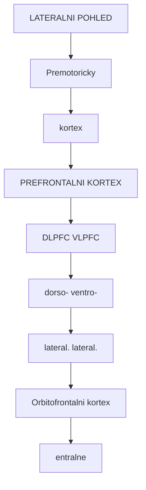

<details>
<summary>ASCII verze diagramu</summary>

```
                    LATERALNI POHLED

                         Premotoricky
                           kortex
                              |
    ┌─────────────────────────┼─────────────────┐
    │                         v                  │
    │   ┌──────────────────────────────────┐    │
    │   │                                  │    │
    │   │      PREFRONTALNI KORTEX         │    │
    │   │                                  │    │
    │   │   ┌─────────┐    ┌─────────┐    │    │
    │   │   │  DLPFC  │    │  VLPFC  │    │    │
    │   │   │(dorso-  │    │(ventro- │    │    │
    │   │   │lateral.)│    │lateral.)│    │    │
    │   │   └─────────┘    └─────────┘    │    │
    │   │                                  │    │
    │   └──────────────────────────────────┘    │
    │                                            │
    │         Orbitofrontalni kortex            │
    │              (ventralne)                   │
    └────────────────────────────────────────────┘
```

</details>

---

## Subregiony PFC

### Hlavni oblasti

| Oblast | Zkratka | Brodmann | Hlavni funkce |
|--------|---------|----------|---------------|
| **Dorsolateralni PFC** | DLPFC | 9, 46 | Pracovni pamet, planovani |
| **Ventrolateralni PFC** | VLPFC | 44, 45, 47 | Inhibice, jazyk |
| **Medialni PFC** | mPFC | 10, 11, 25, 32 | Self-reference, Default Mode |
| **Orbitofrontalni kortex** | OFC | 11, 12, 47 | Odmenove rozhodovani |
| **Anteriorni cingularni kortex** | ACC | 24, 32, 33 | Konflikt, chyby |
| **Frontopolární kortex** | FPC | 10 | Metakognice |

### Funkcni organizace

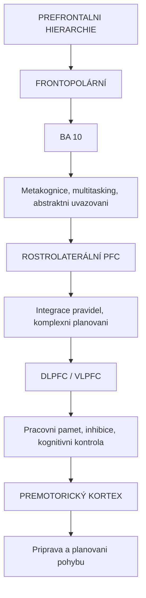

<details>
<summary>ASCII verze diagramu</summary>

```
PREFRONTALNI HIERARCHIE

┌─────────────────────────────────────────────────────┐
│                    FRONTOPOLÁRNÍ                     │
│                    (BA 10)                           │
│                                                      │
│    Metakognice, multitasking, abstraktni uvazovani  │
└────────────────────────┬────────────────────────────┘
                         ↓
┌────────────────────────┴────────────────────────────┐
│                ROSTROLATERÁLNÍ PFC                   │
│                                                      │
│         Integrace pravidel, komplexni planovani     │
└────────────────────────┬────────────────────────────┘
                         ↓
┌────────────────────────┴────────────────────────────┐
│                   DLPFC / VLPFC                      │
│                                                      │
│    Pracovni pamet, inhibice, kognitivni kontrola    │
└────────────────────────┬────────────────────────────┘
                         ↓
┌────────────────────────┴────────────────────────────┐
│               PREMOTORICKÝ KORTEX                    │
│                                                      │
│              Priprava a planovani pohybu            │
└─────────────────────────────────────────────────────┘
```

</details>

---

## Bunecna architektura

### Kortikalni vrstvy

| Vrstva | Nazev | Charakteristika | Funkce |
|--------|-------|-----------------|--------|
| **I** | Molekularni | Apikalni dendrity | Integrace vstupu |
| **II** | Vnejsi granularni | Male pyramidy | Lokalni okruhy |
| **III** | Vnejsi pyramidova | Stredni pyramidy | Kortiko-kortikalni |
| **IV** | Vnitrni granularni | Hvezdice | Thalamicky vstup |
| **V** | Vnitrni pyramidova | Velke pyramidy, **5-HT2A** | **Vystup, psychedelika** |
| **VI** | Polymorfni | Heterogenni | Zpetna projekce |

### 5-HT2A exprese v PFC

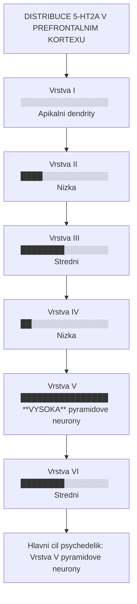

<details>
<summary>ASCII verze diagramu</summary>

```
DISTRIBUCE 5-HT2A V PREFRONTALNIM KORTEXU

Vrstva I    ░░░░░░░░░░░░░░░░  Apikalni dendrity
Vrstva II   ████░░░░░░░░░░░░  Nizka
Vrstva III  ████████░░░░░░░░  Stredni
Vrstva IV   ██░░░░░░░░░░░░░░  Nizka
Vrstva V    ████████████████  **VYSOKA** (pyramidove neurony)
Vrstva VI   ████████░░░░░░░░  Stredni

→ Hlavni cil psychedelik: Vrstva V pyramidove neurony
```

</details>

---

## Exekutivni funkce

### Pracovni pamet

**Pracovni pamet** je schopnost drzet a manipulovat informace v mysli:

| Komponenta | Oblast PFC | Funkce |
|------------|------------|--------|
| **Fonologicka smycka** | VLPFC (levy) | Verbalni material |
| **Visuospatialni nastenik** | DLPFC (pravy) | Prostorove informace |
| **Centralni exekutiva** | DLPFC, ACC | Kontrola, koordinace |
| **Epizodicky buffer** | Frontopolární | Integrace |

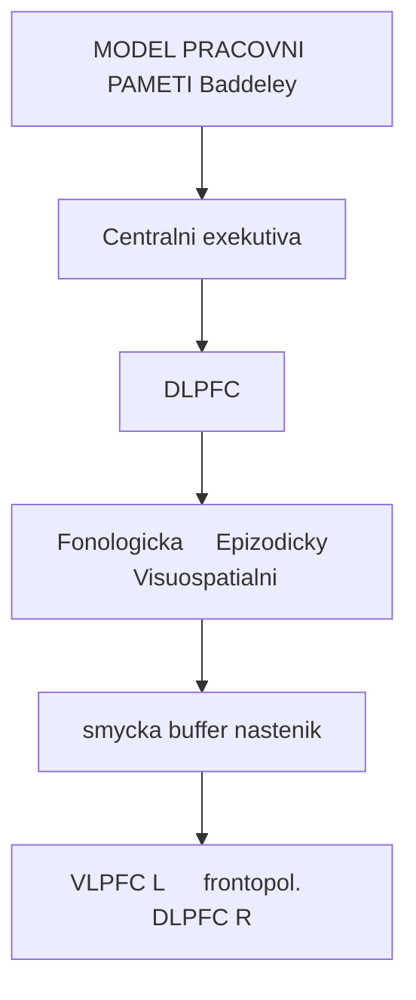

<details>
<summary>ASCII verze diagramu</summary>

```
MODEL PRACOVNI PAMETI (Baddeley)

                ┌─────────────────────┐
                │ Centralni exekutiva │
                │       (DLPFC)        │
                └─────────┬───────────┘
                          │
        ┌─────────────────┼─────────────────┐
        ↓                 ↓                 ↓
┌───────────────┐ ┌───────────────┐ ┌───────────────┐
│  Fonologicka  │ │  Epizodicky   │ │Visuospatialni │
│    smycka     │ │    buffer     │ │   nastenik    │
│   (VLPFC L)   │ │  (frontopol.) │ │   (DLPFC R)   │
└───────────────┘ └───────────────┘ └───────────────┘
```

</details>

### Kognitivni kontrola

| Funkce | Oblast | Popis |
|--------|--------|-------|
| **Inhibice odpovedi** | VLPFC, ACC | Potlaceni nevhodnych reakci |
| **Prepinani tasků** | DLPFC | Flexibilni zmena strategie |
| **Udrzeni cile** | DLPFC | Zachovani zamereni |
| **Monitorovani konfliktu** | ACC | Detekce chyb |

### Rozhodovani

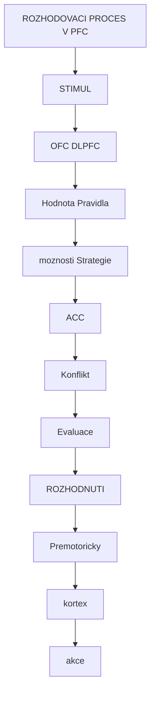

<details>
<summary>ASCII verze diagramu</summary>

```
ROZHODOVACI PROCES V PFC

                    STIMUL
                       ↓
         ┌─────────────┴─────────────┐
         ↓                           ↓
    ┌─────────────┐           ┌─────────────┐
    │     OFC     │           │    DLPFC    │
    │   Hodnota   │           │   Pravidla  │
    │   moznosti  │           │   Strategie │
    └──────┬──────┘           └──────┬──────┘
           │                         │
           └───────────┬─────────────┘
                       ↓
              ┌─────────────┐
              │     ACC     │
              │  Konflikt   │
              │  Evaluace   │
              └──────┬──────┘
                     ↓
                ROZHODNUTI
                     ↓
             ┌───────────────┐
             │ Premotoricky  │
             │    kortex     │
             │    (akce)     │
             └───────────────┘
```

</details>

---

## PFC a psychedelika

### Mechanismus ucinku

Psychedelika ([psilocybin](@/alkaloids/psilocybin.md), [LSD](@/alkaloids/lsd.md), [DMT](@/alkaloids/dmt.md)) aktivuji [5-HT2A receptory](@/receptors/5-ht2a.md) na pyramidovych neuronech vrstvy V:

| Efekt | Mechanismus | Dusledek |
|-------|-------------|----------|
| **Zvysena exitabilita** | 5-HT2A → Gq → depolarizace | Zvysena neuronalni aktivita |
| **Desynchronizace** | Naruseni alfa oscilaci | Zmena vedomí |
| **Oslabeny top-down** | Snizeny predikcni signaly | REBUS model |
| **Zvysena entropie** | Narusena hierarchie | Kreativita |

### Neurozobrazovaci nalezy

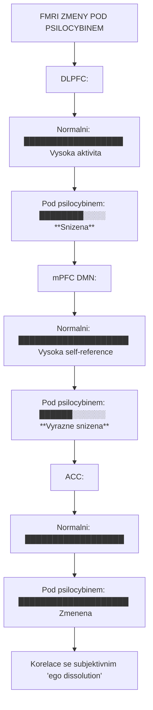

<details>
<summary>ASCII verze diagramu</summary>

```
FMRI ZMENY POD PSILOCYBINEM

DLPFC:
Normalni: ██████████████████  Vysoka aktivita
Pod psilocybinem: ████████░░░░  **Snizena**

mPFC (DMN):
Normalni: ████████████████████  Vysoka (self-reference)
Pod psilocybinem: ██████░░░░░░  **Vyrazne snizena**

ACC:
Normalni: ██████████████████
Pod psilocybinem: ████████████████████  Zmenena

→ Korelace se subjektivnim "ego dissolution"
```

</details>

### Default Mode Network

PFC je klicovou soucasti **Default Mode Network** (DMN):

| Komponenta DMN | Umisteni | Funkce |
|----------------|----------|--------|
| **mPFC** | Medialni PFC | Self-reference |
| **PCC** | Posteriorni cingularni | Mind-wandering |
| **Angular gyrus** | Parietalni | Semaaticka pamet |

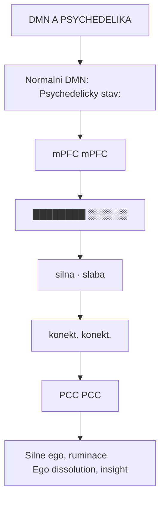

<details>
<summary>ASCII verze diagramu</summary>

```
DMN A PSYCHEDELIKA

Normalni DMN:                  Psychedelicky stav:
┌────────────────┐            ┌────────────────┐
│      mPFC      │            │      mPFC      │
│   ████████     │            │   ░░░░░░       │
│     │          │            │     ·          │
│     │ silna    │            │     · slaba    │
│     ↓ konekt.  │            │     ↓ konekt.  │
│   ████████     │            │   ░░░░░░       │
│      PCC       │            │      PCC       │
└────────────────┘            └────────────────┘

Silne ego, ruminace           Ego dissolution, insight
```

</details>

### REBUS model

**REBUS** (Relaxed Beliefs Under Psychedelics) popisuje efekt psychedelik na PFC:

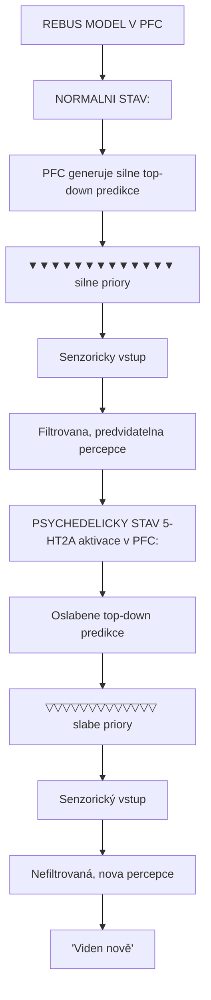

<details>
<summary>ASCII verze diagramu</summary>

```
REBUS MODEL V PFC

NORMALNI STAV:
┌──────────────────────────────────────────┐
│ PFC generuje silne top-down predikce     │
│                                          │
│     ▼▼▼▼▼▼▼▼▼▼▼▼▼ (silne priory)        │
│                ↓                         │
│         Senzoricky vstup                 │
│                ↓                         │
│     Filtrovana, predvidatelna percepce   │
└──────────────────────────────────────────┘

PSYCHEDELICKY STAV (5-HT2A aktivace v PFC):
┌──────────────────────────────────────────┐
│ Oslabene top-down predikce               │
│                                          │
│     ▽▽▽▽▽▽▽▽▽▽▽▽▽ (slabe priory)         │
│                ↓                         │
│         Senzorický vstup                 │
│                ↓                         │
│     Nefiltrovaná, nova percepce          │
│     "Viden nově"                          │
└──────────────────────────────────────────┘
```

</details>

---

## Receptorova exprese

### Serotoninove receptory

| Receptor | Exprese v PFC | Funkce |
|----------|---------------|--------|
| [**5-HT2A**](@/receptors/5-ht2a.md) | Velmi vysoka (vrstva V) | **Psychedelicky ucinek** |
| **5-HT1A** | Vysoka | Anxiolýza, modulace |
| **5-HT2C** | Stredni | Regulace nalady |
| **5-HT6** | Stredni | Kognice |

### Dalsi receptory

| Receptor | Funkce v PFC |
|----------|--------------|
| **D1** | Pracovni pamet (obracena U) |
| **D2** | Flexibilita |
| **NMDA** | Plasticita, kognice |
| **GABA-A** | Inhibice, synchronizace |
| **nAChR** | Pozornost |

### Dopaminova obracena U

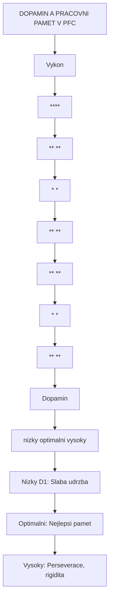

<details>
<summary>ASCII verze diagramu</summary>

```
DOPAMIN A PRACOVNI PAMET V PFC

Vykon
  ^
  │           ****
  │         **    **
  │        *        *
  │      **          **
  │    **              **
  │   *                  *
  │ **                    **
  └───────────────────────────→ Dopamin
    nizky    optimalni   vysoky

Nizky D1: Slaba udrzba
Optimalni: Nejlepsi pamet
Vysoky: Perseverace, rigidita
```

</details>

---

## Konektivita

### Hlavni aferentni spoje

| Zdroj | Funkce |
|-------|--------|
| **Thalamus (MD)** | Senzoricky relay |
| **[Hippocampus](@/brain/hippocampus.md)** | Pamet, kontext |
| **[Amygdala](@/brain/amygdala.md)** | Emoční informace |
| **VTA** | Dopaminova modulace |
| **[Raphe nuclei](@/brain/raphe-nuclei.md)** | Serotoninova modulace |
| **[Locus coeruleus](@/brain/locus-coeruleus.md)** | Noradrenalinova modulace |

### Hlavni eferentni spoje

| Cíl | Funkce |
|-----|--------|
| **Striatum** | Motoricke planovani |
| **Thalamus** | Feedback smycky |
| **Pons, mozkový kmen** | Motoricka kontrola |
| **Hipppocampus** | Pamefova konsolidace |
| **Amygdala** | Emocni regulace |

### Fronto-parietalni sif

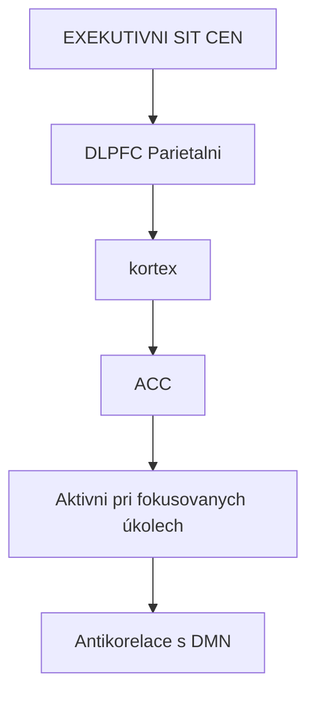

<details>
<summary>ASCII verze diagramu</summary>

```
EXEKUTIVNI SIT (CEN)

┌────────────────────────────────────────────┐
│                                            │
│      DLPFC ←───────────→ Parietalni        │
│        │                   kortex          │
│        │                     │             │
│        └──────────┬──────────┘             │
│                   │                        │
│                   ↓                        │
│              ┌─────────┐                   │
│              │   ACC   │                   │
│              └─────────┘                   │
│                                            │
│    Aktivni pri fokusovanych úkolech        │
│    Antikorelace s DMN                      │
└────────────────────────────────────────────┘
```

</details>

---

## Vyvoj PFC

### Ontogeneze

| Obdobi | Vyvojova udalost |
|--------|------------------|
| **Prenatalni** | Tvorba kortikalnich vrstev |
| **0-2 roky** | Rychla synaptogeneze |
| **3-6 let** | Peak synaptické hustoty |
| **7-12 let** | Synapticke orezavani |
| **Adolescence** | Intenzivni pruning, myelinizace |
| **20-25 let** | **Dokonceni maturace** |

**Dulezite**: PFC dozrava jako posledni cast mozku, coz vysvetluje impulsivitu a riskantni chovani adolescentu.

### Myelinizace

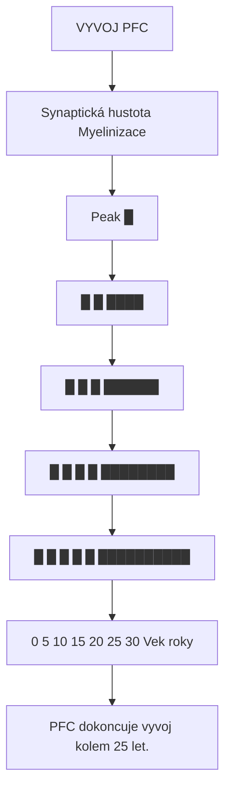

<details>
<summary>ASCII verze diagramu</summary>

```
VYVOJ PFC

     Synaptická hustota         Myelinizace
          |                          |
Peak →    █                          │
          █                          │
          █  █                       │      ████
          █  █  █                    │    ██████
          █  █  █  █                 │  ████████
          █  █  █  █  █              ██████████
          ──────────────────────────────────────
          0  5  10  15  20  25  30   Vek (roky)

PFC dokoncuje vyvoj kolem 25 let.
```

</details>

---

## Patologie PFC

### Schizofrenie

| Nalez | Popis |
|-------|-------|
| **Hypofrontalita** | Snizena aktivita DLPFC |
| **Pracovni pamet** | Deficity v udrzeni informaci |
| **Gray matter** | Redukce objemu |
| **Dopamin** | D1 hypofunkce v PFC |

### ADHD

| Nalez | Oblast | Dusledek |
|-------|--------|----------|
| **Snizeny objem** | PFC, ACC | Deficit inhibice |
| **Hypofunkce** | DLPFC | Problemy s pracovni pameti |
| **Dopamin** | Snizeny | Zlepseni pri stimulanciich |

### Deprese

| Nález | Oblast | Léčebný mechanismus |
|-------|--------|-------------------|
| **Hyperaktivita [DMN](@/circuits/dmn.md)** | mPFC | [Psilocybin](@/alkaloids/psilocybin.md) → DMN dezintegrace |
| **Snížená aktivita** | DLPFC | [Ketamin](@/alkaloids/ketamin.md) → rychlá neuroplasticita |
| **Změny konektivity** | PFC-limbický systém | Psychedelika → emoční reset |
| **Rigidní kognitivní vzorce** | DLPFC | [LSD](@/alkaloids/lsd.md) → kognitivní flexibilita |

**Terapeutické cílení PFC při [depresi](@/conditions/depression.md)**:
- [5-HT2A](@/receptors/5-ht2a.md) aktivace → neuroplasticita
- [NMDA](@/receptors/nmda.md) modulace → synaptogeneze
- DMN reset → snížená ruminace

### Frontalni demence (FTD)

| Typ | Hlavni symptomy |
|-----|-----------------|
| **Behavioralni varianta** | Disinhibice, apatie |
| **Semanticka demence** | Ztrata vyznamù slov |
| **Progresivni afazie** | Problemy s reci |

---

## Klinicky vyznam

### Neurostimulace

| Metoda | Cil | Indikace |
|--------|-----|----------|
| **TMS** | DLPFC | Deprese, OCD |
| **tDCS** | DLPFC | Kognice, deprese |
| **DBS** | Area 25 (mPFC) | Rezistentni deprese |

### Farmakologie

| Látka | Mechanismus | Účinek na PFC | Indikace |
|-------|-------------|---------------|----------|
| **Methylfenidat** | DAT inhibitor | Zlepšená pracovní paměť | ADHD |
| **Atomoxetin** | NET inhibitor | Zlepšená pozornost | ADHD |
| **Modafinil** | Komplexní | Zvýšená exekutivní funkce | Narkolepsie |
| **[Psilocybin](@/alkaloids/psilocybin.md)** | [5-HT2A](@/receptors/5-ht2a.md) | Neuroplasticita, [DMN](@/circuits/dmn.md) reset | [Deprese](@/conditions/depression.md), [závislosti](@/conditions/addiction.md) |
| **[LSD](@/alkaloids/lsd.md)** | [5-HT2A](@/receptors/5-ht2a.md) | REBUS efekt, kognitivní flexibilita | Experimentální |
| **[DMT](@/alkaloids/dmt.md)** | [5-HT2A](@/receptors/5-ht2a.md) | Intenzivní mystické zážitky | Výzkum |
| **[Ketamin](@/alkaloids/ketamin.md)** | [NMDA](@/receptors/nmda.md) blokáda | Rychlá neuroplasticita | Rezistentní [deprese](@/conditions/depression.md) |

---

## Reference

### Klicova literatura

1. Miller, E.K. & Cohen, J.D. (2001). *An integrative theory of prefrontal cortex function*. Annual Review of Neuroscience, 24, 167-202.

2. Fuster, J.M. (2015). *The Prefrontal Cortex* (5th ed.). Academic Press.

3. Carhart-Harris, R.L. & Friston, K.J. (2019). *REBUS and the anarchic brain: Toward a unified model of the brain action of psychedelics*. Pharmacological Reviews, 71(3), 316-344.

4. Arnsten, A.F.T. (2009). *Stress signalling pathways that impair prefrontal cortex structure and function*. Nature Reviews Neuroscience, 10(6), 410-422.

5. Preller, K.H. et al. (2018). *Changes in global and thalamic brain connectivity in LSD-induced altered states of consciousness*. PNAS, 115(5), 1032-1037.

### Psychedelika a PFC

6. Vollenweider, F.X. & Preller, K.H. (2020). *Psychedelic drugs: neurobiology and potential for treatment of psychiatric disorders*. Nature Reviews Neuroscience, 21(11), 611-624.

7. Carhart-Harris, R.L. et al. (2012). *Neural correlates of the psychedelic state*. PNAS, 109(6), 2138-2143.

---

## Funkcni okruhy a signalni integrace

PFC je klicovym mistem konvergence signalnich kaskad psychoaktivnich latek -- viz [Mechanismy ucinku](@/mechanisms/_index.md):

### 5-HT2A signalizace v PFC (vrstva V)

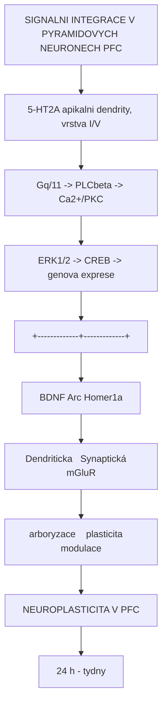

<details>
<summary>ASCII verze diagramu</summary>

```
SIGNALNI INTEGRACE V PYRAMIDOVYCH NEURONECH PFC

                  5-HT2A (apikalni dendrity, vrstva I/V)
                        |
                        v
               Gq/11 -> PLCbeta -> Ca2+/PKC
                        |
                        v
               ERK1/2 -> CREB -> genova exprese
                        |
          +-------------+-------------+
          |             |             |
          v             v             v
       BDNF          Arc          Homer1a
       |             |             |
       v             v             v
    Dendriticka   Synaptická    mGluR
    arboryzace    plasticita    modulace
          |             |             |
          +-------------+-------------+
                        |
                        v
            NEUROPLASTICITA V PFC
            (24 h - tydny)
```

</details>

### Casove okno neuroplasticity v PFC

| Cas po expozici | Proces v PFC | Klinicky korelat |
|----------------|-------------|------------------|
| **0-2 h** | Akutni 5-HT2A signalizace, Ca2+ tranzienty | Psychedelicky stav |
| **2-6 h** | IEG indukce (c-Fos, Arc, EGR1) | Doznivani ucinku |
| **6-24 h** | BDNF protein elevace | "Afterglow" |
| **1-3 dny** | Dendriticky rust, nove trny | Terapeuticke okno |
| **1-4 tydny** | Konsolidace synaptickych zmen | Trvaly ucinek |
| **1-3 mesice** | Stabilni zmeny konektivity (fMRI) | Dlouhodoby benefit |

Podrobnosti: [Signalni transdukce](@/mechanisms/signal-transduction.md) -- casovy prubeh, BDNF-TrkB, mTOR
Podrobnosti: [Receptorova kinetika](@/mechanisms/receptor-binding.md) -- 5-HT2A distribuce, receptor occupancy

### Terapeutický cíl: DMN reset přes PFC

| Terapeutický cíl | Mechanismus v PFC | Látka | Indikace | Klinický status |
|------------------|-------------------|-------|----------|-----------------|
| [DMN](@/circuits/dmn.md) dezintegrace | [5-HT2A](@/receptors/5-ht2a.md) na mPFC pyramidách | [Psilocybin](@/alkaloids/psilocybin.md) | [Deprese](@/conditions/depression.md), ruminace | FDA Breakthrough |
| Kognitivní flexibilita | Entropie PFC okruhů | [LSD](@/alkaloids/lsd.md) | OCD, [závislosti](@/conditions/addiction.md) | Experimentální |
| PFC neuroplasticita | mTOR, [BDNF](@/molecules/bdnf.md) v DLPFC | [Ketamin](@/alkaloids/ketamin.md) | Rezistentní [deprese](@/conditions/depression.md) | FDA schváleno |
| Emoční regulace | PFC-[amygdala](@/brain/amygdala.md) konektivita | [Psilocybin](@/alkaloids/psilocybin.md) | PTSD | Phase II |
| Habituální vzorce | Narušení PFC-striatum | [Psilocybin](@/alkaloids/psilocybin.md) | [Závislosti](@/conditions/addiction.md) | Promising data |
| Chronická [bolest](@/conditions/pain.md) | PFC modulace nociceptivních drah | [LSD](@/alkaloids/lsd.md), [Ketamin](@/alkaloids/ketamin.md) | Farmakoresistentní bolest | Experimentální |

Podrobnosti: [PK-PD vztahy](@/mechanisms/pharmacokinetic-pharmacodynamic.md) -- terapeuticky davkovani, receptor occupancy

---

## Viz take

### Mozkove oblasti
- [Hippocampus](@/brain/hippocampus.md) - Pamet, kontext
- [Amygdala](@/brain/amygdala.md) - Emoce, strach
- [Thalamus](@/brain/thalamus.md) - Senzoricky relay
- [Claustrum](@/brain/claustrum.md) - Integrace vedomi
- [Vizualni kortex](@/brain/visual-cortex.md) - Percepce

### Receptory
- [5-HT2A receptor](@/receptors/5-ht2a.md) - Hlavni cil psychedelik
- [NMDA receptor](@/receptors/nmda.md) - Plasticita

### Neurotransmitery
- [Serotonin](@/glossary/serotonin.md) - Modulace
- [Dopamin](@/glossary/dopamin.md) - Pracovni pamet

### Psychoaktivní látky cílící PFC
- [Psilocybin](@/alkaloids/psilocybin.md) - Nejslibnejší pro terapii deprese
- [LSD](@/alkaloids/lsd.md) - Paradigmatický REBUS efekt
- [DMT](@/alkaloids/dmt.md) - Intenzivní mystické zážitky
- [5-MeO-DMT](@/alkaloids/5-meo-dmt.md) - Silné ego dissoluce
- [Ketamin](@/alkaloids/ketamin.md) - Rychlá antidepresivní účinky
- [MDMA](@/alkaloids/mdma.md) - Emoční zpracování (částečně 5-HT2A)

### Mechanismy ucinku
- [Mechanismy ucinku](@/mechanisms/_index.md) - kompletni prehled
- [Signalni transdukce](@/mechanisms/signal-transduction.md) - Gq kaskada v PFC
- [Receptorova kinetika](@/mechanisms/receptor-binding.md) - 5-HT2A kinetika
- [PK-PD vztahy](@/mechanisms/pharmacokinetic-pharmacodynamic.md) - terapeuticke davkovani

---

<- Zpet na [Mozek](@/brain/_index.md) | [Vizualni kortex](@/brain/visual-cortex.md) ->
