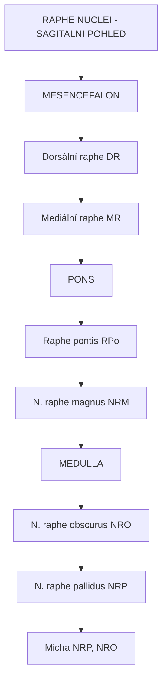
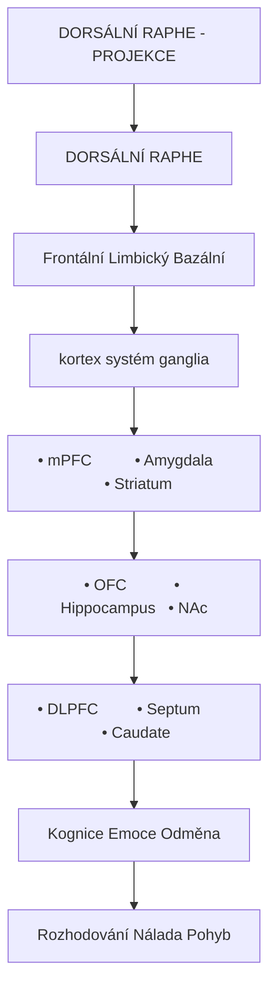
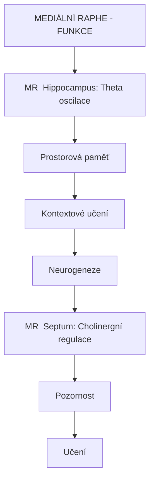
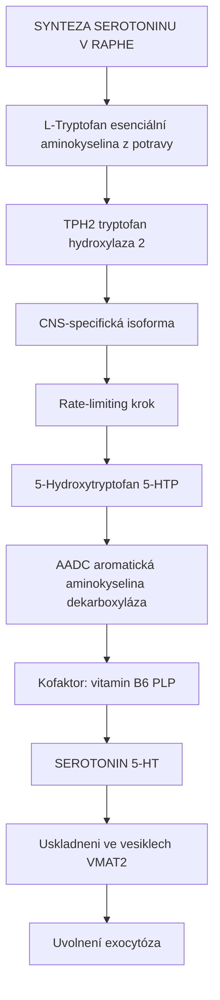
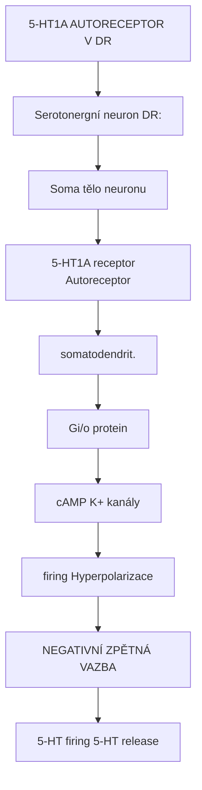
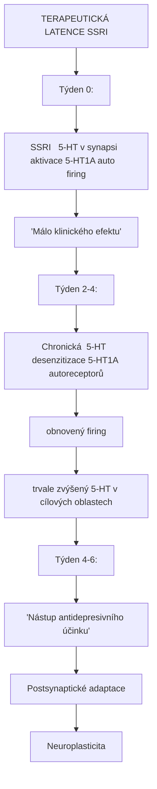
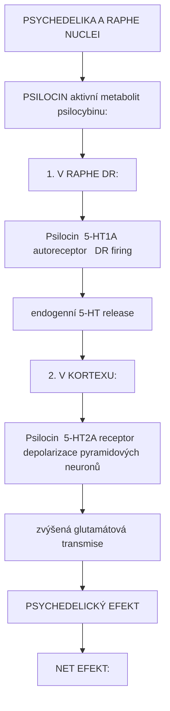
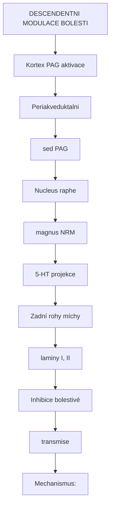

+++
title = "Raphe nuclei"
description = "Raphe nuclei - hlavni zdroj serotoninu v mozku a klicova struktura pro regulaci nalady"
weight = 7
insert_anchor_links = "right"

[taxonomies]
tags = ["raphe-nuclei", "serotonin", "mozkovy-kmen", "nalada", "mozek"]
categories = ["neuroanatomie", "neuroveda", "psychedelika"]
+++

# Raphe nuclei - Zdroj serotoninu

**Raphe nuclei** (jadra švu) je skupina jadrovych komplexu umistena ve stredni linii mozkoveho kmene. Predstavuji hlavni zdroj **serotoninu (5-HT)** v centralnim nervovem systemu. Jejich projekce zasahuji prakticky do vsech oblasti mozku a mozocdku, kde moduluji **naladu**, **spanek**, **kognici**, **bolest** a **autonomni funkce**.

Raphe nuclei jsou klicove pro pochopeni mechanismu ucinku antidepresiv i psychedelik, protoze serotoninovy system je primarnim cilem obou skupin latek.

---

## Anatomicka lokalizace

### Pozice v mozku

| Vlastnost | Hodnota |
|-----------|---------|
| **Lokalizace** | Mozkovy kmen (stredni linie) |
| **Rozsah** | Od mesencefalu po medulla |
| **Nazev** | Z latiny "raphe" = sev/šev |
| **Pocet neuronu** | ~300,000 serotoninergních (u cloveka) |

### Jednotliva jadra



<details>
<summary>ASCII verze diagramu</summary>

```
RAPHE NUCLEI - SAGITALNI POHLED

            ┌─────────────────────────────────┐
            │         MESENCEFALON            │
            │                                 │
            │    ┌───────────────────────┐   │
            │    │ Dorsální raphe (DR)    │   │
            │    │ Mediální raphe (MR)    │   │
            │    └───────────────────────┘   │
            │                                 │
            ├─────────────────────────────────┤
            │            PONS                 │
            │                                 │
            │    ┌───────────────────────┐   │
            │    │ Raphe pontis (RPo)     │   │
            │    │ N. raphe magnus (NRM)  │   │
            │    └───────────────────────┘   │
            │                                 │
            ├─────────────────────────────────┤
            │          MEDULLA                │
            │                                 │
            │    ┌───────────────────────┐   │
            │    │ N. raphe obscurus (NRO)│   │
            │    │ N. raphe pallidus (NRP)│   │
            │    └───────────────────────┘   │
            │                                 │
            └─────────────────────────────────┘
                         │
                         ↓
                    Micha (NRP, NRO)
```

</details>

### Hlavni jadra

| Jadro | Zkratka | Lokalizace | Hlavni projekce |
|-------|---------|------------|-----------------|
| **Dorsální raphe** | DR | Mesencefalon | Kortex, striatum, [amygdala](@/brain/amygdala.md) |
| **Mediální raphe** | MR | Mesencefalon | [Hippocampus](@/brain/hippocampus.md), septum |
| **Raphe magnus** | NRM | Pons | Micha (bolest) |
| **Raphe obscurus** | NRO | Medulla | Mozeček, micha |
| **Raphe pallidus** | NRP | Medulla | Micha, autonomni |
| **Raphe pontis** | RPo | Pons | Mozeček |

---

## Dorsalni raphe (DR)

### Anatomie DR

| Vlastnost | Hodnota |
|-----------|---------|
| **Neuronů** | ~165,000 u člověka |
| **5-HT neurony** | 50-70% |
| **Ostatni** | GABA, glutamát, dopamin |
| **Subregiony** | DRD, DRV, DRL, DRI, DRC |

### Projekce DR



<details>
<summary>ASCII verze diagramu</summary>

```
DORSÁLNÍ RAPHE - PROJEKCE

                    DORSÁLNÍ RAPHE
                          │
        ┌─────────────────┼─────────────────┐
        │                 │                 │
        ↓                 ↓                 ↓
┌───────────────┐ ┌───────────────┐ ┌───────────────┐
│  Frontální    │ │   Limbický    │ │  Bazální      │
│  kortex       │ │   systém      │ │  ganglia      │
│               │ │               │ │               │
│  • mPFC       │ │  • Amygdala   │ │  • Striatum   │
│  • OFC        │ │  • Hippocampus│ │  • NAc        │
│  • DLPFC      │ │  • Septum     │ │  • Caudate    │
│               │ │               │ │               │
│  Kognice      │ │  Emoce        │ │  Odměna       │
│  Rozhodování  │ │  Nálada       │ │  Pohyb        │
└───────────────┘ └───────────────┘ └───────────────┘
```

</details>

### Subregiony DR

| Subregion | Projekce | Funkce |
|-----------|----------|--------|
| **DRD** (dorzální) | Kortex | Kognice |
| **DRV** (ventrální) | Amygdala, striatum | Emoce, odměna |
| **DRL** (laterální) | Hypothalamus | Autonomní |
| **DRI** (interfascikulární) | PAG | Bolest, obrana |
| **DRC** (kaudální) | Mozeček | Motorika |

---

## Medialni raphe (MR)

### Anatomie MR

| Vlastnost | Hodnota |
|-----------|---------|
| **Neuronů** | ~30,000-50,000 |
| **5-HT neurony** | ~20% |
| **Ostatni** | Glutamát (významny podil) |

### Projekce MR

| Cíl | Funkce |
|-----|--------|
| **[Hippocampus](@/brain/hippocampus.md)** | Pamet, theta rytmus |
| **Mediální septum** | Cholinergní modulace |
| **Interpeduncular nucleus** | Habénulární okruhy |
| **Entorhinal cortex** | Prostorová navigace |



<details>
<summary>ASCII verze diagramu</summary>

```
MEDIÁLNÍ RAPHE - FUNKCE

MR → Hippocampus: Theta oscilace
     │
     └─→ Prostorová paměť
         Kontextové učení
         Neurogeneze

MR → Septum: Cholinergní regulace
     │
     └─→ Pozornost
         Učení
```

</details>

---

## Serotoninova synteza

### Biosynteticka draha



<details>
<summary>ASCII verze diagramu</summary>

```
SYNTEZA SEROTONINU V RAPHE

L-Tryptofan (esenciální aminokyselina z potravy)
      │
      │ TPH2 (tryptofan hydroxylaza 2)
      │ CNS-specifická isoforma
      │ Rate-limiting krok
      ↓
5-Hydroxytryptofan (5-HTP)
      │
      │ AADC (aromatická aminokyselina dekarboxyláza)
      │ Kofaktor: vitamin B6 (PLP)
      ↓
SEROTONIN (5-HT)
      │
      └─→ Uskladneni ve vesiklech (VMAT2)
          │
          └─→ Uvolnení (exocytóza)
```

</details>

### Klicove enzymy

| Enzym | Gen | Funkce | Regulace |
|-------|-----|--------|----------|
| **TPH2** | TPH2 | Hydroxylace tryptofanu | Stress, cirkadianni |
| **AADC** | DDC | Dekarboxylace | Konstitutivní |
| **VMAT2** | SLC18A2 | Vesikulární transport | DA, 5-HT, NE |
| **MAO-A** | MAOA | Degradace 5-HT | Genetické varianty |

---

## Autoreceptorova regulace

### 5-HT1A autoreceptory

Klicovy mechanismus regulace aktivity raphe neuronu:



<details>
<summary>ASCII verze diagramu</summary>

```
5-HT1A AUTORECEPTOR V DR

Serotonergní neuron (DR):
┌─────────────────────────────────────────────────┐
│                                                 │
│   Soma (tělo neuronu)                          │
│       │                                         │
│       │ ┌─────────────────┐                    │
│       └─┤ 5-HT1A receptor │ ← Autoreceptor     │
│         │ (somatodendrit.)│                    │
│         └────────┬────────┘                    │
│                  │                              │
│                  ↓                              │
│         Gi/o protein                            │
│                  │                              │
│         ┌───────┴───────┐                      │
│         ↓               ↓                      │
│    ↓ cAMP          ↑ K+ kanály                │
│         │               │                      │
│         ↓               ↓                      │
│    ↓ firing       Hyperpolarizace             │
│                                                 │
│   NEGATIVNÍ ZPĚTNÁ VAZBA                       │
│   (↑ 5-HT → ↓ firing → ↓ 5-HT release)        │
└─────────────────────────────────────────────────┘
```

</details>

### Autoreceptory na terminalech

| Receptor | Lokalizace | Funkce |
|----------|------------|--------|
| **5-HT1A** | Soma, dendrity (raphe) | Inhibice firing |
| **5-HT1B** | Axonove terminály | Inhibice release |
| **5-HT1D** | Axony | Modulace |

### Desenzitizace pri SSRI lecbe



<details>
<summary>ASCII verze diagramu</summary>

```
TERAPEUTICKÁ LATENCE SSRI

Týden 0:
SSRI → ↑ 5-HT v synapsi → aktivace 5-HT1A auto → ↓ firing
       "Málo klinického efektu"

Týden 2-4:
Chronická ↑ 5-HT → desenzitizace 5-HT1A autoreceptorů
                  → obnovený firing
                  → trvale zvýšený 5-HT v cílových oblastech

Týden 4-6:
       "Nástup antidepresivního účinku"
       Postsynaptické adaptace
       Neuroplasticita
```

</details>

---

## Raphe a psychedelika

### Efekty psychedelik na raphe

Psychedelika ([psilocybin](@/alkaloids/psilocybin.md), [LSD](@/alkaloids/lsd.md), [DMT](@/alkaloids/dmt.md)) ovlivnuji raphe nuclei:

| Efekt | Mechanismus | Dusledek |
|-------|-------------|----------|
| **Snizeny firing DR** | 5-HT1A aktivace | Mene endogenního 5-HT |
| **Postsynaptický 5-HT2A** | Primární psychedelický účinek | Halucinace |
| **Zmena konektivity** | Modulace DR-kortex | Zmenene vedomi |

### Mechanismus



<details>
<summary>ASCII verze diagramu</summary>

```
PSYCHEDELIKA A RAPHE NUCLEI

PSILOCIN (aktivní metabolit psilocybinu):

1. V RAPHE (DR):
   Psilocin → 5-HT1A autoreceptor → ↓ DR firing
                                    ↓ endogenní 5-HT release

2. V KORTEXU:
   Psilocin → 5-HT2A receptor → depolarizace pyramidových neuronů
                              → zvýšená glutamátová transmise
                              → PSYCHEDELICKÝ EFEKT

NET EFEKT:
- Snížené endogenní 5-HT (z raphe)
- Přímá postsynaptická 5-HT2A aktivace (psychedelikem)
- = "přepsání" normální serotoninergní signalizace
```

</details>

### Studie mikrodialyzy

| Studie | Nalez |
|--------|-------|
| Aghajanian (1972) | LSD snizuje DR firing |
| Sprouse & Aghajanian (1987) | 5-HT1A mediuje inhibici |
| Celada (2008) | Psilocybin snizuje 5-HT release |

---

## Funkcni systemy

### Raphe a spanek

| Stav | DR aktivita | Funkce |
|------|-------------|--------|
| **Bdelost** | Vysoka | Arousal, pozornost |
| **NREM** | Snizena | Umoznuje spanek |
| **REM** | Temer nulova | REM atonie |

```mermaid
flowchart TD
    node_RAPHEASPANEK["RAPHE A SPANEK"]
    node_DRaktivita["DR aktivita"]
    node_Bdelost["Bdelost █████████████████████████"]
    node_NREM["NREM ████████████"]
    node_REM["REM ██"]
    node_as["Čas"]
    node_Serotoninergnineuron["Serotoninergni neurony 'vypinaji' behem REM spanku."]

    node_RAPHEASPANEK --> node_DRaktivita
    node_DRaktivita --> node_Bdelost
    node_Bdelost --> node_NREM
    node_NREM --> node_REM
    node_REM --> node_as
    node_as --> node_Serotoninergnineuron

    click node_Serotoninergnineuron "/glossary/serotonin/" "Serotoninergni neurony "vypinaji" behem REM spanku."
```

<details>
<summary>ASCII verze diagramu</summary>

```
RAPHE A SPANEK

       DR aktivita
            ^
            │
Bdelost ────┤█████████████████████████
            │
NREM ───────┤████████████
            │
REM ────────┤██
            │
            └───────────────────────────→ Čas

Serotoninergni neurony "vypinaji" behem REM spanku.
```

</details>

### Raphe a bolest

**Nucleus raphe magnus (NRM)** moduluje bolest:



<details>
<summary>ASCII verze diagramu</summary>

```
DESCENDENTNI MODULACE BOLESTI

         Kortex (PAG aktivace)
              │
              ↓
    ┌─────────────────────┐
    │ Periakveduktalni    │
    │ sed (PAG)           │
    └──────────┬──────────┘
               │
               ↓
    ┌─────────────────────┐
    │ Nucleus raphe       │
    │ magnus (NRM)        │
    └──────────┬──────────┘
               │
               │ 5-HT projekce
               ↓
    ┌─────────────────────┐
    │ Zadní rohy míchy    │
    │ (laminy I, II)      │
    │                     │
    │ Inhibice bolestivé  │
    │ transmise           │
    └─────────────────────┘

Mechanismus:
- 5-HT aktivuje inhibicni interneurony
- Snižuje nocicepční transmisi
- Základ opioidní analgezie
```

</details>

### Raphe a nalada

| Oblast cile | Funkce | Patologie pri dysfunkci |
|-------------|--------|------------------------|
| **mPFC** | Kognitivni hodnoceni | Negativni bias |
| **Amygdala** | Emocni reakce | Hyperreaktivita |
| **Hippocampus** | Emocni pamet | Ruminace |
| **Striatum** | Odmena | Anhedonie |

---

## Receptorova exprese v raphe

### 5-HT receptory

| Receptor | Exprese v DR | Funkce |
|----------|--------------|--------|
| **5-HT1A** | Velmi vysoka | Autoreceptor, inhibice |
| **5-HT1B** | Stredni | Presynaptická modulace |
| **5-HT2A** | Nizka | GABAergni interneurony |
| **5-HT2C** | Stredni | Heteroreceptor |

### Dalsi receptory

| Receptor | Funkce v raphe |
|----------|----------------|
| **GABA-A** | Inhibice z interneuronu |
| **Glutamat (NMDA)** | Excitace |
| **Alfa-1 adrenergni** | NE modulace z LC |
| **Orexin** | Arousal signaly |
| **CRF** | Stresova odpoved |

---

## Konektivita

### Aferentni spoje

| Zdroj | Neurotransmiter | Efekt |
|-------|-----------------|-------|
| **[Prefrontální kortex](@/brain/prefrontal-cortex.md)** | Glutamát | Excitace |
| **[Locus coeruleus](@/brain/locus-coeruleus.md)** | Noradrenalin | Modulace |
| **Hypothalamus (LH)** | Orexin | Arousal |
| **Habénula** | Glutamát | Inhibice |
| **PAG** | Různé | Bolest, obrana |

### Eferentni spoje

| Cil | Funkce |
|-----|--------|
| **Kortex (vsechny oblasti)** | Kognice, percepce |
| **Limbicky system** | Emoce, pamet |
| **Bazalni ganglia** | Motorika, odmena |
| **Hypothalamus** | Autonomni funkce |
| **Mozeček** | Motoricka koordinace |
| **Micha** | Bolest, autonomni |

---

## Patologie raphe nuclei

### Deprese

| Nalez | Interpretace |
|-------|--------------|
| **Snizena 5-HT transmise** | Hypoteza deficitu |
| **TPH2 polymorfismy** | Geneticke riziko |
| **Zmeneny DR objem** | Post-mortem studie |

### Suicidalita

| Nalez | Oblast |
|-------|--------|
| **Zvysena 5-HT1A vazba** | Upregulace |
| **Snizena TPH** | Snizena synteza |
| **MAO-A polymorfismy** | Rychlejsi degradace |

### Uzkostne poruchy

| Porucha | Raphe dysfunkce |
|---------|-----------------|
| **Panicka porucha** | Hyperaktivita DR |
| **GAD** | Dysregulace DR-amygdala |
| **PTSD** | Zmeny 5-HT1A |

---

## Farmakologie

### Antidepresiva cilici na raphe

| Latka | Mechanismus | Efekt na raphe |
|-------|-------------|----------------|
| **SSRI** | SERT inhibice | Zvyseny 5-HT → 5-HT1A desenzitizace |
| **Buspiron** | 5-HT1A parcialni agonista | Akutne ↓ firing, chronicke adaptace |
| **Vilazodone** | SSRI + 5-HT1A | Rychlejsi efekt |
| **Vortioxetin** | Multimodalni | Komplexni |

### Psychedelika

| Latka | Efekt na DR |
|-------|-------------|
| **[LSD](@/alkaloids/lsd.md)** | Snizeny firing via 5-HT1A |
| **[Psilocybin](@/alkaloids/psilocybin.md)** | Snizeny firing |
| **[DMT](@/alkaloids/dmt.md)** | Kratka inhibice |

---

## Reference

### Klicova literatura

1. Jacobs, B.L. & Azmitia, E.C. (1992). *Structure and function of the brain serotonin system*. Physiological Reviews, 72(1), 165-229.

2. Celada, P., Puig, M.V. & Artigas, F. (2013). *Serotonin modulation of cortical neurons and networks*. Frontiers in Integrative Neuroscience, 7, 25.

3. Aghajanian, G.K. & Marek, G.J. (1999). *Serotonin and hallucinogens*. Neuropsychopharmacology, 21(2 Suppl), 16S-23S.

4. Lowry, C.A. et al. (2008). *Serotonergic systems, anxiety, and affective disorder: Focus on the dorsomedial part of the dorsal raphe nucleus*. Annals of the New York Academy of Sciences, 1148, 86-94.

5. Hale, M.W. & Lowry, C.A. (2011). *Functional topography of midbrain and pontine serotonergic systems*. Journal of Chemical Neuroanatomy, 41(4), 182-195.

### Psychedelika a raphe

6. Aghajanian, G.K. (1972). *LSD and CNS transmission*. Annual Review of Pharmacology, 12(1), 157-168.

7. Celada, P. et al. (2008). *The serotonin 5-HT2A receptor as a target for the treatment of schizophrenia*. CNS Drugs, 22, 761-791.

---

## Viz take

### Mozkové oblasti
- [Prefrontalni kortex](@/brain/prefrontal-cortex.md) - DR projekce
- [Hippocampus](@/brain/hippocampus.md) - MR projekce
- [Amygdala](@/brain/amygdala.md) - Emocni modulace
- [Locus coeruleus](@/brain/locus-coeruleus.md) - Vzajemna regulace

### Receptory
- [5-HT2A receptor](@/receptors/5-ht2a.md) - Psychedelicky cil
- [5-HT1A receptor](@/receptors/5-ht1a.md) - Autoreceptor

### Neurotransmitery
- [Serotonin](@/glossary/serotonin.md) - Hlavni produkt raphe
- [GABA](@/glossary/gaba.md) - Interneurony

### Psychoaktivní látky
- [Psilocybin](@/alkaloids/psilocybin.md) - Snizuje DR firing
- [LSD](@/alkaloids/lsd.md) - 5-HT1A aktivace
- [DMT](@/alkaloids/dmt.md) - Endogenni serotoninovy analog

---

<- Zpet na [Mozek](@/brain/_index.md) | [Locus coeruleus](@/brain/locus-coeruleus.md) ->
