+++
title = "Thalamus"
description = "Thalamus - centrální relay stanice mozku, GABAergní modulace, role v anestezii a účinky muscimolu"
weight = 6
insert_anchor_links = "right"

[taxonomies]
tags = ["thalamus", "senzorický-relay", "vědomí", "gate-theory", "GABA-A", "muscimol", "anestezie", "TRN"]
categories = ["neuroanatomie", "neurověda", "GABAergní-systém"]
+++

# Thalamus - Brána vědomí a GABAergní kontrola

**Thalamus** (z řeckého "thalamos" - komora) je párová struktura mezimozku, která slouží jako hlavní **relay stanice** pro senzorické informace směřující do kortexu.
Jeho klíčová role v **regulaci vědomí**, **pozornosti**, **spánku** a **kortikální synchronizaci** činí thalamus primárním cílem GABAergních látek včetně **muscimolu**, anestetik a sedativ.

Thalamické retikulární jádro (TRN) představuje **exkluzivně GABAergní strukturu**, která funguje jako "brána vědomí" a je místem účinku mnoha psychoaktivních látek ovlivňujících stav bdělosti.

---

## Anatomická lokalizace

### Pozice v mozku

| Vlastnost | Hodnota |
|-----------|---------|
| **Lokalizace** | Diencephalon (mezimozek) |
| **Pozice** | Oboustranně od III. komory |
| **Strana** | Párový, spojen interthalamickou adhezí |
| **Rozměry** | 3.0 cm (délka), 1.5 cm (šířka) |
| **Objem** | ~6 cm³ (každá strana) |
| **Počet neuronů** | ~10-15 milionů na stranu |
| **Počet jader** | 50-60 distinktních jader |

### Anatomické vztahy

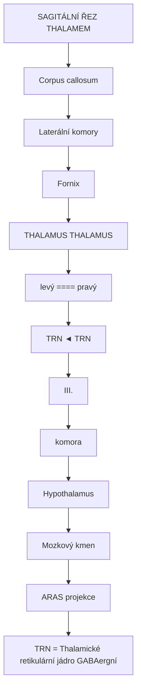

<details>
<summary>ASCII verze diagramu</summary>

```
                    SAGITÁLNÍ ŘEZ THALAMEM

        ┌────────────────────────────────────────────┐
        │            Corpus callosum                  │
        │                                             │
        │    ┌─────────────────────────────────┐     │
        │    │       Laterální komory          │     │
        │    └───────────────┬─────────────────┘     │
        │                    │                        │
        │         ┌──────────┴──────────┐            │
        │         │   Fornix            │            │
        │    ┌────┴──────┐    ┌────────┴───┐        │
        │    │  THALAMUS │    │  THALAMUS  │        │
        │    │   (levý)  │====│  (pravý)   │        │
        │    │           │    │            │        │
        │    │  ┌─────┐  │    │  ┌─────┐   │        │
        │    │  │ TRN │◄─┼────┼──┤ TRN │   │        │
        │    │  └─────┘  │    │  └─────┘   │        │
        │    └────┬──────┘    └────┬───────┘        │
        │         │    III.        │                 │
        │         │   komora       │                 │
        │         └───────┬────────┘                 │
        │                 │                          │
        │          Hypothalamus                      │
        │                 │                          │
        │           Mozkový kmen                     │
        │          (ARAS projekce)                   │
        └────────────────────────────────────────────┘

        TRN = Thalamické retikulární jádro (GABAergní)
        ==== = Interthalamická adheze
```

</details>

### Cévní zásobení

| Artérie | Zásobovaná oblast | Klinický syndrom při okluzi |
|---------|-------------------|----------------------------|
| **Tuberothalamická** | AN, část MD | Amnézie, apatie |
| **Paramediánní** | MD, IL jádra | Somnolence, koma |
| **Inferolaterální** | VPL, VPM, VL | Senzorický deficit |
| **Posteriorní choroidální** | Pulvinar, LGN | Vizuální deficity |

---

## Organizace thalamických jader

### Hlavní jádrové skupiny

| Skupina | Jádra | Hlavní funkce | GABA-A exprese |
|---------|-------|---------------|----------------|
| **Anteriorní** | AN, AV, AM | Emoční paměť, Papezův okruh | Střední |
| **Mediální** | MD | Exekutivní funkce, PFC | Vysoká |
| **Laterální dorzální** | LD, LP | Parietální asociace | Střední |
| **Ventrolaterální** | VA, VL | Motorická kontrola | Vysoká |
| **Ventrobazální** | VPL, VPM | Somatosenzorický relay | Střední |
| **Posteriorní** | Pulvinar, LGN, MGN | Vizuální, sluchový relay | Variabilní |
| **Intralaminární** | CM, Pf, CL | Arousal, vědomí | Velmi vysoká |
| **Retikulární (TRN)** | TRN | Inhibice, gate | 100% GABAergní |
| **Střední linie** | Pv, Pt, Re | Limbická integrace | Vysoká |

### Detailní organizace jader

```mermaid
flowchart TD
    node_THALAMICKJDRAHORIZON["THALAMICKÁ JÁDRA - HORIZONTÁLNÍ ŘEZ"]
    node_ANTERIORN["ANTERIORNÍ"]
    node_ANTERIORNSKUPINA["ANTERIORNÍ SKUPINA"]
    node_ANAVAM["AN     AV     AM"]
    node_MEDILNSKUPINA["MEDIÁLNÍ SKUPINA"]
    node_MD["MD"]
    node_magnoparvo["magno+parvo"]
    node_LATERLNSKUPINA["LATERÁLNÍ SKUPINA"]
    node_LDLPVA["LD     LP     VA"]
    node_VL["VL"]
    node_VLaVLpVLc["VLa, VLp, VLc"]
    node_VENTROBAZLNKOMPLEX["VENTROBAZÁLNÍ KOMPLEX"]
    node_VPLVPM["VPL         VPM"]
    node_tlotv["tělo      tvář"]
    node_POSTERIORNSKUPINA["POSTERIORNÍ SKUPINA"]
    node_LGNMGN["LGN           MGN"]
    node_Pulvinar["Pulvinar"]
    node_PmPlPi["Pm,Pl,Pi"]
    node_INTRALAMINRNJDRAIL["INTRALAMINÁRNÍ JÁDRA IL"]
    node_CLPCCMPf["CL   PC   CM   Pf"]
    node_KLOVPROVDOM["KLÍČOVÉ PRO VĚDOMÍ"]
    node_POSTERIORN["POSTERIORNÍ"]
    node_TRNretikulrnobalujez["TRN retikulární - obaluje zvenčí"]
    node_100GABAergnshell["100% GABAergní 'shell'"]

    node_THALAMICKJDRAHORIZON --> node_ANTERIORN
    node_ANTERIORN --> node_ANTERIORNSKUPINA
    node_ANTERIORNSKUPINA --> node_ANAVAM
    node_ANAVAM --> node_MEDILNSKUPINA
    node_MEDILNSKUPINA --> node_MD
    node_MD --> node_magnoparvo
    node_magnoparvo --> node_LATERLNSKUPINA
    node_LATERLNSKUPINA --> node_LDLPVA
    node_LDLPVA --> node_VL
    node_VL --> node_VLaVLpVLc
    node_VLaVLpVLc --> node_VENTROBAZLNKOMPLEX
    node_VENTROBAZLNKOMPLEX --> node_VPLVPM
    node_VPLVPM --> node_tlotv
    node_tlotv --> node_POSTERIORNSKUPINA
    node_POSTERIORNSKUPINA --> node_LGNMGN
    node_LGNMGN --> node_Pulvinar
    node_Pulvinar --> node_PmPlPi
    node_PmPlPi --> node_INTRALAMINRNJDRAIL
    node_INTRALAMINRNJDRAIL --> node_CLPCCMPf
    node_CLPCCMPf --> node_KLOVPROVDOM
    node_KLOVPROVDOM --> node_POSTERIORN
    node_POSTERIORN --> node_TRNretikulrnobalujez
    node_TRNretikulrnobalujez --> node_100GABAergnshell

    click node_100GABAergnshell "/glossary/gaba/" "100% GABAergní "shell""
```

<details>
<summary>ASCII verze diagramu</summary>

```
THALAMICKÁ JÁDRA - HORIZONTÁLNÍ ŘEZ

                    ANTERIORNÍ
                        │
      ┌─────────────────┴─────────────────┐
      │                                    │
      │  ┌───────────────────────────────┐│
      │  │      ANTERIORNÍ SKUPINA       ││
      │  │  ┌─────┐  ┌─────┐  ┌─────┐   ││
      │  │  │ AN  │  │ AV  │  │ AM  │   ││
      │  │  └─────┘  └─────┘  └─────┘   ││
      │  └───────────────────────────────┘│
      │                                    │
      │  ┌───────────────────────────────┐│
      │  │      MEDIÁLNÍ SKUPINA         ││
      │  │         ┌───────────┐         ││
      │  │         │    MD     │         ││
      │  │         │(magno+parvo)        ││
      │  │         └───────────┘         ││
      │  └───────────────────────────────┘│
      │                                    │
      │  ┌───────────────────────────────┐│
      │  │     LATERÁLNÍ SKUPINA         ││
      │  │  ┌─────┐  ┌─────┐  ┌─────┐   ││
      │  │  │ LD  │  │ LP  │  │ VA  │   ││
      │  │  └─────┘  └─────┘  └─────┘   ││
      │  │                               ││
      │  │  ┌─────────────────────────┐  ││
      │  │  │         VL              │  ││
      │  │  │  (VLa, VLp, VLc)       │  ││
      │  │  └─────────────────────────┘  ││
      │  └───────────────────────────────┘│
      │                                    │
      │  ┌───────────────────────────────┐│
      │  │    VENTROBAZÁLNÍ KOMPLEX      ││
      │  │  ┌───────────┐ ┌───────────┐  ││
      │  │  │   VPL     │ │   VPM     │  ││
      │  │  │(tělo)     │ │(tvář)     │  ││
      │  │  └───────────┘ └───────────┘  ││
      │  └───────────────────────────────┘│
      │                                    │
      │  ┌───────────────────────────────┐│
      │  │     POSTERIORNÍ SKUPINA       ││
      │  │  ┌─────┐         ┌─────┐     ││
      │  │  │ LGN │         │ MGN │     ││
      │  │  └─────┘         └─────┘     ││
      │  │         ┌───────────┐         ││
      │  │         │ Pulvinar  │         ││
      │  │         │(Pm,Pl,Pi) │         ││
      │  │         └───────────┘         ││
      │  └───────────────────────────────┘│
      │                                    │
      │  ╔═══════════════════════════════╗│
      │  ║   INTRALAMINÁRNÍ JÁDRA (IL)   ║│
      │  ║  ┌────┐ ┌────┐ ┌────┐ ┌────┐ ║│
      │  ║  │ CL │ │ PC │ │ CM │ │ Pf │ ║│
      │  ║  └────┘ └────┘ └────┘ └────┘ ║│
      │  ║     KLÍČOVÉ PRO VĚDOMÍ        ║│
      │  ╚═══════════════════════════════╝│
      │                                    │
      └────────────────────────────────────┘
                   POSTERIORNÍ

     ╔══════════════════════════════════════╗
     ║  TRN (retikulární) - obaluje zvenčí  ║
     ║  100% GABAergní "shell"              ║
     ╚══════════════════════════════════════╝
```

</details>

### Funkční klasifikace jader

| Typ jádra | Příklad | Projekce | Funkce | GABAergní modulace |
|-----------|---------|----------|--------|-------------------|
| **Specifické senzorické** | VPL, LGN, MGN | Primární senz. kortex | Přesný relay | TRN inhibice |
| **Specifické motorické** | VA, VL | Motorický kortex | BG/CB výstup | Striatální vstup |
| **Asociační** | MD, Pulvinar | Asociační kortex | Vyšší kognice | Kortikální feedback |
| **Nespecifické/IL** | CM, Pf, CL | Difuzní kortikální | Arousal, vědomí | Primární cíl anestetik |
| **Limbické** | AN, LD | Limbický kortex | Emoce, paměť | Amygdala vstup |

---

## Thalamické retikulární jádro (TRN)

### Anatomie TRN

Thalamické retikulární jádro je **jediná exkluzivně GABAergní struktura** thalamu a klíčový regulátor thalamokortikální komunikace.

| Vlastnost | Hodnota |
|-----------|---------|
| **Pozice** | Tenký plášť obalující laterální thalamus |
| **Tloušťka** | ~1 mm |
| **Délka** | Celý rostrokaudální extent thalamu |
| **Neurotransmiter** | 100% GABA |
| **Počet neuronů** | ~1 milion na stranu |
| **Ko-transmiter** | Parvalbumin (PV+) |

### Architektura TRN

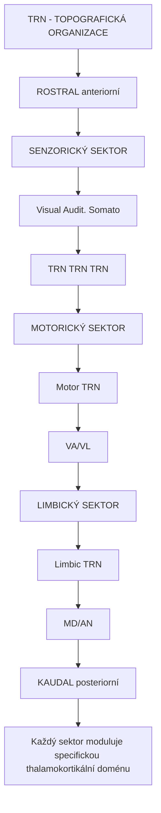

<details>
<summary>ASCII verze diagramu</summary>

```
TRN - TOPOGRAFICKÁ ORGANIZACE

                    ROSTRAL (anteriorní)
                           │
     ┌─────────────────────┴─────────────────────┐
     │                                            │
     │  ╔════════════════════════════════════╗   │
     │  ║         SENZORICKÝ SEKTOR          ║   │
     │  ║  ┌──────┐  ┌──────┐  ┌──────┐     ║   │
     │  ║  │Visual│  │Audit.│  │Somato│     ║   │
     │  ║  │ TRN  │  │ TRN  │  │ TRN  │     ║   │
     │  ║  └──────┘  └──────┘  └──────┘     ║   │
     │  ╚════════════════════════════════════╝   │
     │                                            │
     │  ╔════════════════════════════════════╗   │
     │  ║         MOTORICKÝ SEKTOR           ║   │
     │  ║         ┌──────────────┐           ║   │
     │  ║         │  Motor TRN   │           ║   │
     │  ║         │   (VA/VL)    │           ║   │
     │  ║         └──────────────┘           ║   │
     │  ╚════════════════════════════════════╝   │
     │                                            │
     │  ╔════════════════════════════════════╗   │
     │  ║        LIMBICKÝ SEKTOR             ║   │
     │  ║         ┌──────────────┐           ║   │
     │  ║         │ Limbic TRN   │           ║   │
     │  ║         │   (MD/AN)    │           ║   │
     │  ║         └──────────────┘           ║   │
     │  ╚════════════════════════════════════╝   │
     │                                            │
     └─────────────────────────────────────────────┘
                    KAUDAL (posteriorní)

Každý sektor moduluje specifickou thalamokortikální doménu
```

</details>

### TRN konektivita

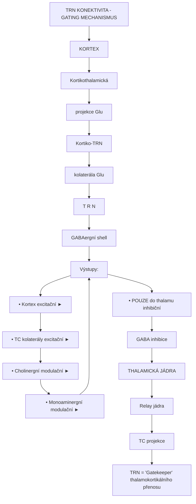

<details>
<summary>ASCII verze diagramu</summary>

```
TRN KONEKTIVITA - GATING MECHANISMUS

                    KORTEX
                      │
          ┌───────────┴───────────┐
          │                       │
          ▼                       │
    Kortikothalamická             │
      projekce (Glu)              │
          │                       │
          │    ┌──────────────────┘
          │    │ Kortiko-TRN
          │    │ kolaterála (Glu)
          │    │
          │    ▼
     ┌────┴────────────────────────────┐
     │            T R N                 │
     │      (GABAergní shell)          │
     │                                  │
     │  Vstupy:                        │
     │  • Kortex (excitační) ──────►   │
     │  • TC kolaterály (excitační) ►  │
     │  • Cholinergní (modulační) ──►  │
     │  • Monoaminergní (modulační) ►  │
     │                                  │
     │  Výstupy:                       │
     │  • POUZE do thalamu (inhibiční) │
     │                                  │
     └────────────────┬────────────────┘
                      │
              GABA inhibice
                      │
                      ▼
     ┌────────────────────────────────┐
     │      THALAMICKÁ JÁDRA          │
     │                                 │
     │   Relay jádra                  │
     │      │                         │
     │      │ (TC projekce)           │
     │      │                         │
     │      ▼                         │
     │   KORTEX                       │
     └────────────────────────────────┘

TRN = "Gatekeeper" thalamokortikálního přenosu
- Rozhoduje, které informace projdou
- Modulován pozorností a arousal systémy
- PRIMÁRNÍ CÍL GABAergních anestetik
```

</details>

### GABA-A receptory v TRN

| Podjednotka | Exprese v TRN | Funkční role |
|-------------|---------------|--------------|
| **α1** | Velmi vysoká | Rychlá inhibice, sedace |
| **α3** | Vysoká | Thalamická oscilace |
| **β2** | Vysoká | Základní funkce receptoru |
| **β3** | Střední | Anestetická citlivost |
| **γ2** | Vysoká | Benzodiazepinová vazba |
| **δ** | Nízká (extrasynaptické) | Tonická inhibice |

---

## GABA-A distribuce v thalamických jádrech

### Kvantitativní exprese

```mermaid
flowchart TD
    node_GABAARECEPTORHUSTOTA["GABA-A RECEPTOR HUSTOTA V THALAMU"]
    node_JdroRelativnhustotaF["Jádro           Relativní hustota  Funkční význam"]
    node_TRNNejvygate["TRN             █████████████████  Nejvyšší - gate"]
    node_100["100%"]
    node_CMPfILVelmivysokarou["CM/Pf IL      ████████████████   Velmi vysoká - arousal"]
    node_90["90%"]
    node_MDVysokPFCrelay["MD              ██████████████     Vysoká - PFC relay"]
    node_80["80%"]
    node_VLVAVysokmotorick["VL/VA           █████████████      Vysoká - motorický"]
    node_75["75%"]
    node_ANStednvysok["AN              ████████████       Střední-vysoká"]
    node_70["70%"]
    node_VPLVPMStednsenzorick["VPL/VPM         ██████████         Střední - senzorický"]
    node_60["60%"]
    node_LGNStednvizuln["LGN             ████████           Střední - vizuální"]
    node_50["50%"]
    node_MGNStednnzk["MGN             ███████            Střední-nízká"]
    node_45["45%"]
    node_PulvinarNzkstedn["Pulvinar        ██████             Nízká-střední"]
    node_40["40%"]

    node_GABAARECEPTORHUSTOTA --> node_JdroRelativnhustotaF
    node_JdroRelativnhustotaF --> node_TRNNejvygate
    node_TRNNejvygate --> node_100
    node_100 --> node_CMPfILVelmivysokarou
    node_CMPfILVelmivysokarou --> node_90
    node_90 --> node_MDVysokPFCrelay
    node_MDVysokPFCrelay --> node_80
    node_80 --> node_VLVAVysokmotorick
    node_VLVAVysokmotorick --> node_75
    node_75 --> node_ANStednvysok
    node_ANStednvysok --> node_70
    node_70 --> node_VPLVPMStednsenzorick
    node_VPLVPMStednsenzorick --> node_60
    node_60 --> node_LGNStednvizuln
    node_LGNStednvizuln --> node_50
    node_50 --> node_MGNStednnzk
    node_MGNStednnzk --> node_45
    node_45 --> node_PulvinarNzkstedn
    node_PulvinarNzkstedn --> node_40

    click node_GABAARECEPTORHUSTOTA "/receptors/gaba-a/" "GABA-A RECEPTOR HUSTOTA V THALAMU"
```

<details>
<summary>ASCII verze diagramu</summary>

```
GABA-A RECEPTOR HUSTOTA V THALAMU

Jádro          │ Relativní hustota │ Funkční význam
───────────────┼───────────────────┼─────────────────────
TRN            │ █████████████████ │ Nejvyšší - gate
               │      (100%)       │
───────────────┼───────────────────┼─────────────────────
CM/Pf (IL)     │ ████████████████  │ Velmi vysoká - arousal
               │       (90%)       │
───────────────┼───────────────────┼─────────────────────
MD             │ ██████████████    │ Vysoká - PFC relay
               │       (80%)       │
───────────────┼───────────────────┼─────────────────────
VL/VA          │ █████████████     │ Vysoká - motorický
               │       (75%)       │
───────────────┼───────────────────┼─────────────────────
AN             │ ████████████      │ Střední-vysoká
               │       (70%)       │
───────────────┼───────────────────┼─────────────────────
VPL/VPM        │ ██████████        │ Střední - senzorický
               │       (60%)       │
───────────────┼───────────────────┼─────────────────────
LGN            │ ████████          │ Střední - vizuální
               │       (50%)       │
───────────────┼───────────────────┼─────────────────────
MGN            │ ███████           │ Střední-nízká
               │       (45%)       │
───────────────┼───────────────────┼─────────────────────
Pulvinar       │ ██████            │ Nízká-střední
               │       (40%)       │
```

</details>

### Podjednotkové složení podle jádra

| Jádro | α1 | α2 | α3 | α4 | α5 | β2/3 | γ2 | δ |
|-------|----|----|----|----|-------|------|----|----|
| **TRN** | +++ | + | +++ | - | - | +++ | +++ | + |
| **VL/VA** | +++ | + | ++ | + | + | +++ | ++ | + |
| **MD** | +++ | ++ | ++ | + | + | +++ | ++ | + |
| **IL (CM/Pf)** | +++ | + | +++ | + | - | +++ | +++ | + |
| **VPL/VPM** | ++ | + | ++ | + | + | ++ | ++ | + |
| **LGN** | ++ | + | + | ++ | - | ++ | ++ | ++ |
| **AN** | ++ | ++ | ++ | + | + | ++ | ++ | + |
| **Pulvinar** | + | + | + | + | + | ++ | + | + |

*+++ = vysoká exprese, ++ = střední, + = nízká, - = minimální/žádná*

### Funkční implikace distribuce

| Charakteristika | Jádra | Farmakologický význam |
|-----------------|-------|----------------------|
| **Vysoká α1** | TRN, IL, VL | Citlivost na sedativa, muscimol |
| **Vysoká α3** | TRN, IL | Thalamické oscilace |
| **Extrasynaptické δ** | LGN | Tonická inhibice, neurosteoridy |
| **γ2 přítomnost** | Všechna | Benzodiazepinová potenciace |

---

## Thalamokortikální gating

### Mechanismus gating

```mermaid
flowchart TD
    node_THALAMICKGATEDETAILN["THALAMICKÝ GATE - DETAILNÍ MECHANISMUS"]
    node_STAV1OTEVENBRNABdlos["STAV 1: OTEVŘENÁ BRÁNA Bdělost, Pozornost"]
    node_KortexFiltrovansignl["Kortex ◄ Filtrovaný signál"]
    node_Selektivn["Selektivní"]
    node_feedback["feedback"]
    node_TRN["T R N"]
    node_nzkaktivita["nízká aktivita"]
    node_a012a349["○ ○ ○ ○ ○ ○ ○ ○ ○ ○ ○ ○"]
    node_GABAergnneuronytonic["GABAergní neurony - tonicky aktivní"]
    node_Selektivninhibice["Selektivní inhibice:"]
    node_IrelevantnvstupyBLOK["- Irelevantní vstupy BLOKOVÁNO"]
    node_RelevantnvstupyPROPU["- Relevantní vstupy PROPUŠTĚNO"]
    node_SelektivnGABA["Selektivní GABA"]
    node_RELAYJDRA["RELAY JÁDRA"]
    node_TCneuronyTONICFIRING["TC neurony: TONIC FIRING MODE"]
    node_Pesnpenossenzorickch["Přesný přenos senzorických informací"]
    node_Vysokasovpesnost["Vysoká časová přesnost"]
    node_Vrnrelaydokortexu["Věrný relay do kortexu"]
    node_STAV2ZAVENBRNASpnekA["STAV 2: ZAVŘENÁ BRÁNA Spánek, Anestezie, Muscimol"]
    node_KortexBLOKOVNO["Kortex ◄ BLOKOVÁNO"]
    node_Oslaben["Oslabený"]
    node_VYSOKAKTIVITA["VYSOKÁ AKTIVITA"]
    node_6416e6f3["● ● ● ● ● ● ● ● ● ● ● ●"]
    node_GABAergnneuronyburst["GABAergní neurony - burst firing"]
    node_MASIVNGABAUVOLNN["MASIVNÍ GABA UVOLNĚNÍ:"]
    node_2320128f["███████████████████████████"]
    node_VECHNYvstupyBLOKOVNO["- VŠECHNY vstupy BLOKOVÁNO"]
    node_Kortiklnodpojen["- Kortikální odpojení"]
    node_MasivnGABAinhibice["Masivní GABA inhibice"]
    node_TCneuronyBURSTFIRING["TC neurony: BURST FIRING MODE"]
    node_HyperpolarizaceTkanl["Hyperpolarizace T-kanály"]
    node_dnpenossenzorickchin["Žádný přenos senzorických informací"]
    node_Generacespnkovchvete["Generace spánkových vřeten"]
    node_ZTRTAVDOM["ZTRÁTA VĚDOMÍ"]

    node_THALAMICKGATEDETAILN --> node_STAV1OTEVENBRNABdlos
    node_STAV1OTEVENBRNABdlos --> node_KortexFiltrovansignl
    node_KortexFiltrovansignl --> node_Selektivn
    node_Selektivn --> node_feedback
    node_feedback --> node_TRN
    node_TRN --> node_nzkaktivita
    node_nzkaktivita --> node_a012a349
    node_a012a349 --> node_GABAergnneuronytonic
    node_GABAergnneuronytonic --> node_Selektivninhibice
    node_Selektivninhibice --> node_IrelevantnvstupyBLOK
    node_IrelevantnvstupyBLOK --> node_RelevantnvstupyPROPU
    node_RelevantnvstupyPROPU --> node_SelektivnGABA
    node_SelektivnGABA --> node_RELAYJDRA
    node_RELAYJDRA --> node_TCneuronyTONICFIRING
    node_TCneuronyTONICFIRING --> node_Pesnpenossenzorickch
    node_Pesnpenossenzorickch --> node_Vysokasovpesnost
    node_Vysokasovpesnost --> node_Vrnrelaydokortexu
    node_Vrnrelaydokortexu --> node_STAV2ZAVENBRNASpnekA
    node_STAV2ZAVENBRNASpnekA --> node_KortexBLOKOVNO
    node_KortexBLOKOVNO --> node_Oslaben
    node_Oslaben --> node_VYSOKAKTIVITA
    node_VYSOKAKTIVITA --> node_6416e6f3
    node_6416e6f3 --> node_GABAergnneuronyburst
    node_GABAergnneuronyburst --> node_MASIVNGABAUVOLNN
    node_MASIVNGABAUVOLNN --> node_2320128f
    node_2320128f --> node_VECHNYvstupyBLOKOVNO
    node_VECHNYvstupyBLOKOVNO --> node_Kortiklnodpojen
    node_Kortiklnodpojen --> node_MasivnGABAinhibice
    node_MasivnGABAinhibice --> node_TCneuronyBURSTFIRING
    node_TCneuronyBURSTFIRING --> node_HyperpolarizaceTkanl
    node_HyperpolarizaceTkanl --> node_dnpenossenzorickchin
    node_dnpenossenzorickchin --> node_Generacespnkovchvete
    node_Generacespnkovchvete --> node_ZTRTAVDOM

    click node_GABAergnneuronytonic "/glossary/gaba/" "GABAergní neurony - tonicky aktivní"
    click node_SelektivnGABA "/glossary/gaba/" "Selektivní GABA"
    click node_STAV2ZAVENBRNASpnekA "/alkaloids/muscimol/" "STAV 2: ZAVŘENÁ BRÁNA Spánek, Anestezie, Muscimol"
    click node_GABAergnneuronyburst "/glossary/gaba/" "GABAergní neurony - burst firing"
    click node_MASIVNGABAUVOLNN "/glossary/gaba/" "MASIVNÍ GABA UVOLNĚNÍ:"
    click node_MasivnGABAinhibice "/glossary/gaba/" "Masivní GABA inhibice"
```

<details>
<summary>ASCII verze diagramu</summary>

```
THALAMICKÝ GATE - DETAILNÍ MECHANISMUS

STAV 1: OTEVŘENÁ BRÁNA (Bdělost, Pozornost)
═══════════════════════════════════════════

Kortex ◄────────── Filtrovaný signál ──────────
   │                                           │
   │ Selektivní                                │
   │ feedback                                  │
   ▼                                           │
┌──────────────────────────────────────────────┤
│                T R N                         │
│           (nízká aktivita)                   │
│                                              │
│   ○ ○ ○ ○ ○ ○ ○ ○ ○ ○ ○ ○                   │
│   GABAergní neurony - tonicky aktivní        │
│                                              │
│   Selektivní inhibice:                       │
│   - Irelevantní vstupy BLOKOVÁNO            │
│   - Relevantní vstupy PROPUŠTĚNO            │
└────────────────────────────────────┬─────────┘
                                     │
                        Selektivní GABA
                                     │
                                     ▼
┌────────────────────────────────────────────────┐
│              RELAY JÁDRA                       │
│                                                │
│   TC neurony: TONIC FIRING MODE               │
│   ─│─│─│─│─│─│─│─│─│─│─│─│─│─│─             │
│                                                │
│   → Přesný přenos senzorických informací      │
│   → Vysoká časová přesnost                    │
│   → Věrný relay do kortexu                    │
└────────────────────────────────────────────────┘


STAV 2: ZAVŘENÁ BRÁNA (Spánek, Anestezie, Muscimol)
═══════════════════════════════════════════════════

Kortex ◄────────── BLOKOVÁNO ─────────────────────
   │                                              │
   │ Oslabený                                     │
   │ feedback                                     │
   ▼                                              │
┌─────────────────────────────────────────────────┤
│                T R N                            │
│         (VYSOKÁ AKTIVITA)                       │
│                                                 │
│   ● ● ● ● ● ● ● ● ● ● ● ●                     │
│   GABAergní neurony - burst firing             │
│                                                 │
│   MASIVNÍ GABA UVOLNĚNÍ:                       │
│   ███████████████████████████                  │
│   - VŠECHNY vstupy BLOKOVÁNO                   │
│   - Kortikální odpojení                        │
└───────────────────────────────────┬─────────────┘
                                    │
                       Masivní GABA inhibice
                                    │
                                    ▼
┌─────────────────────────────────────────────────┐
│              RELAY JÁDRA                        │
│                                                 │
│   TC neurony: BURST FIRING MODE                │
│   ─────││││─────────││││─────────││││────      │
│                                                 │
│   → Hyperpolarizace (T-kanály)                 │
│   → Žádný přenos senzorických informací        │
│   → Generace spánkových vřeten                 │
│   → ZTRÁTA VĚDOMÍ                              │
└─────────────────────────────────────────────────┘
```

</details>

### Firing módy thalamických neuronů

```mermaid
flowchart TD
    node_THALAMICKNEURONFIRIN["THALAMICKÝ NEURON - FIRING MÓDY A GABA MODULACE"]
    node_TONICMODEBdlostDepol["TONIC MODE Bdělost, Depolarizováno"]
    node_Membrnovpotencil60mV["Membránový potenciál: ~ -60 mV"]
    node_Pravidelnaknpotencil["Pravidelné akční potenciály"]
    node_NzkGABANzkGABAAaktiv["Nízká GABA / Nízká GABA-A aktivace"]
    node_TtypCakanlyINAKTIVOV["T-typ Ca²⁺ kanály INAKTIVOVÁNY"]
    node_Pesnrelaysenzorickch["Přesný relay senzorických informací"]
    node_Linernvstupvstupvzta["Lineární vstup-výstup vztah"]
    node_BURSTMODESpnekAneste["BURST MODE Spánek/Anestezie, Hyperpolarizováno"]
    node_Membrnovpotencil70a8["Membránový potenciál: ~ -70 až -80 mV"]
    node_BurstBurstBurst["Burst         Burst         Burst"]
    node_VysokGABAVysokGABAAa["Vysoká GABA / Vysoká GABA-A aktivace"]
    node_TtypCakanlyDEINAKTIV["T-typ Ca²⁺ kanály DE-INAKTIVOVÁNY"]
    node_LowthresholdCaspikeN["Low-threshold Ca²⁺ spike  Na⁺ burst"]
    node_Generaceoscilacspnko["Generace oscilací spánková vřetena"]
    node_BLOKOVANsenzorickrel["BLOKOVANÝ senzorický relay"]
    node_PECHODTONICBURST["PŘECHOD TONIC ↔ BURST"]
    node_TONICBURST["TONIC                    BURST"]
    node_Hyperpolarizace["Hyperpolarizace"]
    node_GABAAaktivace["GABA-A aktivace"]
    node_Muscimol["Muscimol"]
    node_Propofol["Propofol"]
    node_Depolarizace["Depolarizace"]
    node_Cholinergn["Cholinergní"]
    node_Noradrenergn["Noradrenergní"]
    node_Histaminergn["Histaminergní"]
    node_TtypCakanlyCav3x["T-typ Ca²⁺ kanály Cav3.x:"]

    node_THALAMICKNEURONFIRIN --> node_TONICMODEBdlostDepol
    node_TONICMODEBdlostDepol --> node_Membrnovpotencil60mV
    node_Membrnovpotencil60mV --> node_Pravidelnaknpotencil
    node_Pravidelnaknpotencil --> node_NzkGABANzkGABAAaktiv
    node_NzkGABANzkGABAAaktiv --> node_TtypCakanlyINAKTIVOV
    node_TtypCakanlyINAKTIVOV --> node_Pesnrelaysenzorickch
    node_Pesnrelaysenzorickch --> node_Linernvstupvstupvzta
    node_Linernvstupvstupvzta --> node_BURSTMODESpnekAneste
    node_BURSTMODESpnekAneste --> node_Membrnovpotencil70a8
    node_Membrnovpotencil70a8 --> node_BurstBurstBurst
    node_BurstBurstBurst --> node_VysokGABAVysokGABAAa
    node_VysokGABAVysokGABAAa --> node_TtypCakanlyDEINAKTIV
    node_TtypCakanlyDEINAKTIV --> node_LowthresholdCaspikeN
    node_LowthresholdCaspikeN --> node_Generaceoscilacspnko
    node_Generaceoscilacspnko --> node_BLOKOVANsenzorickrel
    node_BLOKOVANsenzorickrel --> node_PECHODTONICBURST
    node_PECHODTONICBURST --> node_TONICBURST
    node_TONICBURST --> node_Hyperpolarizace
    node_Hyperpolarizace --> node_GABAAaktivace
    node_GABAAaktivace --> node_Muscimol
    node_Muscimol --> node_Propofol
    node_Propofol --> node_Depolarizace
    node_Depolarizace --> node_Cholinergn
    node_Cholinergn --> node_Noradrenergn
    node_Noradrenergn --> node_Histaminergn
    node_Histaminergn --> node_TtypCakanlyCav3x

    click node_THALAMICKNEURONFIRIN "/glossary/gaba/" "THALAMICKÝ NEURON - FIRING MÓDY A GABA MODULACE"
    click node_NzkGABANzkGABAAaktiv "/glossary/gaba/" "Nízká GABA / Nízká GABA-A aktivace"
    click node_VysokGABAVysokGABAAa "/glossary/gaba/" "Vysoká GABA / Vysoká GABA-A aktivace"
    click node_GABAAaktivace "/glossary/gaba/" "GABA-A aktivace"
    click node_Muscimol "/alkaloids/muscimol/" "Muscimol"
```

<details>
<summary>ASCII verze diagramu</summary>

```
THALAMICKÝ NEURON - FIRING MÓDY A GABA MODULACE

TONIC MODE (Bdělost, Depolarizováno)
════════════════════════════════════
Membránový potenciál: ~ -60 mV

─────│─│─│─│─│─│─│─│─│─│─│─│─│─│─│─────
     Pravidelné akční potenciály

→ Nízká [GABA] / Nízká GABA-A aktivace
→ T-typ Ca²⁺ kanály INAKTIVOVÁNY
→ Přesný relay senzorických informací
→ Lineární vstup-výstup vztah


BURST MODE (Spánek/Anestezie, Hyperpolarizováno)
════════════════════════════════════════════════
Membránový potenciál: ~ -70 až -80 mV

─────────││││─────────││││─────────││││─────
         Burst         Burst         Burst

→ Vysoká [GABA] / Vysoká GABA-A aktivace
→ T-typ Ca²⁺ kanály DE-INAKTIVOVÁNY
→ Low-threshold Ca²⁺ spike → Na⁺ burst
→ Generace oscilací (spánková vřetena)
→ BLOKOVANÝ senzorický relay


PŘECHOD TONIC ↔ BURST
═════════════════════

          TONIC                    BURST
            │                        │
            │  Hyperpolarizace       │
            │  (GABA-A aktivace)     │
            │  Muscimol              │
            │  Propofol              │
            │───────────────────────►│
            │                        │
            │◄───────────────────────│
            │  Depolarizace          │
            │  (Cholinergní)         │
            │  (Noradrenergní)       │
            │  (Histaminergní)       │
            │                        │

T-typ Ca²⁺ kanály (Cav3.x):
- Inaktivovány při depolarizaci (tonic)
- De-inaktivovány při hyperpolarizaci (burst)
- Klíčové pro oscilační aktivitu
```

</details>

### Pozornostní gating

| Stav | TRN aktivita | TC mód | Thalamický výstup | Vědomí |
|------|--------------|--------|-------------------|--------|
| **Fokusovaná pozornost** | Selektivní | Tonic | Filtrovaný, relevantní | Plné |
| **Rozptýlená pozornost** | Nízká | Tonic | Nefiltrovaný | Plné |
| **NREM spánek** | Vysoká oscilační | Burst | Blokovaný | Žádné |
| **REM spánek** | Variabilní | Smíšený | Částečně aktivní | Snové |
| **Anestezie** | Tonická vysoká | Burst | Blokovaný | Žádné |
| **Muscimol intoxikace** | Masivně zvýšená | Burst dominant | Silně tlumený | Alterované |

---

## Role v vědomí a anestezii

### Thalamus jako "vypínač vědomí"

```mermaid
flowchart TD
    node_TEORIETHALAMICKHOSWI["TEORIE THALAMICKÉHO 'SWITCH' VĚDOMÍ"]
    node_BDLSTAVNEVDOM["BDĚLÝ STAV                    NEVĚDOMÍ"]
    node_VdomONVdomOFF["Vědomí ON                   Vědomí OFF"]
    node_fb2305ba["▼                             ▼"]
    node_KORTEXKORTEX["KORTEX                      KORTEX"]
    node_VysokaktivitaNzkakti["Vysoká aktivita           Nízká aktivita"]
    node_KomplexnSimplifikova["Komplexní                 Simplifikovaná"]
    node_dynamikadynamika["dynamika                  dynamika"]
    node_TonicfiringBurstfiri["Tonic firing                   Burst firing"]
    node_40Hzgamma10Hzdelta["40 Hz gamma                  &lt;10 Hz delta"]
    node_THALAMUSTHALAMUS["THALAMUS                    THALAMUS"]
    node_TCloopAKTIVNTCloopBL["TC loop: AKTIVNÍ            TC loop: BLOKOVÁN"]
    node_ILjdraONILjdraOFF["IL jádra: ON                IL jádra: OFF"]
    node_CMPfarousalhyperpola["CM, Pf - arousal          hyperpolarizace"]
    node_TRNSelektivnTRNMasiv["TRN: Selektivní             TRN: Masivní GABA"]
    node_AROUSALSYSTMYAROUSAL["AROUSAL SYSTÉMY             AROUSAL SYSTÉMY"]
    node_ARASAktivnARASTlumen["ARAS: Aktivní               ARAS: Tlumený"]
    node_AChVysokAChNzk["ACh: Vysoký                 ACh: Nízký"]
    node_NEVysokNENzk["NE: Vysoký                  NE: Nízký"]
    node_HistaminVysokHistami["Histamin: Vysoký            Histamin: Nízký"]
    node_GABAAAGONISTMuscimol["GABA-A AGONISTÉ Muscimol, Anestetika:"]
    node_AktivujTRNmasivninhi["• Aktivují TRN  masivní inhibice relay jader"]
    node_HyperpolarizujTCneur["• Hyperpolarizují TC neurony  burst mód"]
    node_BlokujILjdraztrtaaro["• Blokují IL jádra  ztráta arousal"]
    node_Peruthalamokortiklnl["• Přeruší thalamokortikální loop"]
    node_VSLEDEKZtrtavdom["• VÝSLEDEK: Ztráta vědomí"]

    node_TEORIETHALAMICKHOSWI --> node_BDLSTAVNEVDOM
    node_BDLSTAVNEVDOM --> node_VdomONVdomOFF
    node_VdomONVdomOFF --> node_fb2305ba
    node_fb2305ba --> node_KORTEXKORTEX
    node_KORTEXKORTEX --> node_VysokaktivitaNzkakti
    node_VysokaktivitaNzkakti --> node_KomplexnSimplifikova
    node_KomplexnSimplifikova --> node_dynamikadynamika
    node_dynamikadynamika --> node_TonicfiringBurstfiri
    node_TonicfiringBurstfiri --> node_40Hzgamma10Hzdelta
    node_40Hzgamma10Hzdelta --> node_THALAMUSTHALAMUS
    node_THALAMUSTHALAMUS --> node_TCloopAKTIVNTCloopBL
    node_TCloopAKTIVNTCloopBL --> node_ILjdraONILjdraOFF
    node_ILjdraONILjdraOFF --> node_CMPfarousalhyperpola
    node_CMPfarousalhyperpola --> node_TRNSelektivnTRNMasiv
    node_TRNSelektivnTRNMasiv --> node_AROUSALSYSTMYAROUSAL
    node_AROUSALSYSTMYAROUSAL --> node_ARASAktivnARASTlumen
    node_ARASAktivnARASTlumen --> node_AChVysokAChNzk
    node_AChVysokAChNzk --> node_NEVysokNENzk
    node_NEVysokNENzk --> node_HistaminVysokHistami
    node_HistaminVysokHistami --> node_GABAAAGONISTMuscimol
    node_GABAAAGONISTMuscimol --> node_AktivujTRNmasivninhi
    node_AktivujTRNmasivninhi --> node_HyperpolarizujTCneur
    node_HyperpolarizujTCneur --> node_BlokujILjdraztrtaaro
    node_BlokujILjdraztrtaaro --> node_Peruthalamokortiklnl
    node_Peruthalamokortiklnl --> node_VSLEDEKZtrtavdom

    click node_TRNSelektivnTRNMasiv "/glossary/gaba/" "TRN: Selektivní             TRN: Masivní GABA"
    click node_GABAAAGONISTMuscimol "/glossary/gaba/" "GABA-A AGONISTÉ Muscimol, Anestetika:"
```

<details>
<summary>ASCII verze diagramu</summary>

```
TEORIE THALAMICKÉHO "SWITCH" VĚDOMÍ

        BDĚLÝ STAV                    NEVĚDOMÍ
        (Vědomí ON)                   (Vědomí OFF)
             │                             │
             │                             │
             ▼                             ▼
┌────────────────────────┐    ┌────────────────────────┐
│    KORTEX              │    │    KORTEX              │
│    ┌─────────────────┐ │    │    ┌─────────────────┐ │
│    │ Vysoká aktivita │ │    │    │ Nízká aktivita  │ │
│    │ Komplexní       │ │    │    │ Simplifikovaná  │ │
│    │ dynamika        │ │    │    │ dynamika        │ │
│    └────────┬────────┘ │    │    └────────┬────────┘ │
└─────────────┼──────────┘    └─────────────┼──────────┘
              │                             │
      Tonic firing                   Burst firing
      (40 Hz gamma)                  (<10 Hz delta)
              │                             │
              ▼                             ▼
┌────────────────────────┐    ┌────────────────────────┐
│    THALAMUS            │    │    THALAMUS            │
│                        │    │                        │
│  TC loop: AKTIVNÍ      │    │  TC loop: BLOKOVÁN    │
│                        │    │                        │
│  IL jádra: ON          │    │  IL jádra: OFF        │
│  (CM, Pf - arousal)    │    │  (hyperpolarizace)    │
│                        │    │                        │
│  TRN: Selektivní       │    │  TRN: Masivní GABA    │
└────────────┬───────────┘    └────────────┬───────────┘
             │                             │
             ▼                             ▼
┌────────────────────────┐    ┌────────────────────────┐
│    AROUSAL SYSTÉMY     │    │    AROUSAL SYSTÉMY     │
│                        │    │                        │
│  ARAS: Aktivní         │    │  ARAS: Tlumený        │
│  ACh: Vysoký           │    │  ACh: Nízký           │
│  NE: Vysoký            │    │  NE: Nízký            │
│  Histamin: Vysoký      │    │  Histamin: Nízký      │
└────────────────────────┘    └────────────────────────┘

GABA-A AGONISTÉ (Muscimol, Anestetika):
───────────────────────────────────────
• Aktivují TRN → masivní inhibice relay jader
• Hyperpolarizují TC neurony → burst mód
• Blokují IL jádra → ztráta arousal
• Přeruší thalamokortikální loop
• VÝSLEDEK: Ztráta vědomí
```

</details>

### Intralaminární jádra a vědomí

| Jádro | Funkce | Projekce | Role v anestezii |
|-------|--------|----------|------------------|
| **CM (centrum medianum)** | Arousal, pozornost | Striatum, kortex | Primární cíl |
| **Pf (parafascikulární)** | Bolest, arousal | Striatum | Analgetický efekt |
| **CL (centrální laterální)** | Arousal, vědomí | Frontální kortex | Klíčové pro probuzení |
| **Pc (paracentrální)** | Motorický arousal | Motorický kortex | Motorická inhibice |

### Mechanismy anestetik v thalamu

```mermaid
flowchart TD
    node_MECHANISMYANESTEZIEV["MECHANISMY ANESTEZIE V THALAMU"]
    node_PROPOFOLGABAAPAMAgon["PROPOFOL GABA-A PAM/Agonista"]
    node_ClTRNILjdra["Cíl: TRN + IL jádra"]
    node_Propofol["Propofol"]
    node_GABAAreceptor["GABA-A receptor"]
    node_122132["α1β2γ2, α1β3γ2"]
    node_Clproud["Cl⁻ proud"]
    node_Trvnoteven["Trvání otevření"]
    node_Pmaktivace["+ Přímá aktivace"]
    node_HYPERPOLARIZACE["HYPERPOLARIZACE"]
    node_TRNGABA["TRN:  GABA"]
    node_TCBurstmd["TC:  Burst mód"]
    node_ILSilenced["IL:  Silenced"]
    node_ZTRTAVDOM["ZTRÁTA VĚDOMÍ"]
    node_LOC23gml["LOC: ~2-3 µg/ml"]
    node_Burstsuppression["Burst suppression"]
    node_MUSCIMOLPmGABAAagoni["MUSCIMOL Přímý GABA-A agonista"]
    node_ClVechnyGABAArecepto["Cíl: Všechny GABA-A receptory"]
    node_Muscimol["Muscimol"]
    node_echnysubtypy["šechny subtypy"]
    node_Pmaktivace["Přímá aktivace"]
    node_orthosterickho["orthosterického"]
    node_msta["místa"]
    node_MASIVNINHIBICE["MASIVNÍ INHIBICE"]
    node_TRNMaximln["TRN: Maximální"]
    node_ILBlokovno["IL:  Blokováno"]
    node_RozdlodPAM["Rozdíl od PAM:"]
    node_Aktivaceibez["- Aktivace i bez"]
    node_endogennGABA["endogenní GABA"]
    node_Deltrvn["- Delší trvání"]
    node_Mnselektivn["- Méně selektivní"]
    node_HLUBOKSEDACE["HLUBOKÁ SEDACE"]
    node_Prolongovan["Prolongovaná"]
    node_Ataxie["Ataxie"]
    node_Somnolence["Somnolence"]
    node_Disociace["Disociace"]
    node_SEVOFLURANVolatilnan["SEVOFLURAN Volatilní anestetikum"]
    node_CleGABAAK2PkanlyNMDA["Cíle: GABA-A + K2P kanály + NMDA"]
    node_Sevofluran["Sevofluran"]
    node_9cdb9cac["▼         ▼"]
    node_GABAAK2PNMDA["GABA-A    K2P/NMDA"]
    node_THALAMOKORTIKLN["THALAMOKORTIKÁLNÍ"]
    node_ODPOJEN["ODPOJENÍ"]
    node_TCkortex["TC-kortex:"]
    node_Funknodpojen["Funkční odpojení"]
    node_Kortikokortikln["Kortiko-kortikální"]
    node_Oslabeno["Oslabeno"]

    node_MECHANISMYANESTEZIEV --> node_PROPOFOLGABAAPAMAgon
    node_PROPOFOLGABAAPAMAgon --> node_ClTRNILjdra
    node_ClTRNILjdra --> node_Propofol
    node_Propofol --> node_GABAAreceptor
    node_GABAAreceptor --> node_122132
    node_122132 --> node_Clproud
    node_Clproud --> node_Trvnoteven
    node_Trvnoteven --> node_Pmaktivace
    node_Pmaktivace --> node_HYPERPOLARIZACE
    node_HYPERPOLARIZACE --> node_TRNGABA
    node_TRNGABA --> node_TCBurstmd
    node_TCBurstmd --> node_ILSilenced
    node_ILSilenced --> node_ZTRTAVDOM
    node_ZTRTAVDOM --> node_LOC23gml
    node_LOC23gml --> node_Burstsuppression
    node_Burstsuppression --> node_MUSCIMOLPmGABAAagoni
    node_MUSCIMOLPmGABAAagoni --> node_ClVechnyGABAArecepto
    node_ClVechnyGABAArecepto --> node_Muscimol
    node_Muscimol --> node_echnysubtypy
    node_echnysubtypy --> node_Pmaktivace
    node_Pmaktivace --> node_orthosterickho
    node_orthosterickho --> node_msta
    node_msta --> node_MASIVNINHIBICE
    node_MASIVNINHIBICE --> node_TRNMaximln
    node_TRNMaximln --> node_ILBlokovno
    node_ILBlokovno --> node_RozdlodPAM
    node_RozdlodPAM --> node_Aktivaceibez
    node_Aktivaceibez --> node_endogennGABA
    node_endogennGABA --> node_Deltrvn
    node_Deltrvn --> node_Mnselektivn
    node_Mnselektivn --> node_HLUBOKSEDACE
    node_HLUBOKSEDACE --> node_Prolongovan
    node_Prolongovan --> node_Ataxie
    node_Ataxie --> node_Somnolence
    node_Somnolence --> node_Disociace
    node_Disociace --> node_SEVOFLURANVolatilnan
    node_SEVOFLURANVolatilnan --> node_CleGABAAK2PkanlyNMDA
    node_CleGABAAK2PkanlyNMDA --> node_Sevofluran
    node_Sevofluran --> node_9cdb9cac
    node_9cdb9cac --> node_GABAAK2PNMDA
    node_GABAAK2PNMDA --> node_THALAMOKORTIKLN
    node_THALAMOKORTIKLN --> node_ODPOJEN
    node_ODPOJEN --> node_TCkortex
    node_TCkortex --> node_Funknodpojen
    node_Funknodpojen --> node_Kortikokortikln
    node_Kortikokortikln --> node_Oslabeno

    click node_PROPOFOLGABAAPAMAgon "/glossary/gaba/" "PROPOFOL GABA-A PAM/Agonista"
    click node_GABAAreceptor "/receptors/gaba-a/" "GABA-A receptor"
    click node_TRNGABA "/glossary/gaba/" "TRN:  GABA"
    click node_MUSCIMOLPmGABAAagoni "/glossary/gaba/" "MUSCIMOL Přímý GABA-A agonista"
    click node_ClVechnyGABAArecepto "/receptors/gaba-a/" "Cíl: Všechny GABA-A receptory"
    click node_Muscimol "/alkaloids/muscimol/" "Muscimol"
    click node_endogennGABA "/glossary/gaba/" "endogenní GABA"
    click node_CleGABAAK2PkanlyNMDA "/glossary/gaba/" "Cíle: GABA-A + K2P kanály + NMDA"
    click node_GABAAK2PNMDA "/glossary/gaba/" "GABA-A    K2P/NMDA"
```

<details>
<summary>ASCII verze diagramu</summary>

```
MECHANISMY ANESTEZIE V THALAMU

PROPOFOL (GABA-A PAM/Agonista)
══════════════════════════════
Cíl: TRN + IL jádra

    Propofol
        │
        ▼
┌───────────────────┐
│ GABA-A receptor   │
│ (α1β2γ2, α1β3γ2) │
│                   │
│ ↑ Cl⁻ proud      │
│ ↑↑ Trvání otevření│
│ + Přímá aktivace │
└─────────┬─────────┘
          │
          ▼
┌───────────────────┐
│ HYPERPOLARIZACE   │
│                   │
│ TRN: ↑↑↑ GABA    │
│ TC:  Burst mód   │
│ IL:  Silenced    │
└─────────┬─────────┘
          │
          ▼
┌───────────────────┐
│ ZTRÁTA VĚDOMÍ    │
│                   │
│ LOC: ~2-3 µg/ml  │
│ Burst suppression│
└───────────────────┘


MUSCIMOL (Přímý GABA-A agonista)
════════════════════════════════
Cíl: Všechny GABA-A receptory

    Muscimol
        │
        ▼
┌───────────────────┐
│ GABA-A receptor   │
│ (všechny subtypy) │
│                   │
│ Přímá aktivace   │
│ orthosterického  │
│ místa            │
└─────────┬─────────┘
          │
          ▼
┌───────────────────┐
│ MASIVNÍ INHIBICE │
│                   │
│ TRN: Maximální   │
│ TC:  Burst mód   │
│ IL:  Blokováno   │
│                   │
│ Rozdíl od PAM:   │
│ - Aktivace i bez │
│   endogenní GABA │
│ - Delší trvání   │
│ - Méně selektivní│
└─────────┬─────────┘
          │
          ▼
┌───────────────────┐
│ HLUBOKÁ SEDACE   │
│                   │
│ Prolongovaná     │
│ Ataxie           │
│ Somnolence       │
│ Disociace        │
└───────────────────┘


SEVOFLURAN (Volatilní anestetikum)
══════════════════════════════════
Cíle: GABA-A + K2P kanály + NMDA

    Sevofluran
        │
   ┌────┴────┐
   │         │
   ▼         ▼
GABA-A    K2P/NMDA
   │         │
   └────┬────┘
        │
        ▼
┌───────────────────┐
│ THALAMOKORTIKÁLNÍ│
│ ODPOJENÍ         │
│                   │
│ TC-kortex:       │
│ Funkční odpojení │
│                   │
│ Kortiko-kortikální│
│ Oslabeno         │
└───────────────────┘
```

</details>

### Thalamokortikální oscilace a vědomí

| Frekvence | Název | Stav | Thalamus | Vědomí |
|-----------|-------|------|----------|--------|
| **40-100 Hz** | Gamma | Bdělost, kognice | Tonic, TC loop aktivní | Plné |
| **13-30 Hz** | Beta | Aktivní pozornost | Tonic, fokusovaný | Plné |
| **8-13 Hz** | Alfa | Relaxace, zavřené oči | Tranzice | Bdělé |
| **11-15 Hz** | Spánková vřetena | NREM stádium 2 | TRN burst | Žádné |
| **4-8 Hz** | Theta | Lehký spánek | Smíšený | Minimální |
| **0.5-4 Hz** | Delta | Hluboký spánek | Burst dominantní | Žádné |
| **<1 Hz** | Pomalá oscilace | Anestezie | Burst suppression | Žádné |

---

## Psychoaktivní látky a thalamus

### Muscimol a thalamus

```mermaid
flowchart TD
    node_MUSCIMOLTHALAMICKINK["MUSCIMOL - THALAMICKÉ ÚČINKY"]
    node_FARMAKOLOGIE["FARMAKOLOGIE:"]
    node_MechanismusPmGABAAag["Mechanismus: Přímý GABA-A agonista"]
    node_KiGABAA510nM["Ki GABA-A: ~5-10 nM"]
    node_SelektivitaNeselekti["Selektivita: Neselektivní mezi α podjednotkami"]
    node_PrnikBBBAktivntransp["Průnik BBB: Aktivní transport GAT substráty"]
    node_THALAMICKCLE["THALAMICKÉ CÍLE:"]
    node_1TRNPrimrncl["1. TRN Primární cíl"]
    node_c755b6f9["████████████████████████████████"]
    node_MasivnzvenGABAinhibi["Masivní zvýšení GABA inhibice"]
    node_Zaventhalamickbrny["Zavření thalamické brány"]
    node_Blokdasenzorickhorel["Blokáda senzorického relay"]
    node_2IntralaminrnjdraCMP["2. Intralaminární jádra CM, Pf"]
    node_46d696d4["██████████████████████"]
    node_Ztrtaarousalsignlu["Ztráta arousal signálu"]
    node_Somnolencesedace["Somnolence, sedace"]
    node_3VLVAMotorickjdra["3. VL/VA Motorická jádra"]
    node_7f3bc179["████████████████"]
    node_Motorickinhibice["Motorická inhibice"]
    node_Ataxiedyskoordinace["Ataxie, dyskoordinace"]
    node_4MDMediodorzln["4. MD Mediodorzální"]
    node_4f0f4c66["██████████████"]
    node_Kognitivnalterace["Kognitivní alterace"]
    node_Prefrontlnodpojen["Prefrontální odpojení"]
    node_5SenzorickjdraVPLLGN["5. Senzorická jádra VPL, LGN"]
    node_ab1a8607["████████████"]
    node_Alterovanvnmn["Alterované vnímání"]
    node_Perceptulnzmny["Perceptuální změny"]
    node_KLINICKPROJEVY["KLINICKÉ PROJEVY:"]
    node_Nzkdvka25mgsuinyAman["Nízká dávka 2-5 mg sušiny Amanita:"]
    node_Mrnsedace["Mírná sedace"]
    node_Relaxace["Relaxace"]
    node_Anxiolza["Anxiolýza"]
    node_Stedndvka510mg["Střední dávka 5-10 mg:"]
    node_Vraznsedace["Výrazná sedace"]
    node_Ataxie["Ataxie"]
    node_Hypnagogie["Hypnagogie"]
    node_Alterovanvdom["Alterované vědomí"]
    node_Vysokdvka10mg["Vysoká dávka &gt;10 mg:"]
    node_Hluboksedacestupor["Hluboká sedace/stupor"]
    node_Halucinace["Halucinace"]
    node_Motorickinkompetence["Motorická inkompetence"]
    node_Amnzie["Amnézie"]
    node_Potencilnnebezpen["Potenciálně nebezpečné"]

    node_MUSCIMOLTHALAMICKINK --> node_FARMAKOLOGIE
    node_FARMAKOLOGIE --> node_MechanismusPmGABAAag
    node_MechanismusPmGABAAag --> node_KiGABAA510nM
    node_KiGABAA510nM --> node_SelektivitaNeselekti
    node_SelektivitaNeselekti --> node_PrnikBBBAktivntransp
    node_PrnikBBBAktivntransp --> node_THALAMICKCLE
    node_THALAMICKCLE --> node_1TRNPrimrncl
    node_1TRNPrimrncl --> node_c755b6f9
    node_c755b6f9 --> node_MasivnzvenGABAinhibi
    node_MasivnzvenGABAinhibi --> node_Zaventhalamickbrny
    node_Zaventhalamickbrny --> node_Blokdasenzorickhorel
    node_Blokdasenzorickhorel --> node_2IntralaminrnjdraCMP
    node_2IntralaminrnjdraCMP --> node_46d696d4
    node_46d696d4 --> node_Ztrtaarousalsignlu
    node_Ztrtaarousalsignlu --> node_Somnolencesedace
    node_Somnolencesedace --> node_3VLVAMotorickjdra
    node_3VLVAMotorickjdra --> node_7f3bc179
    node_7f3bc179 --> node_Motorickinhibice
    node_Motorickinhibice --> node_Ataxiedyskoordinace
    node_Ataxiedyskoordinace --> node_4MDMediodorzln
    node_4MDMediodorzln --> node_4f0f4c66
    node_4f0f4c66 --> node_Kognitivnalterace
    node_Kognitivnalterace --> node_Prefrontlnodpojen
    node_Prefrontlnodpojen --> node_5SenzorickjdraVPLLGN
    node_5SenzorickjdraVPLLGN --> node_ab1a8607
    node_ab1a8607 --> node_Alterovanvnmn
    node_Alterovanvnmn --> node_Perceptulnzmny
    node_Perceptulnzmny --> node_KLINICKPROJEVY
    node_KLINICKPROJEVY --> node_Nzkdvka25mgsuinyAman
    node_Nzkdvka25mgsuinyAman --> node_Mrnsedace
    node_Mrnsedace --> node_Relaxace
    node_Relaxace --> node_Anxiolza
    node_Anxiolza --> node_Stedndvka510mg
    node_Stedndvka510mg --> node_Vraznsedace
    node_Vraznsedace --> node_Ataxie
    node_Ataxie --> node_Hypnagogie
    node_Hypnagogie --> node_Alterovanvdom
    node_Alterovanvdom --> node_Vysokdvka10mg
    node_Vysokdvka10mg --> node_Hluboksedacestupor
    node_Hluboksedacestupor --> node_Halucinace
    node_Halucinace --> node_Motorickinkompetence
    node_Motorickinkompetence --> node_Amnzie
    node_Amnzie --> node_Potencilnnebezpen

    click node_MUSCIMOLTHALAMICKINK "/alkaloids/muscimol/" "MUSCIMOL - THALAMICKÉ ÚČINKY"
    click node_MechanismusPmGABAAag "/glossary/gaba/" "Mechanismus: Přímý GABA-A agonista"
    click node_KiGABAA510nM "/glossary/gaba/" "Ki GABA-A: ~5-10 nM"
    click node_MasivnzvenGABAinhibi "/glossary/gaba/" "Masivní zvýšení GABA inhibice"
```

<details>
<summary>ASCII verze diagramu</summary>

```
MUSCIMOL - THALAMICKÉ ÚČINKY

FARMAKOLOGIE:
─────────────
Mechanismus: Přímý GABA-A agonista
Ki (GABA-A): ~5-10 nM
Selektivita: Neselektivní mezi α podjednotkami
Průnik BBB: Aktivní transport (GAT substráty)

THALAMICKÉ CÍLE:
────────────────
┌────────────────────────────────────────────────┐
│                                                │
│  1. TRN (Primární cíl)                        │
│     ████████████████████████████████          │
│     → Masivní zvýšení GABA inhibice           │
│     → Zavření thalamické brány                │
│     → Blokáda senzorického relay              │
│                                                │
│  2. Intralaminární jádra (CM, Pf)            │
│     ██████████████████████                    │
│     → Ztráta arousal signálu                  │
│     → Somnolence, sedace                      │
│                                                │
│  3. VL/VA (Motorická jádra)                  │
│     ████████████████                          │
│     → Motorická inhibice                      │
│     → Ataxie, dyskoordinace                   │
│                                                │
│  4. MD (Mediodorzální)                        │
│     ██████████████                            │
│     → Kognitivní alterace                     │
│     → Prefrontální odpojení                   │
│                                                │
│  5. Senzorická jádra (VPL, LGN)              │
│     ████████████                              │
│     → Alterované vnímání                      │
│     → Perceptuální změny                      │
│                                                │
└────────────────────────────────────────────────┘

KLINICKÉ PROJEVY:
─────────────────
Nízká dávka (2-5 mg sušiny Amanita):
├── Mírná sedace
├── Relaxace
└── Anxiolýza

Střední dávka (5-10 mg):
├── Výrazná sedace
├── Ataxie
├── Perceptuální změny
├── Hypnagogie
└── Alterované vědomí

Vysoká dávka (>10 mg):
├── Hluboká sedace/stupor
├── Halucinace
├── Motorická inkompetence
├── Amnézie
└── Potenciálně nebezpečné
```

</details>

### Ketamin a thalamus

```mermaid
flowchart TD
    node_KETAMINTHALAMICKDISO["KETAMIN - THALAMICKÝ DISOCIAČNÍ MECHANISMUS"]
    node_PRIMRNMECHANISMUSNMD["PRIMÁRNÍ MECHANISMUS: NMDA antagonismus"]
    node_Normlnstav["Normální stav:"]
    node_KortexTCrelayNMDAdep["Kortex ◄ TC relay NMDA-dependentní ► Thalamus"]
    node_Uzavenloopvdomintegr["Uzavřený loop, vědomá integrace"]
    node_Ketamin["Ketamin:"]
    node_NMDABLOKDA["NMDA BLOKÁDA"]
    node_KortexTCrelayNARUENT["Kortex ◄ TC relay NARUŠEN ► Thalamus"]
    node_DISOCIACE["DISOCIACE"]
    node_KortexThalamus["Kortex ≠ Thalamus"]
    node_Odpojenvdom["'Odpojené vědomí'"]
    node_Loopnaruendisociace["Loop narušen, disociace"]
    node_SPECIFICKTHALAMICKEF["SPECIFICKÉ THALAMICKÉ EFEKTY:"]
    node_1MDjdroNMDAPrefrontl["1. MD jádro:  NMDA  Prefrontální disociace"]
    node_2CMPfNMDAAlterovanar["2. CM/Pf:  NMDA  Alterovaný arousal"]
    node_3VPLVPMNMDASenzorick["3. VPL/VPM:  NMDA  Senzorická disociace"]
    node_4TRNNepmdisinhibiceG["4. TRN: Nepřímá disinhibice  Glu na TRN"]
    node_VSLEDNSTAV["VÝSLEDNÝ STAV:"]
    node_KholeKompletndisocia["• 'K-hole': Kompletní disociace"]
    node_Vdomexistujealejeodp["• Vědomí existuje ale je odpojeno"]
    node_Thalamokortiklndesyn["• Thalamokortikální desynchronizace"]
    node_Halucinacegenerovank["• Halucinace generované kortexem"]

    node_KETAMINTHALAMICKDISO --> node_PRIMRNMECHANISMUSNMD
    node_PRIMRNMECHANISMUSNMD --> node_Normlnstav
    node_Normlnstav --> node_KortexTCrelayNMDAdep
    node_KortexTCrelayNMDAdep --> node_Uzavenloopvdomintegr
    node_Uzavenloopvdomintegr --> node_Ketamin
    node_Ketamin --> node_NMDABLOKDA
    node_NMDABLOKDA --> node_KortexTCrelayNARUENT
    node_KortexTCrelayNARUENT --> node_DISOCIACE
    node_DISOCIACE --> node_KortexThalamus
    node_KortexThalamus --> node_Odpojenvdom
    node_Odpojenvdom --> node_Loopnaruendisociace
    node_Loopnaruendisociace --> node_SPECIFICKTHALAMICKEF
    node_SPECIFICKTHALAMICKEF --> node_1MDjdroNMDAPrefrontl
    node_1MDjdroNMDAPrefrontl --> node_2CMPfNMDAAlterovanar
    node_2CMPfNMDAAlterovanar --> node_3VPLVPMNMDASenzorick
    node_3VPLVPMNMDASenzorick --> node_4TRNNepmdisinhibiceG
    node_4TRNNepmdisinhibiceG --> node_VSLEDNSTAV
    node_VSLEDNSTAV --> node_KholeKompletndisocia
    node_KholeKompletndisocia --> node_Vdomexistujealejeodp
    node_Vdomexistujealejeodp --> node_Thalamokortiklndesyn
    node_Thalamokortiklndesyn --> node_Halucinacegenerovank

    click node_KETAMINTHALAMICKDISO "/alkaloids/ketamin/" "KETAMIN - THALAMICKÝ DISOCIAČNÍ MECHANISMUS"
    click node_Ketamin "/alkaloids/ketamin/" "Ketamin:"
```

<details>
<summary>ASCII verze diagramu</summary>

```
KETAMIN - THALAMICKÝ DISOCIAČNÍ MECHANISMUS

PRIMÁRNÍ MECHANISMUS: NMDA antagonismus
══════════════════════════════════════════

Normální stav:
─────────────
Kortex ◄───── TC relay (NMDA-dependentní) ─────► Thalamus
   │                                                 │
   └─────────────────────────────────────────────────┘
              Uzavřený loop, vědomá integrace

Ketamin:
───────
                    NMDA BLOKÁDA
                         │
                         ▼
Kortex ◄──── TC relay NARUŠEN ────► Thalamus
   │                                     │
   │   ╔═══════════════════════════╗    │
   │   ║   DISOCIACE               ║    │
   │   ║   Kortex ≠ Thalamus       ║    │
   │   ║   "Odpojené vědomí"       ║    │
   │   ╚═══════════════════════════╝    │
   │                                     │
   └─────────────────────────────────────┘
        Loop narušen, disociace

SPECIFICKÉ THALAMICKÉ EFEKTY:
────────────────────────────
1. MD jádro: ↓ NMDA → Prefrontální disociace
2. CM/Pf: ↓ NMDA → Alterovaný arousal
3. VPL/VPM: ↓ NMDA → Senzorická disociace
4. TRN: Nepřímá disinhibice (↓ Glu na TRN)

VÝSLEDNÝ STAV:
─────────────
• "K-hole": Kompletní disociace
• Vědomí existuje ale je odpojeno
• Thalamokortikální desynchronizace
• Halucinace generované kortexem
```

</details>

### Porovnání psychoaktivních látek

| Látka | Mechanismus | Thalamický efekt | Vědomí | Fenomenologie |
|-------|-------------|------------------|--------|---------------|
| **Muscimol** | GABA-A agonista | Gate zavřen, burst | Alterované/ztráta | Sedace, hypnagogie |
| **Ketamin** | NMDA antagonista | TC odpojení | Disociované | K-hole, OBE |
| **Propofol** | GABA-A PAM | Gate zavřen | Ztráta | Čistá anestezie |
| **Psilocybin** | 5-HT2A agonista | ↑ TC konektivita | Alterované | Halucinace, ego dissolution |
| **Dexmedetomidin** | α2 agonista | ↓ LC → ↓ arousal | Probuditelná sedace | Kooperativní sedace |
| **Etanol** | GABA-A PAM | Progresivní gate | Dávkově závislé | Sedace, anxiolýza |
| **Benzodiazepiny** | GABA-A PAM (α1) | Selektivní gate | Mírně alterované | Sedace, anxiolýza |
| **Zolpidem** | GABA-A PAM (α1) | Selektivní TRN | Spánek | Hypnotický |
| **GHB** | GABA-B agonista | Burst indukce | Ztráta | Euforie → sedace |

### Serotonergní modulace thalamu

```mermaid
flowchart TD
    node_SEROTONINVTHALAMUPSY["SEROTONIN V THALAMU - PSYCHEDELIKA"]
    node_RECEPTOROVDISTRIBUCE["RECEPTOROVÁ DISTRIBUCE:"]
    node_ReceptorJdraFunkce["Receptor  Jádra            Funkce"]
    node_5HT2AMDPulvinarPsych["5-HT2A    MD, Pulvinar     Psychedelický účinek"]
    node_5HT1ATRNvysokModulac["5-HT1A    TRN vysoká     Modulace inhibice"]
    node_5HT2CRozptlenAnxioge["5-HT2C    Rozptýlená       Anxiogenní"]
    node_5HT7MDCirkadinn["5-HT7     MD               Cirkadiánní"]
    node_PSYCHEDELIKAPsilocyb["PSYCHEDELIKA Psilocybin, LSD:"]
    node_Normlnstav["Normální stav:"]
    node_KortexSelektivnThala["Kortex  Selektivní  Thalamus"]
    node_filtrovan["filtrovaná"]
    node_TRNNormlnGABAtonus["TRN: Normální GABA tonus"]
    node_Gatestenzaven["Gate: Částečně zavřen"]
    node_Podpsilocybinem5HT2A["Pod psilocybinem 5-HT2A aktivace:"]
    node_KortexZVENThalamus["Kortex  ZVÝŠENÁ  Thalamus"]
    node_nefiltrovan["nefiltrovaná"]
    node_5HT2Anakortikothalam["5-HT2A na kortikothalamických:"]
    node_Glutamtrelease["Glutamát release"]
    node_TCkonektivita["TC konektivita"]
    node_5HT1AnaTRN["5-HT1A na TRN:"]
    node_ModulaceGABAvariabil["Modulace GABA variabilní"]
    node_VsledekOtevenbrna["Výsledek: 'Otevřená brána'"]
    node_Senzorickoverflow["Senzorický overflow"]
    node_Halucinace["Halucinace"]
    node_Synestezie["Synestezie"]

    node_SEROTONINVTHALAMUPSY --> node_RECEPTOROVDISTRIBUCE
    node_RECEPTOROVDISTRIBUCE --> node_ReceptorJdraFunkce
    node_ReceptorJdraFunkce --> node_5HT2AMDPulvinarPsych
    node_5HT2AMDPulvinarPsych --> node_5HT1ATRNvysokModulac
    node_5HT1ATRNvysokModulac --> node_5HT2CRozptlenAnxioge
    node_5HT2CRozptlenAnxioge --> node_5HT7MDCirkadinn
    node_5HT7MDCirkadinn --> node_PSYCHEDELIKAPsilocyb
    node_PSYCHEDELIKAPsilocyb --> node_Normlnstav
    node_Normlnstav --> node_KortexSelektivnThala
    node_KortexSelektivnThala --> node_filtrovan
    node_filtrovan --> node_TRNNormlnGABAtonus
    node_TRNNormlnGABAtonus --> node_Gatestenzaven
    node_Gatestenzaven --> node_Podpsilocybinem5HT2A
    node_Podpsilocybinem5HT2A --> node_KortexZVENThalamus
    node_KortexZVENThalamus --> node_nefiltrovan
    node_nefiltrovan --> node_5HT2Anakortikothalam
    node_5HT2Anakortikothalam --> node_Glutamtrelease
    node_Glutamtrelease --> node_TCkonektivita
    node_TCkonektivita --> node_5HT1AnaTRN
    node_5HT1AnaTRN --> node_ModulaceGABAvariabil
    node_ModulaceGABAvariabil --> node_VsledekOtevenbrna
    node_VsledekOtevenbrna --> node_Senzorickoverflow
    node_Senzorickoverflow --> node_Halucinace
    node_Halucinace --> node_Synestezie

    click node_SEROTONINVTHALAMUPSY "/glossary/serotonin/" "SEROTONIN V THALAMU - PSYCHEDELIKA"
    click node_PSYCHEDELIKAPsilocyb "/alkaloids/psilocybin/" "PSYCHEDELIKA Psilocybin, LSD:"
    click node_TRNNormlnGABAtonus "/glossary/gaba/" "TRN: Normální GABA tonus"
    click node_Podpsilocybinem5HT2A "/alkaloids/psilocybin/" "Pod psilocybinem 5-HT2A aktivace:"
    click node_Glutamtrelease "/glossary/glutamat/" "Glutamát release"
    click node_ModulaceGABAvariabil "/glossary/gaba/" "Modulace GABA variabilní"
```

<details>
<summary>ASCII verze diagramu</summary>

```
SEROTONIN V THALAMU - PSYCHEDELIKA

RECEPTOROVÁ DISTRIBUCE:
═══════════════════════
Receptor │ Jádra           │ Funkce
─────────┼─────────────────┼────────────────────
5-HT2A   │ MD, Pulvinar    │ Psychedelický účinek
5-HT1A   │ TRN (vysoká)    │ Modulace inhibice
5-HT2C   │ Rozptýlená      │ Anxiogenní
5-HT7    │ MD              │ Cirkadiánní

PSYCHEDELIKA (Psilocybin, LSD):
═══════════════════════════════

Normální stav:
┌─────────────────────────────────────────┐
│ Kortex ←── Selektivní ──→ Thalamus      │
│            (filtrovaná)                  │
│                                          │
│ TRN: Normální GABA tonus                │
│ Gate: Částečně zavřen                   │
└─────────────────────────────────────────┘

Pod psilocybinem (5-HT2A aktivace):
┌─────────────────────────────────────────┐
│ Kortex ←── ZVÝŠENÁ ──→ Thalamus         │
│            (nefiltrovaná)               │
│                                          │
│ 5-HT2A na kortikothalamických:          │
│ → ↑ Glutamát release                    │
│ → ↑ TC konektivita                      │
│                                          │
│ 5-HT1A na TRN:                          │
│ → Modulace GABA (variabilní)            │
│                                          │
│ Výsledek: "Otevřená brána"              │
│ → Senzorický overflow                   │
│ → Halucinace                            │
│ → Synestezie                            │
└─────────────────────────────────────────┘
```

</details>

---

## Thalamické patologie

### Thalamický infarkt

| Artérie | Postižená jádra | Symptomy | GABA relevance |
|---------|-----------------|----------|----------------|
| **Tuberothalamická** | AN, MD | Amnézie, apatie | Limbická dysfunkce |
| **Paramediánní** | MD, IL | Somnolence, koma | Arousal ztráta |
| **Inferolaterální** | VPL, VPM | Senzorický deficit | Relay porucha |
| **Posteriorní** | Pulvinar, LGN | Vizuální deficity | Vizuální gate |

### Thalamická bolest (Dejerine-Roussy syndrom)

Po lézi VPL/VPM:
- Silná, pálivá bolest
- Kontralaterální
- Centrální post-stroke bolest
- Obtížně léčitelná
- GABAergní léčba: Pregabalin, gabapentin (Ca² kanály)

### Fatal Familial Insomnia

```mermaid
flowchart TD
    node_FATALFAMILIALINSOMNI["FATAL FAMILIAL INSOMNIA - THALAMICKÁ PRIONÓZA"]
    node_PATOLOGIE["PATOLOGIE:"]
    node_PrionPrPScD178Nmutac["Prion: PrP^Sc D178N mutace + 129M"]
    node_PostienAnteriornmedi["Postižení: Anteriorní + mediodorzální thalamus"]
    node_PROGRESE["PROGRESE:"]
    node_Stdium14msce["Stádium 1 4 měsíce:"]
    node_Progresivninsomnie["Progresivní insomnie"]
    node_Panickataky["Panické ataky"]
    node_Fobie["Fobie"]
    node_Vegetativndysregulac["Vegetativní dysregulace"]
    node_Stdium25msc["Stádium 2 5 měsíců:"]
    node_Halucinace["Halucinace"]
    node_Panika["Panika"]
    node_Agitace["Agitace"]
    node_Pocentachykardie["Pocení, tachykardie"]
    node_Stdium33msce["Stádium 3 3 měsíce:"]
    node_Totlninsomnie["Totální insomnie"]
    node_Vhovbytek["Váhový úbytek"]
    node_Mutismus["Mutismus"]
    node_Stdium46msc["Stádium 4 6 měsíců:"]
    node_Demence["Demence"]
    node_Smrt["Smrt"]
    node_THALAMICKLZE["THALAMICKÁ LÉZE:"]
    node_NormlnFFI["Normální           FFI"]
    node_thalamusthalamus["thalamus          thalamus"]
    node_94487af0["███████         ░░░░░░░"]
    node_394441dc["███████        ░░░░░░░"]
    node_NeuronlnztrtavANMD["Neuronální ztráta v AN/MD:"]
    node_Ztrtaspnkovregulace["Ztráta spánkové regulace"]
    node_DysfunkceGABAergninh["Dysfunkce GABAergní inhibice"]
    node_Permanentnarousal["Permanentní 'arousal'"]

    node_FATALFAMILIALINSOMNI --> node_PATOLOGIE
    node_PATOLOGIE --> node_PrionPrPScD178Nmutac
    node_PrionPrPScD178Nmutac --> node_PostienAnteriornmedi
    node_PostienAnteriornmedi --> node_PROGRESE
    node_PROGRESE --> node_Stdium14msce
    node_Stdium14msce --> node_Progresivninsomnie
    node_Progresivninsomnie --> node_Panickataky
    node_Panickataky --> node_Fobie
    node_Fobie --> node_Vegetativndysregulac
    node_Vegetativndysregulac --> node_Stdium25msc
    node_Stdium25msc --> node_Halucinace
    node_Halucinace --> node_Panika
    node_Panika --> node_Agitace
    node_Agitace --> node_Pocentachykardie
    node_Pocentachykardie --> node_Stdium33msce
    node_Stdium33msce --> node_Totlninsomnie
    node_Totlninsomnie --> node_Vhovbytek
    node_Vhovbytek --> node_Mutismus
    node_Mutismus --> node_Stdium46msc
    node_Stdium46msc --> node_Demence
    node_Demence --> node_Smrt
    node_Smrt --> node_THALAMICKLZE
    node_THALAMICKLZE --> node_NormlnFFI
    node_NormlnFFI --> node_thalamusthalamus
    node_thalamusthalamus --> node_94487af0
    node_94487af0 --> node_394441dc
    node_394441dc --> node_NeuronlnztrtavANMD
    node_NeuronlnztrtavANMD --> node_Ztrtaspnkovregulace
    node_Ztrtaspnkovregulace --> node_DysfunkceGABAergninh
    node_DysfunkceGABAergninh --> node_Permanentnarousal

    click node_DysfunkceGABAergninh "/glossary/gaba/" "Dysfunkce GABAergní inhibice"
```

<details>
<summary>ASCII verze diagramu</summary>

```
FATAL FAMILIAL INSOMNIA - THALAMICKÁ PRIONÓZA

PATOLOGIE:
══════════
Prion: PrP^Sc (D178N mutace + 129M)
Postižení: Anteriorní + mediodorzální thalamus

PROGRESE:
═════════
Stádium 1 (4 měsíce):
├── Progresivní insomnie
├── Panické ataky
├── Fobie
└── Vegetativní dysregulace

Stádium 2 (5 měsíců):
├── Halucinace
├── Panika
├── Agitace
└── Pocení, tachykardie

Stádium 3 (3 měsíce):
├── Totální insomnie
├── Váhový úbytek
└── Mutismus

Stádium 4 (6 měsíců):
├── Demence
├── Mutismus
└── Smrt

THALAMICKÁ LÉZE:
═══════════════
┌─────────────────────────────────────┐
│                                     │
│   Normální           FFI           │
│   thalamus          thalamus       │
│   ┌───────┐         ┌───────┐     │
│   │███████│         │░░░░░░░│     │
│   │███████│   →     │░░░░░░░│     │
│   │███████│         │░░░░░░░│     │
│   └───────┘         └───────┘     │
│                                     │
│   Neuronální ztráta v AN/MD:       │
│   → Ztráta spánkové regulace       │
│   → Dysfunkce GABAergní inhibice   │
│   → Permanentní "arousal"          │
│                                     │
└─────────────────────────────────────┘
```

</details>

### Thalamická DBS (Deep Brain Stimulation)

| Indikace | Cílové jádro | Mechanismus |
|----------|--------------|-------------|
| **Esenciální tremor** | VIM (VL) | Modulace TC motorického okruhu |
| **Parkinsonův tremor** | VIM | Přerušení oscilací |
| **Epilepsie** | AN | Modulace Papezova okruhu |
| **Refrakterní bolest** | CM/Pf | Modulace bolestivé afference |
| **Poruchy vědomí** | CL (IL) | Arousal restaurace |

---

## Spánek a thalamus

### Spánkové oscilace

| Oscilace | Frekvence | Generátor | GABA role | Funkce |
|----------|-----------|-----------|-----------|--------|
| **Spánková vřetena** | 11-15 Hz | TRN | TRN burst → GABA → TC burst | Konsolidace paměti |
| **K-komplex** | Singulární | Kortex + thalamus | Synchronizovaná inhibice | Arousal ochrana |
| **Delta** | 0.5-4 Hz | TC neurony | GABA-B burst | Hluboký spánek |
| **Pomalá oscilace** | <1 Hz | Kortex + thalamus | Rytmická inhibice | Homeostatický spánek |

### Generace spánkových vřeten

```mermaid
flowchart TD
    node_SPNKOVVETENATRNJAKOP["SPÁNKOVÁ VŘETENA - TRN JAKO PACEMAKER"]
    node_MECHANISMUS["MECHANISMUS:"]
    node_Fze1TRNburst["Fáze 1: TRN burst"]
    node_TRNneuron["TRN neuron"]
    node_TtypCaspike["T-typ Ca²⁺ spike"]
    node_deinaktivacepihyperp["de-inaktivace při hyperpolarizaci"]
    node_BURSTFIRING["BURST FIRING"]
    node_GABArelease["GABA release"]
    node_doTCjader["do TC jader"]
    node_Fze2TChyperpolarizac["Fáze 2: TC hyperpolarizace"]
    node_TCneuron["TC neuron"]
    node_GABAAaktivace["GABA-A aktivace"]
    node_zTRN["z TRN"]
    node_HYPERPOLARIZACE["HYPERPOLARIZACE"]
    node_75a80mV["-75 až -80 mV"]
    node_Tkanly["T-kanály"]
    node_deinaktivace["de-inaktivace"]
    node_Fze3TCreboundburst["Fáze 3: TC rebound burst"]
    node_PoIPSP["Po IPSP"]
    node_REBOUNDBURST["REBOUND BURST"]
    node_Kortikln["Kortikální"]
    node_projekce["projekce"]
    node_TRNexcitace["TRN excitace"]
    node_kolaterly["kolaterály"]
    node_Fze4Cyklusseopakuje["Fáze 4: Cyklus se opakuje"]
    node_TRNreaktivacezptkFzi["TRN re-aktivace  zpět k Fázi 1"]
    node_ASOVN["ČASOVÁNÍ:"]
    node_Frekvence1115Hz["Frekvence: 11-15 Hz"]
    node_Trvn053sekundy["Trvání: 0.5-3 sekundy"]
    node_Opakovnkadch310sekun["Opakování: každých 3-10 sekund v NREM2"]
    node_GABAARECEPTORYVEVETE["GABA-A RECEPTORY VE VŘETENECH:"]
    node_TRNTCRychlGABAAinhib["TRN  TC: Rychlá GABA-A inhibice"]
    node_TCTRNGlutamtovexcita["TC  TRN: Glutamátová excitace"]
    node_3GABAAvTRN["α3-GABA-A v TRN:"]
    node_Klovprovetenovoufrek["Klíčové pro vřetenovou frekvenci"]
    node_3knockoutAbnormlnvet["α3 knockout: Abnormální vřetena"]
    node_Benzodiazepinyveteno["Benzodiazepiny:  vřetenová aktivita"]

    node_SPNKOVVETENATRNJAKOP --> node_MECHANISMUS
    node_MECHANISMUS --> node_Fze1TRNburst
    node_Fze1TRNburst --> node_TRNneuron
    node_TRNneuron --> node_TtypCaspike
    node_TtypCaspike --> node_deinaktivacepihyperp
    node_deinaktivacepihyperp --> node_BURSTFIRING
    node_BURSTFIRING --> node_GABArelease
    node_GABArelease --> node_doTCjader
    node_doTCjader --> node_Fze2TChyperpolarizac
    node_Fze2TChyperpolarizac --> node_TCneuron
    node_TCneuron --> node_GABAAaktivace
    node_GABAAaktivace --> node_zTRN
    node_zTRN --> node_HYPERPOLARIZACE
    node_HYPERPOLARIZACE --> node_75a80mV
    node_75a80mV --> node_Tkanly
    node_Tkanly --> node_deinaktivace
    node_deinaktivace --> node_Fze3TCreboundburst
    node_Fze3TCreboundburst --> node_PoIPSP
    node_PoIPSP --> node_REBOUNDBURST
    node_REBOUNDBURST --> node_Kortikln
    node_Kortikln --> node_projekce
    node_projekce --> node_TRNexcitace
    node_TRNexcitace --> node_kolaterly
    node_kolaterly --> node_Fze4Cyklusseopakuje
    node_Fze4Cyklusseopakuje --> node_TRNreaktivacezptkFzi
    node_TRNreaktivacezptkFzi --> node_ASOVN
    node_ASOVN --> node_Frekvence1115Hz
    node_Frekvence1115Hz --> node_Trvn053sekundy
    node_Trvn053sekundy --> node_Opakovnkadch310sekun
    node_Opakovnkadch310sekun --> node_GABAARECEPTORYVEVETE
    node_GABAARECEPTORYVEVETE --> node_TRNTCRychlGABAAinhib
    node_TRNTCRychlGABAAinhib --> node_TCTRNGlutamtovexcita
    node_TCTRNGlutamtovexcita --> node_3GABAAvTRN
    node_3GABAAvTRN --> node_Klovprovetenovoufrek
    node_Klovprovetenovoufrek --> node_3knockoutAbnormlnvet
    node_3knockoutAbnormlnvet --> node_Benzodiazepinyveteno

    click node_GABArelease "/glossary/gaba/" "GABA release"
    click node_GABAAaktivace "/glossary/gaba/" "GABA-A aktivace"
    click node_GABAARECEPTORYVEVETE "/receptors/gaba-a/" "GABA-A RECEPTORY VE VŘETENECH:"
    click node_TRNTCRychlGABAAinhib "/glossary/gaba/" "TRN  TC: Rychlá GABA-A inhibice"
    click node_TCTRNGlutamtovexcita "/glossary/glutamat/" "TC  TRN: Glutamátová excitace"
    click node_3GABAAvTRN "/glossary/gaba/" "α3-GABA-A v TRN:"
```

<details>
<summary>ASCII verze diagramu</summary>

```
SPÁNKOVÁ VŘETENA - TRN JAKO PACEMAKER

MECHANISMUS:
════════════

Fáze 1: TRN burst
─────────────────
TRN neuron
    │
    │ T-typ Ca²⁺ spike
    │ (de-inaktivace při hyperpolarizaci)
    ▼
┌─────────────────┐
│ BURST FIRING    │
│ ││││            │
│                 │
│ → GABA release  │
│   do TC jader   │
└────────┬────────┘
         │
         ▼

Fáze 2: TC hyperpolarizace
──────────────────────────
TC neuron
    │
    │ GABA-A aktivace
    │ (z TRN)
    ▼
┌─────────────────┐
│ HYPERPOLARIZACE │
│ -75 až -80 mV   │
│                 │
│ → T-kanály      │
│   de-inaktivace │
└────────┬────────┘
         │
         ▼

Fáze 3: TC rebound burst
────────────────────────
TC neuron
    │
    │ Po IPSP
    │ (T-typ Ca²⁺ spike)
    ▼
┌─────────────────┐
│ REBOUND BURST   │
│ ││││            │
│                 │
│ → Kortikální    │
│   projekce      │
│ → TRN excitace  │
│   (kolaterály)  │
└────────┬────────┘
         │
         ▼

Fáze 4: Cyklus se opakuje
─────────────────────────
TRN re-aktivace → zpět k Fázi 1

ČASOVÁNÍ:
═════════
Frekvence: 11-15 Hz
Trvání: 0.5-3 sekundy
Opakování: každých 3-10 sekund v NREM2

GABA-A RECEPTORY VE VŘETENECH:
══════════════════════════════
TRN → TC: Rychlá GABA-A inhibice
TC → TRN: Glutamátová excitace

α3-GABA-A v TRN:
→ Klíčové pro vřetenovou frekvenci
→ α3 knockout: Abnormální vřetena
→ Benzodiazepiny: ↑ vřetenová aktivita
```

</details>

---

## Klinické aplikace

### GABAergní modulace thalamu v medicíně

| Indikace | Látka | Thalamický mechanismus | Klinický efekt |
|----------|-------|------------------------|----------------|
| **Anestezie** | Propofol | TRN + IL inhibice | LOC |
| **Insomnie** | Zolpidem | TRN α1 | Spánek indukce |
| **Epilepsie** | Valproát | Mnohočetné | ↓ TC oscilace |
| **Anxieta** | Alprazolam | TRN + limbická jádra | Anxiolýza |
| **Spasticita** | Baclofen | GABA-B TC | Svalová relaxace |
| **Tremor** | Propranolol + BZD | β + GABA-A | ↓ oscilace |

### Thalamus v anestezii

```mermaid
flowchart TD
    node_MONITORINGHLOUBKYANE["MONITORING HLOUBKY ANESTEZIE - THALAMICKÉ MARKERY"]
    node_EEGKORELTY["EEG KORELÁTY:"]
    node_Bdlost["Bdělost:"]
    node_Frekvence1330Hzbeta4["Frekvence: 13-30 Hz beta, 40+ Hz gamma"]
    node_AmplitudaNzk["Amplituda: Nízká"]
    node_BISindex85100["BIS index: 85-100"]
    node_3a4517f1["~~~~~~~~~~~~~~~~~~~~~~~~~~~~~~~~~~~"]
    node_Desynchronizovannzka["Desynchronizovaná, nízká amplituda"]
    node_Lehksedace["Lehká sedace:"]
    node_Frekvence813Hzalfa["Frekvence: 8-13 Hz alfa"]
    node_AmplitudaStedn["Amplituda: Střední"]
    node_BISindex6585["BIS index: 65-85"]
    node_1b93047e["∿∿∿∿∿∿∿∿∿∿∿∿∿∿∿∿∿∿∿∿∿∿∿∿∿∿∿∿∿∿∿∿∿∿∿"]
    node_Alfarytmusrelaxace["Alfa rytmus, relaxace"]
    node_Chirurgickanestezie["Chirurgická anestezie:"]
    node_Frekvence054Hzdeltas["Frekvence: 0.5-4 Hz delta + spánková vřetena"]
    node_AmplitudaVysok["Amplituda: Vysoká"]
    node_BISindex4060["BIS index: 40-60"]
    node_c29c38dd["∩∩∩   ∩∩∩   ∩∩∩   ∩∩∩   ∩∩∩"]
    node_Pomalvlnyvetenaburst["Pomalé vlny + vřetena burst mód TC"]
    node_Hlubokanestezie["Hluboká anestezie:"]
    node_Frekvence1Hzburstsup["Frekvence: &lt;1 Hz + burst suppression"]
    node_AmplitudaVariabiln["Amplituda: Variabilní"]
    node_BISindex40["BIS index: &lt;40"]
    node_bba7eda6["▂▂▂▂▂▂▂▂▂▂▂▂▂▂▂"]
    node_BurstsuppressionTCsi["Burst suppression TC silenced"]

    node_MONITORINGHLOUBKYANE --> node_EEGKORELTY
    node_EEGKORELTY --> node_Bdlost
    node_Bdlost --> node_Frekvence1330Hzbeta4
    node_Frekvence1330Hzbeta4 --> node_AmplitudaNzk
    node_AmplitudaNzk --> node_BISindex85100
    node_BISindex85100 --> node_3a4517f1
    node_3a4517f1 --> node_Desynchronizovannzka
    node_Desynchronizovannzka --> node_Lehksedace
    node_Lehksedace --> node_Frekvence813Hzalfa
    node_Frekvence813Hzalfa --> node_AmplitudaStedn
    node_AmplitudaStedn --> node_BISindex6585
    node_BISindex6585 --> node_1b93047e
    node_1b93047e --> node_Alfarytmusrelaxace
    node_Alfarytmusrelaxace --> node_Chirurgickanestezie
    node_Chirurgickanestezie --> node_Frekvence054Hzdeltas
    node_Frekvence054Hzdeltas --> node_AmplitudaVysok
    node_AmplitudaVysok --> node_BISindex4060
    node_BISindex4060 --> node_c29c38dd
    node_c29c38dd --> node_Pomalvlnyvetenaburst
    node_Pomalvlnyvetenaburst --> node_Hlubokanestezie
    node_Hlubokanestezie --> node_Frekvence1Hzburstsup
    node_Frekvence1Hzburstsup --> node_AmplitudaVariabiln
    node_AmplitudaVariabiln --> node_BISindex40
    node_BISindex40 --> node_bba7eda6
    node_bba7eda6 --> node_BurstsuppressionTCsi
```

<details>
<summary>ASCII verze diagramu</summary>

```
MONITORING HLOUBKY ANESTEZIE - THALAMICKÉ MARKERY

EEG KORELÁTY:
═════════════

Bdělost:
────────
Frekvence: 13-30 Hz (beta), 40+ Hz (gamma)
Amplituda: Nízká
BIS index: 85-100
    ───────────────────────────────────
    ~~~~~~~~~~~~~~~~~~~~~~~~~~~~~~~~~~~
    Desynchronizovaná, nízká amplituda

Lehká sedace:
─────────────
Frekvence: 8-13 Hz (alfa)
Amplituda: Střední
BIS index: 65-85
    ───────────────────────────────────
    ∿∿∿∿∿∿∿∿∿∿∿∿∿∿∿∿∿∿∿∿∿∿∿∿∿∿∿∿∿∿∿∿∿∿∿
    Alfa rytmus, relaxace

Chirurgická anestezie:
──────────────────────
Frekvence: 0.5-4 Hz (delta) + spánková vřetena
Amplituda: Vysoká
BIS index: 40-60
    ───────────────────────────────────
    ∩∩∩   ∩∩∩   ∩∩∩   ∩∩∩   ∩∩∩
    Pomalé vlny + vřetena (burst mód TC)

Hluboká anestezie:
──────────────────
Frekvence: <1 Hz + burst suppression
Amplituda: Variabilní
BIS index: <40
    ───────────────────────────────────
    ▂▂▂▂▂───────▂▂▂▂▂───────▂▂▂▂▂──────
    Burst suppression (TC silenced)
```

</details>

---

## Reference

### Klíčová literatura

1. Sherman, S.M. & Guillery, R.W. (2006). *Exploring the Thalamus and Its Role in Cortical Function*. MIT Press.

2. Jones, E.G. (2007). *The Thalamus* (2nd ed.). Cambridge University Press.

3. Halassa, M.M. & Kastner, S. (2017). *Thalamic functions in distributed cognitive control*. Nature Neuroscience, 20(12), 1669-1679.

4. Steriade, M., McCormick, D.A. & Bhajnowski, T.J. (1993). *Thalamocortical oscillations in the sleeping and aroused brain*. Science, 262(5134), 679-685.

### GABAergní modulace thalamu

5. Crunelli, V. & Hughes, S.W. (2010). *The slow (<1 Hz) rhythm of non-REM sleep: a dialogue between three cardinal oscillators*. Nature Neuroscience, 13(1), 9-17.

6. Huguenard, J.R. & McCormick, D.A. (2007). *Thalamic synchrony and dynamic regulation of global forebrain oscillations*. Trends in Neurosciences, 30(7), 350-356.

7. Ferrarelli, F. & Bhajnowski, T.J. (2011). *The thalamus and schizophrenia*. Schizophrenia Bulletin, 37(4), 692-698.

### Anestezie a vědomí

8. Alkire, M.T., Hudetz, A.G. & Tononi, G. (2008). *Consciousness and anesthesia*. Science, 322(5903), 876-880.

9. Brown, E.N., Lydic, R. & Schiff, N.D. (2010). *General anesthesia, sleep, and coma*. New England Journal of Medicine, 363(27), 2638-2650.

10. Mashour, G.A. & Hudetz, A.G. (2018). *Neural correlates of unconsciousness in large-scale brain networks*. Trends in Neurosciences, 41(3), 150-160.

### Psychedelika a thalamus

11. Preller, K.H. et al. (2019). *Effective connectivity changes in LSD-induced altered states of consciousness in humans*. PNAS, 116(7), 2743-2748.

12. Müller, F. et al. (2018). *Increased thalamic resting-state connectivity as a core driver of LSD-induced hallucinations*. Acta Psychiatrica Scandinavica, 136(6), 648-657.

13. Tagliazucchi, E. et al. (2016). *Increased Global Functional Connectivity Correlates with LSD-Induced Ego Dissolution*. Current Biology, 26(8), 1043-1050.

---

## Viz také

### Mozkové oblasti
- [Prefrontální kortex](@/brain/prefrontal-cortex.md) - Thalamokortikální projekce (MD jádro)
- [Vizuální kortex](@/brain/visual-cortex.md) - LGN relay
- [Hippocampus](@/brain/hippocampus.md) - Paměťové okruhy (AN jádro)
- [Claustrum](@/brain/claustrum.md) - Integrace vědomí
- [Amygdala](@/brain/amygdala.md) - Emoční zpracování

### Receptory
- [GABA-A receptor](@/receptors/gaba-a.md) - Primární inhibiční receptor v thalamu
- [5-HT2A receptor](@/receptors/5-ht2a.md) - Psychedelický cíl
- [NMDA receptor](@/receptors/nmda.md) - Thalamický relay, ketamin cíl

### Neurotransmitery
- [GABA](@/glossary/gaba.md) - TRN neurotransmiter
- [Serotonin](@/glossary/serotonin.md) - Modulace
- [Glutamát](@/glossary/glutamat.md) - TC relay

### Psychoaktivní látky
- [Psilocybin](@/alkaloids/psilocybin.md) - Thalamická hyperkonektivita
- [LSD](@/alkaloids/lsd.md) - Gate modulace
- [Ketamin](@/alkaloids/ketamin.md) - NMDA antagonista, disociace

### Farmakologie
- [MAOI](@/pharmacology/maoi.md) - Interakce s thalamickými monoaminy

---

← Zpět na [Mozek](@/brain/_index.md)
