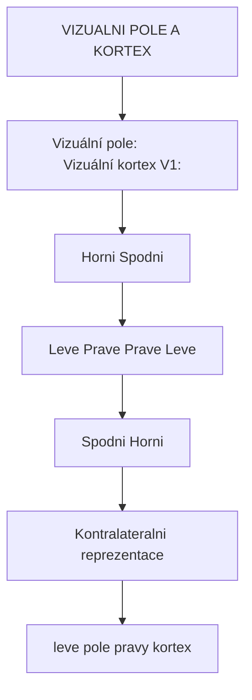
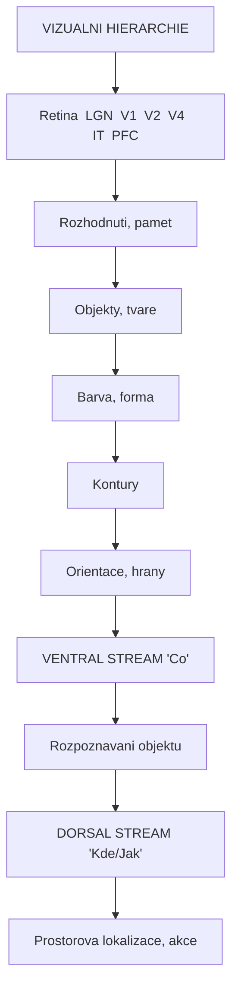
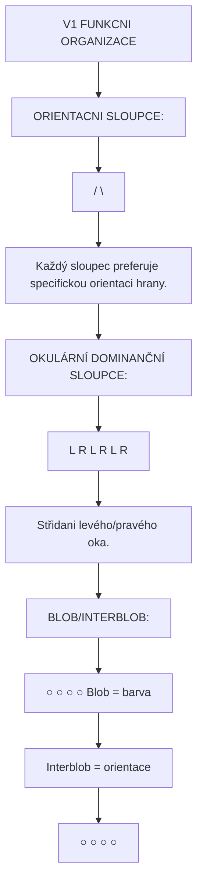
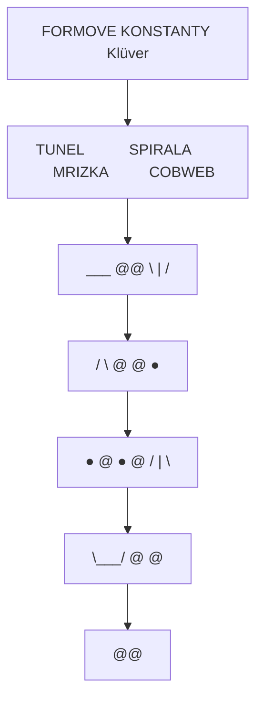
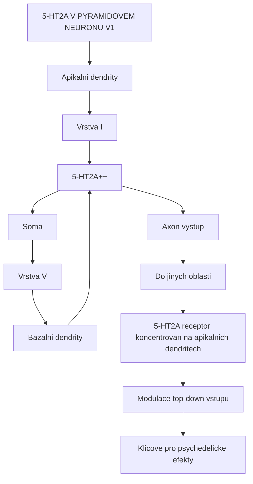
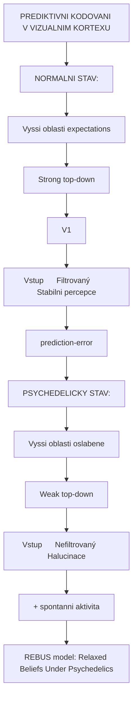
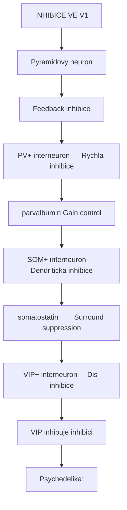

+++
title = "Vizualni kortex"
description = "Vizualni kortex - centrum zrakového zpracovani a generator psychedelickych vizualnich fenomenu"
weight = 2
insert_anchor_links = "right"

[taxonomies]
tags = ["vizualni-kortex", "zrak", "halucinace", "percepce", "mozek"]
categories = ["neuroanatomie", "neuroveda", "psychedelika"]
+++

# Vizualni kortex - Centrum zrakoveho vnimani

**Vizualni kortex** (zrakova kura) je oblast okcipitalniho laloku zodpovedna za **zpracovani zrakovych informaci**. Je organizovan hierarchicky od primarniho vizualniho kortexu (V1), ktery zpracovava zakladni rysy, az po vyssi oblasti analyzujici slozite vzory, objekty a tvare.

Vizualni kortex je klicovym mistem pusobeni psychedelik, kde aktivace [5-HT2A receptoru](@/receptors/5-ht2a.md) vede ke vzniku charakteristickych **vizualnich halucinaci** - geometrickych vzoru, barevnych zmem a komplexnich vizualnich fenomenu.

---

## Anatomicka lokalizace

### Pozice v mozku

| Vlastnost | Hodnota |
|-----------|---------|
| **Lokalizace** | Okcipitalni lalok |
| **Strana** | Bilateralni |
| **Brodmannovy arey** | 17 (V1), 18 (V2), 19 (V3, V4, V5) |
| **Podil kortexu** | ~20% neokortexu |
| **Vstup** | LGN ([thalamus](@/brain/thalamus.md)) |

### Retinotopicka organizace



<details>
<summary>ASCII verze diagramu</summary>

```
VIZUALNI POLE A KORTEX

Vizuální pole:              Vizuální kortex (V1):
┌───────────────────┐       ┌───────────────────┐
│ Horni             │       │ Spodni            │
│ ┌───────────────┐ │       │ ┌───────────────┐ │
│ │ Leve │ Prave  │ │       │ │Prave │ Leve   │ │
│ └───────────────┘ │  →→→  │ └───────────────┘ │
│ Spodni            │       │ Horni             │
└───────────────────┘       └───────────────────┘
        ↓                           ↓
  Kontralateralni reprezentace
  (leve pole → pravy kortex)
```

</details>

---

## Vizualni hierarchie

### Oblasti vizualniho kortexu

| Oblast | Brodmann | Funkce | Vlastnosti |
|--------|----------|--------|------------|
| **V1** | 17 | Primarni zpracovani | Hrany, orientace, frekvence |
| **V2** | 18 | Sekundarni | Kontury, iluzoirni hrany |
| **V3** | 19 | Forma, pohyb | Dynamicka forma |
| **V3A** | 19 | Pohyb | Globalni pohyb |
| **V4** | 19 | Barva, forma | Chromaticke zpracovani |
| **V5/MT** | 19/37 | Pohyb | Smer, rychlost |
| **IT** | 20, 21 | Objekty | Rozpoznavani, tvare |

### Hierarchicke zpracovani



<details>
<summary>ASCII verze diagramu</summary>

```
VIZUALNI HIERARCHIE

Retina → LGN → V1 → V2 → V4 → IT → PFC
          │     │     │     │     │
          │     │     │     │     └── Rozhodnuti, pamet
          │     │     │     └──────── Objekty, tvare
          │     │     └────────────── Barva, forma
          │     └──────────────────── Kontury
          └────────────────────────── Orientace, hrany

         VENTRAL STREAM ("Co")
              │
              └── Rozpoznavani objektu

         DORSAL STREAM ("Kde/Jak")
              │
              └── Prostorova lokalizace, akce
```

</details>

### Dva proudy zpracovani

| Proud | Cesta | Funkce | Poskozeni |
|-------|-------|--------|-----------|
| **Ventralni** | V1→V2→V4→IT→PFC | "Co" - identifikace | Agnozie |
| **Dorzalni** | V1→V2→V3→V5→PPC | "Kde/Jak" - prostor | Ataxie, neglect |

---

## V1 - Primarni vizualni kortex

### Organizace V1

| Vrstva | Vstup | Vlastnosti |
|--------|-------|------------|
| **I** | Nespecificky | Apikalni dendrity |
| **II/III** | Lateralni | Orientacni sloupce |
| **IV** | LGN (hlavni) | Vstupni vrstva |
| **IVc-alpha** | Magnocelularni | Pohyb, kontrast |
| **IVc-beta** | Parvocelularni | Barva, detail |
| **V** | Vystup | [5-HT2A](@/receptors/5-ht2a.md) exprese |
| **VI** | Feedback | LGN, TRN |

### Funkcni architektura



<details>
<summary>ASCII verze diagramu</summary>

```
V1 FUNKCNI ORGANIZACE

ORIENTACNI SLOUPCE:
│   │   │   │   │
│ / │ \ │ ─ │ │ │
│   │   │   │   │

Každý sloupec preferuje specifickou orientaci hrany.

OKULÁRNÍ DOMINANČNÍ SLOUPCE:
│ L │ R │ L │ R │ L │ R │
Střidani levého/pravého oka.

BLOB/INTERBLOB:
┌─────────────────────┐
│  ○    ○    ○    ○   │  Blob = barva
│    ────────────     │  Interblob = orientace
│  ○    ○    ○    ○   │
└─────────────────────┘
```

</details>

### Receptivni pole

| Uroven | Vlastnosti receptivniho pole |
|--------|------------------------------|
| **Retina** | Jednoduche on/off centrum-surround |
| **LGN** | Podobne retine |
| **V1 simple** | Orientovana hrana |
| **V1 complex** | Pohybliva orientovana hrana |
| **V2+** | Slozitejsi vzory, kontury |
| **IT** | Objekty, tvare, faces |

---

## Psychedelika a vizualni kortex

### Mechanismus halucinaci

Psychedelika ([psilocybin](@/alkaloids/psilocybin.md), [LSD](@/alkaloids/lsd.md), [DMT](@/alkaloids/dmt.md)) aktivuji [5-HT2A receptory](@/receptors/5-ht2a.md) ve vizualnim kortexu:

| Efekt | Mechanismus | Fenomen |
|-------|-------------|---------|
| **Zvysena aktivita** | 5-HT2A → depolarizace | Spontanni aktivita |
| **Narusena inhibice** | Snizena GABAergni | Dishibice |
| **Zvysena entropie** | Narusena hierarchie | Nahodne vzory |
| **Oslabeny top-down** | Snizene predikce | Nestabilni percepce |

### Typy vizualnich fenomenu

```mermaid
flowchart TD
    node_PSYCHEDELICKEVIZUALN["PSYCHEDELICKE VIZUALNI FENOMENY"]
    node_UROVEN1nizkadoza["UROVEN 1 nizka doza:"]
    node_Zvyraznenebarvy["• Zvyraznene barvy"]
    node_Ostrejsikontury["• Ostrejsi kontury"]
    node_Dychanipovrchu["• 'Dychani' povrchu"]
    node_Afterimages["• Afterimages"]
    node_Vizualnisumasnow["• Vizualni suma snow"]
    node_UROVEN2strednidoza["UROVEN 2 stredni doza:"]
    node_Geometrickevzory["• Geometricke vzory"]
    node_Spiralytunel["- Spiraly, tunel"]
    node_Mrzkytesselace["- Mrízky, tesselace"]
    node_Fraktaly["- Fraktaly"]
    node_Barevneproudy["• Barevne proudy"]
    node_Vizualnitrailing["• Vizualni trailing"]
    node_Morphingobjektu["• Morphing objektu"]
    node_UROVEN3vysokadoza["UROVEN 3 vysoka doza:"]
    node_Komplexnihalucinace["• Komplexni halucinace"]
    node_Objektybytosti["- Objekty, bytosti"]
    node_Krajinyarchitektury["- Krajiny, architektury"]
    node_Egodissolution["• Ego dissolution"]
    node_Synestezie["• Synestezie"]
    node_Outofbodyexperience["• Out-of-body experience"]

    node_PSYCHEDELICKEVIZUALN --> node_UROVEN1nizkadoza
    node_UROVEN1nizkadoza --> node_Zvyraznenebarvy
    node_Zvyraznenebarvy --> node_Ostrejsikontury
    node_Ostrejsikontury --> node_Dychanipovrchu
    node_Dychanipovrchu --> node_Afterimages
    node_Afterimages --> node_Vizualnisumasnow
    node_Vizualnisumasnow --> node_UROVEN2strednidoza
    node_UROVEN2strednidoza --> node_Geometrickevzory
    node_Geometrickevzory --> node_Spiralytunel
    node_Spiralytunel --> node_Mrzkytesselace
    node_Mrzkytesselace --> node_Fraktaly
    node_Fraktaly --> node_Barevneproudy
    node_Barevneproudy --> node_Vizualnitrailing
    node_Vizualnitrailing --> node_Morphingobjektu
    node_Morphingobjektu --> node_UROVEN3vysokadoza
    node_UROVEN3vysokadoza --> node_Komplexnihalucinace
    node_Komplexnihalucinace --> node_Objektybytosti
    node_Objektybytosti --> node_Krajinyarchitektury
    node_Krajinyarchitektury --> node_Egodissolution
    node_Egodissolution --> node_Synestezie
    node_Synestezie --> node_Outofbodyexperience
```



<details>
<summary>ASCII verze diagramu</summary>

```
PSYCHEDELICKE VIZUALNI FENOMENY

UROVEN 1 (nizka doza):
┌─────────────────────────────────┐
│ • Zvyraznene barvy              │
│ • Ostrejsi kontury              │
│ • "Dychani" povrchu             │
│ • Afterimages                   │
│ • Vizualni suma (snow)          │
└─────────────────────────────────┘

UROVEN 2 (stredni doza):
┌─────────────────────────────────┐
│ • Geometricke vzory             │
│   - Spiraly, tunel              │
│   - Mrízky, tesselace           │
│   - Fraktaly                    │
│ • Barevne proudy                │
│ • Vizualni trailing             │
│ • Morphing objektu              │
└─────────────────────────────────┘

UROVEN 3 (vysoka doza):
┌─────────────────────────────────┐
│ • Komplexni halucinace          │
│   - Objekty, bytosti            │
│   - Krajiny, architektury       │
│ • Ego dissolution               │
│ • Synestezie                    │
│ • Out-of-body experience        │
└─────────────────────────────────┘
```

</details>

### Formove konstanty

Heinrich Klüver identifikoval 4 zakladni formy halucinaci:

| Forma | Popis | Neuronalni korelat |
|-------|-------|-------------------|
| **Tunel/trychtyr** | Koncentricke kruhy | Logaritmicke mapovani V1 |
| **Spirala** | Rotujici vzor | Orientacni sloupce |
| **Mrizka/sachocnice** | Pravidelna tesselace | Periodicka aktivita V1 |
| **Cobweb** | Paprsky od centra | Radialni organizace |



<details>
<summary>ASCII verze diagramu</summary>

```
FORMOVE KONSTANTY (Klüver)

   TUNEL           SPIRALA          MRIZKA          COBWEB
    ___              @@             ┼─┼─┼            \ | /
   /   \            @  @           ─┼─┼─┼─           ─ ● ─
  │ ● ─ │          @ ● @           ┼─┼─┼─┼           / | \
   \___/            @  @           ─┼─┼─┼─
                     @@
```

</details>

### Neuronalni zaklad formovych konstant

| Forma | Mechanismus |
|-------|-------------|
| **Geometricke vzory** | Periodicka aktivita ve V1 orientacnich sloupcich |
| **Tunel/spirala** | Logaritmicke mapovani retiny na V1 |
| **Barevne zmeny** | Aktivace blob regions (V1, V4) |
| **Morphing** | Narusena temporalni integrace |
| **Komplexni obrazy** | Higher-order vizualni oblasti (IT) |

---

## 5-HT2A exprese

### Distribuce v vizualnim kortexu

| Oblast | 5-HT2A exprese | Funkce |
|--------|----------------|--------|
| **V1 vrstva V** | Velmi vysoka | Pyramidove neurony |
| **V2** | Vysoka | Konturove zpracovani |
| **V4** | Stredni | Chromaticke |
| **V5/MT** | Nizka | Pohyb |

### Bunecna lokalizace



<details>
<summary>ASCII verze diagramu</summary>

```
5-HT2A V PYRAMIDOVEM NEURONU V1

                Apikalni dendrity
                     │ │ │
                     │ │ │
            ┌────────┴─┴─┴────────┐
            │   Vrstva I          │
            │   (5-HT2A++++)      │
            ├─────────────────────┤
            │                     │
            │   Soma              │
            │   (Vrstva V)        │
            │                     │
            ├─────────────────────┤
            │   Bazalni dendrity  │
            │   (5-HT2A++)        │
            └─────────┬───────────┘
                      │
                  Axon (vystup)
                      │
                      ↓
              Do jinych oblasti

5-HT2A receptor koncentrovan na apikalnich dendritech
→ Modulace top-down vstupu
→ Klicove pro psychedelicke efekty
```

</details>

---

## Neurozobrazovaci studie

### fMRI nalezy pod psychedeliky

| Studie | Látka | Vizualni kortex nález |
|--------|-------|----------------------|
| Carhart-Harris (2012) | Psilocybin | Snizena aktivita, zvysena variabilita |
| Roseman (2014) | Psilocybin | Zvysena konektivita V1-asociacni |
| Kaelen (2016) | LSD | Hyperkonektivita s hudbou |
| Preller (2017) | LSD | Zmenene top-down zpracovani |

### EEG zmeny

```
EEG ZMENY VE VIZUALNIM KORTEXU POD PSYCHEDELIKY

Alfa power (8-12 Hz) - okcipitalni:
Baseline:    ████████████████████
Pod LSD:     ████████░░░░░░░░░░░░
             Vyrazne snizeni

Interpretace:
- Snizena alfa = mensi inhibice
- Vyssi entropie = vice "chaosu"
- Korelace s intenzitou vizualnich efektu
```

### Model prediktivniho kodovani



<details>
<summary>ASCII verze diagramu</summary>

```
PREDIKTIVNI KODOVANI V VIZUALNIM KORTEXU

NORMALNI STAV:
Vyssi oblasti (expectations)
        │
        ↓ Strong top-down
        ├─────────────────────┐
        │    V1               │
Vstup → │    Filtrovaný       │ → Stabilni percepce
        │    (prediction-error)│
        └─────────────────────┘

PSYCHEDELICKY STAV:
Vyssi oblasti (oslabene)
        │
        ↓ Weak top-down
        ├─────────────────────┐
        │    V1               │
Vstup → │    Nefiltrovaný     │ → Halucinace
(+ spontanni aktivita)        │
        └─────────────────────┘

REBUS model: Relaxed Beliefs Under Psychedelics
- Oslabene priory (top-down)
- Zvysena senzorická váha (bottom-up)
- Spontanni aktivita → halucinace
```

</details>

---

## Dalsi vizualni fenomeny

### HPPD

**Hallucinogen Persisting Perception Disorder** - pretrvavajici vizualni poruchy po psychedelikach:

| Symptom | Popis | Prevalence |
|---------|-------|------------|
| **Visual snow** | Staticka suma | Bezne |
| **Trailing** | Afterimages za objekty | Bezne |
| **Halos** | Aureoly kolem svetel | Casté |
| **Starbursts** | Paprsky ze svetel | Casté |
| **Geometricke** | Mirné vzory | Méně casté |

### Synestezie

| Typ | Popis | Oblast |
|-----|-------|--------|
| **Hudba→barvy** | Barvy pri poslechu hudby | V4-sluchovy kortex |
| **Cisla→barvy** | Barvy pro cisla | V4-numericky |
| **Zvuk→tvary** | Geometrie ze zvuku | V1/V2-sluchovy |

### Pseudohalucinace vs halucinace

| Typ | Vlastnosti |
|-----|------------|
| **Pseudohalucinace** | S insight (vi, ze neni realne) |
| **Halucinace** | Bez insight |
| **Iluze** | Zkresleni realneho objektu |

---

## Receptory v vizuálním kortexu

### Prehled receptoru

| Receptor | Exprese | Funkce |
|----------|---------|--------|
| [**5-HT2A**](@/receptors/5-ht2a.md) | Velmi vysoka | Psychedelicky ucinek |
| **5-HT1A** | Stredni | Modulace |
| [**GABA-A**](@/receptors/gaba-a.md) | Vysoka | Inhibice, gain control |
| **Glutamat (AMPA/NMDA)** | Vysoka | Excitace, plasticita |
| **nAChR** | Stredni | Pozornost |

### Inhibicni okruhy



<details>
<summary>ASCII verze diagramu</summary>

```
INHIBICE VE V1

Pyramidovy neuron
      │
      │ Feedback inhibice
      ↓
┌─────────────────────┐
│  PV+ interneuron    │ ← Rychla inhibice
│  (parvalbumin)      │   Gain control
└─────────────────────┘

┌─────────────────────┐
│  SOM+ interneuron   │ ← Dendriticka inhibice
│  (somatostatin)     │   Surround suppression
└─────────────────────┘

┌─────────────────────┐
│  VIP+ interneuron   │ ← Dis-inhibice
│  (VIP)              │   (inhibuje inhibici)
└─────────────────────┘

Psychedelika:
- Naruseni tohoto okruhu
- Snizená lateralni inhibice
- "Rozmyti" receptivnich poli
```

</details>

---

## Patologie vizualniho kortexu

### Kortikalni slepota

| Leze | Vysledek |
|------|----------|
| **V1 unilateralni** | Homonymni hemianopsie |
| **V1 bilateralni** | Kortikalni slepota |
| **V4** | Achromatopsie |
| **V5** | Akinetopsie |

### Charles Bonnet syndrom

Vizualni halucinace u lidi se ztratou zraku:
- Komplexni obrazy
- Insight zachovan
- Mechanismus: deaferentace V1

### Migrena s aurou

| Faze | Vizualni fenomen | Oblast |
|------|------------------|--------|
| **Prodrom** | Scotoma, fosfeny | V1 |
| **Aura** | Zubate linie, fotopsie | V1-V2 |
| **CSD** | Siricí se deprese | V1→V5 |

---

## Reference

### Klicova literatura

1. Hubel, D.H. & Wiesel, T.N. (1977). *Ferrier lecture: Functional architecture of macaque monkey visual cortex*. Proceedings of the Royal Society B, 198, 1-59.

2. Klüver, H. (1966). *Mescal and Mechanisms of Hallucinations*. University of Chicago Press.

3. Bressloff, P.C. et al. (2001). *Geometric visual hallucinations, Euclidean symmetry and the functional architecture of striate cortex*. Philosophical Transactions B, 356, 299-330.

4. Carhart-Harris, R.L. et al. (2016). *Neural correlates of the LSD experience revealed by multimodal neuroimaging*. PNAS, 113(17), 4853-4858.

5. Kometer, M. et al. (2013). *Psilocybin-induced spiritual experiences and insightfulness are associated with synchronization of neuronal oscillations*. Psychopharmacology, 228(4), 727-737.

### Vizualni halucinace a psychedelika

6. Roseman, L. et al. (2016). *The effects of psilocybin and MDMA on between-network resting state functional connectivity*. Frontiers in Human Neuroscience, 10, 432.

7. Preller, K.H. et al. (2017). *The Fabric of Meaning and Subjective Effects in LSD-Induced States Depend on Serotonin 2A Receptor Activation*. Current Biology, 27(3), 451-457.

---

## Viz take

### Mozkové oblasti
- [Prefrontalni kortex](@/brain/prefrontal-cortex.md) - Top-down kontrola
- [Thalamus](@/brain/thalamus.md) - LGN relay
- [Claustrum](@/brain/claustrum.md) - Vizualni integrace

### Receptory
- [5-HT2A receptor](@/receptors/5-ht2a.md) - Halucinogeni cil
- [GABA-A receptor](@/receptors/gaba-a.md) - Vizualni inhibice

### Neurotransmitery
- [Serotonin](@/glossary/serotonin.md) - Modulace percepce
- [GABA](@/glossary/gaba.md) - Inhibice
- [Glutamát](@/glossary/glutamat.md) - Vizualni transmise

### Psychoaktivní látky
- [Psilocybin](@/alkaloids/psilocybin.md) - Vizualni halucinace
- [LSD](@/alkaloids/lsd.md) - Intenzivni vizualni efekty
- [DMT](@/alkaloids/dmt.md) - Komplexni vizualni svety
- [Meskalin](@/alkaloids/mescaline.md) - Barevne halucinace

---

<- Zpet na [Mozek](@/brain/_index.md) | [Prefrontalni kortex](@/brain/prefrontal-cortex.md) ->
