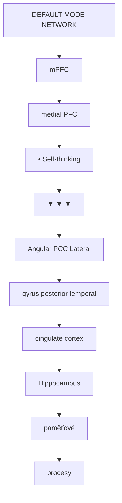
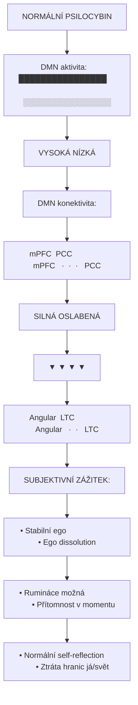
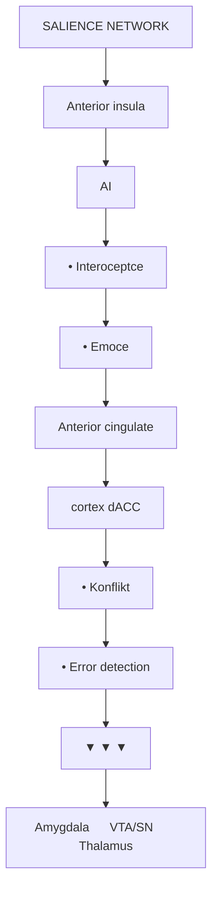
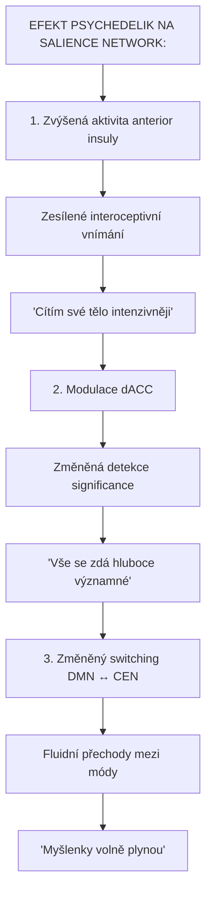
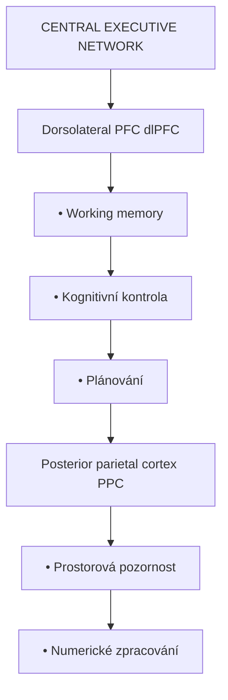
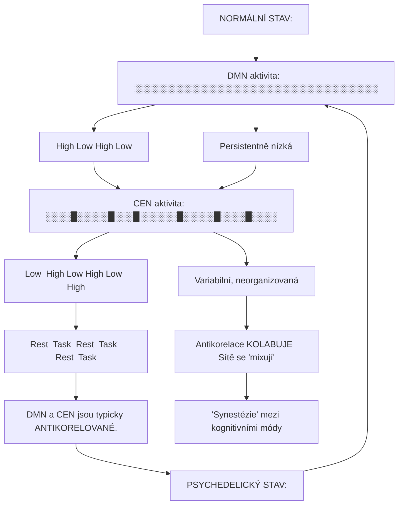
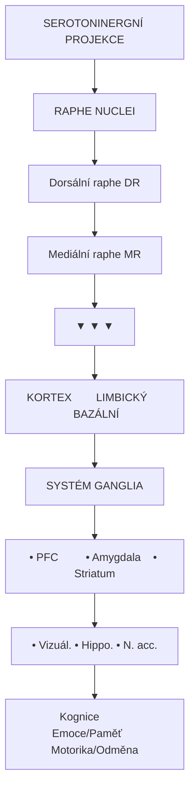
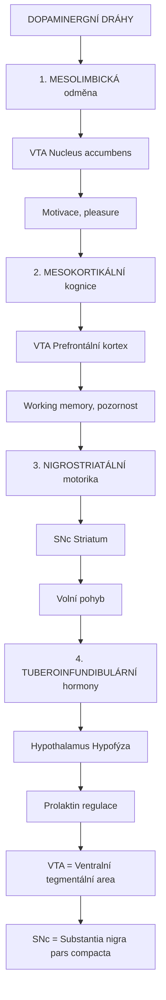
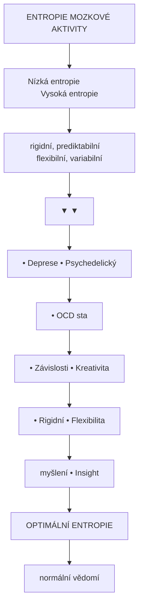

+++
title = "Neurální okruhy"
description = "Funkční neurální sítě a jejich role v psychoaktivních stavech"
weight = 7
sort_by = "weight"
insert_anchor_links = "right"
+++

# Neurální okruhy a psychoaktivní látky

**Neurální okruhy** (circuits/networks) jsou funkčně propojené skupiny mozkových oblastí, které společně realizují komplexní kognitivní a emoční procesy. Psychoaktivní látky modulují tyto okruhy charakteristickými způsoby.

---

## Hlavní mozkové sítě

### Přehled sítí

| Síť | Zkratka | Funkce | Vliv psychedelik |
|-----|---------|--------|------------------|
| **Default Mode Network** | DMN | Self-reference, rumináce | Snížená aktivita |
| **Salience Network** | SN | Detekce důležitosti | Zvýšená aktivita |
| **Central Executive Network** | CEN | Kognitivní kontrola | Změněná |
| **Visual Network** | VN | Zrakové zpracování | Hyperaktivita |
| **Somatosensory Network** | SMN | Tělesné vnímání | Alterace |
| **Dorsal Attention Network** | DAN | Pozornost | Modulace |

---

## Default Mode Network (DMN)

### Anatomie



<details>
<summary>ASCII verze diagramu</summary>

```
┌─────────────────────────────────────────────────────────────┐
│                 DEFAULT MODE NETWORK                         │
│                                                              │
│              ┌─────────────────────┐                        │
│              │        mPFC         │                        │
│              │   (medial PFC)      │                        │
│              │   • Self-thinking   │                        │
│              └──────────┬──────────┘                        │
│                         │                                    │
│        ┌────────────────┼────────────────┐                  │
│        │                │                │                   │
│        ▼                ▼                ▼                   │
│   ┌─────────┐    ┌─────────────┐   ┌─────────────┐          │
│   │ Angular │    │     PCC     │   │   Lateral   │          │
│   │  gyrus  │←──→│(posterior   │←─→│  temporal   │          │
│   │         │    │ cingulate)  │   │   cortex    │          │
│   └─────────┘    └─────────────┘   └─────────────┘          │
│        │                │                │                   │
│        └────────────────┼────────────────┘                  │
│                         │                                    │
│                ┌────────┴────────┐                          │
│                │   Hippocampus   │                          │
│                │   (paměťové     │                          │
│                │   procesy)      │                          │
│                └─────────────────┘                          │
└─────────────────────────────────────────────────────────────┘
```

</details>

### Funkce DMN

| Proces | Komponenty | Aktivita |
|--------|------------|----------|
| **Self-reference** | mPFC | Přemýšlení o sobě |
| **Autobiografická paměť** | PCC, hippocampus | Vzpomínání |
| **Mind wandering** | Celá síť | Denní snění |
| **Theory of Mind** | mPFC, TPJ | Sociální kognice |
| **Prospekce** | mPFC, MTL | Plánování budoucnosti |

### DMN a psychedelika



<details>
<summary>ASCII verze diagramu</summary>

```
                NORMÁLNÍ                    PSILOCYBIN

DMN aktivita:   ████████████████            ░░░░░░░░░░░░░░░░
                   VYSOKÁ                       NÍZKÁ

DMN konektivita:
mPFC ←──────────→ PCC               mPFC ←  ·  ·  ·  → PCC
 │                 │                  │                 │
 │    SILNÁ        │                  │    OSLABENÁ     │
 │                 │                  │                 │
 ▼                 ▼                  ▼                 ▼
Angular ←────────→ LTC              Angular ←  ·  ·  → LTC

SUBJEKTIVNÍ ZÁŽITEK:
• Stabilní ego                      • Ego dissolution
• Rumináce možná                    • Přítomnost v momentu
• Normální self-reflection          • Ztráta hranic já/svět
```

</details>

### Klinické korelace

| Stav | DMN aktivita | Konektivita | Symptomy |
|------|--------------|-------------|----------|
| **Deprese** | ↑ | Hyperkonektivita | Rumináce, negativní self-talk |
| **Úzkost** | ↑ | Abnormální | Worry, anticipační úzkost |
| **PTSD** | ↑ | Dysregulovaná | Flashbacky, hypervigilance |
| **Psychedelický stav** | ↓↓ | Dezintegrace | Ego dissolution, mystické zážitky |
| **Meditace** | ↓ | Modifikovaná | Klid, přítomnost |

---

## Salience Network (SN)

### Anatomie



<details>
<summary>ASCII verze diagramu</summary>

```
┌─────────────────────────────────────────────────────────────┐
│                   SALIENCE NETWORK                           │
│                                                              │
│              ┌─────────────────────┐                        │
│              │   Anterior insula   │                        │
│              │   (AI)              │                        │
│              │   • Interoceptce    │                        │
│              │   • Emoce           │                        │
│              └──────────┬──────────┘                        │
│                         │                                    │
│                    ←────┼────→                              │
│                         │                                    │
│              ┌──────────┴──────────┐                        │
│              │  Anterior cingulate │                        │
│              │  cortex (dACC)      │                        │
│              │  • Konflikt         │                        │
│              │  • Error detection  │                        │
│              └─────────────────────┘                        │
│                         │                                    │
│          ┌──────────────┼──────────────┐                    │
│          ▼              ▼              ▼                     │
│   ┌───────────┐  ┌───────────┐  ┌───────────┐               │
│   │ Amygdala  │  │  VTA/SN   │  │  Thalamus │               │
│   │           │  │           │  │           │               │
│   └───────────┘  └───────────┘  └───────────┘               │
└─────────────────────────────────────────────────────────────┘
```

</details>

### Funkce SN

| Funkce | Mechanismus | Účinek psychedelik |
|--------|-------------|-------------------|
| **Detekce salience** | AI + dACC | Změněná prioritizace |
| **Switching mezi DMN/CEN** | AI hub | Fluidní přechody |
| **Interoceptivní awareness** | Anterior insula | Zesílené tělesné vnímání |
| **Emoční zpracování** | Amygdala propojení | Emoční uvolnění |

### Psychedelika a SN



<details>
<summary>ASCII verze diagramu</summary>

```
EFEKT PSYCHEDELIK NA SALIENCE NETWORK:

1. Zvýšená aktivita anterior insuly
   → Zesílené interoceptivní vnímání
   → "Cítím své tělo intenzivněji"

2. Modulace dACC
   → Změněná detekce significance
   → "Vše se zdá hluboce významné"

3. Změněný switching DMN ↔ CEN
   → Fluidní přechody mezi módy
   → "Myšlenky volně plynou"
```

</details>

---

## Central Executive Network (CEN)

### Anatomie



<details>
<summary>ASCII verze diagramu</summary>

```
┌─────────────────────────────────────────────────────────────┐
│              CENTRAL EXECUTIVE NETWORK                       │
│                                                              │
│   ┌─────────────────────────────────────────────────────┐   │
│   │          Dorsolateral PFC (dlPFC)                    │   │
│   │          • Working memory                            │   │
│   │          • Kognitivní kontrola                       │   │
│   │          • Plánování                                 │   │
│   └─────────────────────┬───────────────────────────────┘   │
│                         │                                    │
│                    ←────┼────→                              │
│                         │                                    │
│   ┌─────────────────────┴───────────────────────────────┐   │
│   │          Posterior parietal cortex (PPC)             │   │
│   │          • Prostorová pozornost                      │   │
│   │          • Numerické zpracování                      │   │
│   └─────────────────────────────────────────────────────┘   │
└─────────────────────────────────────────────────────────────┘
```

</details>

### DMN vs CEN (anticorrelation)



<details>
<summary>ASCII verze diagramu</summary>

```
NORMÁLNÍ STAV:

DMN aktivita:  ──────────────────────────────────────────
               High │     │Low │     │High │     │Low
                    │     │    │     │     │     │
CEN aktivita:  ─────┼─────┼────┼─────┼─────┼─────┼────
               Low  │High │Low │High │Low  │High │
                    │     │    │     │     │     │
               ─────┴─────┴────┴─────┴─────┴─────┴────
               Rest  Task  Rest  Task  Rest  Task

DMN a CEN jsou typicky ANTIKORELOVANÉ.

PSYCHEDELICKÝ STAV:

DMN aktivita:  ░░░░░░░░░░░░░░░░░░░░░░░░░░░░░░░░░░░░░░░
               Persistentně nízká

CEN aktivita:  ░░░░█░░░░░█░░░█░░░░░░█░░░░░█░░░░█░░░░
               Variabilní, neorganizovaná

Antikorelace KOLABUJE → Sítě se "mixují"
→ "Synestézie" mezi kognitivními módy
```

</details>

---

## Serotoninergní dráhy

### Anatomie



<details>
<summary>ASCII verze diagramu</summary>

```
┌─────────────────────────────────────────────────────────────┐
│            SEROTONINERGNÍ PROJEKCE                           │
│                                                              │
│                    RAPHE NUCLEI                              │
│              ┌──────────────────────┐                       │
│              │  Dorsální raphe (DR) │                       │
│              │  Mediální raphe (MR) │                       │
│              └──────────┬───────────┘                       │
│                         │                                    │
│         ┌───────────────┼───────────────┐                   │
│         │               │               │                    │
│         ▼               ▼               ▼                    │
│   ┌───────────┐   ┌───────────┐   ┌───────────┐             │
│   │ KORTEX    │   │ LIMBICKÝ  │   │ BAZÁLNÍ   │             │
│   │           │   │ SYSTÉM    │   │ GANGLIA   │             │
│   │ • PFC     │   │ • Amygdala│   │ • Striatum│             │
│   │ • Vizuál. │   │ • Hippo.  │   │ • N. acc. │             │
│   └───────────┘   └───────────┘   └───────────┘             │
│         │               │               │                    │
│         ▼               ▼               ▼                    │
│   Kognice          Emoce/Paměť     Motorika/Odměna           │
└─────────────────────────────────────────────────────────────┘
```

</details>

### 5-HT receptor distribuce v okruzích

| Okruh | Primární 5-HT receptor | Efekt psychedelik |
|-------|------------------------|-------------------|
| Kortikální | [5-HT2A](@/receptors/5-ht2a.md) | Halucinace, změněná kognice |
| Limbický | 5-HT2A, 5-HT1A | Emoční modulace |
| Striatální | 5-HT2A, 5-HT2C | Motorická změna |
| Autoreceptory (raphe) | 5-HT1A | Snížení 5-HT uvolňování |

---

## Dopaminergní okruhy

### Čtyři hlavní dráhy



<details>
<summary>ASCII verze diagramu</summary>

```
┌─────────────────────────────────────────────────────────────┐
│             DOPAMINERGNÍ DRÁHY                               │
│                                                              │
│   1. MESOLIMBICKÁ (odměna)                                  │
│      VTA ──────────────→ Nucleus accumbens                   │
│                          → Motivace, pleasure                │
│                                                              │
│   2. MESOKORTIKÁLNÍ (kognice)                               │
│      VTA ──────────────→ Prefrontální kortex                │
│                          → Working memory, pozornost         │
│                                                              │
│   3. NIGROSTRIATÁLNÍ (motorika)                             │
│      SNc ──────────────→ Striatum                           │
│                          → Volní pohyb                       │
│                                                              │
│   4. TUBEROINFUNDIBULÁRNÍ (hormony)                         │
│      Hypothalamus ─────→ Hypofýza                           │
│                          → Prolaktin regulace                │
│                                                              │
└─────────────────────────────────────────────────────────────┘

VTA = Ventralní tegmentální area
SNc = Substantia nigra pars compacta
```

</details>

### Psychedelika a dopamin

| Látka | Dopaminový efekt | Subjektivní |
|-------|------------------|-------------|
| [LSD](@/alkaloids/lsd.md) | D2 parciální agonismus | Euforie |
| [Psilocybin](@/alkaloids/psilocybin.md) | Minimální | Neutrální nálada |
| [DMT](@/alkaloids/dmt.md) | Sigma-1 (ne D2) | Jiný typ euforie |

---

## Integrace vědomí - Claustrum

### Anatomie a konektivita

```mermaid
flowchart TD
    node_CLAUSTRUM["CLAUSTRUM"]
    node_Dirigentorchestruvdo["'Dirigent orchestru vědomí'"]
    node_TENKPRUHEDHMOTY["TENKÝ PRUH ŠEDÉ HMOTY"]
    node_meziinsulouabazlnmig["mezi insulou a bazálními ganglii"]
    node_3ef67005["▼               ▼               ▼"]
    node_SenzorickMotorickAso["Senzorické      Motorické      Asociační"]
    node_kortexkortexkortex["kortex          kortex         kortex"]
    node_Funkce["Funkce:"]
    node_Integracemultimodlni["• Integrace multimodální informace"]
    node_Bindingvdomhozitku["• 'Binding' vědomého zážitku"]
    node_Synchronizacekortikl["• Synchronizace kortikální aktivity"]
    node_Psychedelika["Psychedelika:"]
    node_Nejvyhustota5HT2Arec["• Nejvyšší hustota 5-HT2A receptorů v mozku!"]
    node_Dezintegraceegodisso["• Dezintegrace  'ego dissolution'"]
    node_Resetterapeutickpote["• Reset  terapeutický potenciál"]

    node_CLAUSTRUM --> node_Dirigentorchestruvdo
    node_Dirigentorchestruvdo --> node_TENKPRUHEDHMOTY
    node_TENKPRUHEDHMOTY --> node_meziinsulouabazlnmig
    node_meziinsulouabazlnmig --> node_3ef67005
    node_3ef67005 --> node_SenzorickMotorickAso
    node_SenzorickMotorickAso --> node_kortexkortexkortex
    node_kortexkortexkortex --> node_Funkce
    node_Funkce --> node_Integracemultimodlni
    node_Integracemultimodlni --> node_Bindingvdomhozitku
    node_Bindingvdomhozitku --> node_Synchronizacekortikl
    node_Synchronizacekortikl --> node_Psychedelika
    node_Psychedelika --> node_Nejvyhustota5HT2Arec
    node_Nejvyhustota5HT2Arec --> node_Dezintegraceegodisso
    node_Dezintegraceegodisso --> node_Resetterapeutickpote

    click node_Nejvyhustota5HT2Arec "/receptors/5-ht2a/" "• Nejvyšší hustota 5-HT2A receptorů v mozku!"
```



<details>
<summary>ASCII verze diagramu</summary>

```
┌─────────────────────────────────────────────────────────────┐
│                    CLAUSTRUM                                 │
│              "Dirigent orchestru vědomí"                     │
│                                                              │
│   ┌───────────────────────────────────────────────────┐     │
│   │              TENKÝ PRUH ŠEDÉ HMOTY                │     │
│   │           (mezi insulou a bazálními ganglii)      │     │
│   └───────────────────────────────────────────────────┘     │
│                           │                                  │
│           ┌───────────────┼───────────────┐                 │
│           │               │               │                  │
│           ▼               ▼               ▼                  │
│     Senzorické      Motorické      Asociační                │
│      kortex          kortex         kortex                  │
│                                                              │
│   Funkce:                                                    │
│   • Integrace multimodální informace                        │
│   • "Binding" vědomého zážitku                              │
│   • Synchronizace kortikální aktivity                       │
│                                                              │
│   Psychedelika:                                             │
│   • Nejvyšší hustota 5-HT2A receptorů v mozku!              │
│   • Dezintegrace → "ego dissolution"                        │
│   • Reset → terapeutický potenciál                          │
└─────────────────────────────────────────────────────────────┘
```

</details>

---

## Entropic Brain Hypothesis

### Koncept



<details>
<summary>ASCII verze diagramu</summary>

```
ENTROPIE MOZKOVÉ AKTIVITY

Nízká entropie              Vysoká entropie
(rigidní, prediktabilní)    (flexibilní, variabilní)
        │                           │
        ▼                           ▼
┌──────────────────┐       ┌──────────────────┐
│   • Deprese      │       │   • Psychedelický│
│   • OCD          │       │     stav         │
│   • Závislosti   │       │   • Kreativita   │
│   • Rigidní      │       │   • Flexibilita  │
│     myšlení      │       │   • Insight      │
└──────────────────┘       └──────────────────┘
        │                           │
        └───────────┬───────────────┘
                    │
                    ▼
            OPTIMÁLNÍ ENTROPIE
            (normální vědomí)
```

</details>

### Entropic Brain a terapie

| Stav | Entropie | Terapeutický cíl |
|------|----------|------------------|
| Deprese | Nízká (DMN hyperkonektivita) | Zvýšit flexibilitu |
| Závislosti | Nízká (habituální patterns) | Narušit rigidní okruhy |
| PTSD | Abnormální (hyperarousal) | "Reset" |
| Psychedelický | Vysoká | Dočasný, terapeutický |
| Post-psychedelický | Optimalizovaná | Trvalé změny |

---

## Reference

1. Menon, V. (2011). *Large-scale brain networks and psychopathology*. Trends in Cognitive Sciences.
2. Carhart-Harris, R.L. et al. (2014). *The entropic brain: a theory of conscious states*. Frontiers in Human Neuroscience.
3. Daws, R.E. et al. (2022). *Increased global integration in the brain after psilocybin therapy for depression*. Nature Medicine.
4. Barrett, F.S. & Griffiths, R.R. (2018). *Classic hallucinogens and mystical experiences*. Current Topics in Behavioral Neurosciences.

---

Viz také:
- [Mozek](@/brain/_index.md) - Anatomické oblasti
- [Receptory](@/receptors/_index.md) - Molekulární cíle
- [5-HT2A receptor](@/receptors/5-ht2a.md) - Primární cíl psychedelik
- [Default Mode Network](@/circuits/dmn.md) - Detailní popis

← Zpět na [Hlavní stránku](@/_index.md)
