+++
title = "Default Mode Network (DMN)"
description = "Sit klidu - mozkova sit aktivni pri introspekci, ego dissolution pod psychedeliky, meditace"
weight = 1
insert_anchor_links = "right"

[taxonomies]
kategorie = ["neuroveda", "mozkove-site", "vedomi"]
systemy = ["DMN", "kortikalni", "limbicky"]
souvisejici_latky = ["psilocybin", "LSD", "DMT", "ayahuasca", "ketamin"]
+++

# Default Mode Network (DMN) - Sit klidu

**Default Mode Network** (DMN, "sit klidu" nebo "vychozi rezim mozku") je soubor vzajemne propojenych mozkovych oblasti, ktere vykazuji zvysenou aktivitu behem **introspekce, self-referencniho mysleni a denni sneni**. Psychoaktivni latky, predevsim [psychedelika](@/glossary/psychedelikum.md), dramaticky moduluji aktivitu DMN, coz koreluje se subjektivnimi zazitky jako **ego dissolution** a **mysticke stavy**.

---

## Zakladni informace

### Co je Default Mode Network?

| Aspekt | Popis |
|--------|-------|
| **Definice** | Funkcionalne propojene mozkove oblasti aktivni v "klidovem stavu" |
| **Objeven** | Marcus Raichle et al. (2001) |
| **Aktivita** | Nejvyssi pri introspekci, nizka pri externich ulohach |
| **Funkce** | Self-reference, autobiograficka pamet, socialni kognice |
| **Klinicky vyznam** | Alterace u deprese, uzkosti, autismu, schizofrenie |

### Historicky kontext

| Rok | Milnik |
|-----|--------|
| 2001 | Raichle popisuje "default mode" pomoci PET |
| 2003 | Greicius identifikuje DMN pomoci fMRI |
| 2007 | Buckner mapuje tri subsystemy DMN |
| 2012 | Carhart-Harris spojuje DMN s psychedeliky |
| 2014 | "Entropic Brain Hypothesis" |
| 2022 | Daws et al.: psilocybin a globalni integrace |

---

## Anatomie DMN

### Klicove struktury

```mermaid
flowchart TD
    node_DEFAULTMODENETWORK["DEFAULT MODE NETWORK"]
    node_MEDIALPREFRONTAL["MEDIAL PREFRONTAL"]
    node_CORTEXmPFC["CORTEX mPFC"]
    node_Selfthinking["• Self-thinking"]
    node_Socialcognition["• Social cognition"]
    node_Mentalizace["• Mentalizace"]
    node_5c1137a6["▼                    ▼                    ▼"]
    node_ANGULARPOSTERIORLATE["ANGULAR           POSTERIOR          LATERAL"]
    node_GYRUSCINGULATETEMPOR["GYRUS        CINGULATE     TEMPORAL"]
    node_PCCPCuCORTEX["PCC/PCu          CORTEX"]
    node_Semanticka["• Semanticka"]
    node_pametCentralniSemant["pamet            • Centralni        • Semanticka"]
    node_ProstorovauzelDMNpam["• Prostorova         uzel DMN           pamet"]
    node_kogniceSelfawareSoci["kognice          • Self-aware       • Socialni"]
    node_HIPPOCAMPUS["HIPPOCAMPUS"]
    node_parahipokampalni["parahipokampalni"]
    node_gyrus["gyrus"]
    node_Epizodickpamet["• Epizodická pamet"]
    node_Autobiografick["• Autobiografická"]
    node_rekonstrukce["rekonstrukce"]
    node_Pouzitezkratky["Pouzite zkratky:"]
    node_mPFCMedialniprefront["mPFC = Medialni prefrontalni kortex"]
    node_PCCPosteriorcingular["PCC = Posterior cingularni kortex"]
    node_PCuPrecuneus["PCu = Precuneus"]

    node_DEFAULTMODENETWORK --> node_MEDIALPREFRONTAL
    node_MEDIALPREFRONTAL --> node_CORTEXmPFC
    node_CORTEXmPFC --> node_Selfthinking
    node_Selfthinking --> node_Socialcognition
    node_Socialcognition --> node_Mentalizace
    node_Mentalizace --> node_5c1137a6
    node_5c1137a6 --> node_ANGULARPOSTERIORLATE
    node_ANGULARPOSTERIORLATE --> node_GYRUSCINGULATETEMPOR
    node_GYRUSCINGULATETEMPOR --> node_PCCPCuCORTEX
    node_PCCPCuCORTEX --> node_Semanticka
    node_Semanticka --> node_pametCentralniSemant
    node_pametCentralniSemant --> node_ProstorovauzelDMNpam
    node_ProstorovauzelDMNpam --> node_kogniceSelfawareSoci
    node_kogniceSelfawareSoci --> node_HIPPOCAMPUS
    node_HIPPOCAMPUS --> node_parahipokampalni
    node_parahipokampalni --> node_gyrus
    node_gyrus --> node_Epizodickpamet
    node_Epizodickpamet --> node_Autobiografick
    node_Autobiografick --> node_rekonstrukce
    node_rekonstrukce --> node_Pouzitezkratky
    node_Pouzitezkratky --> node_mPFCMedialniprefront
    node_mPFCMedialniprefront --> node_PCCPosteriorcingular
    node_PCCPosteriorcingular --> node_PCuPrecuneus
```

<details>
<summary>ASCII verze diagramu</summary>

```
┌─────────────────────────────────────────────────────────────────────┐
│                    DEFAULT MODE NETWORK                              │
│                                                                      │
│                    ┌───────────────────────────┐                    │
│                    │   MEDIAL PREFRONTAL       │                    │
│                    │   CORTEX (mPFC)           │                    │
│                    │   • Self-thinking         │                    │
│                    │   • Social cognition      │                    │
│                    │   • Mentalizace           │                    │
│                    └───────────┬───────────────┘                    │
│                                │                                     │
│           ┌────────────────────┼────────────────────┐               │
│           │                    │                    │               │
│           ▼                    ▼                    ▼               │
│   ┌───────────────┐    ┌───────────────┐    ┌───────────────┐      │
│   │    ANGULAR    │    │   POSTERIOR   │    │   LATERAL     │      │
│   │     GYRUS     │←──→│   CINGULATE   │←──→│  TEMPORAL     │      │
│   │               │    │   (PCC/PCu)   │    │   CORTEX      │      │
│   │ • Semanticka  │    │               │    │               │      │
│   │   pamet       │    │ • Centralni   │    │ • Semanticka  │      │
│   │ • Prostorova  │    │   uzel DMN    │    │   pamet       │      │
│   │   kognice     │    │ • Self-aware  │    │ • Socialni    │      │
│   └───────┬───────┘    └───────┬───────┘    └───────┬───────┘      │
│           │                    │                    │               │
│           └────────────────────┼────────────────────┘               │
│                                │                                     │
│                                ▼                                     │
│                    ┌───────────────────────────┐                    │
│                    │      HIPPOCAMPUS          │                    │
│                    │    (parahipokampalni      │                    │
│                    │         gyrus)            │                    │
│                    │                           │                    │
│                    │   • Epizodická pamet      │                    │
│                    │   • Autobiografická       │                    │
│                    │     rekonstrukce          │                    │
│                    └───────────────────────────┘                    │
│                                                                      │
└─────────────────────────────────────────────────────────────────────┘

Pouzite zkratky:
mPFC = Medialni prefrontalni kortex
PCC = Posterior cingularni kortex
PCu = Precuneus
```

</details>

### Tri subsystemy DMN (Buckner 2007)

```mermaid
flowchart TD
    node_DMNSUBSYSTEMY["DMN SUBSYSTEMY"]
    node_COREDMN["CORE DMN"]
    node_centralni["centralni"]
    node_PCCPrecuneus["PCC / Precuneus"]
    node_AnteriormPFC["Anterior mPFC"]
    node_a6b5b6fe["▼                           ▼"]
    node_MEDIALDORSOMEDIAL["MEDIAL                   DORSOMEDIAL"]
    node_TEMPORALSUBSYSTEM["TEMPORAL                 SUBSYSTEM"]
    node_SUBSYSTEM["SUBSYSTEM"]
    node_dmPFC["• dmPFC"]
    node_HippocampusTPJ["• Hippocampus            • TPJ"]
    node_ParahipokLateraltemp["• Parahipok.             • Lateral temp."]
    node_RetrosplTemporalpole["• Retrospl.              • Temporal pole"]
    node_kortex["kortex"]
    node_FUNKCEFUNKCE["FUNKCE:                  FUNKCE:"]
    node_AutobiografTheoryofM["Autobiograf.             Theory of Mind"]
    node_pametSocialni["pamet,                   Socialni"]
    node_Prostorovakognice["Prostorova               kognice,"]
    node_navigaceSelfother["navigace,                Self-other"]
    node_Mentalnirozliseni["Mentalni                 rozliseni,"]
    node_simulaceMentalizace["simulace                 Mentalizace"]
    node_TPJTemporoparietalni["TPJ = Temporoparietalni junkce"]
    node_dmPFCDorsomedialnipr["dmPFC = Dorsomedialni prefrontalni kortex"]

    node_DMNSUBSYSTEMY --> node_COREDMN
    node_COREDMN --> node_centralni
    node_centralni --> node_PCCPrecuneus
    node_PCCPrecuneus --> node_AnteriormPFC
    node_AnteriormPFC --> node_a6b5b6fe
    node_a6b5b6fe --> node_MEDIALDORSOMEDIAL
    node_MEDIALDORSOMEDIAL --> node_TEMPORALSUBSYSTEM
    node_TEMPORALSUBSYSTEM --> node_SUBSYSTEM
    node_SUBSYSTEM --> node_dmPFC
    node_dmPFC --> node_HippocampusTPJ
    node_HippocampusTPJ --> node_ParahipokLateraltemp
    node_ParahipokLateraltemp --> node_RetrosplTemporalpole
    node_RetrosplTemporalpole --> node_kortex
    node_kortex --> node_FUNKCEFUNKCE
    node_FUNKCEFUNKCE --> node_AutobiografTheoryofM
    node_AutobiografTheoryofM --> node_pametSocialni
    node_pametSocialni --> node_Prostorovakognice
    node_Prostorovakognice --> node_navigaceSelfother
    node_navigaceSelfother --> node_Mentalnirozliseni
    node_Mentalnirozliseni --> node_simulaceMentalizace
    node_simulaceMentalizace --> node_TPJTemporoparietalni
    node_TPJTemporoparietalni --> node_dmPFCDorsomedialnipr
```

<details>
<summary>ASCII verze diagramu</summary>

```
                       DMN SUBSYSTEMY

    ┌─────────────────────────────────────────────────────────┐
    │                                                          │
    │                     CORE DMN                            │
    │                    (centralni)                          │
    │              ┌────────────────────┐                     │
    │              │   PCC / Precuneus   │                     │
    │              │   Anterior mPFC     │                     │
    │              └─────────┬──────────┘                     │
    │                        │                                 │
    │          ┌─────────────┴─────────────┐                  │
    │          │                           │                  │
    │          ▼                           ▼                  │
    │   ┌─────────────────┐        ┌─────────────────┐       │
    │   │  MEDIAL         │        │  DORSOMEDIAL    │       │
    │   │  TEMPORAL       │        │  SUBSYSTEM      │       │
    │   │  SUBSYSTEM      │        │                 │       │
    │   │                 │        │ • dmPFC         │       │
    │   │ • Hippocampus   │        │ • TPJ           │       │
    │   │ • Parahipok.    │        │ • Lateral temp. │       │
    │   │ • Retrospl.     │        │ • Temporal pole │       │
    │   │   kortex        │        │                 │       │
    │   │                 │        │                 │       │
    │   │  FUNKCE:        │        │  FUNKCE:        │       │
    │   │  Autobiograf.   │        │  Theory of Mind │       │
    │   │  pamet,         │        │  Socialni       │       │
    │   │  Prostorova     │        │  kognice,       │       │
    │   │  navigace,      │        │  Self-other     │       │
    │   │  Mentalni       │        │  rozliseni,     │       │
    │   │  simulace       │        │  Mentalizace    │       │
    │   │                 │        │                 │       │
    │   └─────────────────┘        └─────────────────┘       │
    │                                                          │
    └─────────────────────────────────────────────────────────┘

    TPJ = Temporoparietalni junkce
    dmPFC = Dorsomedialni prefrontalni kortex
```

</details>

### Konektivita DMN

| Spojeni | Funkce | Sila |
|---------|--------|------|
| **mPFC - PCC** | Self-processing, valuace | Velmi silne |
| **PCC - Hipokampus** | Autobiograficka pamet | Silne |
| **mPFC - TPJ** | Theory of Mind | Silne |
| **Angular gyrus - PCC** | Semanticke zpracovani | Stredni |
| **Temporalni pol - mPFC** | Socialni znalosti | Stredni |

---

## Funkce DMN

### Primarni funkce

```mermaid
flowchart TD
    node_FUNKCEDMN["FUNKCE DMN"]
    node_1SELFREFERENCE["1. SELF-REFERENCE"]
    node_Kdojsemja["'Kdo jsem ja?'"]
    node_Selfreflection["• Self-reflection"]
    node_Introspekce["• Introspekce"]
    node_Autobiografickaident["• Autobiograficka identita"]
    node_2AUTOBIOGRAFICKAPAME["2. AUTOBIOGRAFICKA PAMET"]
    node_Cojsemzazil["'Co jsem zazil?'"]
    node_Vzpominkynaosobniuda["• Vzpominky na osobni udalosti"]
    node_Mentalnicestovanivca["• Mentalni cestovani v case"]
    node_Rekonstrukceminulost["• Rekonstrukce minulosti"]
    node_3MENTALNISIMULACE["3. MENTALNI SIMULACE"]
    node_Cobybylokdyby["'Co by bylo kdyby?'"]
    node_Prospekcepredstavyob["• Prospekce predstavy o budoucnosti"]
    node_Scenareamoznosti["• Scenare a moznosti"]
    node_Planovn["• Planování"]
    node_4THEORYOFMIND["4. THEORY OF MIND"]
    node_Cosimyslidruzi["'Co si mysli druzi?'"]
    node_Perspektivadruhych["• Perspektiva druhych"]
    node_Empatie["• Empatie"]
    node_Socialnikognice["• Socialni kognice"]
    node_5MORALREASONING["5. MORAL REASONING"]
    node_Cojespravne["'Co je spravne?'"]
    node_Mornisoudy["• Moráni soudy"]
    node_Etickedilema["• Eticke dilema"]
    node_6MINDWANDERING["6. MIND-WANDERING"]
    node_Kdebloudimmyslenkami["'Kde bloudim myslenkami?'"]
    node_Dennisneni["• Denni sneni"]
    node_Spontannimysleni["• Spontanni mysleni"]
    node_Taskunrelatedthought["• Task-unrelated thoughts"]

    node_FUNKCEDMN --> node_1SELFREFERENCE
    node_1SELFREFERENCE --> node_Kdojsemja
    node_Kdojsemja --> node_Selfreflection
    node_Selfreflection --> node_Introspekce
    node_Introspekce --> node_Autobiografickaident
    node_Autobiografickaident --> node_2AUTOBIOGRAFICKAPAME
    node_2AUTOBIOGRAFICKAPAME --> node_Cojsemzazil
    node_Cojsemzazil --> node_Vzpominkynaosobniuda
    node_Vzpominkynaosobniuda --> node_Mentalnicestovanivca
    node_Mentalnicestovanivca --> node_Rekonstrukceminulost
    node_Rekonstrukceminulost --> node_3MENTALNISIMULACE
    node_3MENTALNISIMULACE --> node_Cobybylokdyby
    node_Cobybylokdyby --> node_Prospekcepredstavyob
    node_Prospekcepredstavyob --> node_Scenareamoznosti
    node_Scenareamoznosti --> node_Planovn
    node_Planovn --> node_4THEORYOFMIND
    node_4THEORYOFMIND --> node_Cosimyslidruzi
    node_Cosimyslidruzi --> node_Perspektivadruhych
    node_Perspektivadruhych --> node_Empatie
    node_Empatie --> node_Socialnikognice
    node_Socialnikognice --> node_5MORALREASONING
    node_5MORALREASONING --> node_Cojespravne
    node_Cojespravne --> node_Mornisoudy
    node_Mornisoudy --> node_Etickedilema
    node_Etickedilema --> node_6MINDWANDERING
    node_6MINDWANDERING --> node_Kdebloudimmyslenkami
    node_Kdebloudimmyslenkami --> node_Dennisneni
    node_Dennisneni --> node_Spontannimysleni
    node_Spontannimysleni --> node_Taskunrelatedthought
```

<details>
<summary>ASCII verze diagramu</summary>

```
                    FUNKCE DMN

    ┌───────────────────────────────────────────────────────┐
    │                                                        │
    │   1. SELF-REFERENCE                                   │
    │      "Kdo jsem ja?"                                   │
    │      • Self-reflection                                │
    │      • Introspekce                                    │
    │      • Autobiograficka identita                       │
    │                                                        │
    │   2. AUTOBIOGRAFICKA PAMET                            │
    │      "Co jsem zazil?"                                 │
    │      • Vzpominky na osobni udalosti                   │
    │      • Mentalni cestovani v case                      │
    │      • Rekonstrukce minulosti                         │
    │                                                        │
    │   3. MENTALNI SIMULACE                                │
    │      "Co by bylo kdyby?"                              │
    │      • Prospekce (predstavy o budoucnosti)            │
    │      • Scenare a moznosti                             │
    │      • Planování                                       │
    │                                                        │
    │   4. THEORY OF MIND                                   │
    │      "Co si mysli druzi?"                             │
    │      • Perspektiva druhych                            │
    │      • Empatie                                         │
    │      • Socialni kognice                               │
    │                                                        │
    │   5. MORAL REASONING                                  │
    │      "Co je spravne?"                                 │
    │      • Moráni soudy                                   │
    │      • Eticke dilema                                  │
    │                                                        │
    │   6. MIND-WANDERING                                   │
    │      "Kde bloudim myslenkami?"                        │
    │      • Denni sneni                                    │
    │      • Spontanni mysleni                              │
    │      • Task-unrelated thoughts                        │
    │                                                        │
    └───────────────────────────────────────────────────────┘
```

</details>

### DMN vs Task-Positive Network

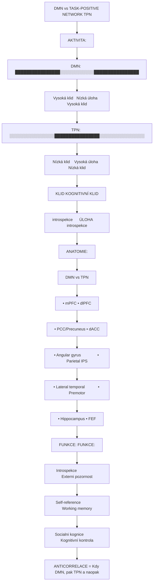

<details>
<summary>ASCII verze diagramu</summary>

```
    DMN vs TASK-POSITIVE NETWORK (TPN)

    AKTIVITA:

    DMN:  ████████████████░░░░░░░░░░░░████████████████
          Vysoká (klid)   Nízká (úloha)   Vysoká (klid)

    TPN:  ░░░░░░░░░░░░░░░░████████████████░░░░░░░░░░░░░░░░
          Nízká (klid)    Vysoká (úloha)   Nízká (klid)

    ────────────────────────────────────────────────────────
          KLID           KOGNITIVNÍ        KLID
        (introspekce)      ÚLOHA        (introspekce)


    ANATOMIE:

    ┌────────────────────┐          ┌────────────────────┐
    │        DMN         │    vs    │        TPN         │
    │                    │          │                    │
    │ • mPFC             │          │ • dlPFC            │
    │ • PCC/Precuneus    │          │ • dACC             │
    │ • Angular gyrus    │          │ • Parietal (IPS)   │
    │ • Lateral temporal │          │ • Premotor         │
    │ • Hippocampus      │          │ • FEF              │
    │                    │          │                    │
    │ FUNKCE:            │          │ FUNKCE:            │
    │ Introspekce        │          │ Externi pozornost  │
    │ Self-reference     │          │ Working memory     │
    │ Socialni kognice   │          │ Kognitivní kontrola│
    └────────────────────┘          └────────────────────┘

    ANTICORRELACE = Kdy DMN↑, pak TPN↓ a naopak
```

</details>

---

## DMN a psychedelika

### Efekt psychedelik na DMN

```mermaid
flowchart TD
    node_PSYCHEDELIKAADMN["PSYCHEDELIKA A DMN"]
    node_NORMALNISTAVPSYCHEDE["NORMALNI STAV                    PSYCHEDELICKY STAV"]
    node_ysokDMNaktivitasnenD["ysoká DMN aktivita            snížená DMN aktivita"]
    node_mPFCPCCmPFCPCC["mPFC  PCC            mPFC - - - - - - - PCC"]
    node_SILNOSLABEN["SILNÉ                          OSLABENÉ"]
    node_PROPOJENPROPOJEN["PROPOJENÍ                      PROPOJENÍ"]
    node_31fd4bc7["▼                ▼               ▼                 ▼"]
    node_AngularLTCAngularLTC["Angular  LTC            Angular - - - - - - LTC"]
    node_HippocampusCoreHippo["Hippocampus  Core          Hippocampus - - - Core"]
    node_SUBJEKTIVNKORELTY["SUBJEKTIVNÍ KORELÁTY:"]
    node_NORMLNPSYCHEDELICK["NORMÁLNÍ:                        PSYCHEDELICKÝ:"]
    node_StabilnegoEGODISSOLU["• Stabilní ego                   • EGO DISSOLUTION"]
    node_SelfjakocentrumZtrta["• Self jako centrum              • Ztráta hranic já/svět"]
    node_JasnjnejOcenickpocit["• Jasné já/ne-já                 • Oceánické pocity"]
    node_BnrumincePtomnostvmo["• Běžná rumináce                 • Přítomnost v momentu"]
    node_asovkontinuitaVnptom["• Časová kontinuita              • 'Věčný přítomný okamžik'"]

    node_PSYCHEDELIKAADMN --> node_NORMALNISTAVPSYCHEDE
    node_NORMALNISTAVPSYCHEDE --> node_ysokDMNaktivitasnenD
    node_ysokDMNaktivitasnenD --> node_mPFCPCCmPFCPCC
    node_mPFCPCCmPFCPCC --> node_SILNOSLABEN
    node_SILNOSLABEN --> node_PROPOJENPROPOJEN
    node_PROPOJENPROPOJEN --> node_31fd4bc7
    node_31fd4bc7 --> node_AngularLTCAngularLTC
    node_AngularLTCAngularLTC --> node_HippocampusCoreHippo
    node_HippocampusCoreHippo --> node_SUBJEKTIVNKORELTY
    node_SUBJEKTIVNKORELTY --> node_NORMLNPSYCHEDELICK
    node_NORMLNPSYCHEDELICK --> node_StabilnegoEGODISSOLU
    node_StabilnegoEGODISSOLU --> node_SelfjakocentrumZtrta
    node_SelfjakocentrumZtrta --> node_JasnjnejOcenickpocit
    node_JasnjnejOcenickpocit --> node_BnrumincePtomnostvmo
    node_BnrumincePtomnostvmo --> node_asovkontinuitaVnptom

    click node_PSYCHEDELIKAADMN "/glossary/psychedelikum/" "PSYCHEDELIKA A DMN"
```

<details>
<summary>ASCII verze diagramu</summary>

```
    PSYCHEDELIKA A DMN

    NORMALNI STAV                    PSYCHEDELICKY STAV
    (vysoká DMN aktivita)            (snížená DMN aktivita)

    mPFC ════════════ PCC            mPFC - - - - - - - PCC
      │                │               │                 │
      │   SILNÉ        │               │   OSLABENÉ      │
      │   PROPOJENÍ    │               │   PROPOJENÍ     │
      │                │               │                 │
      ▼                ▼               ▼                 ▼
    Angular ════════ LTC            Angular - - - - - - LTC
      │                │               │                 │
      │                │               │                 │
      ▼                ▼               ▼                 ▼
    Hippocampus ════ Core          Hippocampus - - - Core

    SUBJEKTIVNÍ KORELÁTY:

    NORMÁLNÍ:                        PSYCHEDELICKÝ:
    • Stabilní ego                   • EGO DISSOLUTION
    • Self jako centrum              • Ztráta hranic já/svět
    • Jasné já/ne-já                 • Oceánické pocity
    • Běžná rumináce                 • Přítomnost v momentu
    • Časová kontinuita              • "Věčný přítomný okamžik"
```

</details>

### Mechanismus psychedelickych ucinku na DMN

```mermaid
flowchart TD
    node_MECHANISMUSPSYCHEDEL["MECHANISMUS: PSYCHEDELIKA  DMN"]
    node_PsilocybinLSDDMT["Psilocybin/LSD/DMT"]
    node_5HT2AAKTIVACE["5-HT2A AKTIVACE"]
    node_ysokhustotavPCCamPFC["ysoká hustota v PCC a mPFC"]
    node_DEZINTEGRACEDMNKONEK["DEZINTEGRACE DMN KONEKTIVITY"]
    node_mPFCXPCC["mPFC X PCC"]
    node_XX["X         X"]
    node_AngularXLTC["Angular X LTC"]
    node_RozputnintegritnDMNs["'Rozpuštění integritní DMN sítě'"]
    node_ZVENENTROPIE["ZVÝŠENÁ ENTROPIE"]
    node_Mnprediktabilnaktivi["• Méně prediktabilní aktivita"]
    node_Vcemonchmozkovchstav["• Více možných mozkových stavů"]
    node_Snenhierarchickproce["• Snížený hierarchický processing"]
    node_SUBJEKTIVNZITEK["SUBJEKTIVNÍ ZÁŽITEK"]
    node_Egodissolution["• Ego dissolution"]
    node_Mystickzitky["• Mystické zážitky"]
    node_Ocenickpocitjednoty["• Oceánický pocit jednoty"]
    node_Ztrtahranicjsvt["• Ztráta hranic já/svět"]

    node_MECHANISMUSPSYCHEDEL --> node_PsilocybinLSDDMT
    node_PsilocybinLSDDMT --> node_5HT2AAKTIVACE
    node_5HT2AAKTIVACE --> node_ysokhustotavPCCamPFC
    node_ysokhustotavPCCamPFC --> node_DEZINTEGRACEDMNKONEK
    node_DEZINTEGRACEDMNKONEK --> node_mPFCXPCC
    node_mPFCXPCC --> node_XX
    node_XX --> node_AngularXLTC
    node_AngularXLTC --> node_RozputnintegritnDMNs
    node_RozputnintegritnDMNs --> node_ZVENENTROPIE
    node_ZVENENTROPIE --> node_Mnprediktabilnaktivi
    node_Mnprediktabilnaktivi --> node_Vcemonchmozkovchstav
    node_Vcemonchmozkovchstav --> node_Snenhierarchickproce
    node_Snenhierarchickproce --> node_SUBJEKTIVNZITEK
    node_SUBJEKTIVNZITEK --> node_Egodissolution
    node_Egodissolution --> node_Mystickzitky
    node_Mystickzitky --> node_Ocenickpocitjednoty
    node_Ocenickpocitjednoty --> node_Ztrtahranicjsvt

    click node_MECHANISMUSPSYCHEDEL "/glossary/psychedelikum/" "MECHANISMUS: PSYCHEDELIKA  DMN"
    click node_PsilocybinLSDDMT "/alkaloids/psilocybin/" "Psilocybin/LSD/DMT"
```

<details>
<summary>ASCII verze diagramu</summary>

```
    MECHANISMUS: PSYCHEDELIKA → DMN

    [Psilocybin/LSD/DMT]
           │
           ▼
    ┌──────────────────────────────────────────────────────┐
    │            5-HT2A AKTIVACE                           │
    │     (vysoká hustota v PCC a mPFC)                   │
    │                    │                                 │
    │                    ▼                                 │
    │    ┌───────────────────────────────────────┐        │
    │    │   DEZINTEGRACE DMN KONEKTIVITY        │        │
    │    │                                       │        │
    │    │   mPFC ──X── PCC                      │        │
    │    │     │         │                       │        │
    │    │     X         X                       │        │
    │    │     │         │                       │        │
    │    │   Angular ──X── LTC                   │        │
    │    │                                       │        │
    │    │   "Rozpuštění integritní DMN sítě"   │        │
    │    └───────────────────────────────────────┘        │
    │                    │                                 │
    │                    ▼                                 │
    │    ┌───────────────────────────────────────┐        │
    │    │   ZVÝŠENÁ ENTROPIE                    │        │
    │    │                                       │        │
    │    │   • Méně prediktabilní aktivita      │        │
    │    │   • Více možných mozkových stavů     │        │
    │    │   • Snížený hierarchický processing  │        │
    │    │                                       │        │
    │    └───────────────────────────────────────┘        │
    │                    │                                 │
    │                    ▼                                 │
    │    ┌───────────────────────────────────────┐        │
    │    │   SUBJEKTIVNÍ ZÁŽITEK                 │        │
    │    │                                       │        │
    │    │   • Ego dissolution                  │        │
    │    │   • Mystické zážitky                 │        │
    │    │   • Oceánický pocit jednoty          │        │
    │    │   • Ztráta hranic já/svět            │        │
    │    │                                       │        │
    │    └───────────────────────────────────────┘        │
    └──────────────────────────────────────────────────────┘
```

</details>

### Studie psychedelik a DMN

| Studie | Latka | Zjisteni |
|--------|-------|----------|
| Carhart-Harris 2012 | Psilocybin | Snizena aktivita PCC a mPFC |
| Muthukumaraswamy 2013 | Psilocybin | Desynchronizace DMN |
| Carhart-Harris 2016 | LSD | Snizena integrita DMN |
| Palhano-Fontes 2015 | Ayahuasca | Alterace DMN konektivity |
| Daws 2022 | Psilocybin | Zvysena globalni integrace post-trip |

### Korelace s ego dissolution

```mermaid
flowchart TD
    node_EGODISSOLUTIONvsDMND["EGO DISSOLUTION vs DMN DEZINTEGRACE"]
    node_Mraegodissolution["Míra ego dissolution"]
    node_100["100%                            ●"]
    node_50["50%               ●"]
    node_0["0%●"]
    node_050100["0%      50%     100%"]
    node_SnenDMNkonektivity["Snížení DMN konektivity"]
    node_KORELACEr0809["KORELACE: r = 0.8-0.9"]
    node_Egodissolution["Ego dissolution:"]
    node_Ztratiljsempocitsebe["• 'Ztratil jsem pocit sebe'"]
    node_Hranicemezimnouasvte["• 'Hranice mezi mnou a světem zmizely'"]
    node_Ctiljsemjednotusevm["• 'Cítil jsem jednotu se vším'"]
    node_aspestalexistovat["• 'Čas přestal existovat'"]
    node_Neuralnikorelat["Neuralni korelat:"]
    node_DezintegraceDMN["• Dezintegrace DMN"]
    node_SnenmPFCPCCkonektivi["• Snížená mPFC-PCC konektivita"]
    node_Zvenentropie["• Zvýšená entropie"]
    node_Snenalphapower["• Snížený alpha power"]

    node_EGODISSOLUTIONvsDMND --> node_Mraegodissolution
    node_Mraegodissolution --> node_100
    node_100 --> node_50
    node_50 --> node_0
    node_0 --> node_050100
    node_050100 --> node_SnenDMNkonektivity
    node_SnenDMNkonektivity --> node_KORELACEr0809
    node_KORELACEr0809 --> node_Egodissolution
    node_Egodissolution --> node_Ztratiljsempocitsebe
    node_Ztratiljsempocitsebe --> node_Hranicemezimnouasvte
    node_Hranicemezimnouasvte --> node_Ctiljsemjednotusevm
    node_Ctiljsemjednotusevm --> node_aspestalexistovat
    node_aspestalexistovat --> node_Neuralnikorelat
    node_Neuralnikorelat --> node_DezintegraceDMN
    node_DezintegraceDMN --> node_SnenmPFCPCCkonektivi
    node_SnenmPFCPCCkonektivi --> node_Zvenentropie
    node_Zvenentropie --> node_Snenalphapower
```

<details>
<summary>ASCII verze diagramu</summary>

```
    EGO DISSOLUTION vs DMN DEZINTEGRACE

    Míra ego dissolution
         ↑
    100% │                           ●
         │                       ●
         │                   ●
      50%│               ●
         │           ●
         │       ●
         │   ●
       0%│●
         └───────────────────────────────────→
           0%      50%     100%
           Snížení DMN konektivity

    KORELACE: r = 0.8-0.9

    Ego dissolution:
    • "Ztratil jsem pocit sebe"
    • "Hranice mezi mnou a světem zmizely"
    • "Cítil jsem jednotu se vším"
    • "Čas přestal existovat"

    Neuralni korelat:
    • Dezintegrace DMN
    • Snížená mPFC-PCC konektivita
    • Zvýšená entropie
    • Snížený alpha power
```

</details>

---

## DMN a meditace

### Efekt meditace na DMN

```mermaid
flowchart TD
    node_MEDITACEADMN["MEDITACE A DMN"]
    node_ZACATECNIKZKUSENYMED["ZACATECNIK                       ZKUSENY MEDITUJICI"]
    node_ysokDMNaktivitasnenD["ysoká DMN aktivita            snížená DMN aktivita"]
    node_DMNaktivitaDMNaktivi["DMN aktivita:                    DMN aktivita:"]
    node_0ec4add6["████████████████████            ░░░░░░░░░░░░░░░░░░░░"]
    node_MindwanderingFocused["Mind-wandering:                  Focused attention:"]
    node_BnrumincePtomnostvmo["• Běžná rumináce                 • Přítomnost v momentu"]
    node_AutomatickmylenKontr["• Automatické myšlení            • Kontrola pozornosti"]
    node_SelfrelatedworrySnen["• Self-related worry             • Snížená reaktivita"]
    node_TYPYMEDITACEADMN["TYPY MEDITACE A DMN:"]
    node_FOCUSEDATTENTIONFA["FOCUSED ATTENTION FA"]
    node_napsamathadech["např. samatha, dech"]
    node_SnenDMNaktivity["• Snížení DMN aktivity"]
    node_AktivacedACCmonitoro["• Aktivace dACC monitorování"]
    node_Zvenexekutivnkontrol["• Zvýšená exekutivní kontrola"]
    node_OPENMONITORINGOM["OPEN MONITORING OM"]
    node_napvipassanamindfuln["např. vipassana, mindfulness"]
    node_SnenDMNreaktivity["• Snížení DMN reaktivity"]
    node_Metaawareness["• Meta-awareness"]
    node_Mnuchycennamylenky["• Méně 'uchycení' na myšlenky"]
    node_NONDUALAWARENESS["NON-DUAL AWARENESS"]
    node_napdzogchenmahamudra["např. dzogchen, mahamudra"]
    node_DramaticksnenDMN["• Dramatické snížení DMN"]
    node_Podobnpsychedelickmu["• Podobné psychedelickému stavu"]
    node_Rozputnselfreference["• 'Rozpuštění' self-reference"]

    node_MEDITACEADMN --> node_ZACATECNIKZKUSENYMED
    node_ZACATECNIKZKUSENYMED --> node_ysokDMNaktivitasnenD
    node_ysokDMNaktivitasnenD --> node_DMNaktivitaDMNaktivi
    node_DMNaktivitaDMNaktivi --> node_0ec4add6
    node_0ec4add6 --> node_MindwanderingFocused
    node_MindwanderingFocused --> node_BnrumincePtomnostvmo
    node_BnrumincePtomnostvmo --> node_AutomatickmylenKontr
    node_AutomatickmylenKontr --> node_SelfrelatedworrySnen
    node_SelfrelatedworrySnen --> node_TYPYMEDITACEADMN
    node_TYPYMEDITACEADMN --> node_FOCUSEDATTENTIONFA
    node_FOCUSEDATTENTIONFA --> node_napsamathadech
    node_napsamathadech --> node_SnenDMNaktivity
    node_SnenDMNaktivity --> node_AktivacedACCmonitoro
    node_AktivacedACCmonitoro --> node_Zvenexekutivnkontrol
    node_Zvenexekutivnkontrol --> node_OPENMONITORINGOM
    node_OPENMONITORINGOM --> node_napvipassanamindfuln
    node_napvipassanamindfuln --> node_SnenDMNreaktivity
    node_SnenDMNreaktivity --> node_Metaawareness
    node_Metaawareness --> node_Mnuchycennamylenky
    node_Mnuchycennamylenky --> node_NONDUALAWARENESS
    node_NONDUALAWARENESS --> node_napdzogchenmahamudra
    node_napdzogchenmahamudra --> node_DramaticksnenDMN
    node_DramaticksnenDMN --> node_Podobnpsychedelickmu
    node_Podobnpsychedelickmu --> node_Rozputnselfreference
```

<details>
<summary>ASCII verze diagramu</summary>

```
    MEDITACE A DMN

    ZACATECNIK                       ZKUSENY MEDITUJICI
    (vysoká DMN aktivita)            (snížená DMN aktivita)

    DMN aktivita:                    DMN aktivita:
    ████████████████████            ░░░░░░░░░░░░░░░░░░░░

    Mind-wandering:                  Focused attention:
    • Běžná rumináce                 • Přítomnost v momentu
    • Automatické myšlení            • Kontrola pozornosti
    • Self-related worry             • Snížená reaktivita


    TYPY MEDITACE A DMN:

    ┌────────────────────────────────────────────────────┐
    │                                                     │
    │  FOCUSED ATTENTION (FA)                            │
    │  (např. samatha, dech)                             │
    │                                                     │
    │  • Snížení DMN aktivity                            │
    │  • Aktivace dACC (monitorování)                    │
    │  • Zvýšená exekutivní kontrola                     │
    │                                                     │
    ├────────────────────────────────────────────────────┤
    │                                                     │
    │  OPEN MONITORING (OM)                              │
    │  (např. vipassana, mindfulness)                    │
    │                                                     │
    │  • Snížení DMN reaktivity                          │
    │  • Meta-awareness                                   │
    │  • Méně "uchycení" na myšlenky                     │
    │                                                     │
    ├────────────────────────────────────────────────────┤
    │                                                     │
    │  NON-DUAL AWARENESS                                │
    │  (např. dzogchen, mahamudra)                       │
    │                                                     │
    │  • Dramatické snížení DMN                          │
    │  • Podobné psychedelickému stavu                   │
    │  • "Rozpuštění" self-reference                     │
    │                                                     │
    └────────────────────────────────────────────────────┘
```

</details>

### Srovnani: Meditace vs Psychedelika

| Aspekt | Meditace | Psychedelika |
|--------|----------|--------------|
| **DMN suprese** | Postupna, kontrolovana | Rychla, intenzivni |
| **Casovy ramec** | Roky praxe | Hodiny |
| **Kontrola** | Vysoka | Nizka |
| **Ego dissolution** | Mozne (pokrocili) | Bezne (vysoke davky) |
| **Neuronalni zmeny** | Progresivni | Akutni (a persistentni) |
| **Bezpecnost** | Velmi vysoka | Vyzaduje set/setting |

---

## DMN a psychopatologie

### Deprese

```mermaid
flowchart TD
    node_DMNADEPRESE["DMN A DEPRESE"]
    node_ZDRAVDEPRESE["ZDRAVÝ                           DEPRESE"]
    node_DMNaktivitaDMNaktivi["DMN aktivita:                 DMN aktivita:"]
    node_b0c44c3e["████████████████              ████████████████████████"]
    node_normlnHYPERAKTIVN["normální                    HYPERAKTIVNÍ"]
    node_DMNSNspojenDMNSNspoj["DMN-SN spojení:               DMN-SN spojení:"]
    node_normlnZVEN["normální                    ZVÝŠENÉ"]
    node_KLINICKKORELTY["KLINICKÉ KORELÁTY:"]
    node_HyperaktivnDMNudepre["Hyperaktivní DMN u deprese:"]
    node_Ruminaceopakovannega["• Ruminace opakované negativní myšlení"]
    node_Selfblamesebeobviovn["• Self-blame sebeobviňování"]
    node_Negativnselffocus["• Negativní self-focus"]
    node_Zaseknutvminulostibu["• 'Zaseknutí' v minulosti/budoucnosti"]
    node_TERAPEUTICKPOTENCILP["TERAPEUTICKÝ POTENCIÁL PSYCHEDELIK:"]
    node_Snenhyperkonektivity["• Snížení hyperkonektivity DMN"]
    node_Resetmaladaptivnchvz["• 'Reset' maladaptivních vzorců"]
    node_Zvenkognitivnflexibi["• Zvýšená kognitivní flexibilita"]

    node_DMNADEPRESE --> node_ZDRAVDEPRESE
    node_ZDRAVDEPRESE --> node_DMNaktivitaDMNaktivi
    node_DMNaktivitaDMNaktivi --> node_b0c44c3e
    node_b0c44c3e --> node_normlnHYPERAKTIVN
    node_normlnHYPERAKTIVN --> node_DMNSNspojenDMNSNspoj
    node_DMNSNspojenDMNSNspoj --> node_normlnZVEN
    node_normlnZVEN --> node_KLINICKKORELTY
    node_KLINICKKORELTY --> node_HyperaktivnDMNudepre
    node_HyperaktivnDMNudepre --> node_Ruminaceopakovannega
    node_Ruminaceopakovannega --> node_Selfblamesebeobviovn
    node_Selfblamesebeobviovn --> node_Negativnselffocus
    node_Negativnselffocus --> node_Zaseknutvminulostibu
    node_Zaseknutvminulostibu --> node_TERAPEUTICKPOTENCILP
    node_TERAPEUTICKPOTENCILP --> node_Snenhyperkonektivity
    node_Snenhyperkonektivity --> node_Resetmaladaptivnchvz
    node_Resetmaladaptivnchvz --> node_Zvenkognitivnflexibi
```

<details>
<summary>ASCII verze diagramu</summary>

```
    DMN A DEPRESE

    ZDRAVÝ                           DEPRESE
    ┌────────────────────┐          ┌────────────────────┐
    │                    │          │                    │
    │  DMN aktivita:     │          │  DMN aktivita:     │
    │  ████████████████  │          │  ████████████████████████│
    │  (normální)        │          │  (HYPERAKTIVNÍ)    │
    │                    │          │                    │
    │  DMN-SN spojení:   │          │  DMN-SN spojení:   │
    │  ═══════════════   │          │  ═══════════════════════│
    │  (normální)        │          │  (ZVÝŠENÉ)         │
    │                    │          │                    │
    └────────────────────┘          └────────────────────┘

    KLINICKÉ KORELÁTY:

    Hyperaktivní DMN u deprese:
    • Ruminace (opakované negativní myšlení)
    • Self-blame (sebeobviňování)
    • Negativní self-focus
    • "Zaseknutí" v minulosti/budoucnosti

    TERAPEUTICKÝ POTENCIÁL PSYCHEDELIK:
    • Snížení hyperkonektivity DMN
    • "Reset" maladaptivních vzorců
    • Zvýšená kognitivní flexibilita
```

</details>

### Uzkostne poruchy

| Typ | DMN alterace | Symptomy |
|-----|--------------|----------|
| **GAD** | Hyperaktivita mPFC | Worry, anticipace |
| **Socialni uzkost** | Zvysena self-focus | Fear of judgment |
| **PTSD** | DMN-amygdala spojeni | Flashbacky, hypervigilance |
| **OCD** | Frontostritalni-DMN | Intruze, kompulze |

### Schizofrenie

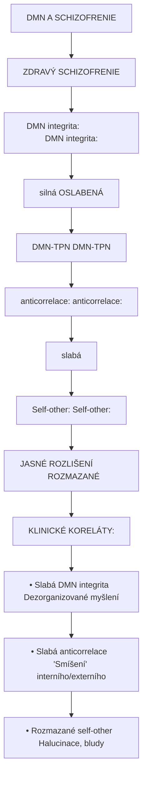

<details>
<summary>ASCII verze diagramu</summary>

```
    DMN A SCHIZOFRENIE

    ZDRAVÝ                           SCHIZOFRENIE
    ┌────────────────────┐          ┌────────────────────┐
    │                    │          │                    │
    │  DMN integrita:    │          │  DMN integrita:    │
    │  ═══════════════   │          │  ─ ─ ─ ─ ─ ─ ─ ─  │
    │  (silná)           │          │  (OSLABENÁ)        │
    │                    │          │                    │
    │  DMN-TPN           │          │  DMN-TPN           │
    │  anticorrelace:    │          │  anticorrelace:    │
    │  ↑↓↑↓↑↓↑↓↑↓       │          │  ↑↑↓↓↑↑↓↓ (slabá) │
    │                    │          │                    │
    │  Self-other:       │          │  Self-other:       │
    │  JASNÉ ROZLIŠENÍ   │          │  ROZMAZANÉ         │
    │                    │          │                    │
    └────────────────────┘          └────────────────────┘

    KLINICKÉ KORELÁTY:
    • Slabá DMN integrita → Dezorganizované myšlení
    • Slabá anticorrelace → "Smíšení" interního/externího
    • Rozmazané self-other → Halucinace, bludy
```

</details>

### Autismus

| DMN alterace | Klinicky korelat |
|--------------|------------------|
| Snizena konektivita | Potize se self-reflection |
| Atypicka mPFC aktivace | Theory of Mind deficity |
| Alterovana socialni kognice | Potize s empatii |

---

## Entropic Brain Hypothesis

### Koncept

```mermaid
flowchart TD
    node_ENTROPICBRAINHYPOTHE["ENTROPIC BRAIN HYPOTHESIS Carhart-Harris 2014"]
    node_ENTROPIEMOZKOVAKTIVI["ENTROPIE MOZKOVÉ AKTIVITY"]
    node_NzkOptimlnVysok["Nízká                Optimální              Vysoká"]
    node_entropieentropieentr["entropie             entropie               entropie"]
    node_rigidnnormlnflexibil["rigidní            normální             flexibilní"]
    node_bf75059c["▼                    ▼                      ▼"]
    node_DepreseZdravPsychede["• Deprese        • Zdravé        • Psychedel."]
    node_OCDvdomsta["• OCD              vědomí          sta"]
    node_ZvislostKreativita["• Závislost                      • Kreativita"]
    node_RigidInsight["• Rigid                          • Insight"]
    node_mylenFlexibilita["myšlení                        • Flexibilita"]
    node_DMNDMNTPNDMN["DMN            DMN-TPN           DMN"]
    node_plinvyvendoasn["přílišná       vyvážené         dočasně"]
    node_integritadezinteg["integrita                         dezinteg."]
    node_TERAPIE["TERAPIE"]
    node_Zvenflexibility["Zvýšení flexibility"]
    node_Resetrigidnchvzorc["'Reset' rigidních vzorců"]

    node_ENTROPICBRAINHYPOTHE --> node_ENTROPIEMOZKOVAKTIVI
    node_ENTROPIEMOZKOVAKTIVI --> node_NzkOptimlnVysok
    node_NzkOptimlnVysok --> node_entropieentropieentr
    node_entropieentropieentr --> node_rigidnnormlnflexibil
    node_rigidnnormlnflexibil --> node_bf75059c
    node_bf75059c --> node_DepreseZdravPsychede
    node_DepreseZdravPsychede --> node_OCDvdomsta
    node_OCDvdomsta --> node_ZvislostKreativita
    node_ZvislostKreativita --> node_RigidInsight
    node_RigidInsight --> node_mylenFlexibilita
    node_mylenFlexibilita --> node_DMNDMNTPNDMN
    node_DMNDMNTPNDMN --> node_plinvyvendoasn
    node_plinvyvendoasn --> node_integritadezinteg
    node_integritadezinteg --> node_TERAPIE
    node_TERAPIE --> node_Zvenflexibility
    node_Zvenflexibility --> node_Resetrigidnchvzorc
```

<details>
<summary>ASCII verze diagramu</summary>

```
    ENTROPIC BRAIN HYPOTHESIS (Carhart-Harris 2014)

    ENTROPIE MOZKOVÉ AKTIVITY

    Nízká                Optimální              Vysoká
    entropie             entropie               entropie
    (rigidní)            (normální)             (flexibilní)
        │                    │                      │
        ▼                    ▼                      ▼
    ┌─────────────┐    ┌─────────────┐     ┌─────────────┐
    │             │    │             │     │             │
    │  • Deprese  │    │  • Zdravé   │     │• Psychedel. │
    │  • OCD      │    │    vědomí   │     │  stav       │
    │  • Závislost│    │             │     │• Kreativita │
    │  • Rigid    │    │             │     │• Insight    │
    │    myšlení  │    │             │     │• Flexibilita│
    │             │    │             │     │             │
    │  DMN↑       │    │ DMN-TPN    │     │  DMN↓       │
    │  (přílišná  │    │ (vyvážené)  │     │  (dočasně   │
    │  integrita) │    │             │     │  dezinteg.) │
    │             │    │             │     │             │
    └─────────────┘    └─────────────┘     └─────────────┘
            │                                    │
            │                                    │
            └──────────── TERAPIE ──────────────┘
                         │
                         ▼
                  Zvýšení flexibility
                  "Reset" rigidních vzorců
```

</details>

### Terapeuticky model

```mermaid
flowchart TD
    node_TERAPEUTICKMODELREBU["TERAPEUTICKÝ MODEL REBUS"]
    node_REBUSRelaxedBeliefsU["REBUS = Relaxed Beliefs Under Psychedelics"]
    node_NORMLNSTAV["NORMÁLNÍ STAV:"]
    node_TOPDOWNPRIORSpredikc["TOP-DOWN PRIORS predikce"]
    node_6c5058ec["████████████████████"]
    node_SILNVLIVnavnmn["SILNÝ VLIV na vnímání"]
    node_ZkuenostCooekvmevidt["Zkušenost = Co 'očekáváme' vidět"]
    node_PSYCHEDELICKSTAV["PSYCHEDELICKÝ STAV:"]
    node_410ba1d3["░░░░░░░░░░░░░░░░░░░░"]
    node_oslaben["oslabené"]
    node_SNENVLIVnavnmn["SNÍŽENÝ VLIV na vnímání"]
    node_ZkuenostVcebottomup["Zkušenost = Více 'bottom-up'"]
    node_Novperspektivy["Nové perspektivy"]
    node_Flexibilninterpretac["Flexibilní interpretace"]
    node_TERAPEUTICKEFEKT["TERAPEUTICKÝ EFEKT:"]
    node_Uvolnnrigidnchpesvde["• 'Uvolnění' rigidních přesvědčení"]
    node_Pstupkpotlaenmumater["• Přístup k potlačenému materiálu"]
    node_Novnhledyinsights["• Nové náhledy insights"]
    node_Zvenkognitivnflexibi["• Zvýšená kognitivní flexibilita"]

    node_TERAPEUTICKMODELREBU --> node_REBUSRelaxedBeliefsU
    node_REBUSRelaxedBeliefsU --> node_NORMLNSTAV
    node_NORMLNSTAV --> node_TOPDOWNPRIORSpredikc
    node_TOPDOWNPRIORSpredikc --> node_6c5058ec
    node_6c5058ec --> node_SILNVLIVnavnmn
    node_SILNVLIVnavnmn --> node_ZkuenostCooekvmevidt
    node_ZkuenostCooekvmevidt --> node_PSYCHEDELICKSTAV
    node_PSYCHEDELICKSTAV --> node_410ba1d3
    node_410ba1d3 --> node_oslaben
    node_oslaben --> node_SNENVLIVnavnmn
    node_SNENVLIVnavnmn --> node_ZkuenostVcebottomup
    node_ZkuenostVcebottomup --> node_Novperspektivy
    node_Novperspektivy --> node_Flexibilninterpretac
    node_Flexibilninterpretac --> node_TERAPEUTICKEFEKT
    node_TERAPEUTICKEFEKT --> node_Uvolnnrigidnchpesvde
    node_Uvolnnrigidnchpesvde --> node_Pstupkpotlaenmumater
    node_Pstupkpotlaenmumater --> node_Novnhledyinsights
    node_Novnhledyinsights --> node_Zvenkognitivnflexibi
```

<details>
<summary>ASCII verze diagramu</summary>

```
    TERAPEUTICKÝ MODEL (REBUS)

    REBUS = Relaxed Beliefs Under Psychedelics

    NORMÁLNÍ STAV:
    ┌──────────────────────────────────────────────────┐
    │                                                   │
    │   TOP-DOWN PRIORS (predikce)                     │
    │          ████████████████████                    │
    │                  ↓                               │
    │   SILNÝ VLIV na vnímání                         │
    │                  ↓                               │
    │   Zkušenost = Co "očekáváme" vidět              │
    │                                                   │
    └──────────────────────────────────────────────────┘

    PSYCHEDELICKÝ STAV:
    ┌──────────────────────────────────────────────────┐
    │                                                   │
    │   TOP-DOWN PRIORS (predikce)                     │
    │          ░░░░░░░░░░░░░░░░░░░░                    │
    │                  ↓ (oslabené)                    │
    │   SNÍŽENÝ VLIV na vnímání                       │
    │                  ↓                               │
    │   Zkušenost = Více "bottom-up"                  │
    │               Nové perspektivy                   │
    │               Flexibilní interpretace            │
    │                                                   │
    └──────────────────────────────────────────────────┘

    TERAPEUTICKÝ EFEKT:
    • "Uvolnění" rigidních přesvědčení
    • Přístup k potlačenému materiálu
    • Nové náhledy (insights)
    • Zvýšená kognitivní flexibilita
```

</details>

---

## Mereni DMN

### Neuroimagingove metody

| Metoda | Co meri | Casove rozliseni | Prostorove rozliseni |
|--------|---------|------------------|----------------------|
| **fMRI (BOLD)** | Hemodynamicka odpoved | Sekundy | mm |
| **PET** | Metabolismus, receptory | Minuty | mm |
| **EEG** | Elektricka aktivita | ms | cm |
| **MEG** | Magneticka aktivita | ms | cm |

### fMRI analyzy DMN

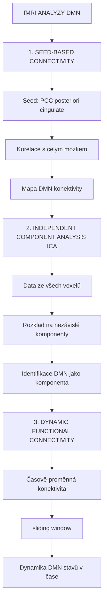

<details>
<summary>ASCII verze diagramu</summary>

```
    fMRI ANALYZY DMN

    1. SEED-BASED CONNECTIVITY
    ┌────────────────────────────────────────────┐
    │                                             │
    │   Seed: PCC (posteriori cingulate)         │
    │          ●                                  │
    │          │                                  │
    │          ↓                                  │
    │   Korelace s celým mozkem                  │
    │          ↓                                  │
    │   Mapa DMN konektivity                      │
    │                                             │
    └────────────────────────────────────────────┘

    2. INDEPENDENT COMPONENT ANALYSIS (ICA)
    ┌────────────────────────────────────────────┐
    │                                             │
    │   Data ze všech voxelů                      │
    │          ↓                                  │
    │   Rozklad na nezávislé komponenty          │
    │          ↓                                  │
    │   Identifikace DMN jako komponenta         │
    │                                             │
    └────────────────────────────────────────────┘

    3. DYNAMIC FUNCTIONAL CONNECTIVITY
    ┌────────────────────────────────────────────┐
    │                                             │
    │   Časově-proměnná konektivita              │
    │   (sliding window)                          │
    │          ↓                                  │
    │   Dynamika DMN stavů v čase                │
    │                                             │
    └────────────────────────────────────────────┘
```

</details>

### EEG markery DMN

| Marker | Banda | DMN korelat |
|--------|-------|-------------|
| **Alpha power** | 8-12 Hz | DMN aktivita (PCC) |
| **Alpha coherence** | 8-12 Hz | DMN konektivita |
| **Lempel-Ziv complexity** | - | DMN entropy |

---

## Klinicke implikace

### Terapeuticky potencial

```mermaid
flowchart TD
    node_TERAPEUTICKPOTENCILM["TERAPEUTICKÝ POTENCIÁL MODULACE DMN"]
    node_DEPRESE["DEPRESE"]
    node_ProblmHyperaktivnDMN["Problém: Hyperaktivní DMN  Ruminace"]
    node_TerapiePsychedelikam["Terapie: Psychedelika, meditace  DMN"]
    node_PTSD["PTSD"]
    node_ProblmDMNamygdalahyp["Problém: DMN-amygdala hyperkonektivita"]
    node_TerapieMDMApsilocybi["Terapie: MDMA, psilocybin  Reprocessing"]
    node_ZVISLOSTI["ZÁVISLOSTI"]
    node_ProblmRigidnDMNvzorc["Problém: Rigidní DMN vzorce"]
    node_TerapiePsychedelikaZ["Terapie: Psychedelika  Zvýšená flexibilita"]
    node_ZKOST["ÚZKOST"]
    node_ProblmDMNworryspojen["Problém: DMN-worry spojení"]
    node_TerapieMindfulnessps["Terapie: Mindfulness, psychedelika"]
    node_EXISTENCILNDISTRESte["EXISTENCIÁLNÍ DISTRES terminální onemocnění"]
    node_ProblmSelffokusovanz["Problém: Self-fokusovaná úzkost"]
    node_TerapiePsilocybinTra["Terapie: Psilocybin  Transcendence ego"]

    node_TERAPEUTICKPOTENCILM --> node_DEPRESE
    node_DEPRESE --> node_ProblmHyperaktivnDMN
    node_ProblmHyperaktivnDMN --> node_TerapiePsychedelikam
    node_TerapiePsychedelikam --> node_PTSD
    node_PTSD --> node_ProblmDMNamygdalahyp
    node_ProblmDMNamygdalahyp --> node_TerapieMDMApsilocybi
    node_TerapieMDMApsilocybi --> node_ZVISLOSTI
    node_ZVISLOSTI --> node_ProblmRigidnDMNvzorc
    node_ProblmRigidnDMNvzorc --> node_TerapiePsychedelikaZ
    node_TerapiePsychedelikaZ --> node_ZKOST
    node_ZKOST --> node_ProblmDMNworryspojen
    node_ProblmDMNworryspojen --> node_TerapieMindfulnessps
    node_TerapieMindfulnessps --> node_EXISTENCILNDISTRESte
    node_EXISTENCILNDISTRESte --> node_ProblmSelffokusovanz
    node_ProblmSelffokusovanz --> node_TerapiePsilocybinTra

    click node_TerapiePsychedelikam "/glossary/psychedelikum/" "Terapie: Psychedelika, meditace  DMN"
    click node_TerapieMDMApsilocybi "/alkaloids/psilocybin/" "Terapie: MDMA, psilocybin  Reprocessing"
    click node_TerapiePsychedelikaZ "/glossary/psychedelikum/" "Terapie: Psychedelika  Zvýšená flexibilita"
    click node_TerapieMindfulnessps "/glossary/psychedelikum/" "Terapie: Mindfulness, psychedelika"
    click node_TerapiePsilocybinTra "/alkaloids/psilocybin/" "Terapie: Psilocybin  Transcendence ego"
```

<details>
<summary>ASCII verze diagramu</summary>

```
    TERAPEUTICKÝ POTENCIÁL MODULACE DMN

    ┌──────────────────────────────────────────────────────┐
    │                                                       │
    │   DEPRESE                                            │
    │   ├── Problém: Hyperaktivní DMN → Ruminace          │
    │   └── Terapie: Psychedelika, meditace → DMN↓        │
    │                                                       │
    │   PTSD                                               │
    │   ├── Problém: DMN-amygdala hyperkonektivita        │
    │   └── Terapie: MDMA, psilocybin → Reprocessing      │
    │                                                       │
    │   ZÁVISLOSTI                                         │
    │   ├── Problém: Rigidní DMN vzorce                   │
    │   └── Terapie: Psychedelika → Zvýšená flexibilita   │
    │                                                       │
    │   ÚZKOST                                             │
    │   ├── Problém: DMN-worry spojení                    │
    │   └── Terapie: Mindfulness, psychedelika            │
    │                                                       │
    │   EXISTENCIÁLNÍ DISTRES (terminální onemocnění)     │
    │   ├── Problém: Self-fokusovaná úzkost              │
    │   └── Terapie: Psilocybin → Transcendence ego       │
    │                                                       │
    └──────────────────────────────────────────────────────┘
```

</details>

### Biomarkery

| Aplikace | DMN biomarker | Stav |
|----------|---------------|------|
| Diagnostika deprese | Hyperkonektivita mPFC-PCC | Vyzkum |
| Predikce odpovedi | Bazalni DMN aktivita | Slibne |
| Monitorovani terapie | Zmena konektivity | Vyzkum |
| Screening rizika | DMN-amygdala spojeni | Early stage |

---

## Reference

### Zakladni literatura

1. Raichle, M.E. et al. (2001). *A default mode of brain function*. PNAS.

2. Buckner, R.L. et al. (2008). *The brain's default network: anatomy, function, and relevance to disease*. Annals of the New York Academy of Sciences.

### Psychedelika a DMN

3. Carhart-Harris, R.L. et al. (2012). *Neural correlates of the psychedelic state as determined by fMRI studies with psilocybin*. PNAS.

4. Carhart-Harris, R.L. & Friston, K.J. (2019). *REBUS and the anarchic brain: toward a unified model of the brain action of psychedelics*. Pharmacological Reviews.

5. Daws, R.E. et al. (2022). *Increased global integration in the brain after psilocybin therapy for depression*. Nature Medicine.

### Entropic Brain

6. Carhart-Harris, R.L. et al. (2014). *The entropic brain: a theory of conscious states informed by neuroimaging research with psychedelic drugs*. Frontiers in Human Neuroscience.

### Meditace a DMN

7. Brewer, J.A. et al. (2011). *Meditation experience is associated with differences in default mode network activity and connectivity*. PNAS.

8. Garrison, K.A. et al. (2015). *Meditation leads to reduced default mode network activity beyond an active task*. Cognitive, Affective, & Behavioral Neuroscience.

### Klinicke aplikace

9. Whitfield-Gabrieli, S. & Ford, J.M. (2012). *Default mode network activity and connectivity in psychopathology*. Annual Review of Clinical Psychology.

10. Hamilton, J.P. et al. (2015). *Default-mode and task-positive network activity in major depressive disorder*. Biological Psychiatry.

---

## Viz take

### Mozkove site a okruhy
- [Neuralni okruhy](@/circuits/_index.md) - Prehled mozkovych siti
- [Mozek](@/brain/_index.md) - Anatomie mozkovych struktur

### Receptory a signalizace
- [5-HT2A receptor](@/receptors/5-ht2a.md) - Hlavni cil psychedelik
- [NMDA receptor](@/receptors/nmda.md) - Ketaminu relevant
- [GABA-A receptor](@/receptors/gaba-a.md) - Inhibicni kontrola

### Psychoaktivni latky
- [Psilocybin](@/alkaloids/psilocybin.md) - DMN-modulujici psychedelikum
- [LSD](@/alkaloids/lsd.md) - Potentni DMN disruptor
- [DMT](@/alkaloids/dmt.md) - Intenzivni ego dissolution
- [Psychedelikum](@/glossary/psychedelikum.md) - Prehled

### Neurobiologie
- [Neuroplasticita](@/glossary/neuroplasticita.md) - Strukturalni zmeny
- [Uceni](@/glossary/uceni.md) - Kognitivni procesy
- [Serotonin](@/glossary/serotonin.md) - Neurotransmiter

---

<- Zpet na [Neuralni okruhy](@/circuits/_index.md)
