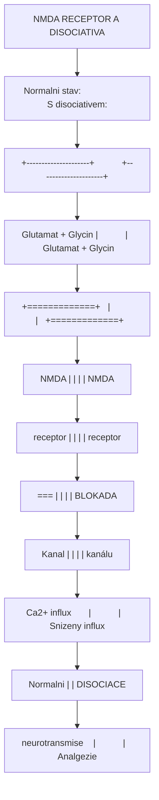
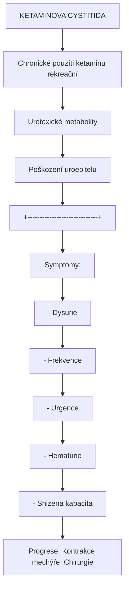

+++
title = "Disociativa"
description = "Disociativni trida psychoaktivnich latek - NMDA antagoniste, ketamin, PCP, DXM, mechanismus ucinku a terapeuticky potencial"
weight = 1
insert_anchor_links = "right"

[taxonomies]
categories = ["farmakologie", "tridy", "psychoaktivni latky"]
tags = ["disociativa", "NMDA", "ketamin", "PCP", "DXM", "MXE", "arylcyklohexylaminy", "K-hole", "antidepresiva"]
+++

# Disociativa - NMDA antagoniste a jejich farmakologie

**Disociativa** (dissociatives) jsou tridou psychoaktivnich latek charakterizovanou indukcí **disociativnich stavu** - senzorické a kognitivni odpojeni od reality, tela a identity. Primarne pusobi jako antagoniste [NMDA receptoru](@/receptors/nmda.md), i kdyz mnohe maji komplexni receptorovy profil.

Mezi nejznamejsi disociativa patri [ketamin](@/alkaloids/ketamin.md), fencyklidin (PCP), dextromethorfan (DXM) a methoxetamin (MXE). V poslednich letech ziskala trida znacnou pozornost diky prukopnickym studiim ukazujicim rychly antidepresivni ucinek ketaminu u [rezistentni deprese](@/conditions/depression.md).

---

## Klasifikace disociativ

### Chemicke tridy

```mermaid
flowchart TD
    node_DISOCIATIVACHEMICKET["DISOCIATIVA - CHEMICKE TRIDY"]
    node_34959a3e["+------------------------+"]
    node_ARYLCYKLOHEXYLAMINY["ARYLCYKLOHEXYLAMINY"]
    node_781f5987["------------------------"]
    node_Ketamin["Ketamin"]
    node_PCPfencyklidin["PCP fencyklidin"]
    node_MXEmethoxetamin["MXE methoxetamin"]
    node_3MeOPCP["3-MeO-PCP"]
    node_PCEDCK["PCE, DCK"]
    node_Strukturneodlisnepod["Strukturne odlisne, podobny ucinek"]
    node_MORFINANY["MORFINANY"]
    node_DXMdextromethorfan["DXM dextromethorfan"]
    node_Dextrorfan["Dextrorfan"]
    node_DALSISTRUKTURY["DALSI STRUKTURY"]
    node_Memantin["Memantin"]
    node_DizocilpinMK801["Dizocilpin MK-801"]
    node_NitrousoxideN2O["Nitrous oxide N2O"]
    node_Xenon["Xenon"]

    node_DISOCIATIVACHEMICKET --> node_34959a3e
    node_34959a3e --> node_ARYLCYKLOHEXYLAMINY
    node_ARYLCYKLOHEXYLAMINY --> node_781f5987
    node_781f5987 --> node_Ketamin
    node_Ketamin --> node_PCPfencyklidin
    node_PCPfencyklidin --> node_MXEmethoxetamin
    node_MXEmethoxetamin --> node_3MeOPCP
    node_3MeOPCP --> node_PCEDCK
    node_PCEDCK --> node_Strukturneodlisnepod
    node_Strukturneodlisnepod --> node_MORFINANY
    node_MORFINANY --> node_DXMdextromethorfan
    node_DXMdextromethorfan --> node_Dextrorfan
    node_Dextrorfan --> node_DALSISTRUKTURY
    node_DALSISTRUKTURY --> node_Memantin
    node_Memantin --> node_DizocilpinMK801
    node_DizocilpinMK801 --> node_NitrousoxideN2O
    node_NitrousoxideN2O --> node_Xenon

    click node_Ketamin "/alkaloids/ketamin/" "Ketamin"
    click node_PCPfencyklidin "/alkaloids/pcp/" "PCP fencyklidin"
    click node_3MeOPCP "/alkaloids/pcp/" "3-MeO-PCP"
    click node_DXMdextromethorfan "/alkaloids/dxm/" "DXM dextromethorfan"
```



<details>
<summary>ASCII verze diagramu</summary>

```
DISOCIATIVA - CHEMICKE TRIDY

+------------------------+
|  ARYLCYKLOHEXYLAMINY   |
|------------------------|
| Ketamin                |
| PCP (fencyklidin)      |
| MXE (methoxetamin)     |
| 3-MeO-PCP              |
| PCE, DCK               |
+------------------------+
         |
         |  Strukturne odlisne, podobny ucinek
         v
+------------------------+
|    MORFINANY           |
|------------------------|
| DXM (dextromethorfan)  |
| Dextrorfan             |
+------------------------+
         |
         v
+------------------------+
|  DALSI STRUKTURY       |
|------------------------|
| Memantin               |
| Dizocilpin (MK-801)    |
| Nitrous oxide (N2O)    |
| Xenon                  |
+------------------------+
```

</details>

### Srovnavaci tabulka

| Latka | Ki NMDA (nM) | Dalsi cile | Trvani | Legal status (CR) |
|-------|--------------|------------|--------|-------------------|
| **[Ketamin](@/alkaloids/ketamin.md)** | 500-3000 | Opioidni, Sigma | 1-2 h | Navykova latka |
| **PCP** | 50-100 | D2, Sigma, SERT | 4-8 h | Zakazana |
| **DXM** | 2000-8000 | SERT, Sigma, Opioidni | 4-8 h | OTC (kašel) |
| **MXE** | ~500 | SERT, Opioidni | 2-4 h | Zakazana |
| **3-MeO-PCP** | ~20 | Opioidni, Sigma | 4-8 h | Zakazana |
| **Memantin** | 500-1000 | Nizkoafinitni | 6-12 h | Lék (Alzheimer) |
| **N2O** | Vysoky Ki | GABA modulace | Minuty | Medicinalni |

---

## Mechanismus ucinku

### NMDA receptor blokada



<details>
<summary>ASCII verze diagramu</summary>

```
NMDA RECEPTOR A DISOCIATIVA

Normalni stav:                    S disociativem:
+---------------------+           +---------------------+
|                     |           |                     |
|   Glutamat + Glycin |           |   Glutamat + Glycin |
|        ↓    ↓       |           |        ↓    ↓       |
|   +=============+   |           |   +=============+   |
|   |   NMDA      |   |           |   |   NMDA      |   |
|   |   receptor  |   |           |   |   receptor  |   |
|   |             |   |           |   |    [X]      |   |
|   |   [===]     |   |           |   |   BLOKADA   |   |
|   |   Kanal     |   |           |   |   kanálu    |   |
|   +=============+   |           |   +=============+   |
|        ↓            |           |        X            |
|   Ca2+ influx       |           |   Snizeny influx    |
|        ↓            |           |        ↓            |
|   Normalni          |           |   DISOCIACE         |
|   neurotransmise    |           |   Analgezie         |
+---------------------+           +---------------------+
```

</details>

### Typ blokady

| Typ | Mechanismus | Priklady |
|-----|-------------|----------|
| **Kanalovy blokator** | Vstup do poru, usecopen-dependent | Ketamin, PCP, MK-801 |
| **Kompetitivni** | Glutamatove misto | APV, CPP |
| **Glycinove misto** | Koagonistní místo | 7-chlorokynurenate |

### Komplexni receptorovy profil

Disociativa typicky pusobi na vice receptorovych systemu:

| Receptor | Ketamin | PCP | DXM | Ucinek |
|----------|---------|-----|-----|--------|
| **NMDA** | +++ | ++++ | ++ | Hlavni disociativní |
| **Sigma-1** | + | ++ | +++ | Neuroprotekce, halucinace |
| **Opioidni (mu)** | + | + | ++ | Analgezie, euforie |
| **SERT** | - | + | +++ | Serotoninové efekty |
| **D2** | - | ++ | + | Psychotomimetika |
| **nACh** | + | ++ | + | Kognitivní |

---

## Fenomenologie disociativnich stavu

### Spektrum ucinku

```
DAVKOVE-ZAVISLY SPEKTRUM DISOCIACE

Dávka →
|
| Sub-hole        Light         Strong         K-hole/Anestézie
| 0.1-0.3 mg/kg   0.3-0.5       0.5-1.0       >1.0 mg/kg
|
| +-------------+-------------+-------------+--------------+
| |             |             |             |              |
| | Relaxace    | Disociace   | Silná       | Úplná        |
| | Mírná       | Zmeny       | disociace   | disociace    |
| | euforie     | vnimani     | "Floating"  | NDE-like     |
| | Analgezie   | Spatialní   | Telesná     | Ego smrt     |
| |             | dezorient.  | separace    | "Vesmírná"   |
| |             |             |             | jednota      |
| +-------------+-------------+-------------+--------------+
```

### "K-hole"

Intenzivni disociativni stav pri vyssich davkach ketaminu:

| Charakteristika | Popis |
|-----------------|-------|
| **Telesna disociace** | Úplne odpojeni od fyzikeho tela |
| **Ego disoluce** | Ztrata pocitu osobni identity |
| **Casova distorze** | Zastaveny cas, venost |
| **Prostorova dezorientace** | Ztrata prostoroveho vnimani |
| **Vizualni fenomeny** | Tunely, geometrie, "jine dimenze" |
| **NDE-like zazitky** | Podobnost near-death experience |
| **Amnézie** | Castecna retrogradui amnézie |
| **Noetická kvalita** | Pocit hluboke pravdy |

### Srovnani s psychedeliky

| Aspekt | Disociativa | Klasicka psychedelika |
|--------|-------------|----------------------|
| **Primární receptor** | [NMDA](@/receptors/nmda.md) | [5-HT2A](@/receptors/5-ht2a.md) |
| **Telesnost** | Anestetická, odpojení | Zesílení, zmenene |
| **Vizualy** | Geometricke, abstraktni | Organicke, komplexni |
| **Entity** | Vzacne | Castejsi |
| **Cas** | Zastaveny | Zpomaleny/zrychleny |
| **Ego disoluce** | "Odpojení" | "Splynutí" |
| **Emocionalita** | Tlumena | Zesílena |

---

## Jednotlive latky

### Ketamin

**Komplexni profil viz:** [Ketamin](@/alkaloids/ketamin.md)

| Parametr | Hodnota |
|----------|---------|
| **Chemie** | Arylcyklohexylamin |
| **Ki NMDA** | 500-3000 nM |
| **Trvani** | 1-2 hodiny |
| **ROA** | IV, IM, IN, PO |
| **Legal status** | Navykova latka, medicinsky |
| **Terapeuticky potencial** | Antidepresivum (Spravato) |

### Fencyklidin (PCP)

```
PCP - PROFIL

Chemicky nazev: 1-(1-fenylcyklohexyl)piperidin
Struktura:
       [===]
      /     \
     /       \
    [=]     [=]
     \       /
      [N]--[Piperidin]
       |
   [Cyklohexan]
```

| Parametr | Hodnota |
|----------|---------|
| **Syntetizovan** | 1926 (Parke-Davis) |
| **Puvodne pouziti** | Anestetikum (1950s) |
| **Stazeni** | 1965 (psychotické reakce) |
| **Ki NMDA** | 50-100 nM (velmi vysoká afinita) |
| **Dalsi receptory** | D2, Sigma, SERT |
| **Trvani** | 4-8 hodin |
| **Rizika** | Psychoza, agresivita, neurotoxicita |
| **Legal status** | Schedule II (USA), Zakazana (CR) |

**Klinicke poznamky**:
- Vyrazna psychotomimetika (vice nez ketamin)
- Riziko perzistentni psychozy
- Chronické pouziti = neurotoxicita
- Historicky vyuziti jako model schizofrenie

### Dextromethorfan (DXM)

| Parametr | Hodnota |
|----------|---------|
| **Chemie** | Morfinan (dextrorotatorni) |
| **Primární pouziti** | Antitusikum (OTC) |
| **Ki NMDA** | 2000-8000 nM (nižší afinita) |
| **Dalsi cile** | Sigma-1 (+++), SERT (+++), Opioidni |
| **Trvani** | 4-8 hodin |
| **Metabolit** | Dextrorfan (aktivní) |
| **CYP2D6** | Polymorfismus ovlivnuje ucinek |
| **Legal status** | OTC (Robitussin, apod.) |

**"Plateaux" systém** (rekreacni terminologie):

| Plateau | Dávka | Charakteristika |
|---------|-------|-----------------|
| **1st** | 100-200 mg | Stimulace, mírna euforie |
| **2nd** | 200-400 mg | Disociace, vizuální změny |
| **3rd** | 400-600 mg | Silna disociace, K-hole-like |
| **4th** | >600 mg | Úplná disociace, delirium |

**Varování**:
- OTC produkty obsahují dalsi latky (guaifenesin, acetaminofen) - toxicita
- Serotonin syndrom pri kombinaci s SSRI/MAOi

### Methoxetamin (MXE)

| Parametr | Hodnota |
|----------|---------|
| **Chemie** | Arylcyklohexylamin (ketamin analog) |
| **Puvod** | Designer drug (2010) |
| **Ki NMDA** | ~500 nM |
| **Dalsi cile** | SERT, Opioidni |
| **Trvani** | 2-4 hodiny |
| **Ucinky** | Mezi ketaminem a PCP |
| **Legal status** | Zakazana (CR, EU) |

### 3-MeO-PCP

| Parametr | Hodnota |
|----------|---------|
| **Chemie** | PCP analog s methoxy skupinou |
| **Ki NMDA** | ~20 nM (velmi vysoká) |
| **Dalsi cile** | Opioidni, Sigma |
| **Trvani** | 4-8 hodin |
| **Charakteristika** | Manie-like, stimulacni |
| **Rizika** | Psychoza, manie, predavkovani |
| **Legal status** | Zakazana (CR) |

### Dalsi disociativa

| Latka | Charakteristika | Status |
|-------|-----------------|--------|
| **N2O** (oxid dusny) | Kratce pusobici, medicinalni | Volne (medicinalni) |
| **Memantin** | Nizkoafinitni, Alzheimer | Lek |
| **Dizocilpin (MK-801)** | Vysoka afinita, výzkumný | Experimentalni |
| **Xenon** | Anestetikum, neuroprotekce | Medicinalni |
| **DCK** | Ketamin analog | NPS |

---

## Terapeuticky potencial

### Ketamin v psychiatrii

```mermaid
flowchart TD
    node_KETAMINTERAPEUTICKEA["KETAMIN - TERAPEUTICKE APLIKACE"]
    node_cf3533c5["+------------------+     +------------------+"]
    node_AKUTNIUCINEKNEUROPLA["AKUTNI UCINEK    |     | NEUROPLASTICITA"]
    node_64581a73["------------------|     |------------------"]
    node_DisociaceBDNFzvyseni["Disociace        |     | BDNF zvyseni"]
    node_AnalgeziemTORaktivac["Analgezie        |     | mTOR aktivace"]
    node_RelaxaceSynaptogenez["Relaxace         |     | Synaptogeneze"]
    node_9809d797["+--------+---------+     +--------+---------+"]
    node_559f279b["+------------+-----------+"]
    node_34959a3e["+------------------------+"]
    node_KLINICKEINDIKACE["KLINICKE INDIKACE"]
    node_781f5987["------------------------"]
    node_Rezistentnideprese["Rezistentni deprese"]
    node_Akutnisuicidalita["Akutni suicidalita"]
    node_Chronickabolest["Chronicka bolest"]
    node_PTSDvzkum["PTSD výzkum"]
    node_OCDvzkum["OCD výzkum"]

    node_KETAMINTERAPEUTICKEA --> node_cf3533c5
    node_cf3533c5 --> node_AKUTNIUCINEKNEUROPLA
    node_AKUTNIUCINEKNEUROPLA --> node_64581a73
    node_64581a73 --> node_DisociaceBDNFzvyseni
    node_DisociaceBDNFzvyseni --> node_AnalgeziemTORaktivac
    node_AnalgeziemTORaktivac --> node_RelaxaceSynaptogenez
    node_RelaxaceSynaptogenez --> node_9809d797
    node_9809d797 --> node_559f279b
    node_559f279b --> node_34959a3e
    node_34959a3e --> node_KLINICKEINDIKACE
    node_KLINICKEINDIKACE --> node_781f5987
    node_781f5987 --> node_Rezistentnideprese
    node_Rezistentnideprese --> node_Akutnisuicidalita
    node_Akutnisuicidalita --> node_Chronickabolest
    node_Chronickabolest --> node_PTSDvzkum
    node_PTSDvzkum --> node_OCDvzkum

    click node_KETAMINTERAPEUTICKEA "/alkaloids/ketamin/" "KETAMIN - TERAPEUTICKE APLIKACE"
    click node_AKUTNIUCINEKNEUROPLA "/glossary/neuroplasticita/" "AKUTNI UCINEK    |     | NEUROPLASTICITA"
    click node_DisociaceBDNFzvyseni "/molecules/bdnf/" "Disociace        |     | BDNF zvyseni"
    click node_Rezistentnideprese "/conditions/depression/" "Rezistentni deprese"
```



<details>
<summary>ASCII verze diagramu</summary>

```
KETAMIN - TERAPEUTICKE APLIKACE

+------------------+     +------------------+
| AKUTNI UCINEK    |     | NEUROPLASTICITA  |
|------------------|     |------------------|
| Disociace        |     | BDNF zvyseni     |
| Analgezie        |     | mTOR aktivace    |
| Relaxace         |     | Synaptogeneze    |
+--------+---------+     +--------+---------+
         |                        |
         +------------+-----------+
                      |
                      v
         +------------------------+
         | KLINICKE INDIKACE     |
         |------------------------|
         | Rezistentni deprese    |
         | Akutni suicidalita     |
         | Chronicka bolest       |
         | PTSD (výzkum)          |
         | OCD (výzkum)           |
         +------------------------+
```

</details>

### Esketamin (Spravato)

| Parametr | Hodnota |
|----------|---------|
| **Forma** | Nazalni sprej |
| **Davka** | 56-84 mg |
| **Indikace** | TRD, MDD s akutni suicidalitou |
| **FDA schvaleni** | 2019, 2020 |
| **REMS program** | Ano (supervised administration) |
| **Efektivita** | ~50-70% response rate |

### Budouci smery

| Oblast | Latka/Pristup | Status |
|--------|---------------|--------|
| **Oralni ketamin** | Racemát tablety | Off-label |
| **(R)-Ketamin** (Arketamin) | Mene vedlejsich ucinku? | Phase II |
| **Hydroxynorketamin** | Bez disociace | Preklinicka |
| **NMDA modulatory** | Rapastinel, Zelquistinel | Phase II/III |
| **Esmetamin IV** | Infuze | Phase III |

---

## Bezpecnost a rizika

### Akutni rizika

| Riziko | Mechanismus | Management |
|--------|-------------|------------|
| **Psychóza** | Dopamín, NMDA dysbalance | Antipsychotika |
| **Kardiovaskulární** | Sympatická aktivace | Monitoring, kontraindikace |
| **Aspirace** | Anestézie + zvracení | Pozice na boku |
| **Uraz** | Koordinace, necitlivost | Bezpecne prostredi |
| **Hypertermie** | PCP predevším | Chlazení |

### Chronicka rizika

| Riziko | Látky | Prevence |
|--------|-------|----------|
| **Cystitida** | Ketamin | Omezení frekvence |
| **Kognitivní deficit** | PCP, chronické pouzití | Abstinence |
| **Závislost** | Vsechny (psychicka) | Kontrolovane pouziti |
| **Persistentní psychóza** | PCP, predisponovaní | Screening |
| **Neurotoxicita** | Vysoké dávky, chronické | Harm reduction |

### Ketaminova cystitida



<details>
<summary>ASCII verze diagramu</summary>

```
KETAMINOVA CYSTITIDA

Chronické pouzíti ketaminu (rekreační)
              |
              v
Urotoxické metabolity
              |
              v
Poškození uroepitelu
              |
              v
+-----------------------------+
| Symptomy:                   |
| - Dysurie                   |
| - Frekvence                 |
| - Urgence                   |
| - Hematurie                 |
| - Snizena kapacita          |
+-----------------------------+
              |
              v
Progrese → Kontrakce mechýře → Chirurgie
```

</details>

### Lekove interakce

| Kombinace | Riziko | Zavaznost |
|-----------|--------|-----------|
| **+ CNS depresanty** | Respiracni deprese | Vysoka |
| **+ MAOi** | Hypertenzni krize | Vysoka |
| **+ SSRI (DXM)** | Serotonin syndrom | Vysoka |
| **+ Stimulanty** | Kardiovaskulárni | Stredni |
| **+ Alkohol** | Potenciace, toxicita | Vysoka |

---

## Harm reduction

### Zasady bezpecnejsiho uzívani

| Zasada | Implementace |
|--------|--------------|
| **Testovani** | Reagencni testy (Mandelin, Mecke) |
| **Start low** | Minimalni davka na zacatek |
| **Set & setting** | Bezpecne prostredi, sitter |
| **Hydratace** | Dostatek tekutin |
| **Zádna kombinace** | Zvlaste CNS depresanty |
| **Frekvence** | Max 1-2x mesicne (rekreacne) |
| **Zdravotni stav** | Zadne KV choroby, glaukom |

### Specificka doporuceni

| Latka | Specificke riziko | Opatreni |
|-------|-------------------|----------|
| **Ketamin** | Cystitida | Omezení frekvence, hydratace |
| **DXM** | Prísady v OTC | Pure DXM produkty |
| **PCP** | Psychoza, agrese | Extrémní opatrnost |
| **MXE** | Predavkovani | Presne davkovani |

---

## Reference

### Zakladni literatura

1. Lodge, D. & Mercier, M.S. (2015). *Ketamine and phencyclidine: the good, the bad and the unexpected*. British Journal of Pharmacology.

2. Morris, H. & Wallach, J. (2014). *From PCP to MXE: a comprehensive review of the non-medical use of dissociative drugs*. Drug Testing and Analysis.

3. Domino, E.F. (2010). *Taming the ketamine tiger*. Anesthesiology.

### Terapeuticky potencial

4. Zarate, C.A. et al. (2006). *A randomized trial of an N-methyl-D-aspartate antagonist in treatment-resistant major depression*. Archives of General Psychiatry.

5. Krystal, J.H. et al. (2019). *Ketamine: A Paradigm Shift for Depression Research and Treatment*. Neuron.

6. Popova, V. et al. (2019). *Efficacy and Safety of Flexibly Dosed Esketamine Nasal Spray Combined With a Newly Initiated Oral Antidepressant in Treatment-Resistant Depression*. American Journal of Psychiatry.

### Neurobiologie

7. Moghaddam, B. et al. (1997). *Activation of glutamatergic neurotransmission by ketamine: a novel step in the pathway from NMDA receptor blockade to dopaminergic and cognitive disruptions associated with the prefrontal cortex*. Journal of Neuroscience.

8. Zanos, P. et al. (2016). *NMDAR inhibition-independent antidepressant actions of ketamine metabolites*. Nature.

### Bezpecnost

9. Morgan, C.J. et al. (2010). *Ketamine use, cognition and psychological wellbeing: a comparison of frequent, infrequent and ex-users with polydrug and non-using controls*. Addiction.

10. Shahani, R. et al. (2007). *Ketamine-associated ulcerative cystitis: a new clinical entity*. Urology.

---

## Viz take

### Jednotlive latky
- [Ketamin](@/alkaloids/ketamin.md) - Hlavni terapeuticke disociativum
- [DXM](@/alkaloids/dxm.md) - OTC disociativum
- [PCP](@/alkaloids/pcp.md) - Historicke disociativum

### Receptory
- [NMDA receptor](@/receptors/nmda.md) - Primární cíl
- [AMPA receptor](@/receptors/ampa.md) - Sekundární efekty
- [Sigma-1 receptor](@/receptors/sigma-1.md) - Neuromodulace

### Srovnani
- [Psychedelika](@/glossary/psychedelikum.md) - Odlisná třída
- [5-HT2A receptor](@/receptors/5-ht2a.md) - Cíl psychedelik

### Terapeuticke aplikace
- [Deprese](@/conditions/depression.md) - Hlavní indikace ketaminu
- [BDNF](@/molecules/bdnf.md) - Mechanismus antidepresivního ucinku
- [Neuroplasticita](@/glossary/neuroplasticita.md) - Synaptogeneze

### Fenomenologie
- [Mysticke zkusenosti](@/phenomenology/mystical-experiences.md) - Srovnani s psychedeliky

---

<- Zpět na [Farmakologické třídy](@/classes/_index.md)
