+++
title = "GABA modulatory"
description = "Komplexni klasifikace GABAergních latek - benzodiazepiny, barbituráty, neurosteroidyá, Z-léky, alkohol, klinické profily a farmakologie"
date = 2026-01-30
updated = 2026-01-30
draft = false
weight = 2

[taxonomies]
categories = ["farmakologie", "neurofarmakologie", "klasifikace"]
tags = ["GABA", "benzodiazepiny", "barbituráty", "neurosteroidyá", "Z-léky", "alkohol", "GABA-A", "sedativa", "anxiolytika", "hypnotika"]

[extra]
lead = "GABA modulatory jsou siroka skupina latek pusobicich na GABAergní system - hlavni inhibicni neurotransmiterovy system mozku. Zahrnuji benzodiazepiny, barbituráty, neurosteroidyá, Z-léky a alkohol. Kazda trida ma specificky mechanismus, klinicky profil a bezpecnostni rizika."
complexity = "pokrocila"
reading_time = "35 min"
+++

# GABA modulatory - Komplexni klasifikace

**GABA modulatory** jsou farmakologicky heterogenni skupina latek, ktere zvysuji GABAergní inhibici v centralnim nervovem systemu. Pusobi na [GABA-A receptor](@/receptors/gaba-a.md) nebo [GABA-B receptor](@/receptors/gaba-b.md) prostrednictvim ruznych mechanismu - od prime aktivace az po alosterickou modulaci.

---

## Prehled GABA modulatoru

### Klasifikace podle mechanismu

```mermaid
graph TD
    subgraph "GABA-A receptor - vazebna mista"
        GABAR[GABA-A receptor<br/>α β γ δ podjednotky]

        subgraph "Ortostericke misto"
            ORTH[GABA vazebne misto<br/>α/β interface]
        end

        subgraph "Alostericka mista"
            BZ[BZ site<br/>α/γ interface]
            BARB[Barbiturátový site<br/>β TM domena]
            NEURO[Neurosteroidový site<br/>α/β TM domena]
            ALC[Alkoholova mista<br/>multipočetna]
        end
    end

    subgraph "1. Primy agoniste"
        GABA1[GABA endogenni]
        MUSC[Muscimol<br/>Amanita muscaria]
        THIP[Gaboxadol THIP]

        GABA1 --> ORTH
        MUSC --> ORTH
        THIP --> ORTH
    end

    subgraph "2. Pozitivni alostericke modulatory PAM"
        subgraph "Benzodiazepiny"
            BZ1[Diazepam]
            BZ2[Alprazolam]
            BZ3[Clonazepam]
        end

        subgraph "Barbituráty"
            BARB1[Fenobarbital<br/>dlouhe T1/2]
            BARB2[Thiopental<br/>ultrakratke T1/2]
        end

        subgraph "Neurosteroidyá"
            NEU1[Alopregnanolone<br/>endogenni]
            NEU2[Brexanolone<br/>synteticky]
        end

        subgraph "Z-léky"
            Z1[Zolpidem α1 selektivni]
            Z2[Zopiclon]
        end

        ALCO[Ethanol<br/>multipočetny mechanismus]

        BZ1 --> BZ
        BZ2 --> BZ
        BZ3 --> BZ

        BARB1 --> BARB
        BARB2 --> BARB

        NEU1 --> NEURO
        NEU2 --> NEURO

        Z1 --> BZ
        Z2 --> BZ

        ALCO --> ALC
    end

    subgraph "3. GABA-B agoniste"
        BAC[Baclofen]
        GHB[GHB]
        FEN[Fenibut]

        GABB[GABA-B receptor<br/>Gi/o spojeny]

        BAC --> GABB
        GHB --> GABB
        FEN --> GABB
    end

    subgraph "4. Degradace/reuptake inhibitory"
        VIG[Vigabatrin<br/>GABA-T inhibitor]
        TIA[Tiagabin<br/>GAT-1 inhibitor]

        SYNT[GABA synteza ↑]
        REUPT[GABA reuptake ↓]

        VIG --> SYNT
        TIA --> REUPT
    end

    classDef agonist fill:#22c55e,stroke:#16a34a,stroke-width:2px,color:#f8fafc
    classDef modulator fill:#3b82f6,stroke:#2563eb,stroke-width:2px,color:#f8fafc
    classDef receptor fill:#8b5cf6,stroke:#7c3aed,stroke-width:2px,color:#f8fafc
    classDef site fill:#f59e0b,stroke:#d97706,stroke-width:1px

    class GABA1,MUSC,THIP,BAC,GHB,FEN agonist
    class BZ1,BZ2,BZ3,BARB1,BARB2,NEU1,NEU2,Z1,Z2,ALCO,VIG,TIA modulator
    class GABAR,GABB receptor
    class ORTH,BZ,BARB,NEURO,ALC site
```



### Srovnavaci prehled

| Trida | Vazebne misto | Mechanismus | Terapeut. okno | Zavislost | Smrtelne predavkovani |
|-------|---------------|-------------|----------------|-----------|----------------------|
| **Benzodiazepiny** | α/γ interface | Frekvence otevirani | Siroke | Stredni | Vzacne (samo o sobe) |
| **Barbituráty** | β TM domena | Doba otevreni | **Uzke** | Vysoka | **ANO** |
| **Neurosteroidyá** | α/β TM domena | Potenciace + prime | Stredni | Nizka | Nizke riziko |
| **Z-léky** | α1 selektivni BZ | Sedace (α1) | Stredni | Stredni | Vzacne |
| **Alkohol** | Vice mist | Komplexni | **Uzke** | Vysoka | **ANO** |
| **GHB** | GABA-B + GHB-R | Agonismus | **Velmi uzke** | Vysoka | **ANO** |

### Klinicke profily GABA modulatoru

| Třída | Příklady | Klinické použití |
|-------|----------|------------------|
| **Benzodiazepiny** | Diazepam, Alprazolam | Úzkost, nespavost |
| **Barbituráty** | Fenobarbital | Epilepsie, anestézie |
| **Neurosteroidyá** | Alopregnanolone | Postpartum deprese |
| **Z-léky** | Zolpidem, Zopiclon | Nespavost |
| **Alkohol** | Ethanol | Rekreační |

---

## Benzodiazepiny

### Mechanismus ucinku

Benzodiazepiny se vazi na rozhrani alfa/gamma podjednotek [GABA-A receptoru](@/receptors/gaba-a.md) a zvysuji **frekvenci otevirani chloridoveho kanalu** v odpovedi na GABA.

```
MECHANISMUS BENZODIAZEPINU

Bez BZ:                    S BZ (napr. Diazepam):

GABA                       GABA + BZ
  |                           |
  v                           v
GABA-A receptor            GABA-A receptor
  |                           |
  v                           v
Otevreni kanalu            Otevreni kanalu
1x za casovou jednotku     3-5x za casovou jednotku
  |                           |
  v                           v
Cl- influx: 10 pA         Cl- influx: 30-50 pA
  |                           |
  v                           v
Mirna inhibice             SILNA inhibice

KLICOVA VLASTNOST:
BZ ZVYSUJI FREKVENCI, NE DOBU otevreni
→ BZ NEMAJI ucinek BEZ GABA (bezpecnostni mechanismus)
→ Existuje strop ucinku ("ceiling effect")
→ Proto jsou BZ bezpecnejsi nez barbituráty
```

### Subtypova selektivita

| Subtyp GABA-A | Funkce | Relevance pro BZ |
|----------------|--------|-------------------|
| **α1βγ** | Sedace, amnezie, antikonvulze | Zolpidem selektivni |
| **α2βγ** | **Anxiolyza** (hlavni cil) | TPA023 (vyzkumny) |
| **α3βγ** | Myorelaxace | Castecne BZ |
| **α5βγ** | Pamet (hippocampus) | α5IA (inverzni agonista) |

Klasicke benzodiazepiny jsou **neselektivni** - pusobi na vsechny subtypy α1-3,5 → proto maji siroky ucinkovy profil (anxiolyza + sedace + amnezie + myorelaxace).

### Kompletni klasifikace benzodiazepinu

#### Podle polocasu rozpadu

| Kategorie | T1/2 | Priklady | Hlavni indikace |
|-----------|------|----------|-----------------|
| **Ultrakrátke** | <6 h | Midazolam, Triazolam | Premedikace, insomnie |
| **Krátke** | 6-12 h | Oxazepam, Lorazepam, Alprazolam | Akutni uzkost, panické |
| **Stredni** | 12-24 h | Bromazepam, Nitrazepam | Uzkost, insomnie |
| **Dlouhe** | >24 h | Diazepam, Clonazepam, Chlordiazepoxid | Epilepsie, abstinence |

#### Detailni farmakologicke profily

**DIAZEPAM (Valium) - referencni benzodiazepin**

| Parametr | Hodnota |
|----------|---------|
| Biodostupnost | ~100% (p.o.) |
| Tmax | 30-90 min |
| T1/2 | 20-100 h (vcetne metabolitu) |
| Aktivni metabolity | Desmethyldiazepam (T1/2: 36-200 h), Oxazepam |
| Vazba na proteiny | 98% |
| Metabolismus | CYP3A4, CYP2C19 |
| Potence (relativni) | 1x (reference) |
| Ekvivalentni davka | 10 mg |

```
METABOLISMUS DIAZEPAMU

Diazepam (T1/2: 20-100 h)
     |
     +--[CYP3A4]--→ Temazepam (T1/2: 8-22 h)
     |                    |
     |                    +--[UGT]--→ Glukuronid (eliminace)
     |
     +--[CYP2C19]--→ Desmethyldiazepam (Nordiazepam)
                         (T1/2: 36-200 h !!!)
                              |
                              +--[CYP3A4]--→ Oxazepam (T1/2: 5-15 h)
                                                  |
                                                  +--[UGT]--→ Glukuronid

VYZNAM: Dlouhe aktivni metabolity → kumulace pri opakovane
davkovani → predlouzena sedace u senioru
```

**ALPRAZOLAM (Xanax) - krátce pusobici, vysoka potence**

| Parametr | Hodnota |
|----------|---------|
| Biodostupnost | 80-100% |
| Tmax | 1-2 h |
| T1/2 | 6-12 h |
| Aktivni metabolity | Alfa-hydroxyalprazolam (slabe aktivni) |
| Potence (relativni) | 20x diazepam |
| Ekvivalentni davka | 0.5 mg |
| Zavislostni potencial | **Vysoky** (rychly nastup, kratky T1/2) |

**CLONAZEPAM (Rivotril) - dlouhodoby, antiepilepticky**

| Parametr | Hodnota |
|----------|---------|
| Biodostupnost | ~90% |
| Tmax | 1-4 h |
| T1/2 | 18-50 h |
| Metabolismus | CYP3A4 (nitroredukce, acetylace) |
| Potence (relativni) | 20x diazepam |
| Ekvivalentni davka | 0.5 mg |
| Hlavni indikace | Epilepsie, panieka porucha |

**LORAZEPAM (Temesta) - stredne pusobici, bez aktivnich metabolitu**

| Parametr | Hodnota |
|----------|---------|
| Biodostupnost | ~90% |
| Tmax | 2 h |
| T1/2 | 10-20 h |
| Metabolismus | Prima glukuronidace (UGT) - BEZ CYP |
| Aktivni metabolity | Zadne |
| Potence (relativni) | 10x diazepam |
| Ekvivalentni davka | 1 mg |
| Vyhoda | Bezpecny u jaterni insuficience |

### Ekvivalencni tabulka benzodiazepinu

| BZ | Ekvivalentni davka (mg) | T1/2 (h) | Nastup | Hlavni indikace |
|----|------------------------|----------|--------|-----------------|
| **Diazepam** | 10 | 20-100 | Rychly | Reference, abstinence |
| **Alprazolam** | 0.5 | 6-12 | Rychly | Panicka porucha |
| **Clonazepam** | 0.5 | 18-50 | Stredni | Epilepsie, panika |
| **Lorazepam** | 1 | 10-20 | Stredni | Akutni uzkost, status EP |
| **Oxazepam** | 15-30 | 5-15 | Pomaly | Uzkost (seniori) |
| **Bromazepam** | 3-6 | 12-20 | Stredni | Uzkost |
| **Midazolam** | 3.75 | 1.5-2.5 | Velmi rychly | Premedikace, sedace |
| **Nitrazepam** | 5-10 | 15-38 | Stredni | Insomnie |
| **Flunitrazepam** | 0.5-1 | 18-26 | Rychly | Insomnie (stazeny) |
| **Chlordiazepoxid** | 25 | 5-30 | Stredni | Alkoholova abstinence |

### Klinicke pouziti

| Indikace | Preferovany BZ | Duvod |
|----------|----------------|-------|
| **Akutni uzkost** | Lorazepam, Alprazolam | Rychly nastup |
| **Panicka porucha** | Alprazolam, Clonazepam | Vysoka potence |
| **Generalizovana uzkost** | Diazepam, Bromazepam | Plynuly ucinek |
| **Insomnie** | Nitrazepam, Midazolam | Sedativni profil |
| **Epilepsie (akutni)** | Diazepam i.v., Lorazepam i.v. | Rychla antikonvulze |
| **Epilepsie (chronicka)** | Clonazepam, Clobazam | Dlouhodoby ucinek |
| **Alkoholova abstinence** | Diazepam, Chlordiazepoxid | Dlouhy T1/2, krize |
| **Spasticita** | Diazepam | Myorelaxacni ucinek |
| **Premedikace** | Midazolam | Amnezie, anxiolyza |

### Nežádoucí ucinky a rizika

| Ucinek | Mechanismus | α subtyp | Prevence |
|--------|-------------|----------|----------|
| **Sedace** | α1 aktivace | α1 | Nizsi davky, α2/3 selektivni |
| **Amnézie** | α1, α5 | α1, α5 | Nizsi davky |
| **Ataxie** | α1, α6 | Cerebellum | Opatrnost u senioru |
| **Kognitívní deficit** | α5 | Hippocampus | Casove omezeni lecby |
| **Paradoxni reakce** | Nezname | - | Vysazeni |
| **Respiracni deprese** | Kombinace s opioidy | - | **Nekombinovat** |
| **Tolerance** | Down-regulace receptoru | Vsechny | Intermitentni davkovani |
| **Zavislost** | Neuroadaptace | Vsechny | Max 2-4 tydny |

---

## Barbituráty

### Mechanismus ucinku

Barbituráty se vazi na beta transmembrannovou domenu [GABA-A receptoru](@/receptors/gaba-a.md) a **prodluzuji dobu otevreni chloridoveho kanalu**. Na rozdil od benzodiazepinu mohou pri vysokych davkach aktivovat receptor i **BEZ GABA**.

```
MECHANISMUS BARBITURÁTU

Nizke davky:                  Vysoke davky:

GABA + Barbiturát              Barbiturát (samotny)
     |                              |
     v                              v
GABA-A receptor                GABA-A receptor
     |                              |
     v                              v
Prodlouzena doba otevreni     PRIME otevreni kanalu
(2 ms → 10-20 ms)            BEZ GABA
     |                              |
     v                              v
Zesílena inhibice              NEKONTROLOVANA inhibice
     |                              |
     v                              v
Terapeuticky ucinek            PREDAVKOVANI
(sedace, antikonvulze)         (koma, smrt)

KLICOVY ROZDIL OD BZ:
- Barbituráty MOHOU otevrit kanal BEZ GABA
- NEMAJÍ strop ucinku ("no ceiling effect")
- → UZKE terapeuticke okno
- → SMRTELNE predavkovani je mozne
```

### Klasifikace barbiturátu

| Kategorie | T1/2 | Priklad | Pouziti | Status |
|-----------|------|---------|---------|--------|
| **Ultrakrátke** | <30 min | Thiopental, Methohexital | IV anestezie (indukce) | Aktivni |
| **Krátke** | 1-6 h | Pentobarbital, Secobarbital | Historicky insomnie | Vetsinou stazeny |
| **Stredni** | 6-12 h | Amobarbital, Butalbarbital | Historicky sedace | Omezene |
| **Dlouhe** | 12-100+ h | **Fenobarbital**, Primidon | **Epilepsie** | Aktivni |

### Fenobarbital - klinicky relevantni barbiturát

| Parametr | Hodnota |
|----------|---------|
| Biodostupnost | 80-100% (p.o.) |
| Tmax | 1-6 h |
| T1/2 | **53-118 h** (extremne dlouhy) |
| Metabolismus | CYP2C9 (castecne), renalni exkrece (25%) |
| Terapeuticke rozmezi | 15-40 ug/ml |
| Toxicke hladiny | >40 ug/ml |
| Letalni hladiny | >80 ug/ml |
| Hlavni indikace | Epilepsie, status epilepticus, neonatalni krecě |
| Indukcni efekt | **Silny CYP induktor** (CYP3A4, CYP2C, CYP1A2) |

### Barbituráty - klinicka bezpecnost

| Aspekt | Hodnoceni |
|--------|-----------|
| Terapeuticke okno | **Uzke** (letalni davka = 5-10x terapeuticka) |
| Predavkovani | Potencialne smrtelne (respiracni deprese) |
| Antidotum | **Neexistuje** (podpurna pece) |
| Tolerance | Rychla a vyznamna |
| Zavislost | **Vysoka** |
| Abstinenční syndrom | **Zivot ohrozujici** (krecě, delirium) |
| Soucasny status | Vetsinou nahrazeny BZ a novejsimi leky |

---

## Neurosteroidyá

### Definice a puvod

Neurosteroidyá jsou steroidni slouceniny syntetizovane v CNS nebo periferii, ktere moduluji [GABA-A receptor](@/receptors/gaba-a.md). Pusobi na transmembrannove domeny α/β podjednotek.

```
BIOSYNTEZA NEUROSTEROIDU

Cholesterol
     |
     v [CYP11A1 (P450scc)]
Pregnenolon
     |
     +--[3α-HSD]--→ Alopregnanolone (3α,5α-THP)
     |                    |
     |                    └──→ GABA-A PAM (nejvyznamnejsi)
     |
     +--[5α-reduktáza]--→ 5α-DHP
     |                        |
     |                        └──→ [3α-HSD] → Alopregnanolone
     |
     v
Progesteron
     |
     +--[5α-reduktáza]--→ 5α-Dihydroprogesteron
     |                        |
     |                        └──→ [3α-HSD] → Alopregnanolone
     |
     v
Deoxycorticosteron
     |
     +--[5α-reduktáza + 3α-HSD]--→ THDOC
                                        |
                                        └──→ GABA-A PAM

LOKALIZACE SYNTEZY:
- CNS (astrocyty, neurony)
- Nadledviny
- Gonady
- Placenta
```

### Hlavni neurosteroidyá a jejich farmakologie

| Neurosteroid | Typ | Zdroj | Funkce | Ki GABA-A |
|--------------|-----|-------|--------|-----------|
| **Alopregnanolone (3α,5α-THP)** | PAM | Endogenni (progesteron) | Anxiolyza, sedace | ~30 nM |
| **THDOC** | PAM | Endogenni (DOC) | Stresoprotekce | ~50 nM |
| **Pregnanolone** | PAM | Endogenni | Sedace | ~100 nM |
| **DHEA-S** | NAM | Endogenni | Proexcitacni | ~1 uM |
| **Pregnenolon sulfat** | NAM | Endogenni | Proexcitacni, NMDA PAM | ~1 uM |

*PAM = pozitivni alostericky modulator, NAM = negativni alostericky modulator*

### Klinicky vyuzivane neurosteroidyá

**BREXANOLONE (Zulresso) - postpartum deprese**

| Parametr | Hodnota |
|----------|---------|
| Ucinná latka | Synteticky alopregnanolone |
| Indikace | **Postpartum deprese** (FDA 2019) |
| Podani | IV infuze (60 hodin) |
| Mechanismus | GABA-A PAM → rapidni antidepresivni ucinek |
| Efektivita | 75% response rate v 24 h |
| Omezeni | Pouze v certifikovanych centrech (REMS) |
| Cena | ~$34,000 za lecbu |

**GANAXOLONE (Ztalmy) - epilepsie**

| Parametr | Hodnota |
|----------|---------|
| Ucinná latka | 3β-methylovany alopregnanolone |
| Indikace | **CDKL5 deficiency disorder** (FDA 2022) |
| Podani | Peroralni suspenze |
| Mechanismus | GABA-A PAM (synapticke i extrasynapticke) |
| Vyhoda | Peroralni, metabolicky stabilni |

**ZURANOLONE (Zurzuvae) - postpartum a MDD**

| Parametr | Hodnota |
|----------|---------|
| Ucinná latka | Synteticky neurosteroid |
| Indikace | **Postpartum deprese** (FDA 2023), MDD |
| Podani | **Peroralni** (14 dni) |
| Mechanismus | GABA-A PAM (synapticke i extrasynapticke) |
| Vyhoda | Peroralni, kratky lecebny kurz |
| Efektivita | Signifikantni vs placebo v den 15 |

### Neurosteroidyá v reprodukci a stresu

```
NEUROSTEROIDYÁ A REPRODUKCNI CYKLUS

MENSTRUACNI CYKLUS:
├── Lutealní fáze: Progesteron ↑ → Alopregnanolone ↑ → Anxiolyza
├── Premenstrualni faze: Progesteron ↓ → Alopregnanolone ↓ → PMS/PMDD
└── Terapie PMDD: Neurosteroidová modulace

TEHOTENSTVI:
├── Progesteron ↑↑↑ → Alopregnanolone ↑↑↑
├── 3. trimestr: 10-100x vyssi hladiny nez ne-gravídní
├── Porod: Prudky pokles → Postpartum deprese
└── Brexanolone: Nahradi deficitní neurosteroid

STRES:
├── Akutni stres: CRH → ACTH → DOC → THDOC ↑
│   → Stresoprotektivni GABAergní modulace
└── Chronicky stres: Deplece neurosteroidu
    → Snizena inhibice → Uzkost, deprese
```

---

## Z-léky (nebenzodiazepinova hypnotika)

### Mechanismus ucinku

Z-léky (nazev odvozen od pismena Z na zacatku generickych nazvu) jsou strukturne odlisne od benzodiazepinu, ale pusobi na stejne vazebne misto (BZ site). Klicovym rozdilem je **selektivita pro α1 subtyp** → prevazne sedativni/hypnoticky ucinek.

```
SELEKTIVITA Z-LÉKU vs BZ

BENZODIAZEPIN (neselektivni):
α1: ++++ (sedace)
α2: ++++ (anxiolyza)
α3: ++++ (myorelaxace)
α5: ++++ (amnezie)
→ Siroky ucinkovy profil

ZOLPIDEM (α1-selektivni):
α1: ++++ (sedace)
α2: +    (minimalni anxiolyza)
α3: +    (minimalni myorelaxace)
α5: +    (minimalni amnezie)
→ Prevazne hypnoticky ucinek
→ Mensi myorelaxace a amnezie
→ MENSI zavislostni potencial (teoreticky)
```

### Farmakologicke profily Z-léku

**ZOLPIDEM (Stilnox, Ambien)**

| Parametr | Hodnota |
|----------|---------|
| Chemicka trida | Imidazopyridin |
| Selektivita | α1 >> α2, α3, α5 |
| Biodostupnost | 70% (p.o.) |
| Tmax | 1.6 h |
| T1/2 | **2.5 h** (velmi kratky) |
| Metabolismus | CYP3A4 (hlavni), CYP1A2 |
| Davkovani | 5-10 mg pred spankem |
| Zvlastnosti | Komplexni spankove chovani (somnambulismus) |
| Forensni vyznam | "Zolpidem defense" (nekontrolovane jednani) |

**ZOPICLON / ESZOPICLON (Imovane / Lunesta)**

| Parametr | Zopiclon | Eszopiclon |
|----------|----------|------------|
| Chemicka trida | Cyklopyrrolon | (S)-enantiomer zopiclonu |
| Selektivita | α1 > ostatni (mensi selektivita nez zolpidem) |
| Biodostupnost | ~80% | ~80% |
| Tmax | 1-2 h | 1 h |
| T1/2 | 3.5-6.5 h | 6 h |
| Davka | 3.75-7.5 mg | 1-3 mg |
| Zvlastnosti | Kovova chut (casta) | Delsi ucinek, lepsi udrzba spanku |

**ZALEPLON (Sonata)**

| Parametr | Hodnota |
|----------|---------|
| Chemicka trida | Pyrazolopyrimidin |
| Selektivita | α1 preferujici |
| Biodostupnost | 30% |
| Tmax | 1 h |
| T1/2 | **1 h** (nejkratsi z Z-léku) |
| Davka | 5-20 mg |
| Zvlastnosti | Pro problemy s usínáním, ne udrzeni spanku |

### Srovnani Z-léku s benzodiazepiny

| Parametr | Z-léky | BZ hypnotika |
|----------|--------|--------------|
| α1 selektivita | Vysoka (zolpidem) | Nizka (neselektivni) |
| Myorelaxace | Minimalni | Vyznamna |
| Anxiolyza | Minimalni | Vyznamna |
| Antikonvulze | Minimalni | Vyznamna |
| Amnezie | Nizsi | Vyssi |
| Rebound insomnia | Nizsi | Vyssi |
| Zavislost | Nizsi (ale existuje!) | Vyssi |
| Somnambulismus | Casterejsi | Vzacnejsi |

---

## Alkohol (ethanol)

### Mechanismus ucinku na GABA-A

Ethanol je nejrozsikerejsi GABAergní latka na svete. Jeho mechanismus ucinku na [GABA-A receptor](@/receptors/gaba-a.md) je komplexni a zahrnuje vice vazebnych mist.

```
ETHANOL A GABA-A RECEPTOR

AKUTNI EXPOZICE:
Ethanol
  |
  ├──→ GABA-A receptor (vice mist)
  |     ├── Potenciace GABA odpovedi
  |     ├── Prodlouzeni doby otevreni kanalu
  |     └── Pri vysoke koncentraci: prime otevreni
  |
  ├──→ NMDA receptor (inhibice)
  |     └── Snizeni glutamátergní excitace
  |
  ├──→ Opioidni system (neprime)
  |     └── Beta-endorfin uvolneni
  |
  └──→ Dopaminergni system (neprime)
        └── Zvyseni dopaminu v NAc

CHRONICKA EXPOZICE → NEUROADAPTACE:
├── GABA-A receptory: Down-regulace (mene inhibice)
├── NMDA receptory: Up-regulace (vice excitace)
├── Zmeny podjednotkoveho slozeni:
│   α1 ↓, α4 ↑ (snizena citlivost na BZ)
│   γ2 ↓, δ ↑ (zmena farmakolgie)
└── Vysledek: TOLERANCE + ZAVISLOST

ABSTINENCNI SYNDROM:
├── Snizena GABA inhibice +
├── Zvysena NMDA excitace =
│
├── HYPEREXCITABILNI STAV
│   ├── Tremor, uzkost
│   ├── Tachykardie, hypertenze
│   ├── KRECĚ (potencialne smrtelne)
│   └── Delirium tremens (smrtnost 5-15%)
│
└── LECBA: BZ (substituce GABA modulace)
```

### Farmakokineticke parametry ethanolu

| Parametr | Hodnota |
|----------|---------|
| Biodostupnost | ~80% (rychla, kompletni absorpce) |
| Tmax | 30-90 min (nalacno rychleji) |
| Distribucni objem | 0.6-0.7 L/kg (celkova telesna voda) |
| Metabolismus | ADH + ALDH (hlavni), CYP2E1 (chronicky) |
| Eliminacni kinetika | **Nulteho radu** (~0.15 g/L/h) |
| "Standardni napoj" | 10 g ethanolu |

```
METABOLISMUS ETHANOLU

Ethanol (CH3CH2OH)
     |
     | [Alkoholdehydrogenáza (ADH)]  ← Hlavni cesta (90%)
     | [NAD+ → NADH]
     |
     v
Acetaldehyd (CH3CHO)  ← TOXICKY metabolit
     |
     | [Aldehyddehydrogenáza (ALDH2)]
     | [NAD+ → NADH]
     |
     v
Octová kyselina (CH3COOH)
     |
     v
CO2 + H2O (Krebsuv cyklus)

GENETICKE POLYMORFISMY:
├── ADH1B*2 (Asiate): Rychlejsi ADH → vice acetaldehydu → flush
├── ALDH2*2 (Asiate): Pomalá ALDH → akumulace acetaldehydu
│   → Flush, nauzea → PROTEKTIVNI faktor proti alkoholismu
└── CYP2E1 indukce: Chronicky alkohol → zvysena CYP2E1 aktivita
    → Zvysena produkce acetaldehydu → hepatotoxicita
```

### Alkohol jako GABA modulator - davkova zavislost

| BAC (g/L) | Ekvivalent | Ucinek | Mechanismus |
|-----------|------------|--------|-------------|
| 0.2-0.5 | 1-2 napoje | Euforie, relaxace | GABA-A potenciace + opioidni |
| 0.5-1.0 | 3-5 napoju | Sedace, ataxie | GABA-A + NMDA inhibice |
| 1.0-2.0 | 5-10 napoju | Zmatenost, dysartrie | Silna CNS deprese |
| 2.0-3.0 | 10-15 napoju | Stupor, hrozba aspirace | Tezka inhibice |
| 3.0-4.0 | 15-20 napoju | Koma | Generalizovana deprese |
| >4.0 | >20 napoju | **SMRT** (respiracni deprese) | Vitalni centra |

### Alkohol a farmakointerakce

| Interakce | Mechanismus | Riziko |
|-----------|-------------|--------|
| Alkohol + **Benzodiazepiny** | Synergicka GABA potenciace | **Smrtelna respiracni deprese** |
| Alkohol + **Opioidy** | GABA + mu-opioidni | **Smrtelna respiracni deprese** |
| Alkohol + **Barbituráty** | Synergicka GABA | **Extremne nebezpecne** |
| Alkohol + **Antihistaminika** | Aditivni sedace | Vysoka sedace |
| Alkohol + **Paracetamol** | CYP2E1 indukce → NAPQI | Hepatotoxicita |
| Alkohol + **MAOI** | Tyramin v nekterych alkoholech | Hypertenzni krize |
| Alkohol + **Metformin** | Laktátová acidoza | Vzacne, ale zavazne |

---

## Srovnani bezpecnostnich profilu

### Terapeuticky index

```
TERAPEUTICKY INDEX (TI) = LD50 / ED50

Vysoky TI = bezpecnejsi
Nizky TI = nebezpecnejsi

GABA MODULATORY - RELATIVNI BEZPECNOST:

                    TI
Benzodiazepiny:   ████████████████████████████████████  ~100-1000x
Neurosteroidyá:   ██████████████████████████████        ~50-100x (odhad)
Z-léky:           ██████████████████████████            ~30-50x
Alkohol:          ██████████████                        ~10x
GHB:              ████████████                          ~8x
Barbituráty:      ██████                                ~3-5x

KLICOVY VYZNAM:
- BZ jsou bezpecne z hlediska predavkovani (samy o sobe)
- ALE: BZ + alkohol/opioidy = SMRTELNE
- Barbituráty jsou potencialne smrtelne i samotne
- GHB ma velmi uzke terapeuticke okno
```

### Antidota

| Trida | Antidotum | Mechanismus |
|-------|-----------|-------------|
| **Benzodiazepiny** | **Flumazenil** | BZ site antagonista |
| **Barbituráty** | **Neexistuje** | Podpurna pece, dialyza |
| **Alkohol** | **Neexistuje** | Podpurna pece |
| **GHB** | **Neexistuje** | Podpurna pece |
| **Neurosteroidyá** | **Neexistuje** | Podpurna pece |

**Pozor na flumazenil:**
- Muze vyvolat krecě u pacienta zavislych na BZ
- Kratky T1/2 (40-80 min) → resedace po odezneni
- Kontraindikovano pri soucasne konzumaci TCA nebo epilepsii

---

## Tolerance, zavislost a abstinence

### Mechanismy tolerance

```
MECHANISMY GABAERGNI TOLERANCE

AKUTNI EXPOZICE:
GABA-A receptor → Cl- influx → Inhibice → Terapeuticky ucinek

CHRONICKA EXPOZICE (dny-tydny):
├── 1. Receptorova desenzitizace
│   └── Fosforylace → snizena odpoved
│
├── 2. Receptorova internalizace (endocytoza)
│   └── Mene receptoru na povrchu
│
├── 3. Zmena podjednotkoveho slozeni
│   ├── α1 ↓ (snizena citlivost na BZ)
│   ├── α4 ↑ (extrasynapticky, mensi BZ citlivost)
│   ├── γ2 ↓ → δ ↑ (zmena farmakologickeho profilu)
│   └── Vysledek: Receptor reaguje mene na GABA modulatory
│
├── 4. Genova exprese
│   └── Zmeny v transkripci podjednotkových genů
│
└── 5. Kompenzacni zmeny
    ├── NMDA up-regulace (zvysena excitace)
    ├── Glutamátergní hyperaktivita
    └── Snizena endogenni GABA synteza
```

### Abstinenční syndrom podle tridy

| Trida | Nastup | Vrchol | Trvani | Zavaznost |
|-------|--------|--------|--------|-----------|
| **BZ (kratke T1/2)** | 6-24 h | 2-5 dni | 1-4 tydny | Stredni-tezka |
| **BZ (dlouhe T1/2)** | 2-7 dni | 7-14 dni | 2-8 tydnu | Stredni |
| **Barbituráty** | 12-24 h | 3-7 dni | 1-2 tydny | **ZIVOT OHROZUJICI** |
| **Alkohol** | 6-24 h | 48-72 h | 5-10 dni | **ZIVOT OHROZUJICI** |
| **GHB** | 1-6 h | 24-72 h | 5-15 dni | **ZIVOT OHROZUJICI** |
| **Z-léky** | 12-24 h | 2-5 dni | 1-2 tydny | Stredni |

### Krizova reakce - abstinencni krecě

```
ABSTINENCNI KRECĚ - PATOFYZIOLOGIE

Chronicka GABA modulace
     |
     v
Neuroadaptace:
  GABA-A ↓↓ + NMDA ↑↑
     |
     v
Nahlé vysazeni
     |
     v
GABA inhibice: KRITICKY SNIZENA
NMDA excitace: KRITICKY ZVYSENA
     |
     v
HYPEREXCITABILNI STAV
     |
     ├── Tonicky-klonicke krecě
     ├── Status epilepticus
     ├── Delirium tremens
     ├── Autonomni bouri (tachykardie, hypertermie)
     └── SMRT (5-15% neléceného DT)

LECBA:
├── Benzodiazepiny (diazepam, lorazepam)
├── Fenobarbital (druha linie)
├── Propofol (ICU, refrakterní)
└── NIKDY nahlé vysazeni dlouhodobe uzivanych GABAergik!
```

---

## Reference

### Benzodiazepiny

1. Rudolph, U. & Knoflach, F. (2011). *Beyond classical benzodiazepines: novel therapeutic potential of GABAA receptor subtypes*. Nature Reviews Drug Discovery, 10(9), 685-697.
2. Tan, K.R. et al. (2010). *Neural bases for addictive properties of benzodiazepines*. Nature, 463(7282), 769-774.
3. Lader, M. (2011). *Benzodiazepines revisited - will we ever learn?* Addiction, 106(12), 2086-2109.

### Barbituráty

4. Lopez-Munoz, F. et al. (2005). *The history of barbiturates a century after their clinical introduction*. Neuropsychiatric Disease and Treatment, 1(4), 329-343.

### Neurosteroidyá

5. Meltzer-Brody, S. et al. (2018). *Brexanolone injection in post-partum depression: two multicentre, double-blind, randomised, placebo-controlled, phase 3 trials*. Lancet, 392(10152), 1058-1070.
6. Zorumski, C.F. et al. (2013). *Neurosteroids as novel antidepressants and anxiolytics: GABA-A receptors and beyond*. Neurobiology of Stress, 11, 100196.

### Z-léky

7. Sanger, D.J. (2004). *The pharmacology and mechanisms of action of new generation, non-benzodiazepine hypnotic agents*. CNS Drugs, 18(Suppl 1), 9-15.

### Alkohol

8. Olsen, R.W. & Liang, J. (2017). *Role of GABAA receptors in alcohol use disorders suggested by chronic intermittent ethanol (CIE) rodent model*. Molecular Brain, 10(1), 45.
9. Koob, G.F. & Colrain, I.M. (2020). *Alcohol use disorder and sleep disturbances: a feed-forward allostatic framework*. Neuropsychopharmacology, 45(1), 141-165.

### Obecna farmakologie

10. Sigel, E. & Steinmann, M.E. (2012). *Structure, function, and modulation of GABAA receptors*. Journal of Biological Chemistry, 287(48), 40224-40231.
11. Mohler, H. (2012). *The GABA system in anxiety and depression and its therapeutic potential*. Neuropharmacology, 62(1), 42-53.

---

## Krizove odkazy

### Receptory

- [GABA-A receptor](@/receptors/gaba-a.md) - Hlavni cilova struktura
- [GABA-B receptor](@/receptors/gaba-b.md) - Metabotropní GABA receptor
- [NMDA receptor](@/receptors/nmda.md) - Alkoholu inhibovany

### Neurotransmitery

- [GABA](@/glossary/gaba.md) - Hlavni inhibicni neurotransmiter
- [Serotonin](@/glossary/serotonin.md) - Interakce s GABAergním systémem
- [Glutamat](@/glossary/glutamate.md) - Excitacni protipol

### Psychoaktivni latky

- [Muscimol](@/alkaloids/muscimol.md) - Primy GABA-A agonista
- [Ketamin](@/alkaloids/ketamin.md) - NMDA antagonista (opak GABAergik)
- [Amanita muscaria](@/shrooms/amanita-muscaria.md) - Zdroj muscimolu

### Farmakologie

- [MAOI](@/pharmacology/maoi.md) - Interakce s alkoholem a GABAergiky
- [First-pass metabolismus](@/pharmacology/first-pass-metabolism.md) - Metabolismus GABAergik
- [Membranovy prostup](@/pharmacology/membrane-permeability.md) - BBB prostup

### Bezpecnost

- [Harm Reduction](@/harm-reduction/_index.md) - Zasady bezpecneho uzivani

---

Zpet na [Farmakologicke tridy](@/classes/_index.md) | [GABA-A receptor](@/receptors/gaba-a.md) | [GABA](@/glossary/gaba.md)

---

*Tento text slouzi k edukacnim ucelum. Informace zde obsazene nejsou urceny jako lekarska ci farmakologicka rada. Benzodiazepiny, barbituráty a alkohol jsou latky s vyznamnym zavislostnim potencialem. Nikdy nenáhle nevysazujte dlouhodobe uzivane GABAergické latky.*
