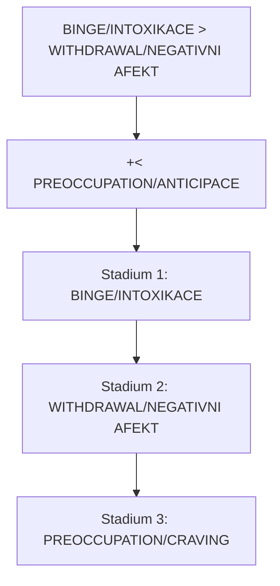
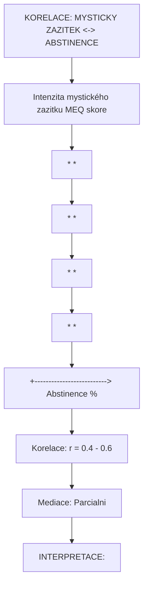

+++
title = "Zavislost"
description = "Neurobiologie zavislosti - reward system, dopaminergni dysregulace a psychedelicka lecba zavislostí"
weight = 2
insert_anchor_links = "right"

[taxonomies]
categories = ["psychiatrie", "poruchy", "lecba"]
tags = ["zavislost", "reward", "dopamin", "ibogain", "psilocybin", "neuroplasticita", "craving"]
+++

# Zavislost - Neurobiologie a psychedelicka terapie

**Zavislost** (substance use disorder, SUD) je chronicke, recidivujici onemocneni mozku charakterizovane kompulzivnim vyhladevanim a uzíváním latky navzdory negativním dusledkum. Postihuje odhadem 35 milionů lidí celosvětově a predstavuje jednu z nejvyznamnejsich pricin morbidity a mortality.

Posledni dekada prinesla renesanci zajmu o **psychedelika jako lecbu zavislosti** - [psilocybin](@/alkaloids/psilocybin.md), [ibogain](@/alkaloids/ibogaine.md) a [ketamin](@/alkaloids/ketamin.md) vykazuji slibne vysledky v klinickych studiích.

---

## Epidemiologie

### Globalni zatez

| Parametr | Hodnota | Zdroj |
|----------|---------|-------|
| **Celkovy pocet** | ~35 milionu | UNODC 2023 |
| **Opioidni zavislost** | 16 milionů | WHO |
| **Alkoholova zavislost** | 100+ milionů | WHO |
| **Rocni umrtí (opioidy)** | ~500,000 | CDC, WHO |
| **Ekonomicka zatez (USA)** | >600 miliard USD/rok | NIDA |

### Nejcastejsi latky

| Latka | Prevalence | Mortalita |
|-------|------------|-----------|
| **Alkohol** | Nejvyssi | Vysoka (jaterní, úrazy) |
| **Tabak** | Velmi vysoka | Nejvyssi (rakovina, KV) |
| **Opioidy** | Stredni | Velmi vysoka (predavkovani) |
| **Kokain** | Stredni | Stredni |
| **Amfetaminy** | Rostouci | Stredni |
| **Kanabis** | Vysoka | Nizka |

---

## Neurobiologie zavislosti

### Reward system (mezokortikolimbicky system)

```mermaid
flowchart TD
    node_REWARDCIRCUITRY["REWARD CIRCUITRY"]
    node_PrefrontalnkortexPFC["Prefrontalní kortex PFC"]
    node_Rozhodovaniinhibice["Rozhodovani, inhibice"]
    node_glutamat["glutamat"]
    node_ddb739e1["+------------------+"]
    node_Nucleus["Nucleus"]
    node_AccumbensNAcDopamin["Accumbens NAc|&lt;-------- Dopamin"]
    node_Reward["Reward,"]
    node_motivace["motivace"]
    node_0cb77c9d["+--------+--------+"]
    node_GABA["GABA"]
    node_Ventralni["Ventralni      |---------+"]
    node_Tegmentalni["Tegmentalni"]
    node_AreaVTA["Area VTA"]
    node_DAneurony["DA neurony"]
    node_Drogyaktivuji["Drogy aktivuji"]
    node_8f2e3ec4["+----+----+----+----+"]
    node_OpioidyKokainAlkohol["Opioidy Kokain Alkohol AMPH"]

    node_REWARDCIRCUITRY --> node_PrefrontalnkortexPFC
    node_PrefrontalnkortexPFC --> node_Rozhodovaniinhibice
    node_Rozhodovaniinhibice --> node_glutamat
    node_glutamat --> node_ddb739e1
    node_ddb739e1 --> node_Nucleus
    node_Nucleus --> node_AccumbensNAcDopamin
    node_AccumbensNAcDopamin --> node_Reward
    node_Reward --> node_motivace
    node_motivace --> node_0cb77c9d
    node_0cb77c9d --> node_GABA
    node_GABA --> node_Ventralni
    node_Ventralni --> node_Tegmentalni
    node_Tegmentalni --> node_AreaVTA
    node_AreaVTA --> node_DAneurony
    node_DAneurony --> node_Drogyaktivuji
    node_Drogyaktivuji --> node_8f2e3ec4
    node_8f2e3ec4 --> node_OpioidyKokainAlkohol

    click node_AccumbensNAcDopamin "/glossary/dopamin/" "Accumbens NAc|<-------- Dopamin"
```



<details>
<summary>ASCII verze diagramu</summary>

```
REWARD CIRCUITRY

            Prefrontalní kortex (PFC)
            [Rozhodovani, inhibice]
                    |
                    | (glutamat)
                    v
+------------------+
|  Nucleus        |
|  Accumbens (NAc)|<-------- Dopamin
|  [Reward,       |          |
|   motivace]     |          |
+--------+--------+          |
         |                   |
         | (GABA)            |
         v                   |
+------------------+         |
|  Ventralni      |---------+
|  Tegmentalni    |
|  Area (VTA)     |
|  [DA neurony]   |
+--------+--------+
         ^
         |
    [Drogy aktivuji]
         |
    +----+----+----+----+
    |    |    |    |    |
  Opioidy Kokain Alkohol AMPH
```

</details>

### Dopaminova hypoteza

```mermaid
flowchart TD
    node_NORMALNIVSZAVISLOSTN["NORMALNI VS. ZAVISLOSTNI STAV"]
    node_NORMALNI["NORMALNI:"]
    node_56642846["+-----------------+"]
    node_Prirodniodmeny["Prirodni odmeny"]
    node_jidlosex["jidlo, sex"]
    node_0cb77c9d["+--------+--------+"]
    node_MirnezvyseniDA["Mirne zvyseni DA"]
    node_150200baseline["150-200% baseline"]
    node_Ucenimotivace["Uceni, motivace"]
    node_Adaptivnichovani["Adaptivni chovani"]
    node_ZAVISLOST["ZAVISLOST:"]
    node_Droga["Droga"]
    node_MasivnizvyseniDA["Masivni zvyseni DA"]
    node_3001000baseline["300-1000%+ baseline"]
    node_Hijackingrewardsyste["'Hijacking' reward systemu"]
    node_DownregulaceD2recept["+---&gt; Downregulace D2 receptoru"]
    node_Hypofrontalitasnizen["+---&gt; Hypofrontalita snizena PFC"]
    node_Snizenaodpovednaprir["+---&gt; Snizena odpoved na prirodni odmeny"]
    node_KOMPULZIVNIUZIVANI["+---&gt; KOMPULZIVNI UZIVANI"]

    node_NORMALNIVSZAVISLOSTN --> node_NORMALNI
    node_NORMALNI --> node_56642846
    node_56642846 --> node_Prirodniodmeny
    node_Prirodniodmeny --> node_jidlosex
    node_jidlosex --> node_0cb77c9d
    node_0cb77c9d --> node_MirnezvyseniDA
    node_MirnezvyseniDA --> node_150200baseline
    node_150200baseline --> node_Ucenimotivace
    node_Ucenimotivace --> node_Adaptivnichovani
    node_Adaptivnichovani --> node_ZAVISLOST
    node_ZAVISLOST --> node_Droga
    node_Droga --> node_MasivnizvyseniDA
    node_MasivnizvyseniDA --> node_3001000baseline
    node_3001000baseline --> node_Hijackingrewardsyste
    node_Hijackingrewardsyste --> node_DownregulaceD2recept
    node_DownregulaceD2recept --> node_Hypofrontalitasnizen
    node_Hypofrontalitasnizen --> node_Snizenaodpovednaprir
    node_Snizenaodpovednaprir --> node_KOMPULZIVNIUZIVANI
```



<details>
<summary>ASCII verze diagramu</summary>

```
NORMALNI VS. ZAVISLOSTNI STAV

NORMALNI:
+-----------------+
| Prirodni odmeny |
| (jidlo, sex)    |
+--------+--------+
         |
         v
   Mirne zvyseni DA
   (150-200% baseline)
         |
         v
   Uceni, motivace
   Adaptivni chovani

ZAVISLOST:
+-----------------+
| Droga           |
+--------+--------+
         |
         v
   Masivni zvyseni DA
   (300-1000%+ baseline)
         |
         v
   "Hijacking" reward systemu
         |
         +---> Downregulace D2 receptoru
         |
         +---> Hypofrontalita (snizena PFC)
         |
         +---> Snizena odpoved na prirodni odmeny
         |
         +---> KOMPULZIVNI UZIVANI
```

</details>

### Klicove neuroadaptace

| Zmena | Mechanismus | Dusledek |
|-------|-------------|----------|
| **D2 downregulace** | Chronicka DA elevace | Anhedonie, tolerance |
| **Hypofrontalita** | Snizena PFC aktivita | Zhoršena inhibice |
| **Stresova senzitizace** | CRF, noradrenalin | Relapsy pri stresu |
| **Glutamatova dysregulace** | Synaptická plasticita | Craving, habituace |
| **Opioidni deficit** | Endorfinova downregulace | Dysforicky, withdrawal |

### Tri stadía zavislostního cyklu



<details>
<summary>ASCII verze diagramu</summary>

```
BINGE/INTOXIKACE ──────> WITHDRAWAL/NEGATIVNI AFEKT
        ^                           |
        |                           |
        |                           v
        +<──── PREOCCUPATION/ANTICIPACE

Stadium 1: BINGE/INTOXIKACE
- Reward, incentivní salience
- NAc, VTA, dorsální striatum
- DA, opioidy

Stadium 2: WITHDRAWAL/NEGATIVNI AFEKT
- Dysforicky, stres
- Amygdala, BNST
- CRF, noradrenalin, dynorfin

Stadium 3: PREOCCUPATION/CRAVING
- Exekutivni dysfunkce
- PFC, hipokampus
- Glutamat
```

</details>

---

## Standardni lecba

### Farmakoterapie opioidní zavislosti

| Lek | Mechanismus | Efektivita |
|-----|-------------|------------|
| **Metadon** | Plny mu agonista | Vysoka |
| **Buprenorfin** | Parcialni mu agonista | Vysoka |
| **Naltrexon** | Mu antagonista | Stredni |

### Farmakoterapie alkoholove zavislosti

| Lek | Mechanismus | Efektivita |
|-----|-------------|------------|
| **Disulfiram** | ALDH inhibitor (averzni) | Nizka-stredni |
| **Naltrexon** | Opioidni antagonista | Stredni |
| **Akamprozat** | NMDA/GABA modulace | Stredni |

### Limitace standardni lecby

| Problem | Data |
|---------|------|
| **Relaps po 1 roce** | 40-60% |
| **Adherence** | Problematicka |
| **Addressing root causes** | Limitovane |
| **Stigma** | Vysoky |

---

## Psychedelicka terapie zavislosti

### Mechanismy ucinku

```mermaid
flowchart TD
    node_PSYCHEDELIKAVLECBEZA["PSYCHEDELIKA V LECBE ZAVISLOSTI"]
    node_PsilocybinLSDIbogain["Psilocybin/LSD/Ibogain"]
    node_643d4c09["+--------------------+"]
    node_5HT2Aaktivacepsilocy["5-HT2A aktivace    |  psilocybin, LSD"]
    node_KORaktivaceibogain["KOR aktivace       |  ibogain"]
    node_NMDAmodulaceketamini["NMDA modulace      |  ketamin, ibogain"]
    node_dc692126["+----+----+"]
    node_AkutniNeurobiologick["Akutni      Neurobiologicke"]
    node_efektyefekty["efekty      efekty"]
    node_MystickeBDNFneuropla["Mysticke    BDNF/neuroplasticita"]
    node_zazitkySynaptogeneze["zazitky     Synaptogeneze"]
    node_PsychoResetreward["Psycho-     'Reset' reward"]
    node_logickycircuitry["logicky     circuitry"]
    node_insight["insight"]
    node_4f76f3cc["+------+------+"]
    node_SNIZENICRAVINGU["SNIZENI CRAVINGU"]
    node_ZVYSENAABSTINENCE["ZVYSENA ABSTINENCE"]
    node_ZMENAHODNOTPRIORITY["ZMENA HODNOT/PRIORITY"]

    node_PSYCHEDELIKAVLECBEZA --> node_PsilocybinLSDIbogain
    node_PsilocybinLSDIbogain --> node_643d4c09
    node_643d4c09 --> node_5HT2Aaktivacepsilocy
    node_5HT2Aaktivacepsilocy --> node_KORaktivaceibogain
    node_KORaktivaceibogain --> node_NMDAmodulaceketamini
    node_NMDAmodulaceketamini --> node_dc692126
    node_dc692126 --> node_AkutniNeurobiologick
    node_AkutniNeurobiologick --> node_efektyefekty
    node_efektyefekty --> node_MystickeBDNFneuropla
    node_MystickeBDNFneuropla --> node_zazitkySynaptogeneze
    node_zazitkySynaptogeneze --> node_PsychoResetreward
    node_PsychoResetreward --> node_logickycircuitry
    node_logickycircuitry --> node_insight
    node_insight --> node_4f76f3cc
    node_4f76f3cc --> node_SNIZENICRAVINGU
    node_SNIZENICRAVINGU --> node_ZVYSENAABSTINENCE
    node_ZVYSENAABSTINENCE --> node_ZMENAHODNOTPRIORITY

    click node_PsilocybinLSDIbogain "/alkaloids/psilocybin/" "Psilocybin/LSD/Ibogain"
    click node_5HT2Aaktivacepsilocy "/alkaloids/psilocybin/" "5-HT2A aktivace    |  psilocybin, LSD"
    click node_KORaktivaceibogain "/alkaloids/ibogaine/" "KOR aktivace       |  ibogain"
    click node_NMDAmodulaceketamini "/alkaloids/ibogaine/" "NMDA modulace      |  ketamin, ibogain"
    click node_MystickeBDNFneuropla "/molecules/bdnf/" "Mysticke    BDNF/neuroplasticita"
```



<details>
<summary>ASCII verze diagramu</summary>

```
PSYCHEDELIKA V LECBE ZAVISLOSTI

[Psilocybin/LSD/Ibogain]
         |
         v
+--------------------+
| 5-HT2A aktivace    |  (psilocybin, LSD)
| KOR aktivace       |  (ibogain)
| NMDA modulace      |  (ketamin, ibogain)
+--------------------+
         |
    +----+----+
    |         |
    v         v
Akutni      Neurobiologicke
efekty      efekty
    |             |
    v             v
Mysticke    [BDNF]/neuroplasticita
zazitky     Synaptogeneze
    |             |
    v             v
Psycho-     "Reset" reward
logicky     circuitry
insight
    |             |
    +------+------+
           |
           v
    SNIZENI CRAVINGU
    ZVYSENA ABSTINENCE
    ZMENA HODNOT/PRIORITY
```

</details>

### Evidence pro jednotlive latky

#### Psilocybin

| Studie | N | Indikace | Design | Vysledky |
|--------|---|----------|--------|----------|
| **Johnson 2014** | 15 | Tabák | Open-label | 80% abstinence 6m |
| **Bogenschutz 2015** | 10 | Alkohol | Open-label | 83% redukce |
| **Johnson 2017** | 15 | Tabák | Follow-up | 67% abstinence 12m |

#### Ibogain

| Studie | N | Indikace | Design | Vysledky |
|--------|---|----------|--------|----------|
| **Alper 1999** | 33 | Opioidy | Open-label | 25/33 bez withdrawal |
| **Brown 2018** | 30 | Opioidy | Observační | Signifikantni redukce |
| **Davis 2017** | 88 | Opioidy | Survey | 30% abstinence 1y |

#### Ketamin

| Studie | N | Indikace | Design | Vysledky |
|--------|---|----------|--------|----------|
| **Krupitsky 2002** | 70 | Alkohol | RCT | Signifikantni redukce |
| **Dakwar 2020** | 40 | Kokain | RCT | Snizeni cravingu |

### Mystické zazitky a outcome



<details>
<summary>ASCII verze diagramu</summary>

```
KORELACE: MYSTICKY ZAZITEK <-> ABSTINENCE

Intenzita mystického zazitku (MEQ skore)
    |
    |            *  *
    |          *      *
    |        *          *
    |      *              *
    |    *
    +--------------------------> Abstinence (%)

Korelace: r = 0.4 - 0.6
Mediace: Parcialni

INTERPRETACE:
- Mysticke zazitky predikuji lepsi outcome
- Ale nejsou NUTNE pro ucinek
- Neuroplasticita je take dulezita
```

</details>

---

## Specifika jednotlivych psychedelik

### Psilocybin pro zavislost

| Aspekt | Hodnota |
|--------|---------|
| **Mechanismus** | 5-HT2A → BDNF → neuroplasticita |
| **Protokol** | 1-2 vysokodavkove sezeni + psychoterapie |
| **Davka** | 25-30 mg |
| **Trvani efektu** | Mesice |
| **Bezpecnost** | Vysoka |
| **Status** | Phase II klinicke studie |

### Ibogain pro opioidni zavislost

| Aspekt | Hodnota |
|--------|---------|
| **Mechanismus** | NMDA + KOR → "reset" + GDNF |
| **Protokol** | Jednorazove podani, medicinsky monitoring |
| **Davka** | 10-25 mg/kg |
| **Trvani efektu** | Tydny-mesice |
| **Bezpecnost** | **Stredni** (kardialni riziko) |
| **Status** | Legalni kliniky (Mexiko, Kostarika) |

Viz: [Ibogain](@/alkaloids/ibogaine.md)

### Ketamin pro zavislost

| Aspekt | Hodnota |
|--------|---------|
| **Mechanismus** | NMDA antagonismus → BDNF → synaptogeneze |
| **Protokol** | Vicekratne infuze + terapie |
| **Davka** | 0.5 mg/kg IV |
| **Trvani efektu** | Dny-tydny |
| **Bezpecnost** | Vysoka (monitorovane) |
| **Status** | Off-label klinicke pouziti |

Viz: [Ketamin](@/alkaloids/ketamin.md)

---

## Terapeuticky protokol

### Psilocybinem asistovana terapie zavislosti

```mermaid
flowchart TD
    node_TYPICKYPROTOKOL["TYPICKY PROTOKOL"]
    node_FAZE1PRIPRAVA24sezen["FAZE 1: PRIPRAVA 2-4 sezeni"]
    node_1343fde7["+--------------------------------+"]
    node_Budovaniterapeuticke["Budovani terapeutickeho vztahu"]
    node_Psychoedukaceozavisl["Psychoedukace o zavislosti"]
    node_Motivacniinterviewin["Motivacni interviewing"]
    node_Formulaceintention["Formulace intention"]
    node_FAZE2DOSINGSESSIONS1["FAZE 2: DOSING SESSIONS 1-2x"]
    node_Psilocybin2530mg["Psilocybin 25-30 mg"]
    node_68hodinsterapeuty["6-8 hodin s terapeuty"]
    node_Supportivninondirect["Supportivni, non-directive"]
    node_Hudbaklidneprostredi["Hudba, klidne prostredi"]
    node_FAZE3INTEGRACE48seze["FAZE 3: INTEGRACE 4-8 sezení"]
    node_Zpracovanizazitku["Zpracovani zazitku"]
    node_Identifikaceinsight["Identifikace insight"]
    node_Zmenamaladaptivnichp["Zmena maladaptivnich patternu"]
    node_Lifestylezmeny["Lifestyle zmeny"]
    node_Podpurneskupiny["Podpurne skupiny"]
    node_FAZE4FOLLOWUPmsce["FAZE 4: FOLLOW-UP měsíce"]
    node_Monitoringabstinence["Monitoring abstinence"]
    node_Boostersezenioptiona["Booster sezeni optional"]
    node_Relapseprevention["Relapse prevention"]

    node_TYPICKYPROTOKOL --> node_FAZE1PRIPRAVA24sezen
    node_FAZE1PRIPRAVA24sezen --> node_1343fde7
    node_1343fde7 --> node_Budovaniterapeuticke
    node_Budovaniterapeuticke --> node_Psychoedukaceozavisl
    node_Psychoedukaceozavisl --> node_Motivacniinterviewin
    node_Motivacniinterviewin --> node_Formulaceintention
    node_Formulaceintention --> node_FAZE2DOSINGSESSIONS1
    node_FAZE2DOSINGSESSIONS1 --> node_Psilocybin2530mg
    node_Psilocybin2530mg --> node_68hodinsterapeuty
    node_68hodinsterapeuty --> node_Supportivninondirect
    node_Supportivninondirect --> node_Hudbaklidneprostredi
    node_Hudbaklidneprostredi --> node_FAZE3INTEGRACE48seze
    node_FAZE3INTEGRACE48seze --> node_Zpracovanizazitku
    node_Zpracovanizazitku --> node_Identifikaceinsight
    node_Identifikaceinsight --> node_Zmenamaladaptivnichp
    node_Zmenamaladaptivnichp --> node_Lifestylezmeny
    node_Lifestylezmeny --> node_Podpurneskupiny
    node_Podpurneskupiny --> node_FAZE4FOLLOWUPmsce
    node_FAZE4FOLLOWUPmsce --> node_Monitoringabstinence
    node_Monitoringabstinence --> node_Boostersezenioptiona
    node_Boostersezenioptiona --> node_Relapseprevention

    click node_Psilocybin2530mg "/alkaloids/psilocybin/" "Psilocybin 25-30 mg"
```



<details>
<summary>ASCII verze diagramu</summary>

```
TYPICKY PROTOKOL

FAZE 1: PRIPRAVA (2-4 sezeni)
+--------------------------------+
| Budovani terapeutickeho vztahu |
| Psychoedukace o zavislosti     |
| Motivacni interviewing         |
| Formulace intention            |
+--------------------------------+
            |
            v
FAZE 2: DOSING SESSIONS (1-2x)
+--------------------------------+
| Psilocybin 25-30 mg            |
| 6-8 hodin s terapeuty          |
| Supportivni, non-directive     |
| Hudba, klidne prostredi        |
+--------------------------------+
            |
            v
FAZE 3: INTEGRACE (4-8 sezení)
+--------------------------------+
| Zpracovani zazitku             |
| Identifikace insight           |
| Zmena maladaptivnich patternu  |
| Lifestyle zmeny                |
| Podpurne skupiny               |
+--------------------------------+
            |
            v
FAZE 4: FOLLOW-UP (měsíce)
+--------------------------------+
| Monitoring abstinence          |
| Booster sezeni (optional)      |
| Relapse prevention             |
+--------------------------------+
```

</details>

---

## Budouci smery

### Aktivni klinické studie

| Instituce | Latka | Indikace | Faze |
|-----------|-------|----------|------|
| **Johns Hopkins** | Psilocybin | Tabak, alkohol | II/III |
| **NYU** | Psilocybin | Alkohol | II |
| **MAPS** | Ibogain deriváty | Opioidy | Preklinicka |
| **Yale** | Ketamin | Kokain, alkohol | II |

### Nove pristupy

1. **18-MC** - Ibogain derivat bez kardiotoxicity
2. **Kombinace** - Ketamin + psychoterapie
3. **Mikrodavkovani** - Nedostatecna evidence
4. **Precision medicine** - Biomarkery response

---

## Reference

### Neurobiologie zavislosti

1. Koob, G.F. & Volkow, N.D. (2016). *Neurobiology of addiction: a neurocircuitry analysis*. Lancet Psychiatry.

2. Volkow, N.D. et al. (2019). *The conception of the ABCD study: From substance use to a broad NIH collaboration*. Developmental Cognitive Neuroscience.

### Psychedelika a zavislost

3. Johnson, M.W. et al. (2014). *Pilot study of the 5-HT2AR agonist psilocybin in the treatment of tobacco addiction*. Journal of Psychopharmacology.

4. Bogenschutz, M.P. et al. (2015). *Psilocybin-assisted treatment for alcohol dependence*. Journal of Psychopharmacology.

5. Brown, T.K. & Alper, K. (2018). *Treatment of opioid use disorder with ibogaine*. American Journal of Drug and Alcohol Abuse.

---

## Viz také

### Psychedelická terapie závislostí
- [Ibogain](@/alkaloids/ibogaine.md) - **Nejslibnejší pro opioidní závislost (75% úspěšnost)**
- [Psilocybin](@/alkaloids/psilocybin.md) - **Narušení habituálních vzorců, FDA Phase II**
- [LSD](@/alkaloids/lsd.md) - Historické úspěchy u alkoholismu
- [Ayahuasca](@/preparations/ayahuasca.md) - Tradiční léčba závislostí
- [5-MeO-DMT](@/alkaloids/5-meo-dmt.md) - Experimentální terapie

### Alternativní farmakoterapie
- [Ketamin](@/alkaloids/ketamin.md) - **Rychlé antikraving efekty, NMDA blokáda**
- [MDMA](@/alkaloids/mdma.md) - Terapie traumatických kořenů závislosti

### Cílové mozkové oblasti
- **Nucleus accumbens** - Primární reward centrum
- [Prefrontální kortex](@/brain/prefrontal-cortex.md) - **Narušení habituálních vzorců psychedeliky**
- **Striatum** - Habituální chování
- **VTA (ventral tegmental area)** - Dopaminový zdroj
- [Amygdala](@/brain/amygdala.md) - Emoční spouštěče
- [Hippocampus](@/brain/hippocampus.md) - Kontextová paměť

### Receptory a mechanismy
- [Dopaminové receptory](@/receptors/dopamine.md) - **Centrum reward systému**
- [5-HT2A receptor](@/receptors/5-ht2a.md) - **Cíl psychedelické terapie**
- **5-HT2C receptor** - Impulzní kontrola
- **Kappa opiovie receptory** - Dysforické stavy
- [NMDA receptor](@/receptors/nmda.md) - Cíl ketaminu

### Molekulární mediátory
- [BDNF](@/molecules/bdnf.md) - **Neuroplasticita, nové neuronální dráhy**
- [Dopamin](@/glossary/dopamin.md) - Reward systém, craving
- **ΔFosB** - Dlouhodobé změny genové exprese
- **CREB** - Tolerance a withdrawal

### Komorbidní stavy
- [Deprese](@/conditions/depression.md) - **Častý komorbidní stav (50%)**
- **Úzkostné stavy** - Self-medication pattern
- **PTSD** - Traumatické kořeny závislosti
- [Schizofrenie](@/conditions/schizophrenia.md) - Duální diagnóza

### Psychoterapeutické přístupy
- **Motivační interviewing** - Zvýšení motivace ke změně
- **Kognitiv-behaviorální terapie** - Změna myšlenkových vzorců
- **Contingency management** - Behaviorální posilování
- **12-step programy** - Peer support

### Harm reduction
- **Substituční terapie** (metadon, buprenorfin)
- **Needle exchange** programy
- **Safe injection sites**
- [Set and setting](@/glossary/set-and-setting.md) - Psychedelická bezpečnost

### Withdrawal a tolerance
- [Tolerance](@/glossary/tolerance.md) - Neuroadaptace, eskalace
- [Opioidní withdrawal](@/glossary/opioid-withdrawal.md) - Specifické syndrom

---

<- Zpet na [Stavy a poruchy](@/conditions/_index.md)
