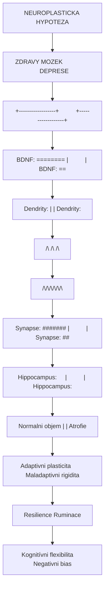
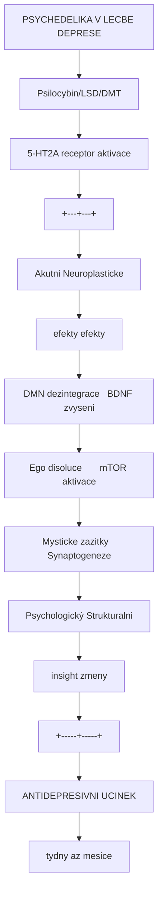
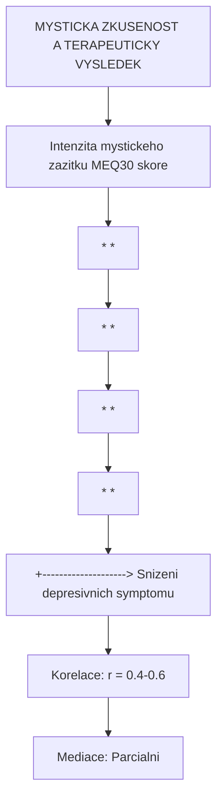

+++
title = "Deprese"
description = "Depresivni porucha - neurobiologie, patofyziologie, a role psychedelik a ketaminu v lecbe rezistentni deprese"
weight = 1
insert_anchor_links = "right"

[taxonomies]
categories = ["psychiatrie", "poruchy", "lecba"]
tags = ["deprese", "TRD", "MDD", "psychedelika", "ketamin", "psilocybin", "neuroplasticita", "BDNF", "serotonin", "antidepresiva"]
+++

# Deprese - Neurobiologie a psychedelicka terapie

**Deprese** (major depressive disorder, MDD) je zavazna psychiatricka porucha postihujici stamiliony lidi celosvetove. Predstavuje vedouci pricinu disability globalne a je spojena s vyraznym utrpenim, snizenou kvalitou zivota a zvysenou mortalitou.

Posledni dve dekady prinesly revolucni zmeny v chapani deprese - od monoaminove hypotezy k neuroplasticke teorii - a s tim i nove terapeuticke moznosti: [ketamin](@/alkaloids/ketamin.md), [psilocybin](@/alkaloids/psilocybin.md) a dalsi psychedelika.

---

## Epidemiologie

### Globalni zatez

| Parametr | Hodnota | Zdroj |
|----------|---------|-------|
| **Celozivotn prevalence** | 10-20% | WHO |
| **Rocni prevalence** | 5-7% | Global Burden of Disease |
| **Pocet postiženych** | >300 milionu | WHO 2023 |
| **Ranking disability** | #1 globalne | GBD Study |
| **Ekonomicka zatez (USA)** | >200 miliard USD/rok | CDC |
| **Mortalita (sebevrazdy)** | ~800 000/rok | WHO |

### Rizikove faktory

| Kategorie | Faktory |
|-----------|---------|
| **Geneticke** | Rodinná anamneza, polymorfismy (5-HTTLPR, BDNF Val66Met) |
| **Biologicke** | Chronicka onemocneni, hormonalni zmeny, zanet |
| **Psychologicke** | Trauma, chronicke stresory, maladaptivni kognice |
| **Socialni** | Izolace, nizky SES, nezamestnanost |
| **Demograficke** | Zeny 2x casteji, peak 18-25 let |

---

## Diagnostika

### DSM-5 kriteria pro MDD

Pro diagnozu je nutna pritomnost alespon **5 z 9 symptomu** po dobu **2+ tydnu**, vcetne alespon jednoho z prvnich dvou:

| # | Symptom | Popis |
|---|---------|-------|
| 1 | **Depresivni nalada** | Smutek, prazdnota, beznadej (vetsinu dne) |
| 2 | **Anhedonie** | Ztrata zajmu nebo poteseni |
| 3 | Zmeny hmotnosti | >5% zmena za mesic |
| 4 | Poruchy spanku | Insomnie nebo hypersomnie |
| 5 | Psychomotorické zmeny | Agitovanost nebo retardace |
| 6 | Unava | Ztrata energie |
| 7 | Pocity viny | Nadmerna, neprimerena vina |
| 8 | Kognitivni potize | Snizena koncentrace, nerozhodnost |
| 9 | Suicidalni mysleni | Opakujici se myslenky na smrt |

### Subtypy deprese

| Subtyp | Charakteristika | Terapeuticke implikace |
|--------|-----------------|------------------------|
| **Melancholicka** | Anhedonie, ranni pesima, psychomotorická retardace | Lepsi odpoved na biologickou lecbu |
| **Atypicka** | Reaktivni nalada, hypersomnie, hyperfagie | Mozna odpoved na MAOi |
| **Psychoticka** | Bludy, halucinace | Potreba antipsychotik |
| **Sezonni (SAD)** | Zimni epizody | Fototerapie |
| **Postpartalni** | Po porodu | Hormonalni komponenta |
| **Perzistentni (dysthymie)** | >2 roky, mirnejsi | Chronifikace |

### Treatment-Resistant Depression (TRD)

**Definice**: Nedostatecna odpoved na 2+ adekvátni antidepresivní pokusy.

| Stupen rezistence | Definice |
|-------------------|----------|
| **Stadium I** | 1 selhani SSRI/SNRI |
| **Stadium II** | 2 selhani ruznych trid |
| **Stadium III** | Stadium II + TCA selhani |
| **Stadium IV** | Stadium III + MAOi selhani |
| **Stadium V** | Stadium IV + ECT selhani |

---

## Neurobiologie deprese

### Evoluce hypotez

```mermaid
flowchart TD
    node_HISTORICKYVYVOJHYPOT["HISTORICKY VYVOJ HYPOTEZ DEPRESE"]
    node_1960s1990sMONOAMINOV["1960s-1990s: MONOAMINOVA HYPOTEZA"]
    node_34de3209["+----------------------------------------+"]
    node_Depresedeficitseroto["Deprese = deficit serotoninu/NA"]
    node_Lecbazvysenimonoamin["Lecba = zvyseni monoaminu"]
    node_Problem24tydnylatenc["Problem: 2-4 tydny latence ucinku"]
    node_2000sNEUROPLASTICKAH["2000s: NEUROPLASTICKA HYPOTEZA"]
    node_Depresesnizenaneurop["Deprese = snizena neuroplasticita"]
    node_KlicoveBDNFsynaptoge["Klicove: BDNF, synaptogeneze"]
    node_Podporenoketaminpsyc["Podporeno: ketamin, psychedelika"]
    node_2010sINTEGRATIVNIMOD["2010s: INTEGRATIVNI MODEL"]
    node_ZntHPAdysregulace["Zánět + HPA dysregulace"]
    node_GlutamtGABAnerovnovh["Glutamát/GABA nerovnováha"]
    node_SovdysfunkceDMNhyper["Síťová dysfunkce DMN hyperaktivita"]
    node_Individulnvariabilit["Individuální variabilita"]

    node_HISTORICKYVYVOJHYPOT --> node_1960s1990sMONOAMINOV
    node_1960s1990sMONOAMINOV --> node_34de3209
    node_34de3209 --> node_Depresedeficitseroto
    node_Depresedeficitseroto --> node_Lecbazvysenimonoamin
    node_Lecbazvysenimonoamin --> node_Problem24tydnylatenc
    node_Problem24tydnylatenc --> node_2000sNEUROPLASTICKAH
    node_2000sNEUROPLASTICKAH --> node_Depresesnizenaneurop
    node_Depresesnizenaneurop --> node_KlicoveBDNFsynaptoge
    node_KlicoveBDNFsynaptoge --> node_Podporenoketaminpsyc
    node_Podporenoketaminpsyc --> node_2010sINTEGRATIVNIMOD
    node_2010sINTEGRATIVNIMOD --> node_ZntHPAdysregulace
    node_ZntHPAdysregulace --> node_GlutamtGABAnerovnovh
    node_GlutamtGABAnerovnovh --> node_SovdysfunkceDMNhyper
    node_SovdysfunkceDMNhyper --> node_Individulnvariabilit

    click node_Depresedeficitseroto "/glossary/serotonin/" "Deprese = deficit serotoninu/NA"
    click node_Depresesnizenaneurop "/glossary/neuroplasticita/" "Deprese = snizena neuroplasticita"
    click node_KlicoveBDNFsynaptoge "/molecules/bdnf/" "Klicove: BDNF, synaptogeneze"
    click node_Podporenoketaminpsyc "/alkaloids/ketamin/" "Podporeno: ketamin, psychedelika"
    click node_SovdysfunkceDMNhyper "/circuits/dmn/" "Síťová dysfunkce DMN hyperaktivita"
```



<details>
<summary>ASCII verze diagramu</summary>

```
HISTORICKY VYVOJ HYPOTEZ DEPRESE

1960s-1990s: MONOAMINOVA HYPOTEZA
+----------------------------------------+
| Deprese = deficit serotoninu/NA        |
| Lecba = zvyseni monoaminu              |
| Problem: 2-4 tydny latence ucinku      |
+----------------------------------------+
            |
            v
2000s: NEUROPLASTICKA HYPOTEZA
+----------------------------------------+
| Deprese = snizena neuroplasticita      |
| Klicove: BDNF, synaptogeneze           |
| Podporeno: ketamin, psychedelika       |
+----------------------------------------+
            |
            v
2010s: INTEGRATIVNI MODEL
+----------------------------------------+
| Zánět + HPA dysregulace                |
| Glutamát/GABA nerovnováha              |
| Síťová dysfunkce (DMN hyperaktivita)   |
| Individuální variabilita               |
+----------------------------------------+
```

</details>

### Monoaminova hypoteza

| Neurotransmiter | Zmena u deprese | Dukaz |
|-----------------|-----------------|-------|
| **[Serotonin](@/glossary/serotonin.md)** | Snizena funkce | Tryptofanová deplece, SSRI ucinek |
| **Noradrenalin** | Snizena funkce | SNRI ucinek, LC dysfunkce |
| **Dopamin** | Snizena funkce | Anhedonie, odpoved na buproprion |

**Limitace**: Monoaminova hypoteza nevysvetluje:
- 2-4 tydny latenci ucinku antidepresiv
- 30-40% non-responderu
- Rychly ucinek ketaminu

### Neuroplasticka hypoteza



<details>
<summary>ASCII verze diagramu</summary>

```
NEUROPLASTICKA HYPOTEZA

    ZDRAVY MOZEK                  DEPRESE
+------------------+          +------------------+
|                  |          |                  |
| BDNF: [========] |          | BDNF: [==]       |
|                  |          |                  |
| Dendrity:        |          | Dendrity:        |
|   /\  /\  /\     |          |   |   |   |      |
|  /\/\/\/\/\/\    |          |                  |
|                  |          |                  |
| Synapse: ####### |          | Synapse: ##      |
|                  |          |                  |
| Hippocampus:     |          | Hippocampus:     |
| Normalni objem   |          | Atrofie          |
+------------------+          +------------------+
        |                             |
        v                             v
  Adaptivni plasticita        Maladaptivni rigidita
  Resilience                  Ruminace
  Kognitívni flexibilita      Negativni bias
```

</details>

### Klicove zmeny u deprese

| Oblast | Zmena | Mechanismus |
|--------|-------|-------------|
| **[Hippocampus](@/brain/hippocampus.md)** | Atrofie (8-10%) | Snizena neurogeneze, BDNF |
| **[Prefrontalni kortex](@/brain/prefrontal-cortex.md)** | Snizena aktivita | Dendriticka retrakce |
| **[Amygdala](@/brain/amygdala.md)** | Hyperaktivita | Zvysena reaktivita na negativni podnety |
| **[DMN](@/circuits/dmn.md)** | Hyperkonektivita | Ruminace, self-focus |
| **HPA osa** | Hyperaktivita | Chronicky zvyseny kortizol |

### Glutamátergni dysregulace

```mermaid
flowchart TD
    node_GLUTAMATADEPRESE["GLUTAMAT A DEPRESE"]
    node_Normalnistav["Normalni stav:"]
    node_56642846["+-----------------+"]
    node_GlutamtRovnovhaexcit["Glutamát        |  Rovnováha excitace/inhibice"]
    node_ccbfc51b["===="]
    node_GABA["GABA"]
    node_Deprese["Deprese:"]
    node_GlutamtDysbalance["Glutamát        |  Dysbalance"]
    node_Extrasynaptickygluta["======        |  Extrasynapticky glutamát"]
    node_NMDAhyperaktivace["NMDA hyperaktivace"]
    node_Snizenainhibice["==            |  Snizena inhibice"]
    node_Ketamin["Ketamin:"]
    node_NMDAblokadaObnovenir["NMDA blokada    |  Obnoveni rovnovahy"]
    node_XSynaptogeneze["X          |  Synaptogeneze"]
    node_AMPAburstBDNFindukce["AMPA burst      |  BDNF indukce"]

    node_GLUTAMATADEPRESE --> node_Normalnistav
    node_Normalnistav --> node_56642846
    node_56642846 --> node_GlutamtRovnovhaexcit
    node_GlutamtRovnovhaexcit --> node_ccbfc51b
    node_ccbfc51b --> node_GABA
    node_GABA --> node_Deprese
    node_Deprese --> node_GlutamtDysbalance
    node_GlutamtDysbalance --> node_Extrasynaptickygluta
    node_Extrasynaptickygluta --> node_NMDAhyperaktivace
    node_NMDAhyperaktivace --> node_Snizenainhibice
    node_Snizenainhibice --> node_Ketamin
    node_Ketamin --> node_NMDAblokadaObnovenir
    node_NMDAblokadaObnovenir --> node_XSynaptogeneze
    node_XSynaptogeneze --> node_AMPAburstBDNFindukce

    click node_NMDAhyperaktivace "/receptors/nmda/" "NMDA hyperaktivace"
    click node_Ketamin "/alkaloids/ketamin/" "Ketamin:"
    click node_NMDAblokadaObnovenir "/receptors/nmda/" "NMDA blokada    |  Obnoveni rovnovahy"
    click node_AMPAburstBDNFindukce "/molecules/bdnf/" "AMPA burst      |  BDNF indukce"
```



<details>
<summary>ASCII verze diagramu</summary>

```
GLUTAMAT A DEPRESE

Normalni stav:
+-----------------+
| Glutamát        |  Rovnováha excitace/inhibice
| [====]          |
|                 |
| GABA            |
| [====]          |
+-----------------+

Deprese:
+-----------------+
| Glutamát        |  Dysbalance
| [======]        |  Extrasynapticky glutamát
|                 |  NMDA hyperaktivace
| GABA            |
| [==]            |  Snizena inhibice
+-----------------+

Ketamin:
+-----------------+
| NMDA blokada    |  Obnoveni rovnovahy
|      X          |  Synaptogeneze
| AMPA burst      |  BDNF indukce
| [====]          |
+-----------------+
```

</details>

### Zanetova hypoteza

| Marker | Zmena u deprese | Implikace |
|--------|-----------------|-----------|
| **IL-6** | Zvyseny | Koreluje se zavaznosti |
| **TNF-alpha** | Zvyseny | Anhedonie |
| **CRP** | Zvyseny | Prediktor non-response |
| **IDO aktivace** | Zvysena | Tryptofan --> kynurenin |
| **Kynurenin** | Zvyseny | Neurotoxicita |

---

## Standardni terapie

### Farmakoterapie

| Trida | Priklady | Mechanismus | Response rate |
|-------|----------|-------------|---------------|
| **SSRI** | Fluoxetin, sertralin, escitalopram | SERT inhibice | 50-60% |
| **SNRI** | Venlafaxin, duloxetin | SERT + NET inhibice | 50-60% |
| **TCA** | Amitriptylin, imipramin | Neselektivni reuptake | 55-65% |
| **MAOi** | Fenelzin, moklobemid | MAO inhibice | 60-70% |
| **Atypicka** | Bupropion, mirtazapin | Variabilni | 50-60% |

### Limitace standardni lecby

| Problem | Data |
|---------|------|
| **Latence ucinku** | 2-6 tydnu |
| **Non-response** | 30-40% |
| **Remise po 1. linii** | Pouze 30% (STAR*D) |
| **Rezistence (TRD)** | 15-30% |
| **Relaps** | 50-80% v 5 letech |
| **Vedlejsi ucinky** | Sexualni dysfunkce, nárůst hmotnosti |

### Somaticke lecby

| Metoda | Indikace | Efektivita | Nevyhody |
|--------|----------|------------|----------|
| **ECT** | Tezka/psychoticka deprese | 70-90% | Kognitivní vedlejsi ucinky |
| **TMS** | TRD | 40-50% | Casova nárocnost |
| **VNS** | Chronicka TRD | 30-40% | Invazivni |
| **DBS** | Experimentalni | Variabilni | Vysoce invazivni |

---

## Psychedelicka terapie deprese

### Mechanismus ucinku psychedelik



<details>
<summary>ASCII verze diagramu</summary>

```
PSYCHEDELIKA V LECBE DEPRESE

[Psilocybin/LSD/DMT]
        |
        v
    5-HT2A receptor aktivace
        |
    +---+---+
    |       |
    v       v
Akutni     Neuroplasticke
efekty     efekty
    |           |
    v           v
DMN dezintegrace   BDNF zvyseni
Ego disoluce       mTOR aktivace
Mysticke zazitky   Synaptogeneze
    |           |
    v           v
Psychologický      Strukturalni
insight           zmeny
    |           |
    +-----+-----+
          |
          v
    ANTIDEPRESIVNI UCINEK
    (tydny az mesice)
```

</details>

### Klinicke studie s psilocybinem

| Studie | N | Indikace | Design | Vysledky |
|--------|---|----------|--------|----------|
| **Carhart-Harris 2016** | 12 | TRD | Open-label | 67% response, 42% remise (3 mesice) |
| **Griffiths 2016** | 51 | Rakovina + deprese | RCT | 80% response (6 mesicu) |
| **COMPASS Phase IIb** | 233 | TRD | RCT | 29% remise (25mg vs 5% 1mg) |
| **Imperial vs SSRI 2021** | 59 | MDD | RCT | Psilocybin = escitalopram (sekundarni endpointy lepsi) |
| **Usona Phase II 2023** | 104 | MDD | RCT | Signifikantni superiority vs placebo |

### Ketamin v lecbe deprese

| Parametr | Hodnota |
|----------|---------|
| **Forma** | IV racemát, intranazální esketamin (Spravato) |
| **Davka** | 0.5 mg/kg IV; 56-84 mg IN |
| **Nastup** | Hodiny (vs tydny u SSRI) |
| **Response rate** | 50-70% |
| **Trvani** | Dny az tydny (bez udrzby) |
| **FDA schvaleni** | 2019 (esketamin pro TRD) |

### Srovnani novych terapii

| Parametr | Psilocybin | Ketamin | SSRI |
|----------|------------|---------|------|
| **Mechanismus** | 5-HT2A agonismus | NMDA blokada | SERT inhibice |
| **Nastup ucinku** | Hodiny-dny | Hodiny | Tydny |
| **Pocet davek** | 1-2 | Vicekrat | Denne |
| **Trvani efektu** | Tydny-mesice | Dny-tydny | Pri lecbe |
| **Psychoterapie** | Integralni | Doplnkova | Oddelena |
| **Setting** | Specializovany | Klinika | Doma |
| **Vedlejsi ucinky** | Transientni psychedelicke | Disociace, KV | Chronicke |
| **Zavislostni potencial** | Zadny | Nizky-stredni | Zadny |
| **Regulacni status** | Breakthrough (FDA) | Schvaleno (IN) | Schvaleno |

---

## Role mystickych zazitku

### Mysticka zkusenost jako prediktor



<details>
<summary>ASCII verze diagramu</summary>

```
MYSTICKA ZKUSENOST A TERAPEUTICKY VYSLEDEK

Intenzita mystickeho zazitku (MEQ30 skore)
    |
    |         *
    |       *   *
    |     *       *
    |   *           *
    | *               *
    +--------------------> Snizeni depresivnich symptomu

Korelace: r = 0.4-0.6
Mediace: Parcialni
```

</details>

| Studie | Korelace MEQ-outcome | Interpretace |
|--------|----------------------|--------------|
| **Griffiths 2016** | r = 0.48 | Silna |
| **Ross 2016** | r = 0.42 | Stredni-silna |
| **Roseman 2018** | Mediace | Parcialni |
| **Yaden 2017** | r = 0.55 | Silna |

### Mystical Experience Questionnaire (MEQ30)

| Dimenze | Popis |
|---------|-------|
| **Mystical** | Jednota, noetic kvalita, pozitivni nalada |
| **Positive mood** | Extaze, radost, mir |
| **Transcendence** | Casoprostorová transcendence |
| **Ineffability** | Nepopsatelnost zazitku |

Viz detailne: [Mysticke zkusenosti](@/phenomenology/mystical-experiences.md)

---

## Integrace a nastaveni

### Set and setting

| Faktor | Optimalizace |
|--------|--------------|
| **Set (mindset)** | Priprava, intence, otevreni |
| **Setting (prostredi)** | Bezpecne, klidne, estetické |
| **Podpora** | Zkuseni terapeuti |
| **Hudba** | Specificke playlisty |
| **Integrace** | Nasledné sezeni |

### Terapeuticky protokol

```mermaid
flowchart TD
    node_TYPICKYPROTOKOLPSILO["TYPICKY PROTOKOL PSILOCYBINOVE TERAPIE"]
    node_FAZE1PRIPRAVA13sezen["FAZE 1: PRIPRAVA 1-3 sezení"]
    node_1343fde7["+--------------------------------+"]
    node_Anamnezascreening["Anamneza, screening"]
    node_Budovaniterapeuticke["Budovani terapeutickeho vztahu"]
    node_Psychoedukace["Psychoedukace"]
    node_Formulaceintence["Formulace intence"]
    node_FAZE2DOSINGSESSION1d["FAZE 2: DOSING SESSION 1 den"]
    node_Podanipsilocybinu25m["Podani psilocybinu 25mg"]
    node_68hodinsterapeuty["6-8 hodin s terapeuty"]
    node_Minimalniverbalniint["Minimalni verbalni intervence"]
    node_Hudbaklidneprostredi["Hudba, klidne prostredi"]
    node_FAZE3INTEGRACE24seze["FAZE 3: INTEGRACE 2-4 sezeni"]
    node_Zpracovanizazitku["Zpracovani zazitku"]
    node_Identifikaceinsights["Identifikace insights"]
    node_Implementacezmen["Implementace zmen"]
    node_Dlouhodobyfollowup["Dlouhodoby follow-up"]

    node_TYPICKYPROTOKOLPSILO --> node_FAZE1PRIPRAVA13sezen
    node_FAZE1PRIPRAVA13sezen --> node_1343fde7
    node_1343fde7 --> node_Anamnezascreening
    node_Anamnezascreening --> node_Budovaniterapeuticke
    node_Budovaniterapeuticke --> node_Psychoedukace
    node_Psychoedukace --> node_Formulaceintence
    node_Formulaceintence --> node_FAZE2DOSINGSESSION1d
    node_FAZE2DOSINGSESSION1d --> node_Podanipsilocybinu25m
    node_Podanipsilocybinu25m --> node_68hodinsterapeuty
    node_68hodinsterapeuty --> node_Minimalniverbalniint
    node_Minimalniverbalniint --> node_Hudbaklidneprostredi
    node_Hudbaklidneprostredi --> node_FAZE3INTEGRACE24seze
    node_FAZE3INTEGRACE24seze --> node_Zpracovanizazitku
    node_Zpracovanizazitku --> node_Identifikaceinsights
    node_Identifikaceinsights --> node_Implementacezmen
    node_Implementacezmen --> node_Dlouhodobyfollowup

    click node_TYPICKYPROTOKOLPSILO "/alkaloids/psilocybin/" "TYPICKY PROTOKOL PSILOCYBINOVE TERAPIE"
    click node_Podanipsilocybinu25m "/alkaloids/psilocybin/" "Podani psilocybinu 25mg"
```



<details>
<summary>ASCII verze diagramu</summary>

```
TYPICKY PROTOKOL PSILOCYBINOVE TERAPIE

FAZE 1: PRIPRAVA (1-3 sezení)
+--------------------------------+
| Anamneza, screening            |
| Budovani terapeutickeho vztahu |
| Psychoedukace                  |
| Formulace intence              |
+--------------------------------+
            |
            v
FAZE 2: DOSING SESSION (1 den)
+--------------------------------+
| Podani psilocybinu (25mg)      |
| 6-8 hodin s terapeuty          |
| Minimalni verbalni intervence  |
| Hudba, klidne prostredi        |
+--------------------------------+
            |
            v
FAZE 3: INTEGRACE (2-4 sezeni)
+--------------------------------+
| Zpracovani zazitku             |
| Identifikace insights          |
| Implementace zmen              |
| Dlouhodoby follow-up           |
+--------------------------------+
```

</details>

---

## Budouci smery

### Aktivní výzkum

| Oblast | Látka | Instituce | Fáze | Mechanismus |
|--------|-------|-----------|------|-------------|
| **[Psilocybin](@/alkaloids/psilocybin.md) pro TRD** | [Psilocybin](@/alkaloids/psilocybin.md) | COMPASS | **Phase III** | [5-HT2A](@/receptors/5-ht2a.md) → neuroplasticita |
| **[Psilocybin](@/alkaloids/psilocybin.md) pro MDD** | [Psilocybin](@/alkaloids/psilocybin.md) | Usona | Phase II dokončena | [DMN](@/circuits/dmn.md) reset |
| **[Ketamin](@/alkaloids/ketamin.md) udržba** | [Esketamine](@/substances/esketamine.md) | Janssen | **FDA schváleno** | [NMDA](@/receptors/nmda.md) blokáda |
| **Kombinované terapie** | [MDMA](@/alkaloids/mdma.md) + [Psilocybin](@/alkaloids/psilocybin.md) | Experimentální | Preklinická | Synergické mechanismy |
| **[LSD](@/alkaloids/lsd.md) mikrodávkování** | [LSD](@/alkaloids/lsd.md) | Multiple | Phase I/II | Sub-hallucinogenní dávky |
| **[5-MeO-DMT](@/alkaloids/5-meo-dmt.md)** | [5-MeO-DMT](@/alkaloids/5-meo-dmt.md) | GH Research | Phase I/II | Intenzivní [5-HT2A](@/receptors/5-ht2a.md) |
| **Biomarkery odpovědi** | Multiple | Multiple | Aktivní | PET, fMRI, EEG |

### Otazky k zodpovezeni

1. **Kdo bude nejlepe reagovat?** (biomarkery, genetika)
2. **Optimalni davkovani?** (pocet sezení, dávka)
3. **Role terapie vs chemie?** (aktivni slozky)
4. **Dlouhodoba udrzba?** (booster sezeni)
5. **Sirsi implementace?** (skolení, dostupnost)

---

## Reference

### Epidemiologie a diagnostika

1. World Health Organization (2023). *Depression and Other Common Mental Disorders: Global Health Estimates*.

2. American Psychiatric Association (2013). *Diagnostic and Statistical Manual of Mental Disorders, 5th Edition*.

3. Rush, A.J. et al. (2006). *Acute and longer-term outcomes in depressed outpatients requiring one or several treatment steps: a STAR*D report*. American Journal of Psychiatry.

### Neurobiologie

4. Duman, R.S. & Aghajanian, G.K. (2012). *Synaptic dysfunction in depression: potential therapeutic targets*. Science.

5. Castren, E. (2014). *Neurotrophins and psychiatric disorders*. Handbook of Experimental Pharmacology.

6. Miller, A.H. & Raison, C.L. (2016). *The role of inflammation in depression*. Nature Reviews Immunology.

### Psychedelika a deprese

7. Carhart-Harris, R.L. et al. (2016). *Psilocybin with psychological support for treatment-resistant depression*. Lancet Psychiatry.

8. Carhart-Harris, R.L. et al. (2021). *Trial of Psilocybin versus Escitalopram for Depression*. New England Journal of Medicine.

9. Griffiths, R.R. et al. (2016). *Psilocybin produces substantial and sustained decreases in depression and anxiety*. Journal of Psychopharmacology.

10. Goodwin, G.M. et al. (2022). *Single-Dose Psilocybin for a Treatment-Resistant Episode of Major Depression*. New England Journal of Medicine.

### Ketamin

11. Zarate, C.A. et al. (2006). *A randomized trial of an N-methyl-D-aspartate antagonist in treatment-resistant major depression*. Archives of General Psychiatry.

12. Krystal, J.H. et al. (2019). *Ketamine: A Paradigm Shift for Depression Research and Treatment*. Neuron.

---

## Viz take

### Psychoaktivní látky v léčbě deprese
- [Psilocybin](@/alkaloids/psilocybin.md) - **Hlavní psychedelikum FDA Breakthrough pro TRD**
- [Ketamin](@/alkaloids/ketamin.md) - **Prvé rychle působící antidepresivum (FDA schváleno)**
- [Esketamine](@/substances/esketamine.md) - Intranazální forma ketaminu (Spravato)
- [LSD](@/alkaloids/lsd.md) - Experimentální mikrodávkování a terapie
- [DMT](@/alkaloids/dmt.md) - Krátce působící, intenzivní efekty
- [5-MeO-DMT](@/alkaloids/5-meo-dmt.md) - Silná ego dissolution, Phase I/II studie
- [MDMA](@/alkaloids/mdma.md) - Emoční zpracování (schváleno pro PTSD, zkouší se v depresi)

### Molekuly a mechanismy
- [BDNF](@/molecules/bdnf.md) - Klicovy mediator neuroplasticity
- [Serotonin](@/glossary/serotonin.md) - Neurotransmiter cíleny antidepresivy
- [Neuroplasticita](@/glossary/neuroplasticita.md) - Zakladni mechanismus

### Receptory a mechanismy
- [5-HT2A receptor](@/receptors/5-ht2a.md) - **Primární cíl psychedelické terapie** ([psilocybin](@/alkaloids/psilocybin.md), [LSD](@/alkaloids/lsd.md))
- [NMDA receptor](@/receptors/nmda.md) - **Cíl [ketaminu](@/alkaloids/ketamin.md)** (glutamátergní modulace)
- [5-HT1A receptor](@/receptors/5-ht1a.md) - Anxiolytické efekty, SSRI mechanismus
- [Dopaminové receptory](@/receptors/dopamine.md) - Motivace, anhedonie
- [GABA-A receptor](@/receptors/gaba-a.md) - Anxiolytické modulátory (benzodiazepiny)

### Mozkové oblasti a terapeutické cílení
- [Hippocampus](@/brain/hippocampus.md) - **Atrofie u deprese → [BDNF](@/molecules/bdnf.md) indukce psychedeliky**
- [Prefrontální kortex](@/brain/prefrontal-cortex.md) - **Centrum REBUS efektu psychedelik**
- [Amygdala](@/brain/amygdala.md) - **Emoční dysregulace → anxiolytické efekty**
- [DMN](@/circuits/dmn.md) - **Hyperkonektivita, ruminace → primární cíl [psilocybinu](@/alkaloids/psilocybin.md)**
- [Raphe nuclei](@/brain/raphe-nuclei.md) - Centrum serotoninu, cíl SSRI
- [Locus coeruleus](@/brain/locus-coeruleus.md) - Noradrenergní dysregulace

### Fenomenologie
- [Mysticke zkusenosti](@/phenomenology/mystical-experiences.md) - Prediktor terapeutické odpovedi
- [Set and setting](@/glossary/set-and-setting.md) - Optimalizace terapie

---

<- Zpet na [Stavy a poruchy](@/conditions/_index.md)
