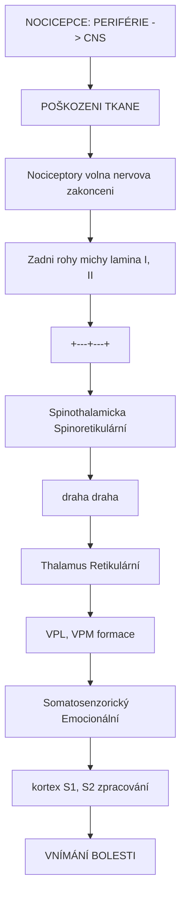
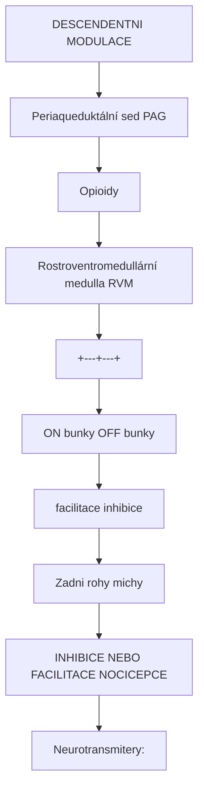
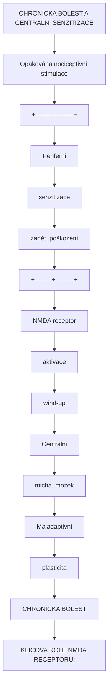
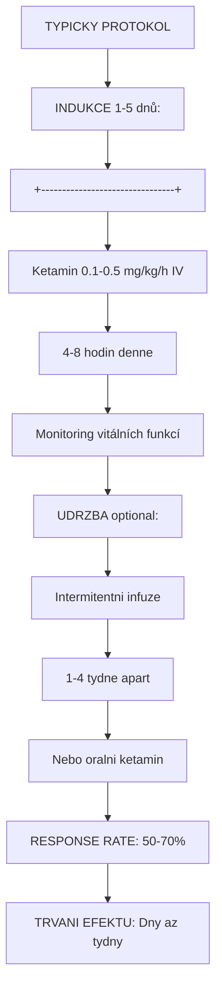
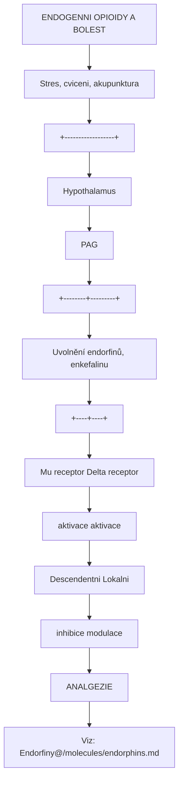

+++
title = "Bolest"
description = "Neurobiologie bolesti - nocicepce, chronicka bolest a role psychedelik a ketaminu v analgezii"
weight = 3
insert_anchor_links = "right"

[taxonomies]
categories = ["neurologie", "poruchy", "lecba"]
tags = ["bolest", "nocicepce", "ketamin", "analgezie", "chronicka-bolest", "NMDA", "opioidy"]
+++

# Bolest - Neurobiologie a psychedelicka analgezie

**Bolest** je komplexni senzoricky a emocni zazitek spojeny s aktualni nebo potencialni tkankove poškození. Chronicka bolest postihuje odhadem 20% dospelé populace a predstavuje jednu z nejcastejsich pricin disability. [Ketamin](@/alkaloids/ketamin.md) a psychedelika predstavuji nove terapeuticke moznosti, zejmena pro bolest refrakterní na konvencni lecbu.

---

## Klasifikace bolesti

### Podle trvani

| Typ | Trvani | Charakteristika |
|-----|--------|-----------------|
| **Akutni** | Hodiny-dny | Varovny signal, adaptivni |
| **Subakutní** | Dny-tydny | Prechodna |
| **Chronicka** | >3 mesice | Maladaptivni, onemocneni samo o sobe |

### Podle mechanismu

| Typ | Mechanismus | Priklady |
|-----|-------------|----------|
| **Nociceptivní** | Aktivace nociceptoru | Traumaticka, postoperacni |
| **Zánětlivá** | Zánětové mediatory | Artritida, infekce |
| **Neuropaticka** | Poskozeni nervu | Diabeticka neuropatie, postherpetická |
| **Nociplastická** | Centrální senzitizace | Fibromyalgie, IBS |
| **Psychogenní** | Psychologicke faktory | Somatizace |

---

## Neurobiologie bolesti

### Nocicepce - dráhy bolesti



<details>
<summary>ASCII verze diagramu</summary>

```
NOCICEPCE: PERIFÉRIE -> CNS

POŠKOZENI TKANE
        |
        v
Nociceptory (volna nervova zakonceni)
- A-delta vlakna (rychla, ostra)
- C vlakna (pomala, paliva)
        |
        v
Zadni rohy michy (lamina I, II)
- Glutamat, substance P
        |
    +---+---+
    |       |
    v       v
Spinothalamicka  Spinoretikulární
draha            draha
    |               |
    v               v
Thalamus      Retikulární
(VPL, VPM)    formace
    |               |
    v               v
Somatosenzorický   Emocionální
kortex (S1, S2)    zpracování
        |
        v
VNÍMÁNÍ BOLESTI
```

</details>

### Modulace bolesti



<details>
<summary>ASCII verze diagramu</summary>

```
DESCENDENTNI MODULACE

Periaqueduktální sed (PAG)
        |
        | [Opioidy]
        v
Rostroventromedullární medulla (RVM)
        |
    +---+---+
    |       |
    v       v
ON bunky   OFF bunky
(facilitace) (inhibice)
    |           |
    v           v
Zadni rohy michy
        |
        v
INHIBICE NEBO FACILITACE NOCICEPCE

Neurotransmitery:
- Endorfiny, enkefaliny
- Serotonin (5-HT)
- Noradrenalin
- Endokanabinoidy
```

</details>

### Centrální senzitizace



<details>
<summary>ASCII verze diagramu</summary>

```
CHRONICKA BOLEST A CENTRALNI SENZITIZACE

Opakována nociceptivni stimulace
        |
        v
+------------------+
| Periferni        |
| senzitizace      |
| (zanět, poškození)|
+--------+---------+
         |
         v
+------------------+
| NMDA receptor    |
| aktivace         |
| (wind-up)        |
+--------+---------+
         |
         v
+------------------+
| Centralni        |
| senzitizace      |
| (micha, mozek)   |
+--------+---------+
         |
         v
+------------------+
| Maladaptivni     |
| plasticita       |
| CHRONICKA BOLEST |
+------------------+

KLICOVA ROLE NMDA RECEPTORU:
- Glutamat aktivuje NMDA
- Mg2+ blok je odstranen
- Ca2+ influx
- LTP-like zmeny
- Zvysena excitabilita
- Allodynia, hyperalgezie
```

</details>

---

## Standardni lecba

### Farmakoterapie

| Trida | Priklady | Mechanismus | Indikace |
|-------|----------|-------------|----------|
| **NSAIDs** | Ibuprofen, diklofenak | COX inhibice | Zanětlivá, akutni |
| **Paracetamol** | Acetaminofen | Centralni, COX-3? | Mirna bolest |
| **Opioidy** | Morfin, oxykodon | Mu agonismus | Silná akutni/chronicka |
| **Antikonvulziva** | Gabapentin, pregabalin | Ca2+ kanaly | Neuropaticka |
| **Antidepresiva** | Duloxetin, amitriptylin | 5-HT/NA | Neuropaticka, chronicka |
| **Lokalni anestetika** | Lidokain | Na+ kanaly | Lokalizovana |

### Limitace opioidní terapie

| Problem | Dusledek |
|---------|----------|
| **Tolerance** | Eskalace davek |
| **Zavislost** | Opioidni krize |
| **Hyperalgezie** | Paradoxne zvysena bolest |
| **Vedlejsi ucinky** | Zapca, sedace, deprese dechu |
| **Omezenost pro chronickou** | Neefektivita dlouhodobeho podavani |

---

## Ketamin v lecbe bolesti

### Mechanismus analgezie

```mermaid
flowchart TD
    node_KETAMINABOLEST["KETAMIN A BOLEST"]
    node_Ketamin["Ketamin"]
    node_NMDAreceptorblokda["+---&gt; NMDA receptor blokáda"]
    node_Preruseniwindup["+---&gt; Preruseni wind-up"]
    node_Snizenicentralnisenz["+---&gt; Snizeni centralni senzitizace"]
    node_Potlacenimaladaptivn["+---&gt; Potlaceni maladaptivni plasticity"]
    node_Opioidnmodulace["+---&gt; Opioidní modulace"]
    node_Mukappainterakce["+---&gt; Mu, kappa interakce"]
    node_Snizenopioidnitolera["+---&gt; Snizení opioidni tolerance"]
    node_Monoaminergni["+---&gt; Monoaminergni"]
    node_NA5HTmodulace["+---&gt; NA, 5-HT modulace"]
    node_Descendentniinhibice["+---&gt; Descendentni inhibice"]
    node_Protizantlivy["+---&gt; Protizanětlivy"]
    node_Snizenicytokin["+---&gt; Snizeni cytokin"]
    node_Mikroglilnmodulace["+---&gt; Mikrogliální modulace"]
    node_VYSLEDEKAnalgezienav["VYSLEDEK: Analgezie na vice urovnich"]

    node_KETAMINABOLEST --> node_Ketamin
    node_Ketamin --> node_NMDAreceptorblokda
    node_NMDAreceptorblokda --> node_Preruseniwindup
    node_Preruseniwindup --> node_Snizenicentralnisenz
    node_Snizenicentralnisenz --> node_Potlacenimaladaptivn
    node_Potlacenimaladaptivn --> node_Opioidnmodulace
    node_Opioidnmodulace --> node_Mukappainterakce
    node_Mukappainterakce --> node_Snizenopioidnitolera
    node_Snizenopioidnitolera --> node_Monoaminergni
    node_Monoaminergni --> node_NA5HTmodulace
    node_NA5HTmodulace --> node_Descendentniinhibice
    node_Descendentniinhibice --> node_Protizantlivy
    node_Protizantlivy --> node_Snizenicytokin
    node_Snizenicytokin --> node_Mikroglilnmodulace
    node_Mikroglilnmodulace --> node_VYSLEDEKAnalgezienav

    click node_KETAMINABOLEST "/alkaloids/ketamin/" "KETAMIN A BOLEST"
    click node_Ketamin "/alkaloids/ketamin/" "Ketamin"
    click node_NMDAreceptorblokda "/receptors/nmda/" "+---> NMDA receptor blokáda"
```



<details>
<summary>ASCII verze diagramu</summary>

```
KETAMIN A BOLEST

Ketamin
    |
    +---> NMDA receptor blokáda
    |         |
    |         +---> Preruseni wind-up
    |         +---> Snizeni centralni senzitizace
    |         +---> Potlaceni maladaptivni plasticity
    |
    +---> Opioidní modulace
    |         |
    |         +---> Mu, kappa interakce
    |         +---> Snizení opioidni tolerance
    |
    +---> Monoaminergni
    |         |
    |         +---> NA, 5-HT modulace
    |         +---> Descendentni inhibice
    |
    +---> Protizanětlivy
              |
              +---> Snizeni cytokin
              +---> Mikrogliální modulace

VYSLEDEK: Analgezie na vice urovnich
```

</details>

### Klinicke pouziti

| Indikace | Davka | Cesta | Evidence |
|----------|-------|-------|----------|
| **Akutni pooperacni** | 0.1-0.5 mg/kg | IV | Silna |
| **Chronicka neuropaticka** | Infuze | IV | Stredni |
| **CRPS** | Serialni infuze | IV | Stredni |
| **Fibromyalgie** | 0.5 mg/kg | IV | Slabsi |
| **Migréna (refrakterní)** | Variabilni | IV, IN | Omezena |

### Ketaminove infuze pro chronickou bolest



<details>
<summary>ASCII verze diagramu</summary>

```
TYPICKY PROTOKOL

INDUKCE (1-5 dnů):
+--------------------------------+
| Ketamin 0.1-0.5 mg/kg/h IV     |
| 4-8 hodin denne                |
| Monitoring vitálních funkcí    |
+--------------------------------+
            |
            v
UDRZBA (optional):
+--------------------------------+
| Intermitentni infuze           |
| 1-4 tydne apart                |
| Nebo oralni ketamin            |
+--------------------------------+

RESPONSE RATE: 50-70%
TRVANI EFEKTU: Dny az tydny
```

</details>

---

## Psychedelika a bolest

### Historicka evidence

LSD a psilocybin byly pouzivany pro bolest v 1960s:

| Studie | Latka | Indikace | Vysledky |
|--------|-------|----------|----------|
| **Kast 1963** | LSD | Terminalní rakovina | Snizení bolesti a uzkosti |
| **Pahnke 1969** | DPT | Terminalní pacienti | Analgezie, zmena vnimani |

### Soucasny vyzkum

| Latka | Indikace | Status | Mechanismus |
|-------|----------|--------|-------------|
| **Psilocybin** | Cluster headache | Open-label, case series | 5-HT2A, neuroplasticita |
| **Psilocybin** | Migréna | Phase II | 5-HT2A modulace |
| **LSD** | Cluster headache | Case reports | 5-HT2A |
| **DMT/Ayahuasca** | Chronicka bolest | Anekdotalni | 5-HT2A, sigma-1 |

### Psilocybin a cluster headache

```
CLUSTER HEADACHE A PSILOCYBIN

Cluster headache (Hortonova neuralgie):
- "Sebevražedná bolest"
- Unilaterální, periorbitální
- Cirkadiánní vzorec
- Limitovane terapeuticke moznosti

PSILOCYBIN EVIDENCE:
- Case series (Sewell et al. 2006)
- N = 53 pacientů
- 52% kompletni ukonceni clusteru
- 88% redukce frekvence
- Davka: Často sub-psychedelicka

MECHANISMUS:
- 5-HT2A modulace hypothalamu
- Neuroplasticita
- "Reset" cirkadiánních okruhů
- Vazokonstrikce (jako triptany)
```

---

## Endorfiny a endogenní analgezie

### Endogenní opioidní system



<details>
<summary>ASCII verze diagramu</summary>

```
ENDOGENNI OPIOIDY A BOLEST

Stres, cviceni, akupunktura
        |
        v
+------------------+
| Hypothalamus     |
| PAG              |
+--------+---------+
         |
         v
Uvolnění endorfinů, enkefalinu
         |
    +----+----+
    |         |
    v         v
Mu receptor   Delta receptor
aktivace      aktivace
    |             |
    v             v
Descendentni  Lokalni
inhibice      modulace
         |
         v
ANALGEZIE

Viz: [Endorfiny](@/molecules/endorphins.md)
```

</details>

### Psychedelika a endogenní opioidy

| Interakce | Evidence |
|-----------|----------|
| **Psilocybin** | Minimalni prima opioidni aktivita |
| **Ibogain** | Kappa agonista + opioidni modulace |
| **Salvinorin A** | Silny kappa agonista |
| **DMT** | Sigma-1 (neprime) |

---

## Kontraindikace psychedelik u bolesti

### Rizika

| Stav | Duvod kontraindikace |
|------|----------------------|
| **Psychotické poruchy** | Exacerbace |
| **Kardiovaskularni** | Ketamin - hypertenze |
| **Hepatalni insuficience** | Metabolismus |
| **Tehotenstvi** | Nezname riziko |

### Interakce s analgetiky

| Kombinace | Riziko |
|-----------|--------|
| **Ketamin + opioidy** | Potenciace, respiracni deprese |
| **Psilocybin + SSRI** | Snizeny ucinek |
| **Ibogain + opioidy** | Kardiotoxicita |

---

## Budouci smery

### Aktivni vyzkum

| Instituce | Latka | Indikace | Faze |
|-----------|-------|----------|------|
| **Yale** | Psilocybin | Migréna | II |
| **Johns Hopkins** | Psilocybin | Cluster headache | II |
| **Clusterbusters** | Psilocybin, LSD | Cluster headache | Observacni |

### Nove pristupy

1. **Mikrodavkovani** - Nedostatecna evidence pro bolest
2. **Kombinace** - Ketamin + psychoterapie
3. **Non-halucinogeni psychoplastogeny** - Tabernanthalog, etc.
4. **Sigma-1 agoniste** - DMT derivaty

---

## Reference

### Neurobiologie bolesti

1. Basbaum, A.I. et al. (2009). *Cellular and molecular mechanisms of pain*. Cell.

2. Woolf, C.J. (2011). *Central sensitization: implications for the diagnosis and treatment of pain*. Pain.

### Ketamin a bolest

3. Niesters, M. et al. (2014). *Ketamine for chronic pain: risks and benefits*. British Journal of Clinical Pharmacology.

4. Cohen, S.P. et al. (2018). *Consensus Guidelines on the Use of Intravenous Ketamine Infusions for Chronic Pain*. Regional Anesthesia & Pain Medicine.

### Psychedelika a bolest

5. Sewell, R.A. et al. (2006). *Response of cluster headache to psilocybin and LSD*. Neurology.

6. Schindler, E.A.D. et al. (2021). *Exploratory investigation of a patient-informed low-dose psilocybin pulse regimen in the suppression of cluster headache*. Headache.

---

## Viz také

### Psychedelická analgezie
- [Ketamin](@/alkaloids/ketamin.md) - **FDA schváleno pro refrakterní bolest, NMDA blokáda**
- [LSD](@/alkaloids/lsd.md) - **Cluster headaches, experimentální chronická bolest**
- [Psilocybin](@/alkaloids/psilocybin.md) - Phantom pain, experimentální
- [DMT](@/alkaloids/dmt.md) - Krátkodobá analgezie
- [Ibogain](@/alkaloids/ibogaine.md) - κ-opioidní aktivita, opioidní withdrawal

### Kappa-opioidní systém
- [Salvinorin A](@/alkaloids/salvinorin.md) - **Selektivní κ-opioidní agonista**
- [κ-opioidní receptory](receptors/kappa-opioid.md) - Analgezie bez závislosti

### Cílové mozkové oblasti
- [Prefrontální kortex](@/brain/prefrontal-cortex.md) - **Top-down modulace bolesti**
- **Periaqueduktální šeď (PAG)** - Centrální analgetické centrum
- **Rostral ventromedial medulla** - Descendentní inhibice
- [Thalamus](@/brain/thalamus.md) - Senzorické zpracování
- **Anterior cingulate cortex** - Emoční komponenta bolesti
- **Insula** - Interoceptivní vnímání

### Receptory a mechanismy
- [NMDA receptor](@/receptors/nmda.md) - **Centrální senzitizace, cíl ketaminu**
- [5-HT2A receptor](@/receptors/5-ht2a.md) - Descendentní modulace
- **μ-opioidní receptory** - Klasická analgezie
- **κ-opioidní receptory** - Analgezie bez euforie
- [GABA-A receptor](@/receptors/gaba-a.md) - Spinální inhibice

### Endogenní analgetické systémy
- [Endorfiny](@/molecules/endorphins.md) - **Endogenní opiáty**
- **Endokanabinoids** - CB1/CB2 modulace
- **Monoaminy** (serotonin, noradrenalin) - Descendentní inhibice

### Farmakologická léčba
- **Opioidy** - μ-agonisté (morfin, oxykodon)
- **NSAID** - COX inhibitory
- **Antikonvulziva** (gabapentin, pregabalin)
- **Antidepresiva** (tricyclické, SNRI)
- **Kanabinoids** - THC, CBD

### Chronická bolest syndrom
- **Fibromyalgie** - Nociplastická bolest
- **Complex regional pain syndrome** - Neuropatická
- **Phantom pain** - Post-amputační
- **Cluster headaches** - Vaskulární

### Komorbidní stavy
- [Deprese](@/conditions/depression.md) - **50% chronické bolesti + deprese**
- **Úzkostné stavy** - Anticipatorní strach z bolesti
- [Závislosti](@/conditions/addiction.md) - Opioidní závislost epidemic

### Nefarmakologické přístupy
- **Kognitiv-behaviorální terapie** - Coping strategie
- **Mindfulness** - Změna vztahu k bolesti
- **Neurostimulace** (TENS, DBS, SCS)
- **Fyzikální terapie** - Rehabilitace

### Souvisejici stavy
- [Deprese](@/conditions/depression.md) - Komorbidita s chronickou bolestí

---

<- Zpet na [Stavy a poruchy](@/conditions/_index.md)
