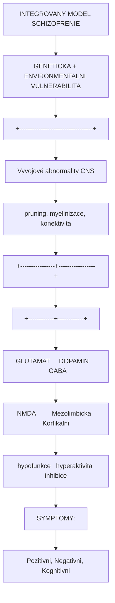

+++
title = "Schizofrenie"
description = "Neurobiologie schizofrenie - dopaminova a glutamátová hypotéza, vztah k psychedelikum a kontraindikace"
weight = 4
insert_anchor_links = "right"

[taxonomies]
categories = ["psychiatrie", "poruchy"]
tags = ["schizofrenie", "psychoza", "dopamin", "glutamat", "NMDA", "5-HT2A", "kontraindikace"]
+++

# Schizofrenie - Neurobiologie a vztah k psychedelikum

**Schizofrenie** je zavazna chronická psychiatricka porucha postihujici priblizne 1% populace. Charakterizuji ji pozitivni symptomy (halucinace, bludy), negativni symptomy (afektivni oploštení, alogie) a kognitivni deficity. Z pohledu psychedelickeho vyzkumu je schizofrenie **absolutni kontraindikaci** pro podani psychedelik.

---

## Epidemiologie

### Zakladni data

| Parametr | Hodnota |
|----------|---------|
| **Prevalence** | ~1% (životni) |
| **Incidence** | 15/100,000 rocne |
| **Vek zacatku** | 18-25 let (muzi), 25-35 let (zeny) |
| **Genetická heritabilita** | ~80% |
| **Zivotni zkraceni** | 15-20 let |
| **Sebevrazednost** | 5-10% |

### Rizikove faktory

| Kategorie | Faktory |
|-----------|---------|
| **Geneticke** | Rodinná anamneza, polygénní riziko |
| **Prenatalni** | Infekce, stres, podvyziva |
| **Perinatalni** | Porodní komplikace |
| **Environmentalni** | Urbanita, migrace, trauma |
| **Uzivani látek** | Kanabis (THC), stimulanty |

---

## Symptomatologie

### Pozitivni symptomy

| Symptom | Popis |
|---------|-------|
| **Halucinace** | Nejcasteji sluchove (hlasy) |
| **Bludy** | Perzekucni, grandiozni, referencni |
| **Dezorganizovane mysleni** | Rozvolnene asociace |
| **Dezorganizovane chovani** | Katatonie, agitace |

### Negativni symptomy

| Symptom | Popis |
|---------|-------|
| **Afektivni oplosteni** | Snizena emocionální exprese |
| **Alogie** | Chudost reci |
| **Avolice** | Nedostatek motivace |
| **Anhedonie** | Neschopnost prozivat radost |
| **Asociálnost** | Sociální stazeni |

### Kognitivni symptomy

| Domena | Deficit |
|--------|---------|
| **Pracovni pamet** | Snizena |
| **Pozornost** | Narusena |
| **Exekutivni funkce** | Deficit |
| **Rychlost zpracovani** | Zpomalena |

---

## Neurobiologie

### Dopaminova hypoteza

```mermaid
flowchart TD
    node_DOPAMINOVAHYPOTEZAkl["DOPAMINOVA HYPOTEZA klasicka"]
    node_POZITIVNISYMPTOMY["POZITIVNI SYMPTOMY:"]
    node_ddb739e1["+------------------+"]
    node_Mezolimbicky["Mezolimbicky"]
    node_system["system"]
    node_VTANAc["VTA -&gt; NAc"]
    node_c9d89b87["+--------+---------+"]
    node_Hyperdopaminergie["Hyperdopaminergie"]
    node_zvysenaDAtransmise["zvysena DA transmise"]
    node_Halucinacebludy["Halucinace, bludy"]
    node_Evidence["Evidence:"]
    node_NEGATIVNIKOGNITIVNIS["NEGATIVNI/KOGNITIVNI SYMPTOMY:"]
    node_Mezokortikalni["Mezokortikalni"]
    node_VTAPFC["VTA -&gt; PFC"]
    node_Hypodopaminergie["Hypodopaminergie"]
    node_snizenaDAvPFC["snizena DA v PFC"]
    node_Negativnsymptomykogn["Negativní symptomy, kognitivni deficity"]

    node_DOPAMINOVAHYPOTEZAkl --> node_POZITIVNISYMPTOMY
    node_POZITIVNISYMPTOMY --> node_ddb739e1
    node_ddb739e1 --> node_Mezolimbicky
    node_Mezolimbicky --> node_system
    node_system --> node_VTANAc
    node_VTANAc --> node_c9d89b87
    node_c9d89b87 --> node_Hyperdopaminergie
    node_Hyperdopaminergie --> node_zvysenaDAtransmise
    node_zvysenaDAtransmise --> node_Halucinacebludy
    node_Halucinacebludy --> node_Evidence
    node_Evidence --> node_NEGATIVNIKOGNITIVNIS
    node_NEGATIVNIKOGNITIVNIS --> node_Mezokortikalni
    node_Mezokortikalni --> node_VTAPFC
    node_VTAPFC --> node_Hypodopaminergie
    node_Hypodopaminergie --> node_snizenaDAvPFC
    node_snizenaDAvPFC --> node_Negativnsymptomykogn
```



<details>
<summary>ASCII verze diagramu</summary>

```
DOPAMINOVA HYPOTEZA (klasicka)

POZITIVNI SYMPTOMY:
+------------------+
| Mezolimbicky     |
| system           |
| (VTA -> NAc)     |
+--------+---------+
         |
         v
Hyperdopaminergie
(zvysena DA transmise)
         |
         v
Halucinace, bludy

Evidence:
- Amfetaminy (DA agoniste) induji psychozu
- Antipsychotika (D2 blokatory) redukuji pozitivni symptomy

NEGATIVNI/KOGNITIVNI SYMPTOMY:
+------------------+
| Mezokortikalni   |
| system           |
| (VTA -> PFC)     |
+--------+---------+
         |
         v
Hypodopaminergie
(snizena DA v PFC)
         |
         v
Negativní symptomy, kognitivni deficity

Evidence:
- D1 deficit v PFC u schizofrenie
- Antipsychotika nezlepsuji negativni symptomy
```

</details>

### Glutamatova hypoteza

```mermaid
flowchart TD
    node_GLUTAMATOVAHYPOTEZAm["GLUTAMATOVA HYPOTEZA moderna"]
    node_NMDARECEPTORHYPOFUNK["NMDA RECEPTOR HYPOFUNKCE"]
    node_ddb739e1["+------------------+"]
    node_Snizenaaktivita["Snizena aktivita"]
    node_NMDAreceptoru["NMDA receptoru"]
    node_kortikolimbicky["kortikolimbicky"]
    node_c9d89b87["+--------+---------+"]
    node_dc692126["+----+----+"]
    node_KortikalniSubkortika["Kortikalni    Subkortikalni"]
    node_PFCstriatum["PFC         striatum"]
    node_SnizenaDisinhibice["Snizena       Disinhibice"]
    node_glutamatovDAneuronu["glutamatová   DA neuronu"]
    node_transmise["transmise"]
    node_NegativniPozitivni["Negativni     Pozitivni"]
    node_symptomysymptomy["symptomy      symptomy"]
    node_Evidence["Evidence:"]

    node_GLUTAMATOVAHYPOTEZAm --> node_NMDARECEPTORHYPOFUNK
    node_NMDARECEPTORHYPOFUNK --> node_ddb739e1
    node_ddb739e1 --> node_Snizenaaktivita
    node_Snizenaaktivita --> node_NMDAreceptoru
    node_NMDAreceptoru --> node_kortikolimbicky
    node_kortikolimbicky --> node_c9d89b87
    node_c9d89b87 --> node_dc692126
    node_dc692126 --> node_KortikalniSubkortika
    node_KortikalniSubkortika --> node_PFCstriatum
    node_PFCstriatum --> node_SnizenaDisinhibice
    node_SnizenaDisinhibice --> node_glutamatovDAneuronu
    node_glutamatovDAneuronu --> node_transmise
    node_transmise --> node_NegativniPozitivni
    node_NegativniPozitivni --> node_symptomysymptomy
    node_symptomysymptomy --> node_Evidence

    click node_NMDARECEPTORHYPOFUNK "/receptors/nmda/" "NMDA RECEPTOR HYPOFUNKCE"
    click node_NMDAreceptoru "/receptors/nmda/" "NMDA receptoru"
```



<details>
<summary>ASCII verze diagramu</summary>

```
GLUTAMATOVA HYPOTEZA (moderna)

NMDA RECEPTOR HYPOFUNKCE
         |
         v
+------------------+
| Snizena aktivita |
| NMDA receptoru   |
| (kortikolimbicky)|
+--------+---------+
         |
    +----+----+
    |         |
    v         v
Kortikalni    Subkortikalni
(PFC)         (striatum)
    |              |
    v              v
Snizena       Disinhibice
glutamatová   DA neuronu
transmise
    |              |
    v              v
Negativni     Pozitivni
symptomy      symptomy

Evidence:
- Ketamin, PCP (NMDA antagoniste) induji "schizofrenní" symptomy
- Glutamatové abnormality v PFC u schizofrenie
- Genetické varianty v NMDA-related genech
```

</details>

### Serotoninova hypoteza

```
5-HT2A A SCHIZOFRENIE

Psychedelika (5-HT2A agoniste):
- Induji percepční distorze podobné halucinacím
- Aktivuji podobné mozkové oblasti
- ALE: Fenomenologicky odlisne od schizofrenie

Atypicka antipsychotika:
- Blokaduji 5-HT2A + D2
- Lepsí efekt na negativni symptomy
- Menší EPS

IMPLIKACE:
5-HT2A aktivace NENI model schizofrenie
ale muze exacerbovat symptomy u vulnerabilnich
```

### Integrovany model



<details>
<summary>ASCII verze diagramu</summary>

```
INTEGROVANY MODEL SCHIZOFRENIE

GENETICKA + ENVIRONMENTALNI VULNERABILITA
                |
                v
+----------------------------------+
| Vyvojové abnormality CNS         |
| (pruning, myelinizace, konektivita)|
+----------------+-----------------+
                 |
    +------------+------------+
    |            |            |
    v            v            v
GLUTAMAT     DOPAMIN      GABA
NMDA         Mezolimbicka  Kortikalni
hypofunkce   hyperaktivita inhibice
    |            |            |
    +------------+------------+
                 |
                 v
+----------------------------------+
| SYMPTOMY:                        |
| Pozitivni, Negativni, Kognitivni |
+----------------------------------+
```

</details>

---

## Psychedelika a schizofrenie

### Absolutni kontraindikace

**KRITICKE VAROVANI**: Psychedelika jsou **absolutne kontraindikovana** u schizofrenie a jinych psychotickych poruch.

| Riziko | Duvod |
|--------|-------|
| **Exacerbace psychozy** | 5-HT2A aktivace |
| **Prolongovana psychoza** | Tydny-mesice |
| **Precipitace u vulnerabilnich** | Latentni psychoza |
| **Znemozneni lecby** | Interakce s antipsychotiky |

### Mechanismus rizika

```mermaid
flowchart TD
    node_PROCJSOUPSYCHEDELIKA["PROC JSOU PSYCHEDELIKA NEBEZPECNA U SCHIZOFRENIE"]
    node_PSYCHEDELIKUMpsilocy["PSYCHEDELIKUM psilocybin, LSD"]
    node_5HT2Areceptoraktivac["5-HT2A receptor aktivace"]
    node_Kortikalniglutamatuv["+---&gt; Kortikalni glutamat uvolneni"]
    node_DezintegraceDMN["+---&gt; Dezintegrace DMN"]
    node_Zmenapercepce["+---&gt; Zmena percepce"]
    node_USCHIZOFRENIE["U SCHIZOFRENIE:"]
    node_ddb739e1["+------------------+"]
    node_Preexistujici["Preexistujici"]
    node_dysregulace["dysregulace:"]
    node_DAGlu5HT["- DA, Glu, 5-HT"]
    node_Konektivita["- Konektivita"]
    node_c9d89b87["+--------+---------+"]
    node_PSYCHEDELIKUMJEBENZI["PSYCHEDELIKUM JE 'BENZIN NA OHEN'"]
    node_Exacerbacepozitivnic["Exacerbace pozitivnich symptomu"]
    node_Prolongovanapsychoza["Prolongovana psychoza"]
    node_Potencialniireverzib["Potencialni ireverzibilni zhorseni"]

    node_PROCJSOUPSYCHEDELIKA --> node_PSYCHEDELIKUMpsilocy
    node_PSYCHEDELIKUMpsilocy --> node_5HT2Areceptoraktivac
    node_5HT2Areceptoraktivac --> node_Kortikalniglutamatuv
    node_Kortikalniglutamatuv --> node_DezintegraceDMN
    node_DezintegraceDMN --> node_Zmenapercepce
    node_Zmenapercepce --> node_USCHIZOFRENIE
    node_USCHIZOFRENIE --> node_ddb739e1
    node_ddb739e1 --> node_Preexistujici
    node_Preexistujici --> node_dysregulace
    node_dysregulace --> node_DAGlu5HT
    node_DAGlu5HT --> node_Konektivita
    node_Konektivita --> node_c9d89b87
    node_c9d89b87 --> node_PSYCHEDELIKUMJEBENZI
    node_PSYCHEDELIKUMJEBENZI --> node_Exacerbacepozitivnic
    node_Exacerbacepozitivnic --> node_Prolongovanapsychoza
    node_Prolongovanapsychoza --> node_Potencialniireverzib

    click node_PSYCHEDELIKUMpsilocy "/alkaloids/psilocybin/" "PSYCHEDELIKUM psilocybin, LSD"
    click node_5HT2Areceptoraktivac "/receptors/5-ht2a/" "5-HT2A receptor aktivace"
```



<details>
<summary>ASCII verze diagramu</summary>

```
PROC JSOU PSYCHEDELIKA NEBEZPECNA U SCHIZOFRENIE

PSYCHEDELIKUM (psilocybin, LSD)
        |
        v
5-HT2A receptor aktivace
        |
        +---> Kortikalni glutamat uvolneni
        |
        +---> Dezintegrace DMN
        |
        +---> Zmena percepce

U SCHIZOFRENIE:
+------------------+
| Preexistujici    |
| dysregulace:     |
| - DA, Glu, 5-HT  |
| - Konektivita    |
+--------+---------+
         |
         v
PSYCHEDELIKUM JE "BENZIN NA OHEN"
         |
         v
Exacerbace pozitivnich symptomu
Prolongovana psychoza
Potencialni ireverzibilni zhorseni
```

</details>

### Screeningove otazky

Pred jakymkoliv psychedelickym podanim je nutny screening:

| Otazka | Vylucujici odpoved |
|--------|-------------------|
| **Osobni anamneza psychozy** | Ano |
| **Rodinná anamneza schizofrenie** | Ano (1. stupen) |
| **Rodinná anamneza bipolární s psychozou** | Ano (1. stupen) |
| **Prodromální symptomy** | Ano |
| **Uzivani antipsychotik** | Ano |

### Rizikove faktory pro psychedeliky-indukovanou psychozu

| Faktor | Riziko |
|--------|--------|
| **Osobní anamneza psychozy** | **Absolutni kontraindikace** |
| **Rodinná anamneza (1. stupen)** | **Relativni/absolutni kontraindikace** |
| **Premorbidní schizotypni rysy** | Zvysene riziko |
| **Vysoke davky** | Zvysene riziko |
| **Nepripraveny set/setting** | Zvysene riziko |
| **Kanabis kombinace** | Zvysene riziko |

---

## "Model psychosis" a psychedelika

### Historicky kontext

V 1950s-60s byla psychedelika zkoumania jako "model psychosis":

| Aspekt | Psychedelika | Schizofrenie |
|--------|--------------|--------------|
| **Halucinace** | Vizualni | Sluchove |
| **Bludy** | Vzacne | Caste |
| **Insight** | Zachovany | Naruseny |
| **Trvani** | Hodiny | Chronicke |
| **Affect** | Variabilni | Oploštěný |
| **Kognitivni** | Minimalni | Vyrazne |

### Soucasny pohled

Psychedelicka zkusenost **NENI validnim modelem schizofrenie**:

1. **Fenomenologicky odlisna** - Vizualni vs. sluchove halucinace
2. **Insight zachovany** - Uzivatel vi, ze je pod vlivem
3. **Reverzibilni** - Ucinky odezni
4. **Jiny mechanismus** - 5-HT2A vs. komplexni dysregulace

### NMDA antagoniste jako model

```
NMDA ANTAGONISTE VS. 5-HT2A AGONISTE

KETAMIN, PCP (NMDA blokada):
- Podobnejsi negativnim symptomum
- Sociální stazeni
- Kognitivni deficity
- Disorganizovane mysleni
-> LEPSI MODEL nez klasicka psychedelika

5-HT2A AGONISTE (psilocybin, LSD):
- Percepční distorze
- Zmeny mysleni
- ALE: Zachovany insight
- ALE: Vizualni (ne sluchove)
-> LIMITOVANY MODEL
```

---

## Lecba schizofrenie

### Farmakoterapie

| Generace | Priklady | Mechanismus | Efekt |
|----------|----------|-------------|-------|
| **1. generace** | Haloperidol, chlorpromazin | D2 blokada | Pozitivni symptomy |
| **2. generace** | Risperidon, olanzapin, klozapin | D2 + 5-HT2A blokada | Pozitivni + castecne negativni |
| **3. generace** | Aripiprazol, kariprazin | D2 parcialni agonismus | Lepsi snášenlivost |

### Proc psychedelika NEJSOU terapeutickou moznosti

| Duvod | Vysvetleni |
|-------|------------|
| **Mechanismus** | 5-HT2A agonismus je kontraproduktivni |
| **Exacerbace** | Zhoršeni pozitivnich symptomu |
| **Kontraindikace** | Absolutni ve všech klinickych studiích |
| **Antipsychotika** | Blokaduji ucinek psychedelik (a naopak) |

---

## Budouci smery

### Potencialni oblasti (s extremni opatrnosti)

| Oblast | Status | Poznamka |
|--------|--------|----------|
| **Glutamatergni modulace** | Aktivni vyzkum | Glycinove agoniste, D-serin |
| **mGluR modulatory** | Preklinicka | Pozitivni alostericke modulatory |
| **Alpha-7 nAChR** | Klinicka | Pro kognitivni symptomy |

### Co psychedelicky vyzkum prinasi pro schizofrenii

1. **Pochopeni 5-HT2A** - Mechanismy psychozy
2. **Neuroplasticita** - Potencialni terapeuticky cil
3. **Konektivita** - DMN a psychoza
4. **Biomarkery** - Predikce rizika

---

## Reference

### Neurobiologie schizofrenie

1. Howes, O.D. & Kapur, S. (2009). *The dopamine hypothesis of schizophrenia: version III*. Schizophrenia Bulletin.

2. Coyle, J.T. (2012). *NMDA receptor and schizophrenia: a brief history*. Schizophrenia Bulletin.

3. Meltzer, H.Y. (1999). *The role of serotonin in antipsychotic drug action*. Neuropsychopharmacology.

### Psychedelika a psychoza

4. Vollenweider, F.X. & Geyer, M.A. (2001). *A systems model of altered consciousness: integrating natural and drug-induced psychoses*. Brain Research Bulletin.

5. Johnson, M.W. et al. (2018). *Classic psychedelics: An integrative review of epidemiology, therapeutics, mystical experience, and brain network function*. Pharmacology & Therapeutics.

### Screening a bezpecnost

6. Johnson, M.W. et al. (2008). *Human hallucinogen research: guidelines for safety*. Journal of Psychopharmacology.

---

## Viz take

### Psychoaktivni latky
- [Psilocybin](@/alkaloids/psilocybin.md) - Kontraindikovan u psychozy
- [LSD](@/alkaloids/lsd.md) - Kontraindikovan u psychozy
- [Ketamin](@/alkaloids/ketamin.md) - NMDA antagonista

### Receptory
- [5-HT2A receptor](@/receptors/5-ht2a.md) - Cil psychedelik
- [NMDA receptor](@/receptors/nmda.md) - Glutamatova hypoteza
- [D2 receptor](@/receptors/dopamine.md) - Cil antipsychotik

### Souvisejici stavy
- [Deprese](@/conditions/depression.md) - Indikace pro psychedelika (na rozdil od schizofrenie)

---

<- Zpet na [Stavy a poruchy](@/conditions/_index.md)
