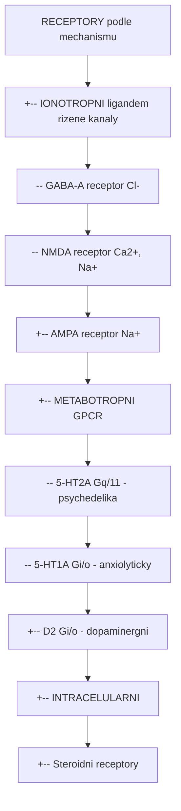
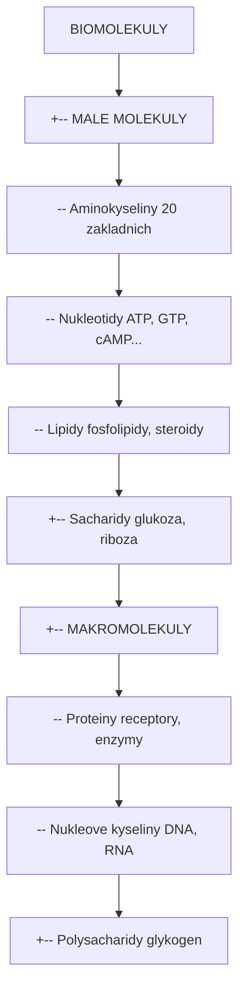
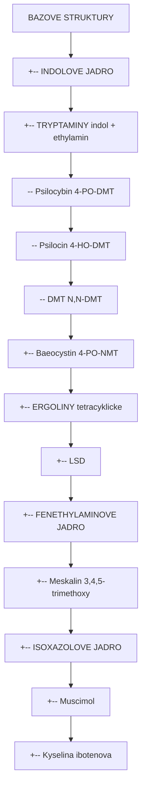
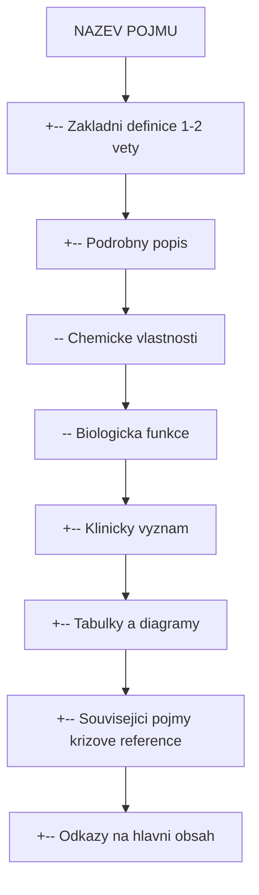

+++
title = "Glosar"
description = "Komplexni encyklopedicky glosar biochemickych, farmakologickych a neurochemickych pojmu - definice, klasifikace a krizove reference"
sort_by = "title"
weight = 5
insert_anchor_links = "right"
+++

# Glosar - Encyklopedie pojmu

**Komplexni glosar** biochemickych, farmakologickych a neurochemickych pojmu pouzivanych v cele encyklopedii Psychonautics. Obsahuje **4 zakladni pojmy** s planovanym rozsirenim na 50+ hesel. Kazdy pojem je zasazen do kontextu psychoaktivnich latek a jejich mechanismu ucinku.

---

## Ucel glosare

### Vzdelavaci cile

Glosar slouzi jako **referencni prirucka** pro pochopeni odborne terminologie v nasledujicich oblastech:

| Oblast | Popis | Relevance |
|--------|-------|-----------|
| **Neurofarmakologie** | Interakce latek s nervovym systemem | Mechanismy ucinku psychedelik |
| **Biochemie** | Chemicke procesy v zivych organismech | Metabolismus, biosynteza |
| **Molekularni biologie** | Struktura a funkce biomolekul | Receptory, signalni drahy |
| **Farmakokinetica** | Osud latek v organismu | Absorpce, distribuce, eliminace |
| **Toxikologie** | Skodlive ucinky latek | Bezpecnostni profily |

### Pro koho je glosar urcen

- **Studenti** biochemie, farmakologie a neurovedy
- **Vyzkumnici** v oblasti psychedelickeho vyzkumu
- **Zdravotnici** zajimajici se o psychedeliky-asistovanou terapii
- **Laicka verejnost** s zajmem o vedecke pozadi psychoaktivnich latek

---

## Kategorie pojmu

### 1. Receptory a signalizace

Pojmy tykajici se bunecnych receptoru a signalnich drah.

| Pojem | Definice | Souvisejici obsah |
|-------|----------|-------------------|
| [Receptor](@/glossary/receptor.md) | Proteinova struktura vazici ligandy | [Receptory](@/receptors/_index.md), [5-HT2A](@/receptors/5-ht2a.md) |
| Agonista | Latka aktivujici receptor | Psilocin, muscimol |
| Antagonista | Latka blokujici receptor | Ketanserin |
| Alostericka modulace | Zmena aktivity vazebneho mista | Benzodiazepiny |
| Signalni transdukce | Prenos signalu v bunce | cAMP, IP3, Ca2+ |

#### Typy receptoru



<details>
<summary>ASCII verze diagramu</summary>

```
RECEPTORY (podle mechanismu)
    |
    +-- IONOTROPNI (ligandem rizene kanaly)
    |       |-- GABA-A receptor (Cl-)
    |       |-- NMDA receptor (Ca2+, Na+)
    |       +-- AMPA receptor (Na+)
    |
    +-- METABOTROPNI (GPCR)
    |       |-- 5-HT2A (Gq/11 - psychedelika)
    |       |-- 5-HT1A (Gi/o - anxiolyticky)
    |       +-- D2 (Gi/o - dopaminergni)
    |
    +-- INTRACELULARNI
            +-- Steroidni receptory
```

</details>

### 2. Neurotransmitery

Endogenni signalni molekuly nervoveho systemu.

| Pojem | Definice | Souvisejici obsah |
|-------|----------|-------------------|
| Serotonin (5-HT) | Modulacni neurotransmiter | [5-HT2A](@/receptors/5-ht2a.md), psychedelika |
| Glutamat | Hlavni excitacni neurotransmiter | [NMDA](@/receptors/nmda.md), plasticita |
| Dopamin | Neurotransmiter odmeny | D2 receptory, LSD |
| Acetylcholin | Neurotransmiter motoriky a kognice | Muskarinove receptory |

#### Rovnovaha neurotransmise

```
EXCITACE (Glutamat)     <=======>     INHIBICE (GABA)
        |                                    |
        v                                    v
    Depolarizace                      Hyperpolarizace
    Na+, Ca2+ influx                  Cl- influx
        |                                    |
        v                                    v
    Akcni potencial                  Tlumeni aktivity
    Synapticky prenos                Prevence excitotoxicity

Zdravy mozek vyzaduje dynamickou rovnovahu mezi obema systemy.
Psychoaktivni latky moduluji tuto rovnovahu ruznymi mechanismy.
```

### 3. Biochemicke pojmy

Zakladni chemicke a biochemicke terminy.

| Pojem | Definice | Souvisejici obsah |
|-------|----------|-------------------|
| [Fosfat](@/glossary/fosfat.md) | Funkcni skupina PO4 | ATP, fosforylace |
| [Nukleotid](@/glossary/nukleotid.md) | Stavebni jednotka DNA/RNA | [Nukleotidy](@/nucleotids/_index.md), cAMP |
| Aminokyselina | Stavebni jednotka proteinu | Tryptofan (prekurzor) |
| Enzym | Biologicky katalyzator | MAO, CYP450 |
| Koenzym | Pomocna molekula enzymu | NAD+, PLP (B6) |

#### Hierarchie biomolekul



<details>
<summary>ASCII verze diagramu</summary>

```
BIOMOLEKULY
    |
    +-- MALE MOLEKULY
    |       |-- Aminokyseliny (20 zakladnich)
    |       |-- Nukleotidy (ATP, GTP, cAMP...)
    |       |-- Lipidy (fosfolipidy, steroidy)
    |       +-- Sacharidy (glukoza, riboza)
    |
    +-- MAKROMOLEKULY
            |-- Proteiny (receptory, enzymy)
            |-- Nukleove kyseliny (DNA, RNA)
            +-- Polysacharidy (glykogen)
```

</details>

### 4. Farmakologicke pojmy

Terminy tykajici se pusobeni leciv a psychoaktivnich latek.

| Pojem | Definice | Priklad |
|-------|----------|---------|
| Afinita (Ki) | Sila vazby ligandu k receptoru | LSD Ki = 1-2 nM |
| Eficacia (Emax) | Maximalni ucinek agonisty | Plny vs. parcialni agonista |
| Potence | Davka potrebna pro ucinek | LSD > Psilocin > Meskalin |
| Biodostupnost | Podil latky dosahujici cirkulace | Psilocybin ~50% |
| Polocas (T1/2) | Cas do snizeni koncentrace na polovinu | LSD T1/2 = 3-5 h |
| Prodrug | Neaktivni prekurzor aktivni latky | Psilocybin -> Psilocin |

#### Farmakokineticky profil

```
         ABSORPCE -> DISTRIBUCE -> METABOLISMUS -> ELIMINACE
              |          |              |              |
              v          v              v              v
         Biodost.   Objem dist.    CYP450, MAO    Renalni
         Tmax       Vazba na       Glukuronidace  Exkrece
                    proteiny

PRIKLAD (Psilocybin):
- Absorpce: GIT, Tmax 1-1.5 h
- Distribuce: Prostup BBB
- Metabolismus: Defosforylace na psilocin
- Eliminace: Glukuronidace, T1/2 2-3 h
```

### 5. Strukturni pojmy

Chemicke struktury a jejich klasifikace.

| Pojem | Definice | Priklady |
|-------|----------|----------|
| Indol | Bicyklicky aromaticky heterocykl | Tryptaminy, ergoliny |
| Fenethylamin | Fenyl + ethylamin | Meskalin, amfetaminy |
| Isoxazol | Peticlenný heterocykl s N a O | Muscimol, kys. ibotenova |
| Tryptamin | Indol + ethylamin | DMT, psilocin, serotonin |
| Ergolin | Tetracyklicka struktura | LSD, ergotamin |

#### Strukturni hierarchie psychoaktivnich alkaloidu



<details>
<summary>ASCII verze diagramu</summary>

```
BAZOVE STRUKTURY
    |
    +-- INDOLOVE JADRO
    |       |
    |       +-- TRYPTAMINY (indol + ethylamin)
    |       |       |-- Psilocybin (4-PO-DMT)
    |       |       |-- Psilocin (4-HO-DMT)
    |       |       |-- DMT (N,N-DMT)
    |       |       +-- Baeocystin (4-PO-NMT)
    |       |
    |       +-- ERGOLINY (tetracyklicke)
    |               +-- LSD
    |
    +-- FENETHYLAMINOVE JADRO
    |       +-- Meskalin (3,4,5-trimethoxy)
    |
    +-- ISOXAZOLOVE JADRO
            +-- Muscimol
            +-- Kyselina ibotenova
```

</details>

---

## Jak pouzivat glosar

### Navigace

1. **Abecedni razeni**: Pojmy jsou razeny abecedne pro rychle vyhledavani
2. **Interni odkazy**: Kazdy pojem obsahuje krizove reference na souvisejici obsah
3. **Kategorie**: Pojmy jsou organizovany do tematickych skupin

### Struktura hesel

Kazde heslo v glosari dodrzuje jednotnou strukturu:



<details>
<summary>ASCII verze diagramu</summary>

```
NAZEV POJMU
|
+-- Zakladni definice (1-2 vety)
|
+-- Podrobny popis
|       |-- Chemicke vlastnosti
|       |-- Biologicka funkce
|       +-- Klinicky vyznam
|
+-- Tabulky a diagramy
|
+-- Souvisejici pojmy (krizove reference)
|
+-- Odkazy na hlavni obsah
```

</details>

### Doporuceny postup studia

| Uroven | Postup | Cil |
|--------|--------|-----|
| **Zacinajici** | Zacnete s [Receptor](@/glossary/receptor.md) a [GABA](@/glossary/gaba.md) | Pochopit zakladni signalizaci |
| **Pokrocily** | Prostudujte [Fosfat](@/glossary/fosfat.md) a [Nukleotid](@/glossary/nukleotid.md) | Pochopit energeticky metabolismus |
| **Expert** | Kombinujte s [Receptory](@/receptors/_index.md) a [Alkaloidy](@/alkaloids/_index.md) | Integrovane znalosti |

---

## Krizove reference na hlavni sekce

### Propojeni s obsahem encyklopedie

| Sekce | Relevantni pojmy | Odkaz |
|-------|------------------|-------|
| **Alkaloidy** | Tryptamin, indol, fenethylamin, SAR | [Alkaloidy](@/alkaloids/_index.md) |
| **Receptory** | Receptor, agonista, GPCR, ionotropni | [Receptory](@/receptors/_index.md) |
| **Houby** | Biosynteza, metabolity, potence | [Houby](@/shrooms/_index.md) |
| **Nukleotidy** | Nukleotid, fosfat, ATP, cAMP | [Nukleotidy](@/nucleotids/_index.md) |
| **Neurotoxiny** | NMDA, excitotoxicita, neurodegenerace | [Neurotoxiny](@/neurotoxins/_index.md) |
| **Mozek** | Neurotransmiter, kortex, synapse | [Mozek](@/brain/_index.md) |
| **Okruhy** | DMN, signalizace, plasticita | [Okruhy](@/circuits/_index.md) |

### Receptorove krizove reference

| Glosarovy pojem | Souvisejici receptor | Psychoaktivni latka |
|-----------------|---------------------|---------------------|
| Serotonin | [5-HT2A](@/receptors/5-ht2a.md) | [LSD](@/alkaloids/lsd.md), [Psilocin](@/alkaloids/psilocin.md) |
| Glutamat | [NMDA](@/receptors/nmda.md) | [Kys. ibotenova](@/neurotoxins/ibotenic-acid.md) |

---

## Rychla reference - Zkratky

### Neurotransmiterove systemy

| Zkratka | Plny nazev | Cesky |
|---------|------------|-------|
| **5-HT** | 5-hydroxytryptamine | Serotonin |
| **DA** | Dopamine | Dopamin |
| **NE** | Norepinephrine | Noradrenalin |
| **ACh** | Acetylcholine | Acetylcholin |
| **Glu** | Glutamate | Glutamat |
| **GABA** | Gamma-aminobutyric acid | Kys. gama-aminomaselna |

### Receptorove typy

| Zkratka | Plny nazev | Mechanismus |
|---------|------------|-------------|
| **GPCR** | G-protein coupled receptor | Metabotropni signalizace |
| **LGIC** | Ligand-gated ion channel | Ionotropni signalizace |
| **RTK** | Receptor tyrosine kinase | Enzymaticka aktivita |
| **NHR** | Nuclear hormone receptor | Genova exprese |

### Farmakologicke parametry

| Zkratka | Plny nazev | Vyznam |
|---------|------------|--------|
| **Ki** | Inhibition constant | Afinita k receptoru (nizsi = silnejsi) |
| **Kd** | Dissociation constant | Rovnovazna konstanta vazby |
| **EC50** | Effective concentration 50% | Koncentrace pro 50% efektu |
| **ED50** | Effective dose 50% | Davka pro 50% efektu |
| **LD50** | Lethal dose 50% | Davka letalni pro 50% organismu |
| **Emax** | Maximum effect | Maximalni mozny ucinek |
| **T1/2** | Half-life | Biologicky polocas |
| **Tmax** | Time to max concentration | Cas k dosazeni maximalni koncentrace |
| **Cmax** | Maximum concentration | Maximalni plasmaticka koncentrace |

### Signalni molekuly

| Zkratka | Plny nazev | Funkce |
|---------|------------|--------|
| **cAMP** | Cyclic adenosine monophosphate | Sekundarni messenger (Gs/Gi) |
| **cGMP** | Cyclic guanosine monophosphate | Sekundarni messenger |
| **IP3** | Inositol trisphosphate | Ca2+ uvolneni z ER |
| **DAG** | Diacylglycerol | PKC aktivace |
| **PIP2** | Phosphatidylinositol 4,5-bisphosphate | Prekurzor IP3 a DAG |

### Enzymy a proteiny

| Zkratka | Plny nazev | Funkce |
|---------|------------|--------|
| **MAO** | Monoamine oxidase | Degradace monoaminu |
| **COMT** | Catechol-O-methyltransferase | Methylace katecholaminu |
| **CYP** | Cytochrome P450 | Oxidativni metabolismus |
| **PKA** | Protein kinase A | cAMP-zavisle fosforylace |
| **PKC** | Protein kinase C | Ca2+/DAG-zavisle fosforylace |
| **PLC** | Phospholipase C | Hydrolyzal PIP2 |

### Mozkove oblasti a site

| Zkratka | Plny nazev | Funkce |
|---------|------------|--------|
| **PFC** | Prefrontal cortex | Exekutivni funkce |
| **DMN** | Default mode network | Self-reference, ruminace |
| **VTA** | Ventral tegmental area | Dopaminergni neurony |
| **LC** | Locus coeruleus | Noradrenergni neurony |
| **DRN** | Dorsal raphe nucleus | Serotoninergni neurony |
| **BBB** | Blood-brain barrier | Hematoencefalicka bariera |

---

## Planovane rozsireni

### Pojmy k doplneni

Nasledujici pojmy budou postupne doplneny:

| Kategorie | Pojmy k doplneni |
|-----------|------------------|
| **Receptory** | Agonista, antagonista, parcialni agonista, inverzni agonista, alostericka modulace |
| **Signalizace** | G-protein, sekundarni messenger, signalni kaskada, fosforylace |
| **Farmakokinetika** | Biodostupnost, objem distribuce, clearance, first-pass efekt |
| **Toxikologie** | Terapeuticky index, excitotoxicita, neurotoxicita |
| **Neuroplasticita** | LTP, LTD, BDNF, dendriticka spinogeneze |
| **Metabolismus** | Oxidace, redukce, konjugace, bioaktivace |

### Casovy plan

| Faze | Obsah | Odhadovany pocet hesel |
|------|-------|------------------------|
| **Faze 1** (soucasna) | Zakladni pojmy | 4 |
| **Faze 2** | Receptorove pojmy | +10 |
| **Faze 3** | Farmakologicke pojmy | +15 |
| **Faze 4** | Pokrocile koncepty | +20 |
| **Celkem** | Kompletni glosar | 50+ |

---

## Aktualni pojmy

Abecedni seznam vsech definovanych pojmu v glosari:

| Pojem | Definice | Kategorie |
|-------|----------|-----------|
| [Fosfat](@/glossary/fosfat.md) | Chemicka skupina PO4, klicova pro energeticky metabolismus | Biochemie |
| [GABA](@/glossary/gaba.md) | Hlavni inhibicni neurotransmiter CNS | Neurotransmiter |
| [Nukleotid](@/glossary/nukleotid.md) | Stavebni jednotka nukleovych kyselin a energetickych molekul | Biochemie |
| [Receptor](@/glossary/receptor.md) | Proteinova struktura rozeznávajici a vazici specificke molekuly | Molekularni biologie |

---

## Metodologie

### Zdroje definic

Definice v glosari vychazi z nasledujicich autoritativnich zdroju:

| Typ zdroje | Priklady | Pouziti |
|------------|----------|---------|
| **Ucebnice** | Goodman & Gilman's, Stahl's | Zakladni definice |
| **Recenzovane casopisy** | Pharmacological Reviews, PNAS | Aktualni poznatky |
| **Databaze** | PubChem, DrugBank, UniProt | Chemicke a strukturni data |
| **Organizace** | IUPHAR, WHO | Standardizovana nomenklatura |

### Standardy kvality

Kazde heslo splnuje nasledujici kriteria:

- **Presnost**: Definice odpovidaji soucasnemu vedeckemu konsenzu
- **Srozumitelnost**: Text je pristupny ctenarum s ruznou urovni znalosti
- **Relevance**: Pojmy jsou zasazeny do kontextu psychoaktivnich latek
- **Aktualizace**: Obsah je prubezne aktualizovan podle novych poznatku

---

## Reference

1. Brunton, L.L., Hilal-Dandan, R. & Knollmann, B.C. (2018). *Goodman and Gilman's: The Pharmacological Basis of Therapeutics*. McGraw-Hill. 13th ed.
2. Stahl, S.M. (2021). *Stahl's Essential Psychopharmacology*. Cambridge University Press. 5th ed.
3. Nichols, D.E. (2016). *Psychedelics*. Pharmacological Reviews 68(2): 264-355.
4. Alexander, S.P.H. et al. (2021). *The Concise Guide to PHARMACOLOGY 2021/22*. British Journal of Pharmacology.
5. IUPHAR/BPS Guide to Pharmacology. https://www.guidetopharmacology.org/

---

## Viz take

### Hlavni sekce encyklopedie

- [Alkaloidy](@/alkaloids/_index.md) - Psychoaktivni alkaloidy a jejich chemie
- [Receptory](@/receptors/_index.md) - Neurotransmiterove receptory
- [Houby](@/shrooms/_index.md) - Psychoaktivni houby
- [Nukleotidy](@/nucleotids/_index.md) - Energeticke a signalni molekuly
- [Neurotoxiny](@/neurotoxins/_index.md) - Neurotoxicke latky
- [Mozek](@/brain/_index.md) - Neuroanatomie
- [Okruhy](@/circuits/_index.md) - Neuronalni site

### Specificke stranky

- [5-HT2A receptor](@/receptors/5-ht2a.md) - Primarni cil klasickych psychedelik
- [GABA-A receptor](@/receptors/gaba-a.md) - Cil GABAergních latek
- [NMDA receptor](@/receptors/nmda.md) - Cil disociativ a excitotoxicka signalizace
- [LSD](@/alkaloids/lsd.md) - Nejpotentnejsi psychedelikum
- [Psilocybin](@/alkaloids/psilocybin.md) - Houbove psychedelikum

---

<- Zpet na [Hlavni stranku](@/_index.md)

---

*Posledni aktualizace: 2026-01-30*
