+++
title = "Agonista"
description = "Komplexni pruvodce farmakologii agonistu - plni, parcialni a inverzni agoniste, dávkové závislosti, afinita, eficacia a priklady psychoaktivnich latek"
weight = 3
insert_anchor_links = "right"

[taxonomies]
categories = ["Farmakologie", "Receptorova biologie"]
tags = ["agonista", "receptor", "farmakologie", "afinita", "eficacia", "dose-response", "psychedelika", "GABAergni latky"]
+++

# Agonista - Aktivator receptorove odpovedi

**Agonista** je latka (ligand), ktera se vaze na [receptor](@/glossary/receptor.md) a **aktivuje jej**, cimz spousti biologickou odpoved. Na rozdil od antagonistu, kteri pouze blokuji vazebne misto, agoniste vyvolavaji konformacni zmenu receptoru vedouci k signalni transdukci. Agoniste jsou zakladem ucinkuĺ vetsiny psychoaktivnich latek vcetne [psychedelik](@/alkaloids/_index.md), [GABAergních latek](@/glossary/gaba.md) a opioidnich analgetik.

---

## Zakladni definice

### Co je agonista?

| Vlastnost | Popis |
|-----------|-------|
| **Definice** | Ligand aktivujici receptor |
| **Vazba** | Orthostericke nebo alostericke misto |
| **Efekt** | Konformacni zmena, signalni transdukce |
| **Vnitrni aktivita** | > 0 (pozitivni) |
| **Protejsek** | Antagonista (blokuje bez aktivace) |

### Etymologie

Termin pochazi z reckeho **agonistes** (zapasnik, soutezici), coz odkazuje na "soutezneni" o vazebne misto s endogennim ligandem nebo jinymi latkami.

---

## Klasifikace agonistu

### Podle vnitrni aktivity (eficacie)

```mermaid
flowchart TD
    node_SPEKTRUMVNITRNIAKTIV["SPEKTRUM VNITRNI AKTIVITY"]
    node_InverzniAntagonistaP["Inverzni       Antagonista    Parcialni      Plny"]
    node_agonistaneutralniago["agonista       neutralni    agonista       agonista"]
    node_SnizujeZadnaCastecna["Snizuje         Zadna         Castecna      Maximalni"]
    node_bazalniaktivitaaktiv["bazalni        aktivita       aktivace      aktivace"]
    node_aktivitu["aktivitu"]
    node_GRAFICKEZNAZORNENIOD["GRAFICKE ZNAZORNENI ODPOVEDI:"]
    node_Odpoved["Odpoved"]
    node_100Plnyagonista10["100                               ╭ Plny agonista α = 1.0"]
    node_75["75                           ╱"]
    node_Parcialniagonista05["╱    ╭ Parcialni agonista α = 0.5"]
    node_50["50                       ╱    ╱"]
    node_cbf19595["╱    ╱"]
    node_25["25                   ╱    ╱"]
    node_0LogAgonista["0  Log Agonista"]
    node_Antagonista0["Antagonista α = 0"]
    node_Inverzniagonista0["╰ Inverzni agonista α &lt; 0"]

    node_SPEKTRUMVNITRNIAKTIV --> node_InverzniAntagonistaP
    node_InverzniAntagonistaP --> node_agonistaneutralniago
    node_agonistaneutralniago --> node_SnizujeZadnaCastecna
    node_SnizujeZadnaCastecna --> node_bazalniaktivitaaktiv
    node_bazalniaktivitaaktiv --> node_aktivitu
    node_aktivitu --> node_GRAFICKEZNAZORNENIOD
    node_GRAFICKEZNAZORNENIOD --> node_Odpoved
    node_Odpoved --> node_100Plnyagonista10
    node_100Plnyagonista10 --> node_75
    node_75 --> node_Parcialniagonista05
    node_Parcialniagonista05 --> node_50
    node_50 --> node_cbf19595
    node_cbf19595 --> node_25
    node_25 --> node_0LogAgonista
    node_0LogAgonista --> node_Antagonista0
    node_Antagonista0 --> node_Inverzniagonista0
```

<details>
<summary>ASCII verze diagramu</summary>

```
SPEKTRUM VNITRNI AKTIVITY

    Inverzni       Antagonista    Parcialni      Plny
    agonista       (neutralni)    agonista       agonista
       |               |              |              |
       v               v              v              v
   ─────┼───────────────┼──────────────┼──────────────┼─────
      -1              0             0.5             1.0
       |               |              |              |
    Snizuje         Zadna         Castecna      Maximalni
    bazalni        aktivita       aktivace      aktivace
    aktivitu


GRAFICKE ZNAZORNENI ODPOVEDI:

Odpoved
(%)
100 ┤                              ╭───── Plny agonista (α = 1.0)
    │                            ╱
 75 ┤                          ╱
    │                        ╱    ╭───── Parcialni agonista (α = 0.5)
 50 ┤                      ╱    ╱
    │                    ╱    ╱
 25 ┤                  ╱    ╱
    │                ╱    ╱
  0 ┼──────────────┴────┴──────────────→ Log [Agonista]
    │
    │──────────────────────────────────── Antagonista (α = 0)
-25 ┤
    │╰───── Inverzni agonista (α < 0)
-50 ┤
```

</details>

### Typy agonistu

| Typ | Vnitrni aktivita (α) | Maximalní odpoved | Priklady |
|-----|---------------------|-------------------|----------|
| **Parcialni agonista** | 0 < α < 1.0 | Submaximalní | [Psilocin](@/alkaloids/psilocin.md), buprenorfin, aripiprazol |
| **Inverzni agonista** | α < 0 | Negativni (pod bazal) | Flumazenil, pimavanserin, DMCM |
| **Superagonista** | α > 1.0 | > endogenni ligand | Nektera synteticka psychedelika |

---

## Plny agonista

### Definice a charakteristika

**Plny agonista** je latka schopna vyvolat maximalni biologickou odpoved receptoru. Pri dostatecne vysokych koncentracich dosahuje **100% eficacie** (Emax) srovnatelne s maximalni odpovedi endogenního ligandu.

```mermaid
flowchart TD
    node_PLNYAGONISTAMECHANIS["PLNY AGONISTA - MECHANISMUS"]
    node_Receptorvklidovemsta["Receptor v klidovem stavu        Po vazbe plneho agonisty"]
    node_nizkabazalniaktivita["nizka bazalni aktivita         maximalni aktivace"]
    node_c6394585["●●"]
    node_RECEPTORAKTIVNI["RECEPTOR          ►         AKTIVNI"]
    node_neaktivniRECEPTOR["neaktivni                   RECEPTOR"]
    node_82550aeb["▼                               ▼"]
    node_BazalnisignalMaximal["Bazalni signal              Maximalni signal"]
    node_nzk100Emax["nízký                     100% Emax"]
    node_PRIKLADYPLNYCHAGONIS["PRIKLADY PLNYCH AGONISTU:"]
    node_LatkaReceptorKlinick["Latka            Receptor      Klinicky/farmakologicky"]
    node_yznam["yznam"]
    node_Serotonin5HT2AEndoge["Serotonin        5-HT2A        Endogenni ligand"]
    node_MuscimolGABAASilnase["Muscimol         GABA-A        Silna sedace, delirium"]
    node_MorfinmuopioidniAnal["Morfin           mu-opioidni   Analgezie, euforie"]
    node_Isoproterenolbetaadr["Isoproterenol    beta-adreno   Bronchodilatace"]
    node_GABAGABAABInhibiceCN["GABA             GABA-A/B      Inhibice CNS"]
    node_GlutamatNMDAAMPAExci["Glutamat         NMDA/AMPA     Excitace CNS"]

    node_PLNYAGONISTAMECHANIS --> node_Receptorvklidovemsta
    node_Receptorvklidovemsta --> node_nizkabazalniaktivita
    node_nizkabazalniaktivita --> node_c6394585
    node_c6394585 --> node_RECEPTORAKTIVNI
    node_RECEPTORAKTIVNI --> node_neaktivniRECEPTOR
    node_neaktivniRECEPTOR --> node_82550aeb
    node_82550aeb --> node_BazalnisignalMaximal
    node_BazalnisignalMaximal --> node_nzk100Emax
    node_nzk100Emax --> node_PRIKLADYPLNYCHAGONIS
    node_PRIKLADYPLNYCHAGONIS --> node_LatkaReceptorKlinick
    node_LatkaReceptorKlinick --> node_yznam
    node_yznam --> node_Serotonin5HT2AEndoge
    node_Serotonin5HT2AEndoge --> node_MuscimolGABAASilnase
    node_MuscimolGABAASilnase --> node_MorfinmuopioidniAnal
    node_MorfinmuopioidniAnal --> node_Isoproterenolbetaadr
    node_Isoproterenolbetaadr --> node_GABAGABAABInhibiceCN
    node_GABAGABAABInhibiceCN --> node_GlutamatNMDAAMPAExci

    click node_Receptorvklidovemsta "/glossary/receptor/" "Receptor v klidovem stavu        Po vazbe plneho agonisty"
    click node_RECEPTORAKTIVNI "/glossary/receptor/" "RECEPTOR          ►         AKTIVNI"
    click node_neaktivniRECEPTOR "/glossary/receptor/" "neaktivni                   RECEPTOR"
    click node_LatkaReceptorKlinick "/glossary/receptor/" "Latka            Receptor      Klinicky/farmakologicky"
    click node_Serotonin5HT2AEndoge "/receptors/5-ht2a/" "Serotonin        5-HT2A        Endogenni ligand"
    click node_MuscimolGABAASilnase "/alkaloids/muscimol/" "Muscimol         GABA-A        Silna sedace, delirium"
    click node_GABAGABAABInhibiceCN "/receptors/gaba-a/" "GABA             GABA-A/B      Inhibice CNS"
    click node_GlutamatNMDAAMPAExci "/receptors/nmda/" "Glutamat         NMDA/AMPA     Excitace CNS"
```

<details>
<summary>ASCII verze diagramu</summary>

```
              PLNY AGONISTA - MECHANISMUS

    Receptor v klidovem stavu        Po vazbe plneho agonisty
    (nizka bazalni aktivita)         (maximalni aktivace)

         ┌──────────────┐                ┌──────────────┐
         │              │                │   ●──────●   │
         │   RECEPTOR   │       ──►      │   AKTIVNI    │
         │   (neaktivni)│                │   RECEPTOR   │
         └──────────────┘                └──────────────┘
              │                               │
              ▼                               ▼
         Bazalni signal              Maximalni signal
         (nízký)                     (100% Emax)


PRIKLADY PLNYCH AGONISTU:

┌─────────────────┬──────────────┬─────────────────────────────┐
│ Latka           │ Receptor     │ Klinicky/farmakologicky     │
│                 │              │ vyznam                      │
├─────────────────┼──────────────┼─────────────────────────────┤
│ Serotonin       │ 5-HT2A       │ Endogenni ligand            │
│ Muscimol        │ GABA-A       │ Silna sedace, delirium      │
│ Morfin          │ mu-opioidni  │ Analgezie, euforie          │
│ Isoproterenol   │ beta-adreno  │ Bronchodilatace             │
│ GABA            │ GABA-A/B     │ Inhibice CNS                │
│ Glutamat        │ NMDA/AMPA    │ Excitace CNS                │
└─────────────────┴──────────────┴─────────────────────────────┘
```

</details>

### Dusledky plneho agonismu

| Vlastnost | Implikace |
|-----------|-----------|
| **Ceiling effect** | Neexistuje - odpoved roste az k maximalnimu efektu |
| **Predavkovani** | Vysoke riziko pri receptorech s zivot ohrozujicimi funkcemi |
| **Tolerance** | Rychly vyvoj pri chronicke expozici |
| **Terapeuticky index** | Zavisí na vztahu Emax a toxicity |

### Priklady u psychoaktivnich latek


| Parametr | Hodnota |
|----------|---------|
| **Receptor** | [GABA-A](@/receptors/gaba-a.md) |
| **Vnitrni aktivita** | α ≈ 1.0 |
| **Efekt** | Maximalni Cl⁻ influx, hyperpolarizace |
| **Klinicky projev** | Silna sedace, delirium, halucinace |
| **Zdroj** | [Amanita muscaria](@/shrooms/amanita-muscaria.md) |

---

## Parcialni agonista

### Definice a charakteristika

**Parcialni agonista** aktivuje receptor, ale i pri saturaci vsech receptoru nedosahuje maximalni odpovedi plneho agonisty. Ma **nizsi vnitrni aktivitu** (α < 1.0), coz mu dava jedinecne farmakologicke vlastnosti.

```mermaid
flowchart TD
    node_PARCIALNIAGONISTADUA["PARCIALNI AGONISTA - DUALNÍ POVAHA"]
    node_SCENARASambezendogen["SCENAR A: Sam bez endogenního ligandu"]
    node_Parcialniagonista["Parcialni agonista"]
    node_50EmaxAGONISTICKEPUS["50% Emax        AGONISTICKE PUSOBENI"]
    node_aktivacestimulujerec["aktivace         stimuluje receptor"]
    node_SCENARBSplnymagonist["SCENAR B: S plnym agonistou soutez o receptor"]
    node_ParcialniagonistaPln["Parcialni agonista    Plny agonista"]
    node_600c8fe0["▼                    ▼"]
    node_ObsazujevsVytlacen["Obsazuje      vs  Vytlacen"]
    node_receptorzreceptoru["receptor          z receptoru"]
    node_CelkovyefektsnizenAN["Celkovy efekt snizen = ANTAGONISTICKE PUSOBENÍ"]
    node_GRAFICKY["GRAFICKY:"]
    node_Odpoved["Odpoved"]
    node_100Plnyagonistasam["100               ╭ Plny agonista sam"]
    node_75["75           ╱"]
    node_50ParcialniagonistaE["50 ╱ Parcialni agonista Emax 50%"]
    node_25Plnyparcialnisoute["25          ╭ Plny + parcialni soutez"]
    node_snizenyefekt["╱                     snizeny efekt"]
    node_0Koncentrace["0  Koncentrace"]

    node_PARCIALNIAGONISTADUA --> node_SCENARASambezendogen
    node_SCENARASambezendogen --> node_Parcialniagonista
    node_Parcialniagonista --> node_50EmaxAGONISTICKEPUS
    node_50EmaxAGONISTICKEPUS --> node_aktivacestimulujerec
    node_aktivacestimulujerec --> node_SCENARBSplnymagonist
    node_SCENARBSplnymagonist --> node_ParcialniagonistaPln
    node_ParcialniagonistaPln --> node_600c8fe0
    node_600c8fe0 --> node_ObsazujevsVytlacen
    node_ObsazujevsVytlacen --> node_receptorzreceptoru
    node_receptorzreceptoru --> node_CelkovyefektsnizenAN
    node_CelkovyefektsnizenAN --> node_GRAFICKY
    node_GRAFICKY --> node_Odpoved
    node_Odpoved --> node_100Plnyagonistasam
    node_100Plnyagonistasam --> node_75
    node_75 --> node_50ParcialniagonistaE
    node_50ParcialniagonistaE --> node_25Plnyparcialnisoute
    node_25Plnyparcialnisoute --> node_snizenyefekt
    node_snizenyefekt --> node_0Koncentrace

    click node_aktivacestimulujerec "/glossary/receptor/" "aktivace         stimuluje receptor"
    click node_SCENARBSplnymagonist "/glossary/receptor/" "SCENAR B: S plnym agonistou soutez o receptor"
    click node_receptorzreceptoru "/glossary/receptor/" "receptor          z receptoru"
```

<details>
<summary>ASCII verze diagramu</summary>

```
          PARCIALNI AGONISTA - DUALNÍ POVAHA

┌──────────────────────────────────────────────────────────────┐
│                                                              │
│   SCENAR A: Sam (bez endogenního ligandu)                   │
│                                                              │
│        Parcialni agonista                                    │
│              │                                               │
│              ▼                                               │
│        ┌──────────────┐                                     │
│        │  50% Emax    │  →  AGONISTICKE PUSOBENI            │
│        │  aktivace    │     (stimuluje receptor)            │
│        └──────────────┘                                     │
│                                                              │
├──────────────────────────────────────────────────────────────┤
│                                                              │
│   SCENAR B: S plnym agonistou (soutez o receptor)           │
│                                                              │
│        Parcialni agonista    Plny agonista                  │
│              │                    │                          │
│              ▼                    ▼                          │
│        ┌──────────────┐    ┌──────────────┐                 │
│        │ Obsazuje     │ vs │ Vytlacen     │                 │
│        │ receptor     │    │ z receptoru  │                 │
│        └──────────────┘    └──────────────┘                 │
│              │                                               │
│              ▼                                               │
│        Celkovy efekt snizen = ANTAGONISTICKE PUSOBENÍ       │
│                                                              │
└──────────────────────────────────────────────────────────────┘


GRAFICKY:

Odpoved
(%)
100 ┤              ╭─────────── Plny agonista sam
    │            ╱
 75 ┤          ╱
    │        ╱
 50 ┤───────╱──────────────────── Parcialni agonista (Emax 50%)
    │      │
 25 ┤     │    ╭───────────────── Plny + parcialni (soutez)
    │    │   ╱                    → snizeny efekt
  0 ┼────┴──┴─────────────────────────────→ Koncentrace
```

</details>

### Terapeuticky vyznam

| Vlastnost | Vyhoda |
|-----------|--------|
| **Ceiling effect** | Limiti predavkovani (napr. buprenorfin vs morfin) |
| **Stabilizace systemu** | Pri nadbytku endogenního ligandu pusobi antagonisticky |
| **Sirsi terapeuticke okno** | Mensi riziko vedlejsich ucinku |
| **Abstinenční syndrom** | Mirnejsi pri vysazeni |

### Priklady parciálních agonistu

| Latka | Receptor | α | Klinické pouziti |
|-------|----------|---|------------------|
| [**Psilocin**](@/alkaloids/psilocin.md) | [5-HT2A](@/receptors/5-ht2a.md) | 0.4-0.6 | Psychedelicka terapie |
| [**LSD**](@/alkaloids/lsd.md) | [5-HT2A](@/receptors/5-ht2a.md) | 0.7-0.9 | (výzkum, psychoterapie) |
| **Buprenorfin** | mu-opioidni | 0.4-0.6 | Substitucni lecba opioidni zavislosti |
| **Aripiprazol** | D2 | 0.3 | Schizofrenie (stabilizace dopaminu) |
| **Buspiron** | 5-HT1A | 0.6 | Anxiolytikum |
| **Vareniclin** | α4β2 nAChR | 0.4 | Odvykani koureni |

#### [Psilocin](@/alkaloids/psilocin.md) jako parcialni agonista

```mermaid
flowchart TD
    node_PSILOCINNA5HT2ARECEP["PSILOCIN NA 5-HT2A RECEPTORU"]
    node_SerotoninplnyPsiloci["Serotonin plny          Psilocin parcialni"]
    node_4de977d6["▼                          ▼"]
    node_5HT2A5HT2A["5-HT2A                  5-HT2A"]
    node_Emax100Emax50["Emax = 100%             Emax ≈ 50%"]
    node_Gq11aktivaceGq11akti["Gq/11 aktivace           Gq/11 aktivace"]
    node_maximalnisubmaximaln["maximalni              submaximalní"]
    node_FyziologickyPsychede["Fyziologicky             Psychedelický"]
    node_stavsta["stav                     sta"]
    node_PROCPARCIALNIAGONISM["PROC PARCIALNI AGONISMUS?"]
    node_1Vysokaafinitakrecep["1. Vysoka afinita k receptoru Ki = 6-15 nM"]
    node_2Odlisnakonformacere["2. Odlisna konformace receptor-ligand"]
    node_3Biasedagonismprefer["3. Biased agonism preference Gq nad β-arrestinem"]
    node_4Dostatecnaeficaciap["4. Dostatecna eficacia pro psychedelický ucinek"]

    node_PSILOCINNA5HT2ARECEP --> node_SerotoninplnyPsiloci
    node_SerotoninplnyPsiloci --> node_4de977d6
    node_4de977d6 --> node_5HT2A5HT2A
    node_5HT2A5HT2A --> node_Emax100Emax50
    node_Emax100Emax50 --> node_Gq11aktivaceGq11akti
    node_Gq11aktivaceGq11akti --> node_maximalnisubmaximaln
    node_maximalnisubmaximaln --> node_FyziologickyPsychede
    node_FyziologickyPsychede --> node_stavsta
    node_stavsta --> node_PROCPARCIALNIAGONISM
    node_PROCPARCIALNIAGONISM --> node_1Vysokaafinitakrecep
    node_1Vysokaafinitakrecep --> node_2Odlisnakonformacere
    node_2Odlisnakonformacere --> node_3Biasedagonismprefer
    node_3Biasedagonismprefer --> node_4Dostatecnaeficaciap

    click node_PSILOCINNA5HT2ARECEP "/glossary/receptor/" "PSILOCIN NA 5-HT2A RECEPTORU"
    click node_SerotoninplnyPsiloci "/alkaloids/psilocin/" "Serotonin plny          Psilocin parcialni"
    click node_5HT2A5HT2A "/receptors/5-ht2a/" "5-HT2A                  5-HT2A"
    click node_1Vysokaafinitakrecep "/glossary/receptor/" "1. Vysoka afinita k receptoru Ki = 6-15 nM"
    click node_2Odlisnakonformacere "/glossary/receptor/" "2. Odlisna konformace receptor-ligand"
```

<details>
<summary>ASCII verze diagramu</summary>

```
PSILOCIN NA 5-HT2A RECEPTORU

    Serotonin (plny)          Psilocin (parcialni)
         │                          │
         ▼                          ▼
    ┌─────────────┐           ┌─────────────┐
    │ 5-HT2A      │           │ 5-HT2A      │
    │ Emax = 100% │           │ Emax ≈ 50%  │
    └─────────────┘           └─────────────┘
         │                          │
         ▼                          ▼
    Gq/11 aktivace           Gq/11 aktivace
    (maximalni)              (submaximalní)
         │                          │
         ▼                          ▼
    Fyziologicky             Psychedelický
    stav                     stav

PROC PARCIALNI AGONISMUS?

1. Vysoka afinita k receptoru (Ki = 6-15 nM)
2. Odlisna konformace receptor-ligand
3. Biased agonism (preference Gq nad β-arrestinem)
4. Dostatecna eficacia pro psychedelický ucinek
```

</details>

---

## Inverzni agonista

### Definice a mechanismus

**Inverzni agonista** se vaze na receptor a **snizuje jeho bazalni aktivitu** pod fyziologickou uroven. Pusobi opacne nez agoniste. Tento jev je mozny pouze u receptoru s konstitutivni (bazalni) aktivitou.

```mermaid
flowchart TD
    node_INVERZNIAGONISMUSMEC["INVERZNI AGONISMUS - MECHANISMUS"]
    node_PREDPOKLADReceptorma["PREDPOKLAD: Receptor ma bazalni aktivitu bez ligandu"]
    node_BezliganduAgonistaIn["Bez ligandu      Agonista     Inverzni ag."]
    node_RRRRRR["R ⇌ R*         R  R*        R  R*"]
    node_rovnovahaviceRviceR["rovnovaha    vice R*       vice R"]
    node_Aktivita20Aktivita10["Aktivita: 20%  Aktivita: 100%  Aktivita: 0%"]
    node_bazalnimaximalnipodb["bazalni      maximalni     pod bazal"]
    node_SPEKTRUMRECEPTOROVEA["SPEKTRUM RECEPTOROVE AKTIVITY:"]
    node_Aktivita["Aktivita"]
    node_100Plnyagonista["100                                      Plny agonista"]
    node_75["75"]
    node_50Parcialniagonista["50                                Parcialni agonista"]
    node_25["25"]
    node_Bazalniaktivita["Bazalni aktivita"]

    node_INVERZNIAGONISMUSMEC --> node_PREDPOKLADReceptorma
    node_PREDPOKLADReceptorma --> node_BezliganduAgonistaIn
    node_BezliganduAgonistaIn --> node_RRRRRR
    node_RRRRRR --> node_rovnovahaviceRviceR
    node_rovnovahaviceRviceR --> node_Aktivita20Aktivita10
    node_Aktivita20Aktivita10 --> node_bazalnimaximalnipodb
    node_bazalnimaximalnipodb --> node_SPEKTRUMRECEPTOROVEA
    node_SPEKTRUMRECEPTOROVEA --> node_Aktivita
    node_Aktivita --> node_100Plnyagonista
    node_100Plnyagonista --> node_75
    node_75 --> node_50Parcialniagonista
    node_50Parcialniagonista --> node_25
    node_25 --> node_Bazalniaktivita

    click node_PREDPOKLADReceptorma "/glossary/receptor/" "PREDPOKLAD: Receptor ma bazalni aktivitu bez ligandu"
    click node_SPEKTRUMRECEPTOROVEA "/glossary/receptor/" "SPEKTRUM RECEPTOROVE AKTIVITY:"
```

<details>
<summary>ASCII verze diagramu</summary>

```
            INVERZNI AGONISMUS - MECHANISMUS

┌─────────────────────────────────────────────────────────────┐
│                                                             │
│  PREDPOKLAD: Receptor ma bazalni aktivitu (bez ligandu)    │
│                                                             │
│  ┌────────────────┬────────────────┬────────────────┐      │
│  │   Bez ligandu  │    Agonista    │ Inverzni ag.   │      │
│  ├────────────────┼────────────────┼────────────────┤      │
│  │                │                │                │      │
│  │    R ⇌ R*      │   R ←── R*     │   R ──→ R*     │      │
│  │   (rovnovaha)  │  (vice R*)     │  (vice R)      │      │
│  │                │                │                │      │
│  │  Aktivita: 20% │ Aktivita: 100% │ Aktivita: 0%   │      │
│  │  (bazalni)     │ (maximalni)    │ (pod bazal)    │      │
│  └────────────────┴────────────────┴────────────────┘      │
│                                                             │
└─────────────────────────────────────────────────────────────┘


SPEKTRUM RECEPTOROVE AKTIVITY:

Aktivita
(%)
100 ┤                                    ← Plny agonista
    │
 75 ┤
    │
 50 ┤                              ← Parcialni agonista
    │
 25 ┤
    │    ════════════════════════════ ← Bazalni aktivita
  0 ┼─────────────────────────────────────────────────
    │
-25 ┤                              ← Parcialni inverzni
    │
-50 ┤                              ← Plny inverzni agonista
```

</details>

### Priklady inverznich agonistu

| Latka | Receptor | Ucinek | Pouziti |
|-------|----------|--------|---------|
| **Flumazenil** | GABA-A (BZ site) | Snizuje bazalni potenciaci | Antidotum benzodiazepinu |
| **Pimavanserin** | [5-HT2A](@/receptors/5-ht2a.md) | Snizuje bazalni signalizaci | Parkinsonske psychozy |
| **DMCM** | GABA-A | Silny inverzni agonista | Vyzkum (konvulzivní!) |
| **Rimonabant** | CB1 | Snizuje kanabinoidni tonus | (stazeno - psychiatricke NÚ) |

### Klinicky vyznam

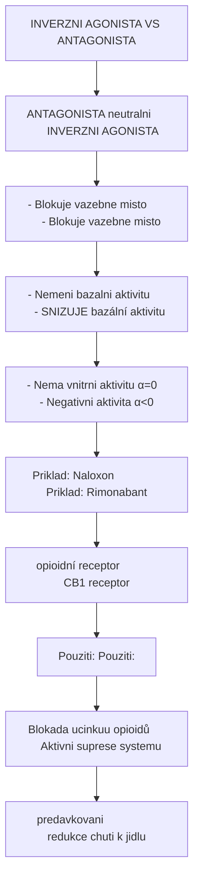

<details>
<summary>ASCII verze diagramu</summary>

```
INVERZNI AGONISTA VS ANTAGONISTA

┌──────────────────────────────────────────────────────────────┐
│                                                              │
│   ANTAGONISTA (neutralni)         INVERZNI AGONISTA         │
│                                                              │
│   - Blokuje vazebne misto         - Blokuje vazebne misto   │
│   - Nemeni bazalni aktivitu       - SNIZUJE bazální aktivitu│
│   - Nema vnitrni aktivitu (α=0)   - Negativni aktivita (α<0)│
│                                                              │
│   Priklad: Naloxon               Priklad: Rimonabant        │
│   (opioidní receptor)            (CB1 receptor)             │
│                                                              │
│   Pouziti:                       Pouziti:                   │
│   Blokada ucinkuu opioidů        Aktivni suprese systemu    │
│   (predavkovani)                 (redukce chuti k jidlu)    │
│                                                              │
└──────────────────────────────────────────────────────────────┘
```

</details>

---

## Afinita a eficacia

### Dva klicove parametry

Ucinek agonisty je urcen dvema nezavislymi parametry:

```mermaid
flowchart TD
    node_AFINITAKiKdEFICACIAE["AFINITA Ki, Kd              EFICACIA Emax, α"]
    node_JakPEVNEseveJakSILNE["'Jak PEVNE se váže'           'Jak SILNE aktivuje'"]
    node_RECEPTORRECEPTOR["RECEPTOR                    RECEPTOR"]
    node_9f1f0305["▲                          ●●"]
    node_aktivace["aktivace"]
    node_azba["azba"]
    node_MereniradioligandMer["Mereni: radioligand           Mereni: funkcni eseje"]
    node_bindingCa2cAMP["binding                       Ca2+, cAMP"]
    node_JednotkanMnanomolrnJ["Jednotka: nM nanomolární    Jednotka: % maxima"]
    node_NizsiKivyssiafinitaV["Nizsi Ki = vyssi afinita      Vyssi Emax = vyssi eficacia"]
    node_VZTAHAFINITYAEFICACI["VZTAH AFINITY A EFICACIE:"]
    node_VysokaeficaciaNizkae["Vysoka eficacia  Nizka eficacia"]
    node_VysokaafinitaKiPoten["Vysoka afinita Ki     Potentni plny    Potentní"]
    node_agonistaparcialniago["agonista         parcialni agonista"]
    node_LSDna5HT2Aaripiprazo["LSD na 5-HT2A  aripiprazol na D2"]
    node_NizkaafinitaKiSlabyp["Nizka afinita Ki      Slaby plny       Slaby parcialni"]
    node_agonistaagonista["agonista         agonista"]
    node_meskalinvzcn["meskalin       vzácné"]

    node_AFINITAKiKdEFICACIAE --> node_JakPEVNEseveJakSILNE
    node_JakPEVNEseveJakSILNE --> node_RECEPTORRECEPTOR
    node_RECEPTORRECEPTOR --> node_9f1f0305
    node_9f1f0305 --> node_aktivace
    node_aktivace --> node_azba
    node_azba --> node_MereniradioligandMer
    node_MereniradioligandMer --> node_bindingCa2cAMP
    node_bindingCa2cAMP --> node_JednotkanMnanomolrnJ
    node_JednotkanMnanomolrnJ --> node_NizsiKivyssiafinitaV
    node_NizsiKivyssiafinitaV --> node_VZTAHAFINITYAEFICACI
    node_VZTAHAFINITYAEFICACI --> node_VysokaeficaciaNizkae
    node_VysokaeficaciaNizkae --> node_VysokaafinitaKiPoten
    node_VysokaafinitaKiPoten --> node_agonistaparcialniago
    node_agonistaparcialniago --> node_LSDna5HT2Aaripiprazo
    node_LSDna5HT2Aaripiprazo --> node_NizkaafinitaKiSlabyp
    node_NizkaafinitaKiSlabyp --> node_agonistaagonista
    node_agonistaagonista --> node_meskalinvzcn

    click node_RECEPTORRECEPTOR "/glossary/receptor/" "RECEPTOR                    RECEPTOR"
    click node_LSDna5HT2Aaripiprazo "/receptors/5-ht2a/" "LSD na 5-HT2A  aripiprazol na D2"
    click node_meskalinvzcn "/alkaloids/mescaline/" "meskalin       vzácné"
```

<details>
<summary>ASCII verze diagramu</summary>

```
┌─────────────────────────────────────────────────────────────┐
│                                                             │
│   AFINITA (Ki, Kd)              EFICACIA (Emax, α)         │
│                                                             │
│   "Jak PEVNE se váže"           "Jak SILNE aktivuje"       │
│                                                             │
│   ┌─────────────────┐           ┌─────────────────┐        │
│   │    RECEPTOR     │           │    RECEPTOR     │        │
│   │       ▲         │           │      ●──●       │        │
│   │       │         │           │    aktivace     │        │
│   │   ●───┘         │           │                 │        │
│   │   vazba         │           │                 │        │
│   └─────────────────┘           └─────────────────┘        │
│                                                             │
│   Mereni: radioligand           Mereni: funkcni eseje      │
│           binding                       (Ca2+, cAMP)       │
│                                                             │
│   Jednotka: nM (nanomolární)    Jednotka: % maxima         │
│                                                             │
│   Nizsi Ki = vyssi afinita      Vyssi Emax = vyssi eficacia│
│                                                             │
└─────────────────────────────────────────────────────────────┘


VZTAH AFINITY A EFICACIE:

                        │ Vysoka eficacia │ Nizka eficacia
────────────────────────┼─────────────────┼────────────────
Vysoka afinita (Ki↓)    │ Potentni plny   │ Potentní
                        │ agonista        │ parcialni agonista
                        │ (LSD na 5-HT2A) │ (aripiprazol na D2)
────────────────────────┼─────────────────┼────────────────
Nizka afinita (Ki↑)     │ Slaby plny      │ Slaby parcialni
                        │ agonista        │ agonista
                        │ (meskalin)      │ (vzácné)
```

</details>

### Afinita (Ki, Kd)

**Afinita** vyjadruje silu vazby ligandu k receptoru. Meri se jako:

| Parametr | Definice | Interpretace |
|----------|----------|--------------|
| **Ki** | Inhibicni konstanta | Koncentrace potrebna k obsazeni 50% receptoru |
| **Kd** | Disociacni konstanta | Rovnovazna konstanta vazba/uvolneni |

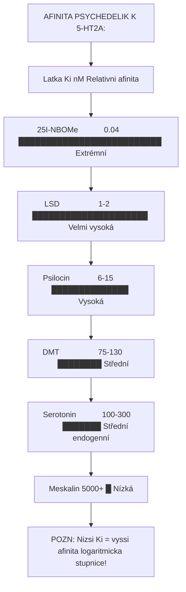

<details>
<summary>ASCII verze diagramu</summary>

```
AFINITA PSYCHEDELIK K 5-HT2A:

Latka                Ki (nM)         Relativni afinita
─────────────────────────────────────────────────────────
25I-NBOMe            0.04            ██████████████████████████ Extrémní
LSD                  1-2             █████████████████████ Velmi vysoká
Psilocin             6-15            ██████████████ Vysoká
DMT                  75-130          ████████ Střední
Serotonin            100-300         ███████ Střední (endogenní)
Meskalin             5000+           █ Nízká

POZN: Nizsi Ki = vyssi afinita (logaritmicka stupnice!)
```

</details>

### Eficacia (Emax)

**Eficacia** urcuje maximalni biologickou odpoved, kterou ligand muze vyvolat. Je nezavisla na afinite.

| Parametr | Definice | Rozsah |
|----------|----------|--------|
| **Emax** | Maximalni efekt | 0-100% (nebo vice u superagonistu) |
| **α (alfa)** | Vnitrni aktivita | -1 az +1 (relativní k plnemu agoniste) |

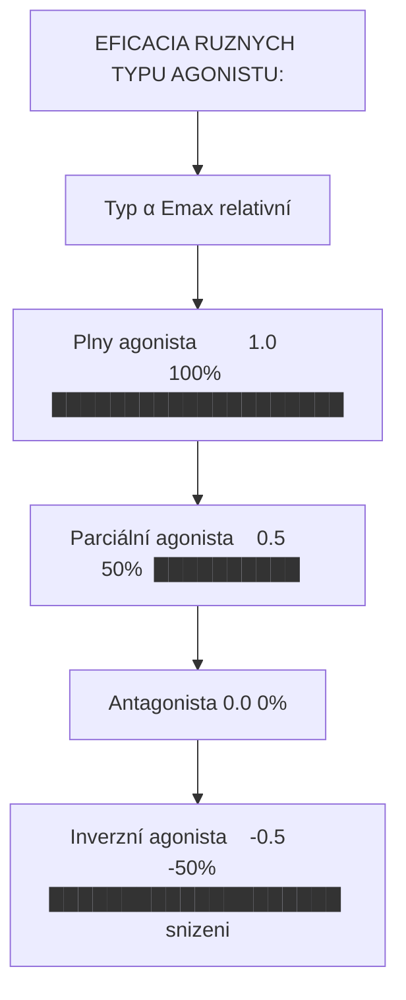

<details>
<summary>ASCII verze diagramu</summary>

```
EFICACIA RUZNYCH TYPU AGONISTU:

Typ                   α          Emax (relativní)
─────────────────────────────────────────────────────
Plny agonista         1.0        100% ████████████████████
Parciální agonista    0.5        50%  ██████████
Antagonista           0.0        0%   │
Inverzní agonista    -0.5       -50%  ████████████████████ (snizeni)
```

</details>

---

## Davkova zavislost (Dose-Response)

### Zakladni krivka dose-response

```mermaid
flowchart TD
    node_DOSERESPONSEKRIVKA["DOSE-RESPONSE KRIVKA"]
    node_Odpoved["Odpoved"]
    node_Emax["% Emax"]
    node_100Emaxplato["100                            ╭ Emax plato"]
    node_90["90                        ╱"]
    node_75["75                    ╱"]
    node_50EC50["50 ● EC50"]
    node_25["25            ╱"]
    node_10["10        ╱"]
    node_0LogAgonista["0  Log Agonista"]
    node_EC50potence["EC50 potence"]
    node_KLICOVEPARAMETRY["KLICOVE PARAMETRY:"]
    node_ParametrDefinice["Parametr       Definice"]
    node_EC50Koncentracepro50["EC50           Koncentrace pro 50% maximálního efektu"]
    node_EmaxMaximlndosaiteln["Emax           Maximální dosažitelný efekt"]
    node_HillcoeffStrmostkriv["Hill coeff.    Strmost krivky kooperativita"]
    node_PotenceRelativniEC50["Potence        Relativni EC50 nizsi = potentnejsi"]
    node_EficaciaEmaxrelativn["Eficacia       Emax relativně k referenčnímu agonistovi"]

    node_DOSERESPONSEKRIVKA --> node_Odpoved
    node_Odpoved --> node_Emax
    node_Emax --> node_100Emaxplato
    node_100Emaxplato --> node_90
    node_90 --> node_75
    node_75 --> node_50EC50
    node_50EC50 --> node_25
    node_25 --> node_10
    node_10 --> node_0LogAgonista
    node_0LogAgonista --> node_EC50potence
    node_EC50potence --> node_KLICOVEPARAMETRY
    node_KLICOVEPARAMETRY --> node_ParametrDefinice
    node_ParametrDefinice --> node_EC50Koncentracepro50
    node_EC50Koncentracepro50 --> node_EmaxMaximlndosaiteln
    node_EmaxMaximlndosaiteln --> node_HillcoeffStrmostkriv
    node_HillcoeffStrmostkriv --> node_PotenceRelativniEC50
    node_PotenceRelativniEC50 --> node_EficaciaEmaxrelativn
```

<details>
<summary>ASCII verze diagramu</summary>

```
                DOSE-RESPONSE KRIVKA

Odpoved
(% Emax)
100 ┤                           ╭───────────────── Emax (plato)
    │                         ╱
 90 ┤                       ╱
    │                     ╱
 75 ┤                   ╱
    │                 ╱
 50 ┤───────────────●─────────────────────────── EC50
    │             ╱ │
 25 ┤           ╱   │
    │         ╱     │
 10 ┤       ╱       │
    │     ╱         │
  0 ┼────┴──────────┼─────────────────────────→ Log [Agonista]
                    │
               EC50 (potence)


KLICOVE PARAMETRY:

┌───────────────┬────────────────────────────────────────────┐
│ Parametr      │ Definice                                   │
├───────────────┼────────────────────────────────────────────┤
│ EC50          │ Koncentrace pro 50% maximálního efektu     │
│ Emax          │ Maximální dosažitelný efekt                │
│ Hill coeff.   │ Strmost krivky (kooperativita)             │
│ Potence       │ Relativni EC50 (nizsi = potentnejsi)       │
│ Eficacia      │ Emax relativně k referenčnímu agonistovi   │
└───────────────┴────────────────────────────────────────────┘
```

</details>

### Porovnani ruznych agonistu

```mermaid
flowchart TD
    node_POROVNANIDOSERESPONS["POROVNANI DOSE-RESPONSE KRIVEK:"]
    node_Odpoved["Odpoved"]
    node_100AVysokapotence["100                     A  Vysoka potence,"]
    node_vysokaeficacia["╱                    vysoka eficacia"]
    node_80BNizkapotence["80                 ╱      B  Nizka potence,"]
    node_vysokaeficacia["╱      ╱                  vysoka eficacia"]
    node_60["60             ╱      ╱"]
    node_CVysokapotence["╱      ╱   C  Vysoka potence,"]
    node_40nizkaeficacia["40 ●●  nizka eficacia"]
    node_parcialni["╱      ╱                          parcialni"]
    node_20["20     ╱      ╱"]
    node_d1b45643["╱      ╱"]
    node_0LogAgonista["0  Log Agonista"]
    node_EC50Bnizkapotence["EC50 B - nizka potence"]
    node_EC50Avysokapotence["EC50 A - vysoka potence"]
    node_PRIKLADYNA5HT2ARECEP["PRIKLADY NA 5-HT2A RECEPTORU:"]
    node_LatkaPotenceEC50Efic["Latka            Potence EC50  Eficacia Emax  Charakter"]
    node_25INBOMeExtrmnVelmiv["25I-NBOMe        Extrémní        Velmi vysoka     A nebezpečné!"]
    node_LSDVelmivysokVysokA["LSD              Velmi vysoká    Vysoká           A"]
    node_PsilocinVysokStednCp["Psilocin         Vysoká          Střední          C parciální"]
    node_MeskalinNzkStednvyso["Meskalin         Nízká           Střední-vysoka   B"]

    node_POROVNANIDOSERESPONS --> node_Odpoved
    node_Odpoved --> node_100AVysokapotence
    node_100AVysokapotence --> node_vysokaeficacia
    node_vysokaeficacia --> node_80BNizkapotence
    node_80BNizkapotence --> node_vysokaeficacia
    node_vysokaeficacia --> node_60
    node_60 --> node_CVysokapotence
    node_CVysokapotence --> node_40nizkaeficacia
    node_40nizkaeficacia --> node_parcialni
    node_parcialni --> node_20
    node_20 --> node_d1b45643
    node_d1b45643 --> node_0LogAgonista
    node_0LogAgonista --> node_EC50Bnizkapotence
    node_EC50Bnizkapotence --> node_EC50Avysokapotence
    node_EC50Avysokapotence --> node_PRIKLADYNA5HT2ARECEP
    node_PRIKLADYNA5HT2ARECEP --> node_LatkaPotenceEC50Efic
    node_LatkaPotenceEC50Efic --> node_25INBOMeExtrmnVelmiv
    node_25INBOMeExtrmnVelmiv --> node_LSDVelmivysokVysokA
    node_LSDVelmivysokVysokA --> node_PsilocinVysokStednCp
    node_PsilocinVysokStednCp --> node_MeskalinNzkStednvyso

    click node_PRIKLADYNA5HT2ARECEP "/glossary/receptor/" "PRIKLADY NA 5-HT2A RECEPTORU:"
    click node_LSDVelmivysokVysokA "/alkaloids/lsd/" "LSD              Velmi vysoká    Vysoká           A"
    click node_PsilocinVysokStednCp "/alkaloids/psilocin/" "Psilocin         Vysoká          Střední          C parciální"
    click node_MeskalinNzkStednvyso "/alkaloids/mescaline/" "Meskalin         Nízká           Střední-vysoka   B"
```

<details>
<summary>ASCII verze diagramu</summary>

```
POROVNANI DOSE-RESPONSE KRIVEK:

Odpoved
(%)
100 ┤                    A ──────────────── Vysoka potence,
    │                  ╱                    vysoka eficacia
 80 ┤                ╱      B ────────────── Nizka potence,
    │              ╱      ╱                  vysoka eficacia
 60 ┤            ╱      ╱
    │          ╱      ╱   C ──────────────── Vysoka potence,
 40 ┤────────●──────●───────────────────────  nizka eficacia
    │      ╱      ╱                          (parcialni)
 20 ┤    ╱      ╱
    │  ╱      ╱
  0 ┼─┴──────┴────────────────────────────→ Log [Agonista]
      │      │
      │      └── EC50 (B) - nizka potence
      └── EC50 (A) - vysoka potence


PRIKLADY NA 5-HT2A RECEPTORU:

Latka           │ Potence (EC50) │ Eficacia (Emax) │ Charakter
────────────────┼────────────────┼─────────────────┼───────────────
25I-NBOMe       │ Extrémní       │ Velmi vysoka    │ A (nebezpečné!)
LSD             │ Velmi vysoká   │ Vysoká          │ A
Psilocin        │ Vysoká         │ Střední         │ C (parciální)
Meskalin        │ Nízká          │ Střední-vysoka  │ B
```

</details>

### Klinicke implikace dose-response

| Parametr | Klinicky vyznam |
|----------|-----------------|
| **EC50 (potence)** | Urcuje davkovani - potentnejsi = nizsi davky |
| **Emax (eficacia)** | Urcuje maximalni mozny ucinek |
| **Terapeutické okno** | Rozsah davek mezi EC50 a toxicitou |
| **Strmnost krivky** | Predikuje variabilitu odpovedi |

---

## Funkční selektivita (Biased Agonism)

### Koncept

**Biased agonism** (funkční selektivita) je fenomen, kdy ruzni agonisté tehoz receptoru aktivuji odlisne signalni drahy. Toto ma zasadni vyznam pro psychedelika.

```mermaid
flowchart TD
    node_BIASEDAGONISMNA5HT2A["BIASED AGONISM NA 5-HT2A RECEPTORU"]
    node_5HT2ARECEPTOR["5-HT2A RECEPTOR"]
    node_19c6085e["▼                            ▼"]
    node_Gq11arrestin["Gq/11                    β-arrestin"]
    node_PLCIP3Internalizace["PLCβ  IP3                   Internalizace"]
    node_DAGDesenzitizace["+ DAG                      Desenzitizace"]
    node_Ca2PKCERKsignaling["Ca2+ + PKC                   ERK signaling"]
    node_HALUCINOGENNIRecepto["HALUCINOGENNI                  Receptor"]
    node_UCINEKdownregulace["UCINEK                      downregulace"]
    node_LIGANDSPECIFICKAAKTI["LIGAND-SPECIFICKA AKTIVACE:"]
    node_LigandGq11halucinoge["Ligand           Gq/11 halucinogeze  β-arrestin desenz."]
    node_Serotonin["Serotonin        +++                   +++"]
    node_LSD["LSD              +++                   +"]
    node_Psilocin["Psilocin         ++                    +"]
    node_Lisurid["Lisurid          +                     ++"]
    node_nehalucinogen["nehalucinogen"]
    node_ZVERLSDapsilocinjsou["ZÁVER: LSD a psilocin jsou 'Gq-biased' agonisté  halucinogenní"]
    node_Lisuridjearrestinbia["Lisurid je 'β-arrestin-biased'  nehalucinogenní"]

    node_BIASEDAGONISMNA5HT2A --> node_5HT2ARECEPTOR
    node_5HT2ARECEPTOR --> node_19c6085e
    node_19c6085e --> node_Gq11arrestin
    node_Gq11arrestin --> node_PLCIP3Internalizace
    node_PLCIP3Internalizace --> node_DAGDesenzitizace
    node_DAGDesenzitizace --> node_Ca2PKCERKsignaling
    node_Ca2PKCERKsignaling --> node_HALUCINOGENNIRecepto
    node_HALUCINOGENNIRecepto --> node_UCINEKdownregulace
    node_UCINEKdownregulace --> node_LIGANDSPECIFICKAAKTI
    node_LIGANDSPECIFICKAAKTI --> node_LigandGq11halucinoge
    node_LigandGq11halucinoge --> node_Serotonin
    node_Serotonin --> node_LSD
    node_LSD --> node_Psilocin
    node_Psilocin --> node_Lisurid
    node_Lisurid --> node_nehalucinogen
    node_nehalucinogen --> node_ZVERLSDapsilocinjsou
    node_ZVERLSDapsilocinjsou --> node_Lisuridjearrestinbia

    click node_BIASEDAGONISMNA5HT2A "/glossary/receptor/" "BIASED AGONISM NA 5-HT2A RECEPTORU"
    click node_5HT2ARECEPTOR "/glossary/receptor/" "5-HT2A RECEPTOR"
    click node_HALUCINOGENNIRecepto "/glossary/receptor/" "HALUCINOGENNI                  Receptor"
    click node_LSD "/alkaloids/lsd/" "LSD              +++                   +"
    click node_Psilocin "/alkaloids/psilocin/" "Psilocin         ++                    +"
    click node_ZVERLSDapsilocinjsou "/alkaloids/psilocin/" "ZÁVER: LSD a psilocin jsou "Gq-biased" agonisté  halucinogenní"
```

<details>
<summary>ASCII verze diagramu</summary>

```
        BIASED AGONISM NA 5-HT2A RECEPTORU

┌─────────────────────────────────────────────────────────────┐
│                                                             │
│                      5-HT2A RECEPTOR                        │
│                           │                                 │
│            ┌──────────────┼──────────────┐                 │
│            ▼              │              ▼                 │
│       ┌─────────┐         │         ┌─────────┐           │
│       │  Gq/11  │         │         │β-arrestin│           │
│       └────┬────┘         │         └────┬────┘           │
│            │              │              │                 │
│            ▼              │              ▼                 │
│       PLCβ → IP3          │         Internalizace         │
│         + DAG             │         Desenzitizace         │
│            │              │              │                 │
│            ▼              │              ▼                 │
│       Ca2+ + PKC          │         ERK signaling         │
│            │              │              │                 │
│            ▼              │              ▼                 │
│     HALUCINOGENNI         │         Receptor              │
│        UCINEK             │         downregulace          │
│                           │                                │
└─────────────────────────────────────────────────────────────┘


LIGAND-SPECIFICKA AKTIVACE:

Ligand          │ Gq/11 (halucinogeze) │ β-arrestin (desenz.)
────────────────┼──────────────────────┼─────────────────────
Serotonin       │ +++                  │ +++
LSD             │ +++                  │ +
Psilocin        │ ++                   │ +
Lisurid         │ +                    │ ++
(nehalucinogen) │                      │

ZÁVER: LSD a psilocin jsou "Gq-biased" agonisté → halucinogenní
       Lisurid je "β-arrestin-biased" → nehalucinogenní
```

</details>

### Terapeuticky potencial

| Bias | Účinek | Terapeutický cíl |
|------|--------|------------------|
| **Gq-biased** | Neuroplasticita, změněné vědomí | Psychedelická terapie |
| **β-arr-biased** | Neuroplasticita BEZ halucinací | Bezpečnější antidepresiva |

---

## Priklady agonistu u psychoaktivnich latek

### Serotonergni system (5-HT)

| Latka | Receptor | Typ agonismu | Ucinek |
|-------|----------|--------------|--------|
| [**LSD**](@/alkaloids/lsd.md) | [5-HT2A](@/receptors/5-ht2a.md), 5-HT1A, D2 | Parcialni-plny | Psychedelicky |
| [**Psilocin**](@/alkaloids/psilocin.md) | [5-HT2A](@/receptors/5-ht2a.md), 5-HT1A | Parcialni | Psychedelicky |
| [**DMT**](@/alkaloids/dmt.md) | [5-HT2A](@/receptors/5-ht2a.md), sigma-1 | Parcialni | Psychedelicky |
| [**Meskalin**](@/alkaloids/mescaline.md) | [5-HT2A](@/receptors/5-ht2a.md) | Parciální | Psychedelicky |
| **MDMA** | 5-HT uvolnení | (nepřímy) | Entaktogenní |

### GABAergni system

| Latka | Receptor | Typ agonismu | Ucinek |
|-------|----------|--------------|--------|
| **GABA** | GABA-A, GABA-B | Plny (endogenni) | Inhibice |
| **Baclofen** | GABA-B | Plny | Myorelaxace |
| **GHB** | GABA-B, GHB-R | Plny | Sedace, euforie |

### Glutamatergni system

| Latka | Receptor | Typ agonismu | Ucinek |
|-------|----------|--------------|--------|
| **Glutamat** | [NMDA](@/receptors/nmda.md), AMPA | Plny (endogenni) | Excitace |
| [**Kys. ibotenova**](@/neurotoxins/ibotenic-acid.md) | NMDA, mGluR | Agonista | Excitotoxicita |

### Opioidni system

| Latka | Receptor | Typ agonismu | Ucinek |
|-------|----------|--------------|--------|
| **Morfin** | mu | Plny | Analgezie, euforie |
| **Buprenorfin** | mu | Parcialni | Substituce, analgezie |
| **Fentanyl** | mu | Plny | Silna analgezie |

### Kanabinoidni system

| Latka | Receptor | Typ agonismu | Ucinek |
|-------|----------|--------------|--------|
| **THC** | CB1 | Parcialni | Psychoaktivni |
| **Anandamid** | CB1 | Parcialni (endogenni) | Neuromodulace |
| **Syntet. kanabinoidy** | CB1 | Plny | Silne psychoaktivni |

---

## Tabulka porovnani typu agonistu

```mermaid
flowchart TD
    node_SOUHRNNATABULKATYPYA["SOUHRNNA TABULKA - TYPY AGONISTU"]
    node_VlastnostPlnParcilAn["Vlastnost        Plný     Parciál. Antagonista Inverzní"]
    node_Vnitrniaktiv10100["Vnitrni aktiv.   α = 1    0&lt;α&lt;1    α = 0       α &lt; 0"]
    node_Emax10010000bazal["Emax             100%     &lt;100%    0%          &lt;0% bazal"]
    node_VazbanarecANOANOANOA["Vazba na rec.    ANO      ANO      ANO         ANO"]
    node_AktivacerecMAXSUBMAX["Aktivace rec.    MAX      SUBMAX   NE          NEGATIVNI"]
    node_CeilingeffectNEANOAN["Ceiling effect   NE       ANO      -           ANO"]
    node_PredavkovaniRIZIKONI["Predavkovani     RIZIKO   NIŽŠÍ    -           NÍZKÉ"]
    node_ToleranceRYCHLAPOMAL["Tolerance        RYCHLA   POMALEJ  -           VARIABILNI"]
    node_PRIKLADYPROKAZDYTYP["PRIKLADY PRO KAZDY TYP:"]
    node_PlnMuscimolGABAAMorf["Plný:       Muscimol GABA-A, Morfin mu, Serotonin 5-HT2A"]
    node_ParcilnPsilocin5HT2A["Parciální:  Psilocin 5-HT2A, Buprenorfin mu, Aripiprazol D2"]
    node_AntagonistaKetanseri["Antagonista: Ketanserin 5-HT2A, Naloxon mu, Flumazenil GABA-A BZ"]
    node_InverznPimavanserin5["Inverzní:   Pimavanserin 5-HT2A, DMCM GABA-A, Rimonabant CB1"]

    node_SOUHRNNATABULKATYPYA --> node_VlastnostPlnParcilAn
    node_VlastnostPlnParcilAn --> node_Vnitrniaktiv10100
    node_Vnitrniaktiv10100 --> node_Emax10010000bazal
    node_Emax10010000bazal --> node_VazbanarecANOANOANOA
    node_VazbanarecANOANOANOA --> node_AktivacerecMAXSUBMAX
    node_AktivacerecMAXSUBMAX --> node_CeilingeffectNEANOAN
    node_CeilingeffectNEANOAN --> node_PredavkovaniRIZIKONI
    node_PredavkovaniRIZIKONI --> node_ToleranceRYCHLAPOMAL
    node_ToleranceRYCHLAPOMAL --> node_PRIKLADYPROKAZDYTYP
    node_PRIKLADYPROKAZDYTYP --> node_PlnMuscimolGABAAMorf
    node_PlnMuscimolGABAAMorf --> node_ParcilnPsilocin5HT2A
    node_ParcilnPsilocin5HT2A --> node_AntagonistaKetanseri
    node_AntagonistaKetanseri --> node_InverznPimavanserin5

    click node_PlnMuscimolGABAAMorf "/alkaloids/muscimol/" "Plný:       Muscimol GABA-A, Morfin mu, Serotonin 5-HT2A"
    click node_ParcilnPsilocin5HT2A "/alkaloids/psilocin/" "Parciální:  Psilocin 5-HT2A, Buprenorfin mu, Aripiprazol D2"
    click node_AntagonistaKetanseri "/receptors/gaba-a/" "Antagonista: Ketanserin 5-HT2A, Naloxon mu, Flumazenil GABA-A BZ"
    click node_InverznPimavanserin5 "/receptors/gaba-a/" "Inverzní:   Pimavanserin 5-HT2A, DMCM GABA-A, Rimonabant CB1"
```

<details>
<summary>ASCII verze diagramu</summary>

```
SOUHRNNA TABULKA - TYPY AGONISTU

┌─────────────────┬─────────┬─────────┬────────────┬───────────────┐
│ Vlastnost       │ Plný    │ Parciál.│ Antagonista│ Inverzní      │
├─────────────────┼─────────┼─────────┼────────────┼───────────────┤
│ Vnitrni aktiv.  │ α = 1   │ 0<α<1   │ α = 0      │ α < 0         │
│ Emax            │ 100%    │ <100%   │ 0%         │ <0% (bazal)   │
│ Vazba na rec.   │ ANO     │ ANO     │ ANO        │ ANO           │
│ Aktivace rec.   │ MAX     │ SUBMAX  │ NE         │ NEGATIVNI     │
│ Ceiling effect  │ NE      │ ANO     │ -          │ ANO           │
│ Predavkovani    │ RIZIKO  │ NIŽŠÍ   │ -          │ NÍZKÉ         │
│ Tolerance       │ RYCHLA  │ POMALEJ │ -          │ VARIABILNI    │
└─────────────────┴─────────┴─────────┴────────────┴───────────────┘

PRIKLADY PRO KAZDY TYP:

Plný:       Muscimol (GABA-A), Morfin (mu), Serotonin (5-HT2A)
Parciální:  Psilocin (5-HT2A), Buprenorfin (mu), Aripiprazol (D2)
Antagonista: Ketanserin (5-HT2A), Naloxon (mu), Flumazenil (GABA-A BZ)
Inverzní:   Pimavanserin (5-HT2A), DMCM (GABA-A), Rimonabant (CB1)
```

</details>

---

## Klinicka relevance

### Vyber agonisty podle indikace

| Indikace | Preferovany typ | Duvod |
|----------|-----------------|-------|
| **Akutni bolest** | Plny agonista (morfin) | Maximalni analgezie |
| **Chronicka bolest/zavislost** | Parcialni (buprenorfin) | Bezpecnejsi, mensi tolerance |
| **Psychedelicka terapie** | Parcialni (psilocybin) | Kontrolovatelnejsi ucinek |
| **Antipsychotika** | Parcialni/inverzni (aripiprazol) | Stabilizace bez extrapyramid. |
| **Predavkovani BZ** | Antagonista/inverzni (flumazenil) | Reverze sedace |

### Bezpecnostni profily

| Typ agonisty | Riziko predávkování | Příklad nebezpečí |
|--------------|---------------------|-------------------|
| **Plný** | VYSOKÉ | Morfin - respiracni deprese |
| **Parcialni** | NIZSI (ceiling) | Buprenorfin - limity efekt |
| **Inverzni** | SPECIFICKE | DMCM - konvulze |

---

## Reference

1. Kenakin, T. (2012). *Biased signalling and allosteric machines: new vistas and challenges for drug discovery*. British Journal of Pharmacology.
2. Nichols, D.E. (2016). *Psychedelics*. Pharmacological Reviews 68(2): 264-355.
3. Wacker, D. et al. (2017). *Crystal structure of an LSD-bound human serotonin receptor*. Cell.
4. Roth, B.L. (2019). *Molecular pharmacology of metabotropic receptors targeted by neuropsychiatric drugs*. Nature Structural & Molecular Biology.
5. Olsen, R.W. & Sieghart, W. (2008). *GABAA receptors: Subtypes provide diversity of function and pharmacology*. Neuropharmacology.
6. Kobilka, B.K. (2013). *The structural basis of G-protein-coupled receptor signaling*. Nobel Lecture.
7. Kroeze, W.K. et al. (2015). *PRESTO-Tango as an open-source resource for interrogation of the druggable human GPCRome*. Nature Structural & Molecular Biology.

---

## Viz take

### Zakladni pojmy
- [Receptor](@/glossary/receptor.md) - Molekularni brána bunecne komunikace
- [GABA](@/glossary/gaba.md) - Hlavni inhibicni neurotransmiter

### Specificke receptory
- [5-HT2A receptor](@/receptors/5-ht2a.md) - Primarni cil klasickych psychedelik
- [GABA-A receptor](@/receptors/gaba-a.md) - Cil GABAergních latek (muscimol)
- [NMDA receptor](@/receptors/nmda.md) - Glutamatergni receptor

### Psychoaktivni latky (agoniste)
- [LSD](@/alkaloids/lsd.md) - Potentni 5-HT2A parcialni agonista
- [Psilocybin](@/alkaloids/psilocybin.md) / [Psilocin](@/alkaloids/psilocin.md) - Tryptaminova psychedelika
- [DMT](@/alkaloids/dmt.md) - Endogenni psychedelikum
- [Meskalin](@/alkaloids/mescaline.md) - Fenethylaminovy 5-HT2A agonista

### Zdroje
- [Psilocybe houby](@/shrooms/psilocybes/_index.md) - Zdroj psilocybinu
- [Amanita muscaria](@/shrooms/amanita-muscaria.md) - Zdroj muscimolu

---

<- Zpet na [Glosar](@/glossary/_index.md)
