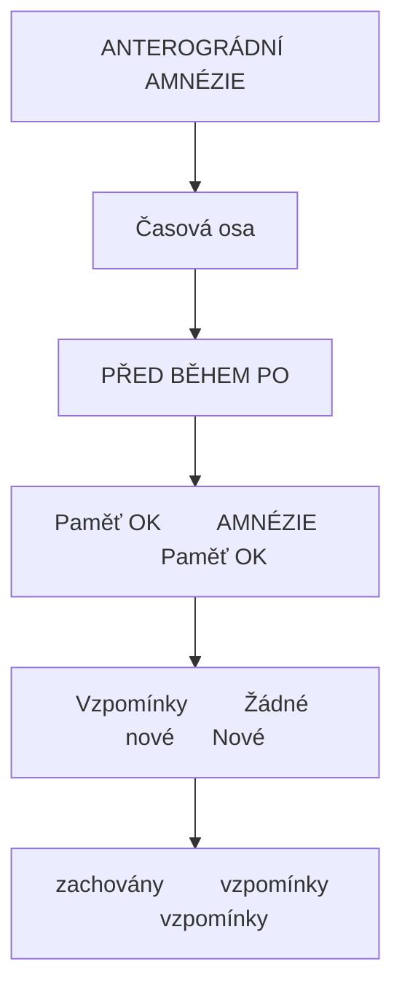
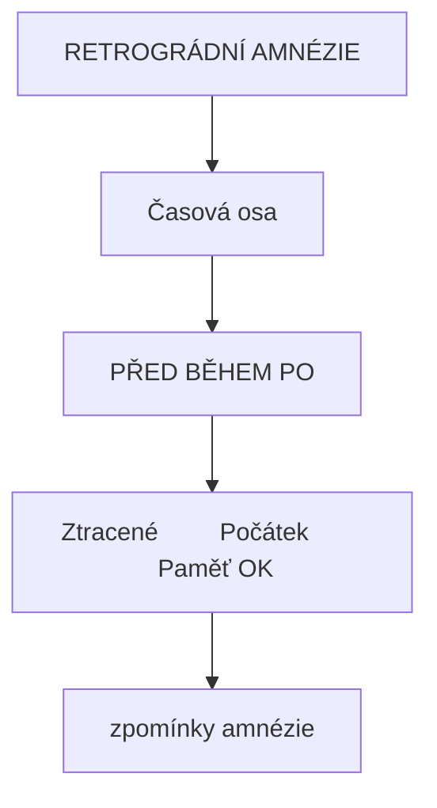
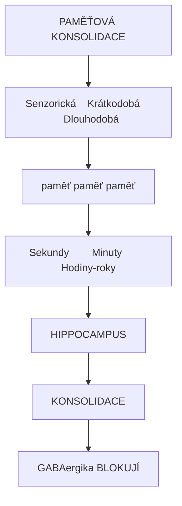
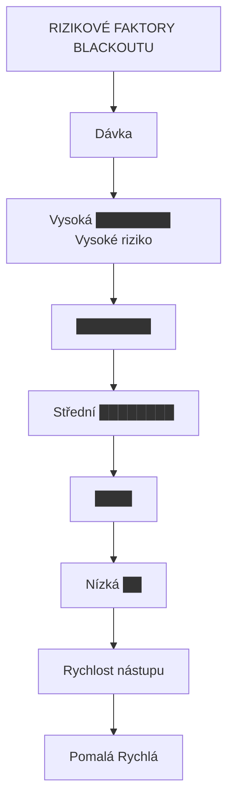

+++
title = "Amnézie"
description = "Amnézie - porucha paměti, anterográdní a retrográdní amnézie, mechanismy, výskyt u psychoaktivních látek včetně GABAergik"
weight = 4
insert_anchor_links = "right"

[taxonomies]
categories = ["neurologie", "terminologie", "symptomy"]
tags = ["amnézie", "paměť", "hippocampus", "GABA", "muscimol", "benzodiazepiny", "blackout"]
+++

# Amnézie


---

## Typy amnézie

### Anterográdní amnézie

**Definice**: Neschopnost tvořit **nové vzpomínky** po nástupu amnézie



<details>
<summary>ASCII verze diagramu</summary>

```
ANTEROGRÁDNÍ AMNÉZIE

Časová osa
──────────────────────────────────────────>

     PŘED              BĚHEM           PO
       |                 |              |
  Paměť OK         AMNÉZIE         Paměť OK
       |                 |              |
  Vzpomínky         Žádné nové      Nové
  zachovány         vzpomínky       vzpomínky
```

</details>

| Charakteristika | Popis |
|-----------------|-------|
| **Mechanismus** | Narušení konsolidace paměti |
| **Lokalizace** | [Hippocampus](@/brain/hippocampus.md), mediální temporální lalok |
| **Typické látky** | Benzodiazepiny, muscimol, alkohol |

### Retrográdní amnézie

**Definice**: Ztráta vzpomínek na události **před** nástupem amnézie



<details>
<summary>ASCII verze diagramu</summary>

```
RETROGRÁDNÍ AMNÉZIE

Časová osa
──────────────────────────────────────────>

     PŘED              BĚHEM           PO
       |                 |              |
  Ztracené         Počátek         Paměť OK
  vzpomínky        amnézie
```

</details>

| Charakteristika | Popis |
|-----------------|-------|
| **Mechanismus** | Narušení retrieval nebo konsolidace |
| **Rozsah** | Variabilní (minuty až roky) |
| **Typické příčiny** | Trauma, ECT, vzácně látky |

### Disociativní amnézie

| Charakteristika | Popis |
|-----------------|-------|
| **Mechanismus** | Psychogenní, ne organická |
| **Obsah** | Často traumatické vzpomínky |
| **Látky** | Některá psychedelika, MDMA (represe) |

---

## Mechanismy

### Hippocampální amnézie



<details>
<summary>ASCII verze diagramu</summary>

```
PAMĚŤOVÁ KONSOLIDACE

Senzorická    Krátkodobá      Dlouhodobá
paměť     →     paměť     →     paměť
   |              |               |
Sekundy        Minuty         Hodiny-roky
   |              |               |
            HIPPOCAMPUS
                 ↓
        KONSOLIDACE
                 ↓
    GABAergika BLOKUJÍ
```

</details>

### GABA-A receptory a paměť

| Subtyp | Lokalizace | Funkce v paměti |
|--------|------------|-----------------|
| **α1** | Kortex, hippocampus | Sedace, amnézie |
| **α5** | Hippocampus CA1/CA3 | **Klíčový pro amnézii** |
| **α2/α3** | Limbický systém | Anxiolýza |

```
α5-OBSAHUJÍCÍ GABA-A RECEPTORY

Hippocampus
    |
α5-GABA-A receptory
    |
Inhibice LTP (long-term potentiation)
    |
Narušená konsolidace
    |
ANTEROGRÁDNÍ AMNÉZIE
```

---

## Amnézie u psychoaktivních látek

### GABAergika

| Látka | Mechanismus | Typ amnézie | Intenzita |
|-------|-------------|-------------|-----------|
| **Benzodiazepiny** | GABA-A PAM | Anterográdní | Silná |
| **Alkohol** | GABA-A PAM + NMDA ant. | Anterográdní | Silná |
| **GHB** | GABA-B + GHB-R | Anterográdní | Silná |
| **Barbituráty** | GABA-A | Anterográdní | Velmi silná |

### Disociativa

| Látka | Mechanismus | Poznámka |
|-------|-------------|----------|
| **[Ketamin](@/alkaloids/ketamin.md)** | NMDA antagonista | K-hole = amnézie |
| **PCP** | NMDA antagonista | Variabilní |

### Anticholinergika

| Látka | Mechanismus | Poznámka |
|-------|-------------|----------|
| **Scopolamin** | mAChR antagonista | Silná amnézie |
| **Datura** | Tropanové alkaloidy | Často kompletní blackout |

### Psychedelika

| Látka | Amnézie | Poznámka |
|-------|---------|----------|
| **[Psilocybin](@/alkaloids/psilocybin.md)** | Minimální | Dobře zachovaná paměť |
| **[LSD](@/alkaloids/lsd.md)** | Minimální | Dobře zachovaná paměť |
| **[DMT](@/alkaloids/dmt.md)** | Částečná | Obtížná verbalizace ≠ amnézie |
| **Salvia** | Častá | Disociativní charakter |

---

## "Blackout" fenomén

### Definice

**Blackout** = úplná anterográdní amnézie na období intoxikace při zachovaném vědomí

### Typy blackoutů

| Typ | Charakteristika |
|-----|-----------------|
| **Fragmentární** | Částečné vzpomínky, "mezery" |
| **En bloc** | Kompletní amnézie, žádné vzpomínky |

### Rizikové faktory



<details>
<summary>ASCII verze diagramu</summary>

```
RIZIKOVÉ FAKTORY BLACKOUTU

           Dávka
             ↑
    Vysoká ████████ ← Vysoké riziko
             ████████
    Střední ████████
             ████
    Nízká   ██
             └────────────────────>
                 Rychlost nástupu
              Pomalá → Rychlá
```

</details>

| Faktor | Vliv |
|--------|------|
| **Vysoká dávka** | Silně zvyšuje riziko |
| **Rychlý nástup** | Zvyšuje riziko |
| **Prázdný žaludek** | Zvyšuje riziko |
| **Kombinace látek** | Výrazně zvyšuje |
| **Genetika** | ADH/ALDH polymorfismy |

---

## Klinický význam

### Terapeutické použití

| Kontext | Příklad |
|---------|---------|
| **Anestezie** | Midazolam - záměrná amnézie |
| **Procedury** | Kolonoskopie, bronchoskopie |

### Nežádoucí efekt

| Kontext | Důsledek |
|---------|----------|
| **Terapie závislostí** | Ztížená integrace zážitku |
| **Psychedelická terapie** | Muscimol méně vhodný |
| **Forenzní** | Zranitelnost, zneužití |

---

## Harm reduction

### Prevence

1. **Nižší dávky** - dávková závislost
2. **Pomalý onset** - jídlo, pomalejší absorpce
3. **Nekombinovat** - alkohol + BZD = synergické
4. **Trip sitter** - dokumentace, bezpečnost

### Pokud nastane

1. **Záznam** - trip sitter zaznamenává důležité
2. **Bezpečí** - nemožnost konsentu během blackoutu
3. **Integrace** - práce s fragmenty po odeznění

---

## Viz také

### Látky
- [Účinky muscimolu](@/phenomenology/muscimol-effects.md) - Detailní popis
- [Ketamin](@/alkaloids/ketamin.md) - Disociativní amnézie

### Neuroanatomie
- [Hippocampus](@/brain/hippocampus.md) - **Centrum paměťové konsolidace**
- [GABA-A receptor](@/receptors/gaba-a.md) - α5 subtyp a amnézie

### Související pojmy
- [Oneirogenní](@/glossary/oneirogenni.md) - Snové stavy
- [Tolerance](@/glossary/tolerance.md) - GABAergní tolerance

---

## Reference

1. Curran, H.V. (2000). *Benzodiazepines, memory and mood: a review*. Psychopharmacology, 105(1), 1-8.

2. White, A.M. (2003). *What happened? Alcohol, memory blackouts, and the brain*. Alcohol Research & Health, 27(2), 186-196.

3. Izquierdo, I. & Medina, J.H. (1991). *GABAA receptor modulation of memory: the role of endogenous benzodiazepines*. Trends in Pharmacological Sciences, 12, 260-265.

---

← Zpět na [Glosář](@/glossary/_index.md)
