+++
title = "Antagonista"
description = "Komplexni pruvodce receptorovymi antagonisty - kompetitivni vs nekompetitivni blokada, reverzibilita, terapeuticke aplikace a priklady psychoaktivnich latek"
weight = 3
insert_anchor_links = "right"

[taxonomies]
categories = ["farmakologie", "receptory", "neurofarmakologie"]
tags = ["antagonista", "receptor", "blokada", "kompetitivni", "nekompetitivni", "farmakologie", "psychoaktivni-latky"]
+++

# Antagonista - Molekularni strazce receptorove aktivity

**Antagonista** je latka, ktera se vaze na [receptor](@/glossary/receptor.md) a blokuje nebo snizuje jeho aktivaci endogennimi ligandy ci agonisty, aniz by sama vyvolavala biologickou odpoved. Antagoniste predstavuji klicovy nastroj ve farmakologii a neurovede, umoznujici presne modulovat signalni drahy v nervovem systemu.

---

## Zakladni definice

### Co je antagonista?

| Vlastnost | Popis |
|-----------|-------|
| **Zakladni definice** | Latka vazici se na receptor bez aktivace |
| **Vnitrni aktivita** | Nulova (α = 0) |
| **Efekt** | Blokada nebo snizeni odpovedi na agonisty |
| **Mechanismus** | Kompetice o vazebne misto nebo alostericka inhibice |
| **Terapeuticky vyznam** | Blokada nežadouci signalizace |

### Klicove charakteristiky

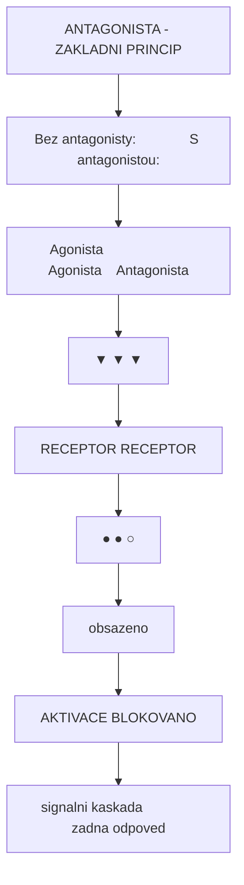

<details>
<summary>ASCII verze diagramu</summary>

```
ANTAGONISTA - ZAKLADNI PRINCIP

     Bez antagonisty:              S antagonistou:

     Agonista                      Agonista    Antagonista
        │                             │            │
        ▼                             ▼            ▼
   ┌─────────┐                   ┌─────────────────────┐
   │RECEPTOR │                   │      RECEPTOR       │
   │   ●     │                   │   ●        ○        │
   └────┬────┘                   │  (obsazeno)         │
        │                        └─────────────────────┘
        ▼                                 │
   AKTIVACE                         BLOKOVANO
   (signalni kaskada)              (zadna odpoved)
```

</details>

---

## Klasifikace antagonistu

### 1. Podle mechanismu vazby

#### Kompetitivni antagoniste

Souteži s agonistou o stejne (orthostericke) vazebne misto na receptoru.

| Vlastnost | Kompetitivni antagonista |
|-----------|--------------------------|
| **Vazebne misto** | Orthostericke (stejne jako agonista) |
| **Efekt na dávkovou krivku** | Posun doprava (zvyseni EC50) |
| **Efekt na Emax** | Beze zmeny (pri vysoke davce agonisty) |
| **Prekonatelnost** | Ano - zvysenim koncentrace agonisty |
| **Priklad** | Ketanserin (5-HT2A), Naloxon (opioidni) |

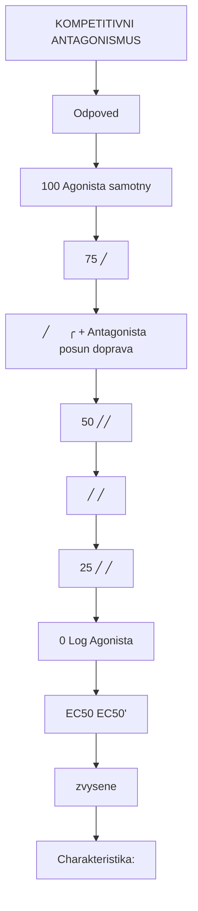

<details>
<summary>ASCII verze diagramu</summary>

```
KOMPETITIVNI ANTAGONISMUS

Odpoved
(%)
100 ┤                    ┌─── Agonista samotny
    │                  ╱
 75 ┤                ╱
    │              ╱      ╭─── + Antagonista (posun doprava)
 50 ┤────────────╱───────╱
    │          ╱       ╱
 25 ┤        ╱       ╱
    │      ╱       ╱
  0 ┼─────┴───────┴─────────→ Log [Agonista]
         EC50   EC50'
              (zvysene)

Charakteristika:
- Emax zustava zachovan
- EC50 se zvysuje (posun doprava)
- Schild rovnice: dose ratio = 1 + [B]/KB
```

</details>

#### Nekompetitivni antagoniste

Vazi se na jine misto nez agonista (alostericke) nebo ireverzibilne bloky receptor.

| Vlastnost | Nekompetitivni antagonista |
|-----------|----------------------------|
| **Vazebne misto** | Alostericke nebo ireverzibilni orthostericke |
| **Efekt na davkovou krivku** | Snizeni Emax |
| **Efekt na EC50** | Typicky beze zmeny nebo mirne zvyseni |
| **Prekonatelnost** | Ne - ani vysokou davkou agonisty |
| **Priklad** | Ketamin (NMDA kanalovy blokator) |

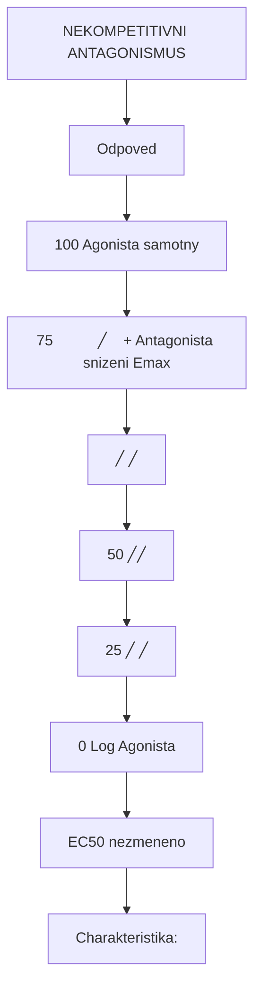

<details>
<summary>ASCII verze diagramu</summary>

```
NEKOMPETITIVNI ANTAGONISMUS

Odpoved
(%)
100 ┤              ┌─── Agonista samotny
    │            ╱
 75 ┤          ╱   ┌─── + Antagonista (snizeni Emax)
    │        ╱   ╱
 50 ┤──────╱───╱
    │    ╱   ╱
 25 ┤  ╱   ╱
    │╱   ╱
  0 ┼────┴──────────────────→ Log [Agonista]
        EC50 (nezmeneno)

Charakteristika:
- Emax se snizuje
- EC50 muze zustat nezmenene
- Nelze preklonat zvysenim davky agonisty
```

</details>

### 2. Podle reverzibility

#### Reverzibilni antagoniste

| Vlastnost | Hodnota |
|-----------|---------|
| **Vazba** | Nekovalentni (vodikove vazby, Van der Waals) |
| **Kinetika** | Rychla asociace i disociace |
| **Trvani ucinku** | Zavisle na biologickem polocase |
| **Obnoveni funkce** | Po eliminaci latky z organismu |
| **Priklady** | Naloxon, ketanserin, atropin |

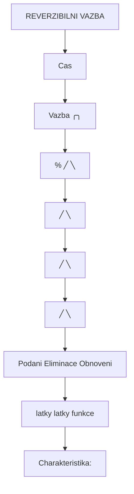

<details>
<summary>ASCII verze diagramu</summary>

```
REVERZIBILNI VAZBA

Cas →
        ┌───────────────────────────────────┐
        │                                   │
Vazba   │    ╭──────╮                       │
(%)     │   ╱        ╲                      │
        │  ╱          ╲                     │
        │ ╱            ╲                    │
        │╱              ╲                   │
        └───────────────────────────────────┘
         Podani    Eliminace   Obnoveni
         latky     latky       funkce

Charakteristika:
- Rovnovazny stav mezi asociaci a disociaci
- Ucinek zavisi na koncentraci
- Po eliminaci - uplne obnoveni receptorove funkce
```

</details>

#### Ireverzibilni antagoniste

| Vlastnost | Hodnota |
|-----------|---------|
| **Vazba** | Kovalentni nebo kvazi-ireverzibilni |
| **Kinetika** | Velmi pomala ci zadna disociace |
| **Trvani ucinku** | Az do resyntézy receptoru |
| **Obnoveni funkce** | Vyzaduje nove receptory |
| **Priklady** | Fenoxybenzamin (alpha-1), EEDQ (vyzkumny) |

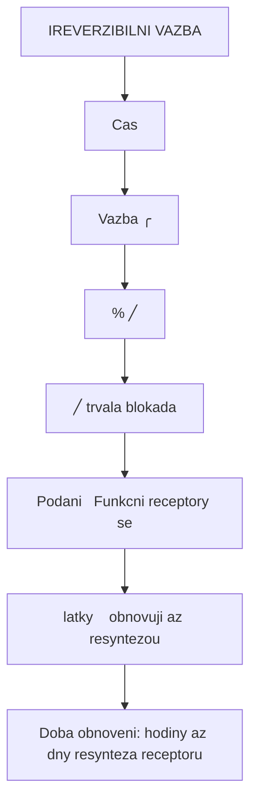

<details>
<summary>ASCII verze diagramu</summary>

```
IREVERZIBILNI VAZBA

Cas →
        ┌───────────────────────────────────┐
        │                                   │
Vazba   │    ╭────────────────────────────  │
(%)     │   ╱                               │
        │  ╱                                │
        │ ╱    (trvala blokada)             │
        │╱                                  │
        └───────────────────────────────────┘
         Podani   Funkcni receptory se
         latky    obnovuji az resyntezou

Doba obnoveni: hodiny az dny (resynteza receptoru)
```

</details>

### 3. Tabulka srovnani typu antagonismu

| Typ | Vazebne misto | Efekt na Emax | Efekt na EC50 | Prekonatelnost |
|-----|---------------|---------------|---------------|----------------|
| **Kompetitivni reverzibilni** | Orthostericke | Zachovan | Zvyseni | Ano |
| **Kompetitivni ireverzibilni** | Orthostericke | Snizeni | Zvyseni | Ne |
| **Nekompetitivni** | Alostericke | Snizeni | Beze zmeny | Ne |
| **Nesoutezivy** | Alostericke | Snizeni | Beze zmeny | Ne |

---

## Neutralni antagoniste vs inverzni agoniste

### Rozliseni

Receptory mohou mit bazalni (konstitutivni) aktivitu i bez pritomnosti agonisty. Toto rozliseni je klinicky vyznamne.

| Typ ligandu | Vnitrni aktivita | Efekt na bazalni aktivitu |
|-------------|------------------|---------------------------|
| **Plny agonista** | α = 1.0 | Maximalni aktivace |
| **Parcialni agonista** | α = 0.2-0.8 | Castecna aktivace |
| **Neutralni antagonista** | α = 0 | Zadny efekt na bazal |
| **Inverzni agonista** | α < 0 | Snizeni bazalni aktivity |

```mermaid
flowchart TD
    node_SPEKTRUMLIGANDU["SPEKTRUM LIGANDU"]
    node_Vnitrniaktivita["Vnitrni aktivita"]
    node_10Plnyagonista["+1.0   Plny agonista"]
    node_muscimolserotonin["muscimol, serotonin"]
    node_05Parcialniagonista["+0.5   Parcialni agonista"]
    node_psilocinbuprenorfin["psilocin, buprenorfin"]
    node_00NEUTRALNIANTAGONIS["0.0   NEUTRALNI ANTAGONISTA"]
    node_ketanserinnaloxon["ketanserin, naloxon"]
    node_pimavanserinDMCM["pimavanserin, DMCM"]
    node_NARECEPTORUSKONSTITU["NA RECEPTORU S KONSTITUTIVNI AKTIVITOU:"]
    node_Bazalni["Bazalni"]
    node_aktivita["aktivita"]
    node_100Plnyagonista["100                              Plny agonista"]
    node_75["75      ╱"]
    node_Neutralniantagonista["╱    Neutralni antagonista"]
    node_50["50"]
    node_zadnazmenabazalu["zadna zmena bazalu"]
    node_25["25"]
    node_Inverzniagonista["╲     Inverzni agonista"]
    node_0["0     ╲"]
    node_Ligand["Ligand"]

    node_SPEKTRUMLIGANDU --> node_Vnitrniaktivita
    node_Vnitrniaktivita --> node_10Plnyagonista
    node_10Plnyagonista --> node_muscimolserotonin
    node_muscimolserotonin --> node_05Parcialniagonista
    node_05Parcialniagonista --> node_psilocinbuprenorfin
    node_psilocinbuprenorfin --> node_00NEUTRALNIANTAGONIS
    node_00NEUTRALNIANTAGONIS --> node_ketanserinnaloxon
    node_ketanserinnaloxon --> node_pimavanserinDMCM
    node_pimavanserinDMCM --> node_NARECEPTORUSKONSTITU
    node_NARECEPTORUSKONSTITU --> node_Bazalni
    node_Bazalni --> node_aktivita
    node_aktivita --> node_100Plnyagonista
    node_100Plnyagonista --> node_75
    node_75 --> node_Neutralniantagonista
    node_Neutralniantagonista --> node_50
    node_50 --> node_zadnazmenabazalu
    node_zadnazmenabazalu --> node_25
    node_25 --> node_Inverzniagonista
    node_Inverzniagonista --> node_0
    node_0 --> node_Ligand

    click node_muscimolserotonin "/alkaloids/muscimol/" "muscimol, serotonin"
    click node_psilocinbuprenorfin "/alkaloids/psilocin/" "psilocin, buprenorfin"
    click node_NARECEPTORUSKONSTITU "/glossary/receptor/" "NA RECEPTORU S KONSTITUTIVNI AKTIVITOU:"
```

<details>
<summary>ASCII verze diagramu</summary>

```
SPEKTRUM LIGANDU

Vnitrni aktivita
      ↑
+1.0  ├───────────────────── Plny agonista
      │                      (muscimol, serotonin)
+0.5  ├───────────────────── Parcialni agonista
      │                      (psilocin, buprenorfin)
 0.0  ├───────────────────── NEUTRALNI ANTAGONISTA
      │                      (ketanserin, naloxon)
-0.5  ├─────────────────────
      │
-1.0  ├───────────────────── Inverzni agonista
      ↓                      (pimavanserin, DMCM)


NA RECEPTORU S KONSTITUTIVNI AKTIVITOU:

Bazalni
aktivita
(%)     │
  100   │                           Plny agonista
        │    ╭─────────────────────────────────
   75   │   ╱
        │  ╱    Neutralni antagonista
   50   │─────────────────────────────────────
        │        (zadna zmena bazalu)
   25   │
        │ ╲     Inverzni agonista
    0   │  ╲───────────────────────────────────
        └─────────────────────────────────────→
                    [Ligand]
```

</details>

### Neutralni antagonista - charakteristiky

| Vlastnost | Popis |
|-----------|-------|
| **Definice** | Blokuje agonisty bez ovlivneni bazalni aktivity |
| **Klinicke pouziti** | Preferovan u receptoru s nízkou konstitutivni aktivitou |
| **Vyhoda** | Predvidatelny efekt, zádny "reboundˇ |
| **Priklady** | Ketanserin (5-HT2A), naltrexon (opioidni) |

### Inverzni agonista - charakteristiky

| Vlastnost | Popis |
|-----------|-------|
| **Definice** | Snizuje bazalni receptorovou aktivitu |
| **Klinicke pouziti** | Receptory s vysokou konstitutivni aktivitou |
| **Vyhoda** | Silnejsi blokada nez neutralni antagonista |
| **Nevyhoda** | Mozny rebound po vysazeni |
| **Priklady** | Pimavanserin (5-HT2A), flumazenil (GABA-A - castecny) |

---

## Mechanismy antagonismu

### Orthostericka blokada

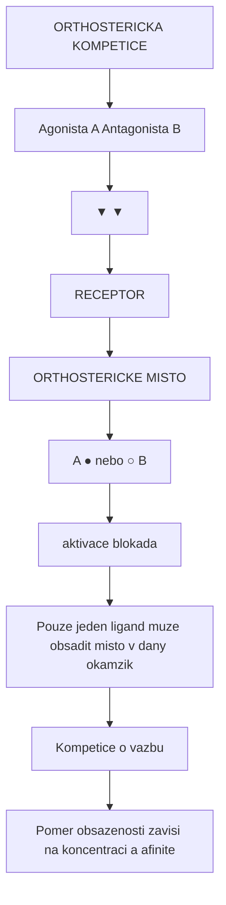

<details>
<summary>ASCII verze diagramu</summary>

```
ORTHOSTERICKA KOMPETICE

              Agonista (A)        Antagonista (B)
                  │                     │
                  ▼                     ▼
            ┌──────────────────────────────────┐
            │         RECEPTOR                  │
            │                                   │
            │    ┌────────────────────────┐    │
            │    │  ORTHOSTERICKE MISTO  │    │
            │    │                        │    │
            │    │  A ●    nebo    ○ B   │    │
            │    │  (aktivace)  (blokada) │    │
            │    └────────────────────────┘    │
            │                                   │
            └──────────────────────────────────┘

Pouze jeden ligand muze obsadit misto v dany okamzik
→ Kompetice o vazbu
→ Pomer obsazenosti zavisi na koncentraci a afinite
```

</details>

### Alostericka modulace

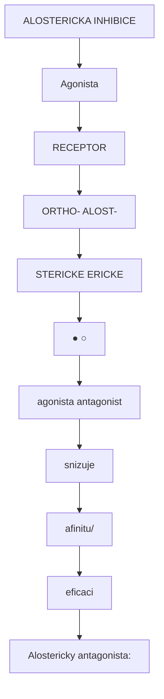

<details>
<summary>ASCII verze diagramu</summary>

```
ALOSTERICKA INHIBICE

                    Agonista
                       │
                       ▼
            ┌──────────────────────────────────┐
            │         RECEPTOR                  │
            │                                   │
            │  ┌──────────┐   ┌──────────┐    │
            │  │ ORTHO-   │   │ ALOST-   │    │
            │  │ STERICKE │   │ ERICKE   │    │
            │  │   ●      │   │   ○      │    │
            │  │(agonista)│ ← │(antagonist│   │
            │  │          │   │ snizuje   │   │
            │  │          │   │ afinitu/  │   │
            │  │          │   │ eficaci)  │   │
            │  └──────────┘   └──────────┘    │
            │                                   │
            └──────────────────────────────────┘

Alostericky antagonista:
- Meni konformaci receptoru
- Snizuje afinitu agonisty
- Nebo snizuje eficaci agonisty
- Oba ligandy mohou byt soucasne navazany
```

</details>

### Kanalova blokada (specialni pripad)

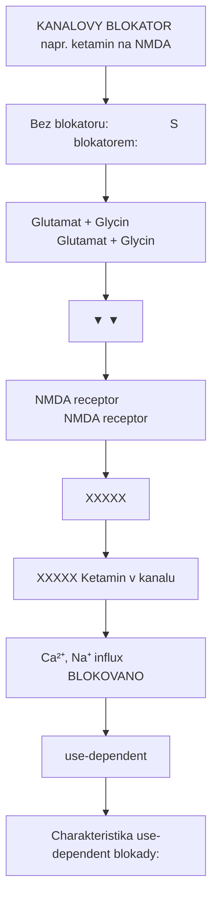

<details>
<summary>ASCII verze diagramu</summary>

```
KANALOVY BLOKATOR (napr. ketamin na NMDA)

    Bez blokatoru:                  S blokatorem:

    Glutamat + Glycin               Glutamat + Glycin
          │                               │
          ▼                               ▼
   ┌─────────────┐                 ┌─────────────┐
   │ NMDA receptor│                │ NMDA receptor│
   │   ┌─────┐   │                 │   ┌─────┐   │
   │   │     │   │                 │   │XXXXX│   │
   │   │     │   │                 │   │XXXXX│ ← Ketamin v kanalu
   │   │     │   │                 │   │XXXXX│   │
   │   └─────┘   │                 │   └─────┘   │
   └─────────────┘                 └─────────────┘
          │                               │
          ▼                               ▼
   Ca²⁺, Na⁺ influx              BLOKOVANO
                                 (use-dependent)

Charakteristika use-dependent blokady:
- Kanal musi byt otevreny pro vstup blokatoru
- Vyssi frekvence aktivace = silnejsi blokada
- Priklad: MK-801, ketamin, memantín
```

</details>

---

## Terapeuticke aplikace

### Psychiatrie a neurologie

| Indikace | Antagonizovany receptor | Lecivo | Mechanismus |
|----------|-------------------------|--------|-------------|
| **Schizofrenie** | D2 dopaminovy | Haloperidol, risperidon | Snizeni dopaminergni hyperaktivity |
| **Parkinsonova psychoza** | 5-HT2A | Pimavanserin | Blokada serotoninove psychozy |
| **Migréna (profylaxe)** | 5-HT2A/2C | Pizotifen | Prevence vazokonstrikce |
| **Predavkovani opioidy** | mu-opioidni | Naloxon, naltrexon | Kompetitivni vytlaceni opioidu |
| **Alzheimerova choroba** | NMDA | Memantín | Snizeni excitotoxicity |

### Kardiovaskularni system

| Indikace | Antagonizovany receptor | Lecivo | Mechanismus |
|----------|-------------------------|--------|-------------|
| **Hypertenze** | Alpha-1 adrenergni | Prazosin | Vazodilatace |
| **Arytmie** | Beta adrenergni | Propranolol | Snizeni srdecni frekvence |
| **Hypertenze** | AT1 (angiotensin) | Losartan | Vazodilatace |
| **Angina pectoris** | Beta adrenergni | Metoprolol | Snizeni naroky myokardu |

### Gastrointestinalni system

| Indikace | Antagonizovany receptor | Lecivo | Mechanismus |
|----------|-------------------------|--------|-------------|
| **Pepticky vred** | H2 histaminovy | Ranitidin | Snizeni kyseliny |
| **Nauzea, zvraceni** | 5-HT3 | Ondansetron | Blokada emeticke signalizace |
| **Prujmy** | mu-opioidni | Loperamid | Snizeni motility |

---

## Priklady s psychoaktivnimi latkami

### Serotoninove antagoniste (5-HT)

| Latka | Selektivita | Pouziti | Poznamka |
|-------|-------------|---------|----------|
| **Ketanserin** | 5-HT2A > 5-HT2C | Vyzkum, hypertenze | Standardni antagonista |
| **M100907 (Volinanserin)** | 5-HT2A >> ostatni | Vyzkum | Vysoka selektivita |
| **Ritanserin** | 5-HT2A/2C | Vyzkum | Blokuje ucinek psychedelik |
| **Pimavanserin** | 5-HT2A (inverzni ag.) | Parkinsonova psychoza | FDA schvaleny |
| **Cyproheptadin** | 5-HT2 + H1 | Serotininovy syndrom | Siroka aktivita |

#### Interakce s psychedeliky

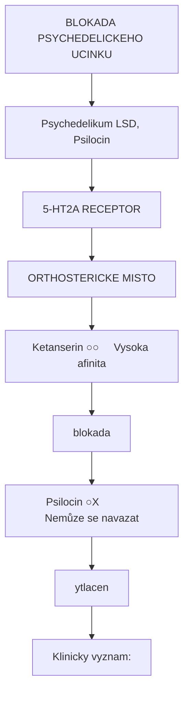

<details>
<summary>ASCII verze diagramu</summary>

```
BLOKADA PSYCHEDELICKEHO UCINKU

Psychedelikum (LSD, Psilocin)
              │
              ▼
        ┌─────────────────────────────────┐
        │      5-HT2A RECEPTOR            │
        │                                 │
        │  ┌───────────────────────────┐ │
        │  │   ORTHOSTERICKE MISTO    │ │
        │  │                           │ │
        │  │  Ketanserin ○─────────○  │ │ ← Vysoka afinita
        │  │              (blokada)    │ │
        │  │                           │ │
        │  │  Psilocin ○───X          │ │ ← Nemůze se navazat
        │  │           (vytlacen)      │ │
        │  └───────────────────────────┘ │
        └─────────────────────────────────┘

Klinicky vyznam:
- Ketanserin predem podany blokuje halucinace
- "Trip killer" v klinickem vyzkumu
- Zachranna terapie pri tezkem "bad tripu"
```

</details>

### Opioidni antagoniste

| Latka | Selektivita | Pouziti | Farmakokineticka |
|-------|-------------|---------|------------------|
| **Naloxon** | mu >> kappa, delta | Predavkovani (akutni) | T1/2 = 30-90 min, i.v. |
| **Naltrexon** | mu > kappa, delta | Udrzovaci lecba | T1/2 = 4 h, p.o. |
| **Nalmefén** | mu > kappa, delta | Predavkovani, alkohol | T1/2 = 10-13 h |
| **Methylnaltrexon** | Periferní mu | Opioidni zapca | Neprostupuje BBB |

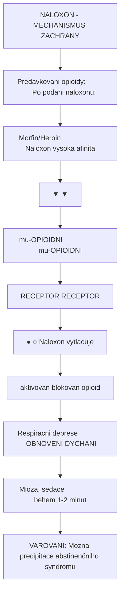

<details>
<summary>ASCII verze diagramu</summary>

```
NALOXON - MECHANISMUS ZACHRANY

Predavkovani opioidy:             Po podani naloxonu:

Morfin/Heroin                     Naloxon (vysoka afinita)
      │                                 │
      ▼                                 ▼
┌──────────────┐                 ┌──────────────┐
│ mu-OPIOIDNI  │                 │ mu-OPIOIDNI  │
│  RECEPTOR    │                 │  RECEPTOR    │
│    ●         │                 │    ○         │ ← Naloxon vytlacuje
│ (aktivovan)  │                 │  (blokovan)  │    opioid
└──────────────┘                 └──────────────┘
      │                                 │
      ▼                                 ▼
Respiracni deprese              OBNOVENI DYCHANI
Mioza, sedace                   (behem 1-2 minut)

VAROVANI: Mozna precipitace abstinenčniho syndromu
```

</details>

### GABAergni antagoniste

| Latka | Receptor/Misto | Pouziti | Typ |
|-------|----------------|---------|-----|
| **Flumazenil** | GABA-A (BZ site) | Predavkovani BZ | Kompetitivni |
| **Bikukullin** | GABA-A (GABA site) | Vyzkum | Kompetitivni |
| **Pikrotoxin** | GABA-A (kanal) | Vyzkum (konvulzant) | Kanalovy blokator |
| **CGP 35348** | GABA-B | Vyzkum | Kompetitivni |

### NMDA antagoniste (kanalove blokatory)

| Latka | Ki (nM) | Klinicke pouziti | Charakteristika |
|-------|---------|------------------|-----------------|
| **Ketamin** | 500-1000 | Anestezie, deprese | Use-dependent |
| **Memantín** | 500-1000 | Alzheimerova choroba | Nizka afinita, dobre tolerovany |
| **MK-801 (Dizocilpin)** | 2-3 | Pouze vyzkum | Vysoka afinita, neurotoxicky |
| **PCP** | 50-100 | (Zneuzivana) | Disociativni anestetikum |
| **Dextrometorfan** | 1000+ | Antitusivum | Nizka afinita |

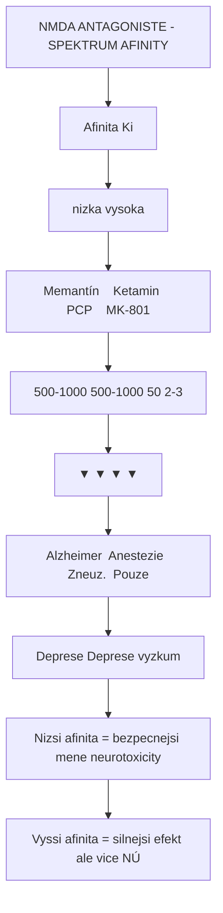

<details>
<summary>ASCII verze diagramu</summary>

```
NMDA ANTAGONISTE - SPEKTRUM AFINITY

Afinita (Ki)
nizka ←──────────────────────────────────→ vysoka

Memantín    Ketamin    PCP    MK-801
(500-1000)  (500-1000) (50)   (2-3)
    │           │        │       │
    ▼           ▼        ▼       ▼
Alzheimer  Anestezie  Zneuz.  Pouze
Deprese    Deprese            vyzkum

Nizsi afinita = bezpecnejsi (mene neurotoxicity)
Vyssi afinita = silnejsi efekt ale vice NÚ
```

</details>

---

## Schild analýza

### Kvantifikace kompetitivniho antagonismu

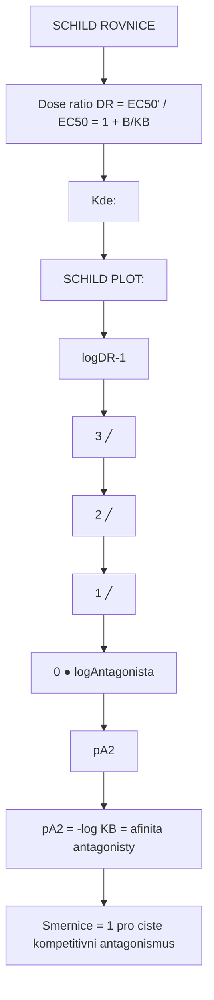

<details>
<summary>ASCII verze diagramu</summary>

```
SCHILD ROVNICE

Dose ratio (DR) = EC50' / EC50 = 1 + [B]/KB

Kde:
- DR = dose ratio (pomer davek)
- EC50' = EC50 v pritomnosti antagonisty
- EC50 = EC50 bez antagonisty
- [B] = koncentrace antagonisty
- KB = rovnovazna disociacni konstanta antagonisty

SCHILD PLOT:

log(DR-1)
    │
  3 ┤                    ╱
    │                  ╱
  2 ┤                ╱
    │              ╱
  1 ┤            ╱
    │          ╱
  0 ┤────────●───────────────→ log[Antagonista]
    │        │
    │      pA2
    │
pA2 = -log KB = afinita antagonisty

Smernice = 1 pro ciste kompetitivni antagonismus
```

</details>

### Interpretace pA2

| pA2 hodnota | Afinita | Priklad |
|-------------|---------|---------|
| > 9 | Extrémne vysoka | M100907 (5-HT2A) |
| 8-9 | Vysoka | Ketanserin (5-HT2A) |
| 7-8 | Stredni | Mnoho leciv |
| 6-7 | Nizka | Fyziologicke antagonisty |
| < 6 | Velmi nizka | Slabe interakce |

---

## Klinicke uvahy

### Terapeuticky index antagonistu

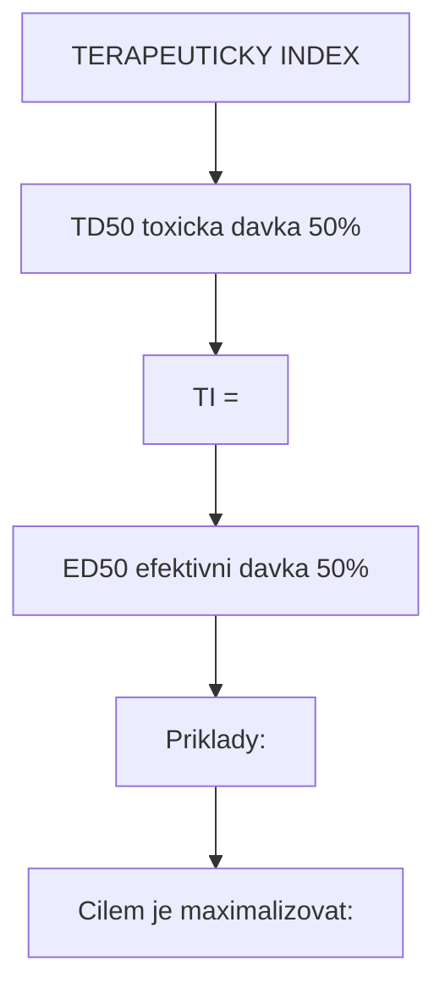

<details>
<summary>ASCII verze diagramu</summary>

```
TERAPEUTICKY INDEX

    TD50 (toxicka davka 50%)
TI = ─────────────────────────
    ED50 (efektivni davka 50%)

Priklady:
- Naloxon: TI > 100 (velmi bezpecny)
- Flumazenil: TI > 50 (bezpecny)
- Haloperidol: TI ~ 10-20 (potrebny monitoring)

Cilem je maximalizovat:
- Receptorovou obsazenost na cilovém receptoru
- Minimalizovat off-target ucinky
```

</details>

### Selektivita antagonistu

| Antagonista | Primarni cil | Sekundarni cile | Dusledek |
|-------------|--------------|-----------------|----------|
| **Haloperidol** | D2 | Alpha-1, 5-HT2A, H1 | EPS, sedace, hypotenze |
| **Risperidon** | D2, 5-HT2A | Alpha-1, H1 | Mene EPS, sedace |
| **Ketanserin** | 5-HT2A | Alpha-1, H1 | Hypotenze |
| **M100907** | 5-HT2A | (minimalni) | Vysoka selektivita |

### Rebound fenomén

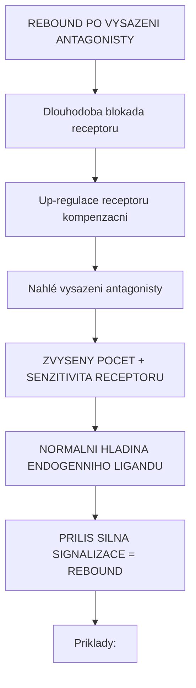

<details>
<summary>ASCII verze diagramu</summary>

```
REBOUND PO VYSAZENI ANTAGONISTY

Dlouhodoba blokada receptoru
         │
         ▼
Up-regulace receptoru (kompenzacni)
         │
         ▼
Nahlé vysazeni antagonisty
         │
         ▼
┌─────────────────────────────────────────┐
│  ZVYSENY POCET + SENZITIVITA RECEPTORU  │
│                    +                     │
│  NORMALNI HLADINA ENDOGENNIHO LIGANDU   │
└─────────────────────────────────────────┘
         │
         ▼
PRILIS SILNA SIGNALIZACE = REBOUND

Priklady:
- Beta-blokatory: rebound hypertenze, tachykardie
- Benzodiazepiny (částečne antagoniste): úzkost, křeče
- Antipsychotika: supersenzitivní psychóza
```

</details>

---

## Vyzkumne aplikace

### Farmakologicke nastroje

| Antagonista | Receptor | Vyzkumne pouziti |
|-------------|----------|------------------|
| **Ketanserin** | 5-HT2A | Studium psychedelik |
| **SCH 23390** | D1 | Dopaminergni signalizace |
| **Raclopride** | D2 | PET imaging |
| **SR 141716** | CB1 | Endokanabinoidní system |
| **Naltrindole** | Delta-opioidní | Opioidni farmakologie |

### Radioligandy pro PET

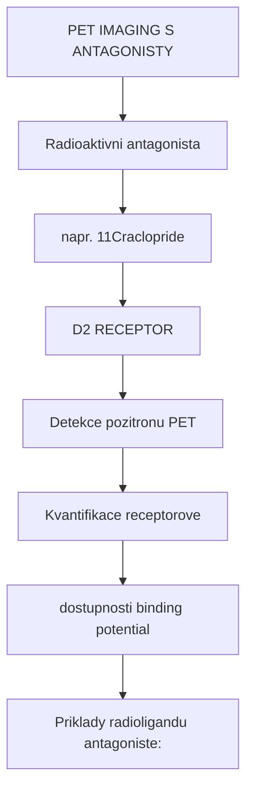

<details>
<summary>ASCII verze diagramu</summary>

```
PET IMAGING S ANTAGONISTY

             Radioaktivni antagonista
                    (napr. [11C]raclopride)
                           │
                           ▼
                    ┌─────────────┐
                    │   D2 RECEPTOR│
                    │      ○       │
                    └──────┬──────┘
                           │
                           ▼
              Detekce pozitronu (PET)
                           │
                           ▼
         ┌─────────────────────────────────┐
         │  Kvantifikace receptorove       │
         │  dostupnosti (binding potential)│
         └─────────────────────────────────┘

Priklady radioligandu (antagoniste):
- [11C]Raclopride (D2)
- [18F]Altanserin (5-HT2A)
- [11C]Flumazenil (GABA-A BZ site)
- [11C]Carfentanil (mu-opioidni)
```

</details>

---

## Srovnani: Antagonista vs Agonista vs Modulátor

| Vlastnost | Agonista | Antagonista | Alosterický modulátor |
|-----------|----------|-------------|----------------------|
| **Vazebne misto** | Orthostericke | Orthostericke/alostericke | Alostericke |
| **Vnitrni aktivita** | Pozitivni | Nulova | Zadna (modifikuje) |
| **Samostatny efekt** | Ano | Ne (pouze blokuje) | Ne (potrebuje ligand) |
| **Efekt na agonisty** | - | Snizuje/blokuje | Zvysuje (PAM) / Snizuje (NAM) |
| **Priklad** | Psilocin, morfin | Ketanserin, naloxon | Diazepam, CDPPB |

---

## Reference

1. Kenakin, T. (2012). *Pharmacology in Drug Discovery and Development*. Academic Press.
2. Rang, H.P. et al. (2019). *Rang and Dale's Pharmacology*. Elsevier. 9th ed.
3. Christopoulos, A. & Kenakin, T. (2002). *G protein-coupled receptor allosterism and complexing*. Pharmacological Reviews.
4. Kobilka, B.K. (2011). *Structural insights into adrenergic receptor function and pharmacology*. Trends in Pharmacological Sciences.
5. Vollenweider, F.X. & Preller, K.H. (2020). *Psychedelic drugs: neurobiology and potential for treatment of psychiatric disorders*. Nature Reviews Neuroscience.
6. Stahl, S.M. (2021). *Stahl's Essential Psychopharmacology*. Cambridge University Press. 5th ed.

---

## Viz take

### Souvisejici pojmy v glosari

- [Receptor](@/glossary/receptor.md) - Molekularni cil antagonistu
- [GABA](@/glossary/gaba.md) - Neurotransmiter s klinicky vyznamnymi antagonisty
- [Fosfat](@/glossary/fosfat.md) - Signalni transdukce
- [Nukleotid](@/glossary/nukleotid.md) - Sekundarni messengery (cAMP)

### Specificke receptory

- [5-HT2A receptor](@/receptors/5-ht2a.md) - Primarni cil psychedelik, ketanserin antagonista
- [GABA-A receptor](@/receptors/gaba-a.md) - Flumazenil, bikukullin
- [NMDA receptor](@/receptors/nmda.md) - Ketamin, memantín (kanalove blokatory)

### Psychoaktivni latky

- [LSD](@/alkaloids/lsd.md) - Blokovatelny ketanserinem
- [Psilocybin](@/alkaloids/psilocybin.md) / [Psilocin](@/alkaloids/psilocin.md) - 5-HT2A agoniste

### Houby

- [Psilocybe houby](@/shrooms/psilocybes/_index.md) - Zdroj psilocybinu
- [Amanita muscaria](@/shrooms/amanita-muscaria.md) - Zdroj muscimolu

---

<- Zpet na [Glosar](@/glossary/_index.md)

---

*Posledni aktualizace: 2026-01-30*
