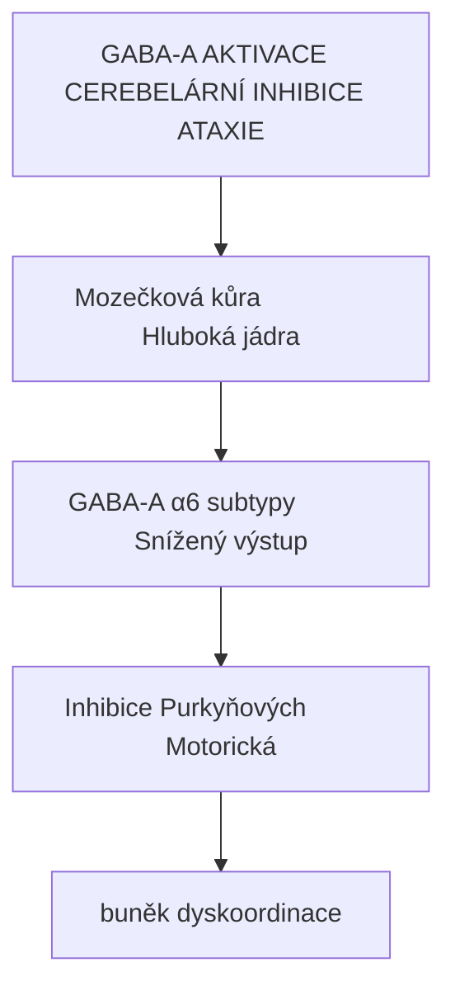
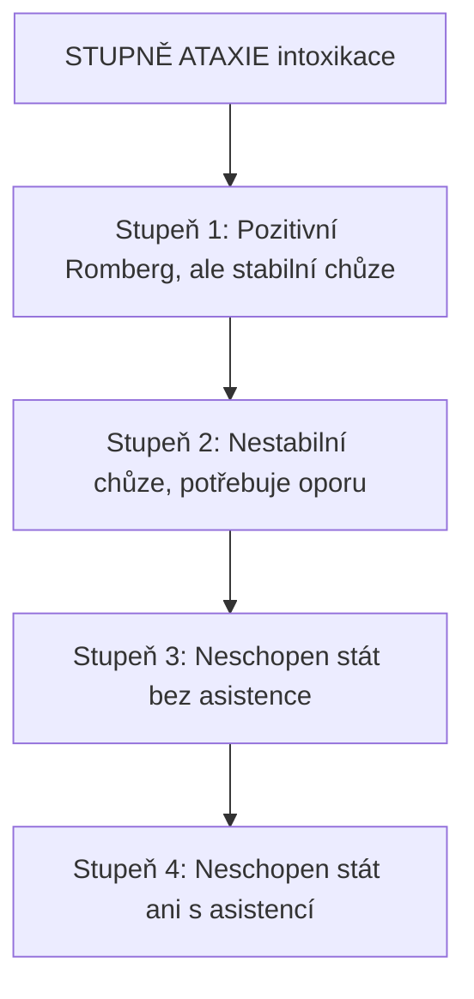

+++
title = "Ataxie"
description = "Ataxie - porucha motorické koordinace, cerebelární a senzorická ataxie, mechanismy, příčiny včetně psychoaktivních látek"
weight = 5
insert_anchor_links = "right"

[taxonomies]
categories = ["neurologie", "terminologie", "symptomy"]
tags = ["ataxie", "koordinace", "cerebellum", "GABA", "muscimol", "alkohol", "motorika"]
+++

# Ataxie

**Ataxie** (z řeckého *ataxia* = neuspořádanost) je neurologický příznak charakterizovaný **poruchou koordinace pohybů** bez přítomnosti svalové slabosti. Může být způsobena poškozením mozečku, senzorických drah nebo vestibulárního systému.

---

## Typy ataxie

### Cerebelární ataxie

**Mechanismus**: Poškození nebo dysfunkce [mozečku](brain/cerebellum.md)

| Příznak | Popis |
|---------|-------|
| **Dysmetrie** | Nepřesné cílení pohybů |
| **Intenciální tremor** | Třes při cíleném pohybu |
| **Dysartrie** | Nezřetelná řeč |
| **Nystagmus** | Mimovolní pohyby očí |
| **Široká báze chůze** | Kompenzace nestability |

### Senzorická ataxie

**Mechanismus**: Narušení proprioceptivních drah (zadní provazce míšní)

| Příznak | Popis |
|---------|-------|
| **Romberg pozitivní** | Zhoršení při zavřených očích |
| **"Stepáž"** | Vysoko zvedané nohy při chůzi |
| **Ztráta polohocitu** | Nejistota polohy končetin |

### Vestibulární ataxie

**Mechanismus**: Dysfunkce vestibulárního aparátu

| Příznak | Popis |
|---------|-------|
| **Vertigo** | Točení hlavy |
| **Lateropulze** | Tendence padat na jednu stranu |
| **Nauzea** | Vegetativní příznaky |

---

## Psychoaktivní látky a ataxie

### GABAergní látky



<details>
<summary>ASCII verze diagramu</summary>

```
GABA-A AKTIVACE → CEREBELÁRNÍ INHIBICE → ATAXIE

  Mozečková kůra               Hluboká jádra
       ↓                            ↓
  GABA-A α6 subtypy           Snížený výstup
       ↓                            ↓
  Inhibice Purkyňových          Motorická
  buněk                         dyskoordinace
```

</details>

| Látka | Mechanismus | Intenzita ataxie |
|-------|-------------|------------------|
| **Alkohol** | GABA-A PAM + NMDA antagonista | Střední až silná |
| **Benzodiazepiny** | GABA-A PAM | Mírná až střední |
| **Barbituráty** | GABA-A agonista/PAM | Silná |

### Disociativa

| Látka | Mechanismus | Charakter |
|-------|-------------|-----------|
| **[Ketamin](@/alkaloids/ketamin.md)** | NMDA antagonista | Vestibulární + cerebelární |
| **PCP** | NMDA antagonista | Silná |
| **DXM** | NMDA + σ | Variabilní |

### Jiné

| Látka | Mechanismus | Poznámka |
|-------|-------------|----------|
| **Kanabis** | CB1 | Mírná |
| **Antihistaminika** | H1 + ACh | Sedativní komponenta |

---

## Škálování ataxie

### Klinické škály

| Stupeň | Popis | Funkční dopad |
|--------|-------|---------------|
| **0** | Normální | Žádný |
| **1** | Mírná nejistota | Zvládne běžné aktivity |
| **2** | Zřetelná ataxie | Potřebuje oporu |
| **3** | Výrazná ataxie | Vyžaduje asistenci |
| **4** | Těžká ataxie | Neschopen samostatné lokomoce |

### Hodnocení při intoxikaci



<details>
<summary>ASCII verze diagramu</summary>

```
STUPNĚ ATAXIE (intoxikace)

Stupeň 1: Pozitivní Romberg, ale stabilní chůze
    ↓
Stupeň 2: Nestabilní chůze, potřebuje oporu
    ↓
Stupeň 3: Neschopen stát bez asistence
    ↓
Stupeň 4: Neschopen stát ani s asistencí
```

</details>

---

## Harm reduction

### Prevence pádů

1. **Prostředí**
   - Odstranit překážky
   - Vyhnout se schodům
   - Měkký povrch (matrace, polštáře)

2. **Chování**
   - Sedět nebo ležet
   - Nevstávat rychle
   - Trip sitter

3. **Interakce**
   - Nekombinovat GABAergika
   - Vyhnout se alkoholu

### Varovné známky

| Příznak | Akce |
|---------|------|
| Těžká ataxie + zvracení | Recovery pozice, sledovat dýchání |
| Neschopnost komunikovat | Zvážit lékařskou pomoc |
| Cyanóza | Okamžitě volat záchranku |

---

## Viz také

### Látky způsobující ataxii
- [Účinky muscimolu](@/phenomenology/muscimol-effects.md) - Detailní popis
- [Ketamin](@/alkaloids/ketamin.md) - Disociativní ataxie

### Neuroanatomie
- [Cerebellum](brain/cerebellum.md) - Centrum koordinace
- [GABA-A receptor](@/receptors/gaba-a.md) - Mechanismus

### Bezpečnost
- [Set and setting](@/glossary/set-and-setting.md) - Bezpečné prostředí

---

← Zpět na [Glosář](@/glossary/_index.md)
