+++
title = "Dopamin"
description = "Dopamin - klicovy neurotransmiter odmeny, motivace a motoricke kontroly v CNS"
weight = 3
insert_anchor_links = "right"

[taxonomies]
categories = ["neurotransmitery", "katecholaminy"]
tags = ["dopamin", "odmena", "motivace", "parkinsonova-choroba", "schizofrenie", "zavislost", "substantia-nigra", "VTA"]
+++

# Dopamin - Neurotransmiter odmeny a motivace

**Dopamin** (DA, 3,4-dihydroxyfenethylamin) je **katecholaminovy neurotransmiter** s klicovou roli v regulaci odmeny, motivace, motoricke kontroly a kognitivnich funkci. Je jednim z nejdulezitejsich neurotransmiteru v kontextu zavislosti, psychiatrickych poruch a pusobeni psychoaktivnich latek.

---

## Zakladni informace

| Vlastnost | Hodnota |
|-----------|---------|
| **Chemicky nazev** | 4-(2-aminoethyl)benzen-1,2-diol |
| **Alternativni nazvy** | 3,4-dihydroxyfenethylamin, DA, Dopamine |
| **Molekularni vzorec** | C8H11NO2 |
| **Molekularni hmotnost** | 153,18 g/mol |
| **CAS cislo** | 51-61-6 |
| **PubChem CID** | 681 |
| **Funkce** | Neurotransmiter, neuromodulátor, hormon |
| **Kategorie** | Katecholaminy (biogenni aminy) |

---

## Chemicka struktura

### Strukturni vzorec (ASCII)

```
        OH
         |
    [1]--[2]
   /         \
  [6]        [3]
   |          |
  [5]--[4]---OH
         |
        CH2
         |
        CH2
         |
        NH2

Benzkatecholove jadro (katechol)
+ ethylaminovy retezec
= KATECHOLAMIN
```

### Strukturni klasifikace

| Kategorie | Zarazeni |
|-----------|----------|
| **Trida** | Biogenni aminy |
| **Podtrida** | Katecholaminy |
| **Zakladni struktura** | Fenethylamin |
| **Funkcni skupiny** | Katechol (2x -OH), primarni amin |
| **Prekurzor** | L-tyrozin |
| **Metabolity** | DOPAC, HVA |

### Vztah k dalsim katecholaminům

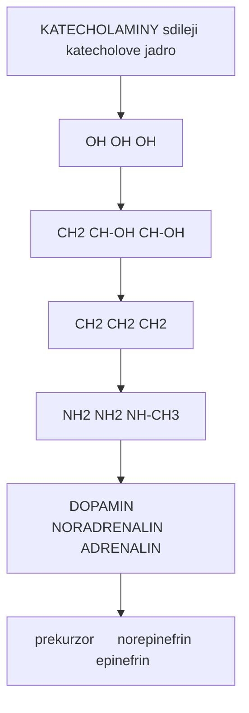

<details>
<summary>ASCII verze diagramu</summary>

```
KATECHOLAMINY (sdileji katecholove jadro)

         OH                OH                OH
          |                 |                 |
     ----[   ]----     ----[   ]----     ----[   ]----
    |            |    |            |    |            |
    |            |    |            |    |            |
     ----[   ]----     ----[   ]----     ----[   ]----
          |                 |                 |
         OH                OH                OH
          |                 |                 |
        CH2               CH-OH             CH-OH
          |                 |                 |
        CH2               CH2               CH2
          |                 |                 |
        NH2               NH2              NH-CH3

     DOPAMIN          NORADRENALIN       ADRENALIN
    (prekurzor)      (norepinefrin)     (epinefrin)
```

</details>

---

## Biosynteza

### Synteticka draha

```
L-Fenylalanin
      |
      | [Fenylalanin hydroxyláza (PAH)]
      | [Kofaktor: BH4 (tetrahydrobiopterin)]
      v
L-Tyrozin (aminokyselina z potravy nebo z Phe)
      |
      | [Tyrozin hydroxyláza (TH)] <-- RATE-LIMITING STEP
      | [Kofaktor: BH4, Fe2+, O2]
      v
L-DOPA (L-3,4-dihydroxyfenylalanin)
      |
      | [DOPA dekarboxyláza (AADC)]
      | [Kofaktor: Pyridoxal-5-fosfát (vitamin B6)]
      v
DOPAMIN
      |
      | [Dopamin beta-hydroxyláza (DBH)] (pouze v noradrenergních neuronech)
      | [Kofaktor: Askorbát, Cu2+]
      v
NORADRENALIN
      |
      | [Fenyletanolamin-N-metyltransferáza (PNMT)]
      | [Kofaktor: SAM (S-adenosylmethionin)]
      v
ADRENALIN
```

### Klicove enzymy biosyntézy

| Enzym | Zkratka | Funkce | Regulace | Inhibitory |
|-------|---------|--------|----------|------------|
| **Tyrozin hydroxyláza** | TH | L-Tyr --> L-DOPA | Rate-limiting, fosforylace | alpha-Methyl-p-tyrosin (AMPT) |
| **DOPA dekarboxyláza** | AADC | L-DOPA --> DA | Konstitutivní | Carbidopa, Benserazid |
| **Dopamin beta-hydroxyláza** | DBH | DA --> NA | Vezikulární | Disulfiram, Nepicastat |

### Regulace biosyntézy

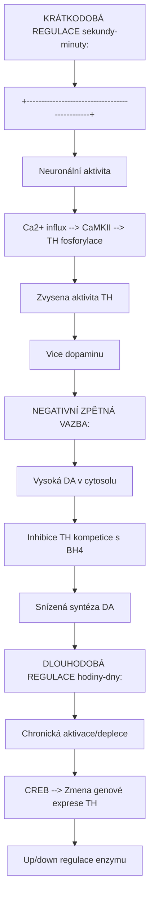

<details>
<summary>ASCII verze diagramu</summary>

```
KRÁTKODOBÁ REGULACE (sekundy-minuty):
+-----------------------------------------------+
|  Neuronální aktivita                          |
|         |                                     |
|         v                                     |
|  Ca2+ influx --> CaMKII --> TH fosforylace   |
|                      |                        |
|                      v                        |
|              Zvysena aktivita TH              |
|                      |                        |
|                      v                        |
|              Vice dopaminu                    |
+-----------------------------------------------+

NEGATIVNÍ ZPĚTNÁ VAZBA:
+-----------------------------------------------+
|  Vysoká [DA] v cytosolu                       |
|         |                                     |
|         v                                     |
|  Inhibice TH (kompetice s BH4)               |
|         |                                     |
|         v                                     |
|  Snízená syntéza DA                          |
+-----------------------------------------------+

DLOUHODOBÁ REGULACE (hodiny-dny):
+-----------------------------------------------+
|  Chronická aktivace/deplece                   |
|         |                                     |
|         v                                     |
|  CREB --> Zmena genové exprese TH            |
|         |                                     |
|         v                                     |
|  Up/down regulace enzymu                      |
+-----------------------------------------------+
```

</details>

---

## Metabolismus a degradace

### Metabolicke drahy

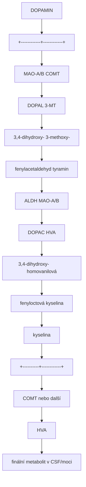

<details>
<summary>ASCII verze diagramu</summary>

```
                    DOPAMIN
                       |
          +------------+------------+
          |                         |
          v                         v
      [MAO-A/B]                  [COMT]
          |                         |
          v                         v
       DOPAL                    3-MT
  (3,4-dihydroxy-           (3-methoxy-
   fenylacetaldehyd)         tyramin)
          |                         |
          v                         v
      [ALDH]                    [MAO-A/B]
          |                         |
          v                         v
       DOPAC                     HVA
  (3,4-dihydroxy-            (homovanilová
   fenyloctová               kyselina)
   kyselina)                      |
          |                       |
          +----------+------------+
                     |
                     v
              [COMT nebo další]
                     |
                     v
                   HVA
          (finální metabolit v CSF/moci)
```

</details>

### Klicove enzymy degradace

| Enzym | Zkratka | Lokalizace | Substráty | Inhibitory |
|-------|---------|------------|-----------|------------|
| **Monoamin oxidáza A** | MAO-A | Mitochondrie | DA, 5-HT, NA | Moclobemid, Clorgylin |
| **Monoamin oxidáza B** | MAO-B | Mitochondrie | DA, PEA | Selegilin, Rasagilin |
| **Katechol-O-metyltransferáza** | COMT | Cytosol, membrána | DA, NA, DOPA | Entakapon, Tolkapon |
| **Aldehyd dehydrogenáza** | ALDH | Cytosol | DOPAL | Disulfiram |

### Metabolity v klinické diagnostice

| Metabolit | Lokalizace | Klinický význam |
|-----------|------------|-----------------|
| **HVA** | CSF, moč | Marker dopaminergní aktivity |
| **DOPAC** | Mozek | Intraneuronální metabolismus |
| **3-MT** | Mozek | Extraneuronální metabolismus |
| **VMA** | Moč | Marker noradrenergní aktivity |

---

## Dopaminové receptory

### Klasifikace receptorů

| Receptor | Rodina | G-protein | Efekt na cAMP | Distribuce |
|----------|--------|-----------|---------------|------------|
| **D1** | D1-like | Gs | Zvýšení | Striatum, kortex, NAcc |
| **D5** | D1-like | Gs | Zvýšení | Hippocampus, hypotalamus |
| **D2** | D2-like | Gi/o | Snížení | Striatum, VTA, hypofýza |
| **D3** | D2-like | Gi/o | Snížení | NAcc, VTA, limbický systém |
| **D4** | D2-like | Gi/o | Snížení | Frontální kortex, amygdala |

### D1-like receptory (D1, D5)

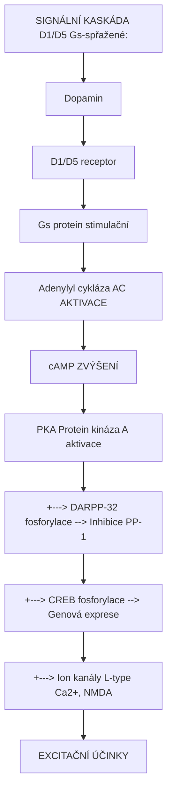

<details>
<summary>ASCII verze diagramu</summary>

```
SIGNÁLNÍ KASKÁDA D1/D5 (Gs-spřažené):

Dopamin
    |
    v
D1/D5 receptor
    |
    v
Gs protein (stimulační)
    |
    v
Adenylyl cykláza (AC) AKTIVACE
    |
    v
cAMP ZVÝŠENÍ
    |
    v
PKA (Protein kináza A) aktivace
    |
    +---> DARPP-32 fosforylace --> Inhibice PP-1
    |
    +---> CREB fosforylace --> Genová exprese
    |
    +---> Ion kanály (L-type Ca2+, NMDA)
    |
    v
EXCITAČNÍ ÚČINKY
- Zvýšená neuronální excitabilita
- Synaptická plasticita
- Posílení glutamátové signalizace
```

</details>

### D2-like receptory (D2, D3, D4)

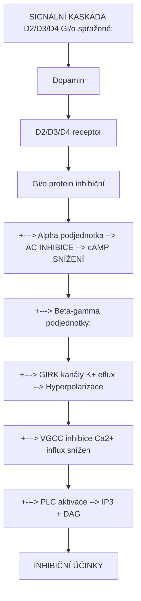

<details>
<summary>ASCII verze diagramu</summary>

```
SIGNÁLNÍ KASKÁDA D2/D3/D4 (Gi/o-spřažené):

Dopamin
    |
    v
D2/D3/D4 receptor
    |
    v
Gi/o protein (inhibiční)
    |
    +---> Alpha podjednotka --> AC INHIBICE --> cAMP SNÍŽENÍ
    |
    +---> Beta-gamma podjednotky:
              |
              +---> GIRK kanály (K+ eflux) --> Hyperpolarizace
              |
              +---> VGCC inhibice (Ca2+ influx snížen)
              |
              +---> PLC aktivace --> IP3 + DAG
    |
    v
INHIBIČNÍ ÚČINKY
- Snížená neuronální excitabilita
- Autoreceptorová funkce (D2)
- Modulace uvolňování neurotransmiterů
```

</details>

### Presynaptické autoreceptory

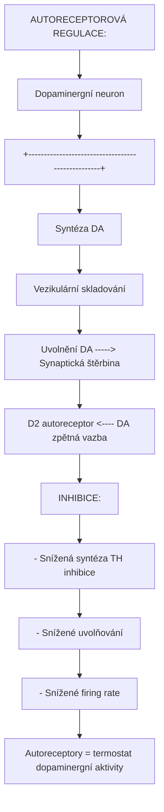

<details>
<summary>ASCII verze diagramu</summary>

```
AUTORECEPTOROVÁ REGULACE:

Dopaminergní neuron
+--------------------------------------------------+
|                                                  |
|  [Syntéza DA]                                    |
|       |                                          |
|       v                                          |
|  [Vezikulární skladování]                        |
|       |                                          |
|       v                                          |
|  [Uvolnění DA] -----> Synaptická štěrbina        |
|       ^                      |                   |
|       |                      v                   |
|   D2 autoreceptor <---- DA zpětná vazba          |
|       |                                          |
|       v                                          |
|  INHIBICE:                                       |
|  - Snížená syntéza (TH inhibice)                |
|  - Snížené uvolňování                            |
|  - Snížené firing rate                           |
|                                                  |
+--------------------------------------------------+

Autoreceptory = termostat dopaminergní aktivity
```

</details>

### Farmakologie dopaminových receptorů

| Ligand | Typ | Receptory | Klinické použití |
|--------|-----|-----------|------------------|
| **L-DOPA** | Prekurzor | Nepřímý agonista všech | Parkinsonova choroba |
| **Pramipexol** | Agonista | D2, D3, D4 | Parkinson, RLS |
| **Ropinirol** | Agonista | D2, D3 | Parkinson, RLS |
| **Bromokriptin** | Agonista | D2 | Hyperprolaktinémie |
| **Haloperidol** | Antagonista | D2 (vysoká afinita) | Schizofrenie (typické) |
| **Risperidon** | Antagonista | D2, 5-HT2A | Schizofrenie (atypické) |
| **Klozapin** | Antagonista | D4 > D2 | Rezistentní schizofrenie |
| **Aripiprazol** | Parciální agonista | D2 | Schizofrenie, bipolární |

---

## Dopaminové drahy v mozku

### Čtyři hlavní dopaminergní dráhy

```mermaid
flowchart TD
    node_DOPAMINERGNDRHYCNS["DOPAMINERGNÍ DRÁHY CNS:"]
    node_1MESOLIMBICKDRHARewa["1. MESOLIMBICKÁ DRÁHA Reward pathway"]
    node_VTANAccamygdalahippo["VTA &gt; NAcc, amygdala, hippocampus"]
    node_FunkceOdmnamotivacee["Funkce: Odměna, motivace, emoce"]
    node_PatologieZvislostisc["Patologie: Závislosti, schizofrenie pozitivní sympt."]
    node_2MEZOKORTIKLNDRHA["2. MEZOKORTIKÁLNÍ DRÁHA"]
    node_VTAPrefrontlnkortex["VTA &gt; Prefrontální kortex"]
    node_FunkceKogniceexekuti["Funkce: Kognice, exekutivní funkce, pracovní paměť"]
    node_PatologieSchizofreni["Patologie: Schizofrenie negativní/kognitivní sympt., ADHD"]
    node_3NIGROSTRIATLNDRHA["3. NIGROSTRIATÁLNÍ DRÁHA"]
    node_SNcStriatumcaudatepu["SNc &gt; Striatum caudate, putamen"]
    node_FunkceMotorickkontro["Funkce: Motorická kontrola, procedurální učení"]
    node_PatologieParkinsonov["Patologie: Parkinsonova choroba, Huntingtonova choroba"]
    node_4TUBEROINFUNDIBULRND["4. TUBEROINFUNDIBULÁRNÍ DRÁHA"]
    node_HypotalamusHypofzaem["Hypotalamus &gt; Hypofýza eminentia mediana"]
    node_FunkceInhibiceuvolov["Funkce: Inhibice uvolňování prolaktinu"]
    node_PatologieHyperprolak["Patologie: Hyperprolaktinémie D2 blokáda"]

    node_DOPAMINERGNDRHYCNS --> node_1MESOLIMBICKDRHARewa
    node_1MESOLIMBICKDRHARewa --> node_VTANAccamygdalahippo
    node_VTANAccamygdalahippo --> node_FunkceOdmnamotivacee
    node_FunkceOdmnamotivacee --> node_PatologieZvislostisc
    node_PatologieZvislostisc --> node_2MEZOKORTIKLNDRHA
    node_2MEZOKORTIKLNDRHA --> node_VTAPrefrontlnkortex
    node_VTAPrefrontlnkortex --> node_FunkceKogniceexekuti
    node_FunkceKogniceexekuti --> node_PatologieSchizofreni
    node_PatologieSchizofreni --> node_3NIGROSTRIATLNDRHA
    node_3NIGROSTRIATLNDRHA --> node_SNcStriatumcaudatepu
    node_SNcStriatumcaudatepu --> node_FunkceMotorickkontro
    node_FunkceMotorickkontro --> node_PatologieParkinsonov
    node_PatologieParkinsonov --> node_4TUBEROINFUNDIBULRND
    node_4TUBEROINFUNDIBULRND --> node_HypotalamusHypofzaem
    node_HypotalamusHypofzaem --> node_FunkceInhibiceuvolov
    node_FunkceInhibiceuvolov --> node_PatologieHyperprolak
```

<details>
<summary>ASCII verze diagramu</summary>

```
DOPAMINERGNÍ DRÁHY CNS:

1. MESOLIMBICKÁ DRÁHA (Reward pathway)
   VTA ──────────────────────> NAcc, amygdala, hippocampus
   Funkce: Odměna, motivace, emoce
   Patologie: Závislosti, schizofrenie (pozitivní sympt.)

2. MEZOKORTIKÁLNÍ DRÁHA
   VTA ──────────────────────> Prefrontální kortex
   Funkce: Kognice, exekutivní funkce, pracovní paměť
   Patologie: Schizofrenie (negativní/kognitivní sympt.), ADHD

3. NIGROSTRIATÁLNÍ DRÁHA
   SNc ──────────────────────> Striatum (caudate, putamen)
   Funkce: Motorická kontrola, procedurální učení
   Patologie: Parkinsonova choroba, Huntingtonova choroba

4. TUBEROINFUNDIBULÁRNÍ DRÁHA
   Hypotalamus ──────────────> Hypofýza (eminentia mediana)
   Funkce: Inhibice uvolňování prolaktinu
   Patologie: Hyperprolaktinémie (D2 blokáda)
```

</details>

### Mesolimbická dráha - Odměnový systém

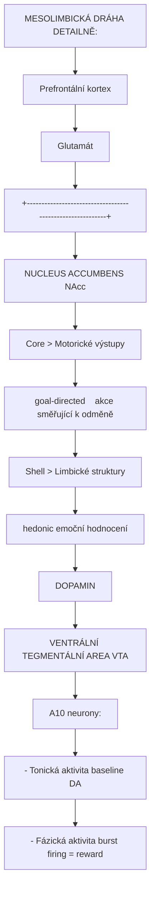

<details>
<summary>ASCII verze diagramu</summary>

```
MESOLIMBICKÁ DRÁHA DETAILNĚ:

                    Prefrontální kortex
                           ^
                           |
                    [Glutamát]
                           |
+----------------------------------------------------------+
|                                                          |
|              NUCLEUS ACCUMBENS (NAcc)                    |
|                                                          |
|   Core ────────────> Motorické výstupy                   |
|   (goal-directed)    (akce směřující k odměně)          |
|                                                          |
|   Shell ───────────> Limbické struktury                  |
|   (hedonic)          (emoční hodnocení)                  |
|                                                          |
+----------------------------------------------------------+
                           ^
                           |
                    [DOPAMIN]
                           |
+----------------------------------------------------------+
|                                                          |
|              VENTRÁLNÍ TEGMENTÁLNÍ AREA (VTA)            |
|                                                          |
|   A10 neurony:                                           |
|   - Tonická aktivita (baseline DA)                       |
|   - Fázická aktivita (burst firing = reward)            |
|                                                          |
+----------------------------------------------------------+
```

</details>

### Reward Prediction Error (RPE)

```
TEORIE PREDIKČNÍ CHYBY ODMĚNY (Schultz, 1997):

Situace 1: NEOČEKÁVANÁ ODMĚNA
Očekávání: 0    Realita: +1    RPE: +1
--> FÁZICKÉ ZVÝŠENÍ DA
--> "Lepší než očekáváno" signal
--> Posílení předcházejícího chování

Situace 2: OČEKÁVANÁ ODMĚNA
Očekávání: +1    Realita: +1    RPE: 0
--> ŽÁDNÁ ZMĚNA DA
--> Predikce potvrzena
--> Udržení naučeného chování

Situace 3: NEPŘÍTOMNOST OČEKÁVANÉ ODMĚNY
Očekávání: +1    Realita: 0    RPE: -1
--> FÁZICKÝ POKLES DA
--> "Horší než očekáváno" signal
--> Vyhasínání předcházejícího chování

Situace 4: CUE PŘEDPOVÍDAJÍCÍ ODMĚNU
Po naučení: DA firing se přesouvá z odměny na CUE
--> Anticipační vzrušení
--> Základ motivovaného chování

ZÁVISLOST:
Drogy umele vyvolavaji masivni DA spike
--> RPE konstantne pozitivni
--> Neomezene posilovani uzivani
```

### Nigrostriatální dráha - Motorická kontrola

```mermaid
flowchart TD
    node_NIGROSTRIATLNDRHAABA["NIGROSTRIATÁLNÍ DRÁHA A BAZÁLNÍ GANGLIA:"]
    node_KORTEX["KORTEX"]
    node_Glutamt["Glutamát"]
    node_8bcc77b8["+------------------------------------------+"]
    node_STRIATUM["STRIATUM"]
    node_CaudatenucleusPutame["Caudate nucleus + Putamen"]
    node_StriatlnneuronyMSNs["Striatální neurony MSNs:"]
    node_D1MSNpmdrhaGO["- D1-MSN --&gt; 'přímá dráha' GO"]
    node_D2MSNnepmdrhaNOGO["- D2-MSN --&gt; 'nepřímá dráha' NO-GO"]
    node_DOPAMINGPiSNrGPe["DOPAMIN              GPi/SNr  GPe"]
    node_SUBSTANTIANIGRAparsc["SUBSTANTIA NIGRA pars compacta"]
    node_SNcA9neurony["SNc, A9 neurony"]
    node_400000600000DAneuron["- 400,000-600,000 DA neuronů"]
    node_Ztrta6080Parkinsonis["- Ztráta &gt; 60-80% --&gt; Parkinsonismus"]
    node_THALAMUS["THALAMUS"]
    node_Motorick["Motorický"]
    node_PMvsNEPMDRHA["PŘÍMÁ vs NEPŘÍMÁ DRÁHA:"]
    node_PMD1["PŘÍMÁ D1:"]
    node_StriatumD1MSNGPiSNrT["Striatum D1-MSN --| GPi/SNr --| Thalamus --&gt; Kortex"]
    node_GABAGABAGlutamt["GABA              GABA      Glutamát"]
    node_VsledekFACILITACEpoh["Výsledek: FACILITACE pohybu GO signal"]
    node_NEPMD2["NEPŘÍMÁ D2:"]
    node_StriatumD2MSNGPeSTNG["Striatum D2-MSN --| GPe --| STN --&gt; GPi/SNr --| Thalamus"]
    node_GABAGABAGlutGABA["GABA             GABA  Glut    GABA"]
    node_VsledekINHIBICEpohyb["Výsledek: INHIBICE pohybu NO-GO signal"]
    node_DOPAMIN["DOPAMIN:"]
    node_PARKINSONOVACHOROBAn["PARKINSONOVA CHOROBA nedostatek DA:"]

    node_NIGROSTRIATLNDRHAABA --> node_KORTEX
    node_KORTEX --> node_Glutamt
    node_Glutamt --> node_8bcc77b8
    node_8bcc77b8 --> node_STRIATUM
    node_STRIATUM --> node_CaudatenucleusPutame
    node_CaudatenucleusPutame --> node_StriatlnneuronyMSNs
    node_StriatlnneuronyMSNs --> node_D1MSNpmdrhaGO
    node_D1MSNpmdrhaGO --> node_D2MSNnepmdrhaNOGO
    node_D2MSNnepmdrhaNOGO --> node_DOPAMINGPiSNrGPe
    node_DOPAMINGPiSNrGPe --> node_SUBSTANTIANIGRAparsc
    node_SUBSTANTIANIGRAparsc --> node_SNcA9neurony
    node_SNcA9neurony --> node_400000600000DAneuron
    node_400000600000DAneuron --> node_Ztrta6080Parkinsonis
    node_Ztrta6080Parkinsonis --> node_THALAMUS
    node_THALAMUS --> node_Motorick
    node_Motorick --> node_PMvsNEPMDRHA
    node_PMvsNEPMDRHA --> node_PMD1
    node_PMD1 --> node_StriatumD1MSNGPiSNrT
    node_StriatumD1MSNGPiSNrT --> node_GABAGABAGlutamt
    node_GABAGABAGlutamt --> node_VsledekFACILITACEpoh
    node_VsledekFACILITACEpoh --> node_NEPMD2
    node_NEPMD2 --> node_StriatumD2MSNGPeSTNG
    node_StriatumD2MSNGPeSTNG --> node_GABAGABAGlutGABA
    node_GABAGABAGlutGABA --> node_VsledekINHIBICEpohyb
    node_VsledekINHIBICEpohyb --> node_DOPAMIN
    node_DOPAMIN --> node_PARKINSONOVACHOROBAn

    click node_GABAGABAGlutamt "/glossary/gaba/" "GABA              GABA      Glutamát"
    click node_GABAGABAGlutGABA "/glossary/gaba/" "GABA             GABA  Glut    GABA"
```

<details>
<summary>ASCII verze diagramu</summary>

```
NIGROSTRIATÁLNÍ DRÁHA A BAZÁLNÍ GANGLIA:

                KORTEX
                   |
                   | [Glutamát]
                   v
+------------------------------------------+
|              STRIATUM                     |
|  (Caudate nucleus + Putamen)              |
|                                           |
|  Striatální neurony (MSNs):               |
|  - D1-MSN --> "přímá dráha" (GO)         |
|  - D2-MSN --> "nepřímá dráha" (NO-GO)    |
|                                           |
+------------------------------------------+
        ^                    |      |
        |                    v      v
   [DOPAMIN]              GPi/SNr  GPe
        |                    |      |
+------------------------------------------+
|        SUBSTANTIA NIGRA pars compacta     |
|              (SNc, A9 neurony)            |
|                                           |
|  - 400,000-600,000 DA neuronů            |
|  - Ztráta > 60-80% --> Parkinsonismus    |
+------------------------------------------+
                   |
                   v
              THALAMUS
                   |
                   | [Glutamát]
                   v
                KORTEX
              (Motorický)


PŘÍMÁ vs NEPŘÍMÁ DRÁHA:

PŘÍMÁ (D1):
Striatum (D1-MSN) --| GPi/SNr --| Thalamus --> Kortex
   [GABA]              [GABA]      [Glutamát]
Výsledek: FACILITACE pohybu (GO signal)

NEPŘÍMÁ (D2):
Striatum (D2-MSN) --| GPe --| STN --> GPi/SNr --| Thalamus
   [GABA]             [GABA]  [Glut]    [GABA]
Výsledek: INHIBICE pohybu (NO-GO signal)

DOPAMIN:
- Aktivuje D1-MSN (přímou dráhu) --> GO
- Inhibuje D2-MSN (nepřímou dráhu) --> uvolnění NO-GO

PARKINSONOVA CHOROBA (nedostatek DA):
- Snížená aktivace přímé dráhy
- Zvýšená aktivita nepřímé dráhy
--> HYPOKINEZE (snížená schopnost iniciovat pohyb)
```

</details>

---

## Dopamin a psychoaktivní látky

### Mechanismy zvýšení dopaminu

| Látka | Mechanismus | DA zvýšení v NAcc | Závislostní potenciál |
|-------|-------------|-------------------|----------------------|
| **Kokain** | DAT blokáda | 300-400% | Velmi vysoký |
| **Amfetamin** | DAT reverze, VMAT | 500-1000% | Velmi vysoký |
| **Metamfetamin** | DAT reverze, VMAT, neurotoxicita | 1000%+ | Extrémní |
| **Nikotin** | nAChR --> VTA aktivace | 150-200% | Vysoký |
| **Alkohol** | Opioidní, GABAergní --> VTA | 150-200% | Střední-vysoký |
| **Heroin/Opioidy** | MOR --> VTA disinhibice | 200-300% | Velmi vysoký |
| **Cannabis** | CB1 --> VTA modulace | 150-200% | Střední |
| **MDMA** | SERT, DAT, NET reverze | 200-300% | Střední |
| [**LSD**](@/alkaloids/lsd.md) | D2 parciální agonista | Mírné | Minimální |
| [**Psilocybin**](@/alkaloids/psilocybin.md) | Nepřímý přes 5-HT2A | Mírné | Minimální |

### Mechanismy působení stimulantů

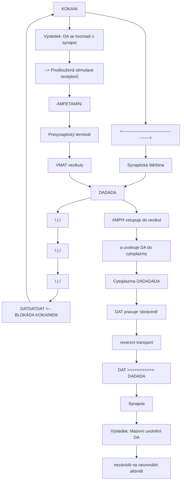

<details>
<summary>ASCII verze diagramu</summary>

```
KOKAIN:
+------------------------------------------+
|  Synaptická štěrbina                      |
|                                           |
|  [DA] [DA] [DA]                          |
|    \   |   /                              |
|     \  |  /                               |
|      \ | /                                |
|   [DAT][DAT][DAT] <-- BLOKÁDA KOKAINEM   |
|         X                                 |
|      [KOKAIN]                             |
|                                           |
|  Výsledek: DA se hromadí v synapsi       |
|  --> Prodloužená stimulace receptorů      |
+------------------------------------------+

AMFETAMIN:
+------------------------------------------+
|  Presynaptický terminál                   |
|                                           |
|  VMAT vezikuly                            |
|  [DA][DA][DA]                            |
|       | AMPH vstupuje do vezikul         |
|       v a uvolnuje DA do cytoplazmy      |
|    Cytoplazma [DA][DA][DA][DA]           |
|       |                                   |
|       | DAT pracuje "obráceně"           |
|       v (reverzní transport)              |
|   DAT >>>>>>>>>>> [DA][DA][DA]           |
|                   Synapse                 |
|                                           |
|  Výsledek: Masivní uvolnění DA           |
|  nezávislé na neuronální aktivitě        |
+------------------------------------------+
```

</details>

### Klasická psychedelika a dopamin

| Látka | Primární cíl | Dopaminergní účinky | Klinický význam |
|-------|--------------|---------------------|-----------------|
| [**LSD**](@/alkaloids/lsd.md) | [5-HT2A](@/receptors/5-ht2a.md) | D1, D2 parciální agonista (Ki ~10-50 nM) | Přispívá k euforii |
| [**Psilocin**](@/alkaloids/psilocin.md) | [5-HT2A](@/receptors/5-ht2a.md) | Minimální přímý DA účinek | - |
| [**DMT**](@/alkaloids/dmt.md) | [5-HT2A](@/receptors/5-ht2a.md) | Sigma-1 > DA | - |
| [**Meskalin**](@/alkaloids/mescaline.md) | [5-HT2A](@/receptors/5-ht2a.md) | D1, D2 slabá aktivita | - |

**Poznámka**: Na rozdíl od stimulantů, klasická psychedelika nevyvolávají výrazné zvýšení DA v NAcc, což vysvětluje jejich nízký závislostní potenciál.

### Dopaminová hypotéza závislosti

```
NEUROADAPTACE PŘI CHRONICKÉM UŽÍVÁNÍ:

Fáze 1: AKUTNÍ INTOXIKACE
Droga --> Masivní DA spike v NAcc
--> Intenzivní euforie
--> Pozitivní posilování

Fáze 2: TOLERANCE (dny-týdny)
Chronická DA elevace --> Downregulace D2 receptorů
                    --> Snížená DA syntéza
                    --> Snížená citlivost reward systému
--> Potřeba vyšších dávek pro stejný účinek

Fáze 3: ZÁVISLOST (týdny-měsíce)
D2 receptory          Bazální DA        Prefrontální
trvale sníženy        trvale snížen     kontrola snížena
      |                    |                  |
      v                    v                  v
  Anhedonie           Dysphorie         Impulzivita
  (neschopnost        (negativní        (craving
   prožívat           nálada bez        a kompulze)
   přirozenou         drogy)
   odměnu)

Fáze 4: RELAPS (měsíce-roky)
CUE-triggered craving:
Prostředí/stres --> Aktivace amygdaly
                --> Glutamátový input do NAcc
                --> DA spike (menší než původní)
                --> CRAVING
                --> Vysoké riziko relapsu

NEUROBIOLOGICKÝ ZÁKLAD RELAPSU:
- Trvalé změny v synaptické plasticitě
- Sensibilizace na drogy a cues
- Snížená prefrontální kontrola
- Hyperaktivita stresového systému
```

---

## Dopamin a neurologické/psychiatrické poruchy

### Parkinsonova choroba

| Aspekt | Charakteristika |
|--------|-----------------|
| **Patofyziologie** | Degenerace DA neuronů v SNc |
| **Ztráta neuronů** | >60-80% při vzniku symptomů |
| **Příčiny** | Alpha-synuklein agregace (Lewyho tělíska) |
| **Hlavní symptomy** | Bradykineze, rigidita, tremor, posturální instabilita |
| **Nemotorické symptomy** | Deprese, úzkost, kognitivní deficit, anosmie |

```
FARMAKOTERAPIE PARKINSONOVY CHOROBY:

1. PREKURZOROVÁ TERAPIE
   L-DOPA + Carbidopa/Benserazid (periferní AADC inhibitor)
   --> Zvýšení DA syntézy v mozku
   Problémy: Wearing-off, dyskineze, motor fluctuations

2. DOPAMINOVÍ AGONISTÉ
   Pramipexol, Ropinirol, Rotigotin
   --> Přímá stimulace D2/D3 receptorů
   Problémy: Impulzivní poruchy (gambling, hypersexualita)

3. MAO-B INHIBITORY
   Selegilin, Rasagilin, Safinamid
   --> Snížení degradace DA

4. COMT INHIBITORY
   Entakapon, Tolkapon, Opikapon
   --> Prodloužení účinku L-DOPA

5. HLUBOKÁ MOZKOVÁ STIMULACE (DBS)
   Elektrody v STN nebo GPi
   --> Modulace bazálních ganglií

BUDOUCÍ TERAPIE:
- Genová terapie (AADC, GDNF)
- Kmenové buňky
- Alpha-synuklein imunoterapie
```

### Schizofrenie

```mermaid
flowchart TD
    node_DOPAMINOVHYPOTZASCHI["DOPAMINOVÁ HYPOTÉZA SCHIZOFRENIE:"]
    node_KLASICKVERZE1960s["KLASICKÁ VERZE 1960s:"]
    node_Nadmrndopaminergnakt["'Nadměrná dopaminergní aktivita'"]
    node_Evidence["Evidence:"]
    node_REVIDOVANVERZEsouasn["REVIDOVANÁ VERZE současná:"]
    node_47416ffa["+----------------------------------------------------------+"]
    node_SCHIZOFRENIE["SCHIZOFRENIE"]
    node_MEZOLIMBICKSYSTMMEZO["MEZOLIMBICKÝ SYSTÉM:        MEZOKORTIKÁLNÍ SYSTÉM:"]
    node_VTANAccVTAPFC["VTA --&gt; NAcc               VTA --&gt; PFC"]
    node_HYPERAKTIVITADAHYPOA["HYPERAKTIVITA DA            HYPOAKTIVITA DA"]
    node_POZITIVNSYMPTOMYNEGA["POZITIVNÍ SYMPTOMY          NEGATIVNÍ + KOGNITIVNÍ"]
    node_HalucinaceAbulieztrt["- Halucinace                - Abulie ztráta vůle"]
    node_BludyAnhedonie["- Bludy                     - Anhedonie"]
    node_DezorganizaceSocilns["- Dezorganizace             - Sociální stažení"]
    node_Kognitivndeficit["- Kognitivní deficit"]
    node_Pracovnpam["- Pracovní paměť"]
    node_D2antagonistpomhajD2["D2 antagonisté pomáhají     D2 antagonisté ZHORŠUJÍ"]
    node_FARMAKOTERAPIE["FARMAKOTERAPIE:"]
    node_TYPICKANTIPSYCHOTIKA["TYPICKÁ ANTIPSYCHOTIKA 1. generace:"]
    node_HaloperidolChlorprom["Haloperidol, Chlorpromazin"]
    node_MechanismusD2blokdav["Mechanismus: D2 blokáda vysoká"]
    node_innostPozitivnsympto["Účinnost: Pozitivní symptomy"]
    node_ProblmyEPStardivndys["Problémy: EPS, tardivní dyskineze, prolaktin"]
    node_ATYPICKANTIPSYCHOTIK["ATYPICKÁ ANTIPSYCHOTIKA 2. generace:"]
    node_RisperidonOlanzapinQ["Risperidon, Olanzapin, Quetiapin, Klozapin, Aripiprazol"]
    node_MechanismusD25HT2Abl["Mechanismus: D2 + 5-HT2A blokáda, rychlá disociace"]
    node_innostPozitivnstenne["Účinnost: Pozitivní + částečně negativní symptomy"]
    node_ProblmyMetabolickvha["Problémy: Metabolické váha, diabetes, sedace"]
    node_ARIPIPRAZOLUNIQUE["ARIPIPRAZOL - UNIQUE:"]
    node_D2parcilnagonista["D2 parciální agonista"]

    node_DOPAMINOVHYPOTZASCHI --> node_KLASICKVERZE1960s
    node_KLASICKVERZE1960s --> node_Nadmrndopaminergnakt
    node_Nadmrndopaminergnakt --> node_Evidence
    node_Evidence --> node_REVIDOVANVERZEsouasn
    node_REVIDOVANVERZEsouasn --> node_47416ffa
    node_47416ffa --> node_SCHIZOFRENIE
    node_SCHIZOFRENIE --> node_MEZOLIMBICKSYSTMMEZO
    node_MEZOLIMBICKSYSTMMEZO --> node_VTANAccVTAPFC
    node_VTANAccVTAPFC --> node_HYPERAKTIVITADAHYPOA
    node_HYPERAKTIVITADAHYPOA --> node_POZITIVNSYMPTOMYNEGA
    node_POZITIVNSYMPTOMYNEGA --> node_HalucinaceAbulieztrt
    node_HalucinaceAbulieztrt --> node_BludyAnhedonie
    node_BludyAnhedonie --> node_DezorganizaceSocilns
    node_DezorganizaceSocilns --> node_Kognitivndeficit
    node_Kognitivndeficit --> node_Pracovnpam
    node_Pracovnpam --> node_D2antagonistpomhajD2
    node_D2antagonistpomhajD2 --> node_FARMAKOTERAPIE
    node_FARMAKOTERAPIE --> node_TYPICKANTIPSYCHOTIKA
    node_TYPICKANTIPSYCHOTIKA --> node_HaloperidolChlorprom
    node_HaloperidolChlorprom --> node_MechanismusD2blokdav
    node_MechanismusD2blokdav --> node_innostPozitivnsympto
    node_innostPozitivnsympto --> node_ProblmyEPStardivndys
    node_ProblmyEPStardivndys --> node_ATYPICKANTIPSYCHOTIK
    node_ATYPICKANTIPSYCHOTIK --> node_RisperidonOlanzapinQ
    node_RisperidonOlanzapinQ --> node_MechanismusD25HT2Abl
    node_MechanismusD25HT2Abl --> node_innostPozitivnstenne
    node_innostPozitivnstenne --> node_ProblmyMetabolickvha
    node_ProblmyMetabolickvha --> node_ARIPIPRAZOLUNIQUE
    node_ARIPIPRAZOLUNIQUE --> node_D2parcilnagonista

    click node_MechanismusD25HT2Abl "/receptors/5-ht2a/" "Mechanismus: D2 + 5-HT2A blokáda, rychlá disociace"
```

<details>
<summary>ASCII verze diagramu</summary>

```
DOPAMINOVÁ HYPOTÉZA SCHIZOFRENIE:

KLASICKÁ VERZE (1960s):
"Nadměrná dopaminergní aktivita"
Evidence:
- Amfetamin vyvolává psychózu
- Antipsychotika blokují D2 receptory
- Korelace D2 blokády s antipsychotickým účinkem

REVIDOVANÁ VERZE (současná):

+----------------------------------------------------------+
|                     SCHIZOFRENIE                          |
|                                                           |
|  MEZOLIMBICKÝ SYSTÉM:        MEZOKORTIKÁLNÍ SYSTÉM:      |
|  (VTA --> NAcc)               (VTA --> PFC)               |
|                                                           |
|  HYPERAKTIVITA DA            HYPOAKTIVITA DA              |
|       |                            |                      |
|       v                            v                      |
|  POZITIVNÍ SYMPTOMY          NEGATIVNÍ + KOGNITIVNÍ       |
|  - Halucinace                - Abulie (ztráta vůle)       |
|  - Bludy                     - Anhedonie                  |
|  - Dezorganizace             - Sociální stažení           |
|                              - Kognitivní deficit         |
|                              - Pracovní paměť             |
|                                                           |
|  D2 antagonisté pomáhají     D2 antagonisté ZHORŠUJÍ     |
+----------------------------------------------------------+

FARMAKOTERAPIE:

TYPICKÁ ANTIPSYCHOTIKA (1. generace):
Haloperidol, Chlorpromazin
Mechanismus: D2 blokáda (vysoká)
Účinnost: Pozitivní symptomy
Problémy: EPS, tardivní dyskineze, prolaktin

ATYPICKÁ ANTIPSYCHOTIKA (2. generace):
Risperidon, Olanzapin, Quetiapin, Klozapin, Aripiprazol
Mechanismus: D2 + 5-HT2A blokáda, rychlá disociace
Účinnost: Pozitivní + částečně negativní symptomy
Problémy: Metabolické (váha, diabetes), sedace

ARIPIPRAZOL - UNIQUE:
D2 parciální agonista
- Stabilizuje DA (nesnižuje příliš)
- Méně EPS a prolaktinu
- "Dopaminový stabilizátor"
```

</details>

### ADHD (Porucha pozornosti s hyperaktivitou)

| Aspekt | Charakteristika |
|--------|-----------------|
| **Patofyziologie** | Hypofunkce DA a NA v PFC |
| **Genetika** | Polymorfismy DAT, DRD4, DRD5 |
| **Symptomy** | Nepozornost, hyperaktivita, impulzivita |
| **Neurobiology** | Snížený DA tonus v PFC, aberantní reward processing |

```mermaid
flowchart TD
    node_FARMAKOTERAPIEADHD["FARMAKOTERAPIE ADHD:"]
    node_STIMULANTY["STIMULANTY:"]
    node_8bcc77b8["+------------------------------------------+"]
    node_METHYLFENIDTRitalinC["METHYLFENIDÁT Ritalin, Concerta"]
    node_MechanismusDATaNETbl["Mechanismus: DAT a NET blokáda"]
    node_inekZvenDAaNAvPFC["Účinek: Zvýšení DA a NA v PFC"]
    node_ParadoxStimulantukli["Paradox: Stimulant 'uklidňuje' ADHD"]
    node_normalizujehypofunkn["normalizuje hypofunkční DA"]
    node_AMFETAMINYAdderallVy["AMFETAMINY Adderall, Vyvanse"]
    node_MechanismusDATNETrev["Mechanismus: DAT/NET reverze + VMAT"]
    node_inekMasivnjDANAuvoln["Účinek: Masivnější DA/NA uvolnění"]
    node_LisdexamfetaminProdr["Lisdexamfetamin: Prodrug pomalejší"]
    node_NONSTIMULANTY["NON-STIMULANTY:"]
    node_ATOMOXETIN["ATOMOXETIN"]
    node_MechanismusSelektivn["Mechanismus: Selektivní NET inhibitor"]
    node_inekNAzvenDAvPFCnepm["Účinek: NA zvýšení DA v PFC nepřímo"]
    node_Bezzvislostnhopotenc["Bez závislostního potenciálu"]
    node_GUANFACINKLONIDIN["GUANFACIN, KLONIDIN"]
    node_MechanismusAlpha2Aag["Mechanismus: Alpha-2A agonisté"]
    node_inekPoslenPFCfunkce["Účinek: Posílení PFC funkce"]

    node_FARMAKOTERAPIEADHD --> node_STIMULANTY
    node_STIMULANTY --> node_8bcc77b8
    node_8bcc77b8 --> node_METHYLFENIDTRitalinC
    node_METHYLFENIDTRitalinC --> node_MechanismusDATaNETbl
    node_MechanismusDATaNETbl --> node_inekZvenDAaNAvPFC
    node_inekZvenDAaNAvPFC --> node_ParadoxStimulantukli
    node_ParadoxStimulantukli --> node_normalizujehypofunkn
    node_normalizujehypofunkn --> node_AMFETAMINYAdderallVy
    node_AMFETAMINYAdderallVy --> node_MechanismusDATNETrev
    node_MechanismusDATNETrev --> node_inekMasivnjDANAuvoln
    node_inekMasivnjDANAuvoln --> node_LisdexamfetaminProdr
    node_LisdexamfetaminProdr --> node_NONSTIMULANTY
    node_NONSTIMULANTY --> node_ATOMOXETIN
    node_ATOMOXETIN --> node_MechanismusSelektivn
    node_MechanismusSelektivn --> node_inekNAzvenDAvPFCnepm
    node_inekNAzvenDAvPFCnepm --> node_Bezzvislostnhopotenc
    node_Bezzvislostnhopotenc --> node_GUANFACINKLONIDIN
    node_GUANFACINKLONIDIN --> node_MechanismusAlpha2Aag
    node_MechanismusAlpha2Aag --> node_inekPoslenPFCfunkce
```

<details>
<summary>ASCII verze diagramu</summary>

```
FARMAKOTERAPIE ADHD:

STIMULANTY:
+------------------------------------------+
| METHYLFENIDÁT (Ritalin, Concerta)        |
| Mechanismus: DAT a NET blokáda           |
| Účinek: Zvýšení DA a NA v PFC            |
| Paradox: Stimulant "uklidňuje" ADHD      |
|          (normalizuje hypofunkční DA)    |
+------------------------------------------+

+------------------------------------------+
| AMFETAMINY (Adderall, Vyvanse)           |
| Mechanismus: DAT/NET reverze + VMAT      |
| Účinek: Masivnější DA/NA uvolnění        |
| Lisdexamfetamin: Prodrug (pomalejší)     |
+------------------------------------------+

NON-STIMULANTY:
+------------------------------------------+
| ATOMOXETIN                               |
| Mechanismus: Selektivní NET inhibitor    |
| Účinek: NA zvýšení (DA v PFC nepřímo)    |
| Bez závislostního potenciálu             |
+------------------------------------------+

+------------------------------------------+
| GUANFACIN, KLONIDIN                      |
| Mechanismus: Alpha-2A agonisté           |
| Účinek: Posílení PFC funkce              |
+------------------------------------------+
```

</details>

### Další poruchy spojené s dopaminem

| Porucha | Dopaminová dysregulace | Terapeutický přístup |
|---------|------------------------|----------------------|
| **Deprese** | Snížený DA v reward circuits | Bupropion (DAT/NET inhibitor) |
| **Bipolární porucha** | DA elevace v mánii | Antipsychotika, lithium |
| **Tourette syndrom** | DA hyperaktivita ve striatu | D2 blokátory (nízké dávky) |
| **Huntingtonova choroba** | Ztráta striatálních neuronů | Tetrabenazin (VMAT inhibitor) |
| **Restless legs syndrom** | DA dysfunkce | DA agonisté (pramipexol) |
| **Hyperprolaktinémie** | D2 blokáda (antipsychotika) | Snížení dávky, kabergolin |
| **Prolaktinom** | - | DA agonisté (bromokriptin) |

---

## Dopamin a fyziologické funkce

### Periferní funkce dopaminu

| Systém | Funkce | Receptor | Klinický význam |
|--------|--------|----------|-----------------|
| **Kardiovaskulární** | Vazodilatace (renální), inotropie | D1, beta-1 | Kardiogenní šok (DA infuze) |
| **Renální** | Zvýšení GFR, natriuréza | D1 | Akutní renální selhání |
| **GIT** | Snížení motility | D2 | Antiemetika (metoklopramid) |
| **Endokrinní** | Inhibice prolaktinu | D2 | Hyperprolaktinémie |
| **Imunitní** | Modulace T-buněk | D3, D5 | Experimentální |

### Dopamin jako hormon

```
TUBEROINFUNDIBULÁRNÍ DRÁHA:

Hypotalamus (arcuate nucleus)
         |
         | [DOPAMIN]
         v
Portální oběh hypofýzy
         |
         v
Adenohypofýza (laktotrofy)
         |
         | D2 receptory
         v
INHIBICE PROLAKTINU

Bez DA inhibice:
--> Hyperprolaktinémie
--> Galaktorea
--> Amenorea
--> Infertilita

Příčiny hyperprolaktinémie:
- D2 blokátory (antipsychotika)
- Prolaktinom
- Přerušení stopky hypofýzy
- Primární hypotyreóza
```

---

## Výzkumné metody

### Měření dopaminu

| Metoda | Princip | Rozlišení | Aplikace |
|--------|---------|-----------|----------|
| **Mikrodialýza** | Vzorkování ECF | Minuty | In vivo DA koncentrace |
| **Voltametrie** | Elektrochemická detekce | Sekundy | Fázické DA změny |
| **PET imaging** | Radioligandy ([11C]raclopride) | - | D2 obsazenost, DA uvolňování |
| **SPECT** | [123I]IBZM | - | D2 dostupnost |
| **Optogenetika** | DA neuron-specifická stimulace | ms | Kauzální studie |
| **GCaMP/dLight** | Genetické DA sensory | ms | DA dynamika in vivo |

### PET radioligandy

| Ligand | Cíl | Použití |
|--------|-----|---------|
| **[11C]Raclopride** | D2/D3 | DA release (kompetice) |
| **[18F]Fallypride** | D2/D3 | Extrastriatální oblasti |
| **[11C]SCH23390** | D1 | D1 dostupnost |
| **[18F]FDOPA** | AADC aktivita | DA syntéza |
| **[11C]PE2I** | DAT | DAT hustota |

---

## Reference

1. Carlsson, A. (2001). *A paradigm shift in brain research*. Science, 294(5544), 1021-1024.
2. Schultz, W. (1997). *Dopamine neurons and their role in reward mechanisms*. Current Opinion in Neurobiology, 7(2), 191-197.
3. Wise, R.A. (2004). *Dopamine, learning and motivation*. Nature Reviews Neuroscience, 5(6), 483-494.
4. Howes, O.D. & Kapur, S. (2009). *The dopamine hypothesis of schizophrenia: version III*. Schizophrenia Bulletin, 35(3), 549-562.
5. Volkow, N.D. et al. (2017). *The dopamine motive system: implications for drug and food addiction*. Nature Reviews Neuroscience, 18(12), 741-752.
6. Beaulieu, J.M. & Bhattacharyya, S. (2022). *Dopamine receptors - IUPHAR review*. British Journal of Pharmacology.
7. Grace, A.A. (2016). *Dysregulation of the dopamine system in the pathophysiology of schizophrenia and depression*. Nature Reviews Neuroscience, 17(8), 524-532.

---

## Viz také

### Neurotransmitery a receptory
- [GABA](@/glossary/gaba.md) - Hlavní inhibiční neurotransmiter
- [Receptor](@/glossary/receptor.md) - Obecný přehled receptorové biologie
- [5-HT2A receptor](@/receptors/5-ht2a.md) - Serotoninový receptor, cíl psychedelik

### Psychoaktivní látky
- [LSD](@/alkaloids/lsd.md) - D2 parciální agonista s halucinogenními účinky
- [Psilocybin](@/alkaloids/psilocybin.md) - Nepřímé dopaminergní účinky
- [DMT](@/alkaloids/dmt.md) - Minimální přímé DA účinky

### Mozkové struktury a okruhy
- [Neurální okruhy](@/circuits/_index.md) - Reward circuits a DMN
- [Mozek](@/brain/_index.md) - Neuroanatomie

### Související pojmy
- [Nukleotid](@/glossary/nukleotid.md) - cAMP jako sekundární messenger
- [Fosfát](@/glossary/fosfat.md) - Fosforylace v signálních drahách

---

<- Zpět na [Glosář](@/glossary/_index.md)

---

*Tato stránka slouží pouze pro edukační účely. Informace jsou založeny na vědecké literatuře.*
