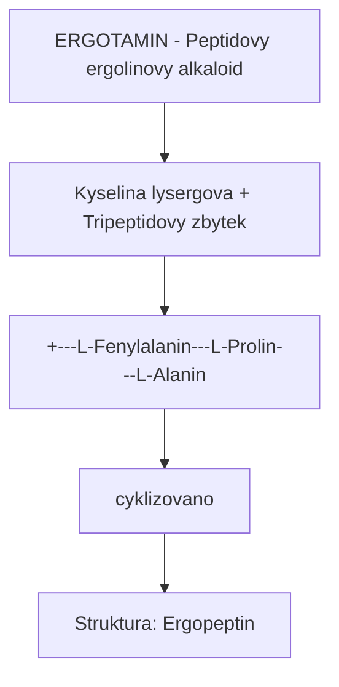
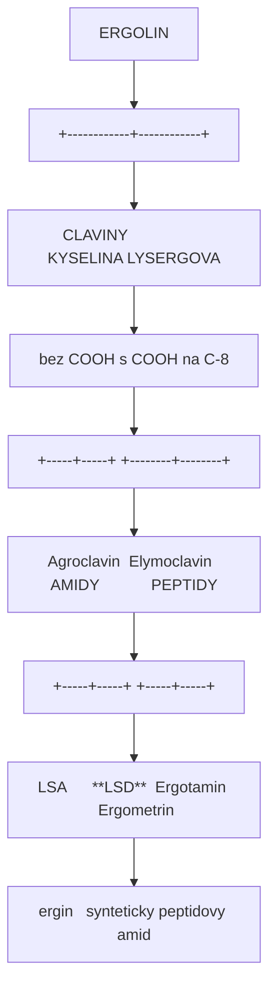

+++
title = "Ergolin"
description = "Ergolinove alkaloidy - tetracyklicka struktura zakladem LSD, LSA a ergotovych alkaloidu"
weight = 3
insert_anchor_links = "right"
[taxonomies]
categories = ["chemie", "alkaloidy", "farmakologie"]
tags = ["ergolin", "lsd", "lsa", "ergot", "namel", "claviceps", "ipomoea", "tetracyklicke-jadro", "indol", "serotonin", "psychedelika"]
+++

# Ergolin - Tetracyklicke jadro psychedelik

**Ergolin** (ergoline) je tetracyklicky organicky skelet, ktery tvofi zaklad sirke skupiny biologicky aktivnich alkaloidu. Tato struktura je spolecnym jmenovatelem pro prirodni **namelove alkaloidy** (Claviceps purpurea), **semenove alkaloidy** (Ipomoea, Argyreia) a synteticke derivaty vcetne [LSD](@/alkaloids/lsd.md) - nejpotentnejsiho znameho psychedelika.

---

## Zakladni informace

| Vlastnost | Hodnota |
|-----------|---------|
| **IUPAC nazev** | 4,6,6a,7,8,9-hexahydroindolo[4,3-fg]quinolin |
| **Alternativni nazvy** | Ergoline, D-Lysergic acid backbone |
| **Molekularni vzorec** | C14H16N2 |
| **Molekularni hmotnost** | 212,29 g/mol |
| **PubChem CID** | 31603 |
| **ChEBI ID** | CHEBI:24785 |
| **Typ struktury** | Tetracyklicky indol |

---

## Chemicka struktura

### Tetracyklicke jadro

Ergolinovy skelet se sklada ze **ctyr kondenzovanych kruhu** oznacenych A, B, C a D:

```
                    ERGOLINOVY SKELET

           Kruh A            Kruh B
        (benzenovy)       (pyrrolovy)
              \              /
               \            /
      [1]-------[2]--------[3]
       |         \        / |
      [12]        \      /  |
       |           [11a]-[4]--- Kruh D
      [11]           |    |   (piperidinovy)
       |            [6a]--[5]
      [10]          / \    |
       |           /   \   |
      [9]--------[8]----[7]-- N-CH3
        \        /
         \      /
        Kruh C
     (cyklohexenovy)

Kompletni system:
- Kruh A: Benzenovy (aromaticky, 6-clenný)
- Kruh B: Pyrrolovy (indolovy, 5-clenný)
- Kruh C: Cyklohexenovy (6-clenný, castecne nasyceny)
- Kruh D: Piperidinovy (6-clenný, nasyceny, s N)
```

### Stereochemie

Ergolinovy skelet obsahuje **dva chiralni centra** (C-5 a C-8/C-10):

| Pozice | Konfigurace | Biologicky vyznam |
|--------|-------------|-------------------|
| **C-5** | R (prirodni) | Aktivni forma |
| **C-8** | R (prirodni) | Aktivni forma |
| **5S, 8S** | - | Neaktivni enantiomer |

```
Prirodni (aktivni) konfigurace:
5R, 8R - "D-serie" nebo "(+)-ergoliny"

Synteticka (neaktivni) konfigurace:
5S, 8S - "L-serie" nebo "(-)-ergoliny"

Epimerizace:
Pri vysokych teplotach nebo v bazickem prostredi
muze dochazet k epimerizaci na C-8, coz vede
ke ztrate biologicke aktivity.
```

### Vztah k indolu a tryptofanu

```
BIOSYNTETICALLY RELATIONSHIP:

Tryptofan (aminokyselina)
         |
         | [Biosynteza v houbách/rostlinách]
         v
    Indolovy skelet
    (kruhy A + B)
         |
         | [Kondenzace s dalšími jednotkami]
         v
    Ergolin
    (kruhy A + B + C + D)
         |
         | [Oxidace, substituce]
         v
    Ergotove alkaloidy
    (LSA, ergotamin, ergometrin...)
         |
         | [Semisyntetická derivatizace]
         v
    [LSD](@/alkaloids/lsd.md)
```

---

## Prirodni zdroje

### Claviceps purpurea (Namel)

**Namel** (Ergot, Secale cornutum) je sklerocium houby *Claviceps purpurea*, ktera parazituje na obilovinach, predevsim na zitu.

| Vlastnost | Hodnota |
|-----------|---------|
| **Latinský nazev** | Claviceps purpurea (Fr.) Tul. |
| **Cesky nazev** | Palickovice nachova, namel |
| **Hostitelska rostlina** | Secale cereale (zito), Triticum (psenice) |
| **Sklerocium** | Tmave zbarvene, rohovite utvary 1-5 cm |
| **Obsah alkaloidu** | 0.15-0.50% susi |

#### Hlavni alkaloidy namele

| Alkaloid | Obsah | Farmakologie |
|----------|-------|--------------|
| **Ergotamin** | 0.02-0.05% | Vazokonstriktor, migrenozum |
| **Ergometrin** | 0.01-0.03% | Uterotonikum |
| **Ergokryptin** | 0.005-0.02% | Dopaminergni |
| **Ergokornin** | Variabilni | Dopaminergni |
| **Ergosin** | Variabilni | Komplex |
| **Kyselina lysergova (LSA)** | 0.01-0.02% | Prekurzor LSD |

#### Biosynteza v namelu

```mermaid
flowchart TD
    node_BIOSYNTEZAERGOLINOVY["BIOSYNTEZA ERGOLINOVYCH ALKALOIDU V CLAVICEPS"]
    node_LTryptofanDimethylal["L-Tryptofan + Dimethylallyl-difosfat DMAPP"]
    node_DMATsyntaza["DMAT syntaza"]
    node_4DimethylallylLtrypt["4-Dimethylallyl-L-tryptofan DMAT"]
    node_NMethyltransferaza["N-Methyltransferaza"]
    node_NMethylDMAT["N-Methyl-DMAT"]
    node_Oxidazecyklazy["Oxidaze, cyklazy"]
    node_ZavenkruhuCaD["Zavření kruhu C a D"]
    node_ChanoclavinI["Chanoclavin-I"]
    node_Izomerace["Izomerace"]
    node_ChanoclavinII["Chanoclavin-II"]
    node_Oxidace["Oxidace"]
    node_Agroclavin["Agroclavin"]
    node_Elymoclavin["Elymoclavin"]
    node_Kyselinapaspalova["Kyselina paspalova"]
    node_KyselinalysergovaLSA["Kyselina lysergova LSA"]
    node_df854632["+----------+----------+"]
    node_ErgotaminErgometrin["Ergotamin            Ergometrin"]
    node_peptidovjednoduch["peptidové          jednoduché"]
    node_alkaloidyamidy["alkaloidy            amidy"]

    node_BIOSYNTEZAERGOLINOVY --> node_LTryptofanDimethylal
    node_LTryptofanDimethylal --> node_DMATsyntaza
    node_DMATsyntaza --> node_4DimethylallylLtrypt
    node_4DimethylallylLtrypt --> node_NMethyltransferaza
    node_NMethyltransferaza --> node_NMethylDMAT
    node_NMethylDMAT --> node_Oxidazecyklazy
    node_Oxidazecyklazy --> node_ZavenkruhuCaD
    node_ZavenkruhuCaD --> node_ChanoclavinI
    node_ChanoclavinI --> node_Izomerace
    node_Izomerace --> node_ChanoclavinII
    node_ChanoclavinII --> node_Oxidace
    node_Oxidace --> node_Agroclavin
    node_Agroclavin --> node_Elymoclavin
    node_Elymoclavin --> node_Kyselinapaspalova
    node_Kyselinapaspalova --> node_KyselinalysergovaLSA
    node_KyselinalysergovaLSA --> node_df854632
    node_df854632 --> node_ErgotaminErgometrin
    node_ErgotaminErgometrin --> node_peptidovjednoduch
    node_peptidovjednoduch --> node_alkaloidyamidy
```



<details>
<summary>ASCII verze diagramu</summary>

```
BIOSYNTEZA ERGOLINOVYCH ALKALOIDU V CLAVICEPS

L-Tryptofan + Dimethylallyl-difosfat (DMAPP)
                    |
                    | [DMAT syntaza]
                    v
        4-Dimethylallyl-L-tryptofan (DMAT)
                    |
                    | [N-Methyltransferaza]
                    v
            N-Methyl-DMAT
                    |
                    | [Oxidaze, cyklazy]
                    | [Zavření kruhu C a D]
                    v
              Chanoclavin-I
                    |
                    | [Izomerace]
                    v
              Chanoclavin-II
                    |
                    | [Oxidace]
                    v
               Agroclavin
                    |
                    | [Oxidace]
                    v
              Elymoclavin
                    |
                    | [Oxidace]
                    v
           Kyselina paspalova
                    |
                    | [Izomerace]
                    v
           Kyselina lysergova (LSA)
                    |
         +----------+----------+
         |                     |
         v                     v
    Ergotamin            Ergometrin
    (peptidové)          (jednoduché
    alkaloidy            amidy)
```

</details>

### Ipomoea (Povijnice)

Rostliny rodu *Ipomoea* (Convolvulaceae) obsahuji ergolinove alkaloidy v semenech.

| Druh | Cesky nazev | Obsah LSA | Dalsi alkaloidy |
|------|-------------|-----------|-----------------|
| **Ipomoea tricolor** | Povijnice trojbarvá | 0.02-0.06% | Ergin, isoergin |
| **Ipomoea violacea** | Povijnice fialova | 0.02-0.05% | Ergin |
| **Ipomoea purpurea** | Povijnice nachova | 0.01-0.03% | Ergin |
| **Ipomoea corymbosa** | Ololiuqui | 0.01-0.03% | Ergin, lysergol |

#### Tradicni vyuziti

| Kultura | Nazev | Pouziti |
|---------|-------|---------|
| **Aztekove** | Tlitlitzin | Veštecke ritualy |
| **Mazatekove** | Ololiuqui | Lecive obrady |
| **Mixtekove** | Badoh negro | Divinace |

### Argyreia nervosa (Havajska ruze)

| Vlastnost | Hodnota |
|-----------|---------|
| **Latinský nazev** | Argyreia nervosa (Burm.f.) Bojer |
| **Anglicky nazev** | Hawaiian Baby Woodrose |
| **Puvod** | Indie, naturalizovana v tropech |
| **Obsah LSA** | 0.1-0.3% v semenech |
| **Davka** | 4-8 semen (rizikove!) |

**Pozor**: Semena obsahuji take toxicke glykosidy, ktere zpusobuji silnou nauseu a vazokonstrikcni vedlejsi ucinky.

### Dalsi zdroje

| Organismus | Alkaloidy | Poznamka |
|------------|-----------|----------|
| **Claviceps paspali** | Paspalove alkaloidy | Na travach |
| **Claviceps fusiformis** | Agroclavin | Afrika, Indie |
| **Penicillium** | Fumigaclavin | Vzacne |
| **Aspergillus fumigatus** | Festuclavin | Endofyticky |
| **Rivea corymbosa** | LSA, LSH | Stredni Amerika |

---

## Hlavni ergolinove alkaloidy

### Kyselina lysergova (LSA, Ergin)

| Vlastnost | Hodnota |
|-----------|---------|
| **IUPAC** | (8beta)-9,10-didehydro-6-methylergoline-8-carboxylic acid |
| **Vzorec** | C16H16N2O2 |
| **Hmotnost** | 268.31 g/mol |
| **CAS** | 82-58-6 |
| **Psychoaktivita** | ~10% potence LSD |
| **Trvani** | 4-8 hodin |

```
              KYSELINA LYSERGOVA

                    O
                    ||
                    C-OH
                    |
              [9]---C---H
             /           \
           [8]            [10]
            |     N-CH3    |
           [7]----[6a]----[4]
            |       |       |
           [6]     [5]     [3]
            \       |      /
             \     [4a]   /
              \     |    /
               [11]-[11a]
                 \   |
                  \ /
                  [2]
                   |
                  N-H
                   |
                  [1]
                   |
                  [12]

Rozdil od LSD: -COOH misto -CON(C2H5)2
```

### LSD (Diethylamid kyseliny lysergove)

Viz podrobny clanek: [LSD](@/alkaloids/lsd.md)

| Vlastnost | Hodnota |
|-----------|---------|
| **Vzorec** | C20H25N3O |
| **Hmotnost** | 323.43 g/mol |
| **CAS** | 50-37-3 |
| **Psychoaktivita** | Reference (100%) |
| **Typicka davka** | 50-200 ug |
| **Trvani** | 8-12 hodin |

### Ergotamin

| Vlastnost | Hodnota |
|-----------|---------|
| **Vzorec** | C33H35N5O5 |
| **Hmotnost** | 581.66 g/mol |
| **CAS** | 113-15-5 |
| **Trida** | Peptidovy alkaloid |
| **Klinicke pouziti** | Migrenozum (historicky) |



<details>
<summary>ASCII verze diagramu</summary>

```
ERGOTAMIN - Peptidovy ergolinovy alkaloid

Kyselina lysergova + Tripeptidovy zbytek
        |
        +---[L-Fenylalanin]---[L-Prolin]---[L-Alanin]
                              (cyklizovano)

Struktura: Ergopeptin
- Ergolinove jadro
- Cyklol (laktam)
- Aminokyseliny
```

</details>

### Ergometrin (Ergonovin)

| Vlastnost | Hodnota |
|-----------|---------|
| **Vzorec** | C19H23N3O2 |
| **Hmotnost** | 325.41 g/mol |
| **CAS** | 60-79-7 |
| **Trida** | Jednoduchy amid |
| **Klinicke pouziti** | Uterotonikum (poporodní krvaceni) |

### Prehled strukturnich vztahu



<details>
<summary>ASCII verze diagramu</summary>

```
                    ERGOLIN
                       |
          +------------+------------+
          |                         |
    CLAVINY                  KYSELINA LYSERGOVA
    (bez COOH)                (s COOH na C-8)
          |                         |
    +-----+-----+          +--------+--------+
    |           |          |                 |
Agroclavin  Elymoclavin  AMIDY            PEPTIDY
                           |                 |
                     +-----+-----+     +-----+-----+
                     |           |     |           |
                   LSA      **LSD**  Ergotamin  Ergometrin
                (ergin)   (synteticky) (peptidovy) (amid)
```

</details>

---

## Farmakologie

### Receptorovy profil ergolinovych alkaloidu

| Receptor | LSA | LSD | Ergotamin | Ergometrin |
|----------|-----|-----|-----------|------------|
| **5-HT2A** | ++ | +++ | + | + |
| **5-HT2B** | + | ++ | ++ | ++ |
| **5-HT2C** | ++ | +++ | + | + |
| **5-HT1A** | + | ++ | + | + |
| **D1** | - | + | + | + |
| **D2** | + | ++ | ++ | + |
| **alfa-adrenergni** | + | + | +++ | + |
| **5-HT1D** | - | + | +++ | + |

**Legenda**: +++ silna aktivita, ++ stredni, + slaba, - zadna

### Mechanismus psychedelickeho ucinku

```mermaid
flowchart TD
    node_PSYCHEDELICKEERGOLIN["PSYCHEDELICKE ERGOLINY LSD, LSA"]
    node_Ergolin["Ergolin"]
    node_0cb77c9d["+--------+--------+"]
    node_5HT2AreceptorDopamin["5-HT2A receptor  Dopaminove rec."]
    node_Gq11proteinModulaceo["Gq/11 protein     Modulace odmeny"]
    node_FosfolipazaC["Fosfolipaza C"]
    node_4f76f3cc["+------+------+"]
    node_IP3DAG["IP3          DAG"]
    node_Ca2zERPKCaktivace["Ca2+ z ER    PKC aktivace"]
    node_CaMKIIERK12fosforyla["CaMKII    ERK1/2 fosforylace"]
    node_CREB["CREB"]
    node_ddb739e1["+------------------+"]
    node_Genovaexprese["Genova exprese:"]
    node_BDNF["- BDNF"]
    node_Arc["- Arc"]
    node_cFos["- c-Fos"]
    node_NEUROPLASTICITA["NEUROPLASTICITA"]
    node_Psychedelicky["+ Psychedelicky"]
    node_zazitek["zazitek"]

    node_PSYCHEDELICKEERGOLIN --> node_Ergolin
    node_Ergolin --> node_0cb77c9d
    node_0cb77c9d --> node_5HT2AreceptorDopamin
    node_5HT2AreceptorDopamin --> node_Gq11proteinModulaceo
    node_Gq11proteinModulaceo --> node_FosfolipazaC
    node_FosfolipazaC --> node_4f76f3cc
    node_4f76f3cc --> node_IP3DAG
    node_IP3DAG --> node_Ca2zERPKCaktivace
    node_Ca2zERPKCaktivace --> node_CaMKIIERK12fosforyla
    node_CaMKIIERK12fosforyla --> node_CREB
    node_CREB --> node_ddb739e1
    node_ddb739e1 --> node_Genovaexprese
    node_Genovaexprese --> node_BDNF
    node_BDNF --> node_Arc
    node_Arc --> node_cFos
    node_cFos --> node_NEUROPLASTICITA
    node_NEUROPLASTICITA --> node_Psychedelicky
    node_Psychedelicky --> node_zazitek

    click node_PSYCHEDELICKEERGOLIN "/alkaloids/lsd/" "PSYCHEDELICKE ERGOLINY LSD, LSA"
    click node_5HT2AreceptorDopamin "/receptors/5-ht2a/" "5-HT2A receptor  Dopaminove rec."
```



<details>
<summary>ASCII verze diagramu</summary>

```
PSYCHEDELICKE ERGOLINY (LSD, LSA)

                    Ergolin
                       |
                       v
              +--------+--------+
              |                 |
        [5-HT2A receptor]  [Dopaminove rec.]
              |                 |
              v                 v
         Gq/11 protein     Modulace odmeny
              |
              v
         Fosfolipaza C
              |
       +------+------+
       |             |
      IP3          DAG
       |             |
       v             v
    Ca2+ z ER    PKC aktivace
       |             |
       v             v
    CaMKII    ERK1/2 fosforylace
       |             |
       +------+------+
              |
              v
           CREB
              |
              v
    +------------------+
    | Genova exprese:  |
    | - BDNF           |
    | - Arc            |
    | - c-Fos          |
    +------------------+
              |
              v
    +------------------+
    | NEUROPLASTICITA  |
    | + Psychedelicky  |
    |   zazitek        |
    +------------------+
```

</details>

### Vazoaktivni ucinky

Ergoliny (zejmena ergotamin, ergometrin) pusobi jako **mocne vazokonstriktory**:

| Mechanismus | Receptor | Ucinek |
|-------------|----------|--------|
| Primární | 5-HT2B, alfa-1 | Vazokonstrikce |
| Sekundarni | 5-HT1D | Inhibice CGRP uvolneni |
| Tercialni | D2 | Modulace cevniho tonu |

**Klinicke dusledky**:
- Ergotismus pri chronicke expozici
- Terapeuticke vyuziti u migren (historicky)
- Riziko ischemie pri predavkovani

### Uterotonicke ucinky

Ergometrin a methylergometrin pusobi na hladkou svalovinu delohy:

```
Ergometrin --> alfa-adrenergni rec. --> Kontrakce myometria
          --> 5-HT receptory        --> Zesileni kontrakci
          --> D2 receptory          --> Modulace

Klinicke pouziti:
- Prevence postpartalnich krvaceni
- Indukce porodu (historicky)
- Lecba deložní atonie
```

### Dopaminergni ucinky

Nektera ergoliny jsou pouzivana jako **dopaminovi agoniste**:

| Lecivo | Indikace | Mechanismus |
|--------|----------|-------------|
| **Bromokriptin** | Parkinsonova choroba, hyperprolaktinemie | D2 agonista |
| **Kabergolin** | Hyperprolaktinemie, Parkinsonismus | D2 agonista |
| **Pergolid** | Parkinsonova choroba | D1/D2 agonista |
| **Lisurid** | Parkinsonova choroba | D2 agonista |

---

## Toxikologie

### Ergotismus ("Ohen sv. Antonina")

Historicka otrava namelem z kontaminovane mouky:

| Forma | Symptomy | Mechanismus |
|-------|----------|-------------|
| **Konvulzivni** | Zauchvaty, halucinace, psychoza | CNS toxicita |
| **Gangrenozni** | Palisiva bolest, nekroza, gangréna | Vazokonstrikce |

```
EPIDEMIOLOGIE ERGOTISMU

Stredovek (500-1500 n.l.):
- Epidemie v Evrope
- "Ignis sacer" (svaty ohen)
- Tisíce mrtvych

Priklady epidemií:
- 944-945: Francie, 40 000 obeti
- 1039: Francie, Limoges
- 1089: Francie, Flandry
- 1128: Francie, Pariz
- 1722: Rusko, Petrohrad

Pricina:
- Kontaminace zitne mouky sklerocii Claviceps purpurea
- Nedostatek potravin vedl k jidení kontaminovanych obilovin
```

### Soucasna toxicita

| Riziko | Pricina | Prevence |
|--------|---------|----------|
| **Vazokonstrikce** | Nadmerne davky ergotaminu | Dodrzovat davkovani |
| **Serotonin syndrom** | Kombinace s SSRI | Nekombinovat |
| **5-HT2B kardiotoxicita** | Chronicke pouzivani | Obezretnost |
| **Psychoza** | Vysoké davky psychedelik | Set & setting |

### Kontraindikace

| Absolutni | Relativni |
|-----------|-----------|
| Tehotenstvi | Kardiovaskularni onemocneni |
| Periferni cevni choroby | Hypertenze |
| MAOI v poslednich 2 tydnech | SSRI (snizeny ucinek) |
| Sepse, sok | Jaterni poruchy |
| Basilární migréna | Ledvinne poruchy |

---

## Srovnani ergolinovych alkaloidu

### Strukturni srovnani

| Alkaloid | R1 (C-8) | R2 (N-1) | Potence |
|----------|----------|----------|---------|
| **Ergolin** (zaklad) | H | H | - |
| **LSA** | COOH | H | 10% |
| **Iso-LSA** | COOH (epimer) | H | <1% |
| **LSD** | CON(Et)2 | H | 100% |
| **Ergotamin** | Peptid | H | - |
| **Ergometrin** | CONHCH(CH3)CH2OH | H | - |
| **1P-LSD** | CON(Et)2 | CO-CH2CH3 | ~100%* |
| **ALD-52** | CON(Et)2 | CO-CH3 | ~100%* |

*Prodrugs, konvertuji na LSD in vivo

### Farmakokinetické srovnani

| Alkaloid | Tmax | T1/2 | Trvani ucinku | Bioavailabilita (p.o.) |
|----------|------|------|---------------|------------------------|
| **LSA** | 1-2 h | 2-4 h | 4-8 h | ~50% |
| **LSD** | 1.5-2.5 h | 3-5 h | 8-12 h | ~70% |
| **Ergotamin** | 2-3 h | 2-3 h | 6-8 h | <5% (sublingualni lepsí) |
| **Ergometrin** | 0.5-1 h | 1-2 h | 3-4 h | ~60% |

---

## Analyticka chemie

### Detekční metody

| Metoda | Citlivost | Pouziti |
|--------|-----------|---------|
| **Ehrlichuv test** | mg | Field test (purpurová barva) |
| **UV-Vis** | ug/mL | Identifikace, kvantifikace |
| **Fluorescence** | ng/mL | Citliva detekce |
| **HPLC-UV** | ng/mL | Separace, kvantifikace |
| **LC-MS/MS** | pg/mL | Konfirmace, metabolity |
| **GC-MS** | ng/mL | Alternativa |

### Ehrlichuv test

```
EHRLICHUV TEST PRO INDOLY

Reagent: p-dimethylaminobenzaldehyd (p-DMAB) v HCl

Reakce:
Indol + p-DMAB --> Fialovy/purpurovy komplex

Interpretace:
- LSD: Purpurova
- LSA: Purpurova
- Psilocybin: Purpurova
- DMT: Purpurova
- NBOMes: ZADNA reakce!

Pozor: Test není specificky - pouze potvrzuje pritomnost indolu.
```

### Hofmannuv test

```
HOFMANNUV TEST (doplnek k Ehrlichovi)

Reagent: Hofmannuv reagent

Vysledky:
- LSD: Modra
- DMT: Zluta/oranzova
- Psilocybin: Modro-zelena

Kombinace Ehrlich + Hofmann = spolehlivejsi identifikace
```

---

## Pravni status

### Ergoliny podle legalniho statusu

| Latka | CR | EU | USA | UN |
|-------|-----|-----|-----|-----|
| **LSD** | Zakazano | Zakazano | Schedule I | Schedule I |
| **LSA** | Neregulovaná* | Variabilni | Neregulovaná* | - |
| **Ergotamin** | Prekurzor | Prekurzor | List I | Table I |
| **Ergometrin** | Lék/prekurzor | Lék | List I | Table I |
| **1P-LSD** | Sede zona | Variabilni | Potencialne | - |

*LSA sama o sobe neni regulovana, ale rostliny/semena mohou byt

### Ceska republika

| Latka | Pravni status | Legislativa |
|-------|---------------|-------------|
| **LSD** | Zakazana latka | NV 463/2013 Sb., Tab. 1 |
| **Ergotamin** | Prekurzor | Zakon 272/2013 Sb. |
| **Ergometrin** | Lécivo/prekurzor | Zakon 378/2007 Sb. |
| **Semena Ipomoea** | Legalni k prodeji | - |
| **Semena Argyreia** | Legalni k prodeji | - |

---

## Historie

### Stredovek

| Obdobi | Udalost |
|--------|---------|
| **500-1500** | Epidemie ergotismu v Evrope |
| **1095** | Zalozeni Radu sv. Antonina (lecba ergotismu) |
| **1670** | Prvni popis namele jako priciny |

### Moderna era

| Rok | Udalost | Vyznam |
|-----|---------|--------|
| **1918** | Arthur Stoll izoluje ergotamin | Zaklad vyzkumu |
| **1935** | Sandoz zacina systematicky vyzkum | Farmaceuticky prumysl |
| **1938** | Albert Hofmann syntetizuje LSD-25 | Objev LSD |
| **1943** | Hofmann objevi psychedelicke ucinky | Bicycle Day |
| **1947** | Uvedeni Delysidu na trh | Psychiatricky nastroj |
| **1950s** | Rozsiřeni vyzkumu | 1000+ publikaci |
| **1960s** | Counterculture, Leary | Popularizace |
| **1970** | Zakaz LSD v USA | Konec prvni ery |
| **2000s+** | Renesance vyzkumu | Nova era |

---

## Biotechnologie

### Biosynteza v modifikovanych organismech

```
METABOLICKE INZENYRSTVI

Cilovy organismus: Saccharomyces cerevisiae (kvasinky)

Postup:
1. Vneseni genu z Claviceps purpurea:
   - dmaW (DMAT syntaza)
   - easF, easE, easC (cyklazy)
   - cloA (oxidaza)

2. Optimalizace metabolickych drah:
   - Zvyseni produkce tryptofanu
   - Eliminace kompetitivnich drah

3. Fermentacni produkce:
   - Kyselina lysergova jako mezirodukt
   - Potencialne dalsí derivatizace

Status: Experimentalni, zatim ne komercni
```

### Enzymaticka synteza

```
IN VITRO ENZYMOVA SYNTEZA

Kyselina lysergova + Diethylamin
            |
            | [LSD syntaza nebo chemická kondenzace]
            v
          LSD

Vyhody:
- Cistsi produkt
- Mene vedlejsich reakci
- Kontrolovane podminky

Nevyhody:
- Enzymova nestabilita
- Vysoke náklady
- Regulacni prekazky
```

---

## Reference

### Primární literatura

1. Hofmann, A. (1964). *Die Mutterkornalkaloide*. Ferdinand Enke Verlag.
2. Hofmann, A. (1979). *LSD: My Problem Child*. McGraw-Hill.
3. Schiff, P.L. (2006). *Ergot and its alkaloids*. American Journal of Pharmaceutical Education, 70(5), 98.
4. Giger, R. & Engel, C.K. (2006). *The Alkaloids: Chemistry and Biology*. Academic Press.
5. Tudzynski, P. et al. (2001). *Biotechnology and biology of ergot alkaloids*. Applied Microbiology and Biotechnology, 57(5-6), 593-605.

### Historicke prameny

6. Barger, G. (1931). *Ergot and Ergotism*. Gurney and Jackson.
7. Lee, M.R. (2009). *The history of ergot of rye (Claviceps purpurea)*. Journal of the Royal College of Physicians of Edinburgh, 39(2), 179-184.
8. Caporael, L.R. (1976). *Ergotism: the Satan loosed in Salem?*. Science, 192(4234), 21-26.

### Soucasny vyzkum

9. Nichols, D.E. (2016). *Psychedelics*. Pharmacological Reviews, 68(2), 264-355.
10. Wallwey, C. & Li, S.M. (2011). *Ergot alkaloids: structure diversity, biosynthetic gene clusters and functional proof of biosynthetic genes*. Natural Product Reports, 28(3), 496-510.

---

## Viz take

### Specificke alkaloidy

- [LSD](@/alkaloids/lsd.md) - Nejpotentnejsi ergolinove psychedelikum
- [Psilocybin](@/alkaloids/psilocybin.md) - Tryptaminove psychedelikum (odlisna struktura)
- [DMT](@/alkaloids/dmt.md) - Jednoduchy tryptamin

### Receptory

- [5-HT2A receptor](@/receptors/5-ht2a.md) - Primarni cil psychedelik
- [Receptor](@/glossary/receptor.md) - Obecny pojem

### Neuroveda

- [GABA](@/glossary/gaba.md) - Inhibicni neurotransmiter
- [Nukleotid](@/glossary/nukleotid.md) - Signalni molekuly

### Zdroje

- [Psilocybe houby](@/shrooms/psilocybes/_index.md) - Alternativni zdroj psychedelik

---

*Tato stranka slouzi pouze pro edukacni ucely. Mnohe ergolinove alkaloidy jsou regulovane latky. Vsechny informace jsou zalozeny na vedecke literature.*

---

<- Zpet na [Glosar](@/glossary/_index.md) | [LSD](@/alkaloids/lsd.md) | [Receptor](@/glossary/receptor.md) ->
