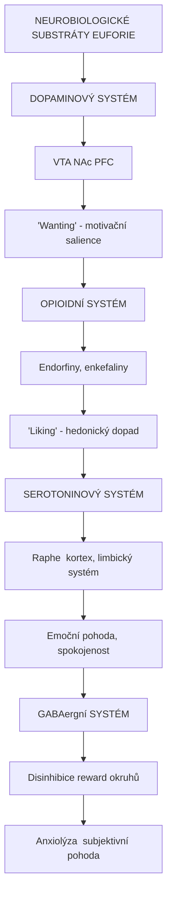
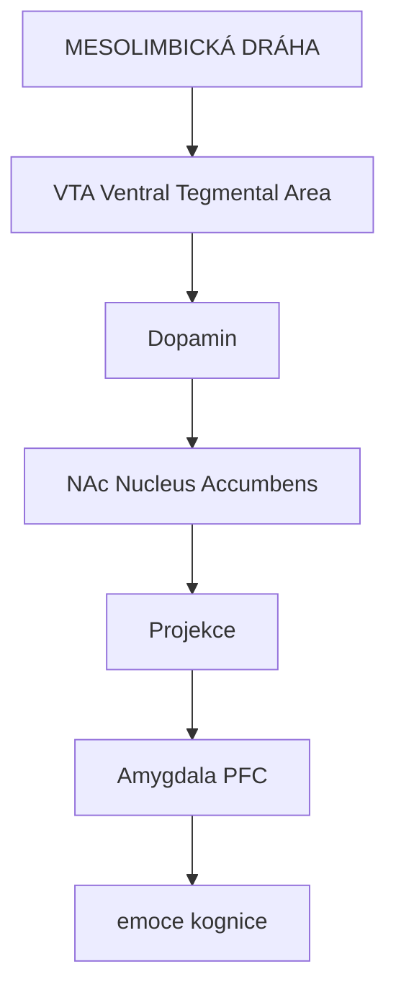
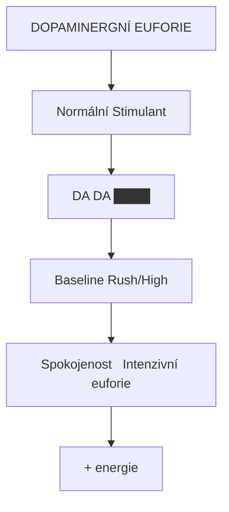
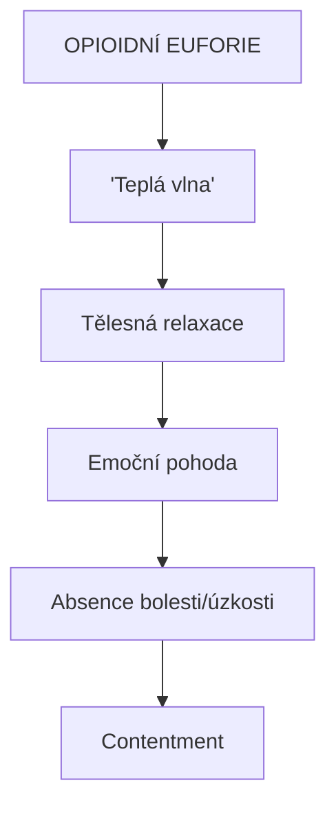
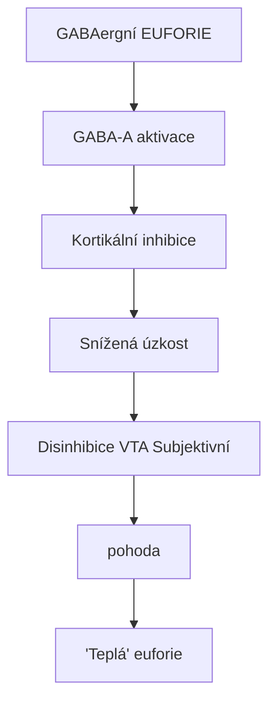
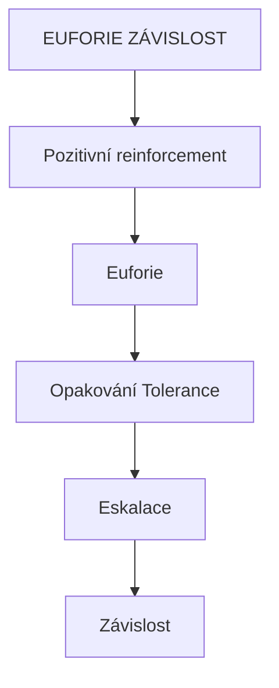

+++
title = "Euforie"
description = "Euforie - stav intenzivního štěstí a pohody, neurobiologie, typy euforie u různých psychoaktivních látek, dopaminergní vs serotoninové vs GABAergní mechanismy"
weight = 10
insert_anchor_links = "right"

[taxonomies]
categories = ["psychologie", "neurobiologie", "fenomenologie"]
tags = ["euforie", "dopamin", "serotonin", "GABA", "reward", "endorfiny", "štěstí"]
+++

# Euforie

**Euforie** (z řeckého *eu* = dobře + *pherein* = nést) je stav intenzivního **štěstí**, **pohody** a **spokojenosti**, často doprovázený pocity energie, sebedůvěry a optimismu. Je klíčovým účinkem mnoha psychoaktivních látek.

---

## Neurobiologie euforie

### Hlavní systémy



<details>
<summary>ASCII verze diagramu</summary>

```
NEUROBIOLOGICKÉ SUBSTRÁTY EUFORIE

┌─────────────────────────────────────────────┐
│                                             │
│  DOPAMINOVÝ SYSTÉM                          │
│  VTA → NAc → PFC                            │
│  "Wanting" - motivační salience             │
│                                             │
├─────────────────────────────────────────────┤
│                                             │
│  OPIOIDNÍ SYSTÉM                            │
│  Endorfiny, enkefaliny                      │
│  "Liking" - hedonický dopad                 │
│                                             │
├─────────────────────────────────────────────┤
│                                             │
│  SEROTONINOVÝ SYSTÉM                        │
│  Raphe → kortex, limbický systém            │
│  Emoční pohoda, spokojenost                 │
│                                             │
├─────────────────────────────────────────────┤
│                                             │
│  GABAergní SYSTÉM                           │
│  Disinhibice reward okruhů                  │
│  Anxiolýza → subjektivní pohoda             │
│                                             │
└─────────────────────────────────────────────┘
```

</details>

### Reward circuit



<details>
<summary>ASCII verze diagramu</summary>

```
MESOLIMBICKÁ DRÁHA

VTA (Ventral Tegmental Area)
         |
         | Dopamin
         ↓
NAc (Nucleus Accumbens)
         |
         | Projekce
         ↓
   ┌─────┴─────┐
   ↓           ↓
Amygdala    PFC
(emoce)   (kognice)
```

</details>

---

## Typy euforie

### Dopaminergní euforie

**Mechanismus**: Zvýšení dopaminu v NAc

| Charakteristika | Popis |
|-----------------|-------|
| **Kvalita** | Energická, stimulující |
| **"Rush"** | Intenzivní nástup |
| **Motivace** | Zvýšená, goal-directed |
| **Typické látky** | Kokain, amfetaminy, metamfetamin |



<details>
<summary>ASCII verze diagramu</summary>

```
DOPAMINERGNÍ EUFORIE

Normální      Stimulant
    |             |
  DA ──        DA ████
    |             |
Baseline      Rush/High
    |             |
Spokojenost   Intenzivní euforie
                + energie
```

</details>

### Opioidní euforie

**Mechanismus**: Aktivace μ-opioidních receptorů

| Charakteristika | Popis |
|-----------------|-------|
| **Kvalita** | Teplá, "objímající" |
| **Tělesná** | Výrazná tělesná složka |
| **Anxiolýza** | Silná |
| **Typické látky** | Heroin, morfin, oxykodon |



<details>
<summary>ASCII verze diagramu</summary>

```
OPIOIDNÍ EUFORIE

"Teplá vlna"
    ↓
Tělesná relaxace
    ↓
Emoční pohoda
    ↓
Absence bolesti/úzkosti
    ↓
Contentment
```

</details>

### Serotoninová euforie

**Mechanismus**: 5-HT uvolnění nebo [5-HT2A](@/receptors/5-ht2a.md) aktivace

| Charakteristika | Popis |
|-----------------|-------|
| **Kvalita** | Empatická, expansivní |
| **Spojení** | Pocit spojení s ostatními |
| **Insight** | Kognitivní clarity |
| **Typické látky** | [MDMA](@/alkaloids/mdma.md), [psilocybin](@/alkaloids/psilocybin.md), [LSD](@/alkaloids/lsd.md) |

### GABAergní euforie

**Mechanismus**: Disinhibice reward okruhů, anxiolýza

| Charakteristika | Popis |
|-----------------|-------|
| **Kvalita** | Klidná, relaxovaná |
| **Anxiolýza** | Výrazná |
| **Tělesná** | Svalová relaxace |



<details>
<summary>ASCII verze diagramu</summary>

```
GABAergní EUFORIE

GABA-A aktivace
      ↓
Kortikální inhibice
      ↓
Snížená úzkost ────────────┐
      |                    |
      ↓                    ↓
Disinhibice VTA     Subjektivní
      |              pohoda
      ↓
"Teplá" euforie
```

</details>

---

## Srovnání typů euforie

| Aspekt | Dopaminergní | Opioidní | Serotoninová | GABAergní |
|--------|--------------|----------|--------------|-----------|
| **Energie** | Vysoká | Nízká | Střední | Nízká |
| **Tělesná kvalita** | Stimulace | Teplo, relaxace | Variabilní | Relaxace |
| **Kognitivní efekt** | Fokus | Zamlžení | Expanze | Zamlžení |
| **Sociální** | Variabilní | Izolace | Empatie | Disinhibice |
| **Závislostní potenciál** | Velmi vysoký | Velmi vysoký | Nízký | Střední |
| **Tolerance** | Rychlá | Velmi rychlá | Pomalá | Rychlá |

---

## Euforie u konkrétních látek

### Klasická psychedelika

| Látka | Typ euforie | Poznámka |
|-------|-------------|----------|
| **[Psilocybin](@/alkaloids/psilocybin.md)** | Serotoninová + mystická | Podmíněná set/setting |
| **[LSD](@/alkaloids/lsd.md)** | Serotoninová | Intenzivní, dlouhá |
| **[DMT](@/alkaloids/dmt.md)** | Serotoninová | Breakthrough = extáze |

### GABAergika

| Látka | Charakteristika |
|-------|-----------------|
| **Alkohol** | Disinhibiční, sociální |
| **GHB** | Podobná MDMA při nízkých dávkách |

### Stimulanty

| Látka | Charakteristika |
|-------|-----------------|
| **Kokain** | Intenzivní rush, krátký |
| **Amfetamin** | Delší, energická |
| **MDMA** | Kombinace DA + 5-HT, empatogenní |

---

## Klinický a terapeutický kontext

### Euforie v terapii

| Kontext | Role euforie |
|---------|--------------|
| **Psychedelická terapie** | Mystická extáze koreluje s terapeutickým výsledkem |
| **Palliativní péče** | Legitimní cíl (MDMA, psilocybin) |
| **Anestezie** | Vedlejší efekt ketaminu |

### Euforie a závislost



<details>
<summary>ASCII verze diagramu</summary>

```
EUFORIE → ZÁVISLOST

Pozitivní reinforcement
        |
    Euforie ────────────┐
        |               |
   Opakování          Tolerance
        |               |
   Eskalace ←──────────┘
        |
   Závislost
```

</details>

| Faktor | Vliv na závislostní potenciál |
|--------|-------------------------------|
| **Intenzita euforie** | Vyšší = vyšší riziko |
| **Rychlost nástupu** | Rychlejší = vyšší riziko |
| **Trvání** | Kratší = více opakování |
| **Tolerance** | Rychlá = eskalace |

---

## Viz také

### Neurotransmitery
- [Dopamin](@/glossary/dopamin.md) - Reward, motivace
- [Serotonin](@/glossary/serotonin.md) - Emoční pohoda
- [GABA](@/glossary/gaba.md) - Anxiolýza

### Látky
- [Psilocybin](@/alkaloids/psilocybin.md) - Mystická extáze
- [MDMA](@/alkaloids/mdma.md) - Entaktogenní euforie

### Mozkové struktury
- [Amygdala](@/brain/amygdala.md) - Emoční zpracování
- [Prefrontální kortex](@/brain/prefrontal-cortex.md) - Kognitivní aspekty

### Související
- [Mystické zážitky](@/phenomenology/mystical-experiences.md) - Transcendentní euforie
- [Závislosti](@/conditions/addiction.md) - Patologická euforie

---

← Zpět na [Glosář](@/glossary/_index.md)
