+++
title = "Farmakokinetika"
description = "Komplexni pruvodce farmakokinetikou - osud leciv a psychoaktivnich latek v organismu, ADME procesy, biodostupnost, polocas rozpadu a lekove interakce"
date = 2026-01-30
updated = 2026-01-30
draft = false

[taxonomies]
categories = ["farmakologie", "neurofarmakologie"]
tags = ["farmakokinetika", "ADME", "biodostupnost", "polocas", "CYP450", "metabolismus", "psychedelika", "lekove-interakce"]

[extra]
lead = "Farmakokinetika studuje osud leciv v organismu - absorpci, distribuci, metabolismus a exkreci. Pochopeni techto procesu je klicove pro bezpecne a efektivni pouzivani psychoaktivnich latek."
complexity = "pokrocila"
reading_time = "35 min"
+++

# Farmakokinetika

**Farmakokinetika** (z reckeho *pharmakon* = lek a *kinetikos* = pohyb) je vedni disciplina studujici **osud leciv a latek v zivem organismu**. Zatimco farmakodynamika zkouma, co latka dela telu (mechanismus ucinku), farmakokinetika zkouma, co telo dela latce. Znalost farmakokinetickych principu je nezbytna pro pochopeni ucinku psychoaktivnich latek vcetne [psychedelik](@/alkaloids/_index.md), disociativ a GABAergik.

---

## Zakladni principy

### Definice a vyznam

Farmakokinetika popisuje **casovy prubeh koncentrace latky** v ruznych castech organismu. Klicove otazky, ktere farmakokinetika zodpovida:

| Otazka | Farmakokineticky parametr |
|--------|---------------------------|
| Jak rychle se latka vstrebava? | Rychlost absorpce, Tmax |
| Kolik latky se dostane do krve? | Biodostupnost (F) |
| Jak vysoke koncentrace latka dosahne? | Cmax |
| Jak dlouho ucinek trva? | Polocas (T1/2) |
| Kde se latka v tele hromadi? | Objem distribuce (Vd) |
| Jak se latka odstrannuje? | Clearance (CL) |

### Historicky kontext

Farmakokinetika se vyvinula v 20. stoleti s rozvojem analytickych metod. Klinici si uvedomili, ze ucinnost leciv zalezi nejen na jejich farmakodynamickych vlastnostech, ale take na tom, jak telo s latkou nakláda. Torsten Teorell v roce 1937 publikoval prvni matematicky model farmakokinetiky, ktery polozil zaklady moderni discipline.

---

## ADME - Ctyr zakladni procesy

Farmakokinetiku lze shrnout do ctyr hlavnich procesu oznacovanych zkratkou **ADME**:

```
ADME PROCESY

   ABSORPCE (A)          DISTRIBUCE (D)        METABOLISMUS (M)       EXKRECE (E)
        |                      |                      |                    |
        v                      v                      v                    v
   Vstrebani           Rozdeleni              Biotransformace        Vyloučeni
   do krve             v organismu            (premena)              z organismu
        |                      |                      |                    |
        v                      v                      v                    v
   GIT, plice,         Krev → tkane           Jatra (CYP450)         Ledviny
   kuze, sliznice      Vazba na proteiny      Strevni stena          Zluc, plice
                       Prostup BBB            Plazma                 Pot, sliny
```

### Casova posloupnost

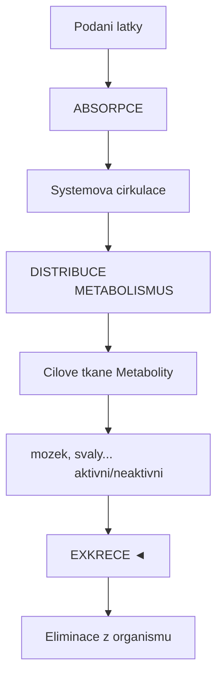

<details>
<summary>ASCII verze diagramu</summary>

```
Podani latky
     |
     v
[ABSORPCE] ────────────────────────────────────────────────────┐
     |                                                          |
     v                                                          |
Systemova cirkulace                                             |
     |                                                          |
     ├──────────────────────────────────────────────┐           |
     |                                              |           |
     v                                              v           |
[DISTRIBUCE]                                [METABOLISMUS]      |
     |                                              |           |
     v                                              v           |
Cilove tkane                                Metabolity          |
(mozek, svaly...)                           (aktivni/neaktivni) |
     |                                              |           |
     └──────────────────────────────────────────────┘           |
                             |                                  |
                             v                                  |
                       [EXKRECE] ◄──────────────────────────────┘
                             |
                             v
                    Eliminace z organismu
```

</details>

---

## Absorpce (Vstrebavani)

### Definice

**Absorpce** je proces, kterym latka prechazi z mista podani do systemove cirkulace (krevniho obehu). Rychlost a rozsah absorpce urcuji, jak rychle nastoupi ucinek a jak silny bude.

### Zpusoby podani a absorpce

| Cesta podani | Misto absorpce | Rychlost | Biodostupnost | Priklady |
|--------------|----------------|----------|---------------|----------|
| **Peroralni (p.o.)** | Tenke strevo | Stredni | 5-100% | Psilocybin, MDMA |
| **Sublingualni** | Ustnl sliznice | Rychla | 20-50% | LSD blottery |
| **Inhalacni** | Plicni alveoly | Velmi rychla | 10-50% | DMT (vapovani), kanabis |
| **Intranazalni** | Nosni sliznice | Rychla | 25-50% | Ketamin, 2C-B |
| **Rektalni** | Rektalni sliznice | Rychla | 30-80% | Nektera psychedelika |
| **Intravenozni (i.v.)** | Prime do krve | Okamzita | 100% | Ketamin, DMT |
| **Intramuskulari (i.m.)** | Sval | Rychla | 75-100% | Ketamin |
| **Transdermalní** | Kuze | Pomala | 10-50% | Nektera opioidy |

### Faktory ovlivnujici absorpci

#### Fyzikálne-chemicke vlastnosti latky

| Vlastnost | Vliv na absorpci |
|-----------|------------------|
| **Lipofilita (log P)** | Vyssi = lepsi prostup membranami |
| **Molekulova hmotnost** | Nizsi = rychlejsi difuze |
| **Ionizace (pKa)** | Neionizovana forma se vstrebava lepe |
| **Rozpustnost** | Musi byt rozpustna ve vode i v lipidech |

#### Fyziologicke faktory

| Faktor | Vliv |
|--------|------|
| **pH prostredi** | Ovlivnuje ionizaci (zaludek pH 1-3, strevo pH 6-8) |
| **Pruok krve** | Vyssi = rychlejsi odvod vstrebane latky |
| **Ploscha absorpce** | Vetsi = rychlejsi absorpce |
| **Motilita GIT** | Rychlejsi vyprazdnovani = kratsi kontakt |
| **Prítomnost potravy** | Muze urychlit nebo zpomalit absorpci |

### Absorpce psychedelik - priklady

#### [Psilocybin](@/alkaloids/psilocybin.md) (peroralni)

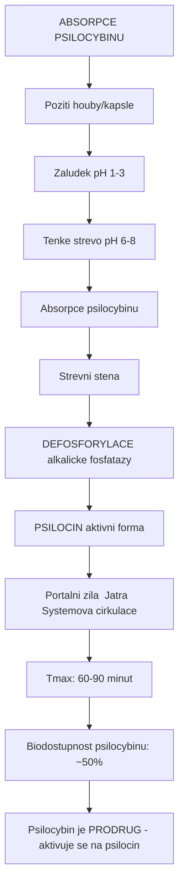

<details>
<summary>ASCII verze diagramu</summary>

```
ABSORPCE PSILOCYBINU

Poziti houby/kapsle
        |
        v
Zaludek (pH 1-3)
        |
        v
Tenke strevo (pH 6-8)
        ├── Absorpce psilocybinu
        |
        v
Strevni stena
        ├── DEFOSFORYLACE (alkalicke fosfatazy)
        |           |
        |           v
        |       [PSILOCIN] (aktivni forma)
        |
        v
Portalni zila → Jatra → Systemova cirkulace

Tmax: 60-90 minut
Biodostupnost psilocybinu: ~50%
(Psilocybin je PRODRUG - aktivuje se na psilocin)
```

</details>

#### [DMT](@/alkaloids/dmt.md) (ruzne cesty)

| Cesta | Tmax | Trvani | Poznamka |
|-------|------|--------|----------|
| **Peroralni (bez MAOI)** | - | Zadny ucinek | Degradace MAO ve strevu a jatrech |
| **Peroralni + MAOI (Ayahuasca)** | 60-120 min | 4-6 h | MAO inhibice umoznuje absorpci |
| **Inhalacni (vapovani)** | <1 min | 15-30 min | Prima absorpce, obchazi first-pass |
| **Intranazalni** | 5-15 min | 30-60 min | Castecne obchazi first-pass |
| **Intramuskulari** | 5-10 min | 45-60 min | Bioegkvivalentni vapovani |

#### [LSD](@/alkaloids/lsd.md) (sublingualni/peroralni)

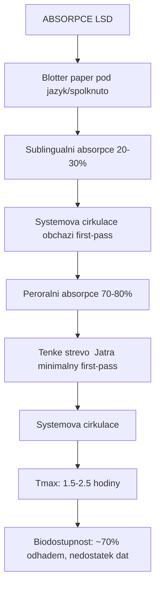

<details>
<summary>ASCII verze diagramu</summary>

```
ABSORPCE LSD

Blotter paper pod jazyk/spolknuto
        |
        ├── Sublingualni absorpce (20-30%)
        |           |
        |           v
        |   Systemova cirkulace (obchazi first-pass)
        |
        └── Peroralni absorpce (70-80%)
                    |
                    v
            Tenke strevo → Jatra (minimalny first-pass)
                    |
                    v
            Systemova cirkulace

Tmax: 1.5-2.5 hodiny
Biodostupnost: ~70% (odhadem, nedostatek dat)
```

</details>

---

## Biodostupnost (F)

### Definice

**Biodostupnost (F)** je podil podane davky, ktery dosahne systemove cirkulace v nezmenene forme. Vyjadruje se jako procento nebo desetinne cislo (0-1).

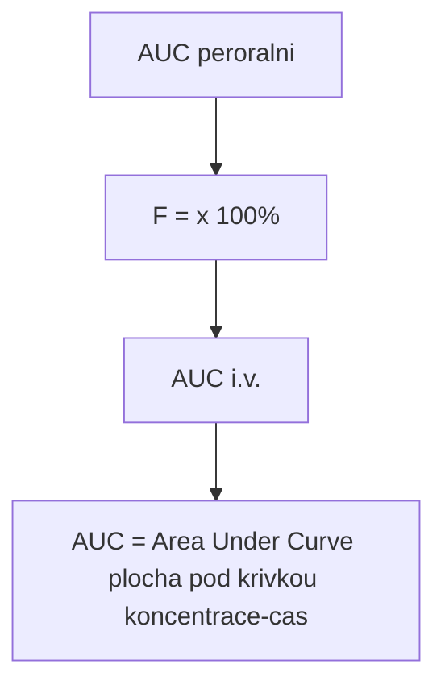

<details>
<summary>ASCII verze diagramu</summary>

```
            AUC (peroralni)
    F  =  ─────────────────  x 100%
            AUC (i.v.)

AUC = Area Under Curve (plocha pod krivkou koncentrace-cas)
```

</details>

### Faktory snizujici biodostupnost

#### First-pass metabolismus

**First-pass efekt** (presystemovy metabolismus) je metabolicka premena latky pred dosazenim systemove cirkulace.

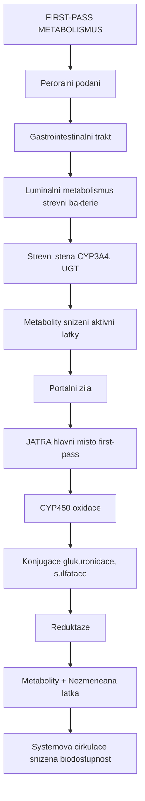

<details>
<summary>ASCII verze diagramu</summary>

```
FIRST-PASS METABOLISMUS

Peroralni podani
        |
        v
Gastrointestinalni trakt
        |
        ├── Luminalní metabolismus (strevni bakterie)
        |
        ├── Strevni stena (CYP3A4, UGT)
        |           |
        |           v
        |   Metabolity (snizeni aktivni latky)
        |
        v
Portalni zila
        |
        v
JATRA (hlavni misto first-pass)
        |
        ├── CYP450 oxidace
        ├── Konjugace (glukuronidace, sulfatace)
        ├── Reduktaze
        |
        v
Metabolity + Nezmeneana latka
        |
        v
Systemova cirkulace (snizena biodostupnost)
```

</details>

#### Priklady first-pass efektu u psychoaktivnich latek

| Latka | Biodostupnost (p.o.) | First-pass | Poznamka |
|-------|---------------------|------------|----------|
| **DMT** | ~0% (bez MAOI) | Extremni (MAO) | Vyzaduje MAOI pro peroralni aktivitu |
| **Morfin** | 20-40% | Vysoky (glukuronidace) | Aktivni metabolit M6G |
| **[Psilocybin](@/alkaloids/psilocybin.md)** | ~50% | Stredni | Prodrug, aktivace na psilocin |
| **[LSD](@/alkaloids/lsd.md)** | ~70% | Nizky | Vysoka potence kompenzuje |
| **MDMA** | ~70% | Stredni (CYP2D6) | Variabilita dle genotypu |
| **THC** | 6-20% | Vysoky (CYP2C9, 3A4) | 11-OH-THC je aktivni |
| **Ketamin** | 17-29% | Vysoky (CYP3A4, 2B6) | Norketamin je aktivni |

### Biodostupnost podle cesty podani

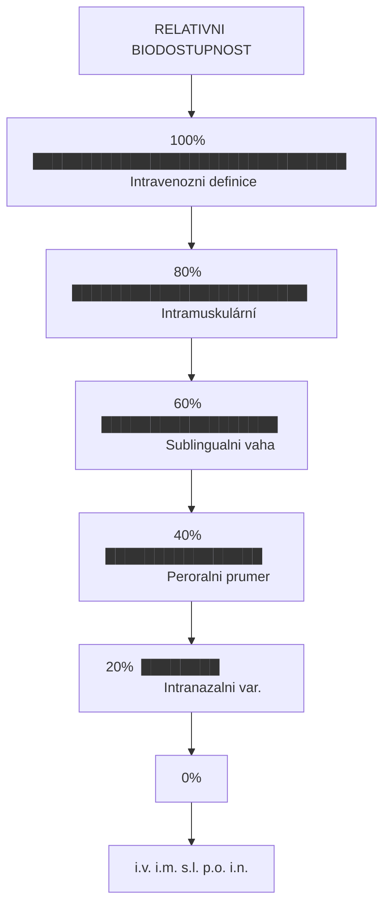

<details>
<summary>ASCII verze diagramu</summary>

```
RELATIVNI BIODOSTUPNOST

100% ┤ ████████████████████████████████  Intravenozni (definice)
     │
 80% ┤ ████████████████████████          Intramuskulární
     │
 60% ┤ ██████████████████                Sublingualni (vaha)
     │
 40% ┤ ████████████████                  Peroralni (prumer)
     │
 20% ┤ ████████                          Intranazalni (var.)
     │
  0% ┼──────────────────────────────────
         i.v.    i.m.    s.l.   p.o.    i.n.
```

</details>

---

## Distribuce

### Definice

**Distribuce** je proces, kterym se latka rozdeluje z krve do tkaní a organu. Urcuje, kam se latka v tele dostane a v jakych koncentracich.

### Objem distribuce (Vd)

**Objem distribuce** je teoreticky objem, do ktereho by se musela latka rozpustit, aby koncentrace v tomto objemu odpovídala plazmaticke koncentraci.

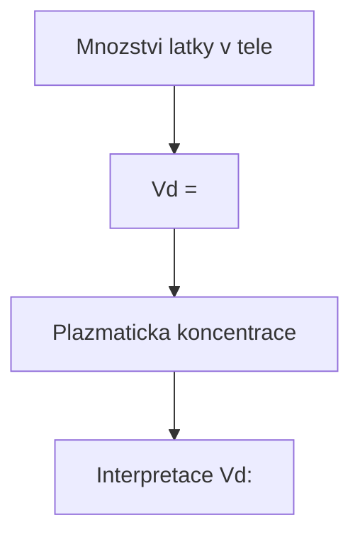

<details>
<summary>ASCII verze diagramu</summary>

```
           Mnozstvi latky v tele
    Vd  =  ─────────────────────────
           Plazmaticka koncentrace

Interpretace Vd:
- Vd = 3-5 L:     Latka zustava v plazme (vazba na proteiny)
- Vd = 10-20 L:   Distribuce do extracelularni tekutiny
- Vd = 40-70 L:   Distribuce do celkove telesne vody
- Vd > 70 L:      Extensivni distribuce do tkani (lipofilni latky)
```

</details>

### Faktory ovlivnujici distribuci

#### Vazba na plazmaticke proteiny

| Protein | Typ latek | Priklad |
|---------|-----------|---------|
| **Albumin** | Kyselé, neutralni | Diazepam (98% vazba) |
| **alpha-1-kyselý glykoprotein** | Zasadite | Ketamin, LSD |
| **Lipoproteiny** | Lipofilni | THC |

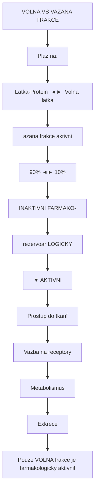

<details>
<summary>ASCII verze diagramu</summary>

```
VOLNA VS VAZANA FRAKCE

Plazma:
┌─────────────────────────────────────────────────┐
│                                                 │
│   [Latka-Protein]  ◄═══════►  [Volna latka]    │
│   (vazana frakce)              (aktivni)        │
│        90%           ◄═══►         10%          │
│                                     │           │
│   INAKTIVNI                         │ FARMAKO-  │
│   (rezervoar)                       │ LOGICKY   │
│                                     ▼ AKTIVNI   │
│                            Prostup do tkaní     │
│                            Vazba na receptory   │
│                            Metabolismus         │
│                            Exkrece              │
└─────────────────────────────────────────────────┘

Pouze VOLNA frakce je farmakologicky aktivni!
```

</details>

#### Prostupnost memban

| Membrana | Charakteristika | Latky s dobrym prostupem |
|----------|-----------------|--------------------------|
| **Kapilary (obecne)** | Fenestrace, mezery | Vetsina latek |
| **Hematoencefalicka bariera** | Tight junctions | Lipofilni, male |
| **Placenta** | Selektivni | Zavisi na MW, lipofilite |
| **Testikulrani bariera** | Tight junctions | Lipofilni |

### Hematoencefalicka bariera (BBB)

**Blood-Brain Barrier (BBB)** je kriticka pro psychoaktivni latky, protoze musi prostoupit do mozku, aby vyvolaly ucinek.

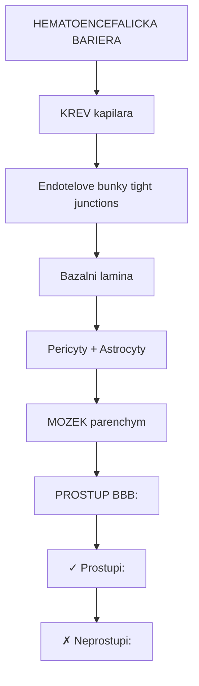

<details>
<summary>ASCII verze diagramu</summary>

```
HEMATOENCEFALICKA BARIERA

                    KREV (kapilara)
                          |
    ┌─────────────────────┴─────────────────────┐
    │                                           │
    │   Endotelove bunky (tight junctions)      │
    │   ════════════════════════════════════    │
    │              Bazalni lamina               │
    │   ════════════════════════════════════    │
    │         Pericyty + Astrocyty              │
    │   ════════════════════════════════════    │
    │                                           │
    └─────────────────────┬─────────────────────┘
                          |
                    MOZEK (parenchym)

PROSTUP BBB:

✓ Prostupi:
  - Lipofilni molekuly (log P > 1)
  - Male molekuly (MW < 400-500 Da)
  - Neionizovane formy
  - Substráty transporteru (glukoza, aminokyseliny)

✗ Neprostupi:
  - Hydrofilni molekuly
  - Velke molekuly (peptidy, proteiny)
  - Ionizovane formy
  - Substráty effluxnich pump (P-glykoprotein)
```

</details>

### Prostup BBB u psychedelik

| Latka | MW (Da) | log P | Prostup BBB | Poznamka |
|-------|---------|-------|-------------|----------|
| **[LSD](@/alkaloids/lsd.md)** | 323 | 2.9 | Vyborny | Vysoka lipofilita |
| **[Psilocin](@/alkaloids/psilocin.md)** | 204 | 1.2 | Dobry | Aktivni forma psilocybinu |
| **[DMT](@/alkaloids/dmt.md)** | 188 | 1.3 | Dobry | Maly, lipofilni |
| **[Mescalin](@/alkaloids/mescaline.md)** | 211 | 0.7 | Stredni | Mene lipofilni |
| **Ketamin** | 238 | 2.2 | Dobry | Rychly nastup |
| **MDMA** | 193 | 1.8 | Dobry | - |
| **THC** | 314 | 6.9 | Vyborny | Extremne lipofilni |

---

## Metabolismus (Biotransformace)

### Definice

**Metabolismus** (biotransformace) je enzymatická premena latek v organismu. Cilem je obvykle prevest lipofilni latky na hydrofilnejsi metabolity, ktere lze snadneji vylouci.

### Faze metabolismu

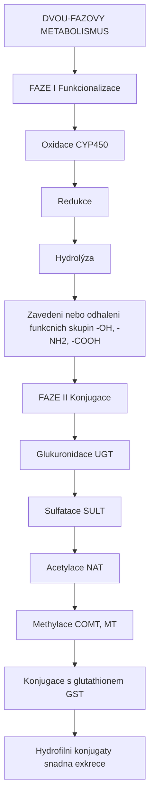

<details>
<summary>ASCII verze diagramu</summary>

```
DVOU-FAZOVY METABOLISMUS

FAZE I (Funkcionalizace)
├── Oxidace (CYP450)
├── Redukce
└── Hydrolýza
        |
        v
Zavedeni nebo odhaleni funkcnich skupin (-OH, -NH2, -COOH)
        |
        v
FAZE II (Konjugace)
├── Glukuronidace (UGT)
├── Sulfatace (SULT)
├── Acetylace (NAT)
├── Methylace (COMT, MT)
└── Konjugace s glutathionem (GST)
        |
        v
Hydrofilni konjugaty (snadna exkrece)
```

</details>

### Cytochrom P450 (CYP450)

CYP450 je rodina enzymů zodpovednych za metabolismus vetsiny leciv a xenobiotik.

#### Hlavni CYP izoformy a jejich substráty

| Izoforma | Podil na metabolismu leciv | Substráty (psychoaktivni) |
|----------|---------------------------|---------------------------|
| **CYP3A4** | ~50% | Ketamin, alprazolam, midazolam, THC |
| **CYP2D6** | ~25% | MDMA, DXM, kodein, tramadol, amfetaminy |
| **CYP2C9** | ~10% | THC, ibuprofen |
| **CYP2C19** | ~5% | Diazepam, omeprazol |
| **CYP1A2** | ~5% | Kofein, melatonin |
| **CYP2B6** | ~5% | Ketamin, metadon |

#### Geneticke polymorfismy CYP2D6

```mermaid
flowchart TD
    node_CYP2D6FENOTYPY["CYP2D6 FENOTYPY"]
    node_ULTRARYCHLIMETABOLIZ["ULTRA-RYCHLI METABOLIZERI UM"]
    node_510populace["5-10% populace"]
    node_DuplikacegenuCYP2D6["Duplikace genu CYP2D6"]
    node_Rychlejsimetabolismu["Rychlejsi metabolismus"]
    node_RizikoSnizenyucinekp["Riziko: Snizeny ucinek, potreba vyssi davky"]
    node_EXTENZIVNINORMALNMET["EXTENZIVNI NORMALNÍ METABOLIZERI EM"]
    node_6580populace["65-80% populace"]
    node_Normalnifunkcnigen["Normalni funkcni gen"]
    node_Standardniodpoved["Standardni odpoved"]
    node_INTERMEDIARNIMETABOL["INTERMEDIARNI METABOLIZERI IM"]
    node_1015populace["10-15% populace"]
    node_Snizenaaktivitaheter["Snizena aktivita heterozygoti"]
    node_Mirnezvysenehladiny["Mirne zvysene hladiny"]
    node_POMALIMETABOLIZERIPM["POMALI METABOLIZERI PM"]
    node_510kavkazskepopulace["5-10% kavkazske populace"]
    node_Nefunkcnigenhomozygo["Nefunkcni gen homozygoti"]
    node_Vyraznesnizenymetabo["Vyrazne snizeny metabolismus"]
    node_RizikoToxicitaprodlo["Riziko: Toxicita, prodlouzeny ucinek"]
    node_Prikladydopadnapsych["Priklady dopad na psychoaktivni latky:"]

    node_CYP2D6FENOTYPY --> node_ULTRARYCHLIMETABOLIZ
    node_ULTRARYCHLIMETABOLIZ --> node_510populace
    node_510populace --> node_DuplikacegenuCYP2D6
    node_DuplikacegenuCYP2D6 --> node_Rychlejsimetabolismu
    node_Rychlejsimetabolismu --> node_RizikoSnizenyucinekp
    node_RizikoSnizenyucinekp --> node_EXTENZIVNINORMALNMET
    node_EXTENZIVNINORMALNMET --> node_6580populace
    node_6580populace --> node_Normalnifunkcnigen
    node_Normalnifunkcnigen --> node_Standardniodpoved
    node_Standardniodpoved --> node_INTERMEDIARNIMETABOL
    node_INTERMEDIARNIMETABOL --> node_1015populace
    node_1015populace --> node_Snizenaaktivitaheter
    node_Snizenaaktivitaheter --> node_Mirnezvysenehladiny
    node_Mirnezvysenehladiny --> node_POMALIMETABOLIZERIPM
    node_POMALIMETABOLIZERIPM --> node_510kavkazskepopulace
    node_510kavkazskepopulace --> node_Nefunkcnigenhomozygo
    node_Nefunkcnigenhomozygo --> node_Vyraznesnizenymetabo
    node_Vyraznesnizenymetabo --> node_RizikoToxicitaprodlo
    node_RizikoToxicitaprodlo --> node_Prikladydopadnapsych
```

<details>
<summary>ASCII verze diagramu</summary>

```
CYP2D6 FENOTYPY

ULTRA-RYCHLI METABOLIZERI (UM)
├── 5-10% populace
├── Duplikace genu CYP2D6
├── Rychlejsi metabolismus
└── Riziko: Snizeny ucinek, potreba vyssi davky

EXTENZIVNI (NORMALNÍ) METABOLIZERI (EM)
├── 65-80% populace
├── Normalni funkcni gen
└── Standardni odpoved

INTERMEDIARNI METABOLIZERI (IM)
├── 10-15% populace
├── Snizena aktivita (heterozygoti)
└── Mirne zvysene hladiny

POMALI METABOLIZERI (PM)
├── 5-10% kavkazske populace
├── Nefunkcni gen (homozygoti)
├── Vyrazne snizeny metabolismus
└── Riziko: Toxicita, prodlouzeny ucinek

Priklady dopad na psychoaktivni latky:
- MDMA: PM maji 5-10x vyssi hladiny → zvysena neurotoxicita
- DXM: PM zazivaji intenzivni disociaci i pri nizkych davkach
- Kodein: PM nemaji ucinek (neni konverze na morfin)
```

</details>

### Metabolismus specifickych psychedelik

#### [Psilocybin](@/alkaloids/psilocybin.md) → [Psilocin](@/alkaloids/psilocin.md)

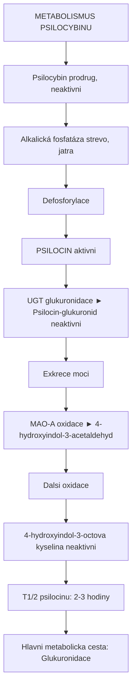

<details>
<summary>ASCII verze diagramu</summary>

```
METABOLISMUS PSILOCYBINU

[Psilocybin] (prodrug, neaktivni)
     │
     │ Alkalická fosfatáza (strevo, jatra)
     │ Defosforylace
     │
     v
[PSILOCIN] (aktivni)
     │
     ├─── UGT (glukuronidace) ──► Psilocin-glukuronid (neaktivni)
     │           │
     │           └── Exkrece moci
     │
     └─── MAO-A (oxidace) ──► 4-hydroxyindol-3-acetaldehyd
                     │
                     v
                Dalsi oxidace
                     │
                     v
         4-hydroxyindol-3-octova kyselina (neaktivni)

T1/2 psilocinu: 2-3 hodiny
Hlavni metabolicka cesta: Glukuronidace
```

</details>

#### [LSD](@/alkaloids/lsd.md)

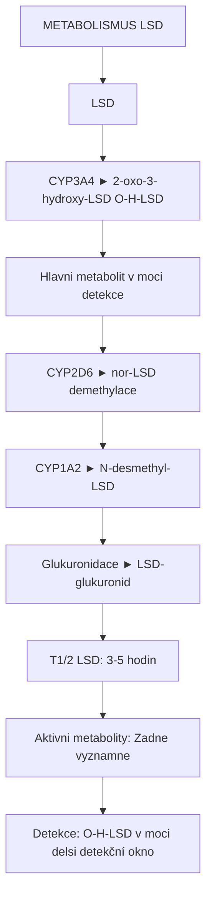

<details>
<summary>ASCII verze diagramu</summary>

```
METABOLISMUS LSD

[LSD]
     │
     ├─── CYP3A4 ──► 2-oxo-3-hydroxy-LSD (O-H-LSD)
     │                     │
     │                     └── Hlavni metabolit v moci (detekce)
     │
     ├─── CYP2D6 ──► nor-LSD (demethylace)
     │
     ├─── CYP1A2 ──► N-desmethyl-LSD
     │
     └─── Glukuronidace ──► LSD-glukuronid

T1/2 LSD: 3-5 hodin
Aktivni metabolity: Zadne vyznamne
Detekce: O-H-LSD v moci (delsi detekční okno)
```

</details>

#### [DMT](@/alkaloids/dmt.md)

```mermaid
flowchart TD
    node_METABOLISMUSDMTbezMA["METABOLISMUS DMT bez MAOI"]
    node_DMT["DMT"]
    node_MAOAextenzerychla5mi["MAO-A extenze rychla, &lt;5 min"]
    node_Indol3acetaldehyd["Indol-3-acetaldehyd"]
    node_Aldehyddehydrogenaza["Aldehyd dehydrogenaza"]
    node_Indol3octovakyselina["Indol-3-octova kyselina IAA"]
    node_Exkrecemoci["Exkrece moci"]
    node_T12DMTivinhalacne15m["T1/2 DMT i.v./inhalacne: ~15 minut"]
    node_T12DMTperoralniMAOI1["T1/2 DMT peroralni + MAOI: 1-2 hodiny"]
    node_DMTMAOINHIBITORAyahu["DMT + MAO INHIBITOR Ayahuasca:"]
    node_DMTHarmalinHarminMAO["DMT + Harmalin/Harmin MAOI"]
    node_MAOAINHIBOVANA["MAO-A INHIBOVANA"]
    node_DMTSystemovacirkulac["DMT  Systemova cirkulace  CNS"]
    node_T12prodlouzen["T1/2 prodlouzen"]
    node_Ucinkytrvaji46hodin["Ucinky trvaji 4-6 hodin"]
    node_Pomalymetabolismusal["Pomaly metabolismus alternativni cesty"]

    node_METABOLISMUSDMTbezMA --> node_DMT
    node_DMT --> node_MAOAextenzerychla5mi
    node_MAOAextenzerychla5mi --> node_Indol3acetaldehyd
    node_Indol3acetaldehyd --> node_Aldehyddehydrogenaza
    node_Aldehyddehydrogenaza --> node_Indol3octovakyselina
    node_Indol3octovakyselina --> node_Exkrecemoci
    node_Exkrecemoci --> node_T12DMTivinhalacne15m
    node_T12DMTivinhalacne15m --> node_T12DMTperoralniMAOI1
    node_T12DMTperoralniMAOI1 --> node_DMTMAOINHIBITORAyahu
    node_DMTMAOINHIBITORAyahu --> node_DMTHarmalinHarminMAO
    node_DMTHarmalinHarminMAO --> node_MAOAINHIBOVANA
    node_MAOAINHIBOVANA --> node_DMTSystemovacirkulac
    node_DMTSystemovacirkulac --> node_T12prodlouzen
    node_T12prodlouzen --> node_Ucinkytrvaji46hodin
    node_Ucinkytrvaji46hodin --> node_Pomalymetabolismusal

    click node_METABOLISMUSDMTbezMA "/alkaloids/dmt/" "METABOLISMUS DMT bez MAOI"
    click node_DMT "/alkaloids/dmt/" "DMT"
    click node_T12DMTivinhalacne15m "/alkaloids/dmt/" "T1/2 DMT i.v./inhalacne: ~15 minut"
    click node_T12DMTperoralniMAOI1 "/alkaloids/dmt/" "T1/2 DMT peroralni + MAOI: 1-2 hodiny"
    click node_DMTMAOINHIBITORAyahu "/alkaloids/dmt/" "DMT + MAO INHIBITOR Ayahuasca:"
    click node_DMTHarmalinHarminMAO "/alkaloids/dmt/" "DMT + Harmalin/Harmin MAOI"
    click node_DMTSystemovacirkulac "/alkaloids/dmt/" "DMT  Systemova cirkulace  CNS"
```

<details>
<summary>ASCII verze diagramu</summary>

```
METABOLISMUS DMT (bez MAOI)

[DMT]
     │
     │ MAO-A (extenze rychla, <5 min)
     │
     v
[Indol-3-acetaldehyd]
     │
     │ Aldehyd dehydrogenaza
     │
     v
[Indol-3-octova kyselina] (IAA)
     │
     └── Exkrece moci

T1/2 DMT (i.v./inhalacne): ~15 minut
T1/2 DMT (peroralni + MAOI): 1-2 hodiny

DMT + MAO INHIBITOR (Ayahuasca):

[DMT] + [Harmalin/Harmin (MAOI)]
     │
     │ MAO-A INHIBOVANA
     │
     v
[DMT] → Systemova cirkulace → CNS
     │
     │ T1/2 prodlouzen
     │ Ucinky trvaji 4-6 hodin
     │
     v
Pomaly metabolismus (alternativni cesty)
```

</details>

### Monoaminooxidaza (MAO)

MAO je klicovy enzym pro metabolismus monoaminovych neurotransmiteru a nekterych psychedelik.

| Izoforma | Lokalizace | Substráty |
|----------|------------|-----------|
| **MAO-A** | Strevo, jatra, mozek | Serotonin, noradrenalin, DMT, tyramin |
| **MAO-B** | Mozek, trombocyty | Dopamin, phenylethylamin |

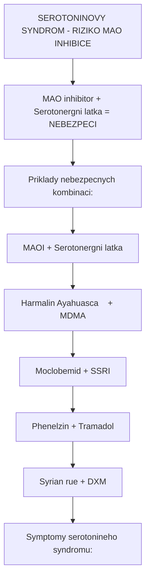

<details>
<summary>ASCII verze diagramu</summary>

```
SEROTONINOVY SYNDROM - RIZIKO MAO INHIBICE

MAO inhibitor + Serotonergni latka = NEBEZPECI

Priklady nebezpecnych kombinaci:
┌─────────────────────────────────────────────────────────────┐
│ MAOI                    +     Serotonergni latka            │
├─────────────────────────────────────────────────────────────┤
│ Harmalin (Ayahuasca)    +     MDMA                          │
│ Moclobemid              +     SSRI                          │
│ Phenelzin               +     Tramadol                      │
│ Syrian rue              +     DXM                           │
└─────────────────────────────────────────────────────────────┘

Symptomy serotonineho syndromu:
- Agitace, zmatenost
- Tachykardie, hypertenze
- Hypertermie
- Myoklonus, tremor
- Prujem, nevolnost
- V tezkeých pripadech: Krecě, smrt
```

</details>

---

## Exkrece (Eliminace)

### Definice

**Exkrece** je proces odstranovani latek a jejich metabolitu z organismu. Hlavnimi cestami jsou ledviny (moc) a jatra (zluc).

### Cesty exkrece

| Cesta | Mechanismus | Typ latek |
|-------|-------------|-----------|
| **Renalni (ledviny)** | Filtrace, sekrece, reabsorpce | Hydrofilni, male MW |
| **Bilirani (jatra/zluc)** | Aktivni transport do zluci | Lipofilni, konjugaty MW>300 |
| **Plicni** | Difuze do alveolu | Volatilni latky |
| **Potni zlázy** | Pasivni difuze | Male molekuly |
| **Sliny** | Pasivni difuze | Diagnosticky vyznam |
| **Materskě mleko** | Lipidní difuze | Lipofilni latky |

### Renalni exkrece

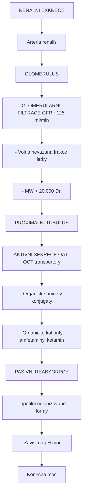

<details>
<summary>ASCII verze diagramu</summary>

```
RENALNI EXKRECE

                    Arteria renalis
                          │
                          v
┌─────────────────────────────────────────────────────┐
│                    GLOMERULUS                        │
│                          │                           │
│                          v                           │
│    GLOMERULARNI FILTRACE (GFR ~125 ml/min)          │
│    - Volna (nevazana) frakce latky                  │
│    - MW < 20,000 Da                                 │
│                          │                           │
└─────────────────────────┼───────────────────────────┘
                          │
                          v
┌─────────────────────────────────────────────────────┐
│              PROXIMALNI TUBULUS                      │
│                          │                           │
│    AKTIVNI SEKRECE (OAT, OCT transportery)          │
│    - Organicke anionty (konjugaty)                  │
│    - Organicke kationty (amfetaminy, ketamin)       │
│                          │                           │
│    PASIVNI REABSORPCE                               │
│    - Lipofilni neionizovane formy                   │
│    - Zavisi na pH moci                              │
│                          │                           │
└─────────────────────────┼───────────────────────────┘
                          │
                          v
                    Konecna moc
```

</details>

#### Vliv pH moci na exkreci

```
pH MOCI A EXKRECE LATEK

KYSELINY (slabé):
- pH kyselé → neionizované → reabsorpce → snížená exkrece
- pH zásadité → ionizované → exkrece → zvýšená clearance

ZASADY (slabé, vč. amfetaminů, MDMA):
- pH kyselé → ionizované → exkrece → zvýšená clearance
- pH zásadité → neionizované → reabsorpce → snížená exkrece

Praktický význam:
- Kyselý džus (vitamin C) urychluje exkreci amfetaminů
- Antacida prodlužují účinek amfetaminů
```

### Clearance (CL)

**Clearance** je objem plazmy, ktery je za jednotku casu zcela ocisten od latky.

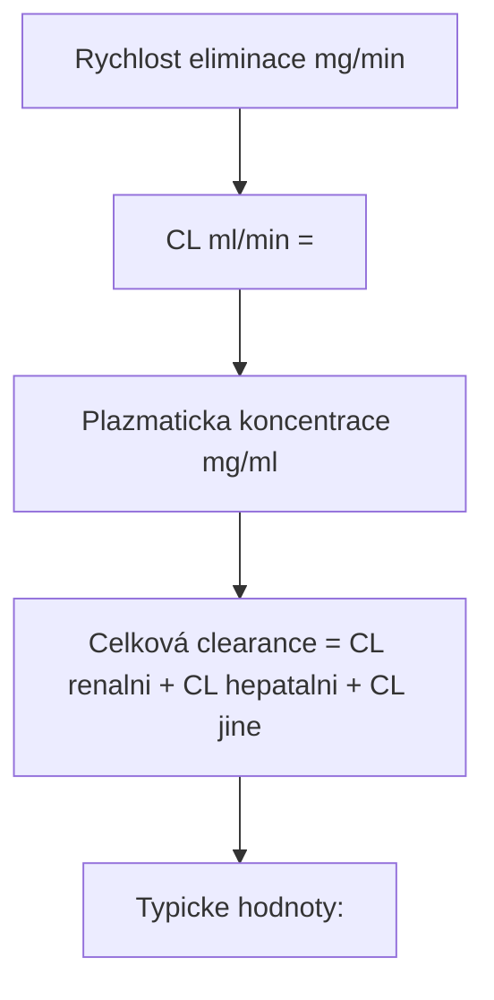

<details>
<summary>ASCII verze diagramu</summary>

```
                 Rychlost eliminace (mg/min)
    CL (ml/min)  =  ────────────────────────────────
                    Plazmaticka koncentrace (mg/ml)

Celková clearance = CL renalni + CL hepatalni + CL jine

Typicke hodnoty:
- Jetrovy prutok: ~1500 ml/min (max. hepatalni CL)
- Ledvinovy prutok: ~650 ml/min
- GFR: ~125 ml/min (max. renalni CL filtrací)
```

</details>

---

## Farmakokinetické parametry

### Cmax a Tmax

| Parametr | Definice | Klinicky vyznam |
|----------|----------|-----------------|
| **Cmax** | Maximalni dosazena koncentrace | Intenzita ucinku, riziko toxicity |
| **Tmax** | Cas do dosazeni Cmax | Nastup ucinku |

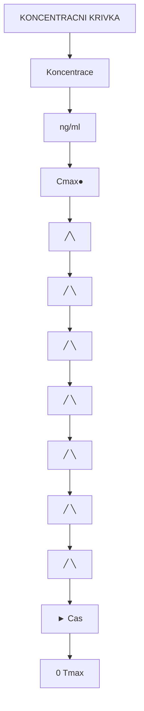

<details>
<summary>ASCII verze diagramu</summary>

```
KONCENTRACNI KRIVKA

Koncentrace
(ng/ml)
    │
Cmax├───────────●──────────────────────────────────
    │          ╱╲
    │         ╱  ╲
    │        ╱    ╲
    │       ╱      ╲
    │      ╱        ╲────────────
    │     ╱                      ╲────────────
    │    ╱                                    ╲────
    │   ╱
    │  ╱
    └──┼────────┼─────────────────────────────────► Cas
       0      Tmax
```

</details>

### Priklady Cmax a Tmax u psychedelik

| Latka | Cesta | Tmax | Cmax (typicka davka) |
|-------|-------|------|---------------------|
| **[Psilocin](@/alkaloids/psilocin.md)** | p.o. (z psilocybinu 25mg) | 60-90 min | 10-15 ng/ml |
| **[LSD](@/alkaloids/lsd.md)** | p.o. (100 µg) | 1.5-2.5 h | 3-5 ng/ml |
| **MDMA** | p.o. (100 mg) | 1.5-2 h | 200-300 ng/ml |
| **Ketamin** | i.m. (1 mg/kg) | 20-30 min | 200-400 ng/ml |
| **Ketamin** | i.n. (50 mg) | 20-40 min | 50-100 ng/ml |
| **THC** | inhalace | 5-10 min | 100-200 ng/ml |
| **THC** | p.o. (10 mg) | 1-2 h | 2-5 ng/ml |

### Polocas rozpadu (T1/2)

**Polocas** je cas, za ktery koncentrace latky v plazme klesne na polovinu.

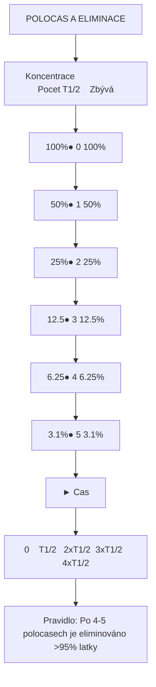

<details>
<summary>ASCII verze diagramu</summary>

```
POLOCAS A ELIMINACE

Koncentrace                     Pocet T1/2    Zbývá
    │
100%├────●                          0         100%
    │     ╲
 50%├──────●───                     1          50%
    │       ╲
 25%├────────●────                  2          25%
    │         ╲
12.5├──────────●──────              3         12.5%
    │           ╲
6.25├────────────●────────          4          6.25%
    │             ╲
3.1%├──────────────●──────────      5          3.1%
    └──┼──────┼──────┼──────┼──────┼──────────► Cas
       0    T1/2   2xT1/2  3xT1/2  4xT1/2

Pravidlo: Po 4-5 polocasech je eliminováno >95% latky
```

</details>

### Polocas psychoaktivnich latek

| Latka | T1/2 | Trvani ucinku | Poznamka |
|-------|------|---------------|----------|
| **DMT** (inhalacne) | ~15 min | 15-30 min | Velmi kratky |
| **Ketamin** | 2-3 h | 45-90 min | Aktivni metabolit norketamin |
| **[Psilocin](@/alkaloids/psilocin.md)** | 2-3 h | 4-6 h | - |
| **MDMA** | 6-9 h | 4-6 h | Nelineární kinetika |
| **[LSD](@/alkaloids/lsd.md)** | 3-5 h | 8-12 h | Prolongovany ucinek |
| **THC** | 20-30 h (terminalni) | 2-4 h (akutni) | Sekverstrace v tuku |
| **[Meskalin](@/alkaloids/mescaline.md)** | 6 h | 8-12 h | - |
| **Diazepam** | 20-100 h | 4-6 h (akutni) | Aktivni metabolity |

### AUC (Area Under Curve)

**AUC** predstavuje celkovou expozici organismu latce.

```
            ∞
    AUC  =  ∫ C(t) dt
            0

AUC je ukazatelem:
- Celkove absorpce
- Celkove expozice
- Zakladem pro vypocet biodostupnosti
```

---

## Lekove interakce

### Typy farmakokinetickych interakci

| Typ | Mechanismus | Priklad |
|-----|-------------|---------|
| **Absorpce** | Zmena pH, motility, chelatace | Antacida + amfetaminy |
| **Distribuce** | Vytesneni z vazby na proteiny | Warfarin + NSAID |
| **Metabolismus** | Inhibice/indukce CYP450 | Grapefruit + mnohe latky |
| **Exkrece** | Zmena pH moci, kompetice transporteru | Probenecid + penicilin |

### CYP450 inhibitory a induktory

#### Dulezite inhibitory

| Inhibitor | CYP izoformy | Riziko s |
|-----------|--------------|----------|
| **Grapefruit** | CYP3A4 | Alprazolam, THC (zvyseni hladin) |
| **Kava kava** | CYP1A2, 2D6 | DXM, MDMA |
| **Fluoxetin** | CYP2D6 | MDMA (zvysena neurotoxicita) |
| **Ketokonazol** | CYP3A4 | Ketamin, midazolam |
| **Cimetidin** | CYP1A2, 2D6, 3A4 | Mnoh |

#### Dulezite induktory

| Induktor | CYP izoformy | Efekt |
|----------|--------------|-------|
| **Tabak (koureni)** | CYP1A2 | Snizeni hladin nekterych leciv |
| **Carbamazepin** | CYP3A4 | Snizeni hladin ketaminu |
| **Rifampicin** | CYP3A4 | Snizeni hladin mnoha latek |
| **Trézalkovy caj** | CYP3A4 | Snizeni hladin |

### Kriticke interakce s psychoaktivnimi latkami

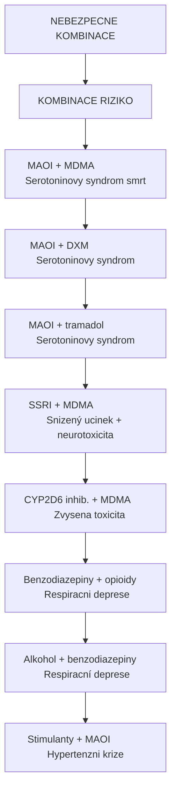

<details>
<summary>ASCII verze diagramu</summary>

```
NEBEZPECNE KOMBINACE

╔════════════════════════════════════════════════════════════════╗
║  KOMBINACE                    RIZIKO                           ║
╠════════════════════════════════════════════════════════════════╣
║  MAOI + MDMA                  Serotoninovy syndrom (smrt)      ║
║  MAOI + DXM                   Serotoninovy syndrom             ║
║  MAOI + tramadol              Serotoninovy syndrom             ║
║  SSRI + MDMA                  Snizený ucinek + neurotoxicita   ║
║  CYP2D6 inhib. + MDMA         Zvysena toxicita                 ║
║  Benzodiazepiny + opioidy     Respiracni deprese               ║
║  Alkohol + benzodiazepiny     Respiracní deprese               ║
║  Stimulanty + MAOI            Hypertenzni krize                ║
╚════════════════════════════════════════════════════════════════╝
```

</details>

### Interakce Ayahuascy

```mermaid
flowchart TD
    node_AYAHUASCAINTERAKCEMA["AYAHUASCA INTERAKCE MAO-A INHIBICE"]
    node_Ayahuascaobsahuje["Ayahuasca obsahuje:"]
    node_KONTRAINDIKOVANELATK["KONTRAINDIKOVANE LATKY:"]
    node_KategoriePriklady["Kategorie              Priklady"]
    node_SSRISNRIFluoxetinser["SSRI/SNRI              Fluoxetin, sertralin, venlafaxin"]
    node_TricyklickaADAmitrip["Tricyklicka AD         Amitriptylin, imipramin"]
    node_OpioidyTramadoldextr["Opioidy                Tramadol, dextrometorfan, fentanyl"]
    node_StimulantyMDMAamfeta["Stimulanty             MDMA, amfetaminy, kokain"]
    node_PotravinytyraminZral["Potraviny tyramin    Zrale syry, vino, fermentovane jidlo"]
    node_DalsiMAOIMoclobemids["Dalsi MAOI             Moclobemid, selegilin"]
    node_Doporucenawashoutper["Doporucena wash-out perioda pred Ayahuascou:"]

    node_AYAHUASCAINTERAKCEMA --> node_Ayahuascaobsahuje
    node_Ayahuascaobsahuje --> node_KONTRAINDIKOVANELATK
    node_KONTRAINDIKOVANELATK --> node_KategoriePriklady
    node_KategoriePriklady --> node_SSRISNRIFluoxetinser
    node_SSRISNRIFluoxetinser --> node_TricyklickaADAmitrip
    node_TricyklickaADAmitrip --> node_OpioidyTramadoldextr
    node_OpioidyTramadoldextr --> node_StimulantyMDMAamfeta
    node_StimulantyMDMAamfeta --> node_PotravinytyraminZral
    node_PotravinytyraminZral --> node_DalsiMAOIMoclobemids
    node_DalsiMAOIMoclobemids --> node_Doporucenawashoutper
```

<details>
<summary>ASCII verze diagramu</summary>

```
AYAHUASCA INTERAKCE (MAO-A INHIBICE)

Ayahuasca obsahuje:
- DMT (psychedelikum)
- Harmalin, Harmin (MAO-A inhibitory)

KONTRAINDIKOVANE LATKY:
┌─────────────────────────────────────────────────────────────┐
│ Kategorie              Priklady                              │
├─────────────────────────────────────────────────────────────┤
│ SSRI/SNRI              Fluoxetin, sertralin, venlafaxin     │
│ Tricyklicka AD         Amitriptylin, imipramin              │
│ Opioidy                Tramadol, dextrometorfan, fentanyl   │
│ Stimulanty             MDMA, amfetaminy, kokain             │
│ Potraviny (tyramin)    Zrale syry, vino, fermentovane jidlo │
│ Dalsi MAOI             Moclobemid, selegilin                │
└─────────────────────────────────────────────────────────────┘

Doporucena wash-out perioda pred Ayahuascou:
- SSRI (fluoxetin): 5-6 tydnu
- SSRI (ostatni): 2-3 tydny
- SNRI: 2 tydny
- Tramadol: 1 tyden
```

</details>

---

## Specialni populace

### Geneticke faktory

| Gen | Vliv | Dotcene latky |
|-----|------|---------------|
| **CYP2D6** | Metabolismus | MDMA, DXM, kodein |
| **CYP2C19** | Metabolismus | Diazepam |
| **UGT1A1** | Glukuronidace | Psilocin |
| **COMT** | Degradace katecholaminu | Dopamin, noradrenalin |

### Vek

| Vekova skupina | Zmeny | Dopad |
|----------------|-------|-------|
| **Novorozenci** | Nezrala CYP, snizena GFR | Prodlouzeny T1/2 |
| **Deti** | Vyssi metabolismus (na kg) | Mozna vyssi davka/kg |
| **Seniori** | Snizena GFR, CYP aktivita, Vd | Snizena eliminace |

### Jaterni insuficience

```mermaid
flowchart TD
    node_JATERNIINSUFICIENCEA["JATERNI INSUFICIENCE A FARMAKOKINETIKA"]
    node_Snizenafunkcejater["Snizena funkce jater:"]
    node_Snizenasyntezaalbumi["Snizena synteza albuminu  Zvysena volna frakce"]
    node_SnizenaCYPaktivitaSn["Snizena CYP aktivita  Snizeny metabolismus"]
    node_SnizenyprutokjaterSn["Snizeny prutok jater  Snizena hepatalni clearance"]
    node_Snizenaprodukcezluci["Snizena produkce zluci  Snizena bilirarni exkrece"]
    node_Dopad["Dopad:"]
    node_Doporuceni["Doporuceni:"]

    node_JATERNIINSUFICIENCEA --> node_Snizenafunkcejater
    node_Snizenafunkcejater --> node_Snizenasyntezaalbumi
    node_Snizenasyntezaalbumi --> node_SnizenaCYPaktivitaSn
    node_SnizenaCYPaktivitaSn --> node_SnizenyprutokjaterSn
    node_SnizenyprutokjaterSn --> node_Snizenaprodukcezluci
    node_Snizenaprodukcezluci --> node_Dopad
    node_Dopad --> node_Doporuceni
```

<details>
<summary>ASCII verze diagramu</summary>

```
JATERNI INSUFICIENCE A FARMAKOKINETIKA

Snizena funkce jater:
├── Snizena synteza albuminu → Zvysena volna frakce
├── Snizena CYP aktivita → Snizeny metabolismus
├── Snizeny prutok jater → Snizena hepatalni clearance
└── Snizena produkce zluci → Snizena bilirarni exkrece

Dopad:
- Zvysena biodostupnost (snizeny first-pass)
- Prodlouzeny polocas
- Riziko kumulace

Doporuceni:
- Snizit davku
- Prodlouzit davkovaci interval
- Vyhnout se hepatotoxickym latkam
```

</details>

### Renalni insuficience

| GFR (ml/min) | Stadium | Uprava davky |
|--------------|---------|--------------|
| >90 | Normalni | Zadna |
| 60-89 | Mirne snizeni | Obvykle zadna |
| 30-59 | Stredni | Snizit u renalne vylucovanych |
| 15-29 | Tezke | Vyznamne snizeni |
| <15 | Selhani | Dialyza, opatrnost |

---

## Terapeuticky monitoring

### Terapeuticke rozmezi

```mermaid
flowchart TD
    node_TERAPEUTICKEROZMEZI["TERAPEUTICKE ROZMEZI"]
    node_Koncentrace["Koncentrace"]
    node_ToxiToxickkoncentrac["Toxi   Toxická koncentrace"]
    node_642728ef["░░░░░░░░░░░░░░░░░░░░░░░░░░░░░░░░░░░░░░░░░"]
    node_Cmax["Cmax ●"]
    node_TERAPEUTICKE["░░░░░░░░░░░╱░░╲░░░░░░░░░░░░░░░░░░░░░░░░░░  TERAPEUTICKE"]
    node_OKNO["░░░░░░░░░╱░░░░░╲░░░░░░░░░░░░░░░░░░░░░░░░░  OKNO"]
    node_841d3010["░░░░░░░╱░░░░░░░░╲░░░░░░░░░░░░░░░░░░░░░░░░"]
    node_Cmin["Cmin ●●"]
    node_04d1acd2["╱                ╲"]
    node_Subterepkoncentrace["╱                  ╲  Subterep. koncentrace"]
    node_Cas["► Cas"]
    node_0Tmaxdalsidavka["0       Tmax     dalsi davka"]
    node_Ulateksuzkymterapeut["U latek s uzkym terapeutickym oknem je monitoring kriticky."]

    node_TERAPEUTICKEROZMEZI --> node_Koncentrace
    node_Koncentrace --> node_ToxiToxickkoncentrac
    node_ToxiToxickkoncentrac --> node_642728ef
    node_642728ef --> node_Cmax
    node_Cmax --> node_TERAPEUTICKE
    node_TERAPEUTICKE --> node_OKNO
    node_OKNO --> node_841d3010
    node_841d3010 --> node_Cmin
    node_Cmin --> node_04d1acd2
    node_04d1acd2 --> node_Subterepkoncentrace
    node_Subterepkoncentrace --> node_Cas
    node_Cas --> node_0Tmaxdalsidavka
    node_0Tmaxdalsidavka --> node_Ulateksuzkymterapeut
```

<details>
<summary>ASCII verze diagramu</summary>

```
TERAPEUTICKE ROZMEZI

Koncentrace
     │
     │
Toxi ├─────────────────────────────────────────  Toxická koncentrace
     │ ░░░░░░░░░░░░░░░░░░░░░░░░░░░░░░░░░░░░░░░░░
     │ ░░░░░░░░░░░░░░░░░░░░░░░░░░░░░░░░░░░░░░░░░
Cmax ├──────────────●─────────────────────────────
     │ ░░░░░░░░░░░╱░░╲░░░░░░░░░░░░░░░░░░░░░░░░░░  TERAPEUTICKE
     │ ░░░░░░░░░╱░░░░░╲░░░░░░░░░░░░░░░░░░░░░░░░░  OKNO
     │ ░░░░░░░╱░░░░░░░░╲░░░░░░░░░░░░░░░░░░░░░░░░
Cmin ├──────●──────────────●─────────────────────
     │     ╱                ╲
     │    ╱                  ╲─────────────────  Subterep. koncentrace
     │
     └────┼──────────┼───────┼──────────────────► Cas
          0       Tmax     dalsi davka

U latek s uzkym terapeutickym oknem je monitoring kriticky.
```

</details>

### Latky vyzadujici monitoring

| Latka | Duvod | Terapeuticke rozmezi |
|-------|-------|---------------------|
| **Lithium** | Uzke okno | 0.6-1.2 mEq/L |
| **Digoxin** | Uzke okno | 0.8-2.0 ng/ml |
| **Fenytoin** | Nelineární kinetika | 10-20 µg/ml |
| **Valproat** | Variabilita | 50-100 µg/ml |
| **Metadon** | Interakce, QT | Individualni |

---

## Farmakokinetika v klinickem vyzkumu psychedelik

### Psilocybin/Psilocin

```
FARMAKOKINETICKÝ PROFIL PSILOCYBINU

Podáni: Peroralni kapsle (25 mg psilocybinu)

Cas (h)  Koncentrace psilocinu  Klinicky ucinek
   0              0             Zadny
  0.5         vzestup          Nastup (uzkost, nevolnost)
   1          10-12 ng/ml      Peak onset
  1.5         12-15 ng/ml      Peak efekt
   2          10-12 ng/ml      Peak efekt
   3          6-8 ng/ml        Ustup
   4          3-5 ng/ml        Doznivani
   5          1-2 ng/ml        Baseline
   6          <1 ng/ml         Normalizace

Klinicke studie (Johns Hopkins, Imperial College):
- Davka: 10-30 mg psilocybinu
- Tmax: 1-1.5 h
- Trvani subjektivnich ucinku: 4-6 h
- Koreace mezi Cmax a intenzitou: Silna
```

### LSD

```
FARMAKOKINETICKÝ PROFIL LSD

Podání: Peroralni (200 µg)

Cas (h)  Koncentrace LSD    Klinicky ucinek
   0              0          Zadny
   1          1-2 ng/ml      Nastup
   2          3-5 ng/ml      Peak onset
  2.5         4-6 ng/ml      Peak efekt
   3          3-5 ng/ml      Peak efekt
   5          2-3 ng/ml      Plateau
   8          1-2 ng/ml      Ustup
  12          <0.5 ng/ml     Doznivani

Poznaky:
- Trvani ucinku (10-12h) je delsi nez by odpovidalo T1/2 (3-5h)
- Mozny duvod: Prolongovana vazba na 5-HT2A receptor ("receptor residence time")
- LSD tvoří "viko" nad receptorem, ktere zpomoluje disociaci
```

### Ketamin

```
FARMAKOKINETICKÝ PROFIL KETAMINU (antidepresivni pouziti)

Podání: Intravenozni infuze (0.5 mg/kg/40 min) - standardni protokol

Cas (min)  Koncentrace    Klinicky ucinek
    0           0          Zadny
   10       100-150        Disociace (onset)
   20       150-200        Peak disociace
   40       max (~200)     Konec infuze, max
   60       100-120        Disociace ustupuje
   90        50-70         Normalizace
  120        30-40         Baseline

Antidepresivni ucinek:
- Nastup: Hodiny po infuzi
- Maximum: 24-72 hodin
- Trvani: Dny až tydny
- Mechanismus: Neuroplasticita (BDNF, synaptogeneze)
```

---

## Zaver

Farmakokinetika poskytuje kriticky ramec pro pochopeni ucinku psychoaktivních latek. Znalost ADME procesu umoznnuje:

1. **Predikce nastupu a trvani** ucinku
2. **Optimalizaci davkovani** a cesty podani
3. **Identifikaci a prevenci** lekovych interakci
4. **Pochopeni interindividualni variability**
5. **Bezpecnejsi pouziti** psychoaktivnich latek

Pro kazdeho, kdo se zabyva psychedelickym vyzkumem nebo asistovanou terapii, je farmakokinetika zakladnim nastrojem pro zajisteni bezpecnosti a ucinnosti.

---

## Reference

1. Rowland, M. & Tozer, T.N. (2011). *Clinical Pharmacokinetics and Pharmacodynamics: Concepts and Applications*. Lippincott Williams & Wilkins. 4th ed.
2. Brunton, L.L., Hilal-Dandan, R. & Knollmann, B.C. (2018). *Goodman and Gilman's: The Pharmacological Basis of Therapeutics*. McGraw-Hill. 13th ed.
3. Brown, R.T. et al. (2017). *Pharmacokinetics of Escalating Doses of Oral Psilocybin in Healthy Adults*. Clinical Pharmacology & Therapeutics.
4. Holze, F. et al. (2019). *Pharmacokinetics and Pharmacodynamics of Lysergic Acid Diethylamide Microdoses in Healthy Participants*. Clinical Pharmacology & Therapeutics.
5. Dinis-Oliveira, R.J. (2017). *Metabolism of psilocybin and psilocin: clinical and forensic toxicological relevance*. Drug Metabolism Reviews.
6. Zanos, P. & Gould, T.D. (2018). *Mechanisms of ketamine action as an antidepressant*. Molecular Psychiatry.
7. Riba, J. et al. (2003). *Human pharmacology of ayahuasca: subjective and cardiovascular effects, monoamine metabolite excretion, and pharmacokinetics*. Journal of Pharmacology and Experimental Therapeutics.
8. Nichols, D.E. (2016). *Psychedelics*. Pharmacological Reviews. 68(2): 264-355.

---

## Viz take

### Souvisejici pojmy v glosari

- [Receptor](@/glossary/receptor.md) - Cile latek v organismu
- [GABA](@/glossary/gaba.md) - Neurotransmiter a jeho farmakokinetika
- [Nukleotid](@/glossary/nukleotid.md) - Energeticky metabolismus
- [Fosfat](@/glossary/fosfat.md) - Fosforylace a signalizace

### Receptory a signalizace

- [5-HT2A receptor](@/receptors/5-ht2a.md) - Primarni cil psychedelik
- [GABA-A receptor](@/receptors/gaba-a.md) - Cil sedativ a anxiolytik
- [NMDA receptor](@/receptors/nmda.md) - Cil disociativ

### Psychoaktivni latky

- [Psilocybin](@/alkaloids/psilocybin.md) - Houbove psychedelikum (prodrug)
- [Psilocin](@/alkaloids/psilocin.md) - Aktivni metabolit psilocybinu
- [LSD](@/alkaloids/lsd.md) - Semisynteticke psychedelikum
- [DMT](@/alkaloids/dmt.md) - Endogenni psychedelikum
- [Meskalin](@/alkaloids/mescaline.md) - Kaktusove psychedelikum

### Zdroje

- [Psilocybe houby](@/shrooms/psilocybes/_index.md) - Zdroj psilocybinu
- [Amanita muscaria](@/shrooms/amanita-muscaria.md) - Zdroj muscimolu

---

<- Zpet na [Glosar](@/glossary/_index.md)

---

*Tento text je soucasti glosare projektu Psychonautic a slouzi k edukacnim ucelum. Informace zde obsazene nejsou urceny jako lekarska ci farmakologicka rada.*
