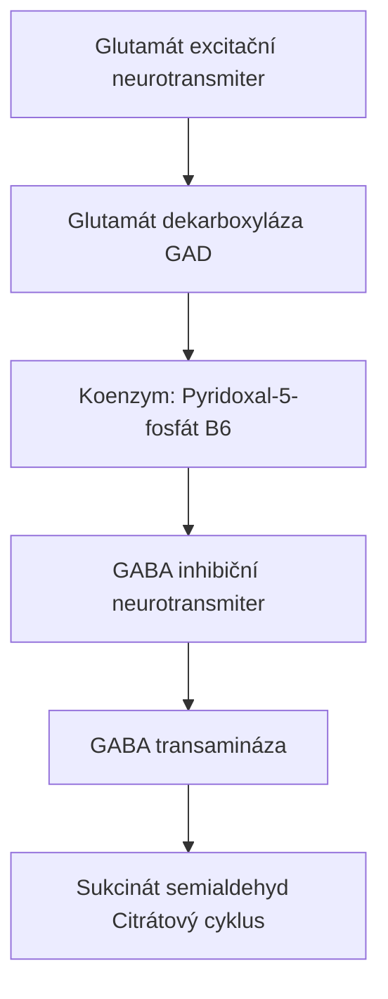
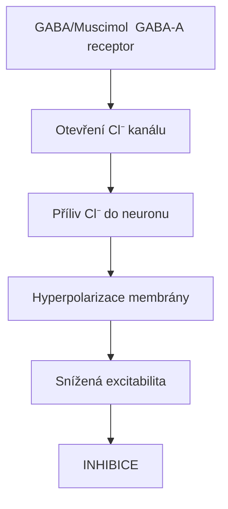
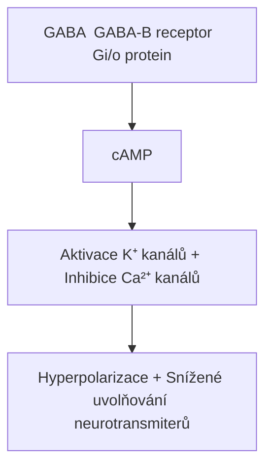

+++
title = "GABA"
description = "Kyselina gama-aminomáselná - hlavní inhibiční neurotransmiter CNS"
weight = 1
insert_anchor_links = "right"
+++

# GABA - Kyselina gama-aminomáselná


---

## Základní informace

| Vlastnost | Hodnota |
|-----------|---------|
| **Chemický název** | Kyselina 4-aminobutanová |
| **Molekulární vzorec** | C₄H₉NO₂ |
| **Molekulární hmotnost** | 103,12 g/mol |
| **CAS číslo** | 56-12-2 |
| **Funkce** | Inhibiční neurotransmiter |

---

## Syntéza

### Biosyntéza v mozku



<details>
<summary>ASCII verze diagramu</summary>

```
Glutamát (excitační neurotransmiter)
         ↓ [Glutamát dekarboxyláza (GAD)]
         ↓ [Koenzym: Pyridoxal-5-fosfát (B6)]
GABA (inhibiční neurotransmiter)
         ↓ [GABA transamináza]
Sukcinát semialdehyd → Citrátový cyklus
```

</details>

### Klíčové enzymy

| Enzym | Funkce | Kofaktor |
|-------|--------|----------|
| **GAD65** | Synaptická GABA | Vitamin B6 |
| **GAD67** | Extrasynaptická GABA | Vitamin B6 |
| **GABA-T** | Degradace GABA | PLP |
| **GAT-1,2,3** | Reuptake | - |

---

## Receptory

### GABA-A receptor (ionotropní)

| Vlastnost | Popis |
|-----------|-------|
| **Typ** | Ligandem řízený iontový kanál |
| **Ion** | Cl⁻ (chloridový) |
| **Účinek** | Rychlá inhibice (ms) |
| **Struktura** | Pentamer (α, β, γ, δ, ε, π, θ, ρ podjednotky) |
| **Nejčastější** | α1β2γ2 |

#### Vazebná místa GABA-A

| Místo | Ligandy | Účinek |
|-------|---------|--------|
| Benzodiazepinové | Diazepam, Alprazolam | Pozitivní modulace |
| Barbiturátové | Fenobarbital | Pozitivní modulace |
| Neurosteroidové | Alopregnanolone | Pozitivní modulace |
| Etanolové | Alkohol | Pozitivní modulace |
| Pikrotoxinové | Pikrotoxin | Negativní modulace |

#### Mechanismus GABA-A



<details>
<summary>ASCII verze diagramu</summary>

```
GABA/Muscimol → GABA-A receptor
        ↓
Otevření Cl⁻ kanálu
        ↓
Příliv Cl⁻ do neuronu
        ↓
Hyperpolarizace membrány
        ↓
Snížená excitabilita
        ↓
INHIBICE
```

</details>

### GABA-B receptor (metabotropní)

| Vlastnost | Popis |
|-----------|-------|
| **Typ** | G-protein spřažený receptor (GPCR) |
| **G-protein** | Gi/o |
| **Účinek** | Pomalá inhibice (s-min) |
| **Struktura** | Heterodimer (GABA-B1 + GABA-B2) |

#### Mechanismus GABA-B



<details>
<summary>ASCII verze diagramu</summary>

```
GABA → GABA-B receptor → Gi/o protein
        ↓                    ↓
   ↓cAMP ←───────────────────┘
        ↓
Aktivace K⁺ kanálů + Inhibice Ca²⁺ kanálů
        ↓
Hyperpolarizace + Snížené uvolňování neurotransmiterů
```

</details>

#### Ligandy GABA-B

| Ligand | Typ | Použití |
|--------|-----|---------|
| **Baclofen** | Agonista | Spasticita |
| **GHB** | Agonista | Narkolepsie |
| Saclofen | Antagonista | Výzkum |
| CGP 35348 | Antagonista | Výzkum |

---

## Fyziologické funkce

### Centrální účinky

| Funkce | Mechanismus |
|--------|-------------|
| **Regulace úzkosti** | Inhibice amygdaly |
| **Indukce spánku** | Inhibice vzruchových systémů |
| **Svalová relaxace** | Inhibice motorických neuronů |
| **Antikonvulzivní** | Celková inhibice |
| **Analgezie** | Modulace bolestivých drah |

### Klinické důsledky

| Stav | Vztah k GABA |
|------|--------------|
| **Úzkostné poruchy** | Snížená GABAergní aktivita |
| **Epilepsie** | Nedostatečná inhibice |
| **Insomnie** | Narušená GABAergní regulace |
| **Schizofrenie** | Dysfunkce interneuronů |
| **Alkoholismus** | Adaptace receptorů |

---

## GABAergní látky

### Přímí agonisté

| Látka | Receptor | Zdroj |
|-------|----------|-------|
| **GABA** | GABA-A, GABA-B | Endogenní |
| **Baclofen** | GABA-B | Syntetický |
| **GHB** | GABA-B, GHB receptor | Syntetický/endogenní |

### Pozitivní modulátory (GABA-A)

| Třída | Příklady | Klinické použití |
|-------|----------|------------------|
| **Benzodiazepiny** | Diazepam, Alprazolam | Úzkost, nespavost |
| **Barbituráty** | Fenobarbital | Epilepsie, anestezie |
| **Neurosteroidyá** | Alopregnanolone | Postpartum deprese |
| **Z-léky** | Zolpidem, Zopiclon | Nespavost |
| **Alkohol** | Ethanol | Rekreační |

### Inhibitory reuptake

| Látka | Mechanismus |
|-------|-------------|
| **Tiagabin** | Inhibitor GAT-1 |
| **Vigabatrin** | Inhibitor GABA-T |

---

## Srovnání: GABA vs Glutamát

| Vlastnost | GABA | Glutamát |
|-----------|------|----------|
| **Funkce** | Inhibiční | Excitační |
| **Receptory** | GABA-A, GABA-B | NMDA, AMPA, mGluR |
| **Ion (ionotropní)** | Cl⁻ (influx) | Na⁺, Ca²⁺ (influx) |
| **Účinek** | Hyperpolarizace | Depolarizace |
| **Prekurzor** | Glutamát | Glutamin |
| **Převaha v CNS** | ~20% synapsí | ~80% synapsí |

**Rovnováha**: Zdravá mozková funkce vyžaduje rovnováhu mezi excitací (glutamát) a inhibicí (GABA). Porucha této rovnováhy vede k neurologickým onemocněním.

---

## Spojení s psychoaktivními látkami


- **Typ**: Přímý GABA-A agonista
- **Účinek**: Silná sedace, disociace, halucinace
- **Vazba**: Vyšší afinita než GABA
- **Zdroj**: [Amanita muscaria](@/shrooms/amanita-muscaria.md)

### Alkohol (Ethanol)

- **Typ**: Pozitivní alosterický modulátor GABA-A
- **Účinek**: Anxiolýza, sedace, euforie
- **Mechanismus**: Prodlužuje otevření Cl⁻ kanálu

### Benzodiazepiny

- **Typ**: Pozitivní alosterický modulátor (BZ site)
- **Účinek**: Anxiolýza, sedace, antikonvulze
- **Mechanismus**: Zvyšuje frekvenci otevírání kanálu

---

## Reference

1. Olsen, R.W. & Sieghart, W. (2008). *International Union of Pharmacology. LXX. Subtypes of γ-aminobutyric acidA receptors*. Pharmacological Reviews.
2. Bettler, B. et al. (2004). *Molecular structure and physiological functions of GABAB receptors*. Physiological Reviews.
3. Bowery, N.G. & Smart, T.G. (2006). *GABA and glycine as neurotransmitters: a brief history*. British Journal of Pharmacology.

---

Viz také:
- [Amanita muscaria](@/shrooms/amanita-muscaria.md) - Zdroj muscimolu
- [Kyselina ibotenová](@/neurotoxins/ibotenic-acid.md) - Prekurzor muscimolu
- [Receptor](@/glossary/receptor.md) - Obecný pojem

← Zpět na [Glosář](@/glossary/_index.md)
