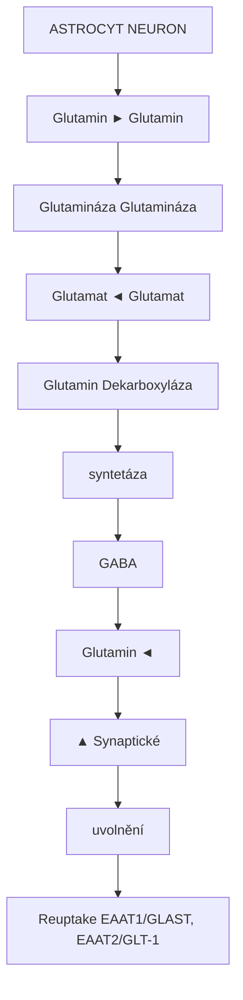
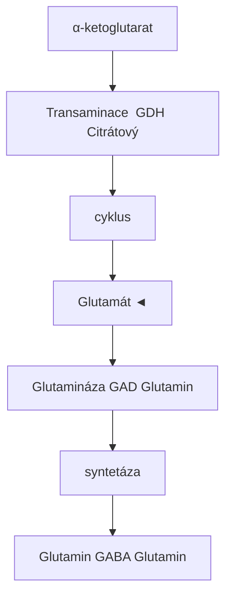
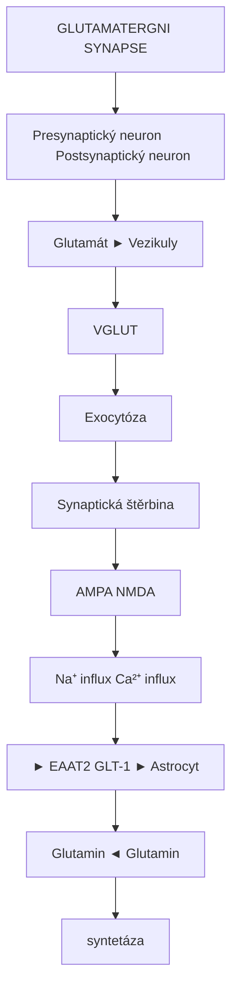
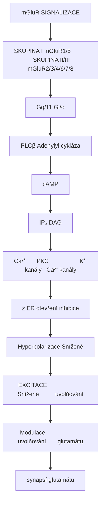
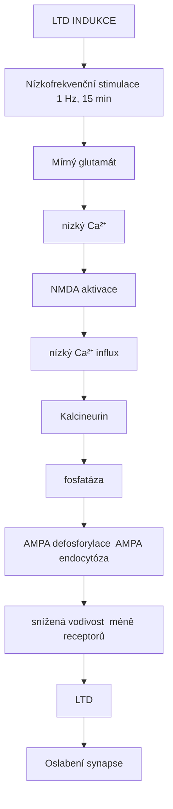
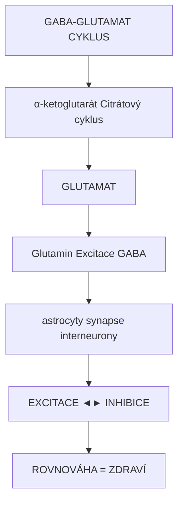

+++
title = "Glutamat"
description = "Kyselina glutamova - hlavni excitacni neurotransmiter CNS, klicovy pro pamet a plasticitu"
weight = 3
insert_anchor_links = "right"

[taxonomies]
kategorie = ["neurotransmitery", "aminokyseliny", "excitacni-system"]
systemy = ["glutamatergni", "CNS"]
souvisejici_latky = ["ketamin", "PCP", "ibotenova-kyselina", "NMDA"]
+++

# Glutamat - Hlavni excitacni neurotransmiter

**Glutamat** (L-glutamova kyselina, L-Glu) je **hlavni excitacni neurotransmiter** v centralnim nervovem systemu savcu. Zprostredkovava priblizne **80-90% vsech excitacnich synapsi** v mozku a hraje klicovou roli v synaptické plasticitě, uceni, pameti a neurologickém vývoji. Je cílem disociativních látek (ketamin, PCP) a prekurzorem inhibicního neurotransmiteru [GABA](@/glossary/gaba.md).

---

## Zakladni informace

| Vlastnost | Hodnota |
|-----------|---------|
| **Chemicky nazev** | Kyselina L-2-aminoglutarova |
| **Molekularni vzorec** | C5H9NO4 |
| **Molekularni hmotnost** | 147,13 g/mol |
| **CAS cislo** | 56-86-0 |
| **Funkce** | Excitacni neurotransmiter |
| **Prekurzor** | Glutamin, alfa-ketoglutarat |
| **Metabolit** | [GABA](@/glossary/gaba.md), glutamin |

---

## Chemicka struktura

```
        COOH
         |
    H2N-CH
         |
        CH2
         |
        CH2
         |
        COOH

    L-Glutamova kyselina
    (alfa-aminodikarboxylova kyselina)
```

### Fyzikalne-chemicke vlastnosti

| Vlastnost | Hodnota |
|-----------|---------|
| **pKa (alfa-COOH)** | 2,19 |
| **pKa (gama-COOH)** | 4,25 |
| **pKa (amino)** | 9,67 |
| **Izoelektricky bod** | 3,22 |
| **Rozpustnost ve vode** | 8,6 g/L (25°C) |

---

## Biosynteza a metabolismus

### Glutamat-glutaminovy cyklus



<details>
<summary>ASCII verze diagramu</summary>

```
                    ASTROCYT                          NEURON
            ┌──────────────────────┐         ┌──────────────────────┐
            │                      │         │                      │
            │     Glutamin         │ ──────► │     Glutamin         │
            │        │             │         │        │             │
            │        │ Glutamináza │         │        │ Glutamináza │
            │        ↓             │         │        ↓             │
            │     Glutamat ◄───────│─────────│───  Glutamat         │
            │        │             │         │        │             │
            │        │ Glutamin    │         │        │ Dekarboxyláza
            │        │ syntetáza   │         │        ↓             │
            │        ↓             │         │     [GABA]           │
            │     Glutamin ◄───────│─────────│                      │
            │                      │         │        │             │
            └──────────────────────┘         │        ↓             │
                      ▲                      │   Synaptické         │
                      │                      │   uvolnění           │
                      │                      └──────────────────────┘
                      │
            Reuptake (EAAT1/GLAST, EAAT2/GLT-1)
```

</details>

### Klicove enzymy

| Enzym | Funkce | Lokalizace |
|-------|--------|------------|
| **Glutamináza** | Glutamin → Glutamat | Mitochondrie neuronu |
| **Glutamin syntetáza** | Glutamat → Glutamin | Astrocyty (výhradně) |
| **GAD65/67** | Glutamat → [GABA](@/glossary/gaba.md) | GABAergní neurony |
| **Aminotransferázy** | Reverzibilní konverze | Mitochondrie |
| **Glutamat dehydrogenáza** | Oxidativní deaminace | Mitochondrie |

### Metabolicke drahy



<details>
<summary>ASCII verze diagramu</summary>

```
                         α-ketoglutarat
                              │
                    ┌─────────┼─────────┐
                    │         │         │
              Transaminace  GDH    Citrátový
                    │         │     cyklus
                    ↓         ↓         │
               Glutamát ◄─────┘         │
                    │                   │
         ┌──────────┼──────────┐        │
         │          │          │        │
    Glutamináza   GAD     Glutamin      │
         │          │     syntetáza     │
         ↓          ↓          ↓        │
    Glutamin    [GABA]    Glutamin      │
         │                     │        │
         └─────────────────────┴────────┘
```

</details>

---

## Transportery glutamatu

### Excitacni aminokyselinove transportery (EAAT)

| Transporter | Gen | Lokalizace | Funkce |
|-------------|-----|------------|--------|
| **EAAT1 (GLAST)** | SLC1A3 | Astrocyty | Primární clearance |
| **EAAT2 (GLT-1)** | SLC1A2 | Astrocyty | 90% reuptake |
| **EAAT3 (EAAC1)** | SLC1A1 | Neurony | Neuronální uptake |
| **EAAT4** | SLC1A6 | Purkinje buňky | Cerebellární |
| **EAAT5** | SLC1A7 | Retina | Fotoreceptory |

### Vezikulární transportéry

| Transporter | Funkce | Mechanismus |
|-------------|--------|-------------|
| **VGLUT1** | Kortikální synapse | H⁺ antiport |
| **VGLUT2** | Subkortikální | H⁺ antiport |
| **VGLUT3** | Serotoninergní, cholinergní | Ko-transmise |



<details>
<summary>ASCII verze diagramu</summary>

```
                GLUTAMATERGNI SYNAPSE

    Presynaptický neuron              Postsynaptický neuron
         │                                  │
    ┌────┴────────────────────────────────┴────┐
    │                                          │
    │   Glutamát ──► Vezikuly                  │
    │      │            │                      │
    │      │         VGLUT                     │
    │      │            │                      │
    │      │            ↓                      │
    │      │      Exocytóza                    │
    │      │            │                      │
    │      ↓            ↓                      │
    │  ═══════════════════════════════════════ │ Synaptická štěrbina
    │      │                                   │
    │      │        ┌──────┐    ┌──────┐      │
    │      │        │ AMPA │    │[NMDA]│      │
    │      │        └──┬───┘    └──┬───┘      │
    │      │           │           │          │
    │      │        Na⁺ influx  Ca²⁺ influx   │
    │      │                                   │
    │      └──► EAAT2 (GLT-1) ──► Astrocyt    │
    │                    │                     │
    │               Glutamin ◄── Glutamin      │
    │                          syntetáza       │
    └──────────────────────────────────────────┘
```

</details>

---

## Receptory pro glutamat

### Prehled

| Typ | Podtypy | Mechanismus | Funkce |
|-----|---------|-------------|--------|
| **Ionotropní** | [NMDA](@/receptors/nmda.md), AMPA, Kainátový | Iontový kanál | Rychlá excitace |
| **Metabotropní** | mGluR1-8 | G-protein | Modulace |

---

## Ionotropni receptory

### [NMDA receptor](@/receptors/nmda.md)

| Vlastnost | Hodnota |
|-----------|---------|
| **Struktura** | Tetramer (GluN1 + GluN2A-D) |
| **Iony** | Ca²⁺, Na⁺ (influx), K⁺ (eflux) |
| **Koagonisty** | Glutamát + Glycin/D-serin |
| **Napěťová závislost** | Mg²⁺ blokáda při klidovém potenciálu |
| **Kinetika** | Pomalá (τ = 50-500 ms) |

#### Jedinecne vlastnosti NMDA receptoru

```mermaid
flowchart TD
    node_ProaktivaciNMDArecep["Pro aktivaci NMDA receptoru jsou potreba TRI podminky:"]
    node_1GLUTAMAT2GLYCINDSER["1. GLUTAMAT            2. GLYCIN/D-SERIN       3. DEPOLARIZACE"]
    node_presynaptickkoagonis["presynaptický        ko-agonista           Mg²⁺ odstranění"]
    node_NMDAAKTIVACE["NMDA AKTIVACE"]
    node_CaINFLUX["Ca²⁺ INFLUX"]
    node_LTPLTD["LTP      LTD"]
    node_zeslenzeslaben["zesílenízeslabení"]
    node_NMDAreceptorANDgatek["NMDA receptor = 'AND gate' koincidentni detektor"]

    node_ProaktivaciNMDArecep --> node_1GLUTAMAT2GLYCINDSER
    node_1GLUTAMAT2GLYCINDSER --> node_presynaptickkoagonis
    node_presynaptickkoagonis --> node_NMDAAKTIVACE
    node_NMDAAKTIVACE --> node_CaINFLUX
    node_CaINFLUX --> node_LTPLTD
    node_LTPLTD --> node_zeslenzeslaben
    node_zeslenzeslaben --> node_NMDAreceptorANDgatek

    click node_ProaktivaciNMDArecep "/receptors/nmda/" "Pro aktivaci NMDA receptoru jsou potreba TRI podminky:"
    click node_NMDAAKTIVACE "/receptors/nmda/" "NMDA AKTIVACE"
    click node_NMDAreceptorANDgatek "/receptors/nmda/" "NMDA receptor = "AND gate" koincidentni detektor"
```

<details>
<summary>ASCII verze diagramu</summary>

```
Pro aktivaci NMDA receptoru jsou potreba TRI podminky:

1. GLUTAMAT            2. GLYCIN/D-SERIN       3. DEPOLARIZACE
   (presynaptický)        (ko-agonista)           (Mg²⁺ odstranění)
        │                      │                        │
        └──────────────────────┼────────────────────────┘
                               │
                               ↓
                    ┌─────────────────────┐
                    │   NMDA AKTIVACE     │
                    │        │            │
                    │        ↓            │
                    │   Ca²⁺ INFLUX       │
                    │        │            │
                    │   ┌────┴────┐       │
                    │   ↓         ↓       │
                    │  LTP      LTD       │
                    │(zesílení)(zeslabení)│
                    └─────────────────────┘

NMDA receptor = "AND gate" (koincidentni detektor)
```

</details>

#### Farmakologie NMDA receptoru

| Misto | Ligandy | Ucel |
|-------|---------|------|
| **Glutamátové** | Glutamát, NMDA, [Ibotenová k.](@/neurotoxins/ibotenic-acid.md) | Agonisté |
| **Glycinové** | Glycin, D-serin | Ko-agonisté |
| **Kanálové** | Ketamin, PCP, MK-801, Memantine | Antagonisté |
| **Polyaminové** | Spermin, Ifenprodil (GluN2B) | Modulátory |
| **Mg²⁺** | Mg²⁺ ionty | Napěťově závislá blokáda |

### AMPA receptor

| Vlastnost | Hodnota |
|-----------|---------|
| **Struktura** | Tetramer (GluA1-4) |
| **Iony** | Na⁺ (primárně), K⁺ |
| **Kinetika** | Rychlá (τ = 1-5 ms) |
| **Funkce** | Rychlá synaptická transmise |

#### Podjednotky AMPA receptoru

| Podjednotka | Vlastnost | Klinický význam |
|-------------|-----------|-----------------|
| **GluA1** | Ca²⁺ permeabilní (bez GluA2) | Synaptická plasticita |
| **GluA2** | Impermeabilní pro Ca²⁺ (Q/R editing) | Neuroprotekce |
| **GluA3** | Konstitutivní exprese | Bazální transmise |
| **GluA4** | Rychlá kinetika | Interneurony |

```mermaid
flowchart TD
    node_AMPAvsNMDAaktivace["AMPA vs NMDA aktivace:"]
    node_Membrnovpotencil["Membránový potenciál"]
    node_Klidov70mV["Klidový -70 mV ►"]
    node_AMPAaktivnihned["AMPA:  aktivní ihned"]
    node_NMDAblokovnMg["NMDA:          blokován Mg²⁺"]
    node_AMPAdepolarizace["AMPA depolarizace"]
    node_odstraniMg["odstrani Mg²⁺"]
    node_NMDAaktivn["NMDA aktivní"]
    node_Depolarizovan["Depolarizovaný"]
    node_20mV["-20 mV"]
    node_SEKVENCE["SEKVENCE:"]
    node_1GlutamtAMPAaktivace["1. Glutamát  AMPA aktivace  rychlá depolarizace"]
    node_2DepolarizaceMgodstr["2. Depolarizace  Mg²⁺ odstranen z NMDA"]
    node_3GlutamtGlycinDepola["3. Glutamát + Glycin + Depolarizace  NMDA aktivace"]
    node_4CainfluxLTPLTD["4. Ca²⁺ influx  LTP/LTD"]

    node_AMPAvsNMDAaktivace --> node_Membrnovpotencil
    node_Membrnovpotencil --> node_Klidov70mV
    node_Klidov70mV --> node_AMPAaktivnihned
    node_AMPAaktivnihned --> node_NMDAblokovnMg
    node_NMDAblokovnMg --> node_AMPAdepolarizace
    node_AMPAdepolarizace --> node_odstraniMg
    node_odstraniMg --> node_NMDAaktivn
    node_NMDAaktivn --> node_Depolarizovan
    node_Depolarizovan --> node_20mV
    node_20mV --> node_SEKVENCE
    node_SEKVENCE --> node_1GlutamtAMPAaktivace
    node_1GlutamtAMPAaktivace --> node_2DepolarizaceMgodstr
    node_2DepolarizaceMgodstr --> node_3GlutamtGlycinDepola
    node_3GlutamtGlycinDepola --> node_4CainfluxLTPLTD

    click node_AMPAvsNMDAaktivace "/receptors/nmda/" "AMPA vs NMDA aktivace:"
    click node_NMDAblokovnMg "/receptors/nmda/" "NMDA:          blokován Mg²⁺"
    click node_NMDAaktivn "/receptors/nmda/" "NMDA aktivní"
    click node_2DepolarizaceMgodstr "/receptors/nmda/" "2. Depolarizace  Mg²⁺ odstranen z NMDA"
    click node_3GlutamtGlycinDepola "/receptors/nmda/" "3. Glutamát + Glycin + Depolarizace  NMDA aktivace"
```



<details>
<summary>ASCII verze diagramu</summary>

```
AMPA vs NMDA aktivace:

                    Membránový potenciál
                           │
    Klidový (-70 mV) ──────┼────────────────────►
                           │
    AMPA: ━━━━━━━━━━━━━━━━│━━━━━━━━━━━━━━━━━━━━ (aktivní ihned)
                           │
    NMDA: ─ ─ ─ ─ ─ ─ ─ ─ │═══════════════════ (blokován Mg²⁺)
                           │     ↑
                           │     │
                           │  AMPA depolarizace
                           │  odstrani Mg²⁺
                           │     │
                           │     ↓
                    ═══════│═══════════════════ NMDA aktivní
                           │
    Depolarizovaný         │
    (-20 mV)               │

SEKVENCE:
1. Glutamát → AMPA aktivace → rychlá depolarizace
2. Depolarizace → Mg²⁺ odstranen z NMDA
3. Glutamát + Glycin + Depolarizace → NMDA aktivace
4. Ca²⁺ influx → LTP/LTD
```

</details>

### Kainatovy receptor

| Vlastnost | Hodnota |
|-----------|---------|
| **Struktura** | Tetramer (GluK1-5) |
| **Iony** | Na⁺, K⁺ |
| **Funkce** | Presynaptická modulace, mossy fibers |
| **Agonista** | Kainová kyselina (mořské řasy) |

---

## Metabotropni glutamatove receptory (mGluR)

### Klasifikace

| Skupina | Receptory | G-protein | Signál | Lokalizace |
|---------|-----------|-----------|--------|------------|
| **Skupina I** | mGluR1, mGluR5 | Gq/11 | PLC → IP₃ + DAG → Ca²⁺ | Postsynaptická |
| **Skupina II** | mGluR2, mGluR3 | Gi/o | cAMP ↓ | Presynaptická |
| **Skupina III** | mGluR4, mGluR6, mGluR7, mGluR8 | Gi/o | cAMP ↓ | Presynaptická |

### Signalni kaskady mGluR



<details>
<summary>ASCII verze diagramu</summary>

```
                    mGluR SIGNALIZACE

    SKUPINA I (mGluR1/5)            SKUPINA II/III (mGluR2/3/4/6/7/8)
         │                                    │
         ↓                                    ↓
        Gq/11                               Gi/o
         │                                    │
         ↓                                    ↓
        PLCβ                         Adenylyl cykláza ↓
         │                                    │
    ┌────┴────┐                              ↓
    ↓         ↓                          cAMP ↓
   IP₃       DAG                              │
    │         │                         ┌─────┴─────┐
    ↓         ↓                         ↓           ↓
  Ca²⁺       PKC                   K⁺ kanály   Ca²⁺ kanály
  z ER        │                   otevření     inhibice
    │         │                        │           │
    └────┬────┘                        ↓           ↓
         ↓                       Hyperpolarizace  Snížené
   EXCITACE                      Snížené          uvolňování
   Modulace                      uvolňování       glutamátu
   synapsí                       glutamátu
```

</details>

### Farmakologicke cilovani mGluR

| Receptor | Agonista | Antagonista | Terapeutický potenciál |
|----------|----------|-------------|------------------------|
| **mGluR1** | DHPG | LY367385 | Bolest, neurodegenerace |
| **mGluR2** | LY379268 | LY341495 | Schizofrenie, úzkost |
| **mGluR3** | LY379268 | - | Neuroprotekce |
| **mGluR5** | CHPG | MPEP, Fenobam | Fragilní X, závislosti |
| **mGluR7** | AMN082 | MMPIP | Úzkost, epilepsie |

---

## LTP a pamet

### Dlouhodoba potenciace (LTP)

```mermaid
flowchart TD
    node_LTPINDUKCE["LTP INDUKCE"]
    node_Vysokofrekvennstimul["Vysokofrekvenční stimulace 100 Hz"]
    node_Masivnglutamt["Masivní glutamát"]
    node_uvolnn["uvolnění"]
    node_AMPANMDA["AMPA   ►     NMDA"]
    node_aktivaceaktivace["aktivace        aktivace"]
    node_DepolarizaceCainflux["Depolarizace      Ca²⁺ influx"]
    node_CaMKII["CaMKII"]
    node_aktivace["aktivace"]
    node_AMPAfosforylaceAMPAi["AMPA fosforylace   AMPA inserze"]
    node_zvenvodivostvcerecep["zvýšená vodivost  více receptorů"]
    node_RANLTP["RANÁ LTP"]
    node_3060min["30-60 min"]
    node_CREBGenovexprese["CREB  Genová exprese"]
    node_POZDNLTP["POZDNÍ LTP"]
    node_hodinydny["hodiny-dny"]
    node_Strukturlnzmny["Strukturální změny"]

    node_LTPINDUKCE --> node_Vysokofrekvennstimul
    node_Vysokofrekvennstimul --> node_Masivnglutamt
    node_Masivnglutamt --> node_uvolnn
    node_uvolnn --> node_AMPANMDA
    node_AMPANMDA --> node_aktivaceaktivace
    node_aktivaceaktivace --> node_DepolarizaceCainflux
    node_DepolarizaceCainflux --> node_CaMKII
    node_CaMKII --> node_aktivace
    node_aktivace --> node_AMPAfosforylaceAMPAi
    node_AMPAfosforylaceAMPAi --> node_zvenvodivostvcerecep
    node_zvenvodivostvcerecep --> node_RANLTP
    node_RANLTP --> node_3060min
    node_3060min --> node_CREBGenovexprese
    node_CREBGenovexprese --> node_POZDNLTP
    node_POZDNLTP --> node_hodinydny
    node_hodinydny --> node_Strukturlnzmny

    click node_AMPANMDA "/receptors/nmda/" "AMPA   ►     NMDA"
    click node_zvenvodivostvcerecep "/glossary/receptor/" "zvýšená vodivost  více receptorů"
```



<details>
<summary>ASCII verze diagramu</summary>

```
                    LTP INDUKCE

    Vysokofrekvenční stimulace (100 Hz)
                    │
                    ↓
        ┌──────────────────────┐
        │   Masivní glutamát   │
        │    uvolnění          │
        └──────────┬───────────┘
                   │
          ┌────────┴────────┐
          ↓                 ↓
    ┌──────────┐      ┌──────────┐
    │   AMPA   │──►   │  [NMDA]  │
    │ aktivace │      │ aktivace │
    └────┬─────┘      └────┬─────┘
         │                 │
         ↓                 ↓
    Depolarizace      Ca²⁺ influx
         │                 │
         └────────┬────────┘
                  ↓
        ┌──────────────────────┐
        │       CaMKII         │
        │     aktivace         │
        └──────────┬───────────┘
                   │
          ┌────────┴────────┐
          ↓                 ↓
    AMPA fosforylace   AMPA inserze
    (zvýšená vodivost)  (více receptorů)
                   │
                   ↓
        ┌──────────────────────┐
        │      RANÁ LTP        │
        │    (30-60 min)       │
        └──────────┬───────────┘
                   │
                   ↓
        CREB → Genová exprese
                   │
                   ↓
        ┌──────────────────────┐
        │     POZDNÍ LTP       │
        │   (hodiny-dny)       │
        │  Strukturální změny  │
        └──────────────────────┘
```

</details>

### Faze LTP

| Faze | Casovy ramec | Mechanismus | Zavisla na |
|------|--------------|-------------|------------|
| **Rána LTP** | 30-60 min | Fosforylace, trafficking | Protein kinázy |
| **Pozdní LTP** | Hodiny-dny | Genová exprese, syntéza proteinů | CREB, BDNF |
| **Strukturální** | Dny-týdny | Nové spiny, synapse | Aktinová přestavba |

### Dlouhodoba deprese (LTD)



<details>
<summary>ASCII verze diagramu</summary>

```
                    LTD INDUKCE

    Nízkofrekvenční stimulace (1 Hz, 15 min)
                    │
                    ↓
        ┌──────────────────────┐
        │   Mírný glutamát     │
        │    (nízký Ca²⁺)      │
        └──────────┬───────────┘
                   │
                   ↓
        ┌──────────────────────┐
        │   [NMDA] aktivace    │
        │  (nízký Ca²⁺ influx) │
        └──────────┬───────────┘
                   │
                   ↓
        ┌──────────────────────┐
        │     Kalcineurin      │
        │    (fosfatáza)       │
        └──────────┬───────────┘
                   │
          ┌────────┴────────┐
          ↓                 ↓
    AMPA defosforylace  AMPA endocytóza
    (snížená vodivost)  (méně receptorů)
                   │
                   ↓
        ┌──────────────────────┐
        │         LTD          │
        │   Oslabení synapse   │
        └──────────────────────┘
```

</details>

### LTP vs LTD: rozhodujici faktor

| Parametr | LTP | LTD |
|----------|-----|-----|
| **Frekvence stimulace** | Vysoká (50-100 Hz) | Nízká (1-5 Hz) |
| **Ca²⁺ koncentrace** | Vysoká | Nízká-střední |
| **Aktivovaná kináza** | CaMKII | Kalcineurin |
| **AMPA trafficking** | Inserze | Endocytóza |
| **Výsledek** | Zesílení | Zeslabení |

---

## Excitotoxicita

### Mechanismus poskozeni

```mermaid
flowchart TD
    node_EXCITOTOXICKKASKDA["EXCITOTOXICKÁ KASKÁDA"]
    node_IschmieTraumaIboteno["Ischémie / Trauma / Ibotenová k.@/neurotoxins/ibotenic-acid.md"]
    node_ATPNaK["ATP   Na⁺/K⁺"]
    node_ATPzaselhv["ATPáza selhává"]
    node_Membrnov["Membránová"]
    node_depolarizace["depolarizace"]
    node_Masivnglutamt["Masivní glutamát"]
    node_uvolnn["uvolnění"]
    node_NMDAaktivaceAMPAakti["NMDA aktivace    AMPA aktivace"]
    node_CainfluxDepolarizace["Ca²⁺ influx  Depolarizace"]
    node_masivn["masivní"]
    node_ProtezyLipzyEndonukl["Proteázy Lipázy  Endonukleázy  Mitochondrie"]
    node_calpainyPLACADmPTPot["calpainyPLA₂     CAD    mPTP otevření"]
    node_CytoskeletMembrnyDNA["Cytoskelet Membrány   DNA       Cytochrom c"]
    node_rozpadoxidacefragmen["rozpad   oxidace  fragmentace"]
    node_NEKRZAAPOPTZA["NEKRÓZA          APOPTÓZA"]
    node_rychlsmrtprogramovan["rychlá smrt    programovaná"]

    node_EXCITOTOXICKKASKDA --> node_IschmieTraumaIboteno
    node_IschmieTraumaIboteno --> node_ATPNaK
    node_ATPNaK --> node_ATPzaselhv
    node_ATPzaselhv --> node_Membrnov
    node_Membrnov --> node_depolarizace
    node_depolarizace --> node_Masivnglutamt
    node_Masivnglutamt --> node_uvolnn
    node_uvolnn --> node_NMDAaktivaceAMPAakti
    node_NMDAaktivaceAMPAakti --> node_CainfluxDepolarizace
    node_CainfluxDepolarizace --> node_masivn
    node_masivn --> node_ProtezyLipzyEndonukl
    node_ProtezyLipzyEndonukl --> node_calpainyPLACADmPTPot
    node_calpainyPLACADmPTPot --> node_CytoskeletMembrnyDNA
    node_CytoskeletMembrnyDNA --> node_rozpadoxidacefragmen
    node_rozpadoxidacefragmen --> node_NEKRZAAPOPTZA
    node_NEKRZAAPOPTZA --> node_rychlsmrtprogramovan

    click node_IschmieTraumaIboteno "/neurotoxins/ibotenic-acid/" "Ischémie / Trauma / Ibotenová k.@/neurotoxins/ibotenic-acid.md"
    click node_NMDAaktivaceAMPAakti "/receptors/nmda/" "NMDA aktivace    AMPA aktivace"
```



<details>
<summary>ASCII verze diagramu</summary>

```
                EXCITOTOXICKÁ KASKÁDA

    Ischémie / Trauma / [Ibotenová k.](@/neurotoxins/ibotenic-acid.md)
                    │
                    ↓
        ┌──────────────────────┐
        │   ATP ↓ → Na⁺/K⁺    │
        │   ATPáza selhává    │
        └──────────┬───────────┘
                   │
                   ↓
        ┌──────────────────────┐
        │   Membránová         │
        │   depolarizace       │
        └──────────┬───────────┘
                   │
                   ↓
        ┌──────────────────────┐
        │   Masivní glutamát   │
        │   uvolnění           │
        └──────────┬───────────┘
                   │
          ┌────────┴────────┐
          ↓                 ↓
     NMDA aktivace    AMPA aktivace
          │                 │
          ↓                 ↓
    Ca²⁺ influx ←──── Depolarizace
    (masivní)
          │
    ┌─────┼─────────┬─────────┐
    ↓     ↓         ↓         ↓
 Proteázy Lipázy  Endonukleázy  Mitochondrie
(calpainy)(PLA₂)     (CAD)    (mPTP otevření)
    │     │         │              │
    ↓     ↓         ↓              ↓
Cytoskelet Membrány   DNA       Cytochrom c
 rozpad   oxidace  fragmentace    │
    │         │         │         ↓
    └─────────┴─────────┴─────────┘
                   │
          ┌────────┴────────┐
          ↓                 ↓
       NEKRÓZA          APOPTÓZA
    (rychlá smrt)    (programovaná)
```

</details>

### Klinicke stavy spojene s excitotoxicitou

| Stav | Mechanismus | Glutamátová patologie |
|------|-------------|----------------------|
| **Ischémie mozku** | ATP↓ → reuptake↓ | Akumulace glutamátu |
| **Traumatické poranění** | Mechanické poškození | Uvolnění z buněk |
| **Epilepsie** | Opakovaná excitace | NMDA hyperaktivace |
| **ALS** | EAAT2 dysfunkce | Chronická excitotoxicita |
| **Huntingtonova choroba** | Striatální vulnerabilita | Nadměrná NMDA aktivace |
| **Alzheimerova choroba** | Amyloid → glutamát | Synaptická dysfunkce |

### Neuroprotektivní strategie

| Přístup | Mechanismus | Klinický status |
|---------|-------------|-----------------|
| **NMDA antagonisté** | Blokáda Ca²⁺ influxu | Memantine (schváleno pro AD) |
| **GluN2B selektivní** | Cílená blokáda | Ve vývoji |
| **mGluR2/3 agonisté** | Snížení uvolňování | Fáze II studie |
| **Hypothermie** | Snížení metabolismu | Standard v ischémii |
| **Mg²⁺ suplementace** | Fyziologická blokáda | Preventivní |

---

## Spojeni s psychoaktivnimi latkami

### Disociativa - NMDA antagoniste

| Latka | Ki (nM) | Mechanismus | Ucinek |
|-------|---------|-------------|--------|
| **Ketamin** | 500-1000 | Kanálový blokátor | Disociace, antideprese |
| **PCP (fencyklidin)** | 50-100 | Kanálový blokátor | Silná disociace |
| **MK-801 (dizocilpin)** | 2-5 | Vysokoafinitní blokátor | Pouze výzkum |
| **Memantine** | 500-1000 | Nízkoafinitní blokátor | Alzheimerova choroba |
| **Dextrometorfan** | 1000+ | Neselektivní | Antitusikum, rekreační |

#### Ketamin - mechanismus antidepresivniho ucinku

```mermaid
flowchart TD
    node_KETAMINOVANTIDEPRESI["KETAMINOVÝ ANTIDEPRESIVNÍ MECHANISMUS"]
    node_Ketaminsubanestetick["Ketamin subanestetická dávka"]
    node_NMDAblokda["NMDA blokáda"]
    node_GABAergninter["GABAergní inter-"]
    node_neurony["neurony"]
    node_Disinhibice["Disinhibice"]
    node_pyramidovch["pyramidových"]
    node_neuron["neuronů"]
    node_Glutamtov["Glutamátový"]
    node_burst["'burst'"]
    node_AMPAaktivace["AMPA aktivace"]
    node_nonNMDA["non-NMDA"]
    node_BDNFuvolnn["BDNF uvolnění"]
    node_TrkBaktivace["TrkB aktivace"]
    node_mTORsignalizace["mTOR signalizace"]
    node_SYNAPTOGENEZE["SYNAPTOGENEZE"]
    node_hodinydny["hodiny-dny"]
    node_Novspiny["Nové spiny"]
    node_Novsynapse["Nové synapse"]
    node_Zvenkonektivita["Zvýšená konektivita"]
    node_ANTIDEPRESIVN["ANTIDEPRESIVNÍ"]
    node_INEK["ÚČINEK"]
    node_rychlnstup["rychlý nástup"]

    node_KETAMINOVANTIDEPRESI --> node_Ketaminsubanestetick
    node_Ketaminsubanestetick --> node_NMDAblokda
    node_NMDAblokda --> node_GABAergninter
    node_GABAergninter --> node_neurony
    node_neurony --> node_Disinhibice
    node_Disinhibice --> node_pyramidovch
    node_pyramidovch --> node_neuron
    node_neuron --> node_Glutamtov
    node_Glutamtov --> node_burst
    node_burst --> node_AMPAaktivace
    node_AMPAaktivace --> node_nonNMDA
    node_nonNMDA --> node_BDNFuvolnn
    node_BDNFuvolnn --> node_TrkBaktivace
    node_TrkBaktivace --> node_mTORsignalizace
    node_mTORsignalizace --> node_SYNAPTOGENEZE
    node_SYNAPTOGENEZE --> node_hodinydny
    node_hodinydny --> node_Novspiny
    node_Novspiny --> node_Novsynapse
    node_Novsynapse --> node_Zvenkonektivita
    node_Zvenkonektivita --> node_ANTIDEPRESIVN
    node_ANTIDEPRESIVN --> node_INEK
    node_INEK --> node_rychlnstup

    click node_NMDAblokda "/receptors/nmda/" "NMDA blokáda"
    click node_GABAergninter "/glossary/gaba/" "GABAergní inter-"
    click node_nonNMDA "/receptors/nmda/" "non-NMDA"
```



<details>
<summary>ASCII verze diagramu</summary>

```
        KETAMINOVÝ ANTIDEPRESIVNÍ MECHANISMUS

    Ketamin (subanestetická dávka)
                    │
                    ↓
        ┌──────────────────────┐
        │   NMDA blokáda       │
        │   (GABAergní inter-  │
        │    neurony)          │
        └──────────┬───────────┘
                   │
                   ↓
        ┌──────────────────────┐
        │   Disinhibice        │
        │   pyramidových       │
        │   neuronů            │
        └──────────┬───────────┘
                   │
                   ↓
        ┌──────────────────────┐
        │   Glutamátový        │
        │   "burst"            │
        └──────────┬───────────┘
                   │
                   ↓
        ┌──────────────────────┐
        │   AMPA aktivace      │
        │   (non-NMDA)         │
        └──────────┬───────────┘
                   │
                   ↓
        ┌──────────────────────┐
        │   BDNF uvolnění      │
        │        │             │
        │        ↓             │
        │   TrkB aktivace      │
        │        │             │
        │        ↓             │
        │   mTOR signalizace   │
        └──────────┬───────────┘
                   │
                   ↓
        ┌──────────────────────┐
        │   SYNAPTOGENEZE      │
        │   (hodiny-dny)       │
        │                      │
        │   Nové spiny         │
        │   Nové synapse       │
        │   Zvýšená konektivita│
        └──────────┬───────────┘
                   │
                   ↓
        ┌──────────────────────┐
        │   ANTIDEPRESIVNÍ     │
        │   ÚČINEK             │
        │   (rychlý nástup)    │
        └──────────────────────┘
```

</details>

### [Kyselina ibotenova](@/neurotoxins/ibotenic-acid.md) - NMDA agonista

| Vlastnost | Hodnota |
|-----------|---------|
| **Zdroj** | [Amanita muscaria](@/shrooms/amanita-muscaria.md) |
| **Afinita** | Ki ~ 200 nM (NMDA) |
| **Účinek** | Excitotoxicita → neuronální smrt |
| **Využití** | Experimentální léze mozku |

---

## Srovnani: Glutamat vs GABA

| Vlastnost | Glutamat | [GABA](@/glossary/gaba.md) |
|-----------|----------|------|
| **Funkce** | Excitační | Inhibiční |
| **Ionotropní receptory** | [NMDA](@/receptors/nmda.md), AMPA, Kainátový | [GABA-A](@/receptors/gaba-a.md) |
| **Metabotropní receptory** | mGluR1-8 | GABA-B |
| **Iony (ionotropní)** | Na⁺, Ca²⁺ (influx) | Cl⁻ (influx) |
| **Účinek na membránu** | Depolarizace | Hyperpolarizace |
| **Prekurzor/produkt** | Prekurzor GABA | Produkt glutamátu |
| **Synapse v CNS** | ~80% | ~20% |

### Metabolicka souvislost



<details>
<summary>ASCII verze diagramu</summary>

```
                GABA-GLUTAMAT CYKLUS

              α-ketoglutarát (Citrátový cyklus)
                        │
                        ↓
    ┌───────────────────────────────────────┐
    │              GLUTAMAT                 │
    │                  │                    │
    │    ┌─────────────┼─────────────┐      │
    │    ↓             ↓             ↓      │
    │ Glutamin    Excitace        [GABA]    │
    │ (astrocyty) (synapse)    (interneurony)│
    │                                        │
    │    EXCITACE ◄──────────► INHIBICE     │
    │                                        │
    │         ROVNOVÁHA = ZDRAVÍ            │
    └───────────────────────────────────────┘
```

</details>

---

## Klinicke aspekty

### Psychiatricke poruchy

| Porucha | Glutamátová dysfunkce | Potenciální terapie |
|---------|----------------------|---------------------|
| **Schizofrenie** | NMDA hypofunkce | mGluR2/3 agonisté |
| **Deprese** | Synaptická atrofie | Ketamin, esketamin |
| **PTSD** | Extinkce strachu | D-cykloserin (NMDA ko-agonista) |
| **OCD** | Kortikostriatální hyperaktivita | mGluR5 modulátory |
| **Závislosti** | Glutamátová dysregulace | N-acetylcystein |

### Neurologicke poruchy

| Porucha | Patologie | Léčba |
|---------|-----------|-------|
| **Alzheimerova choroba** | Glutamátová excitotoxicita | Memantine |
| **Parkinsonova choroba** | Striatální dysbalance | Amantadin |
| **Epilepsie** | Hyperexcitabilita | Perampanel (AMPA antagonista) |
| **ALS** | EAAT2 dysfunkce | Riluzol |
| **Migréna** | Kortikální šíření depolarizace | CGRP antagonisté |

### Schvalena leciva cilici glutamatovy system

| Léčivo | Cíl | Indikace |
|--------|-----|----------|
| **Memantine** | NMDA antagonista | Alzheimerova choroba |
| **Esketamin** | NMDA antagonista | Rezistentní deprese |
| **Perampanel** | AMPA antagonista | Epilepsie |
| **Riluzol** | Glutamát inhibitor | ALS |
| **Amantadin** | NMDA antagonista | Parkinsonova choroba |
| **D-cykloserin** | NMDA ko-agonista | Augmentace expoziční terapie |

---

## Vyzkumne metody

### In vitro

| Metoda | Měří | Využití |
|--------|------|---------|
| **Patch-clamp** | Iontové proudy | Receptorová charakterizace |
| **Ca²⁺ imaging** | Intracelulární Ca²⁺ | NMDA funkce |
| **Glutamát biosenzory** | Extracelulární glutamát | Uvolňování |
| **LTP/LTD protokoly** | Synaptická plasticita | Paměťové mechanismy |

### In vivo

| Metoda | Měří | Využití |
|--------|------|---------|
| **Mikrodialýza** | Extracelulární glutamát | Neurotransmise |
| **MRS (spektroskopie)** | Glu/Gln poměr | Metabolismus in vivo |
| **fMRI** | BOLD signál | Neuronální aktivita |
| **PET s [11C]ABP688** | mGluR5 dostupnost | Receptorové studie |

---

## Reference

1. Traynelis, S.F. et al. (2010). *Glutamate receptor ion channels: structure, regulation, and function*. Pharmacological Reviews.
2. Krystal, J.H. et al. (2019). *Ketamine: A paradigm shift for depression research and treatment*. Neuron.
3. Olney, J.W. (1969). *Brain lesions, obesity, and other disturbances in mice treated with monosodium glutamate*. Science.
4. Bliss, T.V. & Collingridge, G.L. (1993). *A synaptic model of memory: long-term potentiation in the hippocampus*. Nature.
5. Danbolt, N.C. (2001). *Glutamate uptake*. Progress in Neurobiology.
6. Niswender, C.M. & Bhattacharya, A. (2019). *Metabotropic glutamate receptors: physiology, pharmacology, and disease*. Annual Review of Pharmacology and Toxicology.
7. Hardingham, G.E. & Bading, H. (2010). *Synaptic versus extrasynaptic NMDA receptor signalling*. Nature Reviews Neuroscience.

---

## Viz take

### Receptory
- [NMDA receptor](@/receptors/nmda.md) - Klíčový ionotropní glutamátový receptor
- [GABA-A receptor](@/receptors/gaba-a.md) - Hlavní inhibiční receptor
- [5-HT2A receptor](@/receptors/5-ht2a.md) - Cíl psychedelik
- [Receptor - přehled](@/glossary/receptor.md) - Obecný pojem

### Neurotransmitery
- [GABA](@/glossary/gaba.md) - Hlavní inhibiční neurotransmiter (metabolit glutamátu)
- [Nukleotid](@/glossary/nukleotid.md) - Stavební jednotky signálních molekul
- [Fosfát](@/glossary/fosfat.md) - Klíčový pro signální transdukci

### Psychoaktivni latky
- [Kyselina ibotenová](@/neurotoxins/ibotenic-acid.md) - NMDA agonista, excitotoxin
- [Amanita muscaria](@/shrooms/amanita-muscaria.md) - Zdroj ibotenové kyseliny a muscimolu

### Dalsi pojmy
- [Receptor](@/glossary/receptor.md) - Kompletní průvodce receptorovou biologií

---

<- Zpět na [Glosář](@/glossary/_index.md)
