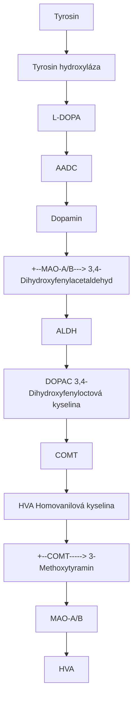
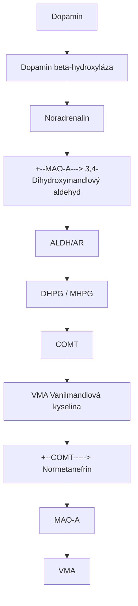
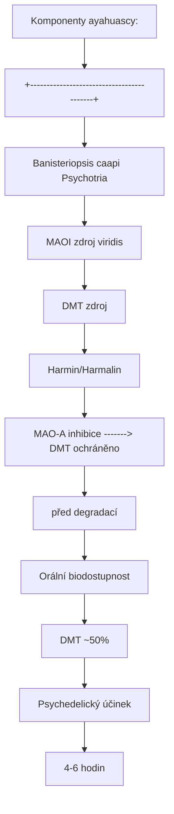
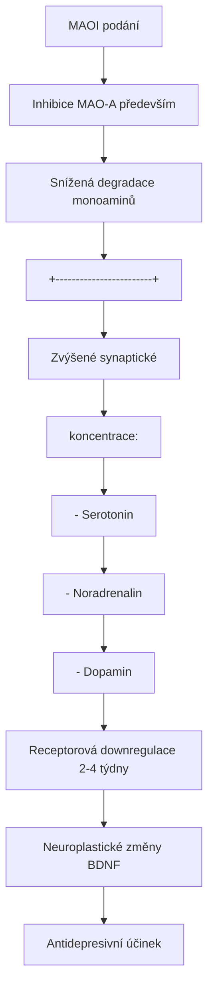
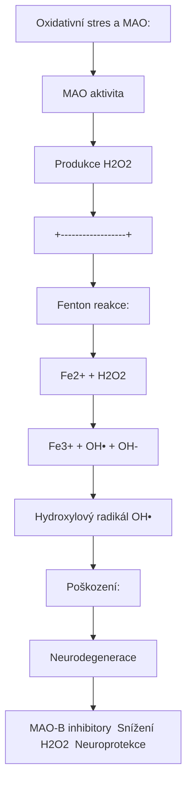

+++
title = "MAO (Monoaminooxidaza)"
description = "Monoaminooxidaza - klicovy enzym metabolismu neurotransmitery, MAO-A a MAO-B izoformy, MAOI a jejich vyznam pro psychedelika"
weight = 3
insert_anchor_links = "right"

[taxonomies]
kategorie = ["enzymy", "neurochemie", "farmakologie"]
systemy = ["serotonergni", "dopaminergni", "noradrenergni"]
souvisejici_latky = ["dmt", "harmin", "harmalin", "ayahuasca"]
+++

# MAO - Monoaminooxidaza

**Monoaminooxidaza** (MAO) je klicovy mitochondrialni enzym zodpovedny za oxidativni deaminaci monoaminovych neurotransmiteru a xenobiotik. Existuji dve izoformy - **MAO-A** a **MAO-B** - s odlisnou substratovou specificitou a tkanova distribucou. MAO hraje zasadni roli v psychofarmakologii, nebot jeji inhibice umoznuje oralni aktivitu [DMT](@/alkaloids/dmt.md) v ayahuasce.

---

## Zakladni informace

| Vlastnost | Hodnota |
|-----------|---------|
| **Systematicky nazev** | Amin:kyslík oxidoreduktaza (deaminujici) |
| **EC cislo** | EC 1.4.3.4 |
| **Typ enzymu** | Flavoprotein (FAD-dependentni) |
| **Lokalizace** | Vnejsi mitochondrialni membrana |
| **Kofaktor** | FAD (flavin adenin dinukleotid) |
| **Mechanismus** | Oxidativni deaminace |
| **Produkty** | Aldehyd + NH3 + H2O2 |

### Reakcni mechanismus

```
R-CH2-NH2 + O2 + H2O → R-CHO + NH3 + H2O2
(Monoamin)              (Aldehyd)

Detailne:
1. Vazba substratu na FAD v aktivnim miste
2. Oxidace aminu na imin (Schiffova baze)
3. Hydrolýza iminu na aldehyd + amoniak
4. Reoxidace FADH2 kyslíkem za vzniku H2O2
```

---

## Izoformy MAO

### MAO-A

| Vlastnost | Hodnota |
|-----------|---------|
| **Gen** | MAOA (Xp11.3) |
| **Molekularni hmotnost** | 59,7 kDa |
| **Aminokyseliny** | 527 |
| **Tkanova distribuce** | Plice, placenta, GIT, jatra, mozek |
| **Mozkova lokalizace** | Noradrenergni a serotoninergni neurony |
| **Preferovane substráty** | Serotonin, noradrenalin, adrenalin, tyramin |
| **Selektivni inhibitor** | Clorgylin, moclobemid |

### MAO-B

| Vlastnost | Hodnota |
|-----------|---------|
| **Gen** | MAOB (Xp11.3) |
| **Molekularni hmotnost** | 58,8 kDa |
| **Aminokyseliny** | 520 |
| **Tkanova distribuce** | Trombocyty, jatra, mozek (glie) |
| **Mozkova lokalizace** | Astrocyty, serotoninergni neurony |
| **Preferovane substráty** | Fenylethylamin, benzylamin, dopamin |
| **Selektivni inhibitor** | Selegilin (deprenyl), rasagilin |

### Srovnani izoforem

| Parametr | MAO-A | MAO-B |
|----------|-------|-------|
| **Chromozomalni lokalizace** | Xp11.3 | Xp11.3 |
| **Sekvencni homologie** | 70% | 70% |
| **Primarni substrat v mozku** | Serotonin, NE | Dopamin, PEA |
| **Vek-zavisla zmena** | Stabilni | Narusta s vekem |
| **Reakce na stress** | Zvysena aktivita | Stabilni |
| **Asociace s psychiatrickymi poruchami** | Deprese, uzkost | Parkinsonova choroba |

---

## Substratova specificita

### Endogenni substráty

| Substrat | MAO-A | MAO-B | Produkt | Fyziologicky vyznam |
|----------|-------|-------|---------|---------------------|
| **[Serotonin](@/glossary/serotonin.md)** | +++ | + | 5-HIAA | Regulace nalady |
| **Noradrenalin** | +++ | + | MHPG/VMA | Stress, pozornost |
| **Adrenalin** | +++ | - | VMA | Stress |
| **Dopamin** | ++ | ++ | DOPAC/HVA | Odmena, motorika |
| **Tyramin** | +++ | + | p-Hydroxyfenylacetaldehyd | Potravni detoxikace |
| **Fenylethylamin (PEA)** | + | +++ | Fenylacetaldehyd | Nálada, energie |
| **Tryptamin** | +++ | + | Indol-3-acetaldehyd | (Stopove mnozstvi) |
| **Histamin** | + | - | Imidazol-4-acetaldehyd | (Minimalni) |

**Legenda**: +++ vysoka aktivita, ++ stredni, + nizka, - zadna

### Xenobiotika (exogenni substráty)

| Substrat | MAO-A | MAO-B | Zdroj | Relevance |
|----------|-------|-------|-------|-----------|
| **[DMT](@/alkaloids/dmt.md)** | +++ | + | Psychotria viridis | Ayahuasca |
| **5-MeO-DMT** | +++ | + | Bufo alvarius | Psychedelikum |
| **Tryptaminy obecne** | ++ - +++ | + | Ruzne | Psychedelika |
| **MPTP** | - | +++ | Kontaminant | Parkinsonismus |
| **Benzylamin** | - | +++ | Potraviny | Model substrat |

### Km hodnoty (afinita)

| Substrat | Km MAO-A (uM) | Km MAO-B (uM) |
|----------|---------------|---------------|
| Serotonin | 180-250 | 1500+ |
| Dopamin | 200-400 | 200-400 |
| Noradrenalin | 300-500 | 2000+ |
| Tyramin | 200-400 | 400-800 |
| Fenylethylamin | 1000+ | 5-20 |
| DMT | 13.7 | 500+ |

---

## Metabolismus neurotransmiteru

### Serotonin (5-HT)

```
Tryptofan
    |
    v [Tryptofan hydroxyláza]
5-Hydroxytryptofan (5-HTP)
    |
    v [AADC]
Serotonin (5-HT)
    |
    v [MAO-A] ← Primární degradační cesta
5-Hydroxyindolacetaldehyd
    |
    v [Aldehyd dehydrogenáza]
5-Hydroxyindoloctová kyselina (5-HIAA)
    |
    v
Vyloučení močí
```

### Dopamin



<details>
<summary>ASCII verze diagramu</summary>

```
Tyrosin
    |
    v [Tyrosin hydroxyláza]
L-DOPA
    |
    v [AADC]
Dopamin
    |
    +--[MAO-A/B]---> 3,4-Dihydroxyfenylacetaldehyd
    |                    |
    |                    v [ALDH]
    |               DOPAC (3,4-Dihydroxyfenyloctová kyselina)
    |                    |
    |                    v [COMT]
    |               HVA (Homovanilová kyselina)
    |
    +--[COMT]-----> 3-Methoxytyramin
                         |
                         v [MAO-A/B]
                    HVA
```

</details>

### Noradrenalin



<details>
<summary>ASCII verze diagramu</summary>

```
Dopamin
    |
    v [Dopamin beta-hydroxyláza]
Noradrenalin
    |
    +--[MAO-A]---> 3,4-Dihydroxymandlový aldehyd
    |                    |
    |                    v [ALDH/AR]
    |               DHPG / MHPG
    |                    |
    |                    v [COMT]
    |               VMA (Vanilmandlová kyselina)
    |
    +--[COMT]-----> Normetanefrin
                         |
                         v [MAO-A]
                    VMA
```

</details>

---

## Inhibitory monoaminooxidazy (MAOI)

### Klasifikace MAOI

| Typ | Charakteristika | Příklady |
|-----|-----------------|----------|
| **Ireverzibilní neselektivní** | Trvalá vazba, oba izoformy | Fenelzin, tranylcypromin, isokarboxazid |
| **Ireverzibilní MAO-A selektivní** | Trvalá vazba, MAO-A | Clorgylin |
| **Ireverzibilní MAO-B selektivní** | Trvalá vazba, MAO-B | Selegilin, rasagilin |
| **Reverzibilní MAO-A (RIMA)** | Kompetitivní, MAO-A | Moclobemid, harmin, harmalin |

### Farmaceutické MAOI

#### Ireverzibilní neselektivní

| Lék | Struktura | Indikace | Ki MAO-A | Ki MAO-B |
|-----|-----------|----------|----------|----------|
| **Fenelzin** | Hydrazin | Atypická deprese | 0.1 nM | 0.3 nM |
| **Tranylcypromin** | Cyklopropylamin | Rezistentní deprese | 0.5 nM | 1.0 nM |
| **Isokarboxazid** | Hydrazin | Deprese | 0.2 nM | 0.5 nM |

#### MAO-B selektivní (nízké dávky)

| Lék | Indikace | Dávka | Selektivita |
|-----|----------|-------|-------------|
| **Selegilin** | Parkinsonova choroba | 5-10 mg/den | MAO-B při nízkých dávkách |
| **Rasagilin** | Parkinsonova choroba | 0.5-1 mg/den | MAO-B |
| **Safinamid** | Parkinsonova choroba | 50-100 mg/den | MAO-B |

#### RIMA (Reverzibilní inhibitory MAO-A)

| Lék | Indikace | Ki MAO-A | Poznámka |
|-----|----------|----------|----------|
| **Moclobemid** | Deprese, sociální fobie | 3-6 uM | Nejbezpečnější MAOI |

### Přírodní MAOI - Harmala alkaloidy

#### Zdroje

| Rostlina | Část | Obsah alkaloidů | Použití |
|----------|------|-----------------|---------|
| **Banisteriopsis caapi** | Lodyha | 0.5-1.5% | Ayahuasca |
| **Peganum harmala** | Semena | 2-7% | Syrská routa |
| **Passiflora incarnata** | Listy | 0.01-0.1% | Mučenka |

#### Jednotlivé alkaloidy

| Alkaloid | Ki MAO-A | Ki MAO-B | Typ inhibice | Další účinky |
|----------|----------|----------|--------------|--------------|
| **Harmin** | 5-20 nM | 10-100 uM | Reverzibilní kompetitivní | 5-HT2A antagonista |
| **Harmalin** | 3-10 nM | 5-50 uM | Reverzibilní kompetitivní | Tremorogenní |
| **Tetrahydroharmin** | 50-100 nM | 500+ uM | Reverzibilní | SERT inhibitor |
| **Harmol** | 100-300 nM | 1+ uM | Reverzibilní | Metabolit |

#### Dávkování harmala alkaloidů

| Forma | Harmin + Harmalin | Účinek | Riziko |
|-------|-------------------|--------|--------|
| **Subprahová** | 25-50 mg | MAO inhibice | Nízké |
| **Lehká** | 50-100 mg | Sedace, snění | Střední |
| **Střední** | 100-200 mg | Vizuální změny | Vyšší |
| **Silná** | 200-400 mg | Halucinace | Vysoké |

---

## Ayahuasca a MAO inhibice

### Mechanismus účinku ayahuascy



<details>
<summary>ASCII verze diagramu</summary>

```
Komponenty ayahuascy:
+------------------------------------------+
|                                          |
|  Banisteriopsis caapi      Psychotria    |
|  (MAOI zdroj)              viridis       |
|       |                    (DMT zdroj)   |
|       v                         |        |
|  Harmin/Harmalin               |        |
|       |                         |        |
|       v                         v        |
|  MAO-A inhibice -------> DMT ochráněno  |
|                          před degradací  |
|                               |          |
|                               v          |
|                    Orální biodostupnost  |
|                          DMT (~50%)      |
|                               |          |
|                               v          |
|                    Psychedelický účinek  |
|                        (4-6 hodin)       |
+------------------------------------------+
```

</details>

### Farmakokinetika DMT s/bez MAOI

| Parametr | DMT samotné (orální) | DMT + MAOI |
|----------|----------------------|------------|
| **Biodostupnost** | ~0% (degradace) | ~50% |
| **Tmax** | N/A | 90-120 min |
| **Cmax** | Nedetekovatelné | 15-30 ng/mL |
| **Trvání** | N/A | 4-6 hodin |
| **t1/2** | N/A | ~2 hodiny |

### Srovnání cest podání DMT

| Cesta | Potřeba MAOI | Nástup | Trvání | Intenzita |
|-------|--------------|--------|--------|-----------|
| **Inhalace** | Ne | 15-60 s | 15-30 min | Extrémní |
| **IM injekce** | Ne | 2-5 min | 30-60 min | Velmi silná |
| **Ayahuasca** | Ano | 30-60 min | 4-6 h | Silná, postupná |
| **Pharmahuasca** | Ano | 30-60 min | 4-6 h | Silná |
| **Sublingvální** | Ne (částečně) | 10-20 min | 30-60 min | Střední |

---

## Interakce a bezpečnost

### Tyraminová reakce ("Cheese effect")

```
Tyramin v potravě (sýr, víno, uzené maso)
    |
    v
Normálně: MAO-A v GIT a játrech metabolizuje
    |
    v
S MAOI: Tyramin nedeaktivován
    |
    v
Vstup do systémové cirkulace
    |
    v
Uvolnění noradrenalinu ze sympatických zakončení
    |
    v
HYPERTENZNÍ KRIZE
- Silná bolest hlavy
- Hypertenze (až 200+ mmHg)
- Tachykardie
- Riziko mozkové příhody
```

### Potraviny bohaté na tyramin

| Kategorie | Příklady | Tyramin (mg/porce) | Riziko s MAOI |
|-----------|----------|-------------------|---------------|
| **Zrající sýry** | Čedar, Brie, Stilton | 20-100+ | Vysoké |
| **Fermentované** | Miso, sójová omáčka | 10-50 | Vysoké |
| **Uzené maso** | Salám, klobásy | 5-50 | Střední-vysoké |
| **Červené víno** | Chianti, Burgundy | 5-25 | Střední |
| **Pivo (některá)** | Kvasnicové pivo | 5-20 | Střední |
| **Avokádo** | Přezrálé | 5-20 | Střední |
| **Banány** | Přezrálé | 5-10 | Nízké-střední |
| **Čokoláda** | Hořká | 1-5 | Nízké |

### Bezpečná dieta s MAOI

| Povoleno | Zakázáno/Limitováno |
|----------|---------------------|
| Čerstvé maso | Zrající sýry |
| Čerstvé ryby | Uzené/nakládané maso |
| Mléko, tvaroh | Fermentované sójové produkty |
| Čerstvá zelenina | Přezrálé ovoce |
| Čerstvé ovoce | Kvasnicové pivo |
| Bílé víno (malé množství) | Červené víno |
| Čerstvý chléb | Extrakt z kvasnic (Marmite) |

### Serotoninový syndrom

```mermaid
flowchart TD
    node_MAOISerotonergnltka["MAOI + Serotonergní látka"]
    node_Nadmrnserotoninovakt["Nadměrná serotoninová aktivita"]
    node_8bcc77b8["+------------------------------------------+"]
    node_SEROTONINOVSYNDROM["SEROTONINOVÝ SYNDROM"]
    node_MRN["MÍRNÝ:"]
    node_Tespocen["- Třes, pocení"]
    node_Tachykardie["- Tachykardie"]
    node_Mydriza["- Mydriáza"]
    node_STEDN["STŘEDNÍ:"]
    node_Hypertermie3839C["- Hypertermie 38-39°C"]
    node_Hyperreflexieklonus["- Hyperreflexie, klonus"]
    node_Agitace["- Agitace"]
    node_TKIVOTOHROUJC["TĚŽKÝ ŽIVOT OHROŽUJÍCÍ:"]
    node_Hypertermie40C["- Hypertermie &gt;40°C"]
    node_Rigidita["- Rigidita"]
    node_Rabdomyolza["- Rabdomyolýza"]
    node_Selhnorgn["- Selhání orgánů"]
    node_Smrt["- Smrt"]

    node_MAOISerotonergnltka --> node_Nadmrnserotoninovakt
    node_Nadmrnserotoninovakt --> node_8bcc77b8
    node_8bcc77b8 --> node_SEROTONINOVSYNDROM
    node_SEROTONINOVSYNDROM --> node_MRN
    node_MRN --> node_Tespocen
    node_Tespocen --> node_Tachykardie
    node_Tachykardie --> node_Mydriza
    node_Mydriza --> node_STEDN
    node_STEDN --> node_Hypertermie3839C
    node_Hypertermie3839C --> node_Hyperreflexieklonus
    node_Hyperreflexieklonus --> node_Agitace
    node_Agitace --> node_TKIVOTOHROUJC
    node_TKIVOTOHROUJC --> node_Hypertermie40C
    node_Hypertermie40C --> node_Rigidita
    node_Rigidita --> node_Rabdomyolza
    node_Rabdomyolza --> node_Selhnorgn
    node_Selhnorgn --> node_Smrt

    click node_Nadmrnserotoninovakt "/glossary/serotonin/" "Nadměrná serotoninová aktivita"
    click node_SEROTONINOVSYNDROM "/glossary/serotonin/" "SEROTONINOVÝ SYNDROM"
```



<details>
<summary>ASCII verze diagramu</summary>

```
MAOI + Serotonergní látka
    |
    v
Nadměrná serotoninová aktivita
    |
    v
+------------------------------------------+
|         SEROTONINOVÝ SYNDROM              |
|                                           |
| MÍRNÝ:                                    |
| - Třes, pocení                            |
| - Tachykardie                             |
| - Mydriáza                                |
|                                           |
| STŘEDNÍ:                                  |
| - Hypertermie (38-39°C)                   |
| - Hyperreflexie, klonus                   |
| - Agitace                                 |
|                                           |
| TĚŽKÝ (ŽIVOT OHROŽUJÍCÍ):                 |
| - Hypertermie (>40°C)                     |
| - Rigidita                                |
| - Rabdomyolýza                            |
| - Selhání orgánů                          |
| - Smrt                                    |
+------------------------------------------+
```

</details>

### Nebezpečné kombinace s MAOI

| Látka | Riziko | Mechanismus | Závažnost |
|-------|--------|-------------|-----------|
| **SSRI** | Serotoninový syndrom | 5-HT toxicita | SMRTELNÉ |
| **SNRI** | Serotoninový syndrom | 5-HT + NE | SMRTELNÉ |
| **Tramadol** | Serotoninový syndrom | SERT inhibice | Vysoké |
| **Meperidin** | Serotoninový syndrom | 5-HT | SMRTELNÉ |
| **DXM** | Serotoninový syndrom | SERT | Vysoké |
| **MDMA** | Serotoninový syndrom | 5-HT uvolnění | VELMI VYSOKÉ |
| **Efedrin/pseudoefedrin** | Hypertenze | NE uvolnění | Střední |
| **Amfetaminy** | Hypertenze + SS | Katekolaminy | Vysoké |
| **Kokain** | Kardiotoxicita | NE reuptake | Vysoké |
| **Tyramin** | Hypertenzní krize | NE uvolnění | Střední-vysoké |

### Bezpečnostní protokol pro ayahuascu

#### Před ceremonií (2-4 týdny)

| Kategorie | Minimální wash-out |
|-----------|-------------------|
| SSRI (fluoxetin) | 5-6 týdnů |
| SSRI (ostatní) | 2-3 týdny |
| SNRI | 2-3 týdny |
| Tramadol | 1-2 týdny |
| MDMA | 1-2 týdny |
| 5-HTP | 1 týden |
| St. John's wort | 2 týdny |

#### Dieta (24-72 hodin před)

- Vyhýbat se fermentovaným potravinám
- Žádné zrající sýry
- Čerstvé potraviny
- Žádný alkohol
- Minimální kofein

---

## Klinické aplikace MAOI

### Psychiatrické indikace

| Indikace | MAOI | Účinnost | Poznámka |
|----------|------|----------|----------|
| **Atypická deprese** | Fenelzin | Vynikající | 1. volba pro atypickou |
| **Rezistentní deprese** | Tranylcypromin | Dobrá | Po selhání SSRI |
| **Sociální fobie** | Moclobemid | Dobrá | Bezpečnější varianta |
| **Panická porucha** | Fenelzin | Dobrá | S dietní restricí |
| **PTSD** | Fenelzin | Střední | Specifické případy |

### Neurologické indikace

| Indikace | MAOI | Mechanismus | Poznámka |
|----------|------|-------------|----------|
| **Parkinsonova choroba** | Selegilin | Zvýšení dopaminu | Adjuvans k L-DOPA |
| **Parkinsonova choroba** | Rasagilin | Zvýšení dopaminu | Monoterapie možná |
| **Alzheimerova choroba** | Selegilin | Neuroprotekce? | Výzkum |

### Mechanismus antidepresivního účinku MAOI



<details>
<summary>ASCII verze diagramu</summary>

```
MAOI podání
    |
    v
Inhibice MAO-A (především)
    |
    v
Snížená degradace monoaminů
    |
    v
+------------------------+
| Zvýšené synaptické     |
| koncentrace:           |
| - Serotonin ↑↑↑       |
| - Noradrenalin ↑↑↑    |
| - Dopamin ↑↑          |
+------------------------+
    |
    v
Receptorová downregulace (2-4 týdny)
    |
    v
Neuroplastické změny (BDNF ↑)
    |
    v
Antidepresivní účinek
```

</details>

---

## Genetika MAO

### MAOA gen a "Warrior gene"

| Varianta | Aktivita | Asociace | Poznámka |
|----------|----------|----------|----------|
| **MAOA-L (low)** | Nízká | Agresivita, impulsivita | "Warrior gene" |
| **MAOA-H (high)** | Vysoká | Nižší agresivita | Protektivní |

#### Gen-environment interakce

```
MAOA-L + Maltraktace v dětství
    |
    v
Zvýšené riziko:
- Antisociálního chování
- Impulzivní agresivity
- Kriminality

MAOA-H + Maltraktace v dětství
    |
    v
Relativní ochrana před
negativními důsledky
```

### MAOB polymorfismy

| Polymorfismus | Vliv | Klinická relevance |
|---------------|------|-------------------|
| **MAO-B A644G** | Aktivita enzymu | Parkinsonova choroba |
| **MAO-B intron 13** | Exprese | Závislosti |

---

## Fyziologické funkce MAO

### Centrální nervový systém

| Funkce | Mechanismus | Důsledek dysfunkce |
|--------|-------------|-------------------|
| **Regulace neurotransmise** | Terminace signálu | Psychiatrické poruchy |
| **Ochrana neuronů** | Detoxikace aminů | Neurodegenerace |
| **Regulace nálady** | 5-HT homeostáze | Deprese, úzkost |

### Periferní funkce

| Tkáň | Funkce | Klinický význam |
|------|--------|-----------------|
| **GIT** | Detoxikace potravinových aminů | Tyraminová reakce |
| **Játra** | Metabolismus xenobiotik | Lékové interakce |
| **Placenta** | Ochrana plodu | Vývoj CNS |
| **Trombocyty** | Biomarker MAO-B | Diagnostika |

---

## MAO ve výzkumu

### Biomarkery

| Parametr | Metoda | Klinický význam |
|----------|--------|-----------------|
| **Trombocytární MAO-B** | Aktivita | Deprese, schizofrenie |
| **5-HIAA v CSF** | HPLC | Serotonergní funkce |
| **HVA v CSF** | HPLC | Dopaminergní funkce |
| **MAO-A PET** | [11C]Clorgylin | In vivo zobrazení |
| **MAO-B PET** | [11C]Deprenyl | Parkinsonova choroba |

### Neuroprotekce a MAO



<details>
<summary>ASCII verze diagramu</summary>

```
Oxidativní stres a MAO:

MAO aktivita
    |
    v
Produkce H2O2
    |
    v
+------------------+
| Fenton reakce:   |
| Fe2+ + H2O2 →   |
| Fe3+ + OH• + OH- |
+------------------+
    |
    v
Hydroxylový radikál (OH•)
    |
    v
Poškození:
- Lipidová peroxidace
- Proteinová oxidace
- DNA poškození
    |
    v
Neurodegenerace

MAO-B inhibitory → Snížení H2O2 → Neuroprotekce
```

</details>

---

## Reference

### Přehledové články

1. Shih, J.C., Chen, K. & Ridd, M.J. (1999). *Monoamine oxidase: from genes to behavior*. Annual Review of Neuroscience, 22, 197-217.
2. Youdim, M.B., Edmondson, D. & Tipton, K.F. (2006). *The therapeutic potential of monoamine oxidase inhibitors*. Nature Reviews Neuroscience, 7(4), 295-309.
3. Edmondson, D.E. et al. (2009). *Structure and mechanism of monoamine oxidase*. Current Medicinal Chemistry, 16(18), 1817-1839.

### Ayahuasca a harmala alkaloidy

4. McKenna, D.J. et al. (1984). *Monoamine oxidase inhibitors in South American hallucinogenic plants: tryptamine and beta-carboline constituents of ayahuasca*. Journal of Ethnopharmacology, 10(2), 195-223.
5. Riba, J. et al. (2003). *Human pharmacology of ayahuasca: subjective and cardiovascular effects, monoamine metabolite excretion, and pharmacokinetics*. Journal of Pharmacology and Experimental Therapeutics, 306(1), 73-83.
6. Callaway, J.C. et al. (1999). *Pharmacokinetics of hoasca alkaloids in healthy humans*. Journal of Ethnopharmacology, 65(3), 243-256.

### Klinické studie

7. Krishnan, K.R. (2007). *Revisiting monoamine oxidase inhibitors*. Journal of Clinical Psychiatry, 68 Suppl 8, 35-41.
8. Thomas, S.J. et al. (2015). *Combination therapy with monoamine oxidase inhibitors and other antidepressants or stimulants: strategies for the management of treatment-resistant depression*. Pharmacotherapy, 35(4), 433-449.

### Genetika

9. Caspi, A. et al. (2002). *Role of genotype in the cycle of violence in maltreated children*. Science, 297(5582), 851-854.
10. Meyer-Lindenberg, A. et al. (2006). *Neural mechanisms of genetic risk for impulsivity and violence in humans*. PNAS, 103(16), 6269-6274.

---

## Viz také

### Neurotransmitery
- [Serotonin](@/glossary/serotonin.md) - Hlavní substrát MAO-A
- [GABA](@/glossary/gaba.md) - Inhibiční neurotransmiter
- [Receptor](@/glossary/receptor.md) - Obecný pojem

### Psychedelika
- [DMT](@/alkaloids/dmt.md) - Substrát MAO-A, aktivní složka ayahuascy
- [Psilocybin](@/alkaloids/psilocybin.md) - Tryptaminové psychedelikum
- [LSD](@/alkaloids/lsd.md) - Klasické psychedelikum

### Receptory
- [5-HT2A](@/receptors/5-ht2a.md) - Primární cíl psychedelik

---

<- Zpět na [Glosář](@/glossary/_index.md)
