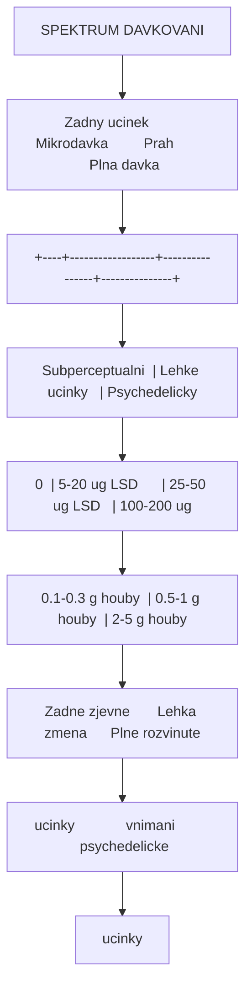
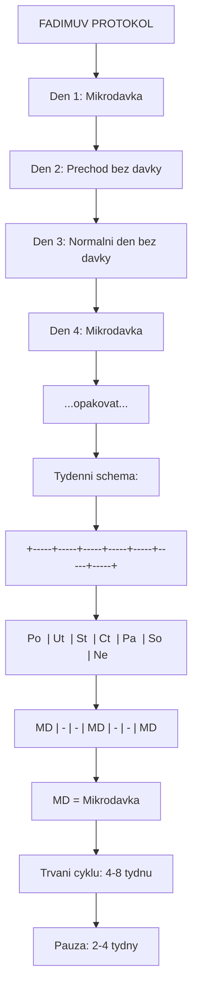
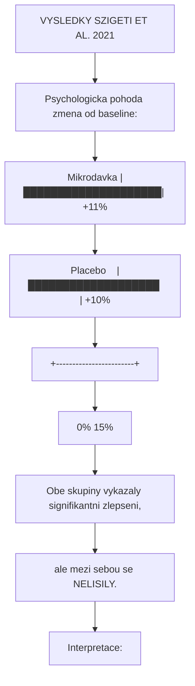

+++
title = "Mikrodavkovani"
description = "Mikrodavkovani psychedelik - subperceptualni davky LSD a psilocybinu, protokoly, vyzkum a placebo-kontrolovane studie"
weight = 3
insert_anchor_links = "right"

[taxonomies]
categories = ["farmakologie", "terapie"]
tags = ["mikrodavkovani", "LSD", "psilocybin", "protokoly", "Fadiman", "Stamets", "neuroplasticita"]
+++

# Mikrodavkovani - Subperceptualni davky psychedelik

**Mikrodavkovani** (anglicky *microdosing*) je praxe opakovaného uzivani velmi nizkych, **subperceptualnich** davek psychedelickych latek, predevsim [LSD](@/alkaloids/lsd.md) a [psilocybinu](@/alkaloids/psilocybin.md). Typicka mikrodavka predstavuje priblizne 1/10 az 1/20 plne psychoaktivni davky a nemela by vyvolavat zadne zjevne psychedelicke ucinky jako halucinace nebo zmeny vedomi.

Tato praxe ziskala popularitu predevsim od roku 2011 diky knize *The Psychedelic Explorer's Guide* od Dr. Jamese Fadimana a nasledne se rozsirila v Silicon Valley jako nastroj pro zvyseni kreativity a produktivity.

---

## Zakladni informace

| Vlastnost | Hodnota |
|-----------|---------|
| **Definice** | Uzivani subperceptualnich davek psychedelik |
| **Typicka davka LSD** | 5-20 ug (mikrogramu) |
| **Typicka davka psilocybinu** | 0.1-0.3 g susene houby (~1-3 mg psilocybinu) |
| **Frekvence** | 1x za 2-4 dny |
| **Trvani protokolu** | 4-8 tydnu |
| **Ocekavany ucinek** | Subperceptualni - zadne zjevne psychedelicke ucinky |
| **Primarni cil** | Zlepseni nalady, kreativity, kognice |

---

## Definice a principy

### Co je subperceptualni davka?

**Subperceptualni davka** je mnozstvi latky, ktere:

1. **Nevyvolava halucinace** - zadne vizualni distorze
2. **Nemeni vedomi** - zadna zmena stavu vnimani
3. **Neomezuje funkcnost** - schopnost normalne pracovat
4. **Potencialne moduluje** - jemne zmeny nalady, energie, kognice



<details>
<summary>ASCII verze diagramu</summary>

```
SPEKTRUM DAVKOVANI

Zadny ucinek        Mikrodavka         Prah          Plna davka
     |                  |                |               |
     v                  v                v               v
+----+------------------+----------------+---------------+
|    | Subperceptualni  | Lehke ucinky   | Psychedelicky |
| 0  | 5-20 ug LSD      | 25-50 ug LSD   | 100-200 ug    |
|    | 0.1-0.3 g houby  | 0.5-1 g houby  | 2-5 g houby   |
+----+------------------+----------------+---------------+
     |                  |                |
     Zadne zjevne       Lehka zmena      Plne rozvinute
     ucinky             vnimani          psychedelicke
                                         ucinky
```

</details>

### Cile mikrodavkovani

| Kategorie | Reportovane cile |
|-----------|------------------|
| **Kognitivni** | Zvysena kreativita, lepsi koncentrace, flow stavy |
| **Emocionalni** | Zlepseni nalady, snizeni uzkosti, emocionalni stabilita |
| **Socialni** | Lepsi komunikace, zvysena empatie, socialni otevrnost |
| **Fyzicke** | Zvysena energie, lepsi vytrvalost, snizena bolest |
| **Spiritualni** | Zvysena vnimavost, pocit propojenosti, mindfulness |

---

## Latky pouzivane pro mikrodavkovani

### [LSD](@/alkaloids/lsd.md) (Diethylamid kyseliny lysergove)

| Parametr | Hodnota |
|----------|---------|
| **Typicka mikrodavka** | 5-20 ug |
| **Optimalni rozsah** | 10-15 ug |
| **Plna davka** | 100-200 ug |
| **Pomer** | ~1/10 az 1/20 plne davky |
| **Trvani ucinku** | 8-12 hodin |
| **Vyzkumny status** | Omezene kontrolovane studie |

**Vyhody LSD pro mikrodavkovani**:
- Presne davkovani (rozpusteni v destilovane vode)
- Dlouha stabilita pri spravnem skladovani
- Konzistentni potence

**Nevyhody**:
- Ilegalni status
- Obtizna verifikace kvality
- Potencialni kontaminace

### [Psilocybin](@/alkaloids/psilocybin.md) (z hub rodu Psilocybe)

| Parametr | Hodnota |
|----------|---------|
| **Typicka mikrodavka** | 0.1-0.3 g susene houby |
| **Optimalni rozsah** | 0.15-0.25 g |
| **Ekvivalent psilocybinu** | 1-3 mg |
| **Plna davka** | 2-5 g susene houby (20-50 mg) |
| **Pomer** | ~1/10 az 1/20 plne davky |
| **Trvani ucinku** | 4-6 hodin |
| **Variabilita** | Vysoka (mezi druhy i individualni plodnice) |

**Vyhody psilocybinu**:
- Kratsi trvani ucinku
- Prirodni puvod
- Moznost domaci kultivace (v nekterych jurisdikcich)

**Nevyhody**:
- Variabilni potence mezi druhy a plodnicemi
- Obtizne presne davkovani
- Kratsi trvanlivost

### Srovnani latek

| Aspekt | LSD | Psilocybin |
|--------|-----|------------|
| **Presnost davkovani** | Vysoka | Nizka-stredni |
| **Konzistence** | Vysoka | Promenliva |
| **Trvani** | 8-12 h | 4-6 h |
| **Nastup** | 30-60 min | 30-90 min |
| **Tolerance** | Rychla (2-3 dny) | Rychla (2-3 dny) |
| **Krizova tolerance** | Ano | Ano |
| **Detekce v tele** | Obtizna | Obtizna |

---

## Protokoly mikrodavkovani

### Fadimuv protokol (klasicky)

Vyvinul **Dr. James Fadiman**, psycholog a prukopnik vyzkumu psychedelik.



<details>
<summary>ASCII verze diagramu</summary>

```
FADIMUV PROTOKOL

Den 1: Mikrodavka
Den 2: Prechod (bez davky)
Den 3: Normalni den (bez davky)
Den 4: Mikrodavka
...opakovat...

Tydenni schema:
+-----+-----+-----+-----+-----+-----+-----+
| Po  | Ut  | St  | Ct  | Pa  | So  | Ne  |
+-----+-----+-----+-----+-----+-----+-----+
| MD  |  -  |  -  | MD  |  -  |  -  | MD  |
+-----+-----+-----+-----+-----+-----+-----+

MD = Mikrodavka
-  = Zadna davka

Trvani cyklu: 4-8 tydnu
Pauza: 2-4 tydny
```

</details>

| Parametr | Doporuceni |
|----------|------------|
| **Frekvence** | 1x za 3 dny |
| **Cas uziti** | Rano, po snidani |
| **Davka LSD** | 10-20 ug |
| **Davka psilocybinu** | 0.1-0.2 g susene houby |
| **Trvani cyklu** | 4-8 tydnu |
| **Pauza mezi cykly** | 2-4 tydny |
| **Denik** | Doporucen pro sledovani efektu |

**Zduvodneni 3-dennich intervalu**:
1. **Den 1**: Akutni ucinek mikrodavky
2. **Den 2**: Potencialni rezidualni ucinky (afterglow)
3. **Den 3**: Navrat k baseline pro srovnani
4. **Prevence tolerance**: 5-HT2A receptory potrebuji cas na resenzitizaci

### Stametsov protokol (stackovaci)

Navrhl **Paul Stamets**, mykolog a popularizator hub.

```mermaid
flowchart TD
    node_STAMETSOVPROTOKOL["STAMETSOV PROTOKOL"]
    node_StackPsilocybinLvihr["'Stack' = Psilocybin + Lvi hriva + Niacin"]
    node_Tydennischema["Tydenni schema:"]
    node_3edab821["+-----+-----+-----+-----+-----+-----+-----+"]
    node_PoUtStCtPaSoNe["Po  | Ut  | St  | Ct  | Pa  | So  | Ne"]
    node_MDMDMDMD["MD  | MD  | MD  | MD  |  -  |  -  |  -"]
    node_MDMikrodavkaLvihriva["MD = Mikrodavka + Lvi hriva + Niacin"]
    node_Trvani4tydny["Trvani: 4 tydny"]
    node_Pauza24tydny["Pauza: 2-4 tydny"]

    node_STAMETSOVPROTOKOL --> node_StackPsilocybinLvihr
    node_StackPsilocybinLvihr --> node_Tydennischema
    node_Tydennischema --> node_3edab821
    node_3edab821 --> node_PoUtStCtPaSoNe
    node_PoUtStCtPaSoNe --> node_MDMDMDMD
    node_MDMDMDMD --> node_MDMikrodavkaLvihriva
    node_MDMikrodavkaLvihriva --> node_Trvani4tydny
    node_Trvani4tydny --> node_Pauza24tydny

    click node_StackPsilocybinLvihr "/alkaloids/psilocybin/" ""Stack" = Psilocybin + Lvi hriva + Niacin"
```

<details>
<summary>ASCII verze diagramu</summary>

```
STAMETSOV PROTOKOL

"Stack" = Psilocybin + Lvi hriva + Niacin

Tydenni schema:
+-----+-----+-----+-----+-----+-----+-----+
| Po  | Ut  | St  | Ct  | Pa  | So  | Ne  |
+-----+-----+-----+-----+-----+-----+-----+
| MD  | MD  | MD  | MD  |  -  |  -  |  -  |
+-----+-----+-----+-----+-----+-----+-----+

MD = Mikrodavka + Lvi hriva + Niacin
-  = Zadna davka

Trvani: 4 tydny
Pauza: 2-4 tydny
```

</details>

| Slozka | Davka | Ucinek |
|--------|-------|--------|
| **Psilocybin** | 0.1-0.3 g susene houby | Hlavni psychoaktivni slozka |
| **Lvi hriva** (Hericium erinaceus) | 500-1000 mg | NGF stimulace, neuroprotekce |
| **Niacin** (B3) | 50-100 mg | Vazodilce, distribuce do periferie |

**Stametsova hypoteza**:
- Niacin zpusobuje flush (zarudnuti) a podporuje distribuci aktivnich latek
- Lvi hriva synergicky podporuje neurogenezi
- Kombinace by mela maximalizovat neuroplasticke ucinky

**Poznamka**: Tato kombinace **neni vedecky overena** v kontrolovanych studiich.

### Dalsi protokoly

#### Nightcap protokol

| Parametr | Hodnota |
|----------|---------|
| **Cas uziti** | Vecer pred spankem |
| **Frekvence** | 2-3x tydne |
| **Cil** | Zlepseni spanku, zpracovani emoci |
| **Rizika** | Naruseni REM spanku |

#### Workweek protokol

| Parametr | Hodnota |
|----------|---------|
| **Schema** | Po-St-Pa |
| **Cil** | Podpora pracovniho vykonu |
| **Vikend** | Bez davek (zotaveni, porovnani) |

### Prakticky navod na davkovani

#### LSD volumetricke davkovani

```
PRIPRAVA ROZTOKU LSD

1. Material:
   - Blotter s odhadovanou potenci (napr. 100 ug)
   - Destilovana voda nebo vodka (10 mL)
   - Tmava sklenicka s kapatkovou uzaveru
   - Hlinikova folie (ochrana pred svetlem)

2. Postup:
   - Vlozte blotter do 10 mL destilovane vody/vodky
   - Nechte louhovát 24 hodin v temnu
   - Blotter muzete nechat v roztoku
   - 1 mL = 10 ug (pri 100 ug blotteru)

3. Davkovani:
   - Mikrodavka: 0.5-1.5 mL roztoku
   - Pouzijte presnou strikasku
   - Davkujte rano po snidani

4. Skladovani:
   - Tmave, chlazene (lednice)
   - Stabilita: 1-2 mesice
```

#### Psilocybinove kapsle

```
PRIPRAVA PSILOCYBINOVYCH KAPSLI

1. Material:
   - Susene psilocybinove houby (napr. P. cubensis)
   - Kuchynska vaha s presnosti 0.01 g
   - Mlynik na kavu (cisty, suchy)
   - Prazdne zelatinove kapsle (velikost 00 nebo 0)
   - Plnic kapsli (volitelne)

2. Postup:
   - Dukladne usmelte houby na jemny prasek
   - Navazujte 0.10-0.15 g prasku na kapsli
   - Homogenizujte prasek pred plnenim
   - Oznacte kapsle datem a obsahem

3. Variabilita:
   - P. cubensis: 0.5-1% psilocybinu (promenna)
   - 0.1 g = ~0.5-1 mg psilocybinu
   - Doporuceno: zacit s nizsimi davkami

4. Skladovani:
   - Suche, tmave, vzduchotesne
   - Stabilita: 6-12 mesicu
   - Pridejte silica gel proti vlhkosti
```

---

## Trvzene benefity

### Kategorie reportovanych ucinku

#### Kognitivni ucinky

| Ucinek | Frekvence reportu | Vedecky status |
|--------|-------------------|----------------|
| **Zvysena kreativita** | Velmi caste | Smisena evidence |
| **Lepsi koncentrace** | Caste | Placebo v nekterych studiich |
| **Flow stavy** | Caste | Nedostatecne studovano |
| **Divergentni mysleni** | Caste | Nektere pozitivni studie |
| **Lepsi reseni problemu** | Stredne caste | Omezena evidence |

#### Emocionalni ucinky

| Ucinek | Frekvence reportu | Vedecky status |
|--------|-------------------|----------------|
| **Zlepseni nalady** | Velmi caste | Smisena evidence, silny placebo |
| **Snizeni uzkosti** | Caste | Smisena evidence |
| **Emocionalni stabilita** | Caste | Nedostatecne studovano |
| **Zvysena empatie** | Stredne caste | Nedostatecne studovano |
| **Snizeni deprese** | Caste | Kontroverzni evidence |

#### Fyzicke ucinky

| Ucinek | Frekvence reportu | Vedecky status |
|--------|-------------------|----------------|
| **Zvysena energie** | Caste | Subjektivni, maly objektivni efekt |
| **Lepsi vytrvalost** | Stredne caste | Nedostatecne studovano |
| **Snizeni bolesti** | Vzacnejsi | Anekdoticke |
| **Zlepseni spanku** | Promenne | Kontroverzni |

### Mechanismy potencialnich ucinku

```
POTENCIALNI MECHANISMY MIKRODAVKOVANI

1. NEUROPLASTICITA
   Subperceptualni 5-HT2A aktivace
              |
              v
   Zesílená BDNF exprese (?)
              |
              v
   Dendriticka arborizace (?)
              |
              v
   Nove synapse (teoreticky)

2. SEROTONERGNI MODULACE
   Nizka 5-HT2A aktivace
              |
              v
   Modulace serotonergniho tonu
              |
              v
   Zlepseni nalady (?)

3. NEUROCHEMICKA ROVNOVAHA
   Subtlni 5-HT/DA modulace
              |
              v
   Zmenena neurotransmise
              |
              v
   Kognitivni/emocionalni zmeny (?)

POZNAMKA: Vetsina techto mechanismu
neni v kontextu mikrodavek overena!
```

---

## Vedecky vyzkum

### Prehled klinickych studii

| Studie | Rok | Design | N | Latka | Vysledek |
|--------|-----|--------|---|-------|----------|
| Prochazkova et al. | 2018 | Observacni | 36 | Tartufy | Zvysene divergentni mysleni |
| Polito & Stevenson | 2019 | Dotaznik | 98 | Ruzne | Reportovana zlepseni |
| Szigeti et al. | 2021 | RCT, PCBO | 191 | LSD | **Zadny efekt vs placebo** |
| Marschall et al. | 2022 | RCT, PCBO | 34 | Psilocybin | Minimalní efekt vs placebo |
| de Wit et al. | 2022 | RCT, PCBO | 56 | LSD | **Slaby az zadny efekt** |
| Kuypers et al. | 2019 | Naturalistic | 38 | Tartufy | Casove zavisle efekty |

### Klicove placebo-kontrolovane studie

#### Szigeti et al. (2021) - Self-Blinding Citizen Science

**Metodologie**:
- Prvni rozsahla placebo-kontrolovana studie mikrodavkovani
- N = 191 ucastniku (citizen science design)
- 4 tydny, samo-oslepovani pomoci QR kodu na obalkach
- Mereni: psychologicka pohoda, kognitivni funkce, emocionalni regulace

**Vysledky**:

| Metrika | Mikrodavka | Placebo | p-hodnota |
|---------|------------|---------|-----------|
| Psychologicka pohoda | +11% | +10% | NS |
| Kognitivni funkce | +4% | +3% | NS |
| Emocionalni stabilita | +8% | +7% | NS |

**Zaver**: **Vsechny reportovane benefity byly replikovany v placebo skupine.** Studie naznacuje, ze pozorovane ucinky mohou byt z velke casti placebo efektem.



<details>
<summary>ASCII verze diagramu</summary>

```
VYSLEDKY SZIGETI ET AL. (2021)

Psychologicka pohoda (zmena od baseline):

Mikrodavka |████████████████████| +11%
Placebo    |███████████████████ | +10%
           +------------------------+
           0%                    15%

Obe skupiny vykazaly signifikantni zlepseni,
ale mezi sebou se NELISILY.

Interpretace:
- Ocekavani samo o sobe zpusobuje zlepseni
- Placebo efekt je velmi silny
- Specificke farmakologicke ucinky nepreukazany
```

</details>

#### Marschall et al. (2022) - Psilocybin RCT

**Metodologie**:
- Double-blind, placebo-kontrolovana studie
- N = 34 zdravych dobrovolniku
- Davka: 0.5 mg psilocybinu vs placebo
- 3 tydny, mereni nalady a kognice

**Vysledky**:
- Minimalní rozdily mezi skupinami
- Zadny signifikantní ucinek na kreativitu
- Zadny ucinek na emocionalni zpracovani
- Mozne lehke zlepseni pozornosti (p = 0.052)

#### de Wit et al. (2022) - LSD Laboratory Study

**Metodologie**:
- Kontrolovane laboratorn podminky
- N = 56 zdravych dospelych
- Davky: 13 ug a 26 ug LSD vs placebo
- Akutni mereni kognice, nalady, kreativity

**Vysledky**:

| Domena | 13 ug | 26 ug | Placebo |
|--------|-------|-------|---------|
| Nalada | = | Mirne + | - |
| Kreativita | = | = | - |
| Kognice | = | = | - |
| Subjektivni efekty | Zadne | Lehke | Zadne |

**Zaver**: 26 ug jiz zpusobovalo lehke subjektivni efekty (tedy ne subperceptualni), ale ucinky na kreativitu a kognici nebyly preukazany.

### Meta-analyza evidence

```
SOUHRN VEDECKE EVIDENCE (2024)

Kvalita evidence:     Nizka az stredni
Konzistence vysledku: Nizka (kontroverzni)
Placebo efekt:        Velmi silny
Specificke ucinky:    Nepreukazany v RCT

Kategorie ucinku:     Evidence:

Kreativita            [???????---] Smisena
Nalada                [????------] Spise placebo
Kognice               [???-------] Spise zadny efekt
Uzkost                [?????-----] Nedostatecna
Deprese               [??????----] Smisena, potreba vyzkumu
Neuroplasticita       [??--------] Teoreticka, neoverena

Legenda:
? = Nejista evidence
- = Chybejici evidence
```

### Neurobiologicky vyzkum

#### Studie na zvírecích modelech

| Studie | Model | Davka | Nalez |
|--------|-------|-------|-------|
| Cameron et al. (2019) | Mysi | ~1/10 LSD | Antidepresivni ucinek, neuroplasticita |
| Horsley et al. (2018) | Potkani | Mikrodavky LSD | Zadny ucinek na uceni |
| Buchborn et al. (2015) | Mysi | Chronické nizke davky | Behavioralni zmeny |

**Poznamka**: Zvíreci modely mají omezenou prenositelnost na lidi.

#### Neuroimagingove studie

Dosud **zadne publikovane** neuroimagingove studie s opravdovymi mikrodavkami u lidi.

---

## Bezpecnost a rizika

### Kratkodoba bezpecnost

| Aspekt | Hodnoceni | Poznamka |
|--------|-----------|----------|
| **Akutni toxicita** | Velmi nizka | Subperceptualni davky |
| **Kardiovaskularni** | Minimalni | 5-HT2B aktivace teoreticky |
| **Psychologicka** | Nizka | Pri spravnem davkovani |
| **Interakce** | Mozne | Viz nize |

### Potencialni rizika

| Riziko | Pravdepodobnost | Prevence |
|--------|-----------------|----------|
| **Nadmerne davkovani** | Stredni | Volumetricke davkovani |
| **Zhoršeni uzkosti** | Nizka | Individualni titrace |
| **Serotonergni interakce** | Nizka | Nekombinovat s SSRI, MAOi |
| **5-HT2B kardiotoxicita** | Teoreticka | Dlouhodobe uzivani nedoporuceno |
| **Manie (bipolarni)** | Nizka | Kontraindikace |
| **Psychoza** | Velmi nizka | Kontraindikace u rizikovych |
| **Pravni postihy** | Vysoka | Ilegalni ve vetsine jurisdikci |

### Kontraindikace

| Absolutni | Relativni |
|-----------|-----------|
| Schizofrenie | Uzkostne poruchy |
| Bipolarni porucha | Tezka deprese bez dohledu |
| Psychoza v anamneze | Srdecni onemocneni |
| Uzivani lithia | SSRI (snizeny ucinek) |
| Tehotenstvi/kojeni | MAOi (interakce) |

### Lekove interakce

| Lecivo | Interakce | Doporuceni |
|--------|-----------|------------|
| **SSRI** | Snizeny ucinek mikrodavky | Nekombinovat bez konzultace |
| **MAOi** | Potencialni zesíleni | Kontraindikace |
| **Lithium** | Riziko toxicity | Absolutne kontraindikované |
| **Tramadol** | Serotoninovy syndrom | Kontraindikace |
| **Triptany** | Teoreticka interakce | Opatrnost |

---

## Placebo efekt a ocekavani

### Role ocekavani

```mermaid
flowchart TD
    node_PLACEBOEFEKTVMIKRODA["PLACEBO EFEKT V MIKRODAVKOVANI"]
    node_Zdrojepozitivnichoce["Zdroje pozitivnich ocekavani:"]
    node_34de3209["+----------------------------------------+"]
    node_Medialnihype["- Medialni hype"]
    node_SiliconValleykultura["- Silicon Valley kultura"]
    node_Anekdotickereporty["- Anekdoticke reporty"]
    node_KnihyFadimanPollan["- Knihy Fadiman, Pollan"]
    node_KomunityRedditfora["- Komunity Reddit, fora"]
    node_Biohackingtrendy["- 'Biohacking' trendy"]
    node_Silnapozitivniocekav["Silna pozitivni ocekavani"]
    node_Expectancybias["= Expectancy bias"]
    node_Placeboefekt["Placebo efekt:"]
    node_Zlepseninalady["- Zlepseni nalady"]
    node_Pocitzvysenekreativi["- Pocit zvysene kreativity"]
    node_Vnimanezlepseniprodu["- Vnimane zlepseni produktivity"]
    node_Konfirmacnibias["Konfirmacni bias:"]
    node_Selektivnipozornostk["Selektivni pozornost k pozitivum"]
    node_Ignorovaninegativnic["Ignorovani negativnich nebo zadnych"]
    node_ucinku["ucinku"]

    node_PLACEBOEFEKTVMIKRODA --> node_Zdrojepozitivnichoce
    node_Zdrojepozitivnichoce --> node_34de3209
    node_34de3209 --> node_Medialnihype
    node_Medialnihype --> node_SiliconValleykultura
    node_SiliconValleykultura --> node_Anekdotickereporty
    node_Anekdotickereporty --> node_KnihyFadimanPollan
    node_KnihyFadimanPollan --> node_KomunityRedditfora
    node_KomunityRedditfora --> node_Biohackingtrendy
    node_Biohackingtrendy --> node_Silnapozitivniocekav
    node_Silnapozitivniocekav --> node_Expectancybias
    node_Expectancybias --> node_Placeboefekt
    node_Placeboefekt --> node_Zlepseninalady
    node_Zlepseninalady --> node_Pocitzvysenekreativi
    node_Pocitzvysenekreativi --> node_Vnimanezlepseniprodu
    node_Vnimanezlepseniprodu --> node_Konfirmacnibias
    node_Konfirmacnibias --> node_Selektivnipozornostk
    node_Selektivnipozornostk --> node_Ignorovaninegativnic
    node_Ignorovaninegativnic --> node_ucinku
```



<details>
<summary>ASCII verze diagramu</summary>

```
PLACEBO EFEKT V MIKRODAVKOVANI

Zdroje pozitivnich ocekavani:
+----------------------------------------+
| - Medialni hype                        |
| - Silicon Valley kultura               |
| - Anekdoticke reporty                  |
| - Knihy (Fadiman, Pollan)             |
| - Komunity (Reddit, fora)              |
| - "Biohacking" trendy                  |
+----------------------------------------+
              |
              v
+----------------------------------------+
| Silna pozitivni ocekavani               |
| = Expectancy bias                      |
+----------------------------------------+
              |
              v
+----------------------------------------+
| Placebo efekt:                         |
| - Zlepseni nalady                      |
| - Pocit zvysene kreativity             |
| - Vnimane zlepseni produktivity        |
+----------------------------------------+
              |
              v
+----------------------------------------+
| Konfirmacni bias:                      |
| Selektivni pozornost k pozitivum       |
| Ignorovani negativnich nebo zadnych    |
| ucinku                                 |
+----------------------------------------+
```

</details>

### Studie ocekavani (Expectancy)

Olson et al. (2020) - "Expectancy effects":
- Ucastnici informovani, ze dostanou mikrodavku
- Polovina dostala placebo
- Obe skupiny reportovaly podobne ucinky
- Zakonne plody ocekavani jsou silne

### Implikace pro praxi

| Situace | Implikace |
|---------|-----------|
| **Osobni uzivani** | Vetsina benefitu muze byt placebo |
| **Vedecky vyzkum** | Nutne rigorozni oslepovani |
| **Medicinska aplikace** | Nedostatecna evidence pro indikaci |
| **Harm reduction** | Informovat o placebo moznosti |

---

## Pravni status

### Mezinarodni situace

| Jurisdikce | Status LSD | Status psilocybinu |
|------------|------------|-------------------|
| **OSN** | Schedule I | Schedule I |
| **USA** | Schedule I | Schedule I (vyjma OR, CO) |
| **EU** | Vetsinou zakazano | Vetsinou zakazano |
| **Nizozemsko** | Zakazano | Tartufy legalni |
| **Portugalsko** | Dekriminalizovano | Dekriminalizovano |
| **Jamaika** | - | Legalni |
| **Kanada** | Zakazano | Vyjimky pro terapii |

### Ceska republika

| Aspekt | Status |
|--------|--------|
| **LSD** | Tabulka c. 1 (zakazane) |
| **Psilocybin** | Tabulka c. 1 (zakazane) |
| **Psilocybinove houby** | Zakazane (obsahuji psilocybin) |
| **Tresty za drzeni** | Az 1-5 let |
| **Tresty za distribuci** | 2-10 let |
| **Vyjimky** | Vedecky vyzkum s povolenim |

**Upozorneni**: Mikrodavkovani je v Ceske republice **ilegalni** bez ohledu na davku nebo ucel.

---

## Kriticke zhodnoceni

### Silne stranky evidence

1. **Konzistentni subjektivni reporty** - Mnoho uzivatelu reportuje pozitivni zkusenosti
2. **Teoreticky biologicky zaklad** - 5-HT2A aktivace, neuroplasticita
3. **Preklinicka data** - Nektere zvíreci studie ukazuji ucinky
4. **Bezpecnostni profil** - Nizke riziko pri spravnem uzivani

### Slabe stranky evidence

1. **Placebo-kontrolovane studie** - Vetsina neprokazala specificke ucinky
2. **Silny placebo efekt** - Tezke odlisit od ocekavani
3. **Publication bias** - Pozitivni vysledky publikovany casteji
4. **Metodologicke problemy** - Oslepovani obtizne u psychedelik
5. **Variabilita latek** - Nestandardizovane davky a zdroje
6. **Absence dlouhodobych dat** - Neznama bezpecnost chronickeho uzivani

### Soucasny vedecky konsenzus (2024)

```
KONSENZUALNI STANOVISKO

"Dosavadni evidence z kontrolovanych studii
neprokazuje specificke benefity mikrodavkovani
psychedelik nad ramec placebo efektu.

Reportovane benefity jsou pravdepodobne
primarne zpusobeny ocekavanim, kontextem
a pozitivnimi presvedcenimi o ucincich.

Dalsi rigorozni vyzkum je potrebny, ale
soucasna evidence nepodporuje siroke
terapeuticke vyuziti mikrodavkovani."

Zdroj: Synteza z RCT studii a meta-analyz
```

---

## Doporuceni pro harm reduction

### Pro ty, kteri se rozhodnou mikrodavkovat

**Upozorneni**: Nasledujici informace jsou poskytovány vylucne pro ucely harm reduction. Mikrodavkovani je ve vetsine jurisdikci ilegalni.

| Doporuceni | Zduvodneni |
|------------|------------|
| **Testujte latky** | Ehrlichuv reagent, Hofmannuv reagent |
| **Zacnete nizko** | Radsi pod prahem nez nad |
| **Volumetricke davkovani** | Presne davky |
| **Vedte denik** | Objektivni sledovani ucinku |
| **Pravidelne pauzy** | Prevence tolerance a zavislosti |
| **Vyhnete se interakcim** | SSRI, MAOi, lithium |
| **Informujte blizkeho** | Bezpecnost |
| **Monitorujte naladu** | Zhoršeni = prerusti |

### Alternativy k mikrodavkovani

| Alternativa | Evidence | Legalita |
|-------------|----------|----------|
| **Meditace/mindfulness** | Silna | Legalni |
| **Cviceni** | Silna | Legalni |
| **Kvalitni spanek** | Silna | Legalni |
| **Kognitivni trening** | Stredni | Legalni |
| **Terapie** | Silna | Legalni |
| **Adaptogeny** (ashwagandha) | Omezena | Legalni |
| **Omega-3** | Stredni | Legalni |

---

## Reference

### Vedecke studie

1. Fadiman, J. (2011). *The Psychedelic Explorer's Guide*. Park Street Press.

2. Szigeti, B. et al. (2021). Self-blinding citizen science to explore psychedelic microdosing. *eLife*, 10, e62878.

3. Polito, V. & Stevenson, R.J. (2019). A systematic study of microdosing psychedelics. *PLoS ONE*, 14(2), e0211023.

4. Prochazkova, L. et al. (2018). Exploring the effect of microdosing psychedelics on creativity in an open-label natural setting. *Psychopharmacology*, 235, 3401-3413.

5. Marschall, J. et al. (2022). Psilocybin microdosing does not affect emotion-related symptoms and processing: A preregistered field and lab-based study. *Journal of Psychopharmacology*, 36(1), 97-113.

6. de Wit, H. et al. (2022). Repeated low doses of LSD in healthy adults: A placebo-controlled, dose-response study. *Addiction Biology*, 27(2), e13143.

7. Cameron, L.P. et al. (2019). A non-hallucinogenic psychedelic analogue with therapeutic potential. *Nature*, 589, 474-479.

8. Kuypers, K.P.C. et al. (2019). Microdosing psychedelics: More questions than answers? An overview and suggestions for future research. *Journal of Psychopharmacology*, 33(9), 1039-1057.

9. Anderson, T. et al. (2019). Microdosing psychedelics: personality, mental health, and creativity differences in microdosers. *Psychopharmacology*, 236, 731-740.

10. Hutten, N.R.P.W. et al. (2020). Mood and cognition after administration of low LSD doses in healthy volunteers: A placebo controlled dose-effect finding study. *European Neuropsychopharmacology*, 41, 81-91.

### Prehledove clanky

11. Polito, V. & Liknaitzky, P. (2022). The emerging science of microdosing: A systematic review of research on low dose psychedelics (1955-2021) and recommendations for the field. *Neuroscience & Biobehavioral Reviews*, 139, 104706.

12. Kuypers, K.P.C. (2020). The therapeutic potential of microdosing psychedelics in depression. *Therapeutic Advances in Psychopharmacology*, 10.

---

## Viz take

### Psychoaktivni latky
- [LSD](@/alkaloids/lsd.md) - Hlavni latka pro mikrodavkovani
- [Psilocybin](@/alkaloids/psilocybin.md) - Alternativni latka pro mikrodavkovani
- [Psilocin](@/alkaloids/psilocin.md) - Aktivni metabolit psilocybinu
- [DMT](@/alkaloids/dmt.md) - Pribuzne psychedelikum

### Mechanismy
- [5-HT2A receptor](@/receptors/5-ht2a.md) - Cilovy receptor psychedelik
- [Receptor](@/glossary/receptor.md) - Obecny pojem

### Zdroje
- [Psilocybe houby](@/shrooms/psilocybes/_index.md) - Zdroj psilocybinu

---

*Tato stranka slouzi pouze pro edukacni a harm reduction ucely. LSD a psilocybin jsou v Ceske republice nezakonne latky. Mikrodavkovani nedoporucujeme bez konzultace s odbornikym a bez znalosti pravnich dusledku.*

---

<- Zpet na [Glosar](@/glossary/_index.md)
