+++
title = "Neuroplasticita"
description = "Schopnost mozku reorganizovat neuronalni struktury a funkce - zaklad uceni, pameti a terapeutickych ucinku psychedelik"
weight = 3
insert_anchor_links = "right"

[taxonomies]
categories = ["neurověda", "fyziologie"]
tags = ["neuroplasticita", "synapse", "BDNF", "LTP", "LTD", "psychedelika", "mozek", "uceni", "pamet"]
+++

# Neuroplasticita - Dynamicka reorganizace mozku

**Neuroplasticita** (take **neuronalni plasticita** nebo **mozková plasticita**) je fundamentalni vlastnost nervoveho systemu, ktera umoznuje mozku menit svoji strukturu a funkci v reakci na zkusenosti, uceni, zraneni nebo farmakologicke intervence. Tato schopnost je zakladem [uceni](@/glossary/uceni.md), pameti a adaptace na mene se prostredi.

Neuroplasticita hraje klicovou roli v terapeutickych ucincich [psychedelik](@/alkaloids/_index.md), jako jsou [psilocybin](@/alkaloids/psilocybin.md), [LSD](@/alkaloids/lsd.md) a [DMT](@/alkaloids/dmt.md), ktere vyrazne stimuluji neuroplasticke procesy prostrednictvim aktivace [5-HT2A receptoru](@/receptors/5-ht2a.md).

---

## Zakladni definice

### Co je neuroplasticita?

| Aspekt | Popis |
|--------|-------|
| **Definice** | Schopnost nervoveho systemu menit svou strukturu a funkci v prubehu zivota |
| **Rozsah** | Od molekularnich zmen po reorganizaci celych kortikalnich map |
| **Casovy ramec** | Minuty (synaptická) az roky (strukturalni) |
| **Reverzibilita** | Casto reverzibilni, ale nektere zmeny jsou trvale |
| **Evoluční funkce** | Adaptace, uceni, zotaveni po zraneni |

### Historicky kontext

| Obdobi | Milnik |
|--------|--------|
| **1890s** | Santiago Ramon y Cajal - zaklady neuralni plasticity |
| **1940s** | Donald Hebb - "neurony ktere spolu vysílají, se spolu propojí" |
| **1960s** | Objev dlouhodobe potenciace (LTP) |
| **1990s** | Prukaz neurogeneze v dospelem mozku |
| **2000s** | Molekularni mechanismy plasticity objasněny |
| **2010s** | Psychedelika jako nastroje pro indukci plasticity |
| **2020s** | Klinicke vyuziti psychedeliky-indukovane plasticity |

---

## Typy neuroplasticity

### 1. Synapticka plasticita

Zmeny v sile synaptického prenosu mezi neurony.

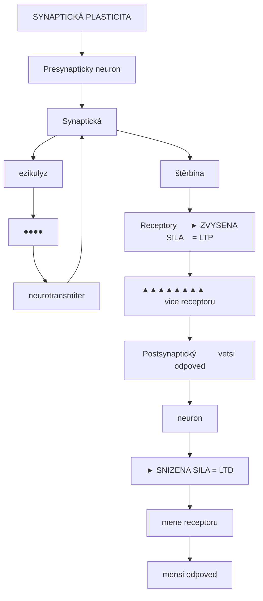

<details>
<summary>ASCII verze diagramu</summary>

```
               SYNAPTICKÁ PLASTICITA

    Presynapticky neuron
           │
           ▼
    ┌─────────────────┐
    │  Synaptické     │
    │  vezikulyz      │
    │    ●●●●         │
    │    ↓↓↓↓         │
    └────────┬────────┘
             │ neurotransmiter
             ▼
    ┌─────────────────┐
    │  Synaptická     │
    │    štěrbina     │
    └────────┬────────┘
             │
             ▼
    ┌─────────────────┐       ┌────────────────┐
    │  Receptory      │──────►│ ZVYSENA SILA   │ = LTP
    │  ▲▲▲▲▲▲▲▲       │       │ (vice receptoru│
    │  Postsynaptický │       │  vetsi odpoved)│
    │  neuron         │       └────────────────┘
    └─────────────────┘
                              ┌────────────────┐
                       ──────►│ SNIZENA SILA   │ = LTD
                              │ (mene receptoru│
                              │  mensi odpoved)│
                              └────────────────┘
```

</details>

#### Dlouhodoba potenciace (LTP)

| Vlastnost | Popis |
|-----------|-------|
| **Definice** | Trvale zesíleni synaptického prenosu po opakované stimulaci |
| **Mechanismus** | Inzerce AMPA receptoru, zvyseni vodivosti |
| **Faze** | E-LTP (ranná, minuty) a L-LTP (pozdní, hodiny-dny) |
| **Klicove receptory** | [NMDA receptor](@/receptors/nmda.md) - "detektor koincidence" |
| **Nutne podminky** | Simultanni presynaptická a postsynaptická aktivace |
| **Vyznam** | Zaklad uceni a formovani pameti |

```mermaid
flowchart TD
    node_LTPDLOUHODOBAPOTENCI["LTP - DLOUHODOBA POTENCIACE"]
    node_BazalnistavPoindukci["Bazalni stav                Po indukci LTP"]
    node_MalyEPSPVelkyEPSP["Maly EPSP                 Velky EPSP"]
    node_593394ac["╱╲                       ╱╲"]
    node_367242b1["╱  ╲        ►      ╱  ╲"]
    node_9f794f5c["╱    ╲                   ╱    ╲"]
    node_47d4b8db["╱╲            ╱╲"]
    node_MalaodpovedVelkaodpo["Mala odpoved             Velka odpoved"]
    node_Molekularnimechanism["Molekularni mechanismus:"]
    node_1GlutamatNMDArecepto["1. Glutamat  NMDA receptor Mg²⁺ blok"]
    node_2Depolarizaceodstran["2. Depolarizace  odstraneni Mg²⁺ bloku"]
    node_3CainfluxaktivaceCaM["3. Ca²⁺ influx  aktivace CaMKII"]
    node_4FosforylaceAMPArece["4. Fosforylace AMPA receptoru  zvysena vodivost"]
    node_5InzercenovychAMPAre["5. Inzerce novych AMPA receptoru  trvala potenciace"]

    node_LTPDLOUHODOBAPOTENCI --> node_BazalnistavPoindukci
    node_BazalnistavPoindukci --> node_MalyEPSPVelkyEPSP
    node_MalyEPSPVelkyEPSP --> node_593394ac
    node_593394ac --> node_367242b1
    node_367242b1 --> node_9f794f5c
    node_9f794f5c --> node_47d4b8db
    node_47d4b8db --> node_MalaodpovedVelkaodpo
    node_MalaodpovedVelkaodpo --> node_Molekularnimechanism
    node_Molekularnimechanism --> node_1GlutamatNMDArecepto
    node_1GlutamatNMDArecepto --> node_2Depolarizaceodstran
    node_2Depolarizaceodstran --> node_3CainfluxaktivaceCaM
    node_3CainfluxaktivaceCaM --> node_4FosforylaceAMPArece
    node_4FosforylaceAMPArece --> node_5InzercenovychAMPAre

    click node_1GlutamatNMDArecepto "/receptors/nmda/" "1. Glutamat  NMDA receptor Mg²⁺ blok"
    click node_4FosforylaceAMPArece "/glossary/receptor/" "4. Fosforylace AMPA receptoru  zvysena vodivost"
    click node_5InzercenovychAMPAre "/glossary/receptor/" "5. Inzerce novych AMPA receptoru  trvala potenciace"
```

<details>
<summary>ASCII verze diagramu</summary>

```
            LTP - DLOUHODOBA POTENCIACE

    Bazalni stav                Po indukci LTP
    ┌──────────────┐            ┌──────────────┐
    │  Maly EPSP   │            │  Velky EPSP  │
    │     ╱╲       │            │    ╱╲        │
    │    ╱  ╲      │  ──────►   │   ╱  ╲       │
    │   ╱    ╲     │            │  ╱    ╲      │
    │──╱──────╲────│            │─╱──────╲─────│
    │ Mala odpoved │            │Velka odpoved │
    └──────────────┘            └──────────────┘

    Molekularni mechanismus:

    1. Glutamat → NMDA receptor (Mg²⁺ blok)
                         ↓
    2. Depolarizace → odstraneni Mg²⁺ bloku
                         ↓
    3. Ca²⁺ influx → aktivace CaMKII
                         ↓
    4. Fosforylace AMPA receptoru → zvysena vodivost
                         ↓
    5. Inzerce novych AMPA receptoru → trvala potenciace
```

</details>

#### Dlouhodoba deprese (LTD)

| Vlastnost | Popis |
|-----------|-------|
| **Definice** | Trvale oslabeni synaptického prenosu |
| **Mechanismus** | Internalizace AMPA receptoru, snizena vodivost |
| **Indukcni protokol** | Nizkofrekvencni stimulace (1-5 Hz) |
| **Klicove enzymy** | Kalcineurin (fosfataza) |
| **Funkce** | "Zapomnění", jemne doladeni synapsí |
| **Vyvazení** | LTP a LTD spolecne udrzuji synaptickou homeostazu |

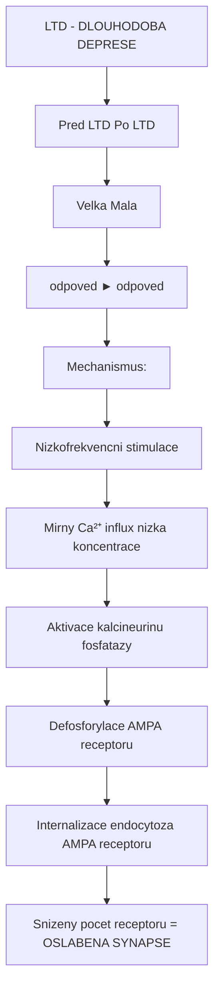

<details>
<summary>ASCII verze diagramu</summary>

```
            LTD - DLOUHODOBA DEPRESE

    Pred LTD                    Po LTD
    ┌──────────────┐            ┌──────────────┐
    │  Velka       │            │  Mala        │
    │  odpoved     │  ──────►   │  odpoved     │
    └──────────────┘            └──────────────┘

    Mechanismus:

    Nizkofrekvencni stimulace
              ↓
    Mirny Ca²⁺ influx (nizka koncentrace)
              ↓
    Aktivace kalcineurinu (fosfatazy)
              ↓
    Defosforylace AMPA receptoru
              ↓
    Internalizace (endocytoza) AMPA receptoru
              ↓
    Snizeny pocet receptoru = OSLABENA SYNAPSE
```

</details>

#### Spike-Timing Dependent Plasticity (STDP)

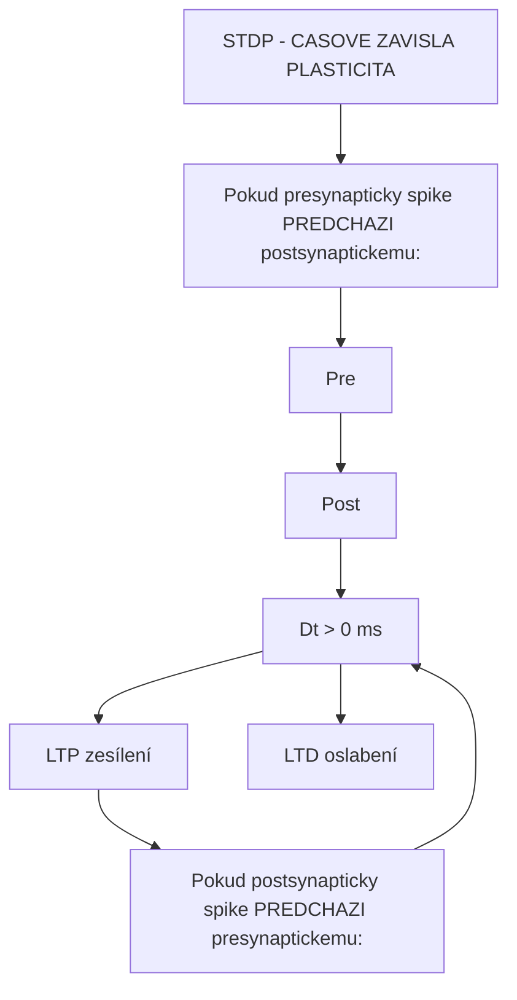

<details>
<summary>ASCII verze diagramu</summary>

```
    STDP - CASOVE ZAVISLA PLASTICITA

    Pokud presynapticky spike PREDCHAZI postsynaptickemu:

    Pre ─────│────────────────────────
             │
    Post ────│─────│──────────────────
                   ↓
              Dt < 0 ms
                   ↓
                  LTP (zesílení)

    Pokud postsynapticky spike PREDCHAZI presynaptickemu:

    Post ────│────────────────────────
             │
    Pre ─────│─────│──────────────────
                   ↓
              Dt > 0 ms
                   ↓
                  LTD (oslabení)
```

</details>

| Casovy interval | Smer zmeny | Interpretace |
|-----------------|------------|--------------|
| Pre→Post (0-20 ms) | LTP | Kauzalni vztah, zesilit |
| Post→Pre (0-20 ms) | LTD | Nekauzalni, oslabit |
| >50 ms | Zadna zmena | Nepropojene udalosti |

### 2. Strukturalni plasticita

Fyzicke zmeny v neuralni architekture.

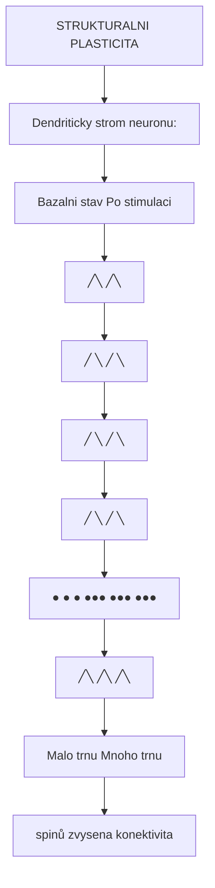

<details>
<summary>ASCII verze diagramu</summary>

```
           STRUKTURALNI PLASTICITA

    Dendriticky strom neuronu:

    Bazalni stav              Po stimulaci

         │                         │
        ╱│╲                       ╱│╲
       ╱ │ ╲                     ╱ │ ╲
      ╱  │  ╲                   ╱  │  ╲
     ╱   │   ╲                 ╱   │   ╲
    ●    ●    ●              ●●●  ●●●  ●●●
    │         │              ╱│╲  ╱│╲  ╱│╲
    Malo trnu                Mnoho trnu
    (spinů)                  (zvysena konektivita)
```

</details>

#### Dendriticka plasticita

| Typ zmeny | Casovy ramec | Mechanismus |
|-----------|--------------|-------------|
| **Tvorba spinů** | Hodiny-dny | Aktin polymerizace |
| **Eliminace spinů** | Hodiny-dny | Aktin depolymerizace |
| **Zmena tvaru spinu** | Minuty-hodiny | Cytoskeletalni prestavba |
| **Rust dendritu** | Dny-tydny | Genova exprese, syntezy proteinu |
| **Pruzování dendritu** | Tydny-mesice | Dlouhodobe zmeny konektivity |

#### Axonalni plasticita

| Typ zmeny | Popis | Vyznam |
|-----------|-------|--------|
| **Axonalni sprouting** | Rust novych vetvi axonu | Kompenzace po poraneni |
| **Kolateralni veteni** | Tvorba pobocnych vetvi | Nova spojeni |
| **Bouton formace** | Nove presynaptické terminaly | Zvysena kapacita prenosu |
| **Myelinizace** | Zmeny v myelin plasti | Rychlost vedeni signalu |

### 3. Neurogeneze

Tvorba novych neuronu v dospelem mozku.

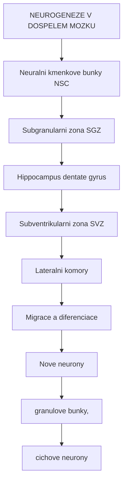

<details>
<summary>ASCII verze diagramu</summary>

```
           NEUROGENEZE V DOSPELEM MOZKU

    Neuralni kmenkove bunky (NSC)
                │
                ▼
    ┌───────────────────────────────┐
    │   Subgranularni zona (SGZ)   │
    │   Hippocampus (dentate gyrus)│
    └───────────────┬───────────────┘
                    │
                    ▼
    ┌───────────────────────────────┐
    │   Subventrikularni zona (SVZ) │
    │   Lateralni komory            │
    └───────────────┬───────────────┘
                    │
                    ▼
    ┌───────────────────────────────┐
    │   Migrace a diferenciace     │
    │        ↓                      │
    │   Nove neurony               │
    │   (granulove bunky,           │
    │    cichove neurony)           │
    └───────────────────────────────┘
```

</details>

| Aspekt | Popis |
|--------|-------|
| **Lokalizace** | Hippocampus (dentate gyrus), cichovy bulbus |
| **Mnozstvi** | ~700 novych neuronu/den v hippocampu |
| **Stimulatory** | Cviceni, obohacene prostredi, uceni |
| **Inhibitory** | Stres, deprivace spanku, starnuti |
| **Funkce** | Separace vzorcu, prostorova pamet |

---

## BDNF a neurotrofni faktory

### Brain-Derived Neurotrophic Factor (BDNF)

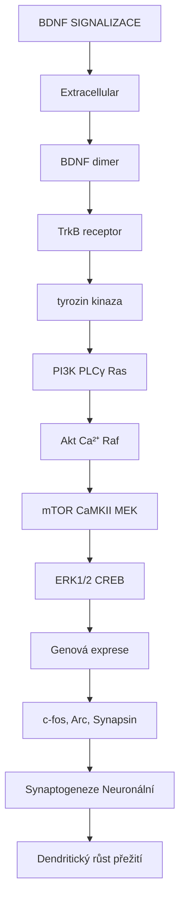

<details>
<summary>ASCII verze diagramu</summary>

```
           BDNF SIGNALIZACE

    Extracellular
         │
         ▼
    ┌─────────────────────────────────────────────┐
    │             BDNF (dimer)                     │
    │                │                             │
    │                ▼                             │
    │          TrkB receptor                       │
    │         (tyrozin kinaza)                     │
    │                │                             │
    │    ┌───────────┼───────────┐                │
    │    ↓           ↓           ↓                │
    │   PI3K        PLCγ        Ras               │
    │    │           │           │                │
    │    ↓           ↓           ↓                │
    │   Akt         Ca²⁺       Raf                │
    │    │           │           │                │
    │    ↓           ↓           ↓                │
    │   mTOR      CaMKII       MEK                │
    │    │           │           │                │
    │    └─────────────┼─────────┘                │
    │                  ↓                           │
    │            ERK1/2 → CREB                    │
    │                  ↓                           │
    │         Genová exprese                       │
    │         (c-fos, Arc, Synapsin)              │
    │                  ↓                           │
    │     ┌────────────┴───────────┐              │
    │     ↓                        ↓              │
    │ Synaptogeneze           Neuronální          │
    │ Dendritický růst        přežití             │
    └─────────────────────────────────────────────┘
```

</details>

### Funkce BDNF

| Funkce | Mechanismus | Klinický význam |
|--------|-------------|-----------------|
| **Synaptogeneze** | Stimulace růstu dendritů a axonů | Učení, paměť |
| **Synaptická plasticita** | Potenciace LTP | Kognitivní funkce |
| **Neuronální přežití** | Antiapoptotické dráhy | Neuroprotekce |
| **Neurogeneze** | Diferenciace progenitorů | Regenerace |
| **Nálada** | Hipokampální funkce | Antidepresivní účinek |

### Regulace BDNF exprese

| Faktor | Vliv na BDNF | Mechanismus |
|--------|--------------|-------------|
| **Fyzické cvičení** | ↑↑↑ | Metabolická aktivace, VEGF |
| **Psychedelika** | ↑↑↑ | [5-HT2A](@/receptors/5-ht2a.md) → CREB aktivace |
| **Ketamin** | ↑↑ | mTOR aktivace |
| **Antidepresiva (SSRI)** | ↑ | Chronická 5-HT elevace |
| **Učení** | ↑ | Synaptická aktivita |
| **Chronický stres** | ↓↓ | Kortizol, glukokortikoidy |
| **Deprese** | ↓↓ | Snížená exprese v hippocampu |
| **Stárnutí** | ↓ | Progresivní pokles |

### Ostatní neurotrofní faktory

| Faktor | Zkratka | Primární funkce |
|--------|---------|-----------------|
| **Nerve Growth Factor** | NGF | Sympatické neurony, basální předomozí |
| **Glial-Derived Neurotrophic Factor** | GDNF | Dopaminergní neurony |
| **Neurotrophin-3** | NT-3 | Proprioceptivní neurony |
| **Neurotrophin-4** | NT-4 | Motorické neurony |
| **Ciliary Neurotrophic Factor** | CNTF | Motorické neurony |
| **Vascular Endothelial Growth Factor** | VEGF | Angiogeneze, neurogeneze |
| **Insulin-like Growth Factor 1** | IGF-1 | Růst, metabolismus |

---

## Psychedelika a neuroplasticita

### Mechanismus psychedeliky-indukované plasticity

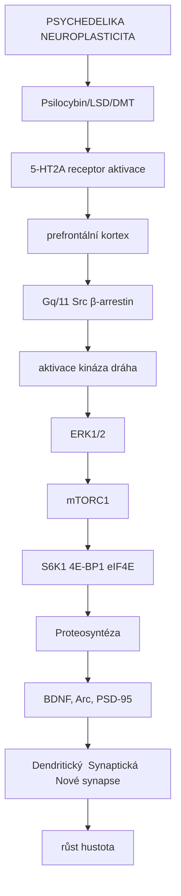

<details>
<summary>ASCII verze diagramu</summary>

```
    PSYCHEDELIKA → NEUROPLASTICITA

    [Psilocybin/LSD/DMT]
              │
              ▼
    ┌─────────────────────────────────────────────┐
    │        5-HT2A receptor aktivace             │
    │              (prefrontální kortex)          │
    └────────────────────┬────────────────────────┘
                         │
           ┌─────────────┼─────────────┐
           ↓             ↓             ↓
    ┌──────────┐  ┌──────────┐  ┌──────────┐
    │   Gq/11  │  │    Src   │  │ β-arrestin│
    │  aktivace│  │  kináza  │  │   dráha   │
    └────┬─────┘  └────┬─────┘  └────┬──────┘
         │             │             │
         ↓             ↓             ↓
    ┌──────────────────────────────────────────┐
    │              ERK1/2                       │
    │                 ↓                         │
    │              mTORC1                       │
    │                 ↓                         │
    │     ┌───────────┼───────────┐            │
    │     ↓           ↓           ↓            │
    │   S6K1       4E-BP1       eIF4E          │
    │     │           │           │            │
    │     └───────────┼───────────┘            │
    │                 ↓                         │
    │       Proteosyntéza                       │
    │       (BDNF, Arc, PSD-95)                │
    │                 ↓                         │
    │   ┌─────────────┼─────────────┐          │
    │   ↓             ↓             ↓          │
    │ Dendritický  Synaptická  Nové synapse    │
    │   růst       hustota                      │
    └──────────────────────────────────────────┘
```

</details>

### Psychoplastogeny

Psychoplastogeny jsou látky schopné indukovat rapidní neuroplasticitu, zejména dendritický růst a synaptogenezi.

| Látka | 5-HT2A afinita | Plasticita | Halucinace |
|-------|----------------|------------|------------|
| [**Psilocybin**](@/alkaloids/psilocybin.md) | Vysoká | +++ | Ano |
| [**LSD**](@/alkaloids/lsd.md) | Velmi vysoká | +++ | Ano |
| [**DMT**](@/alkaloids/dmt.md) | Střední | +++ | Ano |
| **Ketamin** | Žádná | ++ | Částečně |
| **Tabernantolog** | N/A | ++ | Ne |
| **ISRIB** | Žádná | + | Ne |

### Experimentální důkazy

#### In vitro studie (kortikální neurony)

| Parametr | Kontrola | Po DMT/LSD | Změna |
|----------|----------|------------|-------|
| Dendritický arbor | 100% | 140% | +40% |
| Počet spinů | 100% | 125% | +25% |
| Synaptická hustota | 100% | 130% | +30% |
| Frekvence mEPSC | Bazální | Zvýšená | +50% |

#### In vivo studie (hlodavci)

| Studie | Látka | Výsledek |
|--------|-------|----------|
| Ly et al. 2018 | DMT | Zvýšená dendritická komplexita v PFC |
| Shao et al. 2021 | Psilocybin | Zvýšená synaptická hustota 24h po podání |
| Hesselgrave et al. 2021 | Psilocybin | Obnovení synaptických spojení po chronickém stresu |

### Časový průběh plasticity po psilocybinu

```mermaid
flowchart TD
    node_CASOVPRBHNEUROPLASTI["CASOVÝ PRŮBĚH NEUROPLASTICITY"]
    node_aspopodnEfekt["Čas po podání                     Efekt"]
    node_06hodinAkutnpsychede["0-6 hodin       Akutní psychedelický účinek"]
    node_Receptoraktivacesign["Receptor aktivace, signální kaskády"]
    node_624hodinGenovexprese["6-24 hodin      Genová exprese BDNF, Arc, c-fos"]
    node_mRNAsyntza["mRNA syntéza"]
    node_2472hodinProteosyntz["24-72 hodin     Proteosyntéza"]
    node_Dendritickrst["Dendritický růst"]
    node_Spineformace["Spine formace"]
    node_MAXIMUMPLASTICITY["MAXIMUM PLASTICITY"]
    node_12tdnyKonsolidacesyn["1-2 týdny       Konsolidace synapsí"]
    node_Funknintegrace["Funkční integrace"]
    node_13msceTrvalstrukturl["1-3 měsíce      Trvalé strukturální změny"]
    node_Stabilnnovkonektivit["Stabilní nová konektivita"]
    node_6mscDlouhodobbehavio["6+ měsíců       Dlouhodobé behaviorální změny"]
    node_Trvajcterapeutickefe["Trvající terapeutický efekt"]

    node_CASOVPRBHNEUROPLASTI --> node_aspopodnEfekt
    node_aspopodnEfekt --> node_06hodinAkutnpsychede
    node_06hodinAkutnpsychede --> node_Receptoraktivacesign
    node_Receptoraktivacesign --> node_624hodinGenovexprese
    node_624hodinGenovexprese --> node_mRNAsyntza
    node_mRNAsyntza --> node_2472hodinProteosyntz
    node_2472hodinProteosyntz --> node_Dendritickrst
    node_Dendritickrst --> node_Spineformace
    node_Spineformace --> node_MAXIMUMPLASTICITY
    node_MAXIMUMPLASTICITY --> node_12tdnyKonsolidacesyn
    node_12tdnyKonsolidacesyn --> node_Funknintegrace
    node_Funknintegrace --> node_13msceTrvalstrukturl
    node_13msceTrvalstrukturl --> node_Stabilnnovkonektivit
    node_Stabilnnovkonektivit --> node_6mscDlouhodobbehavio
    node_6mscDlouhodobbehavio --> node_Trvajcterapeutickefe

    click node_Receptoraktivacesign "/glossary/receptor/" "Receptor aktivace, signální kaskády"
```

<details>
<summary>ASCII verze diagramu</summary>

```
    CASOVÝ PRŮBĚH NEUROPLASTICITY

    Čas po podání                     Efekt
    ─────────────────────────────────────────────────
    0-6 hodin      │ Akutní psychedelický účinek
                   │ Receptor aktivace, signální kaskády
                   │
    6-24 hodin     │ Genová exprese (BDNF, Arc, c-fos)
                   │ mRNA syntéza
                   │
    24-72 hodin    │ Proteosyntéza
                   │ Dendritický růst
                   │ Spine formace
                   │ MAXIMUM PLASTICITY
                   │
    1-2 týdny      │ Konsolidace synapsí
                   │ Funkční integrace
                   │
    1-3 měsíce     │ Trvalé strukturální změny
                   │ Stabilní nová konektivita
                   │
    6+ měsíců      │ Dlouhodobé behaviorální změny
                   │ Trvající terapeutický efekt
```

</details>

### Srovnání s antidepresivy

| Parametr | SSRI | Ketamin | Psilocybin |
|----------|------|---------|------------|
| Nástup plasticity | Týdny | Hodiny | Hodiny |
| BDNF elevace | Postupná | Rychlá | Velmi rychlá |
| Synaptogeneze | Pomalá | Rychlá | Velmi rychlá |
| Trvání efektu | Vyžaduje denní dávky | 1-2 týdny | Týdny-měsíce |
| Mechanismus | Serotoninová elevace | [NMDA](@/receptors/nmda.md) blokáda → AMPA | [5-HT2A](@/receptors/5-ht2a.md) agonismus |

---

## Kritická období

### Definice a charakteristika

Kritická období jsou vývojové fáze se zvýšenou plasticitou, během kterých je mozek obzvláště citlivý na environmentální podněty.

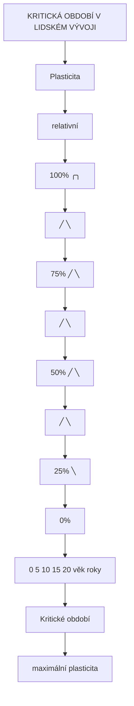

<details>
<summary>ASCII verze diagramu</summary>

```
    KRITICKÁ OBDOBÍ V LIDSKÉM VÝVOJI

    Plasticita
    (relativní)
    100% ┤     ╭───╮
         │    ╱     ╲
      75%┤   ╱       ╲
         │  ╱         ╲
      50%┤ ╱           ╲
         │╱             ╲
      25%┤               ╲────────────────
         │
       0%┼──────┼──────┼──────┼──────┼──────→
         0     5     10     15     20    věk (roky)

              ↑─────────↑
           Kritické období
           (maximální plasticita)
```

</details>

### Senzorická kritická období

| Systém | Kritické období | Důsledky deprivace |
|--------|-----------------|---------------------|
| **Zrak** | 0-8 let | Amblyopie, ztráta binokulárního vidění |
| **Sluch** | 0-4 roky | Poruchy řečového vývoje |
| **Jazyk** | 0-12 let | Obtížné učení nových jazyků |
| **Motorika** | 0-6 let | Jemná motorická neobratnost |
| **Sociální** | 0-3 roky | Attachmentové poruchy |

### Molekulární regulace kritických období

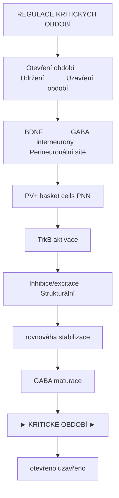

<details>
<summary>ASCII verze diagramu</summary>

```
    REGULACE KRITICKÝCH OBDOBÍ

    Otevření období        Udržení            Uzavření období
    ────────────────    ───────────────    ─────────────────────

    BDNF ↑              GABA interneurony   Perineuronální sítě
         │              (PV+ basket cells)   (PNN)
         ↓                    │                   │
    TrkB aktivace             ↓                   ↓
         │              Inhibice/excitace    Strukturální
         ↓              rovnováha            stabilizace
    GABA maturace             │                   │
         │                    ↓                   ↓
         └────────────► KRITICKÉ OBDOBÍ ────────►│
                       (otevřeno)         (uzavřeno)
```

</details>

### Znovuotevření kritických období

Některé intervence mohou "znovuotevřít" kritická období:

| Intervence | Mechanismus | Experimentální důkazy |
|------------|-------------|------------------------|
| **Psychedelika** | [5-HT2A](@/receptors/5-ht2a.md) aktivace, PNN degradace | Obnovení okulární dominance u dospělých myší |
| **Valproát** | HDAC inhibice | Absolutní sluch u dospělých |
| **Chondroitináza** | PNN degradace | Obnovení plasticity zraku |
| **Temná deprivace** | Resetování vizuálního kortexu | Obnovení amblyopie u koček |
| **SSRI (fluoxetin)** | Serotoninová modulace | Částečné obnovení plasticity |

### MDMA a sociální kritické období

| Studie | Zjištění |
|--------|----------|
| Nardou et al. 2019 | MDMA znovuotevírá kritické období pro sociální učení u myší |
| Mechanismus | Oxytocinová a serotoninová signalizace |
| Implikace | Potenciální využití v terapii autismu, sociální úzkosti |

---

## Terapeutické implikace

### Deprese a neuroplasticita

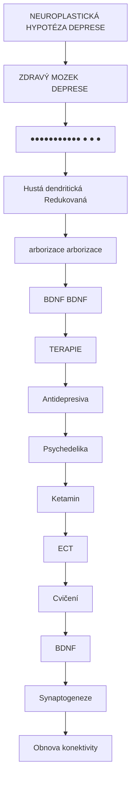

<details>
<summary>ASCII verze diagramu</summary>

```
    NEUROPLASTICKÁ HYPOTÉZA DEPRESE

    ZDRAVÝ MOZEK                    DEPRESE
    ┌──────────────────┐           ┌──────────────────┐
    │                  │           │                  │
    │  ●●●●●●●●●●●     │           │  ●    ●    ●     │
    │  │││││││││││     │           │  │    │    │     │
    │  Hustá dendritická│          │  Redukovaná      │
    │  arborizace       │          │  arborizace      │
    │                  │           │                  │
    │  BDNF ↑↑↑       │           │  BDNF ↓↓↓       │
    │                  │           │                  │
    └──────────────────┘           └──────────────────┘

                       TERAPIE
                          │
                          ▼
                  ┌──────────────────┐
                  │  Antidepresiva   │
                  │  Psychedelika    │
                  │  Ketamin         │
                  │  ECT             │
                  │  Cvičení         │
                  └────────┬─────────┘
                           │
                           ▼
                      BDNF ↑
                      Synaptogeneze
                      Obnova konektivity
```

</details>

### PTSD a strach

| Fáze | Plasticita | Terapeutická intervence |
|------|------------|-------------------------|
| Konsolidace strachu | LTP v amygdale | Prevence (beta-blokátory) |
| Extinkce | Nové inhibiční synapse | Expoziční terapie |
| Rekonsolidace | Destabilizace paměti | Propranolol + reaktivace |
| Psychedeliky asist. terapie | Zvýšená plasticita | [Psilocybin](@/alkaloids/psilocybin.md) + terapie |

### Závislosti

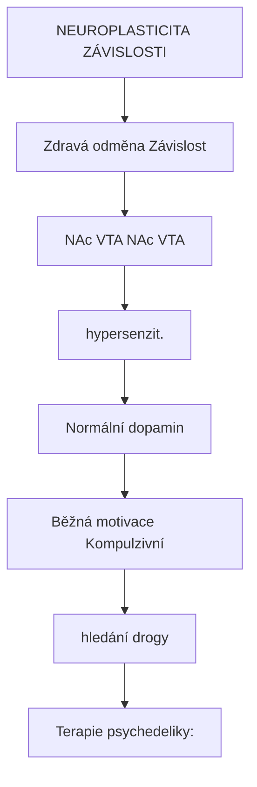

<details>
<summary>ASCII verze diagramu</summary>

```
    NEUROPLASTICITA ZÁVISLOSTI

    Zdravá odměna              Závislost
    ┌──────────────────┐       ┌──────────────────┐
    │                  │       │                  │
    │  NAc ←── VTA     │       │  NAc ←══ VTA     │
    │   │              │       │   ║              │
    │   ↓              │       │   ║ (hypersenzit.)│
    │  Normální dopamin│       │   ║              │
    │                  │       │   ↓              │
    │  Běžná motivace  │       │  Kompulzivní    │
    │                  │       │  hledání drogy   │
    └──────────────────┘       └──────────────────┘

    Terapie psychedeliky:
    - Narušení maladaptivních synaptických vzorců
    - Formování nových, zdravých neurálních drah
    - Zvýšená kognitivní flexibilita
```

</details>

### Mrtvice a rehabilitace

| Fáze | Plasticita | Intervence |
|------|------------|------------|
| Akutní (0-7 dní) | Poškození, edém | Neuroprotekce |
| Subakutní (1-4 týdny) | Spontánní plasticita ↑↑ | Intenzivní rehabilitace |
| Chronická (>3 měsíce) | Plasticita ↓ | Farmakologická augmentace |

---

## Faktory ovlivňující neuroplasticitu

### Pozitivní faktory

| Faktor | Mechanismus | Doporučení |
|--------|-------------|------------|
| **Fyzické cvičení** | BDNF ↑, VEGF ↑, neurogeneze | 150 min/týden aerobního cvičení |
| **Spánek** | Konsolidace synapsí, pruning | 7-9 hodin kvalitního spánku |
| **Učení** | Synaptická aktivita, LTP | Kontinuální vzdělávání |
| **Sociální interakce** | Oxytocin, neurální aktivace | Pravidelný sociální kontakt |
| **Meditace** | Kortikální změny, BDNF | Pravidelná praxe |
| **Omega-3** | DHA v membránách | 1-2g EPA+DHA denně |
| **Polyfenoly** | Antioxidace, BDNF | Ovoce, zelenina, čaj |

### Negativní faktory

| Faktor | Mechanismus | Důsledek |
|--------|-------------|----------|
| **Chronický stres** | Kortizol ↑, BDNF ↓ | Atrofie hippocampu |
| **Deprivace spánku** | Narušená konsolidace | Kognitivní deficity |
| **Sedavý životní styl** | BDNF ↓ | Zrychlené stárnutí mozku |
| **Izolace** | Snížená stimulace | Kognitivní pokles |
| **Chronický alkohol** | Neurotoxicita | Strukturální atrofie |
| **Stárnutí** | Progresivní pokles | Snížená adaptabilita |

---

## Molekulární dráhy plasticity

### Klíčové signální kaskády

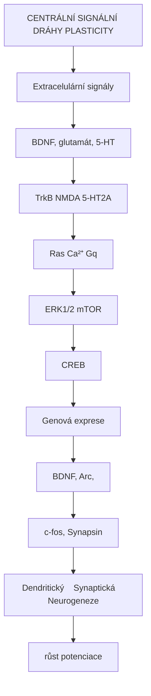

<details>
<summary>ASCII verze diagramu</summary>

```
    CENTRÁLNÍ SIGNÁLNÍ DRÁHY PLASTICITY

                    Extracelulární signály
                    (BDNF, glutamát, 5-HT)
                              │
              ┌───────────────┼───────────────┐
              ↓               ↓               ↓
         ┌─────────┐    ┌─────────┐    ┌─────────┐
         │  TrkB   │    │  NMDA   │    │ 5-HT2A  │
         └────┬────┘    └────┬────┘    └────┬────┘
              │              │              │
              ↓              ↓              ↓
         ┌─────────┐    ┌─────────┐    ┌─────────┐
         │   Ras   │    │  Ca²⁺   │    │   Gq    │
         └────┬────┘    └────┬────┘    └────┬────┘
              │              │              │
              └──────────────┼──────────────┘
                             │
                ┌────────────┴────────────┐
                ↓                         ↓
           ┌─────────┐              ┌─────────┐
           │ERK1/2   │              │  mTOR   │
           └────┬────┘              └────┬────┘
                │                        │
                └────────────┬───────────┘
                             │
                             ↓
                       ┌─────────┐
                       │  CREB   │
                       └────┬────┘
                             │
                             ↓
                   ┌─────────────────┐
                   │ Genová exprese  │
                   │ (BDNF, Arc,     │
                   │  c-fos, Synapsin)│
                   └────────┬────────┘
                             │
              ┌──────────────┼──────────────┐
              ↓              ↓              ↓
         Dendritický    Synaptická    Neurogeneze
            růst        potenciace
```

</details>

### Epigenetická regulace

| Modifikace | Enzym | Efekt na plasticitu |
|------------|-------|---------------------|
| DNA metylace | DNMT3a | Represivní (pamětové geny) |
| Histonová acetylace | HAT (CBP) | Aktivační (BDNF, Arc) |
| Histonová deacetylace | HDAC | Represivní |
| Histonová metylace | HMT | Kontext-závislá |
| miRNA | Dicer | Post-transkripční regulace |

---

## Měření neuroplasticity

### Strukturální markery

| Metoda | Co měří | Rozlišení |
|--------|---------|-----------|
| **MRI volumetrie** | Objem šedé hmoty | mm |
| **DTI** | Integrita bílé hmoty | mm |
| **Mikroskopie** | Dendrity, spiny | μm |
| **Synaptické markery** | PSD-95, synaptofyzin | Molekulární |

### Funkční markery

| Metoda | Co měří | Časové rozlišení |
|--------|---------|------------------|
| **fMRI** | BOLD signál, konektivita | Sekundy |
| **EEG/MEG** | Neuronální aktivita | Milisekundy |
| **PET** | Receptor denzita, metabolismus | Minuty |
| **TMS** | Kortikální excitabilita | Okamžité |

### Biomarkery v krvi

| Marker | Význam | Změna po intervenci |
|--------|--------|---------------------|
| **BDNF (sérum)** | Neurotrofní aktivita | ↑ po cvičení, psychedelikách |
| **proBDNF** | Prekurzor | Poměr proBDNF/BDNF |
| **NGF** | Neurotrofní faktor | ↑ po obohaceném prostředí |
| **VEGF** | Angiogeneze/neurogeneze | ↑ po cvičení |

---

## Reference

### Základní literatura

1. Hebb, D.O. (1949). *The Organization of Behavior*. Wiley.

2. Bliss, T.V. & Collingridge, G.L. (1993). *A synaptic model of memory: long-term potentiation in the hippocampus*. Nature.

3. Kandel, E.R. (2001). *The molecular biology of memory storage: a dialogue between genes and synapses*. Science.

### Psychedelika a plasticita

4. Ly, C. et al. (2018). *Psychedelics Promote Structural and Functional Neural Plasticity*. Cell Reports.

5. Shao, L.X. et al. (2021). *Psilocybin induces rapid and persistent growth of dendritic spines in frontal cortex in vivo*. Neuron.

6. Hesselgrave, N. et al. (2021). *Harnessing psilocybin: antidepressant-like behavioral and synaptic actions of psilocybin are independent of 5-HT2R activation in mice*. PNAS.

### BDNF a neurotrofní faktory

7. Castren, E. & Antila, H. (2017). *Neuronal plasticity and neurotrophic factors in drug responses*. Molecular Psychiatry.

8. Duman, R.S. & Aghajanian, G.K. (2012). *Synaptic dysfunction in depression: potential therapeutic targets*. Science.

### Kritická období

9. Hensch, T.K. (2005). *Critical period plasticity in local cortical circuits*. Nature Reviews Neuroscience.

10. Nardou, R. et al. (2019). *Oxytocin-dependent reopening of a social reward learning critical period with MDMA*. Nature.

### Přehledové články

11. Pascual-Leone, A. et al. (2005). *The plastic human brain cortex*. Annual Review of Neuroscience.

12. Vollenweider, F.X. & Preller, K.H. (2020). *Psychedelic drugs: neurobiology and potential for treatment of psychiatric disorders*. Nature Reviews Neuroscience.

---

## Viz také

### Receptory a signalizace
- [5-HT2A receptor](@/receptors/5-ht2a.md) - Hlavní cíl psychedelik, klíčový pro indukci plasticity
- [NMDA receptor](@/receptors/nmda.md) - "Detektor koincidence" pro LTP
- [GABA-A receptor](@/receptors/gaba-a.md) - Inhibiční kontrola plasticity
- [Receptor](@/glossary/receptor.md) - Obecný přehled

### Psychoaktivní látky
- [Psilocybin](@/alkaloids/psilocybin.md) - Psychoplastogen s terapeutickým potenciálem
- [LSD](@/alkaloids/lsd.md) - Potentní induktor neuroplasticity
- [DMT](@/alkaloids/dmt.md) - Endogenní psychoplastogen
- [Ketamin](@/alkaloids/ketamin.md) - Rychle působící antidepresivum

### Neurotransmitery
- [GABA](@/glossary/gaba.md) - Inhibiční neurotransmiter
- [Nukleotid](@/glossary/nukleotid.md) - Stavební jednotky signálních molekul

### Mozkové struktury
- [Mozek](@/brain/_index.md) - Přehled neuroanatomie
- [Hippocampus](@/brain/hippocampus.md) - Centrum paměti a neurogeneze

### Houbové zdroje
- [Psilocybe houby](@/shrooms/psilocybes/_index.md) - Přírodní zdroje psilocybinu

---

<- Zpět na [Glosář](@/glossary/_index.md)
