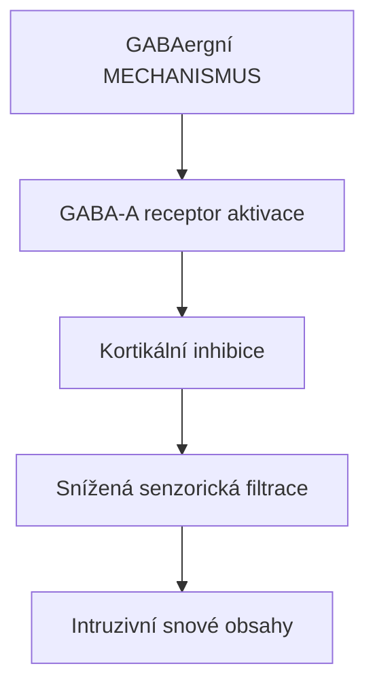
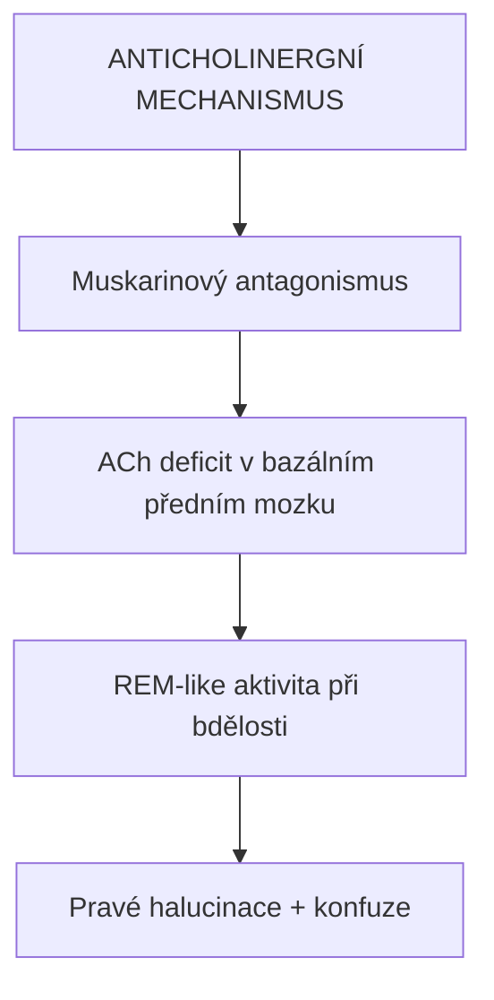

+++
title = "Oneirogenní"
description = "Oneirogenní látky - psychoaktiva vyvolávající snům podobné stavy, mechanismy, příklady a srovnání s psychedeliky"
weight = 30
insert_anchor_links = "right"

[taxonomies]
categories = ["farmakologie", "terminologie", "fenomenologie"]
tags = ["oneirogenní", "sny", "lucidní sny", "muscimol", "halucinogeny", "deliranty"]
+++

# Oneirogenní látky

**Oneirogenní** (z řeckého *oneiros* = sen + *-genní* = vytvářející) jsou látky, které vyvolávají **stavy podobné snění** při zachované částečné bdělosti. Na rozdíl od klasických psychedelik neprodukují primárně geometrické halucinace, ale spíše narativní, snové sekvence.

---

## Definice a charakteristika

### Klíčové rysy

| Rys | Popis |
|-----|-------|
| **Snová kvalita** | Zážitky připomínají sny |
| **Narativní struktura** | Příběhovité, sekvenční obsahy |
| **Snížená orientace** | Částečná ztráta kontaktu s realitou |
| **Hypnagogické/hypnopompické** | Blízké stavům při usínání/probouzení |
| **Amnézie** | Fragmentární paměť na zážitek |

### Srovnání s jinými kategoriemi

| Kategorie | Primární efekt | Orientace | Příklady |
|-----------|----------------|-----------|----------|
| **Psychedelické** | Vizuální, kognitivní | Zachovaná | [Psilocybin](@/alkaloids/psilocybin.md), [LSD](@/alkaloids/lsd.md) |
| **Disociativní** | Odpojení od reality | Variabilní | [Ketamin](@/alkaloids/ketamin.md) |
| **Deliriantní** | Pravé halucinace | Ztracená | Scopolamin, Datura |

---

## Mechanismy

### GABAergní oneirogeny



<details>
<summary>ASCII verze diagramu</summary>

```
GABAergní MECHANISMUS

GABA-A receptor aktivace
        ↓
Kortikální inhibice
        ↓
Snížená senzorická filtrace
        ↓
Intruzivní snové obsahy
```

</details>


### Anticholinergní oneirogeny



<details>
<summary>ASCII verze diagramu</summary>

```
ANTICHOLINERGNÍ MECHANISMUS

Muskarinový antagonismus
        ↓
ACh deficit v bazálním předním mozku
        ↓
REM-like aktivita při bdělosti
        ↓
Pravé halucinace + konfuze
```

</details>

**Příklady**: Scopolamin, atropin, Datura (tropanové alkaloidy)

---

## Fenomenologie

### Typy oneirogenních zážitků

| Typ | Popis | Bdělost |
|-----|-------|---------|
| **Hypnagogické** | Při usínání | Vysoká → nízká |
| **Oneirické halucinace** | Snové vize při bdělosti | Střední |
| **Lucidní fragmenty** | Vědomí snového stavu | Variabilní |
| **Delirantní** | Nerozeznatelné od reality | Nízká |

### Subjektivní popis

> "Není to jako psychedelikum - nevidíš geometrické vzory nebo barvy. Je to jako kdybys snil, ale věděl, že bdíš. Věci, které vidíš, dávají v tu chvíli naprostý smysl, jako ve snu, ale po odeznění si uvědomíš, jak byly bizarní."

---

## Příklady oneirogenních látek

### Primární oneirogeny

| Látka | Mechanismus | Charakter |
|-------|-------------|-----------|
| **Gaboxadol (THIP)** | GABA-A agonista | Výzkumný |
| **Ambien (zolpidem)** | GABA-A PAM (α1) | Hypnotikum s oneirogenními efekty |

### Sekundární oneirogeny

| Látka | Primární kategorie | Oneirogenní prvky |
|-------|-------------------|-------------------|
| **Scopolamin** | Deliriant | Silné |
| **[DMT](@/alkaloids/dmt.md)** | Psychedelikum | Při breakthrough |
| **Salvinorin A** | κ-opioid | Disociativní-oneirické |

---

## Terapeutické aplikace

### Potenciální využití

| Oblast | Stav | Rationale |
|--------|------|-----------|
| **Spánkové poruchy** | Insomnie | GABAergní modulace |
| **Lucidní snění** | Výzkum vědomí | REM modulace |
| **PTSD** | Noční můry | Modifikace snění |

### Limitace

- Amnézie komplikuje terapeutickou integraci
- Úzké terapeutické okno
- Riziko závislosti (GABAergika)

---

## Viz také

### Látky
- [Účinky muscimolu](@/phenomenology/muscimol-effects.md) - Detailní fenomenologie
- [DMT](@/alkaloids/dmt.md) - Psychedelikum s oneirogenními prvky

### Receptory
- [GABA-A receptor](@/receptors/gaba-a.md) - Cíl GABAergních oneirogenů

### Související pojmy
- [Set and setting](@/glossary/set-and-setting.md) - Kontext zážitku
- [Tolerance](@/glossary/tolerance.md) - Rychlá u GABAergik

---

← Zpět na [Glosář](@/glossary/_index.md)
