+++
title = "Receptor"
description = "Kompletni pruvodce receptorovou biologii - klasifikace, signalni dráhy, farmakologie a klinický význam"
weight = 2
insert_anchor_links = "right"
+++

# Receptor - Molekulární brána buněčné komunikace

**Receptor** je specifická proteinová molekula, která se nachází na povrchu nebo uvnitř buněk a rozpoznává a váže specifické signální molekuly (**ligandy**). Tato interakce spouští kaskádu intracelulárních signálů vedoucích k biologické odpovědi. Receptory jsou fundamentálními cíli psychoaktivních látek včetně [psychedelik](@/alkaloids/_index.md), [GABAergních látek](@/glossary/gaba.md) a disociativ.

---

## Klasifikace receptorů

### Podle mechanismu signální transdukce

| Typ | Mechanismus | Rychlost odpovědi | Příklady |
|-----|-------------|-------------------|----------|
| **Ionotropní** | Ligandem řízený iontový kanál | Milisekundy | [GABA-A](@/receptors/gaba-a.md), [NMDA](@/receptors/nmda.md), AMPA, nikotinový |
| **Metabotropní (GPCR)** | G-protein spřažený receptor | Sekundy-minuty | [5-HT2A](@/receptors/5-ht2a.md), D2, mGluR, opioidní |
| **Tyrozin kinázové** | Enzymatická aktivita | Minuty-hodiny | Inzulinový receptor, EGF receptor |
| **Intracelulární** | Jaderné receptory | Hodiny-dny | Steroidní, thyroidní, retinoidní |

### Podle endogenního ligandu

| Neurotransmiterový systém | Receptory | Funkce |
|---------------------------|-----------|--------|
| **Serotonergní** | 5-HT1A, [5-HT2A](@/receptors/5-ht2a.md), 5-HT2B, 5-HT2C, 5-HT3 | Nálada, percepce, kognice |
| **Dopaminergní** | D1, D2, D3, D4, D5 | Odměna, motivace, motorika |
| **Glutamátový** | [NMDA](@/receptors/nmda.md), AMPA, kainátový, mGluR | Excitace, plasticita, paměť |
| **GABAergní** | [GABA-A](@/receptors/gaba-a.md), GABA-B | Inhibice, anxiolýza, sedace |
| **Cholinergní** | Nikotinový (nAChR), muskarinový (mAChR) | Kognice, autonomní funkce |
| **Opioidní** | mu, delta, kappa | Analgezie, euforie |
| **Kanabinoidní** | CB1, CB2 | Neuromodulace, imunita |

---

## Ionotropní receptory

### Struktura a mechanismus

Ionotropní receptory jsou **ligandem řízené iontové kanály** (LGIC - Ligand-Gated Ion Channels). Vazba ligandu přímo otevírá iontový kanál bez potřeby sekundárních messengerů.

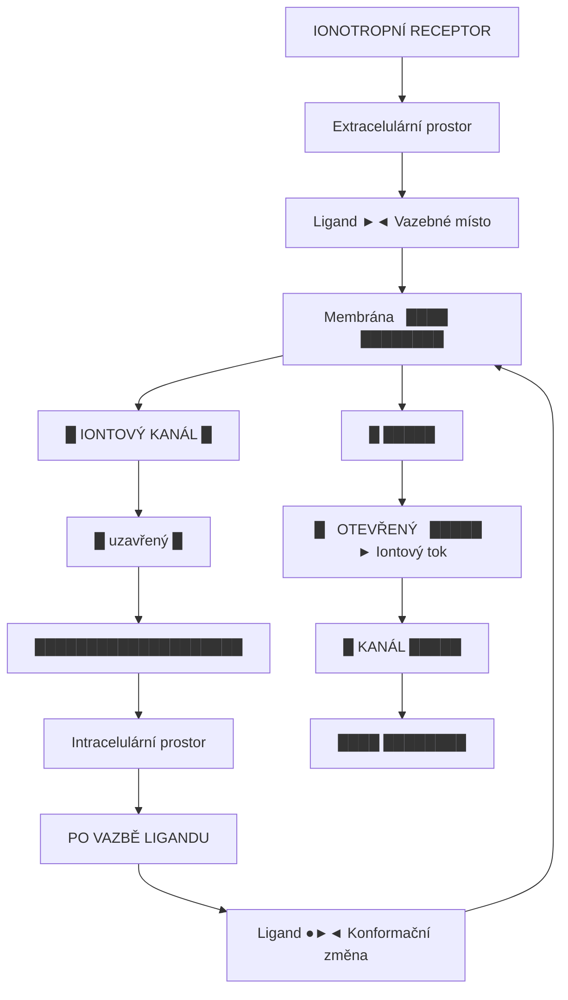

<details>
<summary>ASCII verze diagramu</summary>

```
                    IONOTROPNÍ RECEPTOR

              Extracelulární prostor
                      │
    Ligand ──────────►│◄──────── Vazebné místo
                      │
         ┌────────────┴────────────┐
Membrána │  ████████████████████  │
         │  █   IONTOVÝ KANÁL  █  │
         │  █     (uzavřený)   █  │
         │  ████████████████████  │
         └────────────┬────────────┘
                      │
              Intracelulární prostor


                  PO VAZBĚ LIGANDU

              Extracelulární prostor
                      │
    Ligand ●─────────►│◄──────── Konformační změna
                      │
         ┌────────────┴────────────┐
Membrána │  ████        ████████  │
         │  █              █████  │
         │  █   OTEVŘENÝ   █████  │──► Iontový tok
         │  █    KANÁL     █████  │
         │  ████        ████████  │
         └────────────┬────────────┘
                      │
              Intracelulární prostor
```

</details>

### Rodiny ionotropních receptorů

| Rodina | Struktura | Selektivita | Příklady |
|--------|-----------|-------------|----------|
| **Cys-loop** | Pentamer | Kationty/Anionty | [GABA-A](@/receptors/gaba-a.md), nAChR, 5-HT3, GlyR |
| **Glutamátové** | Tetramer | Kationty (Ca²⁺, Na⁺) | [NMDA](@/receptors/nmda.md), AMPA, Kainátový |
| **P2X (ATP)** | Trimer | Kationty | P2X1-7 |
| **TRP kanály** | Tetramer | Kationty | TRPV1 (kapsaicin), TRPM8 (menthol) |

### Kinetika ionotropních receptorů

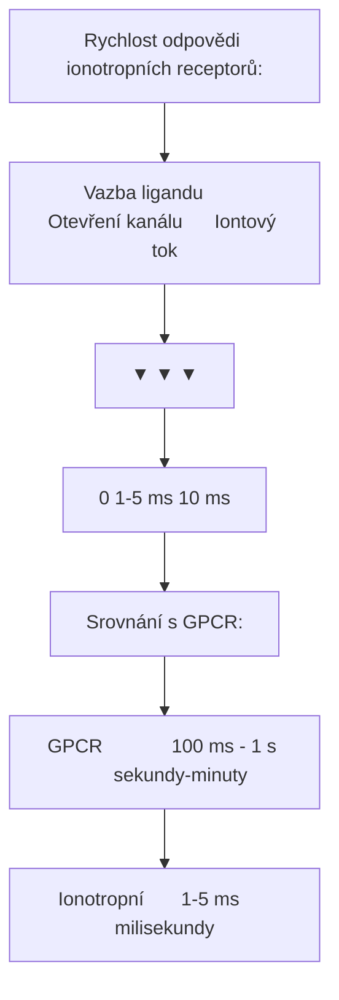

<details>
<summary>ASCII verze diagramu</summary>

```
Rychlost odpovědi ionotropních receptorů:

      Vazba ligandu        Otevření kanálu      Iontový tok
           │                    │                   │
           ▼                    ▼                   ▼
    ├──────────────────────────────────────────────────┤
    0                1-5 ms                        10 ms

Srovnání s GPCR:

    GPCR            │ 100 ms - 1 s │      sekundy-minuty
    Ionotropní      │ 1-5 ms │     milisekundy
```

</details>

### [GABA-A receptor](@/receptors/gaba-a.md) - Inhibiční ionotropní receptor

| Vlastnost | Hodnota |
|-----------|---------|
| **Struktura** | Pentamer (α, β, γ, δ podjednotky) |
| **Ion** | Cl⁻ (chloridový) |
| **Efekt** | Hyperpolarizace, inhibice |

### [NMDA receptor](@/receptors/nmda.md) - Excitační ionotropní receptor

| Vlastnost | Hodnota |
|-----------|---------|
| **Struktura** | Tetramer (GluN1, GluN2A-D) |
| **Iony** | Ca²⁺, Na⁺ (influx), K⁺ (eflux) |
| **Efekt** | Depolarizace, synaptická plasticita |
| **Jedinečnost** | Vyžaduje glutamát + glycin + depolarizaci |

---

## Metabotropní receptory (GPCR)

### G-proteiny spřažené receptory

**GPCR** (G-Protein Coupled Receptors) tvoří největší rodinu membránových receptorů v lidském genomu (~800 členů). Všechny sdílejí charakteristickou strukturu sedmi transmembránových domén (7TM).

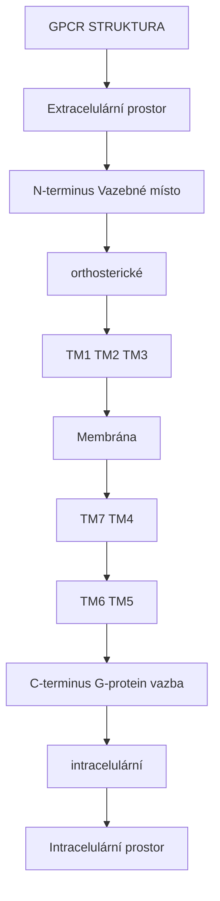

<details>
<summary>ASCII verze diagramu</summary>

```
                    GPCR STRUKTURA

             Extracelulární prostor
                     │
    N-terminus ──────┼────── Vazebné místo
        │           │          (orthosterické)
        │      ┌────┴────┐
        │ TM1  │   TM2   │  TM3
        ├──────┼─────────┼──────┤
Membrána│      │         │      │
        │ TM7  │         │  TM4 │
        ├──────┼─────────┼──────┤
        │      │   TM6   │  TM5 │
        │      └────┬────┘      │
        │           │           │
    C-terminus ─────┼───── G-protein vazba
                    │       (intracelulární)
             Intracelulární prostor
```

</details>

### Typy G-proteinů

| G-protein | Efektorový enzym | Sekundární messenger | Buněčná odpověď |
|-----------|------------------|---------------------|------------------|
| **Gαs** | Adenylyl cykláza ↑ | cAMP ↑ | PKA aktivace |
| **Gαi/o** | Adenylyl cykláza ↓ | cAMP ↓ | PKA inhibice |
| **Gαq/11** | Fosfolipáza C (PLC) | IP₃ + DAG | Ca²⁺ ↑, PKC |
| **Gα12/13** | Rho GEF | Rho aktivace | Cytoskelet |
| **Gβγ** | K⁺ kanály, PLC | Variabilní | Modulace |

### Signální kaskáda Gq/11 ([5-HT2A](@/receptors/5-ht2a.md))

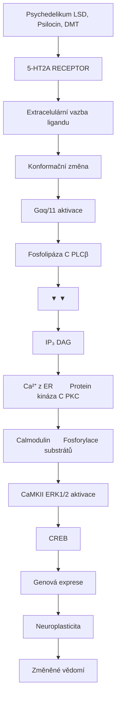

<details>
<summary>ASCII verze diagramu</summary>

```
Psychedelikum (LSD, Psilocin, DMT)
              │
              ▼
┌─────────────────────────────────────────────────┐
│            5-HT2A RECEPTOR                       │
│                                                  │
│     Extracelulární vazba ligandu                │
│                   │                              │
│                   ▼                              │
│          Konformační změna                       │
│                   │                              │
│                   ▼                              │
│     ┌─────────────────────────┐                 │
│     │    Gαq/11 aktivace      │                 │
│     └───────────┬─────────────┘                 │
│                 │                                │
│                 ▼                                │
│        Fosfolipáza C (PLCβ)                     │
│                 │                                │
│       ┌─────────┴─────────┐                     │
│       ▼                   ▼                     │
│     IP₃                 DAG                     │
│       │                   │                     │
│       ▼                   ▼                     │
│   Ca²⁺ z ER         Protein kináza C (PKC)     │
│       │                   │                     │
│       ▼                   ▼                     │
│   Calmodulin       Fosforylace substrátů       │
│       │                   │                     │
│       ▼                   ▼                     │
│    CaMKII           ERK1/2 aktivace            │
│       │                   │                     │
│       └─────────┬─────────┘                     │
│                 ▼                                │
│              CREB                                │
│                 │                                │
│                 ▼                                │
│         Genová exprese                          │
│         Neuroplasticita                         │
│         Změněné vědomí                          │
└─────────────────────────────────────────────────┘
```

</details>

### Signální kaskáda Gi/o (GABA-B, opioidní)

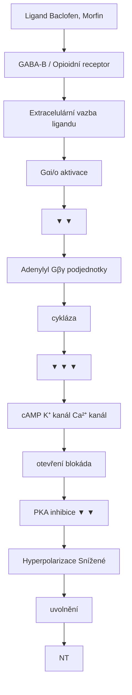

<details>
<summary>ASCII verze diagramu</summary>

```
Ligand (Baclofen, Morfin)
              │
              ▼
┌─────────────────────────────────────────────────┐
│          GABA-B / Opioidní receptor             │
│                                                  │
│     Extracelulární vazba ligandu                │
│                   │                              │
│                   ▼                              │
│     ┌─────────────────────────┐                 │
│     │     Gαi/o aktivace      │                 │
│     └───────────┬─────────────┘                 │
│                 │                                │
│       ┌─────────┴─────────────────┐             │
│       ▼                           ▼             │
│   Adenylyl                    Gβγ podjednotky   │
│   cykláza ↓                       │             │
│       │                     ┌─────┴─────┐       │
│       ▼                     ▼           ▼       │
│   cAMP ↓                 K⁺ kanál   Ca²⁺ kanál  │
│       │                  otevření    blokáda    │
│       ▼                     │           │       │
│   PKA inhibice              ▼           ▼       │
│                     Hyperpolarizace  Snížené    │
│                                      uvolnění   │
│                                      NT         │
└─────────────────────────────────────────────────┘
```

</details>

### [5-HT2A receptor](@/receptors/5-ht2a.md) - Primární cíl psychedelik

| Vlastnost | Hodnota |
|-----------|---------|
| **G-protein** | Gq/11 |
| **Distribuce** | Prefrontální kortex, vizuální kortex |
| **Funkce** | Percepce, kognice, neuroplasticita |
| **Ligandy** | [LSD](@/alkaloids/lsd.md), [Psilocin](@/alkaloids/psilocin.md), [DMT](@/alkaloids/dmt.md) |

---

## Signální transdukce - Detailní přehled

### Sekundární messengery

| Messenger | Produkce | Funkce | Degradace |
|-----------|----------|--------|-----------|
| **cAMP** | Adenylyl cykláza | PKA aktivace, CREB | Fosfodiesterázy |
| **cGMP** | Guanylyl cykláza | PKG aktivace, vazodilatace | Fosfodiesterázy |
| **IP₃** | PLC (z PIP₂) | Ca²⁺ uvolnění z ER | Fosfatázy |
| **DAG** | PLC (z PIP₂) | PKC aktivace | Lipázy |
| **Ca²⁺** | VGCC, IP₃R, RyR | Univerzální messenger | SERCA, NCX |

### Proteinové kinázy v signalizaci

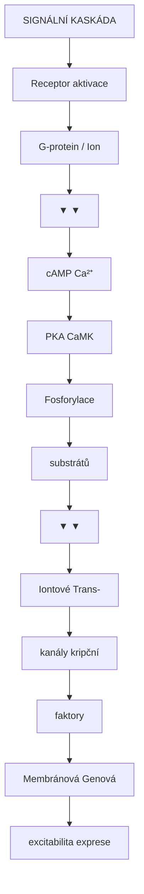

<details>
<summary>ASCII verze diagramu</summary>

```
                SIGNÁLNÍ KASKÁDA

    Receptor aktivace
           │
           ▼
    ┌─────────────────────────────────────┐
    │          G-protein / Ion            │
    └──────────────┬──────────────────────┘
                   │
         ┌─────────┴─────────┐
         ▼                   ▼
    ┌─────────┐         ┌─────────┐
    │  cAMP   │         │  Ca²⁺   │
    └────┬────┘         └────┬────┘
         │                   │
         ▼                   ▼
    ┌─────────┐         ┌─────────┐
    │   PKA   │         │  CaMK   │
    └────┬────┘         └────┬────┘
         │                   │
         └────────┬──────────┘
                  │
                  ▼
         ┌────────────────┐
         │  Fosforylace   │
         │  substrátů     │
         └────────┬───────┘
                  │
         ┌────────┴────────┐
         ▼                 ▼
    ┌─────────┐      ┌─────────┐
    │Iontové  │      │Trans-   │
    │kanály   │      │kripční  │
    │         │      │faktory  │
    └─────────┘      └─────────┘
         │                 │
         ▼                 ▼
    Membránová        Genová
    excitabilita      exprese
```

</details>

### Křížová komunikace signálních drah

| Dráha 1 | Dráha 2 | Interakce | Význam |
|---------|---------|-----------|--------|
| Gq (5-HT2A) | Gi (5-HT1A) | Antagonistická | Modulace psychedelického účinku |
| NMDA | AMPA | Synergická | LTP indukce |
| PKA | ERK | Konvergence | Synaptická plasticita |
| Ca²⁺ | cAMP | Křížová aktivace | Integrace signálů |

---

## Farmakologie receptorů

### Základní pojmy

| Pojem | Definice | Příklad |
|-------|----------|---------|
| **Ligand** | Molekula vážící se na receptor | Serotonin, [LSD](@/alkaloids/lsd.md) |
| **Antagonista** | Blokuje receptor bez aktivace | Ketanserin na 5-HT2A |
| **Parciální agonista** | Částečná aktivace | [Psilocin](@/alkaloids/psilocin.md) |
| **Inverzní agonista** | Snižuje bazální aktivitu | Pimavanserin |
| **Alosterický modulátor** | Mění odpověď na orthosterický ligand | Benzodiazepiny |

### Vazebná afinita a eficacia

```mermaid
flowchart TD
    node_RECEPTORFARMAKOLOGIE["RECEPTOR FARMAKOLOGIE"]
    node_AfinitaKiKdEficaciaE["Afinita Ki, Kd           Eficacia Emax"]
    node_4de977d6["▼                          ▼"]
    node_JakpevnseJaksiln["Jak pevně se             Jak silně"]
    node_ligandveaktivuje["ligand váže              aktivuje"]
    node_Ki1nMEmax100["Ki = 1 nM                 Emax = 100%"]
    node_ysokafinitaplnagonis["ysoká afinita          plný agonista"]
    node_Ki1000nMEmax50["Ki = 1000 nM              Emax = 50%"]
    node_nzkafinitaparcilnago["nízká afinita           parciální agonista"]
    node_DOSERESPONSEKIVKA["DOSE-RESPONSE KŘIVKA:"]
    node_Odpov["Odpověď"]
    node_100PlnagonistaEmax10["100              Plný agonista Emax 100%"]
    node_75["75         ╱"]
    node_ParcilnagonistaEmax5["╱    ╭ Parciální agonista Emax 50%"]
    node_50["50     ╱    ╱"]
    node_cbf19595["╱    ╱"]
    node_25["25 ╱    ╱"]
    node_0LogLigand["0  Log Ligand"]
    node_EC50EC50["EC50   EC50"]
    node_silnslab["silný slabý"]

    node_RECEPTORFARMAKOLOGIE --> node_AfinitaKiKdEficaciaE
    node_AfinitaKiKdEficaciaE --> node_4de977d6
    node_4de977d6 --> node_JakpevnseJaksiln
    node_JakpevnseJaksiln --> node_ligandveaktivuje
    node_ligandveaktivuje --> node_Ki1nMEmax100
    node_Ki1nMEmax100 --> node_ysokafinitaplnagonis
    node_ysokafinitaplnagonis --> node_Ki1000nMEmax50
    node_Ki1000nMEmax50 --> node_nzkafinitaparcilnago
    node_nzkafinitaparcilnago --> node_DOSERESPONSEKIVKA
    node_DOSERESPONSEKIVKA --> node_Odpov
    node_Odpov --> node_100PlnagonistaEmax10
    node_100PlnagonistaEmax10 --> node_75
    node_75 --> node_ParcilnagonistaEmax5
    node_ParcilnagonistaEmax5 --> node_50
    node_50 --> node_cbf19595
    node_cbf19595 --> node_25
    node_25 --> node_0LogLigand
    node_0LogLigand --> node_EC50EC50
    node_EC50EC50 --> node_silnslab
```

<details>
<summary>ASCII verze diagramu</summary>

```
                    RECEPTOR FARMAKOLOGIE

    Afinita (Ki, Kd)           Eficacia (Emax)
         │                          │
         ▼                          ▼
┌─────────────────┐        ┌─────────────────┐
│ Jak pevně se    │        │ Jak silně       │
│ ligand váže     │        │ aktivuje        │
└─────────────────┘        └─────────────────┘
         │                          │
         ▼                          ▼
    Ki = 1 nM                 Emax = 100%
    (vysoká afinita)          (plný agonista)

    Ki = 1000 nM              Emax = 50%
    (nízká afinita)           (parciální agonista)


DOSE-RESPONSE KŘIVKA:

Odpověď
(%)
100 ┤            ┌───────── Plný agonista (Emax 100%)
    │          ╱
 75 ┤        ╱
    │      ╱    ╭───────── Parciální agonista (Emax 50%)
 50 ┤    ╱    ╱
    │  ╱    ╱
 25 ┤╱    ╱
    │   ╱
  0 ┼──┴────┴────┴────┴────┴──→ Log [Ligand]
       EC50   EC50
      (silný) (slabý)
```

</details>

### Agonisté vs Antagonisté

| Typ | Účinek na receptor | Vnitřní aktivita | Příklady |
|-----|-------------------|------------------|----------|
| **Parciální agonista** | Submaximální aktivace | 0.2-0.8 | [Psilocin](@/alkaloids/psilocin.md), buprenorfin |
| **Neutrální antagonista** | Žádná aktivace, blokuje agonisty | 0 | Ketanserin, naloxon |
| **Inverzní agonista** | Snižuje bazální aktivitu | < 0 | Flumazenil (částečný), DMCM |

### Alosterická modulace

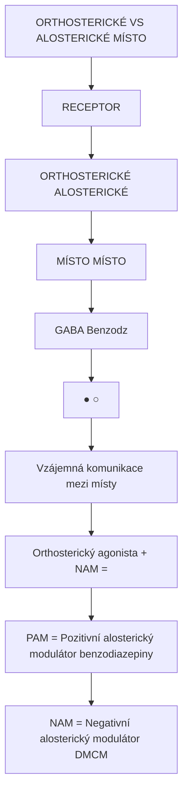

<details>
<summary>ASCII verze diagramu</summary>

```
            ORTHOSTERICKÉ VS ALOSTERICKÉ MÍSTO

        ┌─────────────────────────────────────────┐
        │              RECEPTOR                    │
        │                                          │
        │   ┌──────────────┐   ┌──────────────┐   │
        │   │ ORTHOSTERICKÉ│   │ ALOSTERICKÉ  │   │
        │   │    MÍSTO     │   │    MÍSTO     │   │
        │   │              │   │              │   │
        │   │   (GABA)     │   │  (Benzodz)   │   │
        │   │     ●        │   │      ○       │   │
        │   └──────────────┘   └──────────────┘   │
        │                                          │
        │   Vzájemná komunikace mezi místy         │
        │                                          │
        │   Orthosterický agonista + PAM = ↑↑↑    │
        │   Orthosterický agonista + NAM = ↓↓↓    │
        │                                          │
        └─────────────────────────────────────────┘

PAM = Pozitivní alosterický modulátor (benzodiazepiny)
NAM = Negativní alosterický modulátor (DMCM)
```

</details>

| Typ modulátoru | Účinek | Příklad |
|----------------|--------|---------|
| **PAM (pozitivní)** | Zvyšuje účinek agonisty | Benzodiazepiny na GABA-A |
| **NAM (negativní)** | Snižuje účinek agonisty | DMCM na GABA-A |
| **Silent (neutrální)** | Blokuje PAM/NAM bez vlastního účinku | Flumazenil |

---

## Psychedelické cíle - Detailní přehled

### [5-HT2A receptor](@/receptors/5-ht2a.md) - Brána psychedelického stavu

| Látka | Ki (nM) | Eficacia | Trvání účinku |
|-------|---------|----------|---------------|
| **Serotonin** | 100-300 | Endogenní standard | - |
| [**LSD**](@/alkaloids/lsd.md) | 1-2 | Velmi vysoká | 8-12 hodin |
| [**Psilocin**](@/alkaloids/psilocin.md) | 6-15 | Střední-vysoká | 4-6 hodin |
| [**DMT**](@/alkaloids/dmt.md) | 75-130 | Střední | 15-60 minut |
| [**Meskalin**](@/alkaloids/mescaline.md) | 5000+ | Nízká | 8-12 hodin |
| **25I-NBOMe** | 0.04 | Extrémně vysoká | 6-10 hodin |

### [GABA-A receptor](@/receptors/gaba-a.md) - Cíl GABAergních látek

| Vazebné místo | Ligandy | Mechanismus |
|---------------|---------|-------------|
| **BZ site** | Diazepam, Alprazolam | Zvýšení frekvence otevírání |
| **Barbiturátové** | Fenobarbital | Prodloužení doby otevření |
| **Neurosteroidové** | Alopregnanolone | Potenciace |
| **Etanolové** | Alkohol | Komplexní potenciace |

### [NMDA receptor](@/receptors/nmda.md) - Cíl disociativ

| Látka | Ki (nM) | Mechanismus | Klinické použití |
|-------|---------|-------------|------------------|
| **Ketamin** | 500-1000 | Kanálový blokátor | Anestezie, deprese |
| **PCP** | 50-100 | Kanálový blokátor | (Zneužívaná látka) |
| **Memantine** | 500-1000 | Nízkoafinitní blokátor | Alzheimerova choroba |
| **Dextrometorfan** | 1000+ | Neselektivní | Antitusikum |

### Receptor profily psychoaktivních látek

| Látka | 5-HT2A | 5-HT1A | D2 | GABA-A | NMDA | sigma-1 |
|-------|--------|--------|----|---------|----|--------|
| [LSD](@/alkaloids/lsd.md) | +++ | + | ++ | - | - | + |
| [Psilocybin](@/alkaloids/psilocybin.md) | +++ | ++ | - | - | - | - |
| [DMT](@/alkaloids/dmt.md) | +++ | + | - | - | - | +++ |
| Ketamin | - | - | - | - | --- | ++ |
| [Meskalin](@/alkaloids/mescaline.md) | ++ | + | + | - | - | - |

**Legenda**: +++ silný agonista, ++ střední, + slabý, - žádný účinek, --- antagonista

---

## Funkční selektivita (Biased agonism)

### Koncept

Různé ligandy vážící se na stejný receptor mohou aktivovat odlišné signální dráhy. Tento jev se nazývá **funkční selektivita** nebo **biased agonism**.

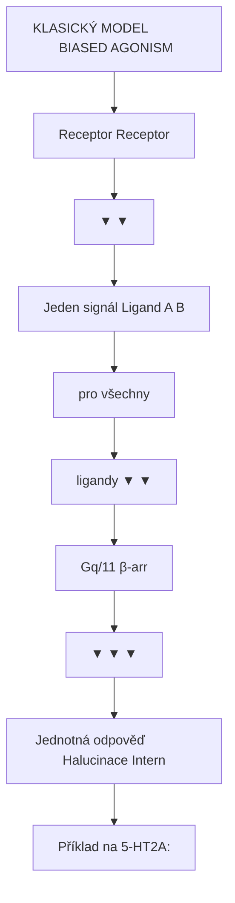

<details>
<summary>ASCII verze diagramu</summary>

```
           KLASICKÝ MODEL              BIASED AGONISM

        Receptor                       Receptor
           │                              │
           ▼                              ▼
    ┌─────────────┐              ┌─────────────────┐
    │ Jeden signál│              │ Ligand A    B   │
    │ pro všechny │              │    │        │   │
    │ ligandy     │              │    ▼        ▼   │
    └─────────────┘              │  Gq/11   β-arr  │
           │                     │    │        │   │
           ▼                     │    ▼        ▼   │
    Jednotná odpověď             │Halucinace Intern│
                                 └─────────────────┘

Příklad na 5-HT2A:
- LSD: Silná Gq aktivace, slabá β-arrestin
- Serotonin: Vyvážená aktivace obou drah
- Lisurid: Slabá Gq, silná β-arrestin (bez halucinací!)
```

</details>

### Klinický význam

| Ligand | Gq/11 | β-arrestin | Klinický profil |
|--------|-------|------------|-----------------|
| Serotonin | +++ | +++ | Fyziologický |
| [LSD](@/alkaloids/lsd.md) | +++ | + | Halucinogenní |
| Lisurid | + | ++ | Antimigrénový (bez halucinací) |
| Ergotamin | ++ | ++ | Antimigrénový |

### Terapeutické implikace

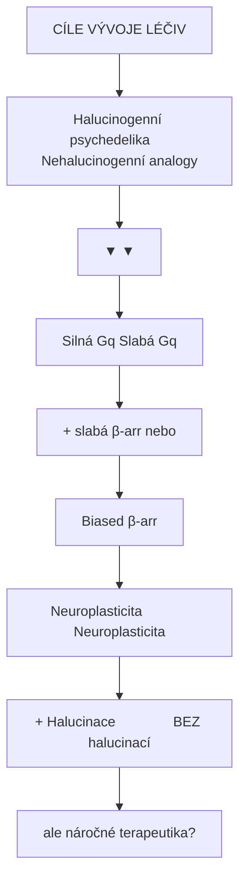

<details>
<summary>ASCII verze diagramu</summary>

```
         CÍLE VÝVOJE LÉČIV

    Halucinogenní psychedelika     Nehalucinogenní analogy
              │                           │
              ▼                           ▼
    ┌─────────────────┐         ┌─────────────────┐
    │  Silná Gq       │         │  Slabá Gq       │
    │  + slabá β-arr  │         │  nebo           │
    │                 │         │  Biased β-arr   │
    └────────┬────────┘         └────────┬────────┘
             │                           │
             ▼                           ▼
    Neuroplasticita            Neuroplasticita
    + Halucinace               BEZ halucinací

    = Terapeutické                = Bezpečnější
      ale náročné                   terapeutika?
```

</details>

---

## Regulace receptorů

### Desenzitizace

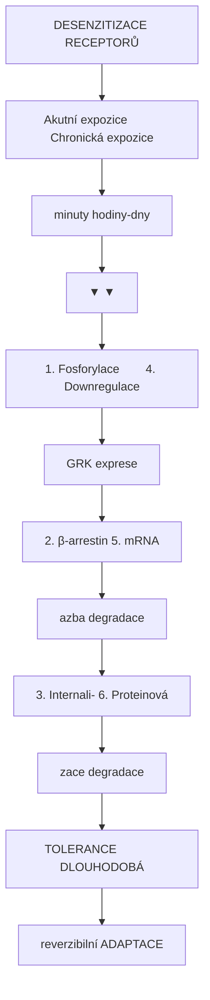

<details>
<summary>ASCII verze diagramu</summary>

```
                DESENZITIZACE RECEPTORŮ

    Akutní expozice          Chronická expozice
    (minuty)                 (hodiny-dny)
         │                        │
         ▼                        ▼
┌─────────────────┐      ┌─────────────────┐
│  1. Fosforylace │      │ 4. Downregulace │
│     (GRK)       │      │    exprese      │
└────────┬────────┘      └────────┬────────┘
         │                        │
         ▼                        ▼
┌─────────────────┐      ┌─────────────────┐
│  2. β-arrestin  │      │ 5. mRNA         │
│     vazba       │      │    degradace    │
└────────┬────────┘      └────────┬────────┘
         │                        │
         ▼                        ▼
┌─────────────────┐      ┌─────────────────┐
│  3. Internali-  │      │ 6. Proteinová   │
│     zace        │      │    degradace    │
└─────────────────┘      └─────────────────┘
         │                        │
         ▼                        ▼
    TOLERANCE             DLOUHODOBÁ
    (reverzibilní)        ADAPTACE
```

</details>

### Mechanismy internalizace

| Fáze | Časový rámec | Mechanismus | Reverzibilita |
|------|--------------|-------------|---------------|
| **Fosforylace** | Sekundy-minuty | GRK (G-protein receptor kinázy) | Rychlá |
| **β-arrestin vazba** | Minuty | Odpojení od G-proteinu | Rychlá |
| **Internalizace** | Minuty-hodiny | Clathrin-dependentní endocytóza | Střední |
| **Recyklace** | Hodiny | Zpět na membránu | Pomalá |
| **Degradace** | Hodiny-dny | Lysozomální proteolýza | Vyžaduje resyntézu |

### Tolerance k psychedelikům

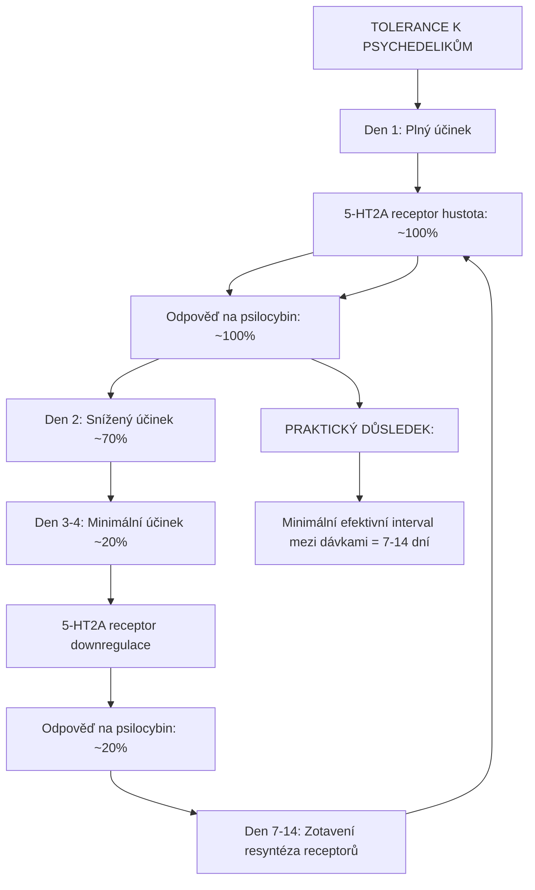

<details>
<summary>ASCII verze diagramu</summary>

```
             TOLERANCE K PSYCHEDELIKŮM

    Den 1: Plný účinek
         │
         ▼
    ┌─────────────────────────────────────┐
    │  5-HT2A receptor hustota: 100%      │
    │  Odpověď na psilocybin: 100%        │
    └─────────────────────────────────────┘
         │
         ▼
    Den 2: Snížený účinek (~70%)
         │
         ▼
    Den 3-4: Minimální účinek (~20%)
         │
         ▼
    ┌─────────────────────────────────────┐
    │  5-HT2A receptor downregulace       │
    │  Odpověď na psilocybin: ~20%        │
    └─────────────────────────────────────┘
         │
         ▼
    Den 7-14: Zotavení (resyntéza receptorů)
         │
         ▼
    ┌─────────────────────────────────────┐
    │  5-HT2A receptor hustota: ~100%     │
    │  Odpověď na psilocybin: ~100%       │
    └─────────────────────────────────────┘

PRAKTICKÝ DŮSLEDEK:
Minimální efektivní interval mezi dávkami = 7-14 dní
```

</details>

### Receptor trafficking

| Receptor | Internalizace | Recyklace | Klinický dopad |
|----------|---------------|-----------|----------------|
| [5-HT2A](@/receptors/5-ht2a.md) | Rychlá (LSD) | Pomalá | Tolerance k psychedelikům |
| [GABA-A](@/receptors/gaba-a.md) | Střední | Střední | Tolerance k BZ |
| Opioidní (mu) | Rychlá | Variabilní | Tolerance k opioidům |
| D2 | Střední | Rychlá | Tardivní dyskineze |

---

## Drug development - Vývoj léčiv

### Receptor jako terapeutický cíl

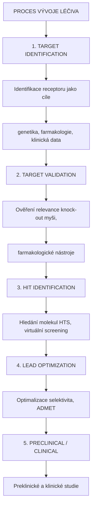

<details>
<summary>ASCII verze diagramu</summary>

```
              PROCES VÝVOJE LÉČIVA

    ┌─────────────────────────────────────────────────┐
    │  1. TARGET IDENTIFICATION                        │
    │     Identifikace receptoru jako cíle            │
    │     (genetika, farmakologie, klinická data)     │
    └────────────────────┬────────────────────────────┘
                         │
                         ▼
    ┌─────────────────────────────────────────────────┐
    │  2. TARGET VALIDATION                            │
    │     Ověření relevance (knock-out myši,          │
    │     farmakologické nástroje)                    │
    └────────────────────┬────────────────────────────┘
                         │
                         ▼
    ┌─────────────────────────────────────────────────┐
    │  3. HIT IDENTIFICATION                          │
    │     Hledání molekul (HTS, virtuální screening)  │
    └────────────────────┬────────────────────────────┘
                         │
                         ▼
    ┌─────────────────────────────────────────────────┐
    │  4. LEAD OPTIMIZATION                           │
    │     Optimalizace (selektivita, ADMET)          │
    └────────────────────┬────────────────────────────┘
                         │
                         ▼
    ┌─────────────────────────────────────────────────┐
    │  5. PRECLINICAL / CLINICAL                      │
    │     Preklinické a klinické studie              │
    └─────────────────────────────────────────────────┘
```

</details>

### Selektivita

| Parametr | Definice | Důležitost |
|----------|----------|------------|
| **Selektivita** | Preference pro jeden receptor nad jinými | Minimalizace off-target účinků |
| **Selectivity ratio** | Ki(off-target) / Ki(target) | Ideálně > 100x |
| **Poly-farmakologie** | Záměrná aktivita na více cílech | Některá léčiva (clozapin) |

### Terapeutický index

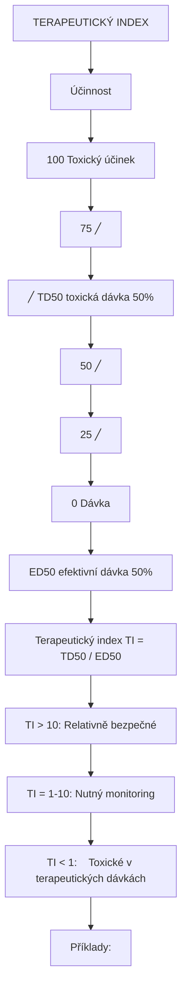

<details>
<summary>ASCII verze diagramu</summary>

```
                TERAPEUTICKÝ INDEX

    Účinnost
    (%)
    100 ┤                    ┌───── Toxický účinek
        │                  ╱
     75 ┤               ╱
        │            ╱         TD50 (toxická dávka 50%)
     50 ┤─────────╱────────────────────────
        │      ╱       ↑
     25 ┤   ╱          │
        │╱             │
      0 ┼──────────────┼──────────────────→ Dávka
              ED50 (efektivní dávka 50%)


    Terapeutický index (TI) = TD50 / ED50

    TI > 10:   Relativně bezpečné
    TI = 1-10: Nutný monitoring
    TI < 1:    Toxické v terapeutických dávkách

    Příklady:
    - Benzodiazepiny: TI > 100 (velmi bezpečné)
    - Barbituráty: TI ~ 3-10 (nebezpečné)
    - Digoxin: TI ~ 2 (úzké terapeutické okno)
```

</details>

---

## Klinická relevance

### Receptor-specifické terapie

| Indikace | Receptor | Léčivo | Mechanismus |
|----------|----------|--------|-------------|
| **Deprese** | [5-HT2A](@/receptors/5-ht2a.md) | Psilocybin | Neuroplasticita |
| **Rezistentní deprese** | [NMDA](@/receptors/nmda.md) | Ketamin | BDNF uvolnění |
| **Úzkost** | [GABA-A](@/receptors/gaba-a.md) | Benzodiazepiny | Inhibice |
| **Schizofrenie** | D2 | Antipsychotika | Antagonismus |
| **Parkinsonova choroba** | D2 | L-DOPA | Agonismus |
| **PTSD** | [5-HT2A](@/receptors/5-ht2a.md) | MDMA + terapie | Emoční zpracování |
| **Závislosti** | [5-HT2A](@/receptors/5-ht2a.md) | Psilocybin | Narušení návyků |

### Nežádoucí účinky z receptorové perspektivy

| Receptor | Agonismus/Blokáda | Nežádoucí účinek |
|----------|-------------------|------------------|
| **5-HT2A agonismus** | Halucinace, úzkost | Psychedelika |
| **5-HT2B agonismus** | Kardiální fibróza | Fenfluramin, ergotaminy |
| **D2 blokáda** | EPS, prolaktin | Antipsychotika |
| **H1 blokáda** | Sedace, přírůstek váhy | Antihistaminika |
| **mAChR blokáda** | Suchost úst, retence | Anticholinergika |
| **alpha-1 blokáda** | Ortostatická hypotenze | Antipsychotika |

### Farmakogenetika

| Receptor/Enzym | Polymorfismus | Klinický dopad |
|----------------|---------------|----------------|
| **5-HT2A (HTR2A)** | His452Tyr | Odpověď na antipsychotika |
| **CYP2D6** | Pomalí/rychlí metabolizéři | Dávkování opioidů, SSRI |
| **COMT** | Val158Met | Odpověď na stimulanty |
| **OPRM1** | A118G | Odpověď na opioidy |

---

## Výzkumné metody

### In vitro metody

| Metoda | Měří | Využití |
|--------|------|---------|
| **Radioligand binding** | Afinita (Ki, Kd) | Screening ligandů |
| **Funkční eseje (Ca²⁺, cAMP)** | Eficacia | Charakterizace agonistů |
| **BRET/FRET** | Protein-protein interakce | G-protein aktivace |
| **Patch-clamp** | Iontové proudy | Ionotropní receptory |

### In vivo metody

| Metoda | Měří | Využití |
|--------|------|---------|
| **PET imaging** | Receptorová obsazenost | Dávkování léčiv |
| **fMRI** | Mozková aktivita | Funkční studie |
| **Behavioral assays** | Farmakologické účinky | Preklinické testování |

### Radioligandy pro PET

| Receptor | Radioligand | Vlastnosti |
|----------|-------------|------------|
| [5-HT2A](@/receptors/5-ht2a.md) | [11C]MDL 100907 | Vysoká selektivita |
| D2 | [11C]Raclopride | Standard |
| [GABA-A](@/receptors/gaba-a.md) | [11C]Flumazenil | BZ site |
| Opioidní | [11C]Carfentanil | mu-selektivní |

---

## Reference

1. Kobilka, B.K. (2013). *The structural basis of G-protein-coupled receptor signaling*. Angewandte Chemie.
2. Nichols, D.E. (2016). *Psychedelics*. Pharmacological Reviews.
3. Olsen, R.W. & Sieghart, W. (2008). *International Union of Pharmacology. LXX. Subtypes of GABAA receptors*. Pharmacological Reviews.
4. Traynelis, S.F. et al. (2010). *Glutamate receptor ion channels: structure, regulation, and function*. Pharmacological Reviews.
5. Wacker, D. et al. (2017). *Crystal structure of an LSD-bound human serotonin receptor*. Cell.
6. Carhart-Harris, R.L. & Friston, K.J. (2019). *REBUS and the anarchic brain*. Pharmacological Reviews.
7. Katritch, V., Cherezov, V. & Stevens, R.C. (2013). *Structure-function of the G protein-coupled receptor superfamily*. Annual Review of Pharmacology and Toxicology.

---

## Viz take

### Specifické receptory
- [5-HT2A receptor](@/receptors/5-ht2a.md) - Primární cíl klasických psychedelik
- [GABA-A receptor](@/receptors/gaba-a.md) - Hlavní inhibiční receptor, cíl muscimolu
- [NMDA receptor](@/receptors/nmda.md) - Klíčový pro plasticitu, cíl disociativ
- [Receptory - přehled](@/receptors/_index.md) - Kompletní katalog receptorů

### Neurotransmitery
- [GABA](@/glossary/gaba.md) - Hlavní inhibiční neurotransmiter
- [Nukleotid](@/glossary/nukleotid.md) - Stavební jednotky signálních molekul
- [Fosfát](@/glossary/fosfat.md) - Klíčový pro signální transdukci

### Psychoaktivní látky
- [LSD](@/alkaloids/lsd.md) - 5-HT2A agonista s vysokou afinitou
- [Psilocybin](@/alkaloids/psilocybin.md) / [Psilocin](@/alkaloids/psilocin.md) - Houbová psychedelika
- [DMT](@/alkaloids/dmt.md) - Endogenní psychedelikum
- [Meskalin](@/alkaloids/mescaline.md) - Fenyletylaminové psychedelikum

### Zdroje
- [Psilocybe houby](@/shrooms/psilocybes/_index.md) - Zdroj psilocybinu
- [Amanita muscaria](@/shrooms/amanita-muscaria.md) - Zdroj muscimolu

---

<- Zpět na [Glosář](@/glossary/_index.md)
