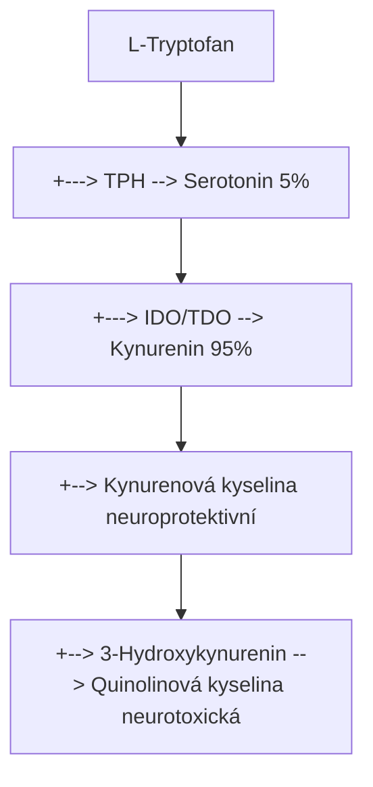
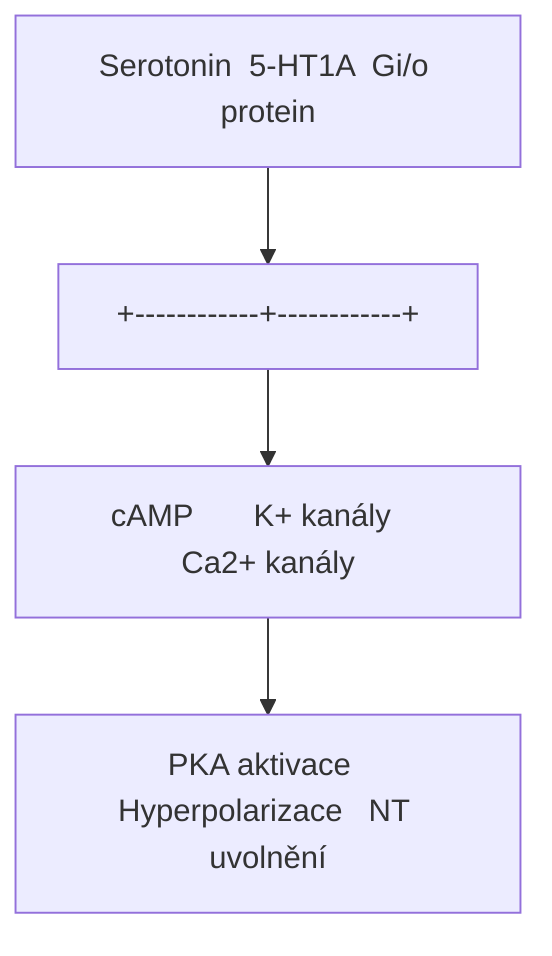
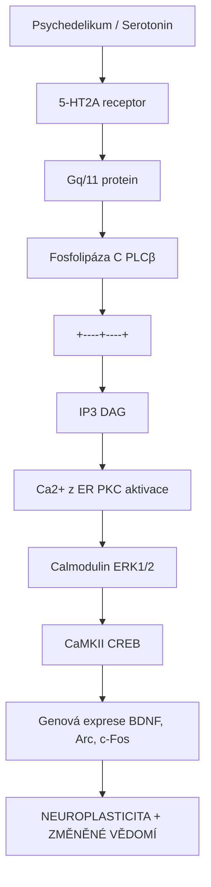
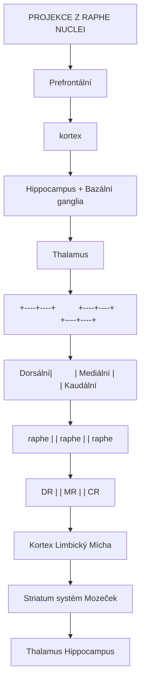
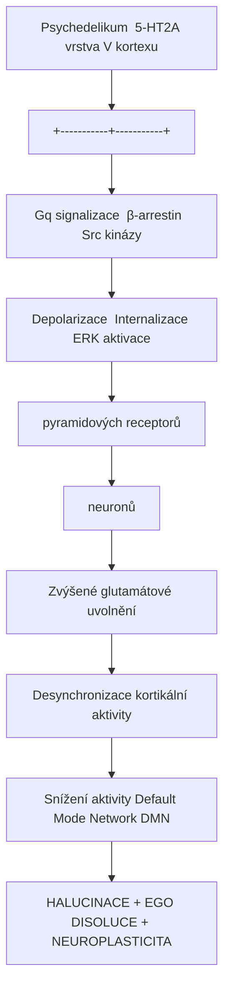
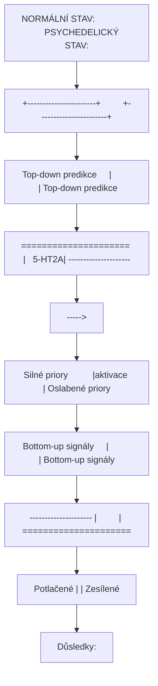
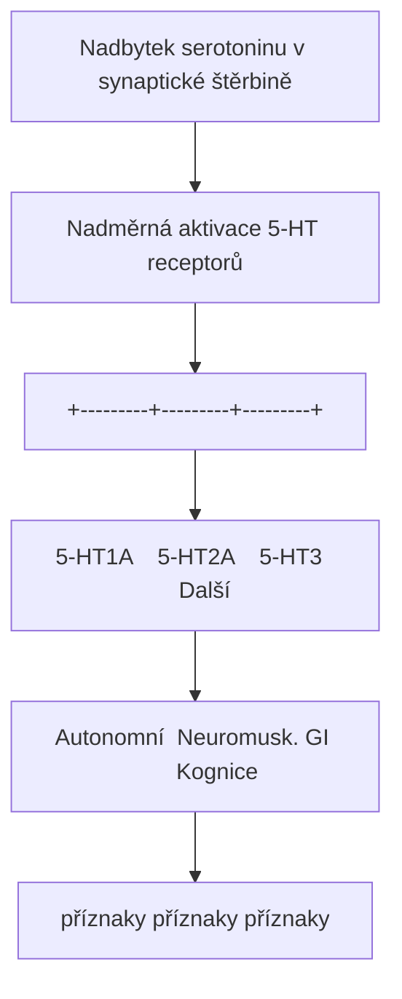
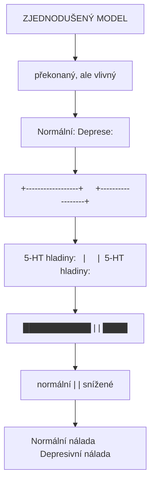

+++
title = "Serotonin"
description = "5-hydroxytryptamin (5-HT) - klicovy neurotransmiter regulujici naladu, kognici a percepci"
weight = 3

[taxonomies]
tags = ["neurotransmiter", "serotonin", "5-HT", "tryptamin", "nalada", "psychedelika"]
categories = ["neuroveda", "farmakologie", "biochemie"]
+++

# Serotonin - 5-hydroxytryptamin (5-HT)

**Serotonin** (5-hydroxytryptamin, 5-HT) je monoaminovy neurotransmiter, ktery hraje klicovou roli v regulaci **nalady**, **kognice**, **percepce**, **spanku**, **chuti k jidlu** a mnoha dalsich fyziologickych funkci. Je take primarnim cilem klasickych psychedelik, ktera pusobi jako agoniste na [5-HT2A receptorech](@/receptors/5-ht2a.md).

Vice nez 90% serotoninu v lidskem tele se nachazi v gastrointestinalnim traktu, kde reguluje motilitu strev. V centralni nervove soustave je serotonin syntetizovan v **raphe nuclei** mozkoveho kmene a jeho projekce zasahuji prakticky do vsech oblasti mozku.

---

## Zakladni informace

| Vlastnost | Hodnota |
|-----------|---------|
| **Chemicky nazev** | 5-hydroxytryptamin |
| **Systematicky nazev** | 3-(2-aminoethyl)-1H-indol-5-ol |
| **Zkratka** | 5-HT |
| **Molekularni vzorec** | C10H12N2O |
| **Molekularni hmotnost** | 176,22 g/mol |
| **CAS cislo** | 50-67-9 |
| **PubChem CID** | 5202 |
| **IUPAC** | 3-(2-aminoethyl)-1H-indol-5-ol |
| **SMILES** | NCCc1c[nH]c2ccc(O)cc12 |
| **pKa** | 9,97 (amino), 10,73 (hydroxyl) |
| **Log P** | 0,21 (hydrofilni) |

---

## Chemicka struktura

### Strukturni klasifikace

Serotonin patri do rodiny **indolových aminů** a je strukturne odvozen od aminokyseliny tryptofanu:

| Kategorie | Zarazeni |
|-----------|----------|
| **Trida** | Monoaminy |
| **Podtrida** | Indolaminy |
| **Strukturni motiv** | 5-hydroxyindol s ethylaminovym retezcem |
| **Biosynteza** | Z L-tryptofanu |

### Strukturni porovnani s psychedeliky

```
Serotonin (5-HT):     HO-[Indol]-CH2-CH2-NH2
                           ^5

DMT:                     [Indol]-CH2-CH2-N(CH3)2

Psilocin (4-HO-DMT):  HO-[Indol]-CH2-CH2-N(CH3)2
                           ^4

5-MeO-DMT:           CH3O-[Indol]-CH2-CH2-N(CH3)2
                           ^5

Bufotenin (5-HO-DMT): HO-[Indol]-CH2-CH2-N(CH3)2
                           ^5
```

**Klic**: Psychedelika jako [psilocin](@/alkaloids/psilocin.md), [DMT](@/alkaloids/dmt.md) a [LSD](@/alkaloids/lsd.md) jsou strukturalni analogy serotoninu a vazou se na jeho receptory.

### Molekularni struktura (ASCII)

```
           OH
            |
         [5]C
        /     \
    [6]C       C[4]
       |       |
    [7]C       C[3a]----CH2----CH2----NH2
        \     / \      |
         C[7a]   N[1]--H
                 |
               indolove
                jadro
```

---

## Biosynteza serotoninu

### Kompletni biosynteticka draha

Serotonin je syntetizovan z esencialni aminokyseliny **L-tryptofanu** ve dvou enzymatickych krocich:

```
L-Tryptofan (esencialni aminokyselina z potravy)
    |
    | [TPH - tryptofan hydroxylaza]
    | Kofaktory: O2, tetrahydrobiopterin (BH4), Fe2+
    | Limitujici krok biosyntézy
    v
5-Hydroxytryptofan (5-HTP)
    |
    | [AADC - aromaticka L-aminokyselina dekarboxylaza]
    | Kofaktor: pyridoxal-5'-fosfat (vitamin B6)
    | Rychly, nenasyceny krok
    v
Serotonin (5-HT)
```

### Klicove enzymy

| Enzym | Gen | Lokalizace | Funkce | Regulace |
|-------|-----|------------|--------|----------|
| **TPH1** | TPH1 | Periferie (GIT, trombocyty) | 5-HTP synteza | Ca2+, cAMP |
| **TPH2** | TPH2 | CNS (raphe nuclei) | 5-HTP synteza | Stress, cirkadianní |
| **AADC** | DDC | Ubikviterni | Dekarboxylace | Konstitutivni |

### Regulace biosyntézy

| Faktor | Vliv na serotonin |
|--------|-------------------|
| **Dostupnost tryptofanu** | Přímá korelace (limitující prekurzor) |
| **BH4 hladiny** | Nutný kofaktor TPH |
| **Vitamin B6** | Nutný pro AADC aktivitu |
| **Stress** | Zvyšuje TPH2 aktivitu krátkodobě |
| **Cirkadianni rytmus** | Peak syntézy přes den |
| **Záněty** | IDO aktivace → deplece tryptofanu |

### Kynureninova draha - kompetice

Tryptofan může být metabolizován alternativní cestou:



<details>
<summary>ASCII verze diagramu</summary>

```
L-Tryptofan
    |
    +---> [TPH] --> Serotonin (5%)
    |
    +---> [IDO/TDO] --> Kynurenin (95%)
                           |
                           +--> Kynurenová kyselina (neuroprotektivní)
                           |
                           +--> 3-Hydroxykynurenin --> Quinolinová kyselina (neurotoxická)
```

</details>

**Klinický význam**: Při zánětech se zvyšuje IDO aktivita, což snižuje dostupnost tryptofanu pro syntézu serotoninu a může přispívat k depresivním stavům.

---

## Serotoninove receptory

Serotonin působí prostřednictvím **sedmi rodin receptorů** (5-HT1 až 5-HT7), které zahrnují celkem **14 subtypů**. Všechny kromě 5-HT3 jsou metabotropní (GPCR).

### Prehled receptorovych rodin

| Rodina | Subtypy | G-protein | Hlavni funkce |
|--------|---------|-----------|---------------|
| **5-HT1** | 1A, 1B, 1D, 1E, 1F | Gi/o | Anxiolýza, autoreceptor, migréna |
| **5-HT2** | 2A, 2B, 2C | Gq/11 | **Halucinace**, kardiovaskulární, apetit |
| **5-HT3** | 3A, 3B | Iontový kanál | Nauzea, rychlá neurotransmise |
| **5-HT4** | 4 | Gs | GI motilita, kognice |
| **5-HT5** | 5A, 5B | Gi/o | Neznámá (výzkum) |
| **5-HT6** | 6 | Gs | Kognice, paměť |
| **5-HT7** | 7 | Gs | Cirkadiánní rytmy, termoregulace |

### 5-HT1 receptory

#### 5-HT1A receptor

| Vlastnost | Hodnota |
|-----------|---------|
| **G-protein** | Gi/o |
| **Lokalizace** | Raphe nuclei (autoreceptor), hippocampus, kortex |
| **Funkce** | Anxiolýza, antidepresivní efekt |
| **Agonisté** | Buspiron, tandospiron |
| **Význam pro psychedelika** | Modulace anxiogenních účinků |

#### Mechanismus 5-HT1A



<details>
<summary>ASCII verze diagramu</summary>

```
Serotonin → 5-HT1A → Gi/o protein
                        |
           +------------+------------+
           |            |            |
           v            v            v
      ↓ cAMP      ↑ K+ kanály   ↓ Ca2+ kanály
           |            |            |
           v            v            v
     ↓ PKA aktivace  Hyperpolarizace  ↓ NT uvolnění
```

</details>

#### 5-HT1B/1D receptory

| Vlastnost | 5-HT1B | 5-HT1D |
|-----------|--------|--------|
| **Lokalizace** | Presynaptické terminály | Trigeminální ganglion |
| **Funkce** | Autoreceptor, vazokonstrikce | Migréna |
| **Ligandy** | Sumatriptan, zolmitriptan | Triptany |

### 5-HT2 receptory - primární cíle psychedelik

#### [5-HT2A receptor](@/receptors/5-ht2a.md)

| Vlastnost | Hodnota |
|-----------|---------|
| **G-protein** | Gq/11 |
| **Lokalizace** | Prefrontální kortex, vizuální kortex, claustrum |
| **Funkce** | **Halucinace**, neuroplasticita, percepce |
| **Psychedelika** | [LSD](@/alkaloids/lsd.md), [psilocin](@/alkaloids/psilocin.md), [DMT](@/alkaloids/dmt.md), [meskalin](@/alkaloids/mescaline.md) |

**KLICOVE**: 5-HT2A receptor je **primárním molekulárním cílem** klasických psychedelik. Aktivace tohoto receptoru v pyramidových neuronech vrstvy V kortexu je zodpovědná za halucinogenní účinky.

#### Signální kaskáda 5-HT2A



<details>
<summary>ASCII verze diagramu</summary>

```
Psychedelikum / Serotonin
         |
         v
    5-HT2A receptor
         |
    Gq/11 protein
         |
    Fosfolipáza C (PLCβ)
         |
    +----+----+
    |         |
    v         v
   IP3       DAG
    |         |
    v         v
Ca2+ z ER   PKC aktivace
    |         |
    v         v
Calmodulin   ERK1/2
    |         |
    v         v
  CaMKII    CREB
    |         |
    +----+----+
         |
         v
   Genová exprese (BDNF, Arc, c-Fos)
         |
         v
   NEUROPLASTICITA + ZMĚNĚNÉ VĚDOMÍ
```

</details>

#### 5-HT2B receptor

| Vlastnost | Hodnota |
|-----------|---------|
| **G-protein** | Gq/11 |
| **Lokalizace** | Srdce (chlopně), GI trakt |
| **Funkce** | Kardiovaskulární regulace |
| **Riziko** | Chronická aktivace → valvulopatie |
| **Příklad** | Fenfluramin (stažen z trhu) |

**Varovani**: Chronická aktivace 5-HT2B může vést k fibróze srdečních chlopní. To je důvod, proč některé serotonergní léky (fenfluramin, ergotové deriváty) byly staženy.

#### 5-HT2C receptor

| Vlastnost | Hodnota |
|-----------|---------|
| **G-protein** | Gq/11 |
| **Lokalizace** | Hypothalamus, limbický systém |
| **Funkce** | Regulace apetitu, nálady, úzkosti |
| **Agonisté** | Lorcaserin (anti-obezitikum) |
| **Antagonisté** | Většina atypických antipsychotik |

### 5-HT3 receptor - jediný ionotropní

| Vlastnost | Hodnota |
|-----------|---------|
| **Typ** | Ligandem řízený iontový kanál (Cys-loop rodina) |
| **Ion** | Na+, K+ (neselektivní kation) |
| **Lokalizace** | Area postrema, GI trakt, vagus |
| **Funkce** | Nauzea, emeze, rychlá neurotransmise |
| **Antagonisté** | Ondansetron, granisetron (antiemetika) |

### 5-HT4, 5-HT6, 5-HT7 receptory

| Receptor | G-protein | Hlavni funkce | Klinický význam |
|----------|-----------|---------------|-----------------|
| **5-HT4** | Gs | GI motilita, kognice | Prokinetika (prucaloprid) |
| **5-HT6** | Gs | Učení, paměť | Prokognitivní cíl |
| **5-HT7** | Gs | Cirkadiánní rytmy, termoregulace | Spánkové poruchy |

---

## Serotonergni drahy v mozku

### Raphe nuclei - zdrojová jádra

Serotonergní neurony jsou koncentrovány v **raphe nuclei** (švu jádrech) mozkového kmene:



<details>
<summary>ASCII verze diagramu</summary>

```
                    PROJEKCE Z RAPHE NUCLEI

                         Prefrontální
                           kortex
                              ↑
                              |
            Hippocampus ←─────+─────→ Bazální ganglia
                              |
                              |
                         Thalamus
                              ↑
                              |
         ┌────────────────────+────────────────────┐
         |                    |                    |
    +----+----+          +----+----+          +----+----+
    |  Dorsální|          | Mediální |          | Kaudální|
    |  raphe   |          | raphe    |          | raphe   |
    |  (DR)    |          | (MR)     |          | (CR)    |
    +----+----+          +----+----+          +----+----+
         |                    |                    |
         v                    v                    v
    Kortex              Limbický           Mícha
    Striatum            systém             Mozeček
    Thalamus            Hippocampus
```

</details>

### Hlavní projekční systémy

| Jádro | Projekce | Funkce |
|-------|----------|--------|
| **Dorsální raphe (DR)** | Kortex, striatum, thalamus | Kognice, motorika, nálada |
| **Mediální raphe (MR)** | Hippocampus, septum | Paměť, úzkost |
| **Nucleus raphe magnus** | Mícha (zadní rohy) | Modulace bolesti |
| **Nucleus raphe obscurus** | Mozeček | Motorická koordinace |

### Interakce s jinými neurotransmiterovými systémy

| Systém | Interakce | Klinický význam |
|--------|-----------|-----------------|
| **Dopaminergní** | 5-HT inhibuje DA uvolnění v NAc | Odměna, závislosti |
| **Noradrenergní** | Vzájemná regulace | Bdělost, stres |
| **GABAergní** | 5-HT moduluje inhibici | Úzkost |
| **Glutamátový** | 5-HT2A na pyramidových neuronech | Kognice, halucinace |
| **Cholinergní** | Raphe → bazální telencefalon | Paměť |

---

## Spojeni s psychedeliky

### Psychedelika jako 5-HT2A agonisté

Klasická psychedelika jsou strukturální analogy serotoninu a působí primárně jako agonisté [5-HT2A receptoru](@/receptors/5-ht2a.md):

| Látka | Ki na 5-HT2A (nM) | Relativní potence | Trvání |
|-------|-------------------|-------------------|--------|
| **Serotonin** | 100-300 | Reference | - |
| [**LSD**](@/alkaloids/lsd.md) | 1-2 | Velmi vysoká | 8-12 h |
| [**Psilocin**](@/alkaloids/psilocin.md) | 6-15 | Vysoká | 4-6 h |
| [**DMT**](@/alkaloids/dmt.md) | 75-130 | Střední | 15-60 min |
| [**Meskalin**](@/alkaloids/mescaline.md) | 5000+ | Nízká | 8-12 h |
| **25I-NBOMe** | 0.04 | Extrémně vysoká | 6-10 h |

### Mechanismus halucinogeneze



<details>
<summary>ASCII verze diagramu</summary>

```
Psychedelikum → 5-HT2A (vrstva V kortexu)
                    |
        +-----------+-----------+
        |           |           |
        v           v           v
   Gq signalizace  β-arrestin  Src kinázy
        |           |           |
        v           v           v
   Depolarizace  Internalizace ERK aktivace
   pyramidových     receptorů
   neuronů
        |
        v
   Zvýšené glutamátové uvolnění
        |
        v
   Desynchronizace kortikální aktivity
        |
        v
   Snížení aktivity Default Mode Network (DMN)
        |
        v
   HALUCINACE + EGO DISOLUCE + NEUROPLASTICITA
```

</details>

### REBUS model (Relaxed Beliefs Under Psychedelics)



<details>
<summary>ASCII verze diagramu</summary>

```
NORMÁLNÍ STAV:                    PSYCHEDELICKÝ STAV:
+-----------------------+         +-----------------------+
| Top-down predikce     |         | Top-down predikce     |
| ===================== |   5-HT2A| --------------------- |
| |||||||||||||||||     |  -----> |                       |
| Silné priory          |aktivace | Oslabené priory       |
+-----------------------+         +-----------------------+
          |                                 |
          v                                 v
+-----------------------+         +-----------------------+
| Bottom-up signály     |         | Bottom-up signály     |
| --------------------- |         | ===================== |
|                       |         | ||||||||||||||||||||| |
| Potlačené             |         | Zesílené              |
+-----------------------+         +-----------------------+

Důsledky:
- Perceptuální distorze (zvýšený bottom-up)
- Nové asociace (snížený top-down filtering)
- Mystické zážitky (ego dissolution)
- Terapeutický insight (kognitivní flexibilita)
```

</details>

### Tolerance a cross-tolerance

Opakovaná aktivace 5-HT2A vede k rychlé downregulaci receptorů:

| Den po expozici | Relativní účinek |
|-----------------|------------------|
| 1 | 100% |
| 2 | ~30-50% |
| 3 | ~20% |
| 7-14 | ~100% (reset) |

**Cross-tolerance**: LSD, psilocybin, DMT a meskalin sdílejí toleranci prostřednictvím 5-HT2A downregulace.

---

## Serotonin syndrom

### Definice

**Serotonin syndrom** je potenciálně život ohrožující stav způsobený nadměrnou serotonergní aktivitou v CNS. Vzniká typicky při kombinaci více serotonergních látek.

### Patofyziologie



<details>
<summary>ASCII verze diagramu</summary>

```
Nadbytek serotoninu v synaptické štěrbině
              |
              v
Nadměrná aktivace 5-HT receptorů
              |
    +---------+---------+---------+
    |         |         |         |
    v         v         v         v
 5-HT1A    5-HT2A    5-HT3     Další
    |         |         |         |
    v         v         v         v
Autonomní  Neuromusk. GI        Kognice
příznaky   příznaky  příznaky
```

</details>

### Klinické příznaky

#### Hunterova kritéria (diagnostická)

| Kategorie | Příznaky | Mechanismus |
|-----------|----------|-------------|
| **Autonomní** | Tachykardie, hypertenze, hyperthermie, pocení, mydriáza | 5-HT2A, 5-HT1A |
| **Neuromuskulární** | Tremor, hyperreflexie, klonus, rigidita, myoklonus | 5-HT2A |
| **Kognitivní** | Agitace, zmatenost, halucinace | 5-HT2A |
| **GI** | Průjem, nauzea, zvracení | 5-HT3 |

#### Závažnost

| Stupeň | Příznaky | Management |
|--------|----------|------------|
| **Mírný** | Tachykardie, pocení, tremor | Observace, vysazení léků |
| **Střední** | Hypertenze, hyperthermie (≤40°C), agitace | Benzodiazepiny, chlazení |
| **Těžký** | Hyperthermie (>41°C), rigidita, šok | JIP, cyproheptadin, intubace |

### Příčiny

| Mechanismus | Příklady |
|-------------|----------|
| **Zvýšená syntéza** | L-tryptofan, 5-HTP |
| **Zvýšené uvolnění** | MDMA, amfetaminy, tramadol |
| **Inhibice zpětného vychytávání** | SSRI, SNRI, TCA, tramadol |
| **Inhibice metabolismu (MAO)** | MAOI, linezolid, harmala alkaloidy |
| **Přímá aktivace receptorů** | Triptany, fentanyl, lithium |

### Nebezpečné kombinace

| Kombinace | Riziko | Poznámka |
|-----------|--------|----------|
| **SSRI + MAOI** | Velmi vysoké | Absolutní kontraindikace |
| **SSRI + Tramadol** | Vysoké | Častá příčina |
| **SSRI + Triptany** | Střední | Monitorovat |
| **MAOI + Ayahuasca** | Vysoké | Wash-out nutný |
| **Lithium + SSRI** | Střední-vysoké | Zvýšená opatrnost |

### Léčba

| Intervence | Indikace | Mechanismus |
|------------|----------|-------------|
| **Vysazení serotonergních látek** | Vždy | Eliminace příčiny |
| **Benzodiazepiny** | Agitace, myoklonus | GABA agonismus |
| **Cyproheptadin** | Střední-těžký SS | 5-HT2A antagonista |
| **Chlazení** | Hyperthermie | Fyzikální |
| **Intubace, paralytika** | Těžký SS | Kontrola termogeneze |

**Poznámka**: Psychedelika jako samostatné látky typicky **nezpůsobují** serotonin syndrom, protože jsou receptorovými agonisty, nikoliv inhibitory reuptake nebo MAOI. Riziko nastává při kombinaci s MAOI (ayahuasca) nebo SSRI.

---

## SSRI a antidepresiva

### Mechanismus SSRI

**Selektivní inhibitory zpětného vychytávání serotoninu** (SSRI) blokují SERT (serotonin transporter), čímž zvyšují koncentraci serotoninu v synaptické štěrbině:

```
Normální synapse:          SSRI synapse:

Presynaptický              Presynaptický
terminál                   terminál
    |                          |
    v                          v
[5-HT]----→[SERT]         [5-HT]----X[SERT zablokován]
    |         |                |
    v         v                v
Postsynaptický           Postsynaptický
receptor              receptor (vyšší obsazenost)
    |                          |
    v                          v
Normální efekt           Zesílený efekt
```

### Přehled SSRI

| Léčivo | Selektivita | Další účinky | T1/2 (h) |
|--------|-------------|--------------|----------|
| **Fluoxetin** | SERT >> NET | 5-HT2C antagonista | 48-72 |
| **Sertralin** | SERT >> DAT | Sigma-1 agonista | 26 |
| **Paroxetin** | SERT >> NET | Anticholinergní | 21 |
| **Citalopram** | Nejvíce selektivní | Minimální | 35 |
| **Escitalopram** | S-enantiomer citalopramu | Minimální | 30 |
| **Fluvoxamin** | SERT | Sigma-1 agonista | 16 |

### Terapeutická latence

SSRI vykazují terapeutickou latenci 2-6 týdnů, přestože blokáda SERT nastává okamžitě:

```
Čas:        0        2 týdny     4-6 týdnů
            |           |            |
            v           v            v

SERT        ████████████████████████████████
blokáda     [okamžitá, konstantní]

5-HT1A      ████████████░░░░░░░░░░░░░░░░░░░
desenzit.   [postupná downregulace autoreceptorů]

5-HT        ░░░░░░░░████████████████████████
hladiny     [postupný nárůst v synapsích]

Klinický    ░░░░░░░░░░░░░░░░████████████████
efekt       [odpovídá 5-HT1A desenzitizaci]
```

**Vysvětlení**: 5-HT1A autoreceptory na somatodendritické oblasti raphe neuronů detekují zvýšený serotonin a inhibují jeho další uvolnění. Až po jejich downregulaci dojde k plnému terapeutickmu účinku.

### Další serotonergní antidepresiva

| Třída | Příklady | Mechanismus |
|-------|----------|-------------|
| **SNRI** | Venlafaxin, duloxetin | SERT + NET inhibice |
| **TCA** | Amitriptylin, imipramin | Neselektivní reuptake inhibice |
| **MAOI** | Fenelzin, moklobemid | Inhibice MAO-A/B |
| **SARI** | Trazodon | 5-HT2A antagonista + SERT inhibitor |
| **NaSSA** | Mirtazapin | α2 antagonista + 5-HT2/3 antagonista |
| **Atypické** | Vortioxetin | Multimodální (SERT + receptory) |

### Interakce SSRI s psychedeliky

| Interakce | Mechanismus | Klinický důsledek |
|-----------|-------------|-------------------|
| **Snížený účinek psychedelik** | Downregulace 5-HT2A | Nutná vyšší dávka nebo neúčinnost |
| **Prodloužený wash-out** | Fluoxetin: 5+ týdnů | Plánovat dopředu |
| **Serotonin syndrom** | S ayahuascou (MAOI) | Vážné riziko |

---

## Metabolismus serotoninu

### Hlavní degradační dráha

```
Serotonin (5-HT)
    |
    | [MAO-A - monoaminoxidáza A]
    | Lokalizace: mitochondriální membrána
    | Kofaktor: FAD
    v
5-Hydroxyindolacetaldehyd (5-HIAL)
    |
    | [ALDH - aldehyddehydrogenáza]
    v
5-Hydroxyindoloctová kyselina (5-HIAA)
    |
    | [Renální exkrece]
    v
Moč
```

### Alternativní metabolické dráhy

| Dráha | Produkt | Význam |
|-------|---------|--------|
| **N-acetylace** | N-acetylserotonin | Prekurzor melatoninu |
| **O-sulfatace** | Serotonin sulfát | Inaktivace v GIT |
| **O-glukuronidace** | Serotonin glukuronid | Konjugace |

### Syntéza melatoninu (v epifýze)

```
Serotonin
    |
    | [AANAT - aralkylamin N-acetyltransferáza]
    | Cirkadianní regulace (noční aktivita)
    v
N-Acetylserotonin
    |
    | [HIOMT - hydroxyindol-O-methyltransferáza]
    v
Melatonin
    |
    v
Regulace spánku a cirkadiánních rytmů
```

### MAO-A vs MAO-B

| Vlastnost | MAO-A | MAO-B |
|-----------|-------|-------|
| **Preferované substráty** | Serotonin, noradrenalin | Dopamin, fenylethylamin |
| **Lokalizace** | GIT, mozek, placenta | Mozek (glia), trombocyty |
| **Inhibitory** | Moklobemid, harmala alkaloidy | Selegilin, rasagilin |
| **Klinické využití** | Antidepresiva | Parkinsonova choroba |

---

## Periferni serotonin

### Serotonin v gastrointestinálním traktu

Více než **90% tělesného serotoninu** se nachází v GIT:

| Lokalizace | Funkce | Receptor |
|------------|--------|----------|
| **Enterochromafinní buňky** | Zásobárna, uvolnění | - |
| **Myenterický plexus** | Motilita střev | 5-HT4 |
| **Senzorické neurony** | Vnímání bolesti, nauzea | 5-HT3 |
| **Hladké svalstvo** | Kontrakce/relaxace | 5-HT2B, 5-HT4 |

### Serotonin v trombocytech

| Aspekt | Detail |
|--------|--------|
| **Zdroj** | Vychytávání z plazmy (SERT na trombocytech) |
| **Funkce** | Hemostáza, vazokonstrikce |
| **Uvolnění** | Při aktivaci trombocytů |
| **Klinický marker** | Snížený u deprese |

### Serotonin v kardiovaskulárním systému

| Účinek | Receptor | Mechanismus |
|--------|----------|-------------|
| **Vazokonstrikce** | 5-HT2A | Hladké svalstvo cév |
| **Vazodilatace** | 5-HT1 (endotel) | NO uvolnění |
| **Valvulopatie** | 5-HT2B | Fibróza chlopní (chronická aktivace) |
| **Agregace trombocytů** | 5-HT2A | Posiluje agregaci |

---

## Serotonin a psychiatrické poruchy

### Serotonergní hypotéza deprese

Klasická "chemická nerovnováha" teorie:



<details>
<summary>ASCII verze diagramu</summary>

```
                    ZJEDNODUŠENÝ MODEL
                    (překonaný, ale vlivný)

Normální:                 Deprese:
+------------------+     +------------------+
|  5-HT hladiny:   |     |  5-HT hladiny:   |
|  ███████████     |     |  ████            |
|  normální        |     |  snížené         |
+------------------+     +------------------+
        |                        |
        v                        v
   Normální nálada          Depresivní nálada
```

</details>

**Moderní pohled**: Deprese je komplexní stav zahrnující:
- Změny v neuroplasticitě (BDNF)
- Neuroinflamaci
- HPA osy dysregulaci
- Genetické faktory
- Psychosociální stresory

Serotonin je jen jednou částí složité mozaiky.

### Genetika serotonergního systému

| Gen | Polymorfismus | Asociace |
|-----|---------------|----------|
| **SLC6A4** (SERT) | 5-HTTLPR (S/L) | Vulnerabilita k depresi (kontroverzní) |
| **TPH2** | rs4570625 | Riziko deprese, sebevraždy |
| **HTR2A** | rs6313 (T102C) | Odpověď na antipsychotika |
| **HTR1A** | rs6295 | Odpověď na antidepresiva |
| **MAO-A** | VNTR | Agresivita ("warrior gene") |

### Serotonin a další poruchy

| Porucha | Serotonergní souvislost |
|---------|------------------------|
| **Úzkostné poruchy** | 5-HT1A, 5-HT2A dysregulace |
| **OCD** | Odpověď na SSRI, 5-HT systém |
| **PTSD** | Snížená 5-HT hladina, 5-HT1A |
| **Bulimie/anorexie** | 5-HT2C, 5-HT1A |
| **Migréna** | 5-HT1B/1D (triptany) |
| **IBS** | Periferní 5-HT, 5-HT3, 5-HT4 |

---

## Analyticke metody

### Měření serotoninu

| Metoda | Materiál | Citlivost | Využití |
|--------|----------|-----------|---------|
| **HPLC-EC** | Plazma, mozek, CSF | pg/mL | Zlatý standard |
| **HPLC-MS/MS** | Plazma, moč | pg/mL | Konfirmace |
| **Mikrodialýza** | In vivo mozek | fmol | Výzkum |
| **ELISA** | Trombocyty | ng/mL | Screening |
| **PET imaging** | In vivo | - | SERT obsazenost |

### Měření 5-HIAA (metabolit)

| Materiál | Normální hodnoty | Interpretace |
|----------|------------------|--------------|
| **CSF** | 15-40 ng/mL | Snížené u deprese, sebevraždy |
| **Moč (24h)** | 2-9 mg/den | Karcinoid syndrom: zvýšené |

### PET radioligandy pro serotonergní systém

| Radioligand | Cíl | Využití |
|-------------|-----|---------|
| [11C]WAY-100635 | 5-HT1A | Deprese, úzkost |
| [11C]MDL 100907 | 5-HT2A | Psychóza, psychedelika |
| [11C]DASB | SERT | Obsazenost SSRI |
| [18F]altanserin | 5-HT2A | Stárnutí, demence |

---

## Farmakologicke nastroje

### 5-HT2A agonisté (psychedelika)

| Látka | Ki (nM) | Selektivita | Využití |
|-------|---------|-------------|---------|
| [**LSD**](@/alkaloids/lsd.md) | 1-2 | Multi-receptor | Výzkum, terapie (studie) |
| [**Psilocin**](@/alkaloids/psilocin.md) | 6-15 | 5-HT2A/2C | Terapie deprese |
| [**DMT**](@/alkaloids/dmt.md) | 75-130 | + Sigma-1 | Výzkum, tradiční |
| **DOI** | 0.6 | 5-HT2A/2C | Laboratorní standard |

### 5-HT2A antagonisté

| Látka | Využití |
|-------|---------|
| **Ketanserin** | Antihypertenzivum, výzkum |
| **Risperidon** | Antipsychotikum |
| **Olanzapin** | Antipsychotikum |
| **Pimavanserin** | Parkinsonova psychóza |

### Další farmakologické nástroje

| Cíl | Agonisté | Antagonisté |
|-----|----------|-------------|
| **5-HT1A** | Buspiron, 8-OH-DPAT | WAY-100635 |
| **5-HT2C** | Lorcaserin, mCPP | SB-242084 |
| **5-HT3** | - | Ondansetron |
| **5-HT4** | Prucaloprid | GR-113808 |

---

## Reference

### Klicova literatura

1. Berger, M., Gray, J.A., & Roth, B.L. (2009). *The expanded biology of serotonin*. Annual Review of Medicine, 60, 355-366.

2. Nichols, D.E. (2016). *Psychedelics*. Pharmacological Reviews, 68(2), 264-355.

3. Mohammad-Zadeh, L.F., Moses, L., & Gwaltney-Brant, S.M. (2008). *Serotonin: a review*. Journal of Veterinary Pharmacology and Therapeutics, 31(3), 187-199.

4. Carhart-Harris, R.L. & Nutt, D.J. (2017). *Serotonin and brain function: a tale of two receptors*. Journal of Psychopharmacology, 31(9), 1091-1120.

5. Boyer, E.W. & Shannon, M. (2005). *The serotonin syndrome*. New England Journal of Medicine, 352(11), 1112-1120.

### Farmakologie receptoru

6. Hoyer, D., Hannon, J.P., & Martin, G.R. (2002). *Molecular, pharmacological and functional diversity of 5-HT receptors*. Pharmacology, Biochemistry and Behavior, 71(4), 533-554.

7. Wacker, D. et al. (2017). *Crystal structure of an LSD-bound human serotonin receptor*. Cell, 168(3), 377-389.

8. Roth, B.L. (2011). *5-Hydroxytryptamine2-family receptors (5-HT2A, 5-HT2B, 5-HT2C)*. IUPHAR Review.

### Klinicke studie

9. Carhart-Harris, R.L. & Friston, K.J. (2019). *REBUS and the anarchic brain: Toward a unified model of the brain action of psychedelics*. Pharmacological Reviews, 71(3), 316-344.

10. Cipriani, A. et al. (2018). *Comparative efficacy and acceptability of 21 antidepressant drugs*. Lancet, 391(10128), 1357-1366.

---

## Viz take

### Receptory
- [5-HT2A receptor](@/receptors/5-ht2a.md) - Primární cíl psychedelik
- [GABA-A receptor](@/receptors/gaba-a.md) - Inhibiční neurotransmise
- [NMDA receptor](@/receptors/nmda.md) - Excitační neurotransmise
- [Receptor (obecně)](@/glossary/receptor.md) - Základní pojem

### Psychoaktivni latky
- [LSD](@/alkaloids/lsd.md) - 5-HT2A agonista s nejvyšší afinitou
- [Psilocybin](@/alkaloids/psilocybin.md) - Prodrug psilocinu
- [Psilocin](@/alkaloids/psilocin.md) - Aktivní metabolit, 5-HT2A agonista
- [DMT](@/alkaloids/dmt.md) - Endogenní psychedelikum
- [Meskalin](@/alkaloids/mescaline.md) - Fenyletylaminové psychedelikum

### Neurotransmitery
- [GABA](@/glossary/gaba.md) - Hlavní inhibiční neurotransmiter
- [Nukleotid](@/glossary/nukleotid.md) - Signální molekuly

### Zdroje
- [Psilocybe houby](@/shrooms/psilocybes/_index.md) - Zdroj tryptaminových alkaloidů

---

<- Zpet na [Glosar](@/glossary/_index.md) | [GABA](@/glossary/gaba.md) | [Receptor](@/glossary/receptor.md)
