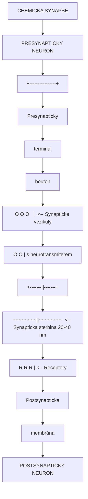
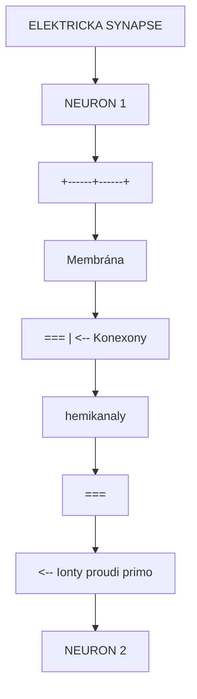
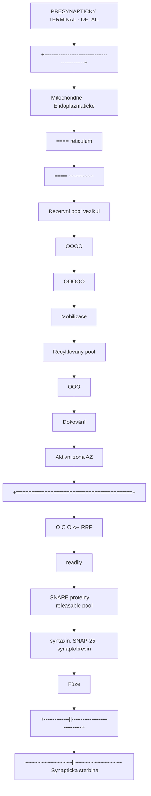
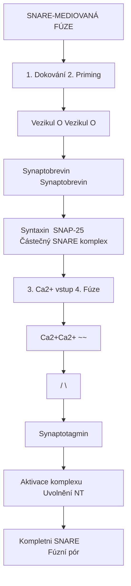
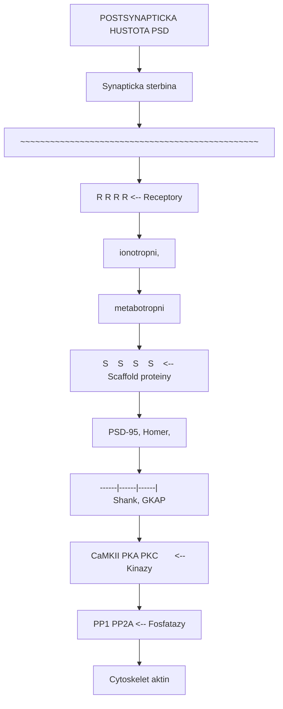
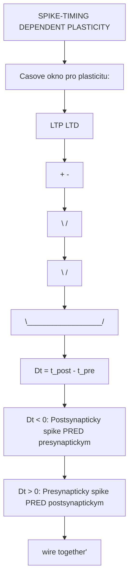

+++
title = "Synapse"
description = "Synapse - specializované spojení mezi neurony umoznujici prenos nervovych signalu, zakladni jednotka neuronalni komunikace"
weight = 3
insert_anchor_links = "right"

[taxonomies]
categories = ["neuroanatomie", "neurobiologie"]
tags = ["synapse", "neurotransmise", "neuroplasticita", "LTP", "LTD", "synapticky prenos"]
+++

# Synapse - Molekularni brana neuronalni komunikace

**Synapse** (z reckeho *synapsis* - spojeni) je specializovana struktura umoznujici prenos signalu mezi dvema neurony nebo mezi neuronem a efektorovou bunkou (sval, zlaza). Synapse jsou fundamentalnimi jednotkami neuronalni komunikace a klicovymi cili psychoaktivnich latek vcetne [psychedelik](@/alkaloids/_index.md), [GABAergickych latek](@/glossary/gaba.md) a disociativ.

---

## Zakladni informace

| Vlastnost | Hodnota |
|-----------|---------|
| **Odhadovany pocet v lidskem mozku** | 100-500 bilionу (10^14 - 10^15) |
| **Pruмerna vzdalenost synaptickou sterbinou** | 20-40 nm |
| **Rychlost prenosu (chemicka synapse)** | 0,5-5 ms |
| **Rychlost prenosu (elektricka synapse)** | < 0,1 ms |
| **Pocet synapsi na jeden neuron** | 1 000 - 10 000 (prumerne 7 000) |

---

## Typy synapsi

### Chemicka synapse

Chemicke synapse jsou nejrozsirenejsim typem synaptickeho spojeni v centralnm nervovem systemu. Prenos signalu je zprostredkovan uvolnenim neurotransmiteru.



<details>
<summary>ASCII verze diagramu</summary>

```
                CHEMICKA SYNAPSE

    PRESYNAPTICKY NEURON
           |
           v
    +----------------+
    | Presynapticky  |
    |   terminal     |
    |   (bouton)     |
    |                |
    |  [O] [O] [O]   |  <-- Synapticke vezikuly
    |   [O] [O]      |      s neurotransmiterem
    |                |
    +-------||-------+
            ||
    ~~~~~~~~||~~~~~~~~  <-- Synapticka sterbina (20-40 nm)
            ||
    +-------||-------+
    |       vv       |
    |   [R] [R] [R]  |  <-- Receptory
    |                |
    | Postsynapticka |
    |   membrána     |
    +----------------+
           |
           v
    POSTSYNAPTICKY NEURON
```

</details>

#### Charakteristiky chemicke synapse

| Vlastnost | Popis |
|-----------|-------|
| **Smerovy prenos** | Pouze presynapticky -> postsynapticky |
| **Synaptické zpozdeni** | 0,5-5 ms |
| **Plasticita** | Vysoka (LTP, LTD) |
| **Modulace** | Mozna farmakologicky |
| **Typy signalu** | Excitacni nebo inhibicni |

### Elektricka synapse (Gap junction)

Elektricke synapse umoznuji primy tok iontu mezi neurony prostrednictvim kanalu tvorenych konexiny.



<details>
<summary>ASCII verze diagramu</summary>

```
                ELEKTRICKA SYNAPSE

    NEURON 1
           |
    +------+------+
    |  Membrána   |
    |    ===      |  <-- Konexony
    |    |||      |      (hemikanaly)
    |    ===      |
    +------+------+
           |
    -------+-------  <-- Gap junction (2-4 nm)
           |
    +------+------+
    |    ===      |
    |    |||      |  <-- Ionty proudi primo
    |    ===      |
    |  Membrána   |
    +------+------+
           |
    NEURON 2
```

</details>

#### Charakteristiky elektricke synapse

| Vlastnost | Popis |
|-----------|-------|
| **Smer prenosu** | Obousmerny (bidirekcionalni) |
| **Zpozdeni** | Prakticky zadne (< 0,1 ms) |
| **Plasticita** | Omezena |
| **Modulace** | Omezena (pH, Ca2+, fosforylace) |
| **Funkce** | Synchronizace neuronalni aktivity |

### Srovnani typu synapsi

| Charakteristika | Chemicka | Elektricka |
|-----------------|----------|------------|
| **Sterbina** | 20-40 nm | 2-4 nm |
| **Zpozdeni** | 0,5-5 ms | < 0,1 ms |
| **Smer** | Jednosmerny | Obousmerny |
| **Messenger** | Neurotransmiter | Ionty primo |
| **Zesíleni** | Mozne | Omezene |
| **Plasticita** | Vysoka | Nizka |
| **Prevaha** | 99% synapsi CNS | 1% (interneurony, glie) |

---

## Struktura chemicke synapse

### Presynapticky terminal (bouton)

Presynapticky terminal je specializovana struktura na konci axonu obsahujici veskery aparát pro uvolneni neurotransmiteru.



<details>
<summary>ASCII verze diagramu</summary>

```
            PRESYNAPTICKY TERMINAL - DETAIL

    +------------------------------------------------+
    |                                                |
    |    Mitochondrie          Endoplazmaticke       |
    |    [====]                reticulum             |
    |    [====]                ~~~~~~~~              |
    |                                                |
    |         Rezervni pool vezikul                  |
    |            [O][O][O][O]                        |
    |           [O][O][O][O][O]                      |
    |                  |                             |
    |                  v  Mobilizace                 |
    |         Recyklovany pool                       |
    |           [O][O][O]                            |
    |              |                                 |
    |              v  Dokování                       |
    |    Aktivni zona (AZ)                           |
    |    +=====================================+     |
    |    |  [O]  [O]  [O]  <-- RRP             |     |
    |    |   |    |    |      (readily         |     |
    |    | SNARE proteiny      releasable pool)|     |
    |    | (syntaxin, SNAP-25, synaptobrevin)  |     |
    |    +=====================================+     |
    |              |                                 |
    |              v  Fúze                           |
    +--------------||------------------------------+
                   ||
    ~~~~~~~~~~~~~~~||~~~~~~~~~~~~~~~  Synapticka sterbina
```

</details>

#### Synapticke vezikuly

| Typ vezikulu | Obsah | Prumer | Funkcni charakteristika |
|--------------|-------|--------|------------------------|
| **Male cire** | Glutamat, GABA, glycin | 40-50 nm | Rychly prenos |
| **Male dense-core** | Monoaminy (DA, NA, 5-HT) | 40-60 nm | Modulacni prenos |
| **Velke dense-core** | Neuropeptidy | 80-120 nm | Pomalý prenos |

#### SNARE komplex a exocytoza



<details>
<summary>ASCII verze diagramu</summary>

```
                SNARE-MEDIOVANÁ FÚZE

    1. Dokování                    2. Priming

    Vezikul [O]                   Vezikul [O]
              |                          |
    Synaptobrevin                 Synaptobrevin
         ---                           ---
         |||                           |||
    =====================        =====================
    Syntaxin  SNAP-25           Částečný SNARE komplex


    3. Ca2+ vstup                 4. Fúze

    [Ca2+][Ca2+]                       ~~
      v    v                          /  \
    Synaptotagmin                    |    |
           |                         |    |
    Aktivace komplexu            Uvolnění NT
    =====================        =====================
    Kompletni SNARE              Fúzní pór
```

</details>

#### Klicove proteiny presynaptickeho terminalu

| Protein | Funkce |
|---------|--------|
| **Synapsin** | Ukotveni vezikul k cytoskeletu |
| **Synaptotagmin** | Ca2+ senzor, spoustec fuze |
| **Synaptobrevin (VAMP)** | v-SNARE, vezikulový protein |
| **Syntaxin** | t-SNARE, membranový protein |
| **SNAP-25** | t-SNARE, membranový protein |
| **Complexin** | Regulace fuze |
| **Munc13** | Priming vezikul |
| **Munc18** | Regulace SNARE |

### Synapticka sterbina

Synapticka sterbina je extracelularni prostor mezi pre- a postsynaptickou membranou.

```
            SYNAPTICKA STERBINA - KOMPONENTY

    Presynapticka membrana
    ================================================

                    20-40 nm

    [NT]  [NT]  [NT]  <-- Neurotransmitery
        \   |   /
         \  |  /
          \ | /
    [E] [E] [E] [E]   <-- Degradacni enzymy
                          (AChE, MAO, COMT)
    [CAM]     [CAM]   <-- Cell adhesion molecules
                          (neurexin-neuroligin)
    [ECM] [ECM] [ECM] <-- Extracellular matrix
                          (proteoglykany)

    ================================================
    Postsynapticka membrana
```

#### Komponenty synapticke sterbiny

| Komponenta | Funkce |
|------------|--------|
| **Neurotransmitery** | Signalni molekuly |
| **Degradacni enzymy** | Ukonceni signalu (AChE, MAO, COMT) |
| **Adhezni molekuly** | Strukturalni integrita (neurexin, neuroligin) |
| **ECM** | Strukturalni podpora |
| **Transportery** | Reuptake neurotransmiteru |

### Postsynapticka hustota (PSD)

Postsynapticka hustota je elektronove densa oblast na postsynapticke membrane obsahujici receptory a signalni proteiny.



<details>
<summary>ASCII verze diagramu</summary>

```
            POSTSYNAPTICKA HUSTOTA (PSD)

    Synapticka sterbina
    ~~~~~~~~~~~~~~~~~~~~~~~~~~~~~~~~~~~~~~~~~~~~~~~~

    [R]    [R]    [R]    [R]    <-- Receptory
     |      |      |      |        (ionotropni,
     |      |      |      |         metabotropni)
    ========================================= PSD
     |      |      |      |
    [S]    [S]    [S]    [S]    <-- Scaffold proteiny
     |      |      |      |        (PSD-95, Homer,
     |------|------|------|         Shank, GKAP)
           |      |
    [CaMKII] [PKA] [PKC]       <-- Kinazy
           |      |
         [PP1] [PP2A]          <-- Fosfatazy
           |
    Cytoskelet (aktin)
```

</details>

#### Hlavni komponenty PSD

| Protein | Funkce | Interakce |
|---------|--------|-----------|
| **PSD-95** | Scaffold, kotveni receptoru | NMDA, AMPA |
| **Homer** | Scaffold, mGluR signalizace | mGluR, IP3R |
| **Shank** | Master scaffold | Homer, GKAP |
| **GKAP** | Linker | PSD-95, Shank |
| **CaMKII** | Ca2+-zavislá kinaza | NMDA, AMPA |
| **SynGAP** | RasGAP, plasticita | PSD-95 |

---

## Mechanismus synaptického prenosu

### Kroky synaptické transmise

```
    SYNAPTICKY PRENOS - KOMPLETNI SEKVENCE

    1. AKČNÍ POTENCIÁL
    ===================

    Axon -----> Presynapticky terminal
                    |
                    v

    2. DEPOLARIZACE PRESYNAPTICKÉ MEMBRÁNY
    ======================================

    Napetove ridene Ca2+ kanaly (VGCC)
    se otviraji
                    |
                    v

    3. VSTUP Ca2+
    =============

    [Ca2+]out ---> [Ca2+]in
    (lokalni koncentrace ~100 µM)
                    |
                    v

    4. Ca2+ SENZOR AKTIVACE
    =======================

    Synaptotagmin vaze Ca2+
    Konformacni zmena
                    |
                    v

    5. SNARE-MEDIOVANÁ FÚZE
    =======================

    Vezikul + presynapticka membrana
    Fúzni pór se otvira
                    |
                    v

    6. UVOLNENI NEUROTRANSMITERU
    ============================

    Exocytoza do synapticke sterbiny
    ~3000 molekul na vezikul
                    |
                    v

    7. DIFUZE PŘES STERBINU
    =======================

    Cas: ~0.5 µs
    Vzdalenost: 20-40 nm
                    |
                    v

    8. VAZBA NA RECEPTOR
    ====================

    Neurotransmiter + [Receptor](@/glossary/receptor.md)
    Konformacni zmena receptoru
                    |
                    v

    9. POSTSYNAPTICKA ODPOVED
    =========================

    Ionotropni: Iontovy tok (ms)
    Metabotropni: Signalni kaskada (s-min)
                    |
                    v

    10. UKONCENI SIGNALU
    ====================

    a) Enzymaticka degradace
    b) Reuptake (transportery)
    c) Difuze
                    |
                    v

    11. RECYKLACE VEZIKUL
    =====================

    Endocytoza + repleneni
```

### Kvantová hypotéza

Neurotransmitery jsou uvolnovany v diskretnich jednotkach nazyvanych kvanta.

```
    KVANTOVA HYPOTEZA (del Castillo & Katz, 1954)

    Miniaturni postsynapticky potencial (mEPSP):
    - Odpovida uvolneni jednoho vezikulu
    - Amplituda: ~0.5-1 mV
    - Spontanni uvolnovani

    EPSP = n × p × q

    n = pocet uvolnitelnych vezikul
    p = pravdepodobnost uvolneni
    q = kvantova velikost (odpoved na 1 vezikul)

    Priklady:

    Klidovy stav (nizka [Ca2+]):
    _______________/\___________________  mEPSP
                   0.5 mV

    Akcni potencial (vysoka [Ca2+]):
    ___________/\________
              /  \
             /    \
    ________/      \_____________________  EPSP
            10-20 mV (soucet ~10-40 kvant)
```

### Napetove rizene Ca2+ kanaly (VGCC)

| Typ | Alpha1 podjednotka | Lokalizace | Farmakologie |
|-----|-------------------|------------|--------------|
| **P/Q-typ** | Cav2.1 | Presynapticky terminal | omega-Agatoxin |
| **N-typ** | Cav2.2 | Presynapticky terminal | omega-Conotoxin |
| **R-typ** | Cav2.3 | Dendrity, soma | SNX-482 |
| **L-typ** | Cav1.x | Soma, dendrity | Dihydropyridiny |
| **T-typ** | Cav3.x | Soma, dendrity | Mibefradil |

---

## Reuptake neurotransmiteru

### Transportery

```
    REUPTAKE MECHANISMUS

    Synapticka sterbina

    [NT] [NT] [NT] [NT]
      \   |   |   /
       \  |   |  /
        \ |   | /
         \|   |/
    ======[T]======= Presynapticka membrana
           |
           v
    Presynapticky terminal

    [Na+]   [NT]
      v       |
    [===]     v
    [ T ]---->Vezikul
    [===]     (VMAT)
      ^
      |
    [Na+/K+ ATPaza]
```

#### Hlavni transportery

| Transporter | Neurotransmiter | Farmakologicke cile |
|-------------|-----------------|---------------------|
| **SERT** | Serotonin | SSRI (fluoxetin) |
| **DAT** | Dopamin | Kokain, amfetamin |
| **NET** | Noradrenalin | Tricyklika, atomoxetin |
| **GAT-1,2,3** | [GABA](@/glossary/gaba.md) | Tiagabin |
| **EAAT1-5** | Glutamat | - |
| **GlyT1,2** | Glycin | Bitopertin |
| **ChT** | Cholin (pro ACh) | Hemicholinium |

### Vezikulární transportery

| Transporter | Obsah | Lokalizace |
|-------------|-------|------------|
| **VMAT1** | Monoaminy | Chromafinni bunky |
| **VMAT2** | Monoaminy | Neurony CNS |
| **VGAT/VIAAT** | GABA, Glycin | GABAergni neurony |
| **VGluT1,2,3** | Glutamat | Glutamatergni neurony |
| **VAChT** | Acetylcholin | Cholinergni neurony |

### Enzymaticka degradace

```
    DEGRADACE NEUROTRANSMITERU

    1. ACETYLCHOLIN
    ===============

    ACh + H2O --[AChE]--> Cholin + Acetat

    Rychlost: ~25,000 molekul/s
    Lokalizace: Synaptická sterbina


    2. MONOAMINY (DA, NA, 5-HT)
    ===========================

    Monoamin --[MAO]--> Aldehyd --[ALDH]--> Kyselina

    MAO-A: 5-HT, NA, DA
    MAO-B: DA, fenyletylaminy
    Lokalizace: Mitochondrialni membrána


    3. KATECHOLAMINY (DA, NA)
    =========================

    Katecholamin --[COMT]--> O-metylderivát

    Lokalizace: Postsynaptická, gliová
```

---

## Synaptická plasticita

Synaptická plasticita je schopnost synapsi menit svou silu v zavislosti na aktivite. Je zakladem uceni a pameti.

### Dlouhodobo potenace (LTP)

```
    LONG-TERM POTENTIATION (LTP)

    INDUKCE:
    ========

    Vysokofrekvenčni stimulace (100 Hz, 1s)
    nebo
    Spike-timing dependent (STDP)

            |
            v

    NMDA receptor aktivace
    (vyzaduje: glutamat + depolarizace + glycin)

            |
            v

    Ca2+ influx
    [Ca2+]i >> baseline

            |
            v

    CASNA FAZE (E-LTP, minuty-hodiny):
    ==================================

    CaMKII aktivace
            |
            v
    AMPA receptor fosforylace
            |
            v
    Zvysena vodivost existujicich AMPA-R
    + Inserce novych AMPA-R do membrany

            |
            v

    POZDNI FAZE (L-LTP, hodiny-dny):
    ================================

    CREB aktivace
            |
            v
    Genova exprese
    (BDNF, Arc, Homer)
            |
            v
    Synteza novych proteinu
            |
            v
    Strukturalni zmeny
    (nové spiny, vetší PSD)
```

#### Molekularni mechanismy LTP

| Faze | Cas | Mechanismus | Zavislost na synteze |
|------|-----|-------------|---------------------|
| **E-LTP** | Minuty-hodiny | Fosforylace, trafficking | Ne |
| **L-LTP** | Hodiny-dny | Transkripce, translace | Ano |

#### Klicove molekuly LTP

| Molekula | Funkce v LTP |
|----------|--------------|
| **CaMKII** | Centralni kinaza, "molekularni pamet" |
| **PKA** | Signalizace cAMP, L-LTP |
| **PKC** | Fosforylace receptoru |
| **CREB** | Transkripčni faktor |
| **BDNF** | Neurotrofin, strukturalni plasticita |
| **Arc** | Immediate early gene, AMPA-R trafficking |

### Dlouhodobo deprese (LTD)

```
    LONG-TERM DEPRESSION (LTD)

    INDUKCE:
    ========

    Nizkofrekvenčni stimulace (1-5 Hz, 10-15 min)
    nebo
    mGluR aktivace

            |
            v

    Mírný Ca2+ vzestup
    [Ca2+]i > baseline (ale < prah pro LTP)

            |
            v

    NMDA-DEPENDENTNI LTD:
    =====================

    Aktivace fosfataz (PP1, PP2B/kalcineurin)
            |
            v
    AMPA receptor defosforylace
            |
            v
    Internalizace AMPA receptoru
            |
            v
    Snizená synaptická sila


    mGluR-DEPENDENTNI LTD:
    ======================

    mGluR1/5 aktivace
            |
            v
    Gq/11 --> PLC --> IP3 + DAG
            |
            v
    Lokalni proteinova synteza
    (FMRP regulace)
            |
            v
    AMPA-R internalizace
```

#### Srovnani LTP a LTD

| Parametr | LTP | LTD |
|----------|-----|-----|
| **Stimulace** | Vysokofrekvenčni | Nizkofrekvenčni |
| **Ca2+ uroven** | Vysoka | Stredni |
| **Hlavni efektory** | Kinazy (CaMKII, PKA) | Fosfatazy (PP1, PP2B) |
| **AMPA-R** | Inserce, fosforylace | Internalizace |
| **Synapticka sila** | Zvyseni | Snizeni |

### Spike-Timing Dependent Plasticity (STDP)



<details>
<summary>ASCII verze diagramu</summary>

```
    SPIKE-TIMING DEPENDENT PLASTICITY

    Casove okno pro plasticitu:

    LTP                              LTD
    (+)                              (-)
     ^                                ^
     |    \                      /    |
     |     \                    /     |
     |      \__________________/      |
     |                                |
    -+----------------+----------------+-> Dt (ms)
    -100    -50       0       +50    +100

    Dt = t_post - t_pre

    Dt < 0: Postsynapticky spike PRED presynaptickym
            --> LTD (anti-Hebbovska)

    Dt > 0: Presynapticky spike PRED postsynaptickym
            --> LTP (Hebbovska: "cells that fire together,
                                 wire together")
```

</details>

---

## Farmakologie synapse

### Cile synaptické farmakologie

```
    FARMAKOLOGICKE CILE NA SYNAPSI

    PRESYNAPTICKY:
    ==============

    1. Synteza NT
       [Inhibitory: alpha-metyldopa]

    2. Vezikulární storage
       [Inhibitory: reserpin (VMAT)]

    3. Uvolnovani
       [Modulatory: botulin toxin (blokuje)]
       [Facilitatory: amfetamin]

    4. Autoreceptory
       [Agonisté: clonidin (alpha-2)]


    SYNAPTICKÁ STERBINA:
    ====================

    5. Degradacni enzymy
       [Inhibitory: AChE-I, MAO-I]


    POSTSYNAPTICKY:
    ===============

    6. [Receptory](@/glossary/receptor.md)
       [Agonisté, antagonisté, modulatory]

    7. Reuptake transportery
       [Inhibitory: SSRI, kokain, tricyklika]
```

### Prehled farmak podle mechanismu

| Mechanismus | Priklad | Terapeutické pouziti |
|-------------|---------|---------------------|
| **Synteza NT +** | L-DOPA | Parkinsonova choroba |
| **VMAT blokada** | Reserpin | Hypertenze (historicky) |
| **Uvolnovani +** | Amfetamin | ADHD |
| **Uvolnovani -** | Botulin toxin | Dystonie, kosmetika |
| **AChE inhibice** | Donepezil | Alzheimerova choroba |
| **MAO inhibice** | Selegilin, Moclobemid | Deprese, Parkinson |
| **SERT inhibice** | Fluoxetin | Deprese, úzkost |
| **DAT inhibice** | Methylfenidat | ADHD |
| **Receptor antagonismus** | Ketanserin | - (vyzkum) |
| **PAM** | Benzodiazepiny | Úzkost, nespavost |

### Psychoaktivni latky a synapse

| Latka | Primarni synapticky cil | Mechanismus |
|-------|-------------------------|-------------|
| [**LSD**](@/alkaloids/lsd.md) | [5-HT2A receptor](@/receptors/5-ht2a.md) | Parcialni agonista |
| [**Psilocybin**](@/alkaloids/psilocybin.md) | [5-HT2A receptor](@/receptors/5-ht2a.md) | Agonista (via psilocin) |
| [**DMT**](@/alkaloids/dmt.md) | [5-HT2A](@/receptors/5-ht2a.md), sigma-1 | Agonista |
| **Ketamin** | [NMDA receptor](@/receptors/nmda.md) | Kanalovy blokator |
| **MDMA** | SERT, DAT, NET | Reverzi transporteru |
| **Kokain** | DAT, SERT, NET | Blokáda reuptake |

---

## Synaptická patologie

### Synaptopatie

| Onemocneni | Synaptická abnormalita | Postizeny system |
|------------|------------------------|------------------|
| **Alzheimerova choroba** | Ztrata synapsi, amyloid | Cholinergni, glutamátergní |
| **Parkinsonova choroba** | Degenerace terminalu | Dopaminergni |
| **Schizofrenie** | Synaptická dyskonektivita | Glutamát, dopamin |
| **Deprese** | Snizená plasticita | Serotonergni, glutamátergní |
| **Epilepsie** | Excitacne-inhibicni dysbalance | GABA, glutamát |
| **Autismus** | Synaptické genové mutace | Variabilni |

### Synaptické proteiny a nemoci

| Protein | Asociovane onemocneni |
|---------|----------------------|
| **Neurexin** | Autismus, schizofrenie |
| **Neuroligin** | Autismus |
| **Shank** | Autismus (Phelan-McDermid syndrom) |
| **Synapsin** | Epilepsie |
| **Synaptophysin** | Alzheimerova choroba (marker) |

---

## Vyzkumne metody

### Elektrofyziologie

| Metoda | Co meri | Rozliseni |
|--------|---------|-----------|
| **Patch-clamp** | Iontove proudy | Jednotliva synapse |
| **Field EPSP** | Populacni aktivita | Pole synapsi |
| **Multielectrode array** | Sitova aktivita | Vicero neuronu |

### Zobrazovaci metody

| Metoda | Co zobrazuje | Rozliseni |
|--------|--------------|-----------|
| **Elektronova mikroskopie** | Ultrastruktura | nm |
| **Super-resolution** | Jednotlive molekuly | 20-50 nm |
| **Two-photon** | Dynamika spinu | µm, in vivo |
| **Ca2+ imaging** | Synaptická aktivita | Jednotlive spiny |

### Geneticke nastroje

| Nastroj | Pouziti |
|---------|---------|
| **Optogenetika** | Kontrola synaptické aktivity svetlem |
| **Chemogenetika (DREADD)** | Farmakogeneticka kontrola |
| **Synaptické reportery** | Vizualizace aktivity |
| **CRISPR** | Editace synaptických genu |

---

## Reference

1. Sudhof, T.C. (2013). *Neurotransmitter release: the last millisecond in the life of a synaptic vesicle*. Neuron.
2. Sheng, M. & Kim, E. (2011). *The postsynaptic organization of synapses*. Cold Spring Harbor Perspectives in Biology.
3. Malenka, R.C. & Bear, M.F. (2004). *LTP and LTD: an embarrassment of riches*. Neuron.
4. Bliss, T.V. & Collingridge, G.L. (1993). *A synaptic model of memory: long-term potentiation in the hippocampus*. Nature.
5. Kauer, J.A. & Malenka, R.C. (2007). *Synaptic plasticity and addiction*. Nature Reviews Neuroscience.
6. Citri, A. & Malenka, R.C. (2008). *Synaptic plasticity: multiple forms, functions, and mechanisms*. Neuropsychopharmacology.
7. Rizo, J. & Rosenmund, C. (2008). *Synaptic vesicle fusion*. Nature Structural & Molecular Biology.

---

## Viz take

### Zakladni pojmy
- [Receptor](@/glossary/receptor.md) - Molekularni brána bunecne komunikace
- [GABA](@/glossary/gaba.md) - Hlavni inhibicni neurotransmiter
- [Nukleotid](@/glossary/nukleotid.md) - Stavebni jednotky signalnich molekul
- [Fosfat](@/glossary/fosfat.md) - Klicovy pro signalni transdukci

### Specificke receptory
- [5-HT2A receptor](@/receptors/5-ht2a.md) - Primarni cil klasickych psychedelik
- [GABA-A receptor](@/receptors/gaba-a.md) - Hlavni inhibicni receptor, cil muscimolu
- [NMDA receptor](@/receptors/nmda.md) - Klicovy pro plasticitu, cil disociativ

### Psychoaktivni latky
- [LSD](@/alkaloids/lsd.md) - 5-HT2A agonista s vysokou afinitou
- [Psilocybin](@/alkaloids/psilocybin.md) - Houbove psychedelikum
- [DMT](@/alkaloids/dmt.md) - Endogenni psychedelikum

### Zdroje psychoaktivnich latek
- [Psilocybe houby](@/shrooms/psilocybes/_index.md) - Zdroj psilocybinu
- [Amanita muscaria](@/shrooms/amanita-muscaria.md) - Zdroj muscimolu

---

<- Zpet na [Glosar](@/glossary/_index.md)
