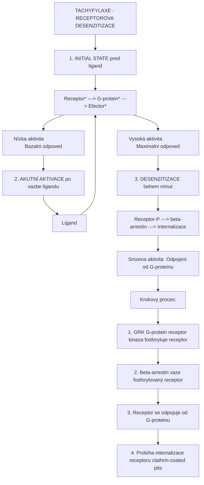
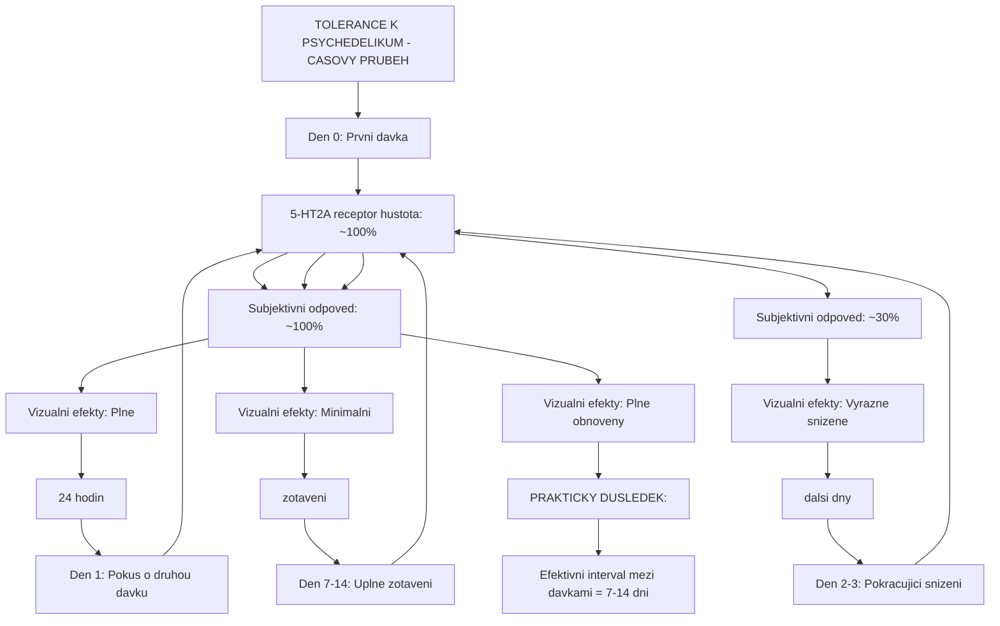
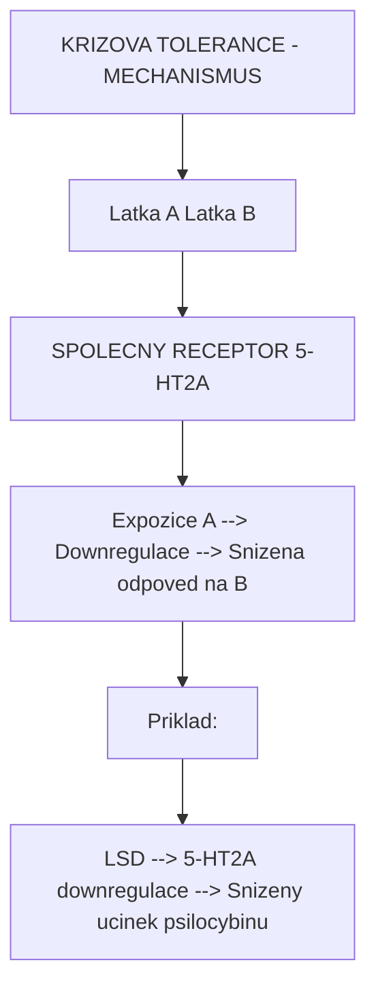
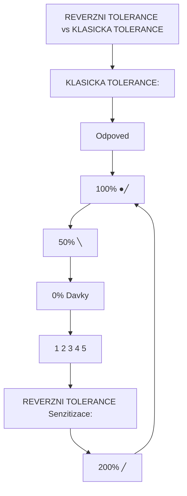
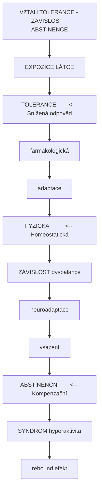
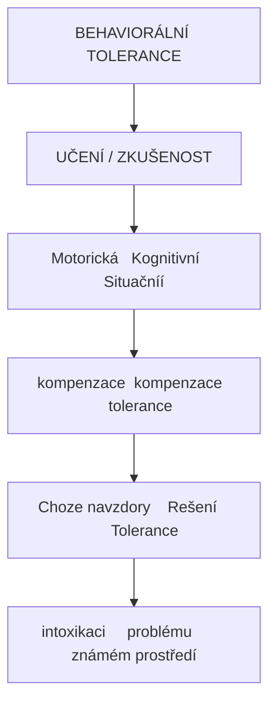
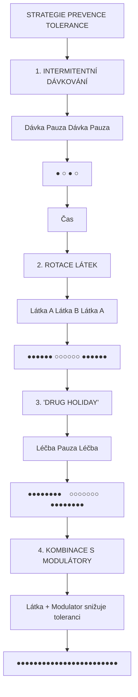

+++
title = "Tolerance"
description = "Farmakologicka tolerance - adaptivni fenomen snizene odpovedi na opakovane podavani latek, mechanismy receptorove downregulace a klinicke implikace"
weight = 3
insert_anchor_links = "right"
[taxonomies]
categories = ["farmakologie", "neurofarmakologie"]
tags = ["tolerance", "receptory", "downregulace", "tachyfylaxe", "krizova-tolerance", "senzitizace", "psychedelika"]
+++

# Tolerance - Farmakologicka adaptace organismu

**Tolerance** je farmakologicky fenomen charakterizovany **snizenou odpovedi na opakovanou nebo prolongovanou expozici latce**. Organismus se adaptuje na pritomnost xenobiotika, coz vede k nutnosti zvysovat davku pro dosazeni puvodniho ucinku. Tento fenomen ma zasadni vyznam pro pochopeni ucinku [psychedelik](@/alkaloids/_index.md), [GABAergních latek](@/glossary/gaba.md) a dalsich psychoaktivnich sloucenin.

---

## Zakladni definice

### Farmakologicka tolerance

| Aspekt | Popis |
|--------|-------|
| **Definice** | Snizena odpoved na latku po predchozí expozici |
| **Duvod** | Adaptivni mechanismy organismu |
| **Dusledek** | Potreba vyssi davky pro stejny ucinek |
| **Reverzibilita** | Casto reverzibilni po obdobi abstinence |
| **Klinicky vyznam** | Davkovaci rezimy, riziko predavkovani |

### Matematicke vyjadreni

```
Tolerance index (TI) = ED50 (po expozici) / ED50 (pred expozici)

Priklad:
- ED50 pred: 10 mg
- ED50 po: 50 mg
- TI = 50/10 = 5 (5-nasobna tolerance)

Interpretace:
TI = 1.0:     Zadna tolerance
TI = 2-5:     Mirna tolerance
TI = 5-10:    Vyrazna tolerance
TI > 10:      Extremni tolerance
```

---

## Klasifikace tolerance

### Podle casoveho prubehu

| Typ | Casovy ramec | Mechanismus | Priklady |
|-----|--------------|-------------|----------|
| **Akutni (tachyfylaxe)** | Minuty-hodiny | Receptorova desenzitizace | Nitroglycerin, beta-agoniste |
| **Rychla** | Hodiny-dny | Downregulace receptoru | [Psychedelika](@/alkaloids/_index.md), amfetaminy |
| **Chronicka** | Tydny-mesice | Kompenzacni adaptace | Opioidy, benzodiazepiny |

### Podle mechanismu

```mermaid
flowchart TD
    node_TYPYTOLERANCEpodleme["TYPY TOLERANCE podle mechanismu"]
    node_FARMAKOKINETICKmetab["+-- FARMAKOKINETICKÁ metabolicka"]
    node_IndukceCYP450enzymu["-- Indukce CYP450 enzymu"]
    node_Zvysenyfirstpassmeta["-- Zvyseny first-pass metabolismus"]
    node_Zmenadistribuce["+-- Zmena distribuce"]
    node_FARMAKODYNAMICKrecep["+-- FARMAKODYNAMICKÁ receptorova"]
    node_Receptorovadownregul["-- Receptorova downregulace"]
    node_Receptorovadesenziti["-- Receptorova desenzitizace"]
    node_Zmenyvsignalnichdrah["-- Zmeny v signalnich drahach"]
    node_Kompenzacnimechanism["+-- Kompenzacni mechanismy"]
    node_BEHAVIORLNnaucena["+-- BEHAVIORÁLNÍ naucena"]
    node_Podminenakompenzace["+-- Podminena kompenzace"]
    node_Ocekavaniucinku["+-- Ocekavani ucinku"]
    node_Situacnifaktory["+-- Situacni faktory"]

    node_TYPYTOLERANCEpodleme --> node_FARMAKOKINETICKmetab
    node_FARMAKOKINETICKmetab --> node_IndukceCYP450enzymu
    node_IndukceCYP450enzymu --> node_Zvysenyfirstpassmeta
    node_Zvysenyfirstpassmeta --> node_Zmenadistribuce
    node_Zmenadistribuce --> node_FARMAKODYNAMICKrecep
    node_FARMAKODYNAMICKrecep --> node_Receptorovadownregul
    node_Receptorovadownregul --> node_Receptorovadesenziti
    node_Receptorovadesenziti --> node_Zmenyvsignalnichdrah
    node_Zmenyvsignalnichdrah --> node_Kompenzacnimechanism
    node_Kompenzacnimechanism --> node_BEHAVIORLNnaucena
    node_BEHAVIORLNnaucena --> node_Podminenakompenzace
    node_Podminenakompenzace --> node_Ocekavaniucinku
    node_Ocekavaniucinku --> node_Situacnifaktory

    click node_FARMAKODYNAMICKrecep "/glossary/receptor/" "+-- FARMAKODYNAMICKÁ receptorova"
    click node_Receptorovadownregul "/glossary/receptor/" "-- Receptorova downregulace"
    click node_Receptorovadesenziti "/glossary/receptor/" "-- Receptorova desenzitizace"
```



<details>
<summary>ASCII verze diagramu</summary>

```
TYPY TOLERANCE (podle mechanismu)
    |
    +-- FARMAKOKINETICKÁ (metabolicka)
    |       |-- Indukce CYP450 enzymu
    |       |-- Zvyseny first-pass metabolismus
    |       +-- Zmena distribuce
    |
    +-- FARMAKODYNAMICKÁ (receptorova)
    |       |-- Receptorova downregulace
    |       |-- Receptorova desenzitizace
    |       |-- Zmeny v signalnich drahach
    |       +-- Kompenzacni mechanismy
    |
    +-- BEHAVIORÁLNÍ (naucena)
            +-- Podminena kompenzace
            +-- Ocekavani ucinku
            +-- Situacni faktory
```

</details>

---

## Akutni tolerance (Tachyfylaxe)

### Definice a charakteristika

**Tachyfylaxe** (z reckeho "tachys" = rychly, "phylaxis" = ochrana) je rychle nastupujici snizeni odpovedi na latku, typicky behem minut az hodin po prvni davce.

| Vlastnost | Popis |
|-----------|-------|
| **Nastup** | Minuty az hodiny |
| **Mechanismus** | Receptorova desenzitizace, deplece mediátoru |
| **Zotaveni** | Hodiny az dny |
| **Klinicky vyznam** | Omezuje ucinek opakovanych davek |

### Mechanismus na molekularni urovni



<details>
<summary>ASCII verze diagramu</summary>

```
TACHYFYLAXE - RECEPTOROVA DESENZITIZACE

1. INITIAL STATE (pred ligand)

   [Receptor] -----> [G-protein] -----> [Efector]
       |                                    |
       v                                    v
   Nízka aktivita                     Bazalni odpoved

2. AKUTNÍ AKTIVACE (po vazbe ligandu)

   Ligand
      |
      v
   [Receptor*] ---> [G-protein*] ---> [Efector*]
       |                                   |
       v                                   v
   Vysoká aktivita                  Maximalni odpoved

3. DESENZITIZACE (behem minut)

   Ligand
      |
      v
   [Receptor-P] ---> [beta-arrestin] ---> [Internalizace]
       |                |
       v                v
   Snizena aktivita  Odpojeni od G-proteinu

Krokovy proces:
1. GRK (G-protein receptor kinaza) fosforyluje receptor
2. Beta-arrestin vaze fosforylovaný receptor
3. Receptor se odpojuje od G-proteinu
4. Probíha internalizace receptoru (clathrin-coated pits)
```

</details>

### Priklady tachyfylaxe

| Latka | Receptor | Casovy ramec | Klinicky dopad |
|-------|----------|--------------|----------------|
| **Nitroglycerin** | Guanylyl cyklaza | 24-48 hodin | Nutnost prestávek |
| **Tyramin** | Adrenergni | Minuty | Snizeny pressoricky ucinek |
| **Nikotinove agonisty** | nAChR | Minuty | Desenzitizace kanalu |
| **Beta-agonisty** | Beta-2 AR | Hodiny | Snizena bronchodilatace |
| **Amfetaminy** | DAT, VMAT | Hodiny | Akutni tolerance |

---

## Chronicka tolerance

### Definice a mechanismy

Chronicka tolerance se vyviji pri prolongovane expozici (tydny az mesice) a zahrnuje komplexni adaptivni zmeny na vice urovnich.

```mermaid
flowchart TD
    node_CHRONICKATOLERANCEVI["CHRONICKA TOLERANCE - VICEUROVNOVA ADAPTACE"]
    node_Uroven1RECEPTOR["Uroven 1: RECEPTOR"]
    node_Snizenipoctureceptor["-- Snizeni poctu receptoru downregulace"]
    node_Zmenaafinity["-- Zmena afinity"]
    node_Zmenaeficacity["+-- Zmena eficacity"]
    node_Uroven2SIGNALNIDRAHY["Uroven 2: SIGNALNI DRAHY"]
    node_ZmenaGproteinu["-- Zmena G-proteinu"]
    node_Modifikacesekundarni["-- Modifikace sekundarnich messengeru"]
    node_Zmenakinaznichkaskad["+-- Zmena kinaznich kaskad"]
    node_Uroven3GENOVAEXPRESE["Uroven 3: GENOVA EXPRESE"]
    node_Zmenatranskripcerece["-- Zmena transkripce receptoru"]
    node_Zmenatransporteru["-- Zmena transporteru"]
    node_Kompenzacniproteiny["+-- Kompenzacni proteiny"]
    node_Uroven4SYSTEMOVAADAP["Uroven 4: SYSTEMOVA ADAPTACE"]
    node_Zmenaneuronalnichokr["-- Zmena neuronalnich okruhu"]
    node_Kompenzacnineurotran["-- Kompenzacni neurotransmise"]
    node_Homeostatickaplastic["+-- Homeostaticka plasticity"]

    node_CHRONICKATOLERANCEVI --> node_Uroven1RECEPTOR
    node_Uroven1RECEPTOR --> node_Snizenipoctureceptor
    node_Snizenipoctureceptor --> node_Zmenaafinity
    node_Zmenaafinity --> node_Zmenaeficacity
    node_Zmenaeficacity --> node_Uroven2SIGNALNIDRAHY
    node_Uroven2SIGNALNIDRAHY --> node_ZmenaGproteinu
    node_ZmenaGproteinu --> node_Modifikacesekundarni
    node_Modifikacesekundarni --> node_Zmenakinaznichkaskad
    node_Zmenakinaznichkaskad --> node_Uroven3GENOVAEXPRESE
    node_Uroven3GENOVAEXPRESE --> node_Zmenatranskripcerece
    node_Zmenatranskripcerece --> node_Zmenatransporteru
    node_Zmenatransporteru --> node_Kompenzacniproteiny
    node_Kompenzacniproteiny --> node_Uroven4SYSTEMOVAADAP
    node_Uroven4SYSTEMOVAADAP --> node_Zmenaneuronalnichokr
    node_Zmenaneuronalnichokr --> node_Kompenzacnineurotran
    node_Kompenzacnineurotran --> node_Homeostatickaplastic

    click node_Uroven1RECEPTOR "/glossary/receptor/" "Uroven 1: RECEPTOR"
    click node_Snizenipoctureceptor "/glossary/receptor/" "-- Snizeni poctu receptoru downregulace"
    click node_Zmenatranskripcerece "/glossary/receptor/" "-- Zmena transkripce receptoru"
```



<details>
<summary>ASCII verze diagramu</summary>

```
CHRONICKA TOLERANCE - VICEUROVNOVA ADAPTACE

Uroven 1: RECEPTOR
    |-- Snizeni poctu receptoru (downregulace)
    |-- Zmena afinity
    +-- Zmena eficacity

Uroven 2: SIGNALNI DRAHY
    |-- Zmena G-proteinu
    |-- Modifikace sekundarnich messengeru
    +-- Zmena kinaznich kaskad

Uroven 3: GENOVA EXPRESE
    |-- Zmena transkripce receptoru
    |-- Zmena transporteru
    +-- Kompenzacni proteiny

Uroven 4: SYSTEMOVA ADAPTACE
    |-- Zmena neuronalnich okruhu
    |-- Kompenzacni neurotransmise
    +-- Homeostaticka plasticity
```

</details>

### Molekularni mechanismy chronické tolerance

| Mechanismus | Popis | Casovy ramec | Reverzibilita |
|-------------|-------|--------------|---------------|
| **Receptor downregulace** | Snizeni celkoveho poctu receptoru | Dny-tydny | Tydny-mesice |
| **Receptor internalizace** | Endocytoza z membrany | Hodiny-dny | Dny |
| **Receptor degradace** | Lysozomalni proteolya | Dny | Vyzaduje resyntézu |
| **Zmena transkripce** | Snizena mRNA produkce | Tydny | Tydny-mesice |
| **Kompenzacni exprese** | Opacne pusobici systemy | Tydny-mesice | Mesice |

---

## Receptorova downregulace

### Detailni mechanismus

Receptorova downregulace je kliovy mechanismus tolerance k mnoha psychoaktivnim látkam vcetne [psychedelik](@/alkaloids/_index.md).

```mermaid
flowchart TD
    node_RECEPTOROVADOWNREGUL["RECEPTOROVA DOWNREGULACE - KOMPLETNI CYKLUS"]
    node_FAZE1FOSFORYLACEseku["FAZE 1: FOSFORYLACE sekundy-minuty"]
    node_AgonistaReceptorAkti["Agonista --&gt; Receptor --&gt; Aktivace --&gt; GRK"]
    node_FosforylaceCterminu["Fosforylace C-terminu"]
    node_FAZE2BETAARRESTINVAZ["FAZE 2: BETA-ARRESTIN VAZBA minuty"]
    node_PReceptorBetaarresti["P-Receptor --&gt; Beta-arrestin vazba --&gt; Uncoupling od G-proteinu"]
    node_Signalizaceterminova["Signalizace terminovana"]
    node_FAZE3INTERNALIZACEmi["FAZE 3: INTERNALIZACE minuty-hodiny"]
    node_PReceptorArrClathrin["P-Receptor-Arr --&gt; Clathrin-coated pit --&gt; Endozom"]
    node_Casnyendozom["Casny endozom"]
    node_FAZE4SORTINGhodiny["FAZE 4: SORTING hodiny"]
    node_CasnyendozomROZHODNU["Casny endozom --&gt; ROZHODNUTI:"]
    node_89134b19["+---------+----------+"]
    node_RECYKLACEDEGRADACE["RECYKLACE             DEGRADACE"]
    node_zpetnalysozom["zpet na              lysozom"]
    node_membranu["membranu"]
    node_Snizenicelkoveho["Snizeni celkoveho"]
    node_Resenzitizacepocture["Resenzitizace         poctu receptoru"]

    node_RECEPTOROVADOWNREGUL --> node_FAZE1FOSFORYLACEseku
    node_FAZE1FOSFORYLACEseku --> node_AgonistaReceptorAkti
    node_AgonistaReceptorAkti --> node_FosforylaceCterminu
    node_FosforylaceCterminu --> node_FAZE2BETAARRESTINVAZ
    node_FAZE2BETAARRESTINVAZ --> node_PReceptorBetaarresti
    node_PReceptorBetaarresti --> node_Signalizaceterminova
    node_Signalizaceterminova --> node_FAZE3INTERNALIZACEmi
    node_FAZE3INTERNALIZACEmi --> node_PReceptorArrClathrin
    node_PReceptorArrClathrin --> node_Casnyendozom
    node_Casnyendozom --> node_FAZE4SORTINGhodiny
    node_FAZE4SORTINGhodiny --> node_CasnyendozomROZHODNU
    node_CasnyendozomROZHODNU --> node_89134b19
    node_89134b19 --> node_RECYKLACEDEGRADACE
    node_RECYKLACEDEGRADACE --> node_zpetnalysozom
    node_zpetnalysozom --> node_membranu
    node_membranu --> node_Snizenicelkoveho
    node_Snizenicelkoveho --> node_Resenzitizacepocture

    click node_RECEPTOROVADOWNREGUL "/glossary/receptor/" "RECEPTOROVA DOWNREGULACE - KOMPLETNI CYKLUS"
    click node_AgonistaReceptorAkti "/glossary/receptor/" "Agonista --> Receptor --> Aktivace --> GRK"
    click node_PReceptorBetaarresti "/glossary/receptor/" "P-Receptor --> Beta-arrestin vazba --> Uncoupling od G-proteinu"
    click node_PReceptorArrClathrin "/glossary/receptor/" "P-Receptor-Arr --> Clathrin-coated pit --> Endozom"
    click node_Resenzitizacepocture "/glossary/receptor/" "Resenzitizace         poctu receptoru"
```



<details>
<summary>ASCII verze diagramu</summary>

```
RECEPTOROVA DOWNREGULACE - KOMPLETNI CYKLUS

FAZE 1: FOSFORYLACE (sekundy-minuty)
    |
    Agonista --> Receptor --> Aktivace --> GRK
                                            |
                                            v
                               Fosforylace C-terminu

FAZE 2: BETA-ARRESTIN VAZBA (minuty)
    |
    P-Receptor --> Beta-arrestin vazba --> Uncoupling od G-proteinu
                                            |
                                            v
                               Signalizace terminovana

FAZE 3: INTERNALIZACE (minuty-hodiny)
    |
    P-Receptor-Arr --> Clathrin-coated pit --> Endozom
                                                 |
                                                 v
                                    Casny endozom

FAZE 4: SORTING (hodiny)
    |
    Casny endozom --> ROZHODNUTI:
                        |
              +---------+----------+
              |                    |
              v                    v
        RECYKLACE             DEGRADACE
        (zpet na              (lysozom)
        membranu)                  |
              |                    v
              v               Snizeni celkoveho
        Resenzitizace         poctu receptoru
```

</details>

### Kinetika downregulace podle typu receptoru

| Receptor | Rychlost internalizace | Recyklace vs degradace | Zotaveni |
|----------|------------------------|------------------------|----------|
| **[5-HT2A](@/receptors/5-ht2a.md)** | Rychla (LSD, psilocin) | Prevazne degradace | 7-14 dni |
| **[GABA-A](@/receptors/gaba-a.md)** | Stredni | Smisena | 2-4 tydny |
| **Opioidni (mu)** | Rychla | Variabilni | 1-2 tydny |
| **Dopaminovy D2** | Stredni | Prevazne recyklace | Dny |
| **Adrenergni beta-2** | Rychla | Prevazne recyklace | Dny |

---

## Tolerance k psychedelikum

### Mechanismus tolerance k 5-HT2A agonistum

Psychedelika jako [psilocybin](@/alkaloids/psilocybin.md), [LSD](@/alkaloids/lsd.md) a [DMT](@/alkaloids/dmt.md) vykazuji unikatni vzorec tolerance charakterizovany rychlym nastupem a relativne rychlym zotavenim.



<details>
<summary>ASCII verze diagramu</summary>

```
TOLERANCE K PSYCHEDELIKUM - CASOVY PRUBEH

Den 0: Prvni davka
       |
       v
    ┌─────────────────────────────────────────┐
    │  5-HT2A receptor hustota: 100%          │
    │  Subjektivni odpoved: 100%              │
    │  Vizualni efekty: Plne                  │
    └─────────────────────────────────────────┘
       |
       v (24 hodin)

Den 1: Pokus o druhou davku
       |
       v
    ┌─────────────────────────────────────────┐
    │  5-HT2A receptor hustota: ~50%          │
    │  Subjektivni odpoved: ~30%              │
    │  Vizualni efekty: Vyrazne snizene       │
    └─────────────────────────────────────────┘
       |
       v (dalsi dny)

Den 2-3: Pokracujici snizeni
       |
       v
    ┌─────────────────────────────────────────┐
    │  5-HT2A receptor hustota: ~30%          │
    │  Subjektivni odpoved: ~10-20%           │
    │  Vizualni efekty: Minimalni             │
    └─────────────────────────────────────────┘
       |
       v (zotaveni)

Den 7-14: Uplne zotaveni
       |
       v
    ┌─────────────────────────────────────────┐
    │  5-HT2A receptor hustota: ~100%         │
    │  Subjektivni odpoved: ~100%             │
    │  Vizualni efekty: Plne obnoveny         │
    └─────────────────────────────────────────┘

PRAKTICKY DUSLEDEK:
Efektivni interval mezi davkami = 7-14 dni
```

</details>

### Specificka tolerance podle latky

| Latka | Nastup tolerance | Maximalni tolerance | Zotaveni | Doporuceny interval |
|-------|------------------|---------------------|----------|---------------------|
| [**Psilocybin**](@/alkaloids/psilocybin.md) | 24 hodin | 70-90% | 7-14 dni | 14 dni |
| [**LSD**](@/alkaloids/lsd.md) | 24 hodin | 70-90% | 7-14 dni | 14 dni |
| [**DMT**](@/alkaloids/dmt.md) | Minimalni | ~10% | Hodiny | Zadny |
| [**Meskalin**](@/alkaloids/mescaline.md) | 24 hodin | 60-80% | 7-10 dni | 10-14 dni |

### Proc DMT nevytvari toleranci?

[DMT](@/alkaloids/dmt.md) vykazuje unikatni farmakologicky profil s minimalni toleranci:

| Faktor | Popis |
|--------|-------|
| **Kratky ucinek** | 15-45 minut (inhalace), nedostatecny cas pro downregulaci |
| **Rychly metabolismus** | MAO degradace behem minut |
| **Receptor kinetika** | Receptor se staci resensitizovat mezi expozicemi |
| **Endogenni pritomnost** | Mozna jiz existujici adaptace |

---

## Krizova tolerance (Cross-tolerance)

### Definice

**Krizova tolerance** nastava, kdyz expozice jedne latce snizuje odpoved na jinou, farmakologicky pribuznou latku. Tento fenomen je klicovy pro pochopeni interakci mezi psychedeliky.



<details>
<summary>ASCII verze diagramu</summary>

```
KRIZOVA TOLERANCE - MECHANISMUS

Latka A           Latka B
   |                 |
   v                 v
┌─────────────────────────────────────┐
│                                     │
│     SPOLECNY RECEPTOR (5-HT2A)      │
│                                     │
│  Expozice A --> Downregulace --> Snizena odpoved na B
│                                     │
└─────────────────────────────────────┘

Priklad:
LSD --> 5-HT2A downregulace --> Snizeny ucinek psilocybinu
```

</details>

### Matice krizove tolerance psychedelik

|-----------------|--------|-----|-----|---------|---------|
| **Psilocybin** | +++ | +++ | + | ++ | - |
| **LSD** | +++ | +++ | + | ++ | - |
| **DMT** | + | + | - | + | - |
| **Meskalin** | ++ | ++ | + | +++ | - |
| **Muscimol** | - | - | - | - | ++ |

**Legenda**: +++ silna krizova tolerance, ++ stredni, + slaba, - zadna

### Klinicky vyznam krizove tolerance

| Situace | Dusledek | Doporuceni |
|---------|----------|------------|
| LSD pred psilocybinem | Snizeny ucinek psilocybinu | Pockat 14 dni |
| Psilocybin pred LSD | Snizeny ucinek LSD | Pockat 14 dni |
| DMT pred psilocybinem | Minimalni vliv | Lze uzit za hodiny |
| Muscimol pred psilocybinem | Zadny vliv | Nezavisla tolerance |

---

## Reverzni tolerance (Senzitizace)

### Definice

**Reverzni tolerance** (take senzitizace) je opacny fenomen, kdy opakovana expozice vede ke **zvysene odpovedi** na latku. Tento efekt je mene bezny nez klasicka tolerance, ale ma vyznamne klinicke implikace.



<details>
<summary>ASCII verze diagramu</summary>

```
REVERZNI TOLERANCE vs KLASICKA TOLERANCE

KLASICKA TOLERANCE:
Odpoved
   |
100% ●─────────────
     │             ╲
 50% │              ╲─────────
     │                        ╲
  0% └────────────────────────────→ Davky
         1    2    3    4    5

REVERZNI TOLERANCE (Senzitizace):
Odpoved
   |
200% │                    ╱─────
     │                 ╱
100% ●───────────╱
     │
  0% └────────────────────────────→ Davky
         1    2    3    4    5
```

</details>

### Mechanismy senzitizace

| Mechanismus | Popis | Priklady |
|-------------|-------|----------|
| **Receptor upregulace** | Zvyseni poctu receptoru | Nikotin (nAChR) |
| **Synaptická facilitace** | Posílení synaptického přenosu | Stimulanty (dopamin) |
| **Enzymaticka inhibice** | Snizena degradace | Nekteré MAO inhibitory |
| **Kondicionovani** | Podminene zesileni odpovedi | Kokain (behavioralni) |

### Priklady reverzni tolerance

| Latka | Mechanismus | Klinicky dopad |
|-------|-------------|----------------|
| **Nikotin** | Upregulace nAChR | Zvysena zavislost pri odvykani |
| **Kokain** | Dopaminergni senzitizace | Psychozy pri chronickem uziti |
| **Amfetaminy** | Behavioralni senzitizace | Paranoidni symptomy |
| **Kanabis** | Mozna CB1 senzitizace | Kontroverzni data |
| **Alkohol** | Kindling efekt | Zvysene riziko zaber pri odvykani |

### Reverzni tolerance u nekterych psychedelik

Nekteri uzivatele reportuji fenomen "reverzni tolerance" u psychedelik, kdy nizsi davka postupne vyvolava silnejsi ucinek:

| Hypoteza | Evidence | Verohodnost |
|----------|----------|-------------|
| Naučena odpoved | Anekdoticka | Stredni |
| Receptor senzitizace | Slaba | Nizka |
| Změna metabolismu | Teoretická | Nizka |
| Psychologicke faktory | Silna | Vysoka |

---

## Farmakokinetická tolerance

### Mechanismus

Farmakokinetická (metabolická) tolerance vzniká zvýšenou kapacitou organismu eliminovat látku, typicky indukcí metabolických enzymů.

```
FARMAKOKINETICKÁ TOLERANCE

PRED INDUKCÍ:
Davka (100 mg) --> [CYP450] --> Metabolit
                      |
                 Kapacita: 50%
                      |
                      v
              Plazmatická konc.: Vysoká

PO INDUKCI:
Davka (100 mg) --> [CYP450***] --> Metabolit
                      |
                 Kapacita: 150%
                      |
                      v
              Plazmatická konc.: Nízká

*** = Indukované enzymy (zvýšená exprese)
```

### Priklady enzymatické indukce

| Induktor | Enzym | Substráty ovlivnené | Casový rámec |
|----------|-------|---------------------|--------------|
| **Rifampicin** | CYP3A4 | Metadon, benzodiazepiny | 1-2 tydny |
| **Fenobarbital** | CYP2B6, CYP3A4 | Mnohé látky | 1-2 tydny |
| **Carbamazepin** | CYP3A4 | Autoinducer + jiné | 2-4 tydny |
| **Alkohol (chronic)** | CYP2E1 | Paracetamol, alkohol | Tydny |
| **Kouření** | CYP1A2 | Kofein, theofylin | Dny-tydny |

### Klinické důsledky

| Situace | Riziko | Management |
|---------|--------|------------|
| Opioidní tolerance | Potřeba vyšších dávek, riziko při vysazení | Postupná titrace |
| Benzodiazepinová tolerance | Rebound úzkost | Pomalé vysazování |
| Alkoholová tolerance | Riziko otravy pri relapsu | Edukace pacienta |

---

## Tolerance vs Závislost vs Abstinencni syndrom

### Rozliseni pojmu



<details>
<summary>ASCII verze diagramu</summary>

```
VZTAH TOLERANCE - ZÁVISLOST - ABSTINENCE

        EXPOZICE LÁTCE
              |
              v
    ┌─────────────────────┐
    │     TOLERANCE       │ <-- Snížená odpověd
    │ (farmakologická     │
    │  adaptace)          │
    └──────────┬──────────┘
               |
               v
    ┌─────────────────────┐
    │     FYZICKÁ         │ <-- Homeostatická
    │     ZÁVISLOST       │     dysbalance
    │ (neuroadaptace)     │
    └──────────┬──────────┘
               |
               v (vysazení)
    ┌─────────────────────┐
    │    ABSTINENČNÍ      │ <-- Kompenzační
    │     SYNDROM         │     hyperaktivita
    │ (rebound efekt)     │
    └─────────────────────┘
```

</details>

### Porovnani u ruznych latek

| Latka | Tolerance | Fyzická závislost | Abstinenční syndrom | Potenciál závislosti |
|-------|-----------|-------------------|---------------------|----------------------|
| **Opioidy** | Vyrazná | Silná | Závažný | Vysoký |
| **Benzodiazepiny** | Střední | Silná | Závažný | Střední-vysoký |
| **Alkohol** | Vyrazná | Silná | Zivot-ohrožující | Vysoký |
| **Nikotin** | Střední | Silná | Mírný-střední | Velmi vysoký |
| [**Psychedelika**](@/alkaloids/_index.md) | Rychlá | Žádná | Žádný | Velmi nízký |
| **Kanabis** | Střední | Mírná | Mírný | Nízký-střední |

### Unikatni profil psychedelik

Psychedelika vykazuji **disociaci tolerance od zavislosti**:

| Vlastnost | Psychedelika | Opiody (porovnani) |
|-----------|--------------|---------------------|
| **Tolerance** | Rychlá, výrazná | Postupná, výrazná |
| **Fyzická závislost** | Žádná | Silná |
| **Abstinencní syndrom** | Žádný | Závažný |
| **Craving** | Žádný/minimální | Intenzivní |
| **Kompulzivní užívání** | Vzácné | Běžné |

---

## Behavioralni tolerance

### Definice a mechanismus

**Behaviorální tolerance** je naučená schopnost kompenzovat účinky látky prostřednictvím zkušenosti a praxe.



<details>
<summary>ASCII verze diagramu</summary>

```
BEHAVIORÁLNÍ TOLERANCE

          ┌──────────────────────────────────┐
          │         UČENÍ / ZKUŠENOST        │
          └────────────────┬─────────────────┘
                           │
              ┌────────────┼────────────────┐
              │            │                │
              v            v                v
       ┌──────────┐  ┌──────────┐    ┌──────────┐
       │ Motorická │  │Kognitivní│    │Situačníí │
       │kompenzace│  │kompenzace│    │ tolerance│
       └──────────┘  └──────────┘    └──────────┘
              │            │                │
              v            v                v
     Choze navzdory    Rešení        Tolerance v
     intoxikaci     problému        známém prostředí
```

</details>

### Priklady behavioralni tolerance

| Typ | Popis | Priklad |
|-----|-------|---------|
| **Motorická** | Naučená kompenzace motorických deficitů | Chůze po alkoholu |
| **Kognitivní** | Zachování výkonu navzdory intoxikaci | Práce pod vlivem |
| **Situační** | Tolerance závislá na prostředí | Domácí vs nové prostředí |
| **Podmíněná** | Kompenzační odpoved na podněty spojené s užitím | Tolerance při rituálech |

### Situacni specificita tolerance

Tolerance může být specifická pro prostředí, ve kterém byla látka pravidelně užívána:

```
SITUAČNÍ SPECIFICITA TOLERANCE

Prostředí A (známé):
    Podněty --> Podmíněná kompenzace --> Vysoká tolerance

Prostředí B (nové):
    Žádné podněty --> Bez kompenzace --> Nízká tolerance

                                         ▼
                              RIZIKO PŘEDÁVKOVÁNÍ
                              v novém prostředí
```

**Klinický význam**: Mnohé předávkování opioidy nastává v novém prostředí, kde podmíněná tolerance nefunguje.

---

## Klinické implikace tolerance

### Terapeutické důsledky

| Oblast | Problém | Řešení |
|--------|---------|--------|
| **Analgezie** | Snížený účinek opioidů | Rotace opioidů, adjuvantní léčba |
| **Anxiolytika** | Tolerance k benzodiazepinům | Intermitentní dávkování |
| **Antidepresiva** | "Poop-out" fenomén | Augmentace, switch |
| **Psychedelická terapie** | Snížený účinek při častém dávkování | Dodržení intervalů 2-4 týdny |

### Dávkovací strategie



<details>
<summary>ASCII verze diagramu</summary>

```
STRATEGIE PREVENCE TOLERANCE

1. INTERMITENTNÍ DÁVKOVÁNÍ
   │
   │  Dávka    Pauza    Dávka    Pauza
   │    ●       ○        ●        ○
   └─────────────────────────────────→ Čas

2. ROTACE LÁTEK
   │
   │  Látka A    Látka B    Látka A
   │  ●●●●●●    ○○○○○○    ●●●●●●
   └─────────────────────────────────→ Čas

3. "DRUG HOLIDAY"
   │
   │  Léčba        Pauza        Léčba
   │  ●●●●●●●●    ○○○○○○○    ●●●●●●●●
   └─────────────────────────────────→ Čas

4. KOMBINACE S MODULÁTORY
   │
   │  Látka + Modulator (snižuje toleranci)
   │  ●●●●●●●●●●●●●●●●●●●●●●●●
   └─────────────────────────────────→ Čas
```

</details>

### Doporuceni pro psychedelickou terapii

| Parametr | Doporuceni | Duvod |
|----------|------------|-------|
| **Interval** | Minimalne 14 dni | Kompletni zotaveni receptoru |
| **Krizova tolerance** | Pozor na kombinace | Snizeny ucinek druhe latky |
| **Microdosing** | 1 den ano, 2-3 dny ne | Prevence tolerance |
| **Terapeuticke sessiony** | 3-4 tydny interval | Integrace + zotaveni |

---

## Vyzkumne metody

### Mereni tolerance

| Metoda | Meri | Vyuziti |
|--------|------|---------|
| **ED50 shift** | Posun davka-odpoved krivky | Kvantifikace tolerance |
| **PET imaging** | Receptorova hustota in vivo | Downregulace |
| **Radioligand binding** | Receptorova afinita/hustota | In vitro studie |
| **Behavioralni testy** | Funkcni odpoved | Zvíreci modely |
| **Subjektivni skály** | Vnimany ucinek | Klinicke studie |

### Experimentalni modely

```
EXPERIMENTALNI DESIGN STUDIA TOLERANCE

Skupina 1 (Kontrola):
    Den 1: Vehiculum --> Test
    Den 7: Vehiculum --> Test
    Den 14: Latka --> Test (baseline)

Skupina 2 (Akutni):
    Den 1: Vehiculum --> Test
    Den 7: Vehiculum --> Test
    Den 14: Latka --> Test

Skupina 3 (Chronicka expozice):
    Den 1-13: Latka denne
    Den 14: Latka --> Test (tolerance?)

Porovnani: Skupina 3 vs Skupina 2
--> Kvantifikace tolerance
```

---

## Reference

### Primarni literatura

1. Colpaert, F.C. (1996). *System theory of pain and of opiate analgesia: no tolerance to opiates*. Pharmacological Reviews.

2. Christie, M.J. (2008). *Cellular neuroadaptations to chronic opioids: tolerance, withdrawal and addiction*. British Journal of Pharmacology.

3. Buchborn, T., et al. (2015). *Repeated lysergic acid diethylamide in an animal model of depression*. Brain Research.

4. Carhart-Harris, R.L. et al. (2016). *Neural correlates of the LSD experience revealed by multimodal neuroimaging*. PNAS.

5. Nichols, D.E. (2016). *Psychedelics*. Pharmacological Reviews 68(2):264-355.

### Review clanky

6. Ferguson, S.S.G. (2001). *Evolving concepts in G protein-coupled receptor endocytosis*. Pharmacological Reviews.

7. Gainetdinov, R.R., et al. (2004). *Desensitization of G protein-coupled receptors and neuronal functions*. Annual Review of Neuroscience.

8. Roth, B.L. (2011). *Regulation of membrane receptor and ion channel function*. Comprehensive Physiology.

---

## Viz take

### Glosar

- [Receptor](@/glossary/receptor.md) - Molekulární cíle tolerance
- [GABA](@/glossary/gaba.md) - GABAergní tolerance

### Receptory

- [5-HT2A receptor](@/receptors/5-ht2a.md) - Primární cíl psychedelik, rychlá tolerance
- [GABA-A receptor](@/receptors/gaba-a.md) - Benzodiazepinová tolerance
- [NMDA receptor](@/receptors/nmda.md) - Ketaminová tolerance

### Psychoaktivni latky

- [Psilocybin](@/alkaloids/psilocybin.md) - Rychlá tolerance, 14denní zotavení
- [LSD](@/alkaloids/lsd.md) - Silná křížová tolerance s psilocybinem
- [DMT](@/alkaloids/dmt.md) - Minimální tolerance
- [Meskalin](@/alkaloids/mescaline.md) - Střední křížová tolerance

### Zdroje

- [Psilocybe houby](@/shrooms/psilocybes/_index.md) - Zdroj psilocybinu
- [Amanita muscaria](@/shrooms/amanita-muscaria.md) - Zdroj muscimolu

---

<- Zpět na [Glosář](@/glossary/_index.md)

---

*Posledni aktualizace: 2026-01-30*
