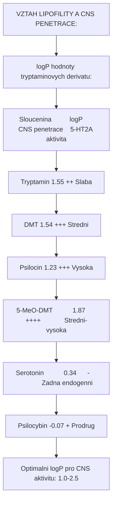
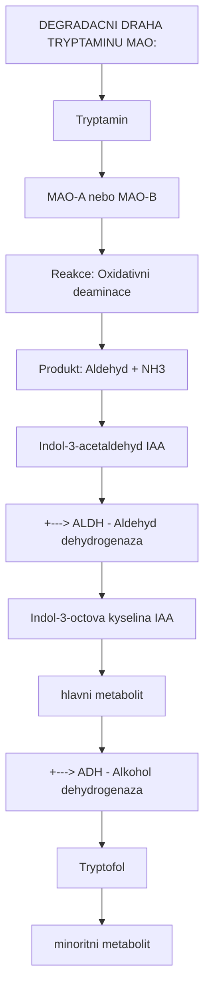
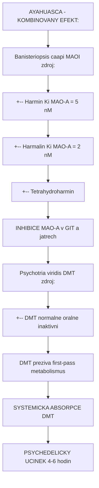
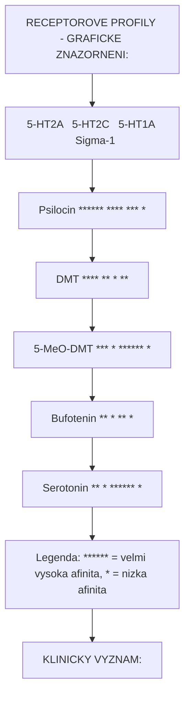

+++
title = "Tryptamin"
description = "Tryptaminy - zakladni struktura psychedelickych alkaloidu, indolovy kruh, biosynteza z tryptofanu, SAR a metabolismus"
weight = 3
insert_anchor_links = "right"
+++

# Tryptamin - Zakladni struktura psychedelickych alkaloidu

**Tryptamin** je bicyklicka indolova sloucenina tvorici strukturni zaklad jedne z nejvyznamnejsich trid psychoaktivnich latek. Tato molekularni kostra je sdilena [DMT](@/alkaloids/dmt.md), [psilocybinem](@/alkaloids/psilocybin.md), [psilocinem](@/alkaloids/psilocin.md), serotoninem a dalsimi neurochemicky aktivnimi sloucenininami. Pochopeni tryptaminove struktury je klicove pro porozumeni mechanismum ucinku psychedelik.

---

## Chemicka struktura

### Zakladni parametry

| Vlastnost | Hodnota |
|-----------|---------|
| **Chemicky nazev** | 2-(1H-indol-3-yl)ethanamin |
| **Alternativni nazvy** | 3-(2-aminoethyl)indol, Indol-3-ethanamin |
| **Molekularni vzorec** | C10H12N2 |
| **Molekularni hmotnost** | 160,22 g/mol |
| **CAS cislo** | 61-54-1 |
| **IUPAC** | 2-(1H-indol-3-yl)ethan-1-amin |
| **PubChem CID** | 1150 |
| **SMILES** | NCCc1c[nH]c2ccccc12 |
| **InChI Key** | APJYDQYYACXCRM-UHFFFAOYSA-N |

### Tryptaminova kostra (scaffold)

```
Tryptamin - bazova struktura:

           [7]    [6]
             \   /
         [7a]-C=C-[5]
            /     \
       [3a]-C     C-[4]
            \\   //
         [3]-C-C-[2]
              |
             CH2
              |       ETHYLAMINOVY
             CH2      RETEZEC
              |
             NH2

Pozice:
1   = Pyrolovy dusik (NH)
2   = Indolovy C-2
3   = Indolovy C-3 (misto pripojeni ethylaminu)
3a  = Spojovaci uhlík
4   = Benzenovy kruh (substituce pro 4-HO derivaty)
5   = Benzenovy kruh (substituce pro 5-MeO derivaty)
6-7 = Benzenovy kruh
7a  = Spojovaci uhlik
```

### Indolovy system

Indol je bicyklicky heterocyklicky aromaticky system skladajici se z:

1. **Benzenovy kruh** (sesticky, pozice 4-7)
2. **Pyrolovy kruh** (peticlenný s dusikem, pozice 1-3)

```
INDOLOVY KRUH:

        6         5
         \       /
          C=====C
         /       \
        7         4
        |         |
        C         C
       / \       / \
      8   N-----C   3
      |   |     |
      7a  1     3a
          H
         (NH)

Vlastnosti:
- 10 pi elektronu (aromaticky system)
- Planarni geometrie
- Elektronove bohaty (nukleofilni)
- Stabilni pri fiziologickem pH
```

### Srovnani se serotoninem

```
Serotonin (5-HT):         HO-[Indol]-CH2-CH2-NH2
                              |5
                              hydroxyl na pozici 5

Tryptamin:                    [Indol]-CH2-CH2-NH2
                              |
                              zadna substituce

Klicovy rozdil:
- Serotonin ma hydroxylovou skupinu na pozici 5 benzenoveho kruhu
- Tryptamin je nesubstituovana bazova struktura
- Oba jsou endogenni v lidskem tele
```

---

## Fyzikalne-chemicke vlastnosti

### Zakladni charakteristika

| Vlastnost | Hodnota |
|-----------|---------|
| **Teplota tani** | 113-116 C |
| **Teplota varu** | 137 C (pri 0,4 mmHg) |
| **Barva** | Bila az svetle bezova (krystalicka) |
| **Skupenstvi** | Pevna latka |
| **pKa** | 10,2 (aminoskupina) |
| **logP** | 1,55 (mirne lipofilni) |
| **Rozpustnost ve vode** | Dobre rozpustny (jako sul) |
| **Rozpustnost v org. rozpoustedlech** | Dobra (volna baze) |

### Acidobazicke vlastnosti

```
pH-zavislost ionizace:

pH < 8:   Protonizovany amin (R-NH3+)
          - Dobre rozpustny ve vode
          - Neschopen prostoupit HEB

pH > 10:  Volna baze (R-NH2)
          - Lipofilni
          - Prostupuje membrany

Fyziologicke pH (7,4):
- Cca 99% v protonizovane forme
- Transport do mozku vyzaduje specialni mechanismy
```

### Stabilita

| Podminky | Stabilita | Poznamka |
|----------|-----------|----------|
| **Vzduch** | Stredni | Pomala oxidace |
| **Svetlo** | Citlivy | UV degradace |
| **Teplo** | Stabilni do 150 C | Termodecompozice pri vyssich teplotach |
| **Kyselé pH** | Stabilni | Protonizovana forma |
| **Bazicke pH** | Mene stabilni | Oxidace urychlena |

---

## Substituovane tryptaminy - Hlavni derivaty

### Klasifikace podle pozice substituce

```
POZICE SUBSTITUCE NA TRYPTAMINOVE KOSTRE:

        [6]     [5] <- 5-substituce (5-MeO, 5-HO)
          \     /
           C===C
          /     \
        [7]     [4] <- 4-substituce (4-HO, 4-PO)
         |       |
         C       C
        / \     / \
       -   N---C   - <- pozice 3 (ethylamin)
           |       |
           H      CH2
                   |
                  CH2
                   |
                  N  <- N-substituce (N,N-dimethyl, N,N-diethyl)
                 / \
               R1   R2
```

### Prehled klicovych substituovaných tryptaminu

| Sloucenina | Struktura | R1 | R2 | 4-pozice | 5-pozice | Aktivita |
|------------|-----------|----|----|----------|----------|----------|
| **Tryptamin** | Bazova | H | H | H | H | Endogenni, slaba |
| **Serotonin** | 5-HT | H | H | H | OH | Endogenni NT |
| [**DMT**](@/alkaloids/dmt.md) | N,N-DMT | CH3 | CH3 | H | H | Silna psychedelicka |
| [**Psilocin**](@/alkaloids/psilocin.md) | 4-HO-DMT | CH3 | CH3 | OH | H | Silna psychedelicka |
| [**Psilocybin**](@/alkaloids/psilocybin.md) | 4-PO-DMT | CH3 | CH3 | OPO3H2 | H | Prodrug psilocinu |
| **5-MeO-DMT** | 5-MeO-DMT | CH3 | CH3 | H | OCH3 | Velmi silna |
| **Bufotenin** | 5-HO-DMT | CH3 | CH3 | H | OH | Slaba-stredni |
| **Baeocystin** | 4-PO-NMT | CH3 | H | OPO3H2 | H | Slaba |
| **NMT** | N-methyltryptamin | CH3 | H | H | H | Slaba |
| **DET** | N,N-diethyltryptamin | C2H5 | C2H5 | H | H | Stredni |
| **DPT** | N,N-dipropyltryptamin | C3H7 | C3H7 | H | H | Stredni-silna |
| **5-MeO-MIPT** | 5-MeO-MIPT | CH3 | iPr | H | OCH3 | Silna |

### Detailni profily hlavnich derivatu

#### DMT (N,N-Dimethyltryptamin)

| Vlastnost | Hodnota |
|-----------|---------|
| **Molekularni vzorec** | C12H16N2 |
| **MW** | 188,27 g/mol |
| **Substituce** | N,N-dimethyl |
| **5-HT2A Ki** | 75-130 nM |
| **Endogenni** | Ano |
| **Trvani** | 15-60 min (inhalace) |
| **Reference** | [DMT](@/alkaloids/dmt.md) |

#### Psilocybin / Psilocin

| Vlastnost | Psilocybin | Psilocin |
|-----------|------------|----------|
| **Molekularni vzorec** | C12H17N2O4P | C12H16N2O |
| **MW** | 284,25 g/mol | 204,27 g/mol |
| **Substituce** | 4-fosforyloxy, N,N-dimethyl | 4-hydroxy, N,N-dimethyl |
| **5-HT2A Ki** | N/A (prodrug) | 6-20 nM |
| **Aktivita** | Prodrug | Primo aktivni |
| **Trvani** | 4-6 hodin | 4-6 hodin |
| **Reference** | [Psilocybin](@/alkaloids/psilocybin.md) | [Psilocin](@/alkaloids/psilocin.md) |

#### 5-MeO-DMT

| Vlastnost | Hodnota |
|-----------|---------|
| **Molekularni vzorec** | C13H18N2O |
| **MW** | 218,30 g/mol |
| **Substituce** | 5-methoxy, N,N-dimethyl |
| **5-HT2A Ki** | 100-200 nM |
| **5-HT1A Ki** | 3-30 nM |
| **Charakteristika** | Vysoka 5-HT1A aktivita |
| **Trvani** | 20-60 min (inhalace) |
| **Zdroj** | Bufo alvarius, rostliny |

---

## Biosynteza z tryptofanu

### Kompletni biosynteticka draha

Tryptaminy jsou syntetizovany z esencialni aminokyseliny L-tryptofanu:

```mermaid
flowchart TD
    node_LTRYPTOFANesencialni["L-TRYPTOFAN esencialni aminokyselina"]
    node_Krok1AADCAromatickaa["Krok 1: AADC - Aromaticka aminokyselina dekarboxylaza"]
    node_KofaktorPyridoxal5fo["Kofaktor: Pyridoxal-5'-fosfat PLP, vitamin B6"]
    node_ReakceDekarboxylacea["Reakce: Dekarboxylace alfa-aminoskupiny"]
    node_ProduktCO2Tryptamin["Produkt: CO2 + Tryptamin"]
    node_TRYPTAMIN["TRYPTAMIN"]
    node_Krok2aINMTIndolethyl["Krok 2a: INMT - Indolethylamin-N-methyltransferaza"]
    node_KofaktorSadenosylmet["Kofaktor: S-adenosylmethionin SAM"]
    node_ReakceNmethylace["Reakce: N-methylace"]
    node_NMETHYLTRYPTAMINNMT["N-METHYLTRYPTAMIN NMT"]
    node_Krok2bINMTdruhamethy["Krok 2b: INMT - druha methylace"]
    node_KofaktorSAM["Kofaktor: SAM"]
    node_NNDIMETHYLTRYPTAMIND["N,N-DIMETHYLTRYPTAMIN DMT"]
    node_Krok3alternativniHyd["Krok 3 alternativni: Hydroxylazy"]
    node_4Hydroxylaza4HODMTPs["+---&gt; 4-Hydroxylaza ---&gt; 4-HO-DMT Psilocin"]
    node_5Hydroxylaza5HODMTBu["+---&gt; 5-Hydroxylaza ---&gt; 5-HO-DMT Bufotenin"]

    node_LTRYPTOFANesencialni --> node_Krok1AADCAromatickaa
    node_Krok1AADCAromatickaa --> node_KofaktorPyridoxal5fo
    node_KofaktorPyridoxal5fo --> node_ReakceDekarboxylacea
    node_ReakceDekarboxylacea --> node_ProduktCO2Tryptamin
    node_ProduktCO2Tryptamin --> node_TRYPTAMIN
    node_TRYPTAMIN --> node_Krok2aINMTIndolethyl
    node_Krok2aINMTIndolethyl --> node_KofaktorSadenosylmet
    node_KofaktorSadenosylmet --> node_ReakceNmethylace
    node_ReakceNmethylace --> node_NMETHYLTRYPTAMINNMT
    node_NMETHYLTRYPTAMINNMT --> node_Krok2bINMTdruhamethy
    node_Krok2bINMTdruhamethy --> node_KofaktorSAM
    node_KofaktorSAM --> node_NNDIMETHYLTRYPTAMIND
    node_NNDIMETHYLTRYPTAMIND --> node_Krok3alternativniHyd
    node_Krok3alternativniHyd --> node_4Hydroxylaza4HODMTPs
    node_4Hydroxylaza4HODMTPs --> node_5Hydroxylaza5HODMTBu

    click node_NNDIMETHYLTRYPTAMIND "/alkaloids/dmt/" "N,N-DIMETHYLTRYPTAMIN DMT"
    click node_4Hydroxylaza4HODMTPs "/alkaloids/dmt/" "+---> 4-Hydroxylaza ---> 4-HO-DMT Psilocin"
    click node_5Hydroxylaza5HODMTBu "/alkaloids/dmt/" "+---> 5-Hydroxylaza ---> 5-HO-DMT Bufotenin"
```



<details>
<summary>ASCII verze diagramu</summary>

```
L-TRYPTOFAN (esencialni aminokyselina)
    |
    | Krok 1: [AADC - Aromaticka aminokyselina dekarboxylaza]
    |         Kofaktor: Pyridoxal-5'-fosfat (PLP, vitamin B6)
    |         Reakce: Dekarboxylace alfa-aminoskupiny
    |         Produkt: CO2 + Tryptamin
    v
TRYPTAMIN
    |
    | Krok 2a: [INMT - Indolethylamin-N-methyltransferaza]
    |          Kofaktor: S-adenosylmethionin (SAM)
    |          Reakce: N-methylace
    v
N-METHYLTRYPTAMIN (NMT)
    |
    | Krok 2b: [INMT] - druha methylace
    |          Kofaktor: SAM
    v
N,N-DIMETHYLTRYPTAMIN (DMT)
    |
    | Krok 3 (alternativni): [Hydroxylazy]
    |
    +---> [4-Hydroxylaza] ---> 4-HO-DMT (Psilocin)
    |
    +---> [5-Hydroxylaza] ---> 5-HO-DMT (Bufotenin)
```

</details>

### Enzymy biosyntesy

| Enzym | Gen | Reakce | Kofaktor | EC cislo | Lokalizace |
|-------|-----|--------|----------|----------|------------|
| **AADC** | DDC | Dekarboxylace | PLP (B6) | 4.1.1.28 | Neuronova cytoplasma |
| **INMT** | INMT | N-methylace | SAM | 2.1.1.49 | Plice, mozek, ledviny |
| **TPH** | TPH1/TPH2 | Hydroxylace | O2, BH4 | 1.14.16.4 | CNS, periferie |

### Biosynteticka draha v houbach (Psilocybe)

```
L-TRYPTOFAN
    |
    v [PsiD - Tryptofan dekarboxylaza]
    |   Kofaktor: PLP
    v
TRYPTAMIN
    |
    v [PsiH - Tryptamin 4-hydroxylaza]
    |   Kofaktor: O2, NADPH
    v
4-HYDROXYTRYPTAMIN
    |
    v [PsiK - 4-HT kinaza]
    |   Kofaktor: ATP
    v
NORBAEOCYSTIN (4-fosforyloxytryptamin)
    |
    v [PsiM - N-methyltransferaza]
    |   Kofaktor: SAM (1. methylace)
    v
BAEOCYSTIN (4-fosforyloxy-N-methyltryptamin)
    |
    v [PsiM]
    |   Kofaktor: SAM (2. methylace)
    v
PSILOCYBIN (4-fosforyloxy-N,N-dimethyltryptamin)
```

### Regulace biosyntesy

| Faktor | Vliv na biosyntézu | Mechanismus |
|--------|---------------------|-------------|
| **Dostupnost tryptofanu** | Limitujici | Esencialni prekurzor |
| **Vitamin B6 status** | Kriticky | AADC kofaktor |
| **SAM dostupnost** | Dulezita | Donor methylu pro INMT |
| **Genova exprese** | Determinujici | INMT, TPH regulace |
| **Stres** | Zvysuje | INMT upregulace pri hypoxii |

---

## Struktura-aktivitni vztahy (SAR)

### Klicove strukturni elementy

```
STRUKTURNI DETERMINANTY AKTIVITY:

           [6]     [5] <- POZICE 5: Methoxy zvysuje 5-HT1A aktivitu
             \     /               Hydroxy (5-HT) = endogenni
              C===C
             /     \
           [7]     [4] <- POZICE 4: Hydroxy = vysoka 5-HT2A aktivita
            |       |               Fosforyl = prodrug (stabilni)
            C       C
           / \     / \
          -   N---C   -
              |       |
              H      CH2
                      |
                     CH2
                      |
                     N  <- N-SUBSTITUCE: Dimethyl optimalni
                    / \   Bez substituce = nizka aktivita
                  R1   R2
```

### SAR pravidla pro 5-HT2A aktivitu

| Strukturni modifikace | Vliv na 5-HT2A aktivitu | Priklad |
|-----------------------|-------------------------|---------|
| **4-OH substituce** | Vyrazne zvysuje | Psilocin (Ki 6-15 nM) |
| **4-OPO3H2 substituce** | Prodrug (po konverzi aktivni) | Psilocybin |
| **5-MeO substituce** | Mirne zvysuje | 5-MeO-DMT (Ki 100-200 nM) |
| **5-OH substituce** | Mirne snizuje | Bufotenin (slaba aktivita) |
| **N,N-dimethyl** | Optimalni | DMT, Psilocin |
| **N,N-diethyl** | Snizuje | DET (nizsi potence) |
| **N-monomethyl** | Vyrazne snizuje | NMT (minimalni aktivita) |
| **Zadna N-substituce** | Inaktivni na 5-HT2A | Tryptamin, serotonin |

### Lipofilita a pruchod HEB



<details>
<summary>ASCII verze diagramu</summary>

```
VZTAH LIPOFILITY A CNS PENETRACE:

logP hodnoty tryptaminovych derivatu:

Sloucenina          logP      CNS penetrace    5-HT2A aktivita
----------------------------------------------------------------
Tryptamin           1.55      ++               Slaba
DMT                 1.54      +++              Stredni
Psilocin            1.23      +++              Vysoka
5-MeO-DMT           1.87      ++++             Stredni-vysoka
Serotonin           0.34      -                Zadna (endogenni)
Psilocybin          -0.07     +                Prodrug

Optimalni logP pro CNS aktivitu: 1.0-2.5
```

</details>

### Konformacni faktory

| Konformace | Preference | Relevance |
|------------|------------|-----------|
| **Extended** | Roztok | Dominantni v biologickych tekutinach |
| **Folded** | Receptor | Preferovana pri vazbe na 5-HT2A |
| **Planari indol** | Vzdy | Aromaticky system vyzaduje |

---

## Metabolismus tryptaminu - MAO degradace

### Monoaminoxidazova (MAO) degradace

MAO je hlavni enzym zodpovedny za degradaci tryptaminovych derivatu:



<details>
<summary>ASCII verze diagramu</summary>

```
DEGRADACNI DRAHA TRYPTAMINU (MAO):

Tryptamin
    |
    v [MAO-A nebo MAO-B]
    |   Reakce: Oxidativni deaminace
    |   Produkt: Aldehyd + NH3
    v
Indol-3-acetaldehyd (IAA)
    |
    +---> [ALDH - Aldehyd dehydrogenaza]
    |           |
    |           v
    |     Indol-3-octova kyselina (IAA)
    |     (hlavni metabolit)
    |
    +---> [ADH - Alkohol dehydrogenaza]
                |
                v
          Tryptofol
          (minoritni metabolit)
```

</details>

### MAO izoformy a preference

| Izoforma | Lokalizace | Preference pro tryptaminy | Inhibitory |
|----------|------------|---------------------------|------------|
| **MAO-A** | CNS, jatra, GIT | Vysoka | Moclobemid, harmin |
| **MAO-B** | CNS (astrocyty), krevni desticky | Nizsi | Selegilin, rasagilin |

### Kinetika MAO-A pro tryptaminy

| Substrat | Km (uM) | Vmax (nmol/min/mg) | Relativni rychlost |
|----------|---------|---------------------|-------------------|
| Tryptamin | 15 | 2.5 | Vysoka |
| DMT | 14 | 2.3 | Vysoka |
| 5-MeO-DMT | 12 | 2.1 | Vysoka |
| Serotonin | 180 | 1.8 | Stredni |

### Strategie obejiti MAO degradace

| Strategie | Mechanismus | Priklad | Vysledek |
|-----------|-------------|---------|----------|
| **MAOI (ireverzibilni)** | Trvala inhibice MAO | Fenelzin | Nebezpecne interakce |
| **RIMA (reverzibilni)** | Kompetitivni inhibice MAO-A | Moclobemid, harmin | Kontrolovana potenciace |
| **Harmala alkaloidy** | Prirodni RIMA | Ayahuasca (harmalin) | Oralni aktivita DMT |
| **Strukturni modifikace** | MAO-rezistentni substituenty | 5-MeO-DIPT | Prodlouzene trvani |
| **Alternativni cesta podani** | Obejiti first-pass | Inhalace, sublingualni | Rychly nastup |

### Ayahuasca - priklad MAO inhibice



<details>
<summary>ASCII verze diagramu</summary>

```
AYAHUASCA - KOMBINOVANY EFEKT:

Banisteriopsis caapi (MAOI zdroj):
    |
    +-- Harmin (Ki MAO-A = 5 nM)
    +-- Harmalin (Ki MAO-A = 2 nM)
    +-- Tetrahydroharmin
    |
    v
INHIBICE MAO-A v GIT a jatrech
    |
    v
Psychotria viridis (DMT zdroj):
    |
    +-- DMT (normalne oralne inaktivni)
    |
    v
DMT preziva first-pass metabolismus
    |
    v
SYSTEMICKA ABSORPCE DMT
    |
    v
PSYCHEDELICKY UCINEK (4-6 hodin)
```

</details>

---

## Receptorove vazebne profily

### Srovnani afinity tryptaminovych derivatu

| Sloucenina | 5-HT2A Ki (nM) | 5-HT2C Ki (nM) | 5-HT1A Ki (nM) | D2 Ki (nM) | Sigma-1 Ki (nM) |
|------------|----------------|----------------|----------------|------------|-----------------|
| **Serotonin** | 300-500 | 700 | 3-5 | >10000 | >10000 |
| **Tryptamin** | >10000 | >10000 | >10000 | >10000 | >10000 |
| [**DMT**](@/alkaloids/dmt.md) | 75-130 | 360 | 750 | >10000 | 14750 |
| [**Psilocin**](@/alkaloids/psilocin.md) | 6-15 | 10-20 | 50-100 | >10000 | >1000 |
| **5-MeO-DMT** | 100-200 | 600 | 3-30 | >10000 | >10000 |
| **Bufotenin** | 500-1000 | 800 | 500 | >10000 | >10000 |
| **DET** | 150-300 | 400 | 1000 | >10000 | >10000 |
| **DPT** | 80-150 | 200 | 500 | >10000 | >10000 |

### Receptorova selektivita



<details>
<summary>ASCII verze diagramu</summary>

```
RECEPTOROVE PROFILY - GRAFICKE ZNAZORNENI:

                5-HT2A   5-HT2C   5-HT1A   Sigma-1
                ------   ------   ------   -------
Psilocin        ******   ****     ***      *
DMT             ****     **       *        **
5-MeO-DMT       ***      *        ******   *
Bufotenin       **       *        **       *
Serotonin       **       *        ******   *

Legenda: ****** = velmi vysoka afinita, * = nizka afinita

KLINICKY VYZNAM:
- Vysoka 5-HT2A afinita = psychedelicky ucinek
- Vysoka 5-HT1A afinita = anxiolyticka/sedativni modulace
- Sigma-1 aktivita = neuroprotektivni potencial
```

</details>

---

## Endogenni tryptaminy v lidskem tele

### Vyskyt a funkce

| Sloucenina | Tkane | Koncentrace | Funkce |
|------------|-------|-------------|--------|
| **Tryptamin** | CNS, GIT | ng/g | Trace amin, TAAR1 ligand |
| **Serotonin** | CNS, enterochromafin | ug/g | Hlavni neurotransmiter |
| **Melatonin** | Epifyza | pg/mL (noc) | Cirkadianni regulace |
| **DMT** | CNS, plice, ledviny | pg/g | Neznama, spekulativni |
| **5-MeO-DMT** | CNS (?) | Stopy | Nepotvrzeno |

### Endogenni DMT - teorie a evidence

| Aspekt | Evidence | Status |
|--------|----------|--------|
| **Biosynteza** | INMT exprese potvrzena | Potvrzeno |
| **Detekce v mozku** | Barker 2018, Dean 2019 | Potvrzeno (pg/g) |
| **Fyziologicka funkce** | Sigma-1 agonismus | Spekulativni |
| **NDE hypoteza** | Strassman | Nepotvrzeno |
| **Sneni/REM** | Korelace s INMT | Neprime dukazy |

---

## Farmakologicke vlastnosti

### Farmakokinetika tryptaminovych derivatu

| Parametr | Tryptamin | DMT (inh.) | Psilocin (p.o.) | 5-MeO-DMT (inh.) |
|----------|-----------|------------|-----------------|------------------|
| **Tmax** | - | 2-5 min | 60-120 min | 2-5 min |
| **T1/2** | <5 min | 5-15 min | 2.5-3.5 h | 10-20 min |
| **Biodostupnost** | Nizka (MAO) | ~100% (inh.) | 50-60% | ~100% (inh.) |
| **Prostup HEB** | Ano | Ano | Ano | Ano |
| **Hlavni metabolismus** | MAO | MAO | UGT, MAO | MAO |

### Tolerance a krizova tolerance

```
TOLERANCE K TRYPTAMINUM:

Den 1: Plny ucinek (100%)
    |
    v [5-HT2A downregulace]
Den 2: Snizeny ucinek (~70%)
    |
    v
Den 3-4: Minimalni ucinek (~20-30%)
    |
    v
Den 7-14: Obnoveni citlivosti (~100%)

KRIZOVA TOLERANCE:
- Psilocybin <-> LSD <-> Meskalin: ANO
- DMT (bez MAOI): MINIMALNI (kratke trvani)
- 5-MeO-DMT <-> DMT: CASTECNA
```

---

## Terapeuticky potencial

### Klinicke studie s tryptaminy

| Sloucenina | Indikace | Faze | Status | Reference |
|------------|----------|------|--------|-----------|
| **Psilocybin** | TRD | III | Probihajici | COMPASS Pathways |
| **Psilocybin** | MDD | II | Dokoncena | Usona, JHU |
| **Psilocybin** | Zavislosti | II | Probihajici | JHU, NYU |
| **DMT** | TRD | II | Probihajici | Small Pharma |
| **5-MeO-DMT** | TRD | I/II | Rany vyzkum | GH Research |

### Mechanismy terapeutickeho ucinku

| Mechanismus | Popis | Casovy rahec |
|-------------|-------|--------------|
| **5-HT2A agonismus** | Akutni psychedelicky ucinek | Minuty-hodiny |
| **DMN destabilizace** | Narušeni rigidnich vzorcu | Hodiny |
| **Neuroplasticita** | BDNF, synaptogeneze | Dny-tydny |
| **Psychologicky insight** | Kognitivni restrukturace | Tydny-mesice |

---

## Prirodni zdroje tryptaminu

### Rostliny obsahujici tryptaminy

| Rostlina | Hlavni tryptaminy | Cast | Region |
|----------|-------------------|------|--------|
| **Psychotria viridis** | DMT | Listy | Amazonie |
| **Mimosa hostilis** | DMT, NMT | Kura | Brazilie |
| **Acacia confusa** | DMT, NMT | Kura | Asie |
| **Anadenanthera peregrina** | DMT, 5-MeO-DMT, bufotenin | Semena | J. Amerika |
| **Phalaris arundinacea** | DMT, 5-MeO-DMT | Trava | Globalni |
| **Virola spp.** | DMT, 5-MeO-DMT | Kura | Amazonie |

### Houby obsahujici tryptaminy

| Rod | Hlavni tryptaminy | Druhy | Reference |
|-----|-------------------|-------|-----------|
| **Psilocybe** | Psilocybin, psilocin, baeocystin | 200+ | [Psilocybes](@/shrooms/psilocybes/_index.md) |
| **Panaeolus** | Psilocybin, psilocin | 10+ | P. cyanescens |
| **Gymnopilus** | Psilocybin (nizke) | Nekteré | G. spectabilis |
| **Pluteus** | Psilocybin | Nekteré | P. salicinus |
| **Inocybe** | Psilocybin | Vzacne | I. aeruginascens |

### Zvirecti zdroje

| Zivocich | Tryptamin | Tkane | Poznamka |
|----------|-----------|-------|----------|
| **Bufo alvarius** | 5-MeO-DMT, bufotenin | Kozni zlázy | Colorado River |
| **Clovek** | DMT, serotonin, melatonin | CNS, epifyza | Endogenni |

---

## Analyticke metody

### Detekce tryptaminu

| Metoda | LOD | Pouziti | Specificita |
|--------|-----|---------|-------------|
| **LC-MS/MS** | 0,1 ng/mL | Kvantitativni analyza | Velmi vysoka |
| **GC-MS** | 1 ng/mL | Konfirmace | Vysoka |
| **Ehrlichuv test** | Kvalitativni | Terénni test | Nizka (vsechny indoly) |
| **HPLC-UV** | 10 ng/mL | Rutinni analyza | Stredni |
| **Imunochemie (ELISA)** | 25 ng/mL | Screening | Stredni |

### Charakteristicke analyticke parametry

| Sloucenina | MRM prechody (m/z) | Retencni cas (relativni) |
|------------|---------------------|--------------------------|
| Tryptamin | 161->144, 161->117 | 1.0 (reference) |
| DMT | 189->58, 189->144 | 1.2 |
| Psilocin | 205->58, 205->160 | 0.8 |
| 5-MeO-DMT | 219->58, 219->174 | 1.4 |

---

## Pravni status

### Mezinarodni klasifikace

| Jurisdikce | Tryptamin | DMT | Psilocybin/Psilocin | 5-MeO-DMT |
|------------|-----------|-----|---------------------|-----------|
| **OSN** | Neuvedeno | Schedule I | Schedule I | Neuvedeno |
| **USA** | Neregulováno | Schedule I | Schedule I | Schedule I (2011) |
| **EU** | Variabilni | Zakazano | Zakazano | Variabilni |
| **Ceska republika** | Neregulováno | Seznam I | Seznam I | Neregulováno* |

*Poznamka: Legislativa se muze menit

### Ceska republika - detaily

| Sloucenina | Status | Pravni predpis |
|------------|--------|----------------|
| Tryptamin | Neregulováno | - |
| [DMT](@/alkaloids/dmt.md) | Zakazano | NV 463/2013 Sb., Tab. 1 |
| [Psilocybin](@/alkaloids/psilocybin.md) | Zakazano | NV 463/2013 Sb., Tab. 1 |
| [Psilocin](@/alkaloids/psilocin.md) | Zakazano | NV 463/2013 Sb., Tab. 1 |
| 5-MeO-DMT | Seda zona | Explicitne neuvedeno |

---

## Reference

### Zakladni literatura

1. Shulgin, A. & Shulgin, A. (1997). *TiHKAL: Tryptamines I Have Known and Loved*. Transform Press.

2. Nichols, D.E. (2016). Psychedelics. *Pharmacological Reviews* 68(2): 264-355.

3. Barker, S.A. (2018). N,N-Dimethyltryptamine (DMT), an Endogenous Hallucinogen. *International Review of Neurobiology* 142: 77-121.

4. Carbonaro, T.M. & Gatch, M.B. (2016). Neuropharmacology of N,N-Dimethyltryptamine. *Brain Research Bulletin* 126: 74-88.

### Biosynteza a enzymologie

5. Fricke, J., Blei, F. & Hoffmeister, D. (2017). Enzymatic synthesis of psilocybin. *Angewandte Chemie* 56(40): 12352-12355.

6. Dean, J.G. et al. (2019). Biosynthesis and Extracellular Concentrations of N,N-dimethyltryptamine (DMT) in Mammalian Brain. *Scientific Reports* 9: 9333.

### Farmakologie a receptory

7. Ray, T.S. (2010). Psychedelics and the Human Receptorome. *PLoS ONE* 5(2): e9019.

8. Roth, B.L. et al. (2002). Salvinorin A: A potent naturally occurring nonnitrogenous kappa opioid selective agonist. *PNAS* 99(18): 11934-11939.

### Klinicke studie

9. Carhart-Harris, R.L. et al. (2021). Trial of psilocybin versus escitalopram for depression. *NEJM* 384(15): 1402-1411.

10. Davis, A.K. et al. (2020). Survey of entity encounter experiences occasioned by inhaled N,N-dimethyltryptamine. *Journal of Psychopharmacology* 34(9): 1008-1020.

---

## Viz take

### Hlavni tryptaminove alkaloidy

- [DMT](@/alkaloids/dmt.md) - N,N-Dimethyltryptamin
- [Psilocybin](@/alkaloids/psilocybin.md) - 4-fosforyloxy-DMT
- [Psilocin](@/alkaloids/psilocin.md) - 4-hydroxy-DMT
- [Baeocystin](@/alkaloids/baeocystin.md) - 4-fosforyloxy-NMT

### Receptory

- [5-HT2A receptor](@/receptors/5-ht2a.md) - Hlavni cil psychedelik
- [5-HT1A receptor](@/receptors/5-ht1a.md) - Sekundarni cil
- [Receptor](@/glossary/receptor.md) - Obecny pojem

### Zdroje

- [Psilocybe houby](@/shrooms/psilocybes/_index.md) - Hlavni zdroj psilocybinu
- [Alkaloidy](@/alkaloids/_index.md) - Prehled psychoaktivnich alkaloidu

### Souvisejici pojmy

- [GABA](@/glossary/gaba.md) - Inhibicni neurotransmiter
- [Nukleotid](@/glossary/nukleotid.md) - Signalni molekuly

---

<- Zpet na [Glosar](@/glossary/_index.md)

---

*Posledni aktualizace: 2026-01-30*
