+++
title = "Uceni"
description = "Proces osvojovani novych znalosti a dovednosti - synapticka plasticita, LTP/LTD, konsolidace pameti"
weight = 5
insert_anchor_links = "right"

[taxonomies]
kategorie = ["neuroveda", "kognitivni-veda", "fyziologie"]
systemy = ["glutamatergni", "limbicky-system", "hipokampus"]
souvisejici_latky = ["psilocybin", "LSD", "ketamin", "BDNF"]
+++

# Uceni - Neurobiologie osvojovani znalosti

**Uceni** je fundamentalni proces, kterym nervovy system ziskava, zpracovava a uchovava informace z prostredi. Na molekularni a bunecne urovni je uceni zakotveno v **synapticke plasticite** - schopnosti synaptickych spojeni menit svou silu a efektivitu v zavislosti na aktivite. Psychoaktivni latky, predevsim [psychedelika](@/glossary/psychedelikum.md), mohou dramaticky ovlivnit procesy uceni prostrednictvim modulace [neuroplasticity](@/glossary/neuroplasticita.md).

---

## Zakladni definice

### Co je uceni?

| Aspekt | Popis |
|--------|-------|
| **Definice** | Relativne trvala zmena v chovani nebo mentalnim stavu zpusobena zkusenosti |
| **Neurobiologicky zaklad** | Zmeny v synaptickych spojenich a neuronovych okruzich |
| **Casovy ramec** | Sekundy (senzoricky buffer) az desetileti (semanticka pamet) |
| **Evolucni funkce** | Adaptace na mene se prostredi, zvyseni psi |
| **Univerzalita** | Pritomno u vsech zivocichu s nervovym systemem |

### Typy uceni

| Typ | Popis | Priklad |
|-----|-------|---------|
| **Habituace** | Snizeni odpovedi na opakovanou stimulaci | Ignorovani tikotu hodin |
| **Senzitizace** | Zvyseni odpovedi na intenzivni stimul | Hypervigilance po traumatu |
| **Klasicke podminovani** | Asociace dvou podnetu (Pavlov) | Slineni psa pri zvoneni |
| **Operantni podminovani** | Uceni z nasledku chovani | Stlaceni paky pro potravu |
| **Prostorove uceni** | Navigace a orientace | Pameti na mista |
| **Proceduralni uceni** | Motoricke dovednosti | Jizda na kole |
| **Deklarativni uceni** | Fakta a udalosti | Uceni se slovicek |
| **Socialni uceni** | Uceni pozorovanim druhych | Napodobovani rodicu |

---

## Synapticka plasticita

### Hebbovsky princip

Donald Hebb (1949) formuloval zakladni princip uceni:

> "Neurony, ktere spolu vysílají, se spolu propojí."
> (Neurons that fire together, wire together.)

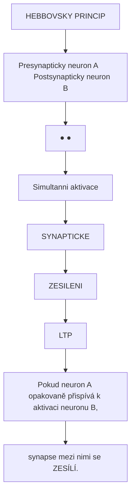

<details>
<summary>ASCII verze diagramu</summary>

```
            HEBBOVSKY PRINCIP

    Presynapticky neuron A              Postsynapticky neuron B
           ●                                    ●
           │                                    │
           │  Simultanni aktivace               │
           │  ════════════════════►             │
           │                                    │
           └────────────────────────────────────┘
                         │
                         ▼
              ┌──────────────────────┐
              │   SYNAPTICKE         │
              │   ZESILENI           │
              │   (LTP)              │
              └──────────────────────┘

    Pokud neuron A opakovaně přispívá k aktivaci neuronu B,
    synapse mezi nimi se ZESÍLÍ.
```

</details>

### Dlouhodoba potenciace (LTP)

LTP je klicovy mechanismus uceni, poprvé popsany Blissem a Loemo (1973).

```mermaid
flowchart TD
    node_LTPDLOUHODOBAPOTENCI["LTP - DLOUHODOBA POTENCIACE"]
    node_INDUKCEvysokofrekven["INDUKCE vysokofrekvencni stimulace:"]
    node_Presynaptickyneuron["Presynapticky neuron"]
    node_GLUTAMATuvolneni["GLUTAMAT uvolneni"]
    node_AMPANMDA["AMPA               NMDA"]
    node_receptorreceptor["receptor           receptor"]
    node_NainfluxMg2blok["Na+ influx            Mg2+ blok"]
    node_depolarizacepriklidp["depolarizace        pri klid. pot."]
    node_Depolarizaceodstrani["Depolarizace odstrani Mg2+ blok"]
    node_Ca2INFLUX["Ca2+ INFLUX"]
    node_presNMDA["pres NMDA"]
    node_CaMKIIPKCSrckinza["CaMKII      PKC           Src kináza"]
    node_FOSFORYLACEAMPArecep["FOSFORYLACE AMPA receptoru"]
    node_INZERCEnovychAMPArec["INZERCE novych AMPA recept."]
    node_ZESLENSYNAPSE["ZESÍLENÁ SYNAPSE"]
    node_LTP["LTP"]

    node_LTPDLOUHODOBAPOTENCI --> node_INDUKCEvysokofrekven
    node_INDUKCEvysokofrekven --> node_Presynaptickyneuron
    node_Presynaptickyneuron --> node_GLUTAMATuvolneni
    node_GLUTAMATuvolneni --> node_AMPANMDA
    node_AMPANMDA --> node_receptorreceptor
    node_receptorreceptor --> node_NainfluxMg2blok
    node_NainfluxMg2blok --> node_depolarizacepriklidp
    node_depolarizacepriklidp --> node_Depolarizaceodstrani
    node_Depolarizaceodstrani --> node_Ca2INFLUX
    node_Ca2INFLUX --> node_presNMDA
    node_presNMDA --> node_CaMKIIPKCSrckinza
    node_CaMKIIPKCSrckinza --> node_FOSFORYLACEAMPArecep
    node_FOSFORYLACEAMPArecep --> node_INZERCEnovychAMPArec
    node_INZERCEnovychAMPArec --> node_ZESLENSYNAPSE
    node_ZESLENSYNAPSE --> node_LTP

    click node_GLUTAMATuvolneni "/glossary/glutamat/" "GLUTAMAT uvolneni"
    click node_ZESLENSYNAPSE "/glossary/synapse/" "ZESÍLENÁ SYNAPSE"
```

<details>
<summary>ASCII verze diagramu</summary>

```
            LTP - DLOUHODOBA POTENCIACE

    INDUKCE (vysokofrekvencni stimulace):

    Presynapticky neuron
           │
           ▼
    ┌──────────────────────────────────────────────┐
    │             GLUTAMAT uvolneni                 │
    │                    │                          │
    │         ┌──────────┴──────────┐              │
    │         ↓                     ↓              │
    │    ┌─────────┐          ┌─────────┐          │
    │    │  AMPA   │          │  NMDA   │          │
    │    │receptor │          │receptor │          │
    │    └────┬────┘          └────┬────┘          │
    │         │                    │               │
    │         ↓                    │               │
    │    Na+ influx            Mg2+ blok           │
    │    (depolarizace)        (pri klid. pot.)   │
    │         │                    │               │
    │         └────────┬───────────┘               │
    │                  │                           │
    │    Depolarizace odstrani Mg2+ blok           │
    │                  │                           │
    │                  ▼                           │
    │           Ca2+ INFLUX                        │
    │           (pres NMDA)                        │
    │                  │                           │
    │    ┌─────────────┼─────────────┐             │
    │    ↓             ↓             ↓             │
    │  CaMKII      PKC           Src kináza        │
    │    │             │             │             │
    │    └─────────────┼─────────────┘             │
    │                  │                           │
    │                  ▼                           │
    │    ┌─────────────────────────────┐           │
    │    │ FOSFORYLACE AMPA receptoru  │           │
    │    │ INZERCE novych AMPA recept. │           │
    │    └─────────────────────────────┘           │
    │                  │                           │
    │                  ▼                           │
    │         ZESÍLENÁ SYNAPSE                     │
    │              (LTP)                           │
    └──────────────────────────────────────────────┘
```

</details>

#### Faze LTP

| Faze | Casovy ramec | Mechanismus | Zavislost na proteosynteze |
|------|--------------|-------------|----------------------------|
| **Ranna LTP (E-LTP)** | 30-60 minut | Fosforylace, AMPA trafficking | Ne |
| **Pozdni LTP (L-LTP)** | Hodiny az dny | Genova exprese, nove synapse | Ano |
| **Strukturalni LTP** | Dny az tydny | Nove dendriticke spiny | Ano |

#### NMDA receptor jako "detektor koincidence"

[NMDA receptor](@/receptors/nmda.md) je kriticky pro LTP, protoze vyzaduje soucasne splneni dvou podminek:

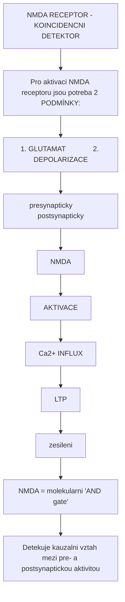

<details>
<summary>ASCII verze diagramu</summary>

```
    NMDA RECEPTOR - KOINCIDENCNI DETEKTOR

    Pro aktivaci NMDA receptoru jsou potreba 2 PODMÍNKY:

    1. GLUTAMAT              2. DEPOLARIZACE
       (presynapticky)          (postsynapticky)
            │                        │
            │                        │
            └──────────┬─────────────┘
                       │
                       ▼
               ┌───────────────┐
               │    NMDA       │
               │   AKTIVACE    │
               └───────┬───────┘
                       │
                       ▼
                 Ca2+ INFLUX
                       │
                       ▼
               ┌───────────────┐
               │     LTP       │
               │  (zesileni)   │
               └───────────────┘

    NMDA = molekularni "AND gate"
    Detekuje kauzalni vztah mezi pre- a postsynaptickou aktivitou
```

</details>

### Dlouhodoba deprese (LTD)

LTD je opak LTP - oslabeni synaptickych spojeni.

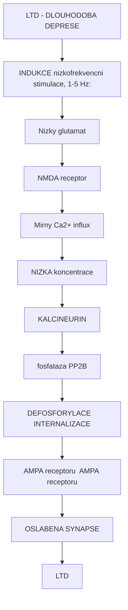

<details>
<summary>ASCII verze diagramu</summary>

```
            LTD - DLOUHODOBA DEPRESE

    INDUKCE (nizkofrekvencni stimulace, 1-5 Hz):

    Nizky glutamat
           │
           ▼
    ┌──────────────────────────────────────────────┐
    │        NMDA receptor                          │
    │             │                                 │
    │             ▼                                 │
    │       Mirny Ca2+ influx                       │
    │       (NIZKA koncentrace)                     │
    │             │                                 │
    │             ▼                                 │
    │       KALCINEURIN                             │
    │       (fosfataza PP2B)                        │
    │             │                                 │
    │    ┌────────┼────────┐                        │
    │    ↓                 ↓                        │
    │ DEFOSFORYLACE   INTERNALIZACE                 │
    │ AMPA receptoru  AMPA receptoru                │
    │    │                 │                        │
    │    └────────┬────────┘                        │
    │             │                                 │
    │             ▼                                 │
    │     OSLABENA SYNAPSE                          │
    │          (LTD)                                │
    └──────────────────────────────────────────────┘
```

</details>

#### LTP vs LTD: Rozhodujici faktor je KONCENTRACE Ca2+

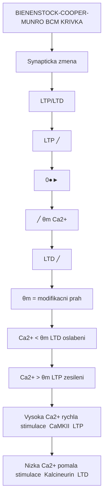

<details>
<summary>ASCII verze diagramu</summary>

```
    BIENENSTOCK-COOPER-MUNRO (BCM) KRIVKA

    Synapticka zmena
    (LTP/LTD)
         │
       LTP│                              ╱
         │                           ╱
         │                       ╱
         0├─────────────────●───────────────────►
         │               ╱      θm         [Ca2+]
       LTD│           ╱
         │       ╱
         │   ╱
         │╱

    θm = modifikacni prah

    [Ca2+] < θm  →  LTD (oslabeni)
    [Ca2+] > θm  →  LTP (zesileni)

    Vysoka Ca2+ (rychla stimulace) → CaMKII → LTP
    Nizka Ca2+ (pomala stimulace) → Kalcineurin → LTD
```

</details>

### Spike-Timing Dependent Plasticity (STDP)

STDP je casove presna forma plasticity:

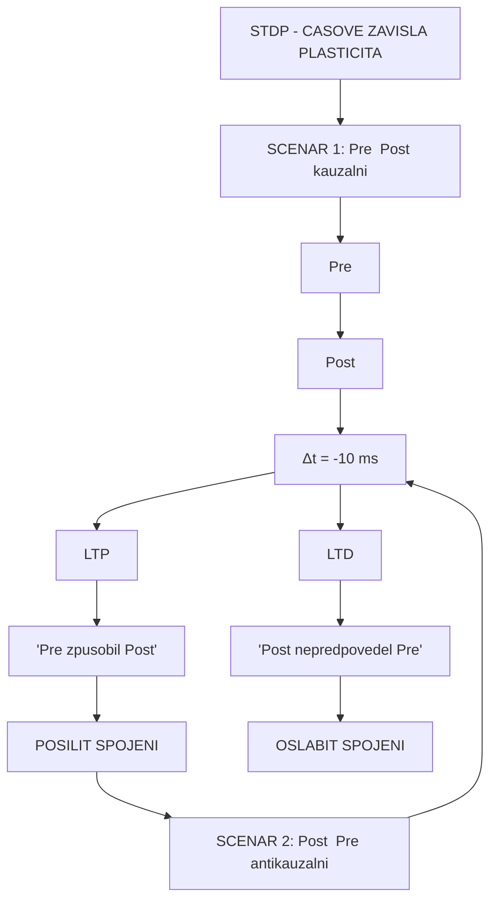

<details>
<summary>ASCII verze diagramu</summary>

```
    STDP - CASOVE ZAVISLA PLASTICITA

    SCENAR 1: Pre → Post (kauzalni)
    ─────────────────────────────────
    Pre  ─────│─────────────────────
              │
    Post ─────│────│────────────────
                   ↑
              Δt = +10 ms
                   │
                   ▼
                  LTP
         "Pre zpusobil Post"
         → POSILIT SPOJENI

    SCENAR 2: Post → Pre (antikauzalni)
    ─────────────────────────────────
    Post ─────│─────────────────────
              │
    Pre  ─────│────│────────────────
                   ↑
              Δt = -10 ms
                   │
                   ▼
                  LTD
         "Post nepredpovedel Pre"
         → OSLABIT SPOJENI
```

</details>

| Casovy interval | Typ zmeny | Interpretace |
|-----------------|-----------|--------------|
| Pre pred Post (0-20 ms) | **LTP** | Kauzalni vztah, posilit |
| Post pred Pre (0-20 ms) | **LTD** | Ne-kauzalni, oslabit |
| >50 ms | Zadna zmena | Nesouvisi |

---

## Konsolidace pameti

### Faze pameti

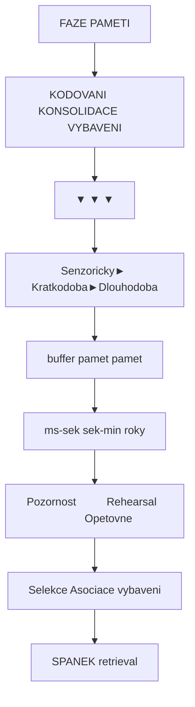

<details>
<summary>ASCII verze diagramu</summary>

```
    FAZE PAMETI

    KODOVANI           KONSOLIDACE           VYBAVENI
        │                   │                    │
        ▼                   ▼                    ▼
    ┌─────────┐       ┌───────────┐        ┌─────────┐
    │Senzoricky│──────►│ Kratkodoba│────────►│Dlouhodoba│
    │ buffer   │       │   pamet   │         │  pamet  │
    │(ms-sek)  │       │ (sek-min) │         │(roky)   │
    └─────────┘       └───────────┘        └─────────┘
         │                  │                    │
         │                  │                    │
    Pozornost          Rehearsal           Opetovne
    Selekce            Asociace            vybaveni
                       SPANEK              (retrieval)
```

</details>

### Systemy pameti

| System | Mozkova oblast | Typ informace | Priklad |
|--------|----------------|---------------|---------|
| **Epizodická** | Hipokampus, MTL | Osobni udalosti | "Co jsem delal vcera" |
| **Semanticka** | Neokortex | Fakta, znalosti | "Praha je hlavni mesto CR" |
| **Proceduralni** | Bazalni ganglia, mozeček | Motoricke dovednosti | Jizda na kole |
| **Pracovni** | Prefrontalni kortex | Docasne drzeni | Zapamatovat si telefonni cislo |
| **Emocionalni** | Amygdala | Emocionalni obsahy | Strach z pavouků |

### Role hipokampu

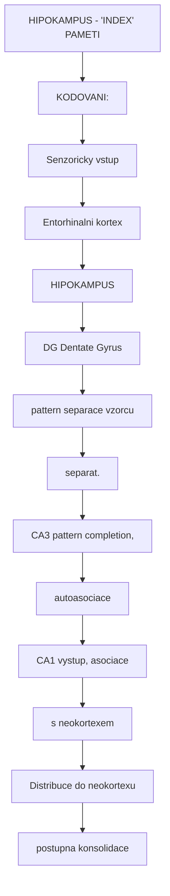

<details>
<summary>ASCII verze diagramu</summary>

```
    HIPOKAMPUS - "INDEX" PAMETI

    KODOVANI:
    ┌──────────────────────────────────────────────────────┐
    │                                                       │
    │   Senzoricky vstup                                   │
    │        │                                             │
    │        ▼                                             │
    │   Entorhinalni kortex                                │
    │        │                                             │
    │        ▼                                             │
    │   ┌─────────────────────────────────────────┐        │
    │   │            HIPOKAMPUS                   │        │
    │   │                                         │        │
    │   │   ┌─────────┐                          │        │
    │   │   │   DG    │ Dentate Gyrus            │        │
    │   │   │ (pattern│ (separace vzorcu)        │        │
    │   │   │ separat.)│                         │        │
    │   │   └────┬────┘                          │        │
    │   │        │                               │        │
    │   │        ▼                               │        │
    │   │   ┌─────────┐                          │        │
    │   │   │  CA3    │ (pattern completion,    │        │
    │   │   │         │  autoasociace)          │        │
    │   │   └────┬────┘                          │        │
    │   │        │                               │        │
    │   │        ▼                               │        │
    │   │   ┌─────────┐                          │        │
    │   │   │  CA1    │ (vystup, asociace       │        │
    │   │   │         │  s neokortexem)         │        │
    │   │   └─────────┘                          │        │
    │   │                                         │        │
    │   └─────────────────────────────────────────┘        │
    │        │                                             │
    │        ▼                                             │
    │   Distribuce do neokortexu                           │
    │   (postupna konsolidace)                             │
    │                                                       │
    └──────────────────────────────────────────────────────┘
```

</details>

### Spanek a konsolidace

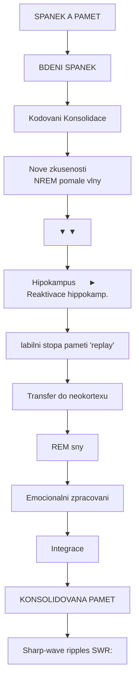

<details>
<summary>ASCII verze diagramu</summary>

```
    SPANEK A PAMET

    BDENI                    SPANEK
    (Kodovani)               (Konsolidace)

    ┌─────────────────┐      ┌─────────────────────────┐
    │                 │      │                         │
    │ Nove zkusenosti │      │  NREM (pomale vlny)     │
    │       │         │      │       │                 │
    │       ▼         │      │       ▼                 │
    │  Hipokampus     │ ───► │  Reaktivace hippokamp.  │
    │  (labilni stopa)│      │  pameti ("replay")      │
    │                 │      │       │                 │
    └─────────────────┘      │       ▼                 │
                             │  Transfer do neokortexu │
                             │       │                 │
                             │       ▼                 │
                             │  REM (sny)              │
                             │  Emocionalni zpracovani │
                             │  Integrace              │
                             │       │                 │
                             │       ▼                 │
                             │  KONSOLIDOVANA PAMET    │
                             │                         │
                             └─────────────────────────┘

    Sharp-wave ripples (SWR):
    - Vysoka frekvence (150-250 Hz)
    - Behem NREM spanku
    - Komprimovane "prehravani" dennich zkusenosti
    - Kritické pro konsolidaci
```

</details>

#### Faze spanku a pamet

| Faze spanku | EEG charakteristika | Funkce pro pamet |
|-------------|---------------------|------------------|
| **NREM 1-2** | Theta, spindly | Zahajeni konsolidace |
| **NREM 3 (SWS)** | Delta (pomale vlny) | Hipokamp-neokort. transfer |
| **REM** | Rychla, nizka amplituda | Emocionalni integrace |

---

## Molekularni mechanismy

### BDNF (Brain-Derived Neurotrophic Factor)

[BDNF](@/glossary/neuroplasticita.md) je klicovy neurotrofni faktor pro uceni:

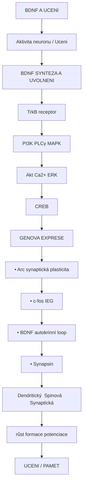

<details>
<summary>ASCII verze diagramu</summary>

```
    BDNF A UCENI

    Aktivita neuronu / Uceni
           │
           ▼
    ┌──────────────────────────────────────────────┐
    │        BDNF SYNTEZA A UVOLNENI               │
    │                    │                          │
    │                    ▼                          │
    │            TrkB receptor                      │
    │                    │                          │
    │         ┌──────────┼──────────┐              │
    │         ↓          ↓          ↓              │
    │       PI3K        PLCγ       MAPK            │
    │         │          │          │              │
    │         ↓          ↓          ↓              │
    │       Akt        Ca2+       ERK              │
    │         │          │          │              │
    │         └──────────┼──────────┘              │
    │                    │                          │
    │                    ▼                          │
    │                  CREB                         │
    │                    │                          │
    │                    ▼                          │
    │    ┌───────────────────────────────┐         │
    │    │   GENOVA EXPRESE              │         │
    │    │   • Arc (synaptická plasticita)│         │
    │    │   • c-fos (IEG)               │         │
    │    │   • BDNF (autokrinní loop)    │         │
    │    │   • Synapsin                   │         │
    │    └───────────────────────────────┘         │
    │                    │                          │
    │         ┌──────────┼──────────┐              │
    │         ↓          ↓          ↓              │
    │    Dendritický  Spinová   Synaptická         │
    │      růst      formace   potenciace          │
    │                    │                          │
    │                    ▼                          │
    │              UCENI / PAMET                    │
    └──────────────────────────────────────────────┘
```

</details>

### CREB - Kriticky transkripční faktor

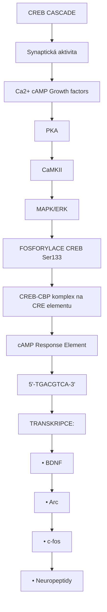

<details>
<summary>ASCII verze diagramu</summary>

```
    CREB CASCADE

    Synaptická aktivita
           │
    ┌──────┼──────┐
    ↓      ↓      ↓
  Ca2+   cAMP   Growth factors
    │      │      │
    └──────┼──────┘
           │
           ▼
    ┌─────────────┐
    │    PKA      │
    │   CaMKII    │
    │   MAPK/ERK  │
    └──────┬──────┘
           │
           ▼
    FOSFORYLACE CREB (Ser133)
           │
           ▼
    ┌─────────────────────────────────────┐
    │   CREB-CBP komplex na CRE elementu  │
    │   (cAMP Response Element)           │
    │                                      │
    │   5'-TGACGTCA-3'                    │
    │        ↓                             │
    │   TRANSKRIPCE:                       │
    │   • BDNF                            │
    │   • Arc                             │
    │   • c-fos                           │
    │   • Neuropeptidy                    │
    └─────────────────────────────────────┘
```

</details>

### Epigeneticka regulace uceni

| Modifikace | Enzym | Efekt na uceni |
|------------|-------|----------------|
| Histonová acetylace | HAT (CBP) | Posiluje (otevření chromatinu) |
| Histonová deacetylace | HDAC | Potlacuje |
| DNA metylace | DNMT | Kontext-závislá |
| Histonová metylace | HMT | H3K4me3 aktivuje, H3K9me3 tlumí |

---

## Psychoaktivni latky a uceni

### Psychedelika a plasticita

[Psychedelika](@/glossary/psychedelikum.md) dramaticky ovlivnují procesy uceni:

```mermaid
flowchart TD
    node_PSYCHEDELIKAAUCENI["PSYCHEDELIKA A UCENI"]
    node_PsilocybinLSDDMT["Psilocybin/LSD/DMT"]
    node_5HT2AAKTIVACE["5-HT2A AKTIVACE"]
    node_VrstvaVpyramidalnine["Vrstva V pyramidalni neurony"]
    node_Gq11arrestinSrc["Gq/11      β-arrestin   Src"]
    node_78cdc4b8["▼                        ▼"]
    node_PLCERK12mTOR["PLC          ERK1/2    mTOR"]
    node_DAGIP3["DAG + IP3"]
    node_PKCProteosyntza["PKC           Proteosyntéza"]
    node_BDNFArc["BDNF, Arc,"]
    node_PSD95["PSD-95"]
    node_Ca2["Ca2+"]
    node_DENDRITICKRST["DENDRITICKÝ RŮST"]
    node_NOVSYNAPSE["NOVÉ SYNAPSE"]
    node_ZVENPLASTICITA["ZVÝŠENÁ PLASTICITA"]
    node_ZESLENUCENI["ZESÍLENÉ UCENI"]
    node_Extinkcestrachu["Extinkce strachu,"]
    node_Novperspektivy["Nové perspektivy"]

    node_PSYCHEDELIKAAUCENI --> node_PsilocybinLSDDMT
    node_PsilocybinLSDDMT --> node_5HT2AAKTIVACE
    node_5HT2AAKTIVACE --> node_VrstvaVpyramidalnine
    node_VrstvaVpyramidalnine --> node_Gq11arrestinSrc
    node_Gq11arrestinSrc --> node_78cdc4b8
    node_78cdc4b8 --> node_PLCERK12mTOR
    node_PLCERK12mTOR --> node_DAGIP3
    node_DAGIP3 --> node_PKCProteosyntza
    node_PKCProteosyntza --> node_BDNFArc
    node_BDNFArc --> node_PSD95
    node_PSD95 --> node_Ca2
    node_Ca2 --> node_DENDRITICKRST
    node_DENDRITICKRST --> node_NOVSYNAPSE
    node_NOVSYNAPSE --> node_ZVENPLASTICITA
    node_ZVENPLASTICITA --> node_ZESLENUCENI
    node_ZESLENUCENI --> node_Extinkcestrachu
    node_Extinkcestrachu --> node_Novperspektivy

    click node_PSYCHEDELIKAAUCENI "/glossary/psychedelikum/" "PSYCHEDELIKA A UCENI"
    click node_PsilocybinLSDDMT "/alkaloids/psilocybin/" "Psilocybin/LSD/DMT"
    click node_BDNFArc "/glossary/neuroplasticita/" "BDNF, Arc,"
    click node_NOVSYNAPSE "/glossary/synapse/" "NOVÉ SYNAPSE"
```

<details>
<summary>ASCII verze diagramu</summary>

```
    PSYCHEDELIKA A UCENI

    [Psilocybin/LSD/DMT]
           │
           ▼
    ┌──────────────────────────────────────────────┐
    │        5-HT2A AKTIVACE                       │
    │        (Vrstva V pyramidalni neurony)        │
    │                    │                          │
    │         ┌──────────┼──────────┐              │
    │         ↓          ↓          ↓              │
    │     Gq/11      β-arrestin   Src              │
    │       │                        │              │
    │       ▼                        ▼              │
    │     PLC          ERK1/2    mTOR              │
    │       │             │        │               │
    │       ↓             └────────┘               │
    │    DAG + IP3            │                    │
    │       │                 ▼                    │
    │       ↓          ┌───────────────┐           │
    │     PKC          │ Proteosyntéza │           │
    │       │          │ BDNF, Arc,    │           │
    │       ↓          │ PSD-95        │           │
    │    Ca2+ ↑        └───────┬───────┘           │
    │                          │                    │
    │                          ▼                    │
    │              ┌─────────────────────┐         │
    │              │ DENDRITICKÝ RŮST    │         │
    │              │ NOVÉ SYNAPSE        │         │
    │              │ ZVÝŠENÁ PLASTICITA  │         │
    │              └─────────────────────┘         │
    │                          │                    │
    │                          ▼                    │
    │              ZESÍLENÉ UCENI                   │
    │              (Extinkce strachu,               │
    │               Nové perspektivy)               │
    └──────────────────────────────────────────────┘
```

</details>

### Efekt ruznych latek na uceni

| Latka | Mechanismus | Efekt na uceni | Klinicky vyznam |
|-------|-------------|----------------|-----------------|
| [**Psilocybin**](@/alkaloids/psilocybin.md) | 5-HT2A agonismus | +++ (plasticita) | Terapie deprese, PTSD |
| [**LSD**](@/alkaloids/lsd.md) | 5-HT2A, D2 | +++ (plasticita) | Psychoterapie |
| **Ketamin** | NMDA antagonismus | ++ (BDNF burst) | Antidepresiva |
| **MDMA** | 5-HT, DA, NE uvolneni | +++ (socialni) | PTSD terapie |
| **Kofein** | Adenosinovy antagonismus | + (pozornost) | Bezne uzivani |
| **Nikotin** | nAChR agonismus | + (krátkodobe) | Kognice (akutne) |
| **Alkohol** | GABA-A, NMDA | --- (anterográdní amnézie) | Uceni naruseno |
| **Benzodiazepiny** | GABA-A | --- (amnézie) | Kontraind. pro uceni |

### Kriticka obdobi a psychedelika

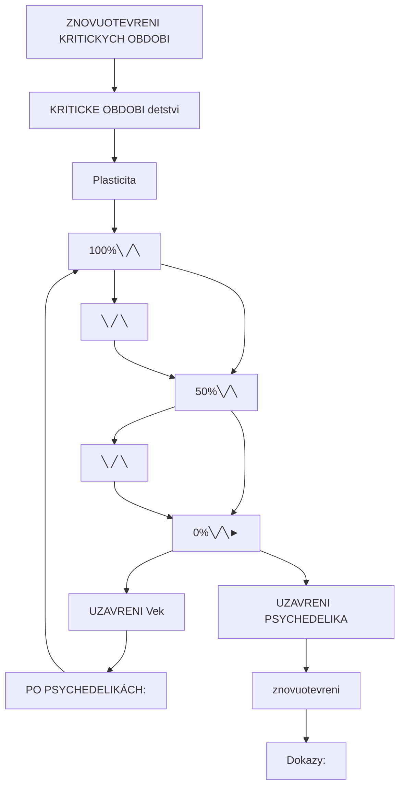

<details>
<summary>ASCII verze diagramu</summary>

```
    ZNOVUOTEVRENI KRITICKYCH OBDOBI

    KRITICKE OBDOBI (detstvi)
    Plasticita
       ↑
    100%├────╲
       │     ╲
    50%├──────╲───────────
       │       ╲
     0%├────────╲────────────►
              UZAVRENI    Vek

    PO PSYCHEDELIKÁCH:
    Plasticita
       ↑
    100%├────╲         ╱╲
       │     ╲       ╱  ╲
    50%├──────╲─────╱────╲───
       │       ╲   ╱      ╲
     0%├────────╲─╱────────╲─►
              UZAVRENI  PSYCHEDELIKA
                       (znovuotevreni)

    Dokazy:
    - Ly et al. (2018): Obnoveni okuarni dominance u dospelych mysi
    - Nardou et al. (2019): MDMA znovuotevira socialni kriticke obdobi
    - Klinické studie: Zvýšená terapeutická odpoved po psychedelikách
```

</details>

---

## Poruchy uceni

### Klasifikace

| Porucha | Postizena oblast | Projevy |
|---------|------------------|---------|
| **Dyslexie** | Fonologicke zpracovani | Potize se ctenim |
| **Dysgrafie** | Grafomotorika | Potize s psanim |
| **Dyskalkulie** | Numerická kognice | Potize s matematkou |
| **ADHD** | Exekutivni funkce | Pozornost, impulzivita |
| **Poruchy pameti** | Hipokampus, MTL | Amnezie |

### Neurodegenerace a uceni

| Onemocneni | Postizeny system | Typ poruchy uceni |
|------------|------------------|-------------------|
| Alzheimerova choroba | Hipokampus, ACh | Epizodická pamet |
| Parkinsonova choroba | Bazalni ganglia | Proceduralni uceni |
| Huntingtonova choroba | Striatum | Implicitni uceni |
| Korsakuv syndrom | Thalamus, mamil. teliska | Anterográdní amnezie |

---

## Faktory ovlivnujici uceni

### Pozitivni faktory

| Faktor | Mechanismus | Doporuceni |
|--------|-------------|------------|
| **Spanek** | Konsolidace, SWR | 7-9 hodin |
| **Cviceni** | BDNF ↑, neurogeneze | 150 min/tyden aerobni |
| **Vyziva** | Omega-3, antioxidanty | Stredomorska dieta |
| **Socialni interakce** | Oxytocin, stimulace | Aktivni spolecensky zivot |
| **Retrieval practice** | Testovani > ctení | Aktivni vybavovani |
| **Spaced repetition** | Rozlozeni v case | Anki, SRS systemy |
| **Elaborace** | Hloubkove zpracovani | Propojeni s existujicimi znalostmi |

### Negativni faktory

| Faktor | Mechanismus | Dopad |
|--------|-------------|-------|
| **Chronicky stres** | Kortizol ↑, BDNF ↓ | Atrofie hipokampu |
| **Spankova deprivace** | Narusena konsolidace | Kognitivni deficit |
| **Alkohol** | GABA-A, NMDA blokada | Blackout, amnezie |
| **Chronicky kanabis** | CB1 dysregulace | Narusená pracovní pamet |
| **Multitasking** | Fragmentace pozornosti | Povrchní kodování |
| **Pasivni konzumace** | Minimalni elaborace | Slabe uceni |

---

## Mereni uceni

### Behavioralni testy

| Test | Co meri | Oblast |
|------|---------|--------|
| **Morris water maze** | Prostorové uceni | Hipokampus |
| **Novel object recognition** | Rozpoznávací pamet | Perirhinální kortex |
| **Fear conditioning** | Klasické podminovani | Amygdala |
| **Radial arm maze** | Prostorová pracovní pamet | Hipokampus, PFC |
| **T-maze** | Alternace, pravidla | PFC |

### Elektrofyziologicke metody

| Metoda | Co meri | Casové rozliseni |
|--------|---------|------------------|
| Extracelulární záznamy | Neuronální aktivita | ms |
| Patch-clamp | Synaptické proudy | ms |
| LFP | Lokální pole | ms |
| EEG | Kortikální aktivita | ms |
| Kalciové zobrazování | Populacni aktivita | s |

### Molekulárni markery

| Marker | Indikuje | Metoda detekce |
|--------|----------|----------------|
| c-fos | Neuronální aktivace | IHC, ISH |
| Arc | Synaptická plasticita | IHC, Western blot |
| pCREB | Genová aktivace | Western blot |
| BDNF | Neurotrofni aktivita | ELISA |
| Synaptofyzin | Synaptická hustota | IHC |

---

## Reference

### Zakladni literatura

1. Kandel, E.R. (2001). *The molecular biology of memory storage: a dialogue between genes and synapses*. Science.

2. Bliss, T.V. & Collingridge, G.L. (1993). *A synaptic model of memory: long-term potentiation in the hippocampus*. Nature.

3. Hebb, D.O. (1949). *The Organization of Behavior*. Wiley.

### Synapticka plasticita

4. Malenka, R.C. & Bear, M.F. (2004). *LTP and LTD: an embarrassment of riches*. Neuron.

5. Caporale, N. & Dan, Y. (2008). *Spike timing-dependent plasticity: a Hebbian learning rule*. Annual Review of Neuroscience.

### Konsolidace pameti

6. Squire, L.R. & Alvarez, P. (1995). *Retrograde amnesia and memory consolidation: a neurobiological perspective*. Current Opinion in Neurobiology.

7. Diekelmann, S. & Born, J. (2010). *The memory function of sleep*. Nature Reviews Neuroscience.

### Psychedelika a uceni

8. Ly, C. et al. (2018). *Psychedelics Promote Structural and Functional Neural Plasticity*. Cell Reports.

9. Carhart-Harris, R.L. & Nutt, D.J. (2017). *Serotonin and brain function: a tale of two receptors*. Journal of Psychopharmacology.

---

## Viz take

### Receptory a signalizace
- [NMDA receptor](@/receptors/nmda.md) - "Koincidencni detektor" pro LTP
- [GABA-A receptor](@/receptors/gaba-a.md) - Inhibicni kontrola
- [5-HT2A receptor](@/receptors/5-ht2a.md) - Cil psychedelik
- [Glutamat](@/glossary/glutamat.md) - Hlavni excitacni neurotransmiter

### Neurobiologie
- [Neuroplasticita](@/glossary/neuroplasticita.md) - Zmeny v mozku
- [Synapse](@/glossary/synapse.md) - Misto prenosu signalu
- [Default Mode Network](@/circuits/dmn.md) - Self-referential processing

### Psychoaktivni latky
- [Psilocybin](@/alkaloids/psilocybin.md) - Psychoplastogen
- [LSD](@/alkaloids/lsd.md) - Potentni induktor plasticity
- [DMT](@/alkaloids/dmt.md) - Endogenni psychoplastogen
- [Psychedelikum](@/glossary/psychedelikum.md) - Prehled

### Mozkove struktury
- [Mozek](@/brain/_index.md) - Anatomie
- [Neuralni okruhy](@/circuits/_index.md) - Funkcni site

---

<- Zpet na [Glosar](@/glossary/_index.md)
